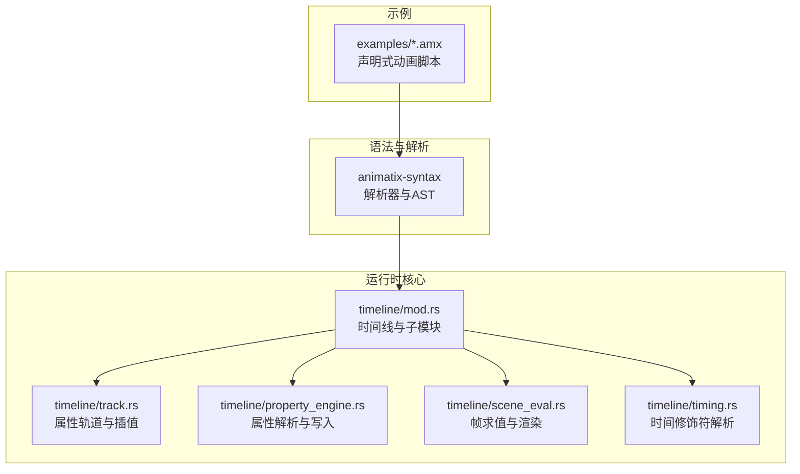
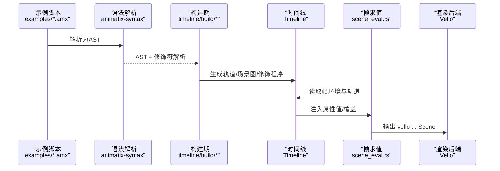
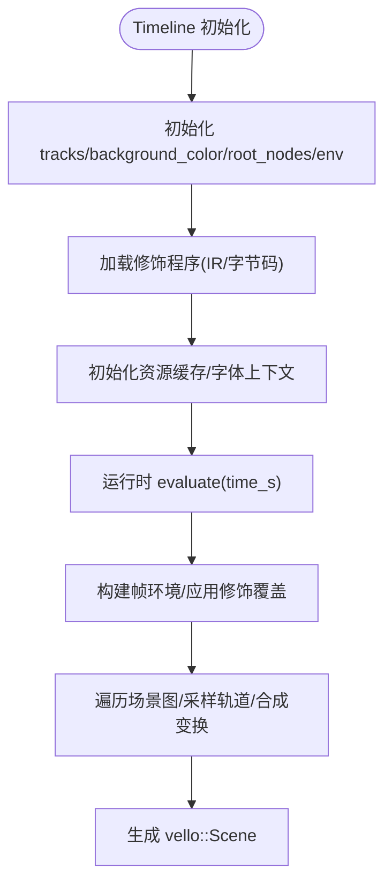
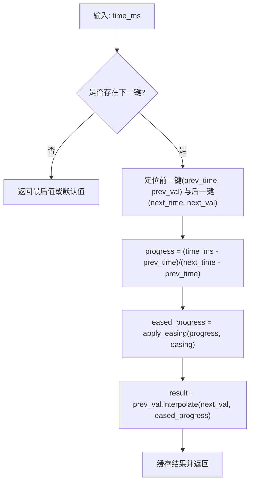
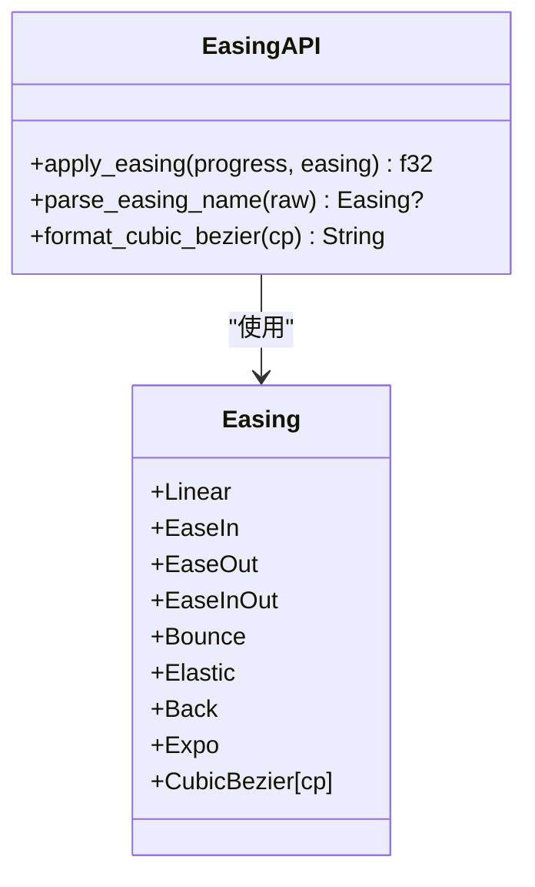
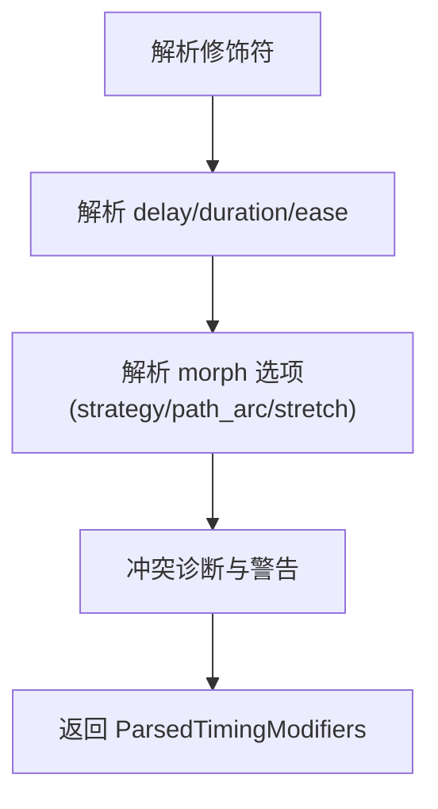
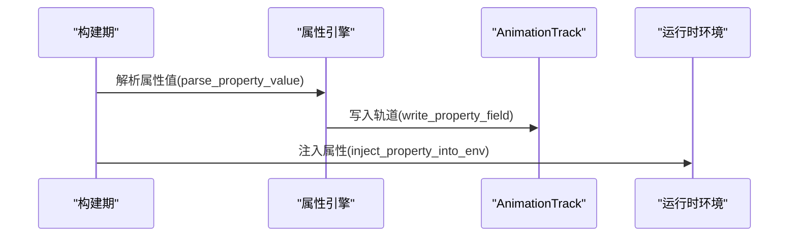
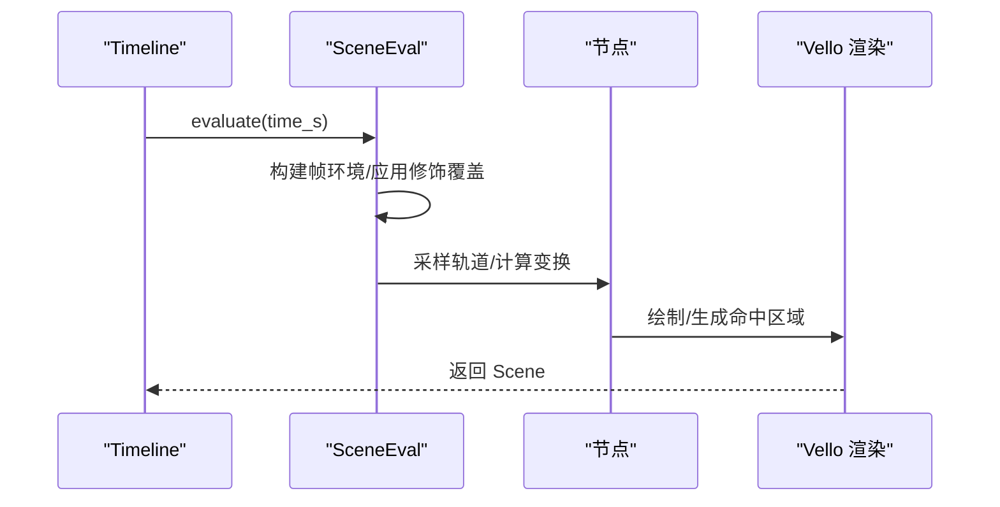
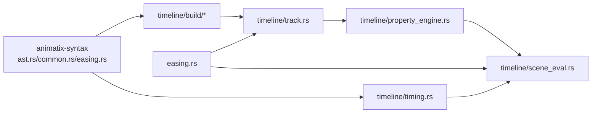

# 声明式动画原理

<cite>
**本文引用的文件**
- [lib.rs](file://crates/animatix/src/lib.rs)
- [mod.rs](file://crates/animatix/src/timeline/mod.rs)
- [timing.rs](file://crates/animatix/src/timeline/timing.rs)
- [property_engine.rs](file://crates/animatix/src/timeline/property_engine.rs)
- [scene_eval.rs](file://crates/animatix/src/timeline/scene_eval.rs)
- [track.rs](file://crates/animatix/src/timeline/track.rs)
- [build/mod.rs](file://crates/animatix/src/timeline/build/mod.rs)
- [easing.rs](file://crates/animatix-syntax/src/easing.rs)
- [common.rs](file://crates/animatix-syntax/src/parser/common.rs)
- [ast.rs](file://crates/animatix-syntax/src/ast.rs)
- [00_hello.amx](file://examples/00_hello.amx)
- [01_shapes.amx](file://examples/01_shapes.amx)
- [03_timing.amx](file://examples/03_timing.amx)
- [04_motion.amx](file://examples/04_motion.amx)
- [05_morph.amx](file://examples/05_morph.amx)
</cite>

## 目录
1. [引言](#引言)
2. [项目结构](#项目结构)
3. [核心组件](#核心组件)
4. [架构总览](#架构总览)
5. [详细组件分析](#详细组件分析)
6. [依赖关系分析](#依赖关系分析)
7. [性能考量](#性能考量)
8. [故障排查指南](#故障排查指南)
9. [结论](#结论)
10. [附录](#附录)

## 引言
本文件系统性阐述 Animatix 的声明式动画原理与实现。Animatix 使用“时间线（Timeline）”作为核心数据结构，将动画以“关键帧 + 插值 + 时间修饰符”的方式建模；通过“属性轨道（PropertyTrack）”记录每个可动画属性在时间轴上的变化，并由“属性引擎（PropertyEngine）”统一解析与写入；运行时由“场景求值器（SceneEval）”在每一帧采样轨道，结合“缓动函数（Easing）”与“布局/定位规则”生成最终渲染结果。

声明式语法允许开发者以“DSL（领域特定语言）”直接描述动画序列：时间点、动作、缓动、延迟、交错与顺序等，无需关心底层插值细节。这种范式将复杂度隐藏在引擎内部，使创作者能以更少的样板代码表达丰富的动画行为。

## 项目结构
Animatix 的核心位于 crates/animatix/src/timeline 下，包含构建期（AST 降级）、运行时（帧采样与渲染）两大阶段，以及支撑模块如属性引擎、缓动、布局、路径插值等。

图表来源
- [lib.rs:1-24](file://crates/animatix/src/lib.rs#L1-L24)
- [mod.rs:1-100](file://crates/animatix/src/timeline/mod.rs#L1-L100)
- [track.rs:438-537](file://crates/animatix/src/timeline/track.rs#L438-L537)
- [property_engine.rs:1-120](file://crates/animatix/src/timeline/property_engine.rs#L1-L120)
- [scene_eval.rs:68-181](file://crates/animatix/src/timeline/scene_eval.rs#L68-L181)
- [timing.rs:283-587](file://crates/animatix/src/timeline/timing.rs#L283-L587)

章节来源
- [lib.rs:1-24](file://crates/animatix/src/lib.rs#L1-L24)
- [mod.rs:1-100](file://crates/animatix/src/timeline/mod.rs#L1-L100)

## 核心组件
- 时间线（Timeline）
  - 编译产物：场景图（父子层级）+ 每个演员的关键帧轨道 + 环境变量 + 可选的修饰程序（IR/字节码）。
  - 运行时职责：按帧采样轨道、执行 always 修饰块、处理锚点/百分比定位、组装渲染场景。
- 属性轨道（PropertyTrack<T>）
  - 存储键值对：时间戳（毫秒）→（值, 缓动），默认值用于无键值时回退。
  - 提供 evaluate/evaluate_copy/is_currently_animating 等查询接口。
- 属性引擎（PropertyEngine）
  - 统一解析表达式为具体属性值（PropertyValue），并写入对应轨道字段。
  - 支持覆盖优先级（修饰块 overrides）与注入环境变量（注入到运行时环境）。
- 场景求值（SceneEval）
  - 递归遍历场景图，计算每个节点的局部/世界变换、可见性裁剪、命中区域、调试覆盖层。
  - 调用原语渲染或命令执行路径，输出 vello::Scene。
- 时间修饰符（Timing）
  - 解析 delay/duration/ease 等修饰符，支持策略型 morph 选项与交错/顺序组合。
- 缓动函数（Easing）
  - 内置 Linear/EaseIn/EaseOut/EaseInOut/Bounce/Elastic/Back/Expo/CubicBezier。
  - 提供 apply_easing(progress, easing) 将线性进度映射为非线性进度。

章节来源
- [mod.rs:431-502](file://crates/animatix/src/timeline/mod.rs#L431-L502)
- [track.rs:438-537](file://crates/animatix/src/timeline/track.rs#L438-L537)
- [property_engine.rs:113-262](file://crates/animatix/src/timeline/property_engine.rs#L113-L262)
- [scene_eval.rs:68-181](file://crates/animatix/src/timeline/scene_eval.rs#L68-L181)
- [timing.rs:283-587](file://crates/animatix/src/timeline/timing.rs#L283-L587)
- [easing.rs:6-30](file://crates/animatix-syntax/src/easing.rs#L6-L30)

## 架构总览
Animatix 的声明式动画以“时间线”为中心，构建期将 DSL 语句转换为 Timeline，运行时按帧采样并渲染。

图表来源
- [build/mod.rs:1-55](file://crates/animatix/src/timeline/build/mod.rs#L1-L55)
- [mod.rs:1-100](file://crates/animatix/src/timeline/mod.rs#L1-L100)
- [scene_eval.rs:700-800](file://crates/animatix/src/timeline/scene_eval.rs#L700-L800)

## 详细组件分析

### 时间线与时间轴结构
- Timeline 结构体持有：
  - tracks（BTreeMap）：按标签索引的 AnimationTrack 列表
  - background_color：背景色轨道
  - root_nodes：根节点列表
  - env/env_base：运行时环境与基础条目
  - modifier_programs/bytecode：修饰程序（IR/字节码）
  - colorscheme/asset_cache/font_context：渲染资源
  - 默认透明度、容器元数据、布局引擎、动态布局开关
  - 变量轨道（let 在关键帧内声明的变量）、音频片段、动作事件、静态子树缓存、帧缓存、命中区域等
- 关键帧时间收集与持续时间：
  - duration_seconds：基于所有轨道的最大键时刻推导
  - keyframe_times_s：汇总所有轨道键时刻（几何/样式/文本/矢量路径/图像等）

图表来源
- [mod.rs:554-598](file://crates/animatix/src/timeline/mod.rs#L554-L598)
- [mod.rs:600-677](file://crates/animatix/src/timeline/mod.rs#L600-L677)

章节来源
- [mod.rs:431-502](file://crates/animatix/src/timeline/mod.rs#L431-L502)
- [mod.rs:600-677](file://crates/animatix/src/timeline/mod.rs#L600-L677)

### 关键帧动画与属性插值
- PropertyTrack<T>
  - 键值：时间戳（毫秒）→ (值, 缓动)
  - evaluate/evaluate_copy：二分查找前后键，计算进度 t，应用缓动，再线性插值
  - is_currently_animating：判断是否处于真实动画区间（非线性缓动）
- Interpolate trait
  - f32/Vec2/Vec4/Transform/字符串/向量等类型实现插值
- 插值流程（含缓动）：

图表来源
- [track.rs:461-514](file://crates/animatix/src/timeline/track.rs#L461-L514)
- [easing.rs:55-105](file://crates/animatix-syntax/src/easing.rs#L55-L105)

章节来源
- [track.rs:438-537](file://crates/animatix/src/timeline/track.rs#L438-L537)
- [easing.rs:55-105](file://crates/animatix-syntax/src/easing.rs#L55-L105)

### 缓动函数体系
- 内置缓动：Linear、EaseIn、EaseOut、EaseInOut、Bounce、Elastic、Back、Expo、CubicBezier
- apply_easing 将 [0,1] 映射到 [0,1] 的非线性曲线
- CubicBezier 通过二分搜索反算 t 再求 y

图表来源
- [easing.rs:6-30](file://crates/animatix-syntax/src/easing.rs#L6-L30)
- [easing.rs:147-174](file://crates/animatix-syntax/src/easing.rs#L147-L174)

章节来源
- [easing.rs:55-105](file://crates/animatix-syntax/src/easing.rs#L55-L105)

### 修饰符与时间修饰（delay/duration/ease/morph）
- timing 模块解析修饰符，支持：
  - delay：延迟开始
  - ease：缓动名称或自定义贝塞尔
  - strategy/path_arc/stretch：morph 专用
  - duration 简写与冲突检测
- 支持 stagger（交错）与 sequence（顺序）组合

图表来源
- [timing.rs:283-587](file://crates/animatix/src/timeline/timing.rs#L283-L587)

章节来源
- [timing.rs:1-588](file://crates/animatix/src/timeline/timing.rs#L1-L588)

### 属性解析与写入（PropertyEngine）
- parse_property_value：根据期望类型（ValueType）解析 Expr
- write_property_field：统一写入轨道字段，处理快照起始、延迟保留、结束键写入
- inject_property_into_env：将属性注入运行时环境，支持子键（如 .x/.y/.r/.g/.b/.a）

图表来源
- [property_engine.rs:90-121](file://crates/animatix/src/timeline/property_engine.rs#L90-L121)
- [property_engine.rs:588-643](file://crates/animatix/src/timeline/property_engine.rs#L588-L643)

章节来源
- [property_engine.rs:85-121](file://crates/animatix/src/timeline/property_engine.rs#L85-L121)
- [property_engine.rs:588-643](file://crates/animatix/src/timeline/property_engine.rs#L588-L643)

### 帧求值与渲染（SceneEval）
- evaluate：按时间采样，构建帧环境，执行修饰程序（IR/字节码/AST 回退），采样轨道，合成变换，输出 vello::Scene
- evaluate_node：递归渲染节点，处理可见性裁剪、命中区域、调试覆盖层
- 修饰覆盖：always 块中的表达式可覆盖空间属性（position/rotation/scale/opacity/size/transform）

图表来源
- [scene_eval.rs:700-800](file://crates/animatix/src/timeline/scene_eval.rs#L700-L800)
- [scene_eval.rs:238-258](file://crates/animatix/src/timeline/scene_eval.rs#L238-L258)

章节来源
- [scene_eval.rs:68-181](file://crates/animatix/src/timeline/scene_eval.rs#L68-L181)
- [scene_eval.rs:700-800](file://crates/animatix/src/timeline/scene_eval.rs#L700-L800)

### 绝对时间与相对时间
- 绝对时间：以毫秒为单位的全局时间戳，用于键时刻与帧采样
- 相对时间：在时间修饰符中使用“+”前缀表示相对于当前时间点的偏移（例如 #+0.3s）
- 示例脚本展示了绝对时间标记（#Xs）与相对时间偏移（#+Ys）的混用

章节来源
- [00_hello.amx:11-22](file://examples/00_hello.amx#L11-L22)
- [03_timing.amx:12-35](file://examples/03_timing.amx#L12-L35)
- [04_motion.amx:9-44](file://examples/04_motion.amx#L9-L44)

### 从简单到复杂的动画创建示例
- 简单：标题卡片淡入（绝对时间标记 + 缓动）
  - 示例路径：[00_hello.amx:11-22](file://examples/00_hello.amx#L11-L22)
- 形状与媒体：网格展示多种原语 + 交错淡入
  - 示例路径：[01_shapes.amx:20-33](file://examples/01_shapes.amx#L20-L33)
- 时间编排：交错（stagger）与顺序（sequence） + 多种缓动
  - 示例路径：[03_timing.amx:12-35](file://examples/03_timing.amx#L12-L35)
- 变换动画：平移、旋转、缩放、颜色过渡 + 响应式轨道（always）
  - 示例路径：[04_motion.amx:13-44](file://examples/04_motion.amx#L13-L44)
- 形变动画：多段形状互转（自动/匹配/淡出/最近策略 + 路径弧度提示/拉伸）
  - 示例路径：[05_morph.amx:17-36](file://examples/05_morph.amx#L17-L36)

章节来源
- [00_hello.amx:1-22](file://examples/00_hello.amx#L1-L22)
- [01_shapes.amx:1-46](file://examples/01_shapes.amx#L1-L46)
- [03_timing.amx:1-35](file://examples/03_timing.amx#L1-L35)
- [04_motion.amx:1-44](file://examples/04_motion.amx#L1-L44)
- [05_morph.amx:1-41](file://examples/05_morph.amx#L1-L41)

## 依赖关系分析
- 语法层（animatix-syntax）
  - 提供 AST 定义与解析器工厂（common.rs），支持标识符、时间字面量、修饰符等
  - easing.rs 提供缓动枚举与解析
- 运行时层（animatix）
  - timeline/mod.rs 汇聚各子模块（build/track/property_engine/scene_eval/timing）
  - track.rs 定义属性轨道与插值
  - property_engine.rs 实现属性解析与写入
  - scene_eval.rs 实现帧求值与渲染
  - timing.rs 解析时间修饰符
  - easing.rs 为插值提供缓动

图表来源
- [ast.rs:101-154](file://crates/animatix-syntax/src/ast.rs#L101-L154)
- [common.rs:142-158](file://crates/animatix-syntax/src/parser/common.rs#L142-L158)
- [easing.rs:55-105](file://crates/animatix-syntax/src/easing.rs#L55-L105)
- [build/mod.rs:1-55](file://crates/animatix/src/timeline/build/mod.rs#L1-L55)
- [timing.rs:283-587](file://crates/animatix/src/timeline/timing.rs#L283-L587)
- [track.rs:438-537](file://crates/animatix/src/timeline/track.rs#L438-L537)
- [property_engine.rs:90-121](file://crates/animatix/src/timeline/property_engine.rs#L90-L121)
- [scene_eval.rs:700-800](file://crates/animatix/src/timeline/scene_eval.rs#L700-L800)

章节来源
- [lib.rs:1-24](file://crates/animatix/src/lib.rs#L1-L24)
- [mod.rs:1-100](file://crates/animatix/src/timeline/mod.rs#L1-L100)

## 性能考量
- 帧缓存与静态子树缓存
  - frame_cache：当时间/尺寸/修饰/动态布局/子序变更均未改变时复用 Scene
  - static_subtree_cache：完全静态子树复用 vello::Scene
- 轨道缓存与记忆化
  - transform_cache：同一 (time_ms, parent_transform_coeffs) 避免重复采样
  - PropertyTrack.evaluate_with 记忆化上次结果
- 可视性裁剪与边界盒估算
  - 视口相交测试避免离屏绘制
- 动态布局与子序插值
  - child_orders 轨道在时间点之间插值，保证容器布局动画顺滑
- 构建质量等级（BuildQuality）
  - Draft/Preview/Production 影响绘图采样精度与速度权衡

章节来源
- [mod.rs:466-478](file://crates/animatix/src/timeline/mod.rs#L466-L478)
- [track.rs:478-514](file://crates/animatix/src/timeline/track.rs#L478-L514)
- [scene_eval.rs:373-393](file://crates/animatix/src/timeline/scene_eval.rs#L373-L393)

## 故障排查指南
- 修饰符冲突与非法值
  - duration/delay/ease 等修饰符冲突会触发诊断（错误/警告）
  - 不支持的修饰键或值类型会给出明确提示
- 目标路径未知
  - 分配目标无法解析到已声明演员/嵌套标签时，会记录诊断并忽略该分配
- 缓动名称解析失败
  - 传入未知缓动名时解析为 None，建议检查拼写或使用内置名称
- 修改器错误
  - 修饰程序（IR/字节码/AST）执行错误会被收集为运行时诊断

章节来源
- [timing.rs:30-79](file://crates/animatix/src/timeline/timing.rs#L30-L79)
- [timing.rs:147-179](file://crates/animatix/src/timeline/timing.rs#L147-L179)
- [scene_eval.rs:796-800](file://crates/animatix/src/timeline/scene_eval.rs#L796-L800)

## 结论
Animatix 通过“时间线 + 属性轨道 + 属性引擎 + 帧求值 + 缓动函数”的组合，实现了声明式动画的完整闭环。其 DSL 将复杂的时间编排、缓动与属性插值抽象为简洁的语法，配合构建期与运行时的优化策略，既保证了创作效率也兼顾了性能表现。示例脚本覆盖了从基础淡入到复合形变与响应式轨道的典型场景，展示了声明式范式的强大表达力。

## 附录
- 语法要点
  - 时间标记：#Xs（绝对）与 #+Ys（相对）
  - 修饰符：[duration, delay, ease, strategy/path_arc/stretch...]
  - 响应式：always 块内使用 scene.t 等变量驱动属性
- 参考示例
  - [00_hello.amx:1-22](file://examples/00_hello.amx#L1-L22)
  - [01_shapes.amx:1-46](file://examples/01_shapes.amx#L1-L46)
  - [03_timing.amx:1-35](file://examples/03_timing.amx#L1-L35)
  - [04_motion.amx:1-44](file://examples/04_motion.amx#L1-L44)
  - [05_morph.amx:1-41](file://examples/05_morph.amx#L1-L41)