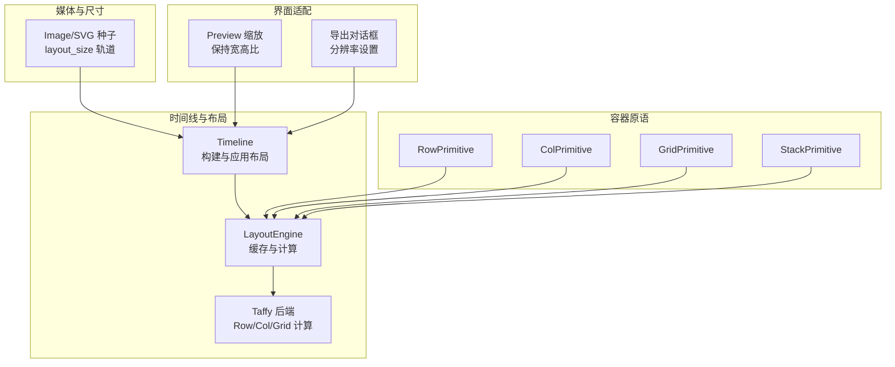
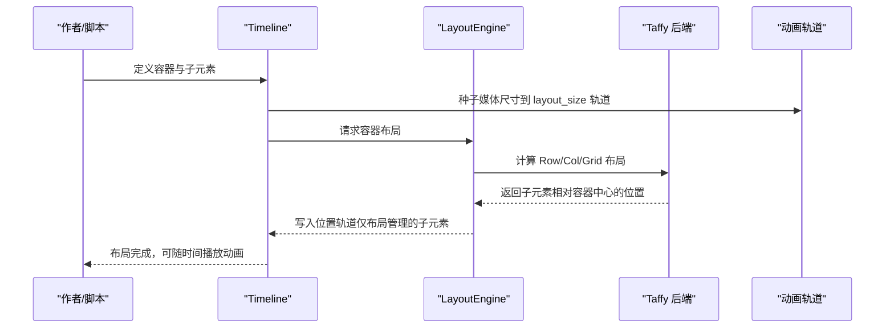
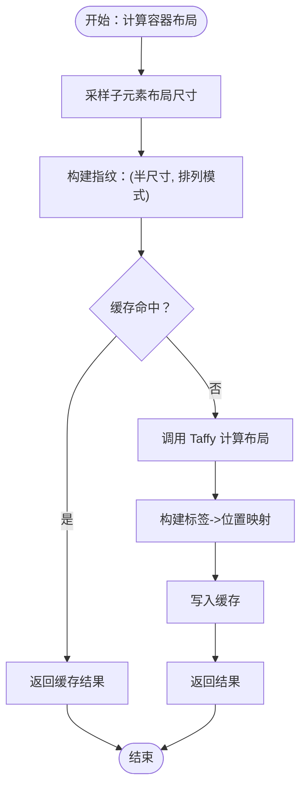
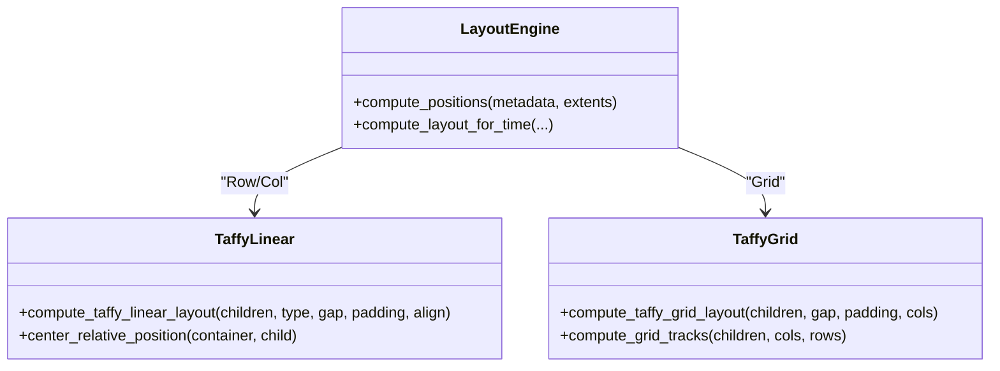
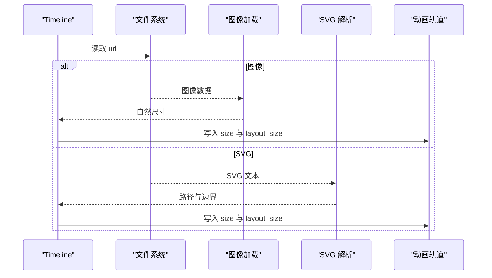
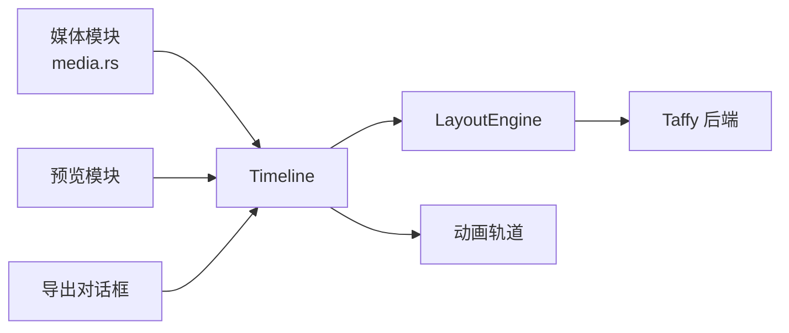

# 响应式设计

<cite>
**本文引用的文件**
- [crates/animatix/src/timeline/layout.rs](file://crates/animatix/src/timeline/layout.rs)
- [crates/animatix/src/timeline/taffy_layout.rs](file://crates/animatix/src/timeline/taffy_layout.rs)
- [crates/animatix/src/timeline/media.rs](file://crates/animatix/src/timeline/media.rs)
- [crates/animatix/src/primitives/grid.rs](file://crates/animatix/src/primitives/grid.rs)
- [crates/animatix/src/primitives/row.rs](file://crates/animatix/src/primitives/row.rs)
- [crates/animatix/src/primitives/col.rs](file://crates/animatix/src/primitives/col.rs)
- [crates/animatix/src/primitives/stack.rs](file://crates/animatix/src/primitives/stack.rs)
- [examples/02_layout.amx](file://examples/02_layout.amx)
- [docs/primitives.md](file://docs/primitives.md)
- [crates/animatix-gui/src/app/preview/mod.rs](file://crates/animatix-gui/src/app/preview/mod.rs)
- [crates/animatix-gui/src/app/shell/export_dialog.rs](file://crates/animatix-gui/src/app/shell/export_dialog.rs)
</cite>

## 目录
1. [简介](#简介)
2. [项目结构](#项目结构)
3. [核心组件](#核心组件)
4. [架构总览](#架构总览)
5. [详细组件分析](#详细组件分析)
6. [依赖关系分析](#依赖关系分析)
7. [性能考量](#性能考量)
8. [故障排查指南](#故障排查指南)
9. [结论](#结论)
10. [附录](#附录)

## 简介
本文件系统性阐述 Animatix 的响应式布局与设计体系，重点覆盖以下主题：
- 声明期测量与放置的布局契约：容器在声明时完成布局计算，动画属性变化不触发重排。
- 断点系统与流式布局：通过容器属性（如 gap、padding、align）与网格列数（cols）实现“流式”与“栅格化”的组合式响应策略。
- 弹性网格与自适应：基于 Taffy 引擎的弹性布局能力，结合容器默认对齐与间隙策略，形成可预测的弹性网格。
- 尺寸与密度适配：通过媒体资源的内在尺寸与场景分辨率，驱动布局尺寸与预览缩放；导出对话框支持分辨率定制以适配不同终端。
- 实战示例：包含移动端小屏、平板中屏与桌面大屏的适配思路与建议。
- 性能优化：缓存命中、避免每帧重算、媒体资源预采样等策略。
- 最佳实践与常见陷阱：明确何时使用自动布局、何时手动定位，以及如何避免布局抖动。

## 项目结构
Animatix 的响应式设计由“时间线布局引擎 + 容器原语 + 媒体尺寸种子 + 预览与导出适配”四部分协同实现：
- 时间线布局引擎：负责容器内子元素的声明期测量与放置，输出相对容器中心的坐标。
- 容器原语：Row/Col/Grid/Stack 提供不同的流式或网格化布局能力。
- 媒体尺寸种子：图像与 SVG 的内在尺寸被注入到布局尺寸轨道，作为布局输入。
- 预览与导出：预览器按场景宽高比进行统一缩放；导出对话框允许指定分辨率，从而影响最终密度与像素级表现。

图表来源
- [crates/animatix/src/timeline/layout.rs:107-200](file://crates/animatix/src/timeline/layout.rs#L107-L200)
- [crates/animatix/src/timeline/taffy_layout.rs:53-120](file://crates/animatix/src/timeline/taffy_layout.rs#L53-L120)
- [crates/animatix/src/primitives/row.rs:14-49](file://crates/animatix/src/primitives/row.rs#L14-L49)
- [crates/animatix/src/primitives/col.rs:14-49](file://crates/animatix/src/primitives/col.rs#L14-L49)
- [crates/animatix/src/primitives/grid.rs:14-50](file://crates/animatix/src/primitives/grid.rs#L14-L50)
- [crates/animatix/src/primitives/stack.rs:14-49](file://crates/animatix/src/primitives/stack.rs#L14-L49)
- [crates/animatix/src/timeline/media.rs:117-254](file://crates/animatix/src/timeline/media.rs#L117-L254)
- [crates/animatix-gui/src/app/preview/mod.rs:46-74](file://crates/animatix-gui/src/app/preview/mod.rs#L46-L74)
- [crates/animatix-gui/src/app/shell/export_dialog.rs:388-432](file://crates/animatix-gui/src/app/shell/export_dialog.rs#L388-L432)

章节来源
- [crates/animatix/src/timeline/layout.rs:1-310](file://crates/animatix/src/timeline/layout.rs#L1-L310)
- [crates/animatix/src/timeline/taffy_layout.rs:1-320](file://crates/animatix/src/timeline/taffy_layout.rs#L1-L320)
- [crates/animatix/src/timeline/media.rs:1-345](file://crates/animatix/src/timeline/media.rs#L1-L345)
- [crates/animatix/src/primitives/grid.rs:1-51](file://crates/animatix/src/primitives/grid.rs#L1-L51)
- [crates/animatix/src/primitives/row.rs:1-49](file://crates/animatix/src/primitives/row.rs#L1-L49)
- [crates/animatix/src/primitives/col.rs:1-49](file://crates/animatix/src/primitives/col.rs#L1-L49)
- [crates/animatix/src/primitives/stack.rs:1-49](file://crates/animatix/src/primitives/stack.rs#L1-L49)
- [examples/02_layout.amx:1-53](file://examples/02_layout.amx#L1-L53)
- [docs/primitives.md:381-428](file://docs/primitives.md#L381-L428)
- [crates/animatix-gui/src/app/preview/mod.rs:46-74](file://crates/animatix-gui/src/app/preview/mod.rs#L46-L74)
- [crates/animatix-gui/src/app/shell/export_dialog.rs:388-432](file://crates/animatix-gui/src/app/shell/export_dialog.rs#L388-L432)

## 核心组件
- 布局契约与缓存
  - 声明期测量与放置：容器在构建阶段一次性计算子元素位置，后续动画仅改变视觉属性，不触发重排。
  - 缓存键：基于子元素半尺寸与排列模式的指纹，避免重复计算。
- Taffy 引擎后端
  - Row/Col 使用 Flexbox，支持 gap、padding、align。
  - Grid 使用网格模板，按 cols 自动换行，gap/padding 参与尺寸计算。
- 容器原语
  - Row/Col：一维流式布局，支持对齐与间距。
  - Grid：二维结构化布局，支持列数与间距。
  - Stack：层叠布局，所有子元素相对原点叠加。
- 媒体尺寸种子
  - 图像与 SVG 的内在尺寸写入布局尺寸轨道，成为布局输入。
- 预览与导出
  - 预览器按场景宽高比进行统一缩放，保证内容“包含式”适配。
  - 导出对话框允许设定分辨率，从而控制像素密度与目标设备的呈现。

章节来源
- [crates/animatix/src/timeline/layout.rs:4-28](file://crates/animatix/src/timeline/layout.rs#L4-L28)
- [crates/animatix/src/timeline/layout.rs:86-200](file://crates/animatix/src/timeline/layout.rs#L86-L200)
- [crates/animatix/src/timeline/taffy_layout.rs:53-215](file://crates/animatix/src/timeline/taffy_layout.rs#L53-L215)
- [crates/animatix/src/timeline/media.rs:117-254](file://crates/animatix/src/timeline/media.rs#L117-L254)
- [crates/animatix-gui/src/app/preview/mod.rs:46-74](file://crates/animatix-gui/src/app/preview/mod.rs#L46-L74)
- [crates/animatix-gui/src/app/shell/export_dialog.rs:388-432](file://crates/animatix-gui/src/app/shell/export_dialog.rs#L388-L432)

## 架构总览
Animatix 的响应式布局采用“声明期布局 + 运行期渲染”的分层设计：
- 声明期：解析容器与子元素，测量内在尺寸，生成布局结果。
- 运行期：按时间采样布局结果，写入位置轨道，配合其他动画属性进行渲染。

图表来源
- [crates/animatix/src/timeline/layout.rs:202-309](file://crates/animatix/src/timeline/layout.rs#L202-L309)
- [crates/animatix/src/timeline/taffy_layout.rs:53-120](file://crates/animatix/src/timeline/taffy_layout.rs#L53-L120)
- [crates/animatix/src/timeline/media.rs:247-254](file://crates/animatix/src/timeline/media.rs#L247-L254)

## 详细组件分析

### 布局引擎与缓存（LayoutEngine）
- 设计要点
  - 布局是声明期行为，不随动画属性每帧重算。
  - 通过指纹缓存避免重复布局计算。
  - 仅对“布局管理”的子元素写入位置，手动子元素参与尺寸但不分配位置。
- 关键流程
  - 采样子元素在当前时刻的布局尺寸。
  - 构建指纹并查找缓存。
  - 若未命中，调用 Taffy 计算并写入缓存。
  - 将结果映射到子元素标签并返回。

图表来源
- [crates/animatix/src/timeline/layout.rs:107-200](file://crates/animatix/src/timeline/layout.rs#L107-L200)

章节来源
- [crates/animatix/src/timeline/layout.rs:86-200](file://crates/animatix/src/timeline/layout.rs#L86-L200)

### Taffy 引擎后端（Row/Col/Grid）
- Row/Col
  - 使用 Flexbox，支持方向、对齐、gap、padding。
  - 子元素尺寸来自布局尺寸轨道，位置转换为中心相对坐标。
- Grid
  - 按 cols 计算行列，gap/padding 参与网格尺寸。
  - 子元素按声明顺序填充网格单元，手动子元素仍参与尺寸计算。
- Stack
  - 所有子元素叠加于原点，不参与网格或流式布局。

图表来源
- [crates/animatix/src/timeline/taffy_layout.rs:53-215](file://crates/animatix/src/timeline/taffy_layout.rs#L53-L215)
- [crates/animatix/src/timeline/layout.rs:51-80](file://crates/animatix/src/timeline/layout.rs#L51-L80)

章节来源
- [crates/animatix/src/timeline/taffy_layout.rs:53-215](file://crates/animatix/src/timeline/taffy_layout.rs#L53-L215)
- [crates/animatix/src/timeline/layout.rs:51-80](file://crates/animatix/src/timeline/layout.rs#L51-L80)

### 容器原语（Row/Col/Grid/Stack）
- Row/Col
  - 属性：gap、padding、align。
  - 行列流式布局，适合横向导航、纵向列表等。
- Grid
  - 属性：cols、gap、padding。
  - 结构化二维布局，适合卡片网格、仪表盘等。
- Stack
  - 层叠布局，适合遮罩、装饰等叠加效果。
- 默认属性与文档
  - 文档明确各容器的默认属性与行为，便于一致性适配。

章节来源
- [crates/animatix/src/primitives/row.rs:14-49](file://crates/animatix/src/primitives/row.rs#L14-L49)
- [crates/animatix/src/primitives/col.rs:14-49](file://crates/animatix/src/primitives/col.rs#L14-L49)
- [crates/animatix/src/primitives/grid.rs:14-50](file://crates/animatix/src/primitives/grid.rs#L14-L50)
- [crates/animatix/src/primitives/stack.rs:14-49](file://crates/animatix/src/primitives/stack.rs#L14-L49)
- [docs/primitives.md:381-428](file://docs/primitives.md#L381-L428)

### 媒体尺寸种子与布局输入
- 图像与 SVG
  - 读取文件后测量内在尺寸，写入 size 与 layout_size 轨道。
  - 为后续布局提供可靠的尺寸输入，避免运行期动态测量带来的抖动。
- 错误处理
  - 文件读取与解析失败时记录诊断信息，不影响整体构建流程。

图表来源
- [crates/animatix/src/timeline/media.rs:80-115](file://crates/animatix/src/timeline/media.rs#L80-L115)
- [crates/animatix/src/timeline/media.rs:30-78](file://crates/animatix/src/timeline/media.rs#L30-L78)

章节来源
- [crates/animatix/src/timeline/media.rs:80-115](file://crates/animatix/src/timeline/media.rs#L80-L115)
- [crates/animatix/src/timeline/media.rs:30-78](file://crates/animatix/src/timeline/media.rs#L30-L78)

### 预览缩放与导出分辨率
- 预览缩放
  - 依据预览区域与场景尺寸，计算统一缩放因子，采用“包含式”适配，确保全场景可见。
- 导出分辨率
  - 支持手动设置宽度/高度，或一键套用场景尺寸，便于针对不同终端（移动端、桌面端）输出合适分辨率。

章节来源
- [crates/animatix-gui/src/app/preview/mod.rs:46-74](file://crates/animatix-gui/src/app/preview/mod.rs#L46-L74)
- [crates/animatix-gui/src/app/shell/export_dialog.rs:388-432](file://crates/animatix-gui/src/app/shell/export_dialog.rs#L388-L432)

## 依赖关系分析
- 组件耦合
  - LayoutEngine 依赖 Taffy 后端进行具体布局计算。
  - Timeline 在构建阶段调用 LayoutEngine，并将结果写入动画轨道。
  - 媒体模块为布局提供初始尺寸输入。
- 外部依赖
  - Taffy 引擎提供 Flexbox 与 Grid 的布局能力。
  - GUI 预览与导出模块负责最终呈现与密度控制。

图表来源
- [crates/animatix/src/timeline/layout.rs:35-35](file://crates/animatix/src/timeline/layout.rs#L35-L35)
- [crates/animatix/src/timeline/taffy_layout.rs:24-24](file://crates/animatix/src/timeline/taffy_layout.rs#L24-L24)
- [crates/animatix/src/timeline/media.rs:117-254](file://crates/animatix/src/timeline/media.rs#L117-L254)
- [crates/animatix-gui/src/app/preview/mod.rs:46-74](file://crates/animatix-gui/src/app/preview/mod.rs#L46-L74)
- [crates/animatix-gui/src/app/shell/export_dialog.rs:388-432](file://crates/animatix-gui/src/app/shell/export_dialog.rs#L388-L432)

章节来源
- [crates/animatix/src/timeline/layout.rs:35-35](file://crates/animatix/src/timeline/layout.rs#L35-L35)
- [crates/animatix/src/timeline/taffy_layout.rs:24-24](file://crates/animatix/src/timeline/taffy_layout.rs#L24-L24)
- [crates/animatix/src/timeline/media.rs:117-254](file://crates/animatix/src/timeline/media.rs#L117-L254)

## 性能考量
- 布局缓存
  - 通过指纹缓存避免重复计算，显著降低复杂场景下的 CPU 开销。
- 声明期布局
  - 不随动画属性每帧重算，减少运行期开销。
- 媒体尺寸预采样
  - 图像与 SVG 的内在尺寸提前注入轨道，避免运行期 IO 与测量。
- 预览缩放与导出
  - 预览采用统一缩放，避免频繁重算；导出分辨率可控，减少后期缩放成本。

章节来源
- [crates/animatix/src/timeline/layout.rs:134-200](file://crates/animatix/src/timeline/layout.rs#L134-L200)
- [crates/animatix/src/timeline/media.rs:80-115](file://crates/animatix/src/timeline/media.rs#L80-L115)
- [crates/animatix-gui/src/app/preview/mod.rs:46-74](file://crates/animatix-gui/src/app/preview/mod.rs#L46-L74)

## 故障排查指南
- 子元素未参与布局
  - 若子元素无布局尺寸，会被排除在布局集合之外，并产生诊断提示。
- 媒体加载失败
  - 图像/SVG 读取或解析失败会记录错误诊断，检查路径与格式。
- 预览显示异常
  - 检查场景尺寸与预览区域比例，确认缩放逻辑是否符合预期。

章节来源
- [crates/animatix/src/timeline/layout.rs:202-264](file://crates/animatix/src/timeline/layout.rs#L202-L264)
- [crates/animatix/src/timeline/media.rs:12-78](file://crates/animatix/src/timeline/media.rs#L12-L78)
- [crates/animatix-gui/src/app/preview/mod.rs:46-74](file://crates/animatix-gui/src/app/preview/mod.rs#L46-L74)

## 结论
Animatix 的响应式设计以“声明期布局 + 运行期渲染”为核心，结合 Taffy 的 Flexbox/Grid 能力与容器原语，提供了稳定、可预测且高性能的布局体验。通过媒体尺寸种子、统一预览缩放与可配置导出分辨率，系统能够覆盖从移动端到桌面端的多设备场景。遵循布局契约、善用缓存与容器属性，是实现高质量响应式设计的关键。

## 附录

### 实际示例：响应式布局实践
- 移动端适配
  - 使用较小 gap 与紧凑 padding，Grid 的 cols 设置为 2 或 3，Row/Col 用于单列信息流。
  - 示例参考：[examples/02_layout.amx:1-53](file://examples/02_layout.amx#L1-L53)
- 平板优化
  - Grid cols 提升至 3–4，Row/Col align 使用 center，提升视觉平衡感。
  - 示例参考：[examples/02_layout.amx:1-53](file://examples/02_layout.amx#L1-L53)
- 桌面端增强
  - Grid cols 可达 5+，配合较大的 gap 与 padding，突出层次与留白。
  - 导出分辨率建议使用更高 DPI，确保清晰度。

章节来源
- [examples/02_layout.amx:1-53](file://examples/02_layout.amx#L1-L53)
- [docs/primitives.md:381-428](file://docs/primitives.md#L381-L428)