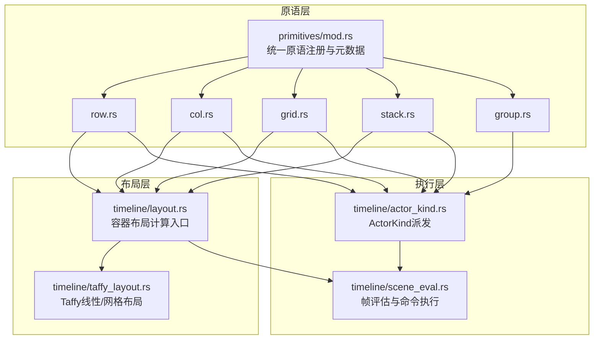
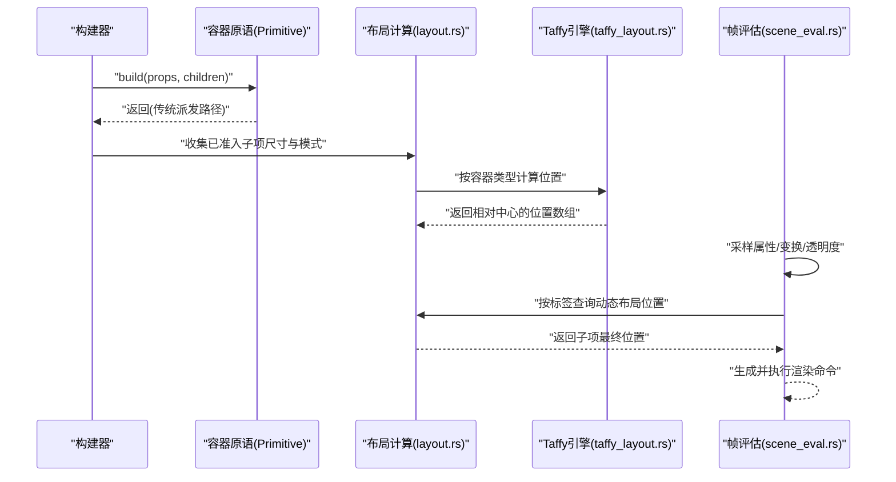
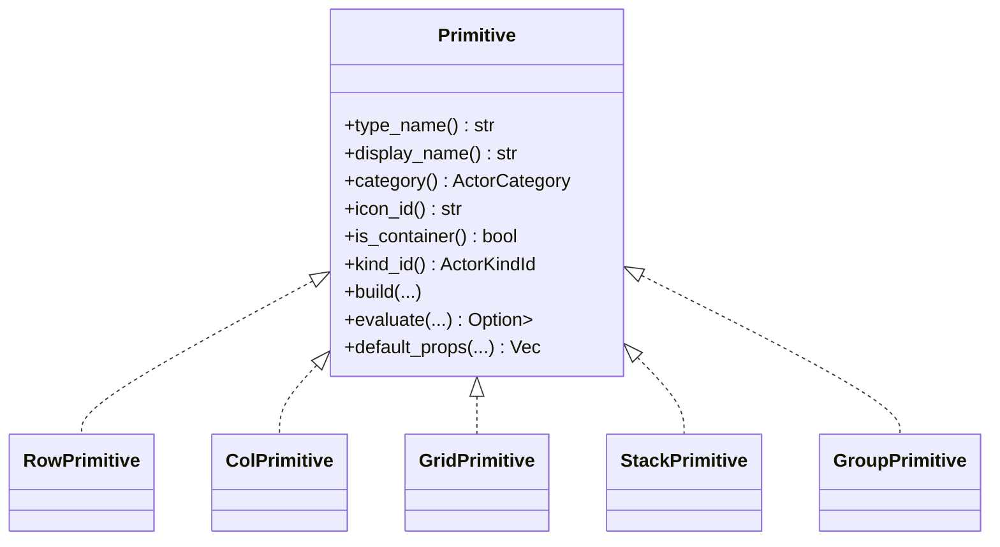
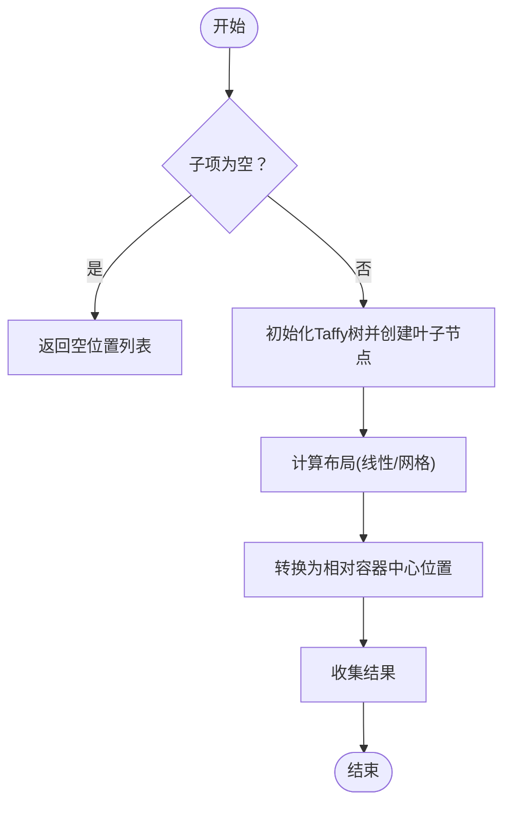
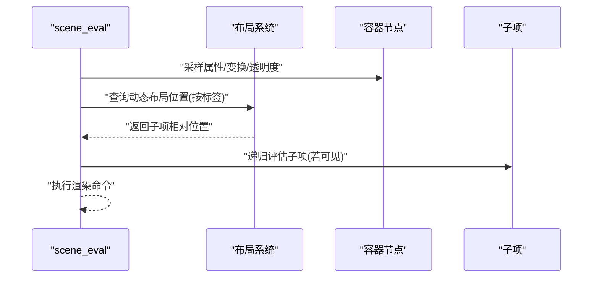
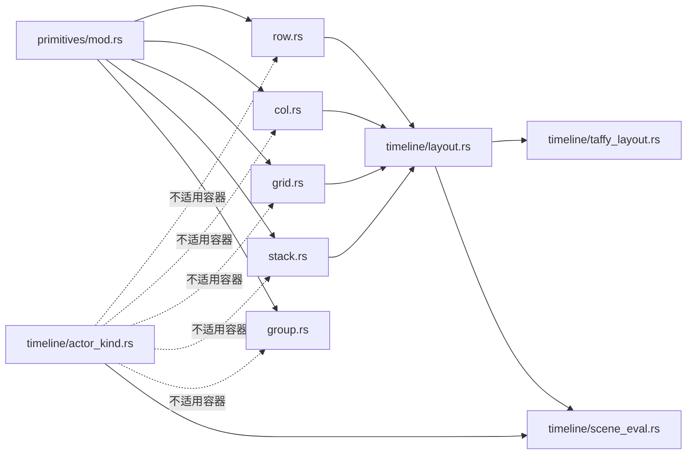

# 容器原语

<cite>
**本文引用的文件**
- [crates/animatix/src/primitives/mod.rs](file://crates/animatix/src/primitives/mod.rs)
- [crates/animatix/src/primitives/row.rs](file://crates/animatix/src/primitives/row.rs)
- [crates/animatix/src/primitives/col.rs](file://crates/animatix/src/primitives/col.rs)
- [crates/animatix/src/primitives/grid.rs](file://crates/animatix/src/primitives/grid.rs)
- [crates/animatix/src/primitives/stack.rs](file://crates/animatix/src/primitives/stack.rs)
- [crates/animatix/src/primitives/group.rs](file://crates/animatix/src/primitives/group.rs)
- [crates/animatix/src/timeline/layout.rs](file://crates/animatix/src/timeline/layout.rs)
- [crates/animatix/src/timeline/taffy_layout.rs](file://crates/animatix/src/timeline/taffy_layout.rs)
- [crates/animatix/src/timeline/actor_kind.rs](file://crates/animatix/src/timeline/actor_kind.rs)
- [crates/animatix/src/timeline/scene_eval.rs](file://crates/animatix/src/timeline/scene_eval.rs)
- [docs/primitives.md](file://docs/primitives.md)
- [docs/architecture.md](file://docs/architecture.md)
</cite>

## 目录
1. [引言](#引言)
2. [项目结构](#项目结构)
3. [核心组件](#核心组件)
4. [架构总览](#架构总览)
5. [详细组件分析](#详细组件分析)
6. [依赖分析](#依赖分析)
7. [性能考虑](#性能考虑)
8. [故障排查指南](#故障排查指南)
9. [结论](#结论)
10. [附录](#附录)

## 引言
本篇文档聚焦于 Animatix 的容器原语：Row（行）、Col（列）、Grid（网格）、Stack（堆叠）与 Group（分组）。我们将从设计理念、布局算法、属性配置、使用场景、父子关系与样式继承、组合模式与嵌套规则、到性能特性与最佳实践进行系统化梳理，并辅以可视化图示帮助读者快速理解与应用。

## 项目结构
容器原语作为“统一原语系统”的一部分，位于 primitives 模块中；其构建与评估逻辑由 Timeline 布局子系统与渲染执行管线共同完成。下图给出与容器相关的关键模块关系概览：

图表来源
- [crates/animatix/src/primitives/mod.rs:570-586](file://crates/animatix/src/primitives/mod.rs#L570-L586)
- [crates/animatix/src/timeline/layout.rs:107-132](file://crates/animatix/src/timeline/layout.rs#L107-L132)
- [crates/animatix/src/timeline/taffy_layout.rs:53-120](file://crates/animatix/src/timeline/taffy_layout.rs#L53-L120)
- [crates/animatix/src/timeline/actor_kind.rs:23-31](file://crates/animatix/src/timeline/actor_kind.rs#L23-L31)
- [crates/animatix/src/timeline/scene_eval.rs:282-318](file://crates/animatix/src/timeline/scene_eval.rs#L282-L318)

章节来源
- [crates/animatix/src/primitives/mod.rs:18-40](file://crates/animatix/src/primitives/mod.rs#L18-L40)

## 核心组件
- Row/Col/Grid/Stack/Group 均实现统一的 Primitive trait，具备类型名、显示名、分类、图标、是否容器、种类标识等元信息；默认属性在各自模块中定义；evaluate 返回空命令列表表示采用传统派发路径。
- 布局计算通过 timeline/layout.rs 聚合，内部根据容器类型调用 Taffy 计算（线性/网格），或对 Stack 特判。
- ActorKind 派发仅针对非形状与非容器类型生效；容器类原语由流程化的构建与评估路径处理。

章节来源
- [crates/animatix/src/primitives/row.rs:14-48](file://crates/animatix/src/primitives/row.rs#L14-L48)
- [crates/animatix/src/primitives/col.rs:14-48](file://crates/animatix/src/primitives/col.rs#L14-L48)
- [crates/animatix/src/primitives/grid.rs:14-49](file://crates/animatix/src/primitives/grid.rs#L14-L49)
- [crates/animatix/src/primitives/stack.rs:14-48](file://crates/animatix/src/primitives/stack.rs#L14-L48)
- [crates/animatix/src/primitives/group.rs:14-44](file://crates/animatix/src/primitives/group.rs#L14-L44)
- [crates/animatix/src/timeline/layout.rs:107-132](file://crates/animatix/src/timeline/layout.rs#L107-L132)
- [crates/animatix/src/timeline/taffy_layout.rs:53-120](file://crates/animatix/src/timeline/taffy_layout.rs#L53-L120)
- [crates/animatix/src/timeline/actor_kind.rs:23-31](file://crates/animatix/src/timeline/actor_kind.rs#L23-L31)

## 架构总览
容器原语的运行时行为遵循“父驱动布局 + 明确的手工放置逃生舱口”的设计原则。PlacementMode 决定子项是被容器管理、场景相对定位还是手工绝对定位。容器在构建阶段不直接生成渲染命令，而是在帧评估阶段由布局系统产出位置并交由 scene_eval 执行。

图表来源
- [crates/animatix/src/timeline/layout.rs:107-132](file://crates/animatix/src/timeline/layout.rs#L107-L132)
- [crates/animatix/src/timeline/taffy_layout.rs:53-120](file://crates/animatix/src/timeline/taffy_layout.rs#L53-L120)
- [crates/animatix/src/timeline/scene_eval.rs:282-318](file://crates/animatix/src/timeline/scene_eval.rs#L282-L318)

章节来源
- [docs/architecture.md:113-139](file://docs/architecture.md#L113-L139)

## 详细组件分析

### Row 行容器
- 设计理念：沿水平方向线性排列子项，支持跨轴对齐与间距/内边距控制。
- 默认属性：gap、padding、align（start/center/end）。
- 布局算法：委托 Taffy 线性布局，按容器类型与参数计算子项相对容器中心的位置序列。
- 使用场景：工具栏、按钮行、卡片横向排列等。
- 组合与嵌套：可嵌套 Col/Stack/Grid；注意避免过度嵌套导致测量复杂度上升。
- 性能要点：合理设置 gap/padding，避免过大的子项尺寸差异引发频繁重排。

章节来源
- [crates/animatix/src/primitives/row.rs:14-48](file://crates/animatix/src/primitives/row.rs#L14-L48)
- [crates/animatix/src/timeline/layout.rs:51-68](file://crates/animatix/src/timeline/layout.rs#L51-L68)
- [crates/animatix/src/timeline/taffy_layout.rs:59-120](file://crates/animatix/src/timeline/taffy_layout.rs#L59-L120)
- [docs/primitives.md:385-392](file://docs/primitives.md#L385-L392)

### Col 列容器
- 设计理念：沿垂直方向线性排列子项，支持跨轴对齐与间距/内边距控制。
- 默认属性：gap、padding、align（start/center/end）。
- 布局算法：委托 Taffy 线性布局，按容器类型与参数计算子项相对容器中心的位置序列。
- 使用场景：侧边栏、纵向列表、表单字段堆叠等。
- 组合与嵌套：可嵌套 Row/Stack/Grid；注意列高与跨轴对齐策略。
- 性能要点：减少动态文本/图像尺寸变化，降低每帧测量成本。

章节来源
- [crates/animatix/src/primitives/col.rs:14-48](file://crates/animatix/src/primitives/col.rs#L14-L48)
- [crates/animatix/src/timeline/layout.rs:51-68](file://crates/animatix/src/timeline/layout.rs#L51-L68)
- [crates/animatix/src/timeline/taffy_layout.rs:59-120](file://crates/animatix/src/timeline/taffy_layout.rs#L59-L120)
- [docs/primitives.md:393-400](file://docs/primitives.md#L393-L400)

### Grid 网格容器
- 设计理念：二维结构化布局，按声明顺序填充至网格单元。
- 默认属性：gap、padding、align、cols（列数）。
- 布局算法：委托 Taffy 网格布局，先计算列宽/行高（基于子项最大尺寸），再按行列映射分配位置。
- 使用场景：仪表盘卡片网格、相册布局、规则化信息面板。
- 组合与嵌套：可嵌套 Row/Col/Stack/Grid；cols 变化会触发网格重排。
- 性能要点：固定 cols 并尽量保持子项尺寸一致，避免频繁尺寸抖动。

章节来源
- [crates/animatix/src/primitives/grid.rs:14-49](file://crates/animatix/src/primitives/grid.rs#L14-L49)
- [crates/animatix/src/timeline/layout.rs:122-129](file://crates/animatix/src/timeline/layout.rs#L122-L129)
- [crates/animatix/src/timeline/taffy_layout.rs:122-215](file://crates/animatix/src/timeline/taffy_layout.rs#L122-L215)
- [docs/primitives.md:406-415](file://docs/primitives.md#L406-L415)

### Stack 堆叠容器
- 设计理念：所有已准入子项共享同一原点，形成层叠布局，适合覆盖式 UI。
- 默认属性：gap、padding。
- 布局算法：纯函数计算，所有子项位置均为 [0,0]，后续由父容器或场景相对定位决定最终位置。
- 使用场景：模态遮罩下的弹窗、图层叠加、装饰元素覆盖。
- 组合与嵌套：可嵌套 Row/Col/Grid/Stack；注意层级顺序与点击区域。
- 性能要点：子项数量多时建议限制准入子项，避免过多绘制开销。

章节来源
- [crates/animatix/src/primitives/stack.rs:14-48](file://crates/animatix/src/primitives/stack.rs#L14-L48)
- [crates/animatix/src/timeline/layout.rs:45-49](file://crates/animatix/src/timeline/layout.rs#L45-L49)
- [docs/primitives.md:416-424](file://docs/primitives.md#L416-L424)

### Group 分组容器
- 设计理念：仅参与场景图与变换继承，不运行布局算法，适合逻辑分组与批量操作。
- 默认属性：无。
- 使用场景：将多个元素归组以便统一动画/可见性/变换。
- 组合与嵌套：可包含任意子项；与容器混用时需明确区分“分组”和“布局”职责。
- 性能要点：分组本身零开销，但过多嵌套会影响调试与命中测试。

章节来源
- [crates/animatix/src/primitives/group.rs:14-44](file://crates/animatix/src/primitives/group.rs#L14-L44)
- [docs/primitives.md:401-405](file://docs/primitives.md#L401-L405)

### 类关系图（代码级）

图表来源
- [crates/animatix/src/primitives/mod.rs:419-568](file://crates/animatix/src/primitives/mod.rs#L419-L568)
- [crates/animatix/src/primitives/row.rs:8-12](file://crates/animatix/src/primitives/row.rs#L8-L12)
- [crates/animatix/src/primitives/col.rs:8-12](file://crates/animatix/src/primitives/col.rs#L8-L12)
- [crates/animatix/src/primitives/grid.rs:8-12](file://crates/animatix/src/primitives/grid.rs#L8-L12)
- [crates/animatix/src/primitives/stack.rs:8-12](file://crates/animatix/src/primitives/stack.rs#L8-L12)
- [crates/animatix/src/primitives/group.rs:8-12](file://crates/animatix/src/primitives/group.rs#L8-L12)

### 布局计算流程图（线性/网格）

图表来源
- [crates/animatix/src/timeline/taffy_layout.rs:59-120](file://crates/animatix/src/timeline/taffy_layout.rs#L59-L120)
- [crates/animatix/src/timeline/taffy_layout.rs:122-215](file://crates/animatix/src/timeline/taffy_layout.rs#L122-L215)

### 帧评估序列（含容器）

图表来源
- [crates/animatix/src/timeline/scene_eval.rs:282-318](file://crates/animatix/src/timeline/scene_eval.rs#L282-L318)

## 依赖分析
- 容器原语依赖统一 Primitive trait 提供的元数据与构建接口；evaluate 返回空命令列表，表明采用传统派发路径。
- 布局计算依赖 timeline/layout.rs 与 timeline/taffy_layout.rs；前者聚合容器类型分支，后者具体调用 Taffy。
- ActorKind 派发不适用于容器与形状，因此容器构建与评估走独立流程。
- 运行时评估依赖 scene_eval.rs 将采样后的属性与布局位置合并为渲染命令。

图表来源
- [crates/animatix/src/primitives/mod.rs:570-586](file://crates/animatix/src/primitives/mod.rs#L570-L586)
- [crates/animatix/src/timeline/layout.rs:107-132](file://crates/animatix/src/timeline/layout.rs#L107-L132)
- [crates/animatix/src/timeline/taffy_layout.rs:53-120](file://crates/animatix/src/timeline/taffy_layout.rs#L53-L120)
- [crates/animatix/src/timeline/actor_kind.rs:23-31](file://crates/animatix/src/timeline/actor_kind.rs#L23-L31)
- [crates/animatix/src/timeline/scene_eval.rs:282-318](file://crates/animatix/src/timeline/scene_eval.rs#L282-L318)

章节来源
- [crates/animatix/src/primitives/mod.rs:570-586](file://crates/animatix/src/primitives/mod.rs#L570-L586)
- [crates/animatix/src/timeline/actor_kind.rs:23-31](file://crates/animatix/src/timeline/actor_kind.rs#L23-L31)

## 性能考虑
- 测量与布局成本：容器布局依赖 Taffy，线性/网格布局的时间复杂度与子项数量近似线性；Grid 需要先计算列宽/行高，额外一次遍历。
- 动态尺寸抖动：文本/图像尺寸频繁变化会增加每帧测量与布局成本，建议稳定关键尺寸或使用缓存策略。
- 子项准入：仅已准入子项参与布局计算，未准入子项仍参与场景遍历但不参与布局，有助于减少不必要的测量。
- 缓存与复用：scene_eval 支持帧缓存，重复求值相同时间可获得缓存命中收益；建议在复杂场景中利用缓存提升拖动预览性能。
- 最佳实践
  - 优先使用 Row/Col/Stack/Group 的声明式布局，避免手工绝对定位。
  - 合理设置 gap/padding，避免过大空白造成布局抖动。
  - Grid 固定 cols 并尽量使子项尺寸一致。
  - Stack 用于覆盖式 UI，避免过多子项导致绘制压力。
  - Group 仅用于逻辑分组，不滥用容器功能。

章节来源
- [docs/architecture.md:113-139](file://docs/architecture.md#L113-L139)
- [crates/animatix/src/timeline/layout.rs:107-132](file://crates/animatix/src/timeline/layout.rs#L107-L132)
- [crates/animatix/src/timeline/taffy_layout.rs:218-238](file://crates/animatix/src/timeline/taffy_layout.rs#L218-L238)

## 故障排查指南
- 子项未出现在布局中
  - 检查子项是否具备可测量的 layout_size；未准入的子项不会参与布局计算。
  - 确认 PlacementMode 是否为 Layout-managed。
- 布局异常或错位
  - 对比 Row/Col 的 align 设置与期望的跨轴对齐效果。
  - Grid 的 cols 设置是否与预期一致；检查是否存在手工绝对定位的子项影响网格。
- 性能卡顿
  - 观察是否存在大量动态文本/图像尺寸变化。
  - 减少 Stack 中的子项数量或简化子项几何。
- 调试建议
  - 使用 scene_eval 的调试选项输出边界或命中区域辅助定位问题。
  - 在复杂场景中启用缓存，观察拖动预览性能。

章节来源
- [docs/architecture.md:113-139](file://docs/architecture.md#L113-L139)
- [crates/animatix/src/timeline/scene_eval.rs:282-318](file://crates/animatix/src/timeline/scene_eval.rs#L282-L318)

## 结论
容器原语通过统一的 Primitive 接口与父驱动布局体系，提供了声明式的二维布局能力。Row/Col/Stack/Group/ Grid 各司其职：线性排列、堆叠覆盖、逻辑分组与网格化结构化布局。结合 Taffy 的高效布局算法与 scene_eval 的命令执行模型，Animatix 能在保证易用性的同时兼顾性能与可维护性。实践中应依据场景选择合适的容器类型，并遵循本文的最佳实践以避免常见陷阱。

## 附录
- 属性与默认值速览
  - Row/Col/Stack：gap、padding、align
  - Grid：gap、padding、align、cols
  - Group：无默认属性
- 常见组合示例思路
  - 顶部导航栏：Row + 多个 Col 子项
  - 控制面板：Col + 多个 Row 子项
  - 仪表盘：Grid + 多个 Card Group
  - 弹窗覆盖：Stack + 背景遮罩 + 内容层
  - 逻辑分组：Group 包裹一组相关元素以便统一动画

章节来源
- [docs/primitives.md:381-428](file://docs/primitives.md#L381-L428)