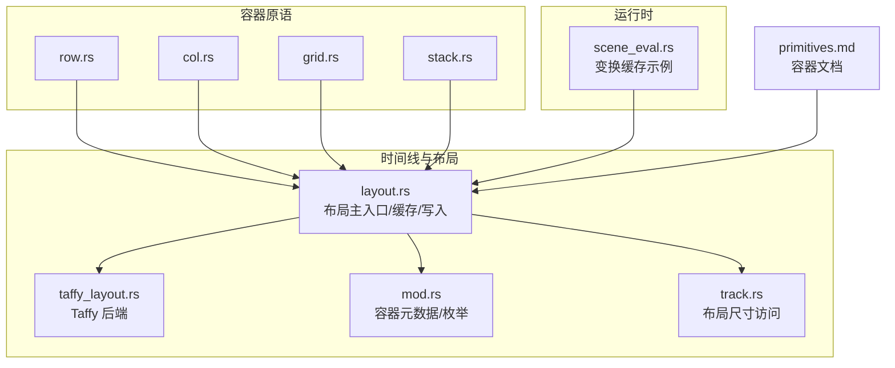
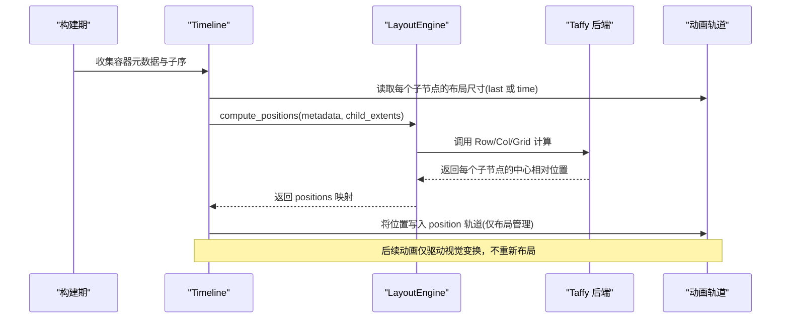
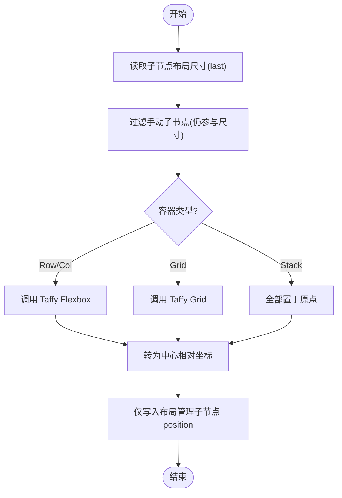
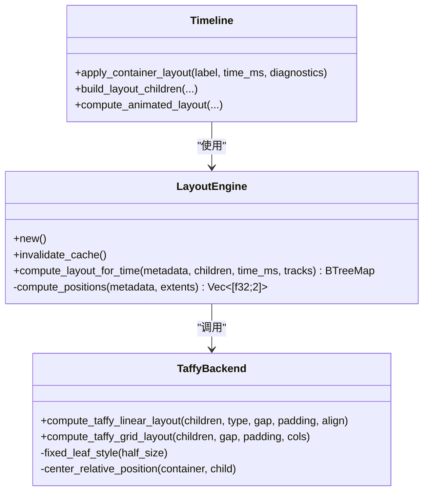
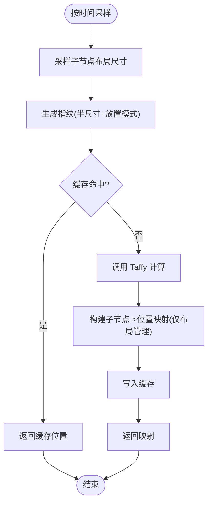
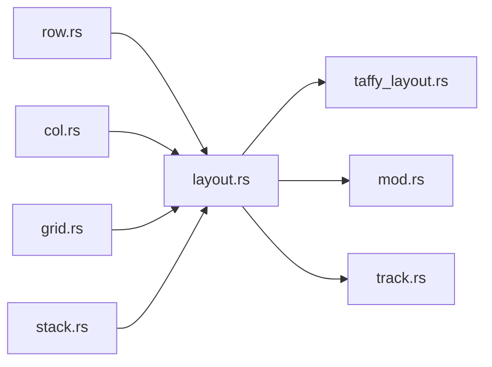

# 布局算法

<cite>
**本文引用的文件**
- [layout.rs](file://crates/animatix/src/timeline/layout.rs)
- [taffy_layout.rs](file://crates/animatix/src/timeline/taffy_layout.rs)
- [mod.rs](file://crates/animatix/src/timeline/mod.rs)
- [track.rs](file://crates/animatix/src/timeline/track.rs)
- [row.rs](file://crates/animatix/src/primitives/row.rs)
- [col.rs](file://crates/animatix/src/primitives/col.rs)
- [grid.rs](file://crates/animatix/src/primitives/grid.rs)
- [stack.rs](file://crates/animatix/src/primitives/stack.rs)
- [scene_eval.rs](file://crates/animatix/src/timeline/scene_eval.rs)
- [primitives.md](file://docs/primitives.md)
</cite>

## 目录
1. [引言](#引言)
2. [项目结构](#项目结构)
3. [核心组件](#核心组件)
4. [架构总览](#架构总览)
5. [详细组件分析](#详细组件分析)
6. [依赖关系分析](#依赖关系分析)
7. [性能考量](#性能考量)
8. [故障排查指南](#故障排查指南)
9. [结论](#结论)
10. [附录](#附录)

## 引言
本文件系统化阐述 Animatix 布局系统的算法设计与实现，重点覆盖以下方面：
- 声明时测量与放置约定：容器在构建阶段一次性完成布局，后续动画仅驱动视觉属性（如位置、缩放、旋转），不触发重新布局。
- 动态重计算机制：基于时间戳的增量缓存，避免重复调用 Taffy 引擎；当输入指纹变化时才重新计算。
- Taffy 布局引擎集成：以 Taffy 作为后端，同时保持中心相对坐标语义与“手动子节点”排除规则。
- 完整流程：从节点遍历、尺寸采样、Taffy 计算到最终位置写入的全流程。
- 多布局模式：flexbox 风格的 Row/Col、网格 Grid 与 Stack 的实现细节。
- 性能分析与优化：缓存策略、增量更新、复杂度与潜在瓶颈。
- 冲突检测与解决：布局尺寸缺失、手动子节点参与容器尺寸但不分配位置等。

## 项目结构
Animatix 的布局系统位于时间线模块中，采用“声明时测量 + 容器放置”的契约式设计，并通过 Taffy 提供具体布局算法。核心文件如下：
- 时间线布局主入口与缓存：crates/animatix/src/timeline/layout.rs
- Taffy 后端实现：crates/animatix/src/timeline/taffy_layout.rs
- 容器元数据与枚举：crates/animatix/src/timeline/mod.rs
- 布局尺寸访问接口：crates/animatix/src/timeline/track.rs
- 容器原语定义（Row/Col/Grid/Stack）：primitives 子模块
- 运行时渲染前的变换缓存示例：crates/animatix/src/timeline/scene_eval.rs
- 容器文档说明：docs/primitives.md

图表来源
- [layout.rs:1-310](file://crates/animatix/src/timeline/layout.rs#L1-L310)
- [taffy_layout.rs:1-320](file://crates/animatix/src/timeline/taffy_layout.rs#L1-L320)
- [mod.rs:247-295](file://crates/animatix/src/timeline/mod.rs#L247-L295)
- [track.rs:712-736](file://crates/animatix/src/timeline/track.rs#L712-L736)
- [row.rs:1-49](file://crates/animatix/src/primitives/row.rs#L1-L49)
- [col.rs](file://crates/animatix/src/primitives/col.rs)
- [grid.rs:1-50](file://crates/animatix/src/primitives/grid.rs#L1-L50)
- [stack.rs:1-49](file://crates/animatix/src/primitives/stack.rs#L1-L49)
- [scene_eval.rs:320-351](file://crates/animatix/src/timeline/scene_eval.rs#L320-L351)
- [primitives.md:381-428](file://docs/primitives.md#L381-L428)

章节来源
- [layout.rs:1-310](file://crates/animatix/src/timeline/layout.rs#L1-L310)
- [taffy_layout.rs:1-320](file://crates/animatix/src/timeline/taffy_layout.rs#L1-L320)
- [mod.rs:247-295](file://crates/animatix/src/timeline/mod.rs#L247-L295)
- [track.rs:712-736](file://crates/animatix/src/timeline/track.rs#L712-L736)
- [row.rs:1-49](file://crates/animatix/src/primitives/row.rs#L1-L49)
- [col.rs](file://crates/animatix/src/primitives/col.rs)
- [grid.rs:1-50](file://crates/animatix/src/primitives/grid.rs#L1-L50)
- [stack.rs:1-49](file://crates/animatix/src/primitives/stack.rs#L1-L49)
- [scene_eval.rs:320-351](file://crates/animatix/src/timeline/scene_eval.rs#L320-L351)
- [primitives.md:381-428](file://docs/primitives.md#L381-L428)

## 核心组件
- 布局契约与流程
  - 声明时测量：布局管理的子节点将半尺寸写入专用的布局尺寸轨道（layout_size），形状直接由声明几何推导，文本/图像/矢量由测量或固有尺寸推导。
  - 容器放置：Row/Col/Grid/Stack 在构建时根据声明顺序、间距 gap、内边距 padding、对齐 align 等参数，确定子节点的中心相对位置；该放置是冻结的，后续动画不触发重新布局。
  - 手动子节点：带作者位置（at）的子节点不参与容器布局放置，但仍会参与容器尺寸计算（用于间距与整体尺寸）。
  - 根默认：无 at 的根级布局容器默认位于场景中心。
- 数据结构
  - ChildExtent：封装子节点标签、半尺寸与放置模式。
  - ContainerMetadata：容器元信息（类型、gap、padding、align、列数、子序）。
  - PlacementMode：布局管理/手动。
  - LayoutEngine：包含缓存与按时间采样的布局计算。
- Taffy 集成
  - 使用 Taffy 的 Flexbox（Row/Col）与 Grid，统一转换为“中心相对坐标”，并保留手动子节点排除规则。
- 缓存与增量
  - 每个容器维护一个缓存条目，键为子序拼接字符串，指纹为每个子节点的（半尺寸，放置模式索引）。若指纹不变则复用上次结果。

章节来源
- [layout.rs:1-310](file://crates/animatix/src/timeline/layout.rs#L1-L310)
- [taffy_layout.rs:1-320](file://crates/animatix/src/timeline/taffy_layout.rs#L1-L320)
- [mod.rs:247-295](file://crates/animatix/src/timeline/mod.rs#L247-L295)
- [track.rs:712-736](file://crates/animatix/src/timeline/track.rs#L712-L736)

## 架构总览
下图展示从构建期到运行期的布局路径，以及与 Taffy 的交互：

图表来源
- [layout.rs:266-308](file://crates/animatix/src/timeline/layout.rs#L266-L308)
- [layout.rs:107-200](file://crates/animatix/src/timeline/layout.rs#L107-L200)
- [taffy_layout.rs:59-120](file://crates/animatix/src/timeline/taffy_layout.rs#L59-L120)
- [taffy_layout.rs:122-215](file://crates/animatix/src/timeline/taffy_layout.rs#L122-L215)

## 详细组件分析

### 组件一：布局契约与声明时测量
- 流程要点
  - 构建期：从轨道读取每个布局管理子节点的布局尺寸（last 值），形成 ChildExtent 列表。
  - 计算期：根据容器类型（Row/Col/Grid/Stack）与元数据（gap/padding/align/cols）计算位置。
  - 写入期：仅将布局管理的子节点位置写入 position 轨道，时间为构建时刻。
- 关键行为
  - 手动子节点参与尺寸计算但不写入 position。
  - 根容器默认位于场景中心。
  - 不进行每帧重采样：布局尺寸与 position 动画不会导致重新布局。

图表来源
- [layout.rs:266-308](file://crates/animatix/src/timeline/layout.rs#L266-L308)
- [layout.rs:45-80](file://crates/animatix/src/timeline/layout.rs#L45-L80)
- [taffy_layout.rs:59-120](file://crates/animatix/src/timeline/taffy_layout.rs#L59-L120)
- [taffy_layout.rs:122-215](file://crates/animatix/src/timeline/taffy_layout.rs#L122-L215)

章节来源
- [layout.rs:1-310](file://crates/animatix/src/timeline/layout.rs#L1-L310)
- [primitives.md:381-428](file://docs/primitives.md#L381-L428)

### 组件二：Taffy 集成与 CSS 兼容特性
- Flexbox（Row/Col）
  - 方向映射：Row 对应水平方向，Col 对应垂直方向。
  - 对齐映射：align 字符串映射到 Taffy 的 align_items。
  - 间距与内边距：gap 与 padding 直接映射为 Taffy 的 gap 与 padding。
  - 中心相对坐标：将 Taffy 返回的绝对坐标转换为容器中心相对坐标。
- Grid
  - 模板列/行：基于子节点最大宽高计算每列/行尺寸，形成固定长度模板。
  - 排列：使用 grid_row/grid_column 按声明顺序布置。
  - 间距与内边距：同上。
- 手动子节点排除
  - 在写入 position 时仅处理布局管理的子节点，保证作者手写位置不受容器布局影响。
- 构建期与动态期一致性
  - 构建期与按时间采样期均走同一 Taffy 计算路径，确保结果一致。

图表来源
- [layout.rs:95-200](file://crates/animatix/src/timeline/layout.rs#L95-L200)
- [taffy_layout.rs:29-51](file://crates/animatix/src/timeline/taffy_layout.rs#L29-L51)
- [taffy_layout.rs:59-215](file://crates/animatix/src/timeline/taffy_layout.rs#L59-L215)
- [mod.rs:262-295](file://crates/animatix/src/timeline/mod.rs#L262-L295)

章节来源
- [taffy_layout.rs:1-320](file://crates/animatix/src/timeline/taffy_layout.rs#L1-L320)
- [layout.rs:1-310](file://crates/animatix/src/timeline/layout.rs#L1-L310)

### 组件三：动态重计算与缓存
- 输入指纹
  - 每个容器以“子序拼接字符串”作为缓存键；指纹为每个子节点的（半尺寸，放置模式索引）。
- 缓存命中
  - 若指纹相同，则直接返回上次缓存的位置映射。
- 缓存失效
  - 时间线重建时可整体清空缓存。
- 增量更新
  - 仅在指纹变化时调用 Taffy 计算，其余情况复用结果，显著降低开销。

图表来源
- [layout.rs:134-200](file://crates/animatix/src/timeline/layout.rs#L134-L200)

章节来源
- [layout.rs:86-200](file://crates/animatix/src/timeline/layout.rs#L86-L200)

### 组件四：容器原语与属性
- Row/Col
  - 属性：gap、padding、align（start/center/end）。
  - 行为：flexbox 方向与对齐，支持 gap 与 padding。
- Grid
  - 属性：cols、gap、padding。
  - 行为：二维网格，按声明顺序填充，行列尺寸由子节点最大宽高决定。
- Stack
  - 行为：所有布局管理子节点叠放在原点。
- 文档与状态
  - 文档明确“自动布局优先、声明时测量/放置”的模型，显式 at 可选择手工放置。

章节来源
- [row.rs:1-49](file://crates/animatix/src/primitives/row.rs#L1-L49)
- [col.rs](file://crates/animatix/src/primitives/col.rs)
- [grid.rs:1-50](file://crates/animatix/src/primitives/grid.rs#L1-L50)
- [stack.rs:1-49](file://crates/animatix/src/primitives/stack.rs#L1-L49)
- [primitives.md:381-428](file://docs/primitives.md#L381-L428)

### 组件五：布局尺寸与轨道
- 布局尺寸来源
  - 形状：由声明几何推导。
  - 文本/数学/代码/图像/SVG：由测量或固有尺寸推导。
- 轨道接口
  - 提供 layout_size_get/layout_size_last/ensure_layout_size/has_layout_size 等便捷方法。
- 排除规则
  - 未播种布局尺寸的布局管理子节点会被排除在布局集合之外，并产生诊断提示。

章节来源
- [layout.rs:221-264](file://crates/animatix/src/timeline/layout.rs#L221-L264)
- [track.rs:712-736](file://crates/animatix/src/timeline/track.rs#L712-L736)

### 组件六：动画期间的布局行为
- 构建期写入 position
  - 在 apply_container_layout 中，将计算出的中心相对位置写入 position 轨道，时间为构建时刻。
- 运行期不重布局
  - 后续动画仅驱动视觉变换（scale/rotation/position 等），不重新计算布局。
- 变换缓存示例
  - 场景评估阶段存在“时间+父变换系数”的变换缓存，体现 Animatix 对“时间局部性”的通用优化思路。

章节来源
- [layout.rs:266-308](file://crates/animatix/src/timeline/layout.rs#L266-L308)
- [scene_eval.rs:320-351](file://crates/animatix/src/timeline/scene_eval.rs#L320-L351)

## 依赖关系分析
- 模块耦合
  - layout.rs 依赖 taffy_layout.rs（Taffy 后端）、mod.rs（容器元数据/枚举）、track.rs（布局尺寸访问）。
  - 容器原语（row/col/grid/stack）定义了默认属性，与布局系统协作。
- 外部依赖
  - Taffy 作为布局引擎，提供 Flexbox 与 Grid 的标准能力。
- 循环依赖
  - 未发现循环导入；布局层与原语层通过接口解耦。

图表来源
- [layout.rs:1-310](file://crates/animatix/src/timeline/layout.rs#L1-L310)
- [taffy_layout.rs:1-320](file://crates/animatix/src/timeline/taffy_layout.rs#L1-L320)
- [mod.rs:247-295](file://crates/animatix/src/timeline/mod.rs#L247-L295)
- [track.rs:712-736](file://crates/animatix/src/timeline/track.rs#L712-L736)
- [row.rs:1-49](file://crates/animatix/src/primitives/row.rs#L1-L49)
- [col.rs](file://crates/animatix/src/primitives/col.rs)
- [grid.rs:1-50](file://crates/animatix/src/primitives/grid.rs#L1-L50)
- [stack.rs:1-49](file://crates/animatix/src/primitives/stack.rs#L1-L49)

章节来源
- [layout.rs:1-310](file://crates/animatix/src/timeline/layout.rs#L1-L310)
- [taffy_layout.rs:1-320](file://crates/animatix/src/timeline/taffy_layout.rs#L1-L320)
- [mod.rs:247-295](file://crates/animatix/src/timeline/mod.rs#L247-L295)
- [track.rs:712-736](file://crates/animatix/src/timeline/track.rs#L712-L736)
- [row.rs:1-49](file://crates/animatix/src/primitives/row.rs#L1-L49)
- [col.rs](file://crates/animatix/src/primitives/col.rs)
- [grid.rs:1-50](file://crates/animatix/src/primitives/grid.rs#L1-L50)
- [stack.rs:1-49](file://crates/animatix/src/primitives/stack.rs#L1-L49)

## 性能考量
- 复杂度
  - Taffy Flexbox/Grid 的复杂度通常为 O(n)（n 为子节点数），其中 n ≤ 子序长度。
  - 布局引擎按时间采样时，若指纹未变则为 O(1) 复杂度的缓存读取。
- 缓存策略
  - 按容器维度缓存，键为子序拼接字符串；指纹为（半尺寸，放置模式索引）。
  - 命中率取决于子节点尺寸与放置模式的稳定性。
- 增量更新
  - 仅在指纹变化时调用 Taffy，避免每帧重算。
- 与变换缓存的关系
  - 变换缓存展示了 Animatix 对“时间局部性”的通用优化，布局缓存与其理念一致。
- 优化建议
  - 减少频繁变更布局尺寸与放置模式的子节点数量。
  - 合理设置 gap/padding，避免过度的尺寸波动。
  - 在需要频繁重排的场景中，考虑预估/缓存容器尺寸或减少子节点数量。

章节来源
- [layout.rs:86-200](file://crates/animatix/src/timeline/layout.rs#L86-L200)
- [scene_eval.rs:320-351](file://crates/animatix/src/timeline/scene_eval.rs#L320-L351)

## 故障排查指南
- 布局尺寸缺失
  - 现象：布局管理的子节点被排除在布局集合之外，并产生警告诊断。
  - 原因：未播种布局尺寸（如文本/图像尚未测量）。
  - 解决：确保子节点的布局尺寸已播种，或暂时改为手动放置（at）。
- 手动子节点位置异常
  - 现象：设置了 at 的子节点未被容器放置，但其尺寸仍参与容器尺寸计算。
  - 原因：这是预期行为，用于保持容器尺寸与间距正确。
  - 解决：确认是否需要该子节点参与容器尺寸计算；如不需要，将其标记为手动或移除。
- 根容器未居中
  - 现象：根容器未位于场景中心。
  - 原因：根容器设置了 at 或锚点绑定。
  - 解决：移除 at 或调整锚点/偏移。
- 子序变化导致布局抖动
  - 现象：子序在时间上有过渡，导致布局插值。
  - 原因：child_orders 轨道存在过渡。
  - 解决：尽量避免频繁改变子序；如需改变，使用平滑的过渡与合适的缓动。

章节来源
- [layout.rs:202-264](file://crates/animatix/src/timeline/layout.rs#L202-L264)
- [mod.rs:777-825](file://crates/animatix/src/timeline/mod.rs#L777-L825)

## 结论
Animatix 的布局系统以“声明时测量 + 容器放置”为核心契约，结合 Taffy 的 Flexbox 与 Grid 实现，既保证了与 CSS 语义相近的布局体验，又通过严格的缓存与增量更新策略实现了高性能与可预测性。手动子节点的排除规则与根容器默认居中等设计，进一步提升了布局的灵活性与易用性。对于需要更高性能的场景，建议关注布局尺寸的稳定性与子序的最小化变更。

## 附录
- 相关文件路径与用途
  - crates/animatix/src/timeline/layout.rs：布局主入口、缓存、写入 position。
  - crates/animatix/src/timeline/taffy_layout.rs：Taffy 后端实现（Row/Col/Grid）。
  - crates/animatix/src/timeline/mod.rs：容器元数据、枚举与子序过渡计算。
  - crates/animatix/src/timeline/track.rs：布局尺寸轨道接口。
  - crates/animatix/src/primitives/row.rs、col.rs、grid.rs、stack.rs：容器原语定义。
  - crates/animatix/src/timeline/scene_eval.rs：变换缓存示例（时间局部性优化）。
  - docs/primitives.md：容器文档与状态说明。