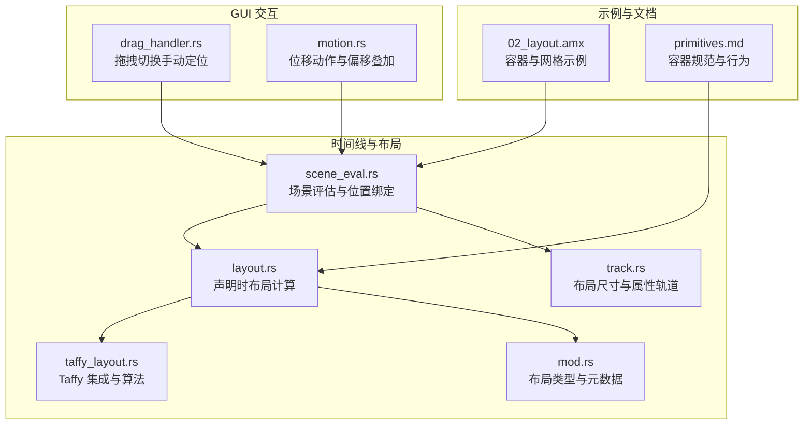
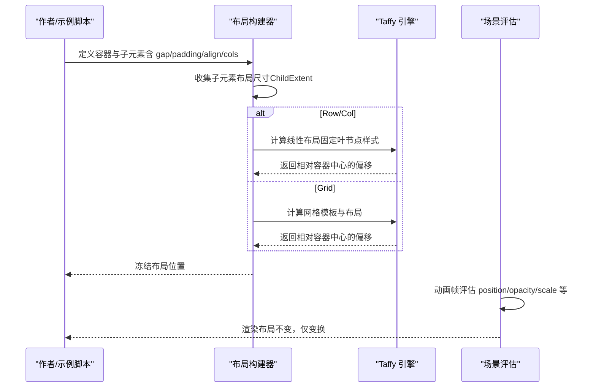
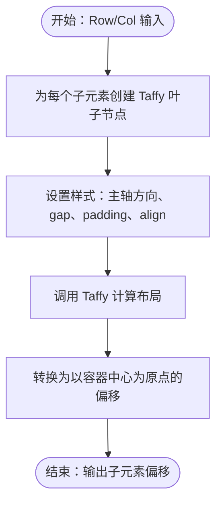
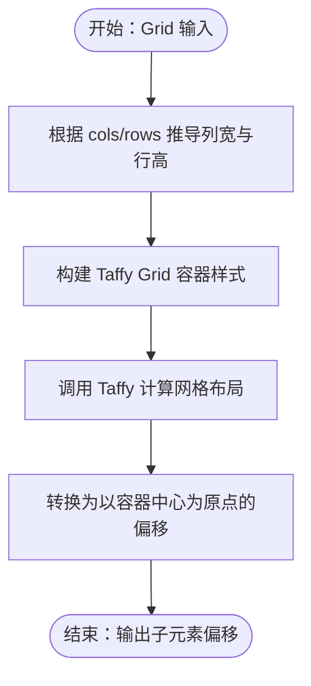
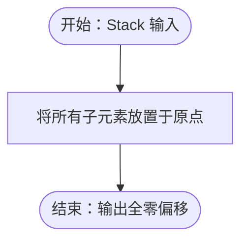
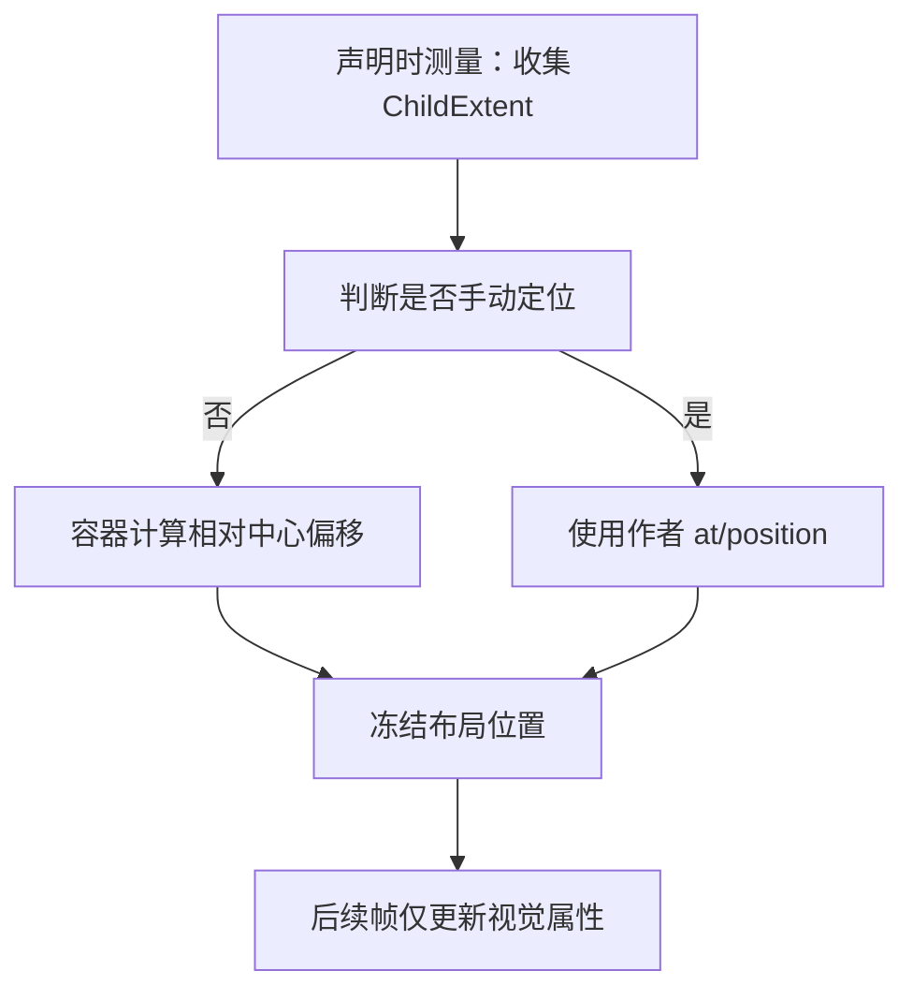
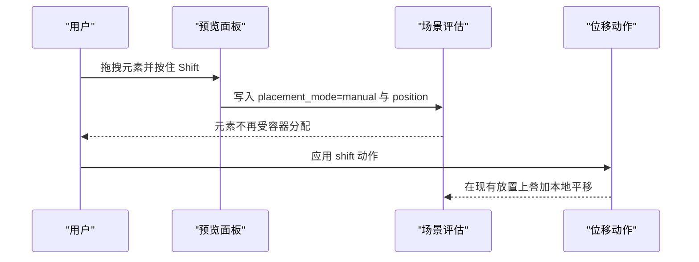
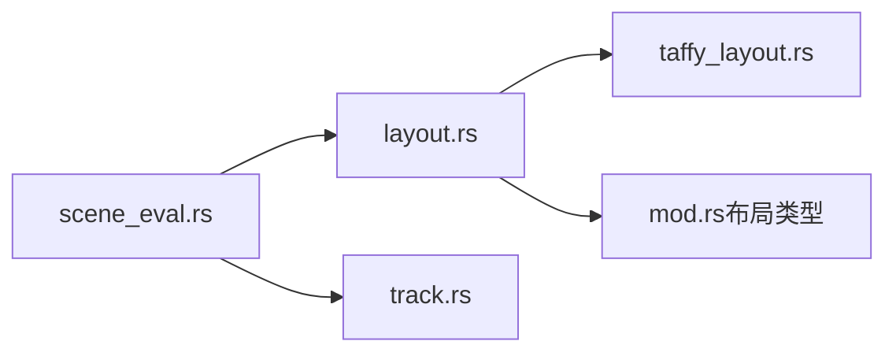

# 布局系统

<cite>
**本文引用的文件**
- [layout.rs](file://crates/animatix/src/timeline/layout.rs)
- [taffy_layout.rs](file://crates/animatix/src/timeline/taffy_layout.rs)
- [mod.rs（时间线模块）](file://crates/animatix/src/timeline/mod.rs)
- [scene_eval.rs](file://crates/animatix/src/timeline/scene_eval.rs)
- [track.rs](file://crates/animatix/src/timeline/track.rs)
- [02_layout.amx](file://examples/02_layout.amx)
- [primitives.md](file://docs/primitives.md)
- [drag_handler.rs](file://crates/animatix-gui/src/app/preview/drag_handler.rs)
- [motion.rs](file://crates/animatix/src/timeline/actions/motion.rs)
</cite>

## 目录
1. [引言](#引言)
2. [项目结构](#项目结构)
3. [核心组件](#核心组件)
4. [架构总览](#架构总览)
5. [详细组件分析](#详细组件分析)
6. [依赖关系分析](#依赖关系分析)
7. [性能考量](#性能考量)
8. [故障排查指南](#故障排查指南)
9. [结论](#结论)
10. [附录](#附录)

## 引言
本文件系统性阐述 Animatix 的容器化布局架构与实现，覆盖 Row、Col、Grid、Stack 四类容器的工作原理；深入解析基于 Taffy 的布局算法与 CSS 兼容特性；明确声明时测量/放置约定与动态重计算机制；说明手动定位与自动布局的关系及 transform 在布局中的作用；并通过实际示例展示响应式设计、网格系统与复杂页面结构的实现思路，并总结性能优化与最佳实践。

## 项目结构
Animatix 的布局系统主要位于时间线子系统中，采用“声明时测量、一次性放置”的设计：容器在构建阶段读取子元素的布局尺寸，结合 gap、padding、align/cols 等属性进行确定性布局，随后将结果冻结，动画仅改变视觉属性（如位置、透明度、尺寸），不触发重新布局。Taffy 作为底层引擎负责线性布局（Row/Col）与网格布局（Grid）的计算。

图表来源
- [layout.rs:1-132](file://crates/animatix/src/timeline/layout.rs#L1-L132)
- [taffy_layout.rs:53-215](file://crates/animatix/src/timeline/taffy_layout.rs#L53-L215)
- [mod.rs（时间线模块）:247-273](file://crates/animatix/src/timeline/mod.rs#L247-L273)
- [scene_eval.rs:87-113](file://crates/animatix/src/timeline/scene_eval.rs#L87-L113)
- [track.rs:712-736](file://crates/animatix/src/timeline/track.rs#L712-L736)
- [02_layout.amx:1-53](file://examples/02_layout.amx#L1-L53)
- [primitives.md:381-428](file://docs/primitives.md#L381-L428)
- [drag_handler.rs:283-593](file://crates/animatix-gui/src/app/preview/drag_handler.rs#L283-L593)
- [motion.rs:246-284](file://crates/animatix/src/timeline/actions/motion.rs#L246-L284)

章节来源
- [layout.rs:1-132](file://crates/animatix/src/timeline/layout.rs#L1-L132)
- [taffy_layout.rs:53-215](file://crates/animatix/src/timeline/taffy_layout.rs#L53-L215)
- [mod.rs（时间线模块）:247-273](file://crates/animatix/src/timeline/mod.rs#L247-L273)
- [scene_eval.rs:87-113](file://crates/animatix/src/timeline/scene_eval.rs#L87-L113)
- [track.rs:712-736](file://crates/animatix/src/timeline/track.rs#L712-L736)
- [02_layout.amx:1-53](file://examples/02_layout.amx#L1-L53)
- [primitives.md:381-428](file://docs/primitives.md#L381-L428)
- [drag_handler.rs:283-593](file://crates/animatix-gui/src/app/preview/drag_handler.rs#L283-L593)
- [motion.rs:246-284](file://crates/animatix/src/timeline/actions/motion.rs#L246-L284)

## 核心组件
- 容器类型与元数据
  - 布局类型枚举支持 Row、Col、Grid、Stack，默认从容器类型字符串解析。
- 子元素布局尺寸
  - ChildExtent 记录子元素标签、半尺寸与放置模式，用于声明时测量与布局计算。
- 声明时布局计算
  - Stack：所有子元素统一放置于容器中心原点。
  - Row/Col：委托 Taffy 计算线性排列，返回相对容器中心的偏移坐标。
  - Grid：按列数与间隙计算网格轨道，委托 Taffy 计算网格布局，返回相对容器中心的偏移坐标。
- 场景评估与位置绑定
  - 若子元素未显式设置 at，则使用布局计算的位置；若设置了 at 或 placement_mode=manual，则由作者直接控制位置。
- 变换与布局的分离
  - 视觉变换（缩放、旋转）不影响布局尺寸，仅影响渲染。

章节来源
- [mod.rs（时间线模块）:247-273](file://crates/animatix/src/timeline/mod.rs#L247-L273)
- [layout.rs:37-68](file://crates/animatix/src/timeline/layout.rs#L37-L68)
- [layout.rs:103-132](file://crates/animatix/src/timeline/layout.rs#L103-L132)
- [scene_eval.rs:87-113](file://crates/animatix/src/timeline/scene_eval.rs#L87-L113)
- [track.rs:712-736](file://crates/animatix/src/timeline/track.rs#L712-L736)

## 架构总览
Animatix 的布局遵循“声明时测量、一次性放置”的契约：容器在应用时读取子元素的布局尺寸，结合 gap、padding、align/cols 等参数计算确定性位置，随后冻结。动画只更新视觉属性，不触发布局重算。Taffy 负责 Row/Col 的线性布局与 Grid 的网格布局，确保与 CSS 类似的语义与行为。

图表来源
- [layout.rs:103-132](file://crates/animatix/src/timeline/layout.rs#L103-L132)
- [taffy_layout.rs:53-215](file://crates/animatix/src/timeline/taffy_layout.rs#L53-L215)
- [scene_eval.rs:87-113](file://crates/animatix/src/timeline/scene_eval.rs#L87-L113)

## 详细组件分析

### Row/Col 容器
- 工作原理
  - 将每个子元素建模为固定半尺寸的叶子节点，使用 Taffy 的线性布局计算其在主轴上的相对位置，再转换为以容器中心为原点的偏移。
  - gap 控制间距，padding 影响容器内可用空间，align 控制交叉轴对齐（start/center/end）。
- 关键流程
  - 输入：ChildExtent 列表、布局类型（Row/Col）、gap、padding、align。
  - 输出：每个子元素的二维偏移向量。
- 与 CSS 的兼容性
  - 主轴/交叉轴、gap 对应 CSS 的 gap，align 对应 CSS 的对齐方式。
- 手动定位关系
  - 若子元素显式设置 at 或 placement_mode=manual，则跳过容器分配，由作者直接控制位置。

图表来源
- [taffy_layout.rs:59-120](file://crates/animatix/src/timeline/taffy_layout.rs#L59-L120)
- [layout.rs:51-68](file://crates/animatix/src/timeline/layout.rs#L51-L68)

章节来源
- [taffy_layout.rs:53-120](file://crates/animatix/src/timeline/taffy_layout.rs#L53-L120)
- [layout.rs:51-68](file://crates/animatix/src/timeline/layout.rs#L51-L68)

### Grid 容器
- 工作原理
  - 按 cols 与子元素数量计算行数；通过子元素半尺寸推导每列宽度与每行高度（包含手动子元素以保证容器尺寸正确）。
  - 使用 Taffy 的 Grid 显示模式与模板列/行、gap、padding 计算最终布局。
- 关键流程
  - 输入：ChildExtent 列表、gap、padding、cols。
  - 输出：每个子元素的二维偏移向量。
- 与 CSS 的兼容性
  - cols 对应 CSS 的网格列数；gap 对应 CSS 的网格间隙；padding 对应内边距。
- 手动定位关系
  - 手动子元素参与尺寸推导但不参与容器分配，保持声明顺序与间距一致性。

图表来源
- [taffy_layout.rs:122-215](file://crates/animatix/src/timeline/taffy_layout.rs#L122-L215)
- [layout.rs:120-132](file://crates/animatix/src/timeline/layout.rs#L120-L132)

章节来源
- [taffy_layout.rs:122-215](file://crates/animatix/src/timeline/taffy_layout.rs#L122-L215)
- [layout.rs:120-132](file://crates/animatix/src/timeline/layout.rs#L120-L132)

### Stack 容器
- 工作原理
  - 将所有子元素放置于容器中心原点，形成叠放效果。
- 适用场景
  - 图层叠加、装饰背景与前景元素的组合。

图表来源
- [layout.rs:45-49](file://crates/animatix/src/timeline/layout.rs#L45-L49)

章节来源
- [layout.rs:45-49](file://crates/animatix/src/timeline/layout.rs#L45-L49)

### 声明时测量与放置约定
- 契约要点
  - 声明时测量：子元素在应用容器前，已将自身半尺寸写入布局尺寸轨道。
  - 一次性放置：容器计算后冻结位置，动画不触发重新布局。
  - 手动定位优先：显式 at 或 placement_mode=manual 的子元素跳过容器分配。
  - 根容器默认：根级布局容器无 at 时默认位于场景中心。
  - 变换独立：scale/rotate 等视觉变换不影响布局尺寸。
- 数据流
  - ChildExtent 提供半尺寸与放置模式；
  - 容器根据 gap/padding/align/cols 计算；
  - 场景评估阶段决定是否使用布局位置或作者指定位置。

图表来源
- [layout.rs:1-28](file://crates/animatix/src/timeline/layout.rs#L1-L28)
- [scene_eval.rs:87-113](file://crates/animatix/src/timeline/scene_eval.rs#L87-L113)

章节来源
- [layout.rs:1-28](file://crates/animatix/src/timeline/layout.rs#L1-L28)
- [scene_eval.rs:87-113](file://crates/animatix/src/timeline/scene_eval.rs#L87-L113)

### transform 与布局的关系
- 布局尺寸不受视觉变换影响，变换仅作用于渲染阶段。
- 这意味着在布局阶段无需考虑 scale/rotation，简化了尺寸推导与重计算成本。

章节来源
- [layout.rs:23-24](file://crates/animatix/src/timeline/layout.rs#L23-L24)

### 手动定位与自动布局的交互
- GUI 拖拽切换
  - 当用户在预览面板中拖拽布局管理的元素并按住 Shift，会将该元素的 placement_mode 切换为 manual，并写入当前 position，从而使其脱离容器分配。
- 位移动作
  - shift 动作会在现有放置基础上叠加本地平移增量，便于微调。

图表来源
- [drag_handler.rs:283-593](file://crates/animatix-gui/src/app/preview/drag_handler.rs#L283-L593)
- [motion.rs:246-284](file://crates/animatix/src/timeline/actions/motion.rs#L246-L284)
- [scene_eval.rs:87-113](file://crates/animatix/src/timeline/scene_eval.rs#L87-L113)

章节来源
- [drag_handler.rs:283-593](file://crates/animatix-gui/src/app/preview/drag_handler.rs#L283-L593)
- [motion.rs:246-284](file://crates/animatix/src/timeline/actions/motion.rs#L246-L284)
- [scene_eval.rs:87-113](file://crates/animatix/src/timeline/scene_eval.rs#L87-L113)

### 实际示例与场景
- 示例脚本
  - 02_layout.amx 展示了 Row、Col、Grid、Stack 四种容器的组合使用，并演示了动画对透明度与尺寸的影响，同时验证布局在动画期间保持稳定。
- 响应式设计思路
  - 通过调整容器的 gap/padding/align/cols 等属性，配合子元素的内在尺寸，可实现自适应排列与对齐。
- 复杂页面结构
  - 使用 Grid 构建多列栅格，Stack 实现图层叠加，Row/Col 组合实现导航栏、侧边栏等常见布局。

章节来源
- [02_layout.amx:1-53](file://examples/02_layout.amx#L1-L53)
- [primitives.md:381-428](file://docs/primitives.md#L381-L428)

## 依赖关系分析
- 组件耦合
  - layout.rs 依赖 taffy_layout.rs 进行具体布局计算；依赖 mod.rs 中的布局类型定义；依赖 scene_eval.rs 的位置绑定逻辑。
  - track.rs 提供布局尺寸轨道，为布局计算提供输入。
- 外部依赖
  - TaffyTree 作为布局引擎，负责线性与网格布局的计算。
- 循环依赖
  - 未发现循环依赖；各模块职责清晰，接口单向。

图表来源
- [layout.rs:103-132](file://crates/animatix/src/timeline/layout.rs#L103-L132)
- [taffy_layout.rs:53-215](file://crates/animatix/src/timeline/taffy_layout.rs#L53-L215)
- [mod.rs（时间线模块）:247-273](file://crates/animatix/src/timeline/mod.rs#L247-L273)
- [scene_eval.rs:87-113](file://crates/animatix/src/timeline/scene_eval.rs#L87-L113)
- [track.rs:712-736](file://crates/animatix/src/timeline/track.rs#L712-L736)

章节来源
- [layout.rs:103-132](file://crates/animatix/src/timeline/layout.rs#L103-L132)
- [taffy_layout.rs:53-215](file://crates/animatix/src/timeline/taffy_layout.rs#L53-L215)
- [mod.rs（时间线模块）:247-273](file://crates/animatix/src/timeline/mod.rs#L247-L273)
- [scene_eval.rs:87-113](file://crates/animatix/src/timeline/scene_eval.rs#L87-L113)
- [track.rs:712-736](file://crates/animatix/src/timeline/track.rs#L712-L736)

## 性能考量
- 布局只在声明时计算一次，避免每帧重排，显著降低 CPU 开销。
- 使用固定半尺寸的叶子节点减少布局树复杂度。
- 将手动定位的子元素排除在容器分配之外，减少不必要的布局计算。
- 通过缓存与批量处理进一步提升大规模场景的性能（例如在重建后清理布局缓存）。

## 故障排查指南
- 子元素未按预期排列
  - 检查是否误设 at 或 placement_mode=manual 导致被跳过容器分配。
  - 确认 gap/padding/align/cols 是否符合预期。
- 布局尺寸异常
  - 确认 ChildExtent 的半尺寸是否正确写入布局尺寸轨道。
  - 注意 transform 不影响布局尺寸，若期望尺寸变化，请检查布局轨道而非变换属性。
- 根容器位置不符合预期
  - 无 at 的根容器默认位于场景中心，可通过 anchor/offset/at 调整。

章节来源
- [scene_eval.rs:87-113](file://crates/animatix/src/timeline/scene_eval.rs#L87-L113)
- [track.rs:712-736](file://crates/animatix/src/timeline/track.rs#L712-L736)
- [layout.rs:20-21](file://crates/animatix/src/timeline/layout.rs#L20-L21)

## 结论
Animatix 的布局系统以“声明时测量、一次性放置”为核心，借助 Taffy 实现 Row/Col 的线性布局与 Grid 的网格布局，严格区分手动定位与自动布局，并将 transform 与布局解耦，既保证了布局的确定性与高性能，又提供了灵活的手工微调能力。通过合理的容器组合与属性配置，可高效实现响应式与复杂的页面结构。

## 附录
- 容器属性参考
  - Row/Col：gap、padding、align（start/center/end）
  - Grid：cols、gap、padding
  - Stack：gap、padding
- 示例脚本路径
  - [02_layout.amx:1-53](file://examples/02_layout.amx#L1-L53)
- 容器规范与行为
  - [primitives.md:381-428](file://docs/primitives.md#L381-L428)