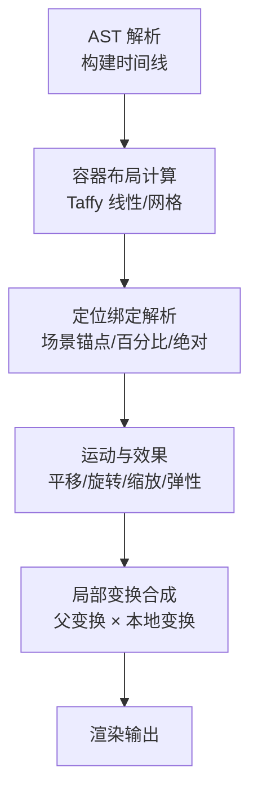
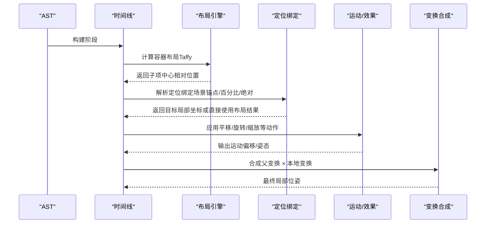
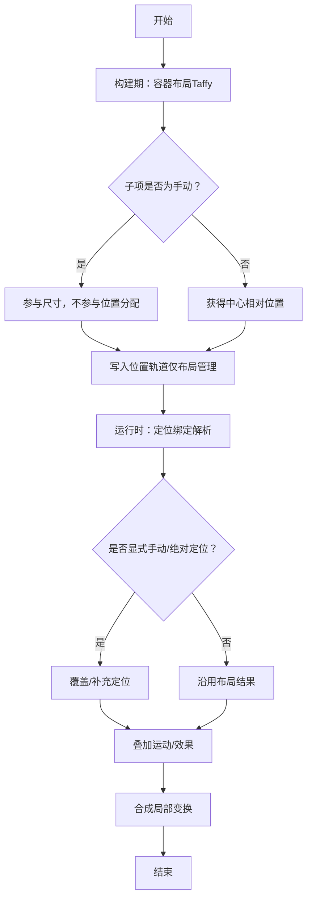
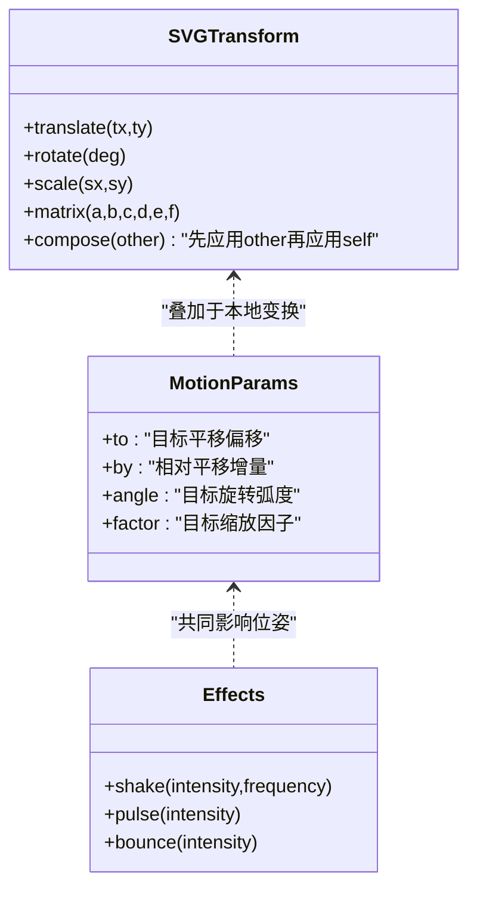
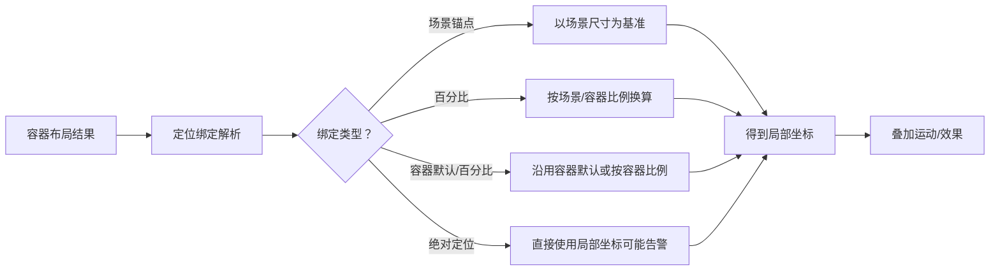
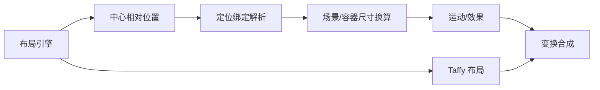

# 手动定位

<cite>
**本文引用的文件**
- [layout.rs](file://crates/animatix/src/timeline/layout.rs)
- [taffy_layout.rs](file://crates/animatix/src/timeline/taffy_layout.rs)
- [position.rs](file://crates/animatix/src/timeline/position.rs)
- [svg_import.rs](file://crates/animatix/src/timeline/svg_import.rs)
- [motion.rs](file://crates/animatix/src/timeline/actions/motion.rs)
- [effects.rs](file://crates/animatix/src/timeline/actions/effects.rs)
- [mod.rs（primitives）](file://crates/animatix/src/primitives/mod.rs)
- [architecture.md](file://docs/architecture.md)
- [17_audio_reactive.amx](file://examples/17_audio_reactive.amx)
</cite>

## 目录
1. [引言](#引言)
2. [项目结构](#项目结构)
3. [核心组件](#核心组件)
4. [架构总览](#架构总览)
5. [详细组件分析](#详细组件分析)
6. [依赖关系分析](#依赖关系分析)
7. [性能考量](#性能考量)
8. [故障排查指南](#故障排查指南)
9. [结论](#结论)
10. [附录](#附录)

## 引言
本篇文档围绕“手动定位”展开，系统阐释其与“自动布局”的关系与协作机制，详解 transform 属性在布局中的作用（translate、rotate、scale 等），对比绝对定位与相对定位，并说明它们与容器布局的交互方式。同时给出实际应用场景与最佳实践（动画配合定位、响应式设计中的定位策略）、定位精度与性能考虑（坐标系统与单位转换）、以及手动定位与响应式设计的平衡点。

## 项目结构
Animatix 的定位体系由“声明期布局计算 + 运行时定位绑定 + 变换叠加”三部分构成：
- 声明期：容器布局（Row/Col/Grid/Stack）通过 Taffy 计算子元素的中心相对位置，手动子项参与尺寸但不参与分配。
- 绑定期：支持多种定位绑定（场景锚点、百分比、容器默认/百分比、绝对定位），并可对冲突进行告警。
- 运行时：将父级变换、定位绑定与运动偏移叠加，形成最终局部空间的位姿。

**图表来源**
- [layout.rs:1-310](file://crates/animatix/src/timeline/layout.rs#L1-L310)
- [taffy_layout.rs:1-294](file://crates/animatix/src/timeline/taffy_layout.rs#L1-L294)
- [position.rs:1-395](file://crates/animatix/src/timeline/position.rs#L1-L395)
- [motion.rs:8-49](file://crates/animatix/src/timeline/actions/motion.rs#L8-L49)
- [effects.rs:1-386](file://crates/animatix/src/timeline/actions/effects.rs#L1-L386)

**章节来源**
- [layout.rs:1-310](file://crates/animatix/src/timeline/layout.rs#L1-L310)
- [taffy_layout.rs:1-294](file://crates/animatix/src/timeline/taffy_layout.rs#L1-L294)
- [position.rs:1-395](file://crates/animatix/src/timeline/position.rs#L1-L395)

## 核心组件
- 容器布局引擎：负责在构建期基于子项半尺寸与排列规则计算中心相对位置；手动子项参与尺寸但不参与位置分配。
- 定位绑定系统：支持场景锚点、百分比、容器默认/百分比、绝对定位，并在冲突时发出告警。
- 变换与运动系统：提供 translate/rotate/scale 的动作参数与内置效果（抖动、脉冲、弹跳），并与定位绑定叠加。
- SVG 变换解析：将 SVG transform 字符串解析为本地仿射变换（translate/rotate/scale/matrix）。

**章节来源**
- [layout.rs:51-80](file://crates/animatix/src/timeline/layout.rs#L51-L80)
- [position.rs:41-112](file://crates/animatix/src/timeline/position.rs#L41-L112)
- [motion.rs:8-49](file://crates/animatix/src/timeline/actions/motion.rs#L8-L49)
- [svg_import.rs:245-297](file://crates/animatix/src/timeline/svg_import.rs#L245-L297)

## 架构总览
下图展示从布局到定位再到变换合成的整体流程，体现“自动布局”与“手动定位”的协作边界。

**图表来源**
- [layout.rs:107-200](file://crates/animatix/src/timeline/layout.rs#L107-L200)
- [position.rs:134-165](file://crates/animatix/src/timeline/position.rs#L134-L165)
- [motion.rs:8-49](file://crates/animatix/src/timeline/actions/motion.rs#L8-L49)
- [mod.rs（primitives）:245-255](file://crates/animatix/src/primitives/mod.rs#L245-L255)

## 详细组件分析

### 自动布局与手动定位的协作
- 自动布局：容器在构建期使用 Taffy 计算子项的中心相对位置，手动子项参与尺寸但不参与位置分配；布局结果写入位置轨道。
- 手动定位：当需要覆盖容器分配的位置时，可通过定位绑定（场景锚点、百分比、绝对）或显式标记手动模式来实现；若在已受布局管理的子项上使用绝对位置属性，系统会发出告警，提示应使用 transform。
- 协作边界：布局负责“在哪里”，定位绑定负责“如何偏移/对齐”，运动与效果负责“动态变化”。

**图表来源**
- [layout.rs:266-308](file://crates/animatix/src/timeline/layout.rs#L266-L308)
- [taffy_layout.rs:53-120](file://crates/animatix/src/timeline/taffy_layout.rs#L53-L120)
- [position.rs:134-165](file://crates/animatix/src/timeline/position.rs#L134-L165)
- [architecture.md:141-141](file://docs/architecture.md#L141-L141)

**章节来源**
- [layout.rs:266-308](file://crates/animatix/src/timeline/layout.rs#L266-L308)
- [taffy_layout.rs:53-120](file://crates/animatix/src/timeline/taffy_layout.rs#L53-L120)
- [position.rs:134-165](file://crates/animatix/src/timeline/position.rs#L134-L165)
- [architecture.md:141-141](file://docs/architecture.md#L141-L141)

### transform 属性与变换应用
- 动作参数：move/shift 对应平移（translate），rotate 对应旋转（rotate），scale 对应缩放（scale）。
- 内置效果：shake/pulse/bounce 等通过修改运动偏移与缩放实现视觉反馈。
- SVG 变换：支持 translate/rotate/scale/matrix，组合顺序遵循先子后父的累积变换。

**图表来源**
- [motion.rs:8-49](file://crates/animatix/src/timeline/actions/motion.rs#L8-L49)
- [effects.rs:27-128](file://crates/animatix/src/timeline/actions/effects.rs#L27-L128)
- [svg_import.rs:229-297](file://crates/animatix/src/timeline/svg_import.rs#L229-L297)

**章节来源**
- [motion.rs:8-49](file://crates/animatix/src/timeline/actions/motion.rs#L8-L49)
- [effects.rs:27-128](file://crates/animatix/src/timeline/actions/effects.rs#L27-L128)
- [svg_import.rs:229-297](file://crates/animatix/src/timeline/svg_import.rs#L229-L297)

### 绝对定位与相对定位的区别及与容器交互
- 绝对定位（Absolute）：直接指定局部坐标，通常用于覆盖容器分配的位置；若在受布局管理的子项上使用绝对定位，系统会发出告警，建议改用 transform。
- 相对定位（Relative）：通过定位绑定（场景锚点、百分比、容器默认/百分比）表达相对关系；百分比在容器内按容器尺寸计算。
- 与容器交互：手动子项参与容器尺寸计算但不参与容器分配；定位绑定解析时会根据父级变换与场景尺寸进行坐标换算。

**图表来源**
- [position.rs:114-165](file://crates/animatix/src/timeline/position.rs#L114-L165)
- [layout.rs:266-308](file://crates/animatix/src/timeline/layout.rs#L266-L308)
- [architecture.md:141-141](file://docs/architecture.md#L141-L141)

**章节来源**
- [position.rs:114-165](file://crates/animatix/src/timeline/position.rs#L114-L165)
- [layout.rs:266-308](file://crates/animatix/src/timeline/layout.rs#L266-L308)
- [architecture.md:141-141](file://docs/architecture.md#L141-L141)

### 实际应用场景与最佳实践
- 动画配合定位：使用 move/shift/rotate/scale 动作与 shake/pulse/bounce 效果，结合定位绑定实现“跟随/弹跳/缩放”等复合动画。
- 响应式设计中的定位策略：优先使用场景锚点与百分比，避免硬编码绝对坐标；在需要局部微调时使用 transform。
- 示例参考：音频响应示例中通过持续更新尺寸与颜色实现波形动画，体现了“布局尺寸可动画而布局本身不重算”的设计取舍。

**章节来源**
- [effects.rs:27-128](file://crates/animatix/src/timeline/actions/effects.rs#L27-L128)
- [motion.rs:8-49](file://crates/animatix/src/timeline/actions/motion.rs#L8-L49)
- [17_audio_reactive.amx:25-63](file://examples/17_audio_reactive.amx#L25-L63)

### 定位精度与性能考虑
- 坐标系统与单位转换：定位绑定支持场景锚点、百分比与绝对值；解析时会依据场景尺寸与容器尺寸进行换算；父级变换逆变换用于将场景坐标映射回局部坐标。
- 性能权衡：布局在构建期一次性计算，后续动画只改变轨道值而不重新布局，保证可预测性与性能；手动子项参与尺寸计算但不参与分配，减少布局复杂度。
- 精度控制：内置效果通过关键帧与时序函数控制精度与流畅度；SVG 变换解析采用近似组合（如旋转角度相加、平移缩放相乘）以简化计算。

**章节来源**
- [position.rs:114-165](file://crates/animatix/src/timeline/position.rs#L114-L165)
- [layout.rs:4-27](file://crates/animatix/src/timeline/layout.rs#L4-L27)
- [svg_import.rs:229-297](file://crates/animatix/src/timeline/svg_import.rs#L229-L297)

## 依赖关系分析
- 布局引擎依赖 Taffy 计算线性与网格布局，并将结果转换为中心相对坐标。
- 定位绑定解析依赖父级变换与场景尺寸，将不同绑定类型统一为局部坐标。
- 运行时将父级变换与本地变换（含运动/效果）合成，形成最终位姿。

**图表来源**
- [layout.rs:51-80](file://crates/animatix/src/timeline/layout.rs#L51-L80)
- [taffy_layout.rs:53-120](file://crates/animatix/src/timeline/taffy_layout.rs#L53-L120)
- [position.rs:134-165](file://crates/animatix/src/timeline/position.rs#L134-L165)
- [mod.rs（primitives）:245-255](file://crates/animatix/src/primitives/mod.rs#L245-L255)

**章节来源**
- [layout.rs:51-80](file://crates/animatix/src/timeline/layout.rs#L51-L80)
- [taffy_layout.rs:53-120](file://crates/animatix/src/timeline/taffy_layout.rs#L53-L120)
- [position.rs:134-165](file://crates/animatix/src/timeline/position.rs#L134-L165)
- [mod.rs（primitives）:245-255](file://crates/animatix/src/primitives/mod.rs#L245-L255)

## 性能考量
- 布局采样与缓存：布局在构建期一次性计算，使用指纹缓存避免重复计算；仅当子项半尺寸与放置模式变化时才重新布局。
- 动画路径：布局尺寸与位置轨道可随时间变化，但不触发重新布局；这提升了性能与可预测性。
- 变换解析：SVG 变换解析采用近似组合，降低旋转合成的复杂度；运动/效果通过关键帧与时序函数控制计算量。

**章节来源**
- [layout.rs:86-200](file://crates/animatix/src/timeline/layout.rs#L86-L200)
- [layout.rs:4-27](file://crates/animatix/src/timeline/layout.rs#L4-L27)
- [svg_import.rs:229-297](file://crates/animatix/src/timeline/svg_import.rs#L229-L297)

## 故障排查指南
- 绝对定位与布局冲突告警：在受布局管理的子项上使用绝对位置属性时，系统会发出告警，提示应使用 transform。
- 定位绑定冲突：当同时设置 at 与 anchor 时，anchor 优先，系统会发出冲突告警。
- 绝对 at 与 offset：使用绝对 at 时 offset 不生效，系统会发出忽略 offset 的告警。

**章节来源**
- [architecture.md:141-141](file://docs/architecture.md#L141-L141)
- [position.rs:53-112](file://crates/animatix/src/timeline/position.rs#L53-L112)

## 结论
手动定位与自动布局并非对立，而是互补：自动布局负责“整体排布”，手动定位负责“局部修正”。通过定位绑定与运动/效果的协同，以及 transform 的叠加，可以在保证性能与可预测性的前提下，实现灵活且可控的动画与交互。在响应式设计中，优先使用锚点与百分比，必要时辅以 transform 与内置效果，达到平衡精度与性能的目标。

## 附录
- 关键术语
  - 中心相对坐标：以容器中心为原点的局部坐标系。
  - 定位绑定：将对象定位到场景或容器的特定位置的方式。
  - 本地变换：对象自身的平移/旋转/缩放等仿射变换。
  - 父变换：父级对象的局部变换矩阵。