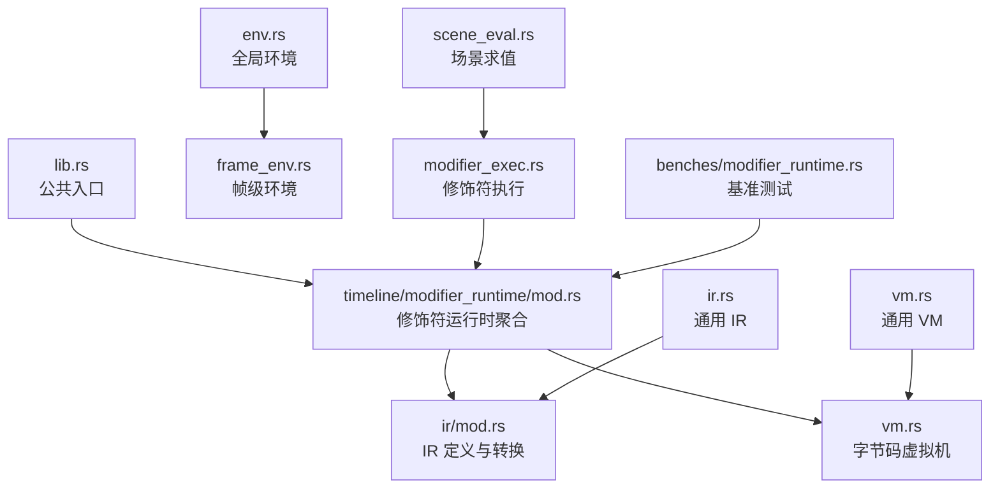
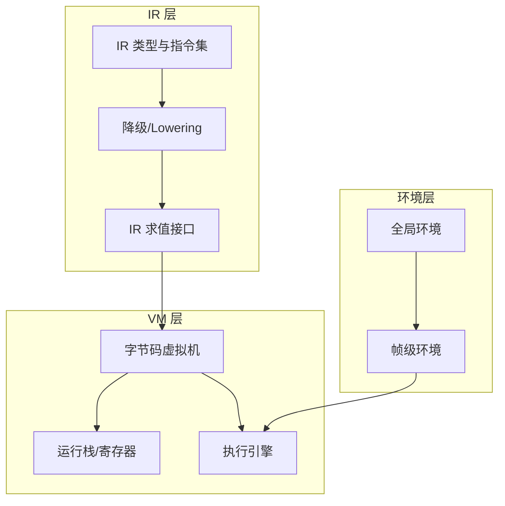
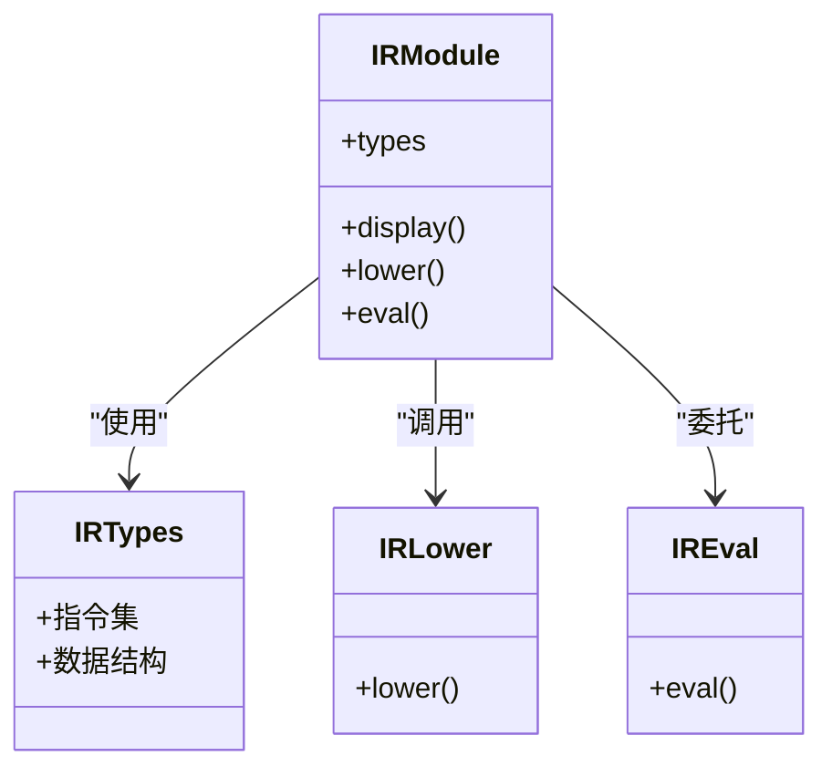
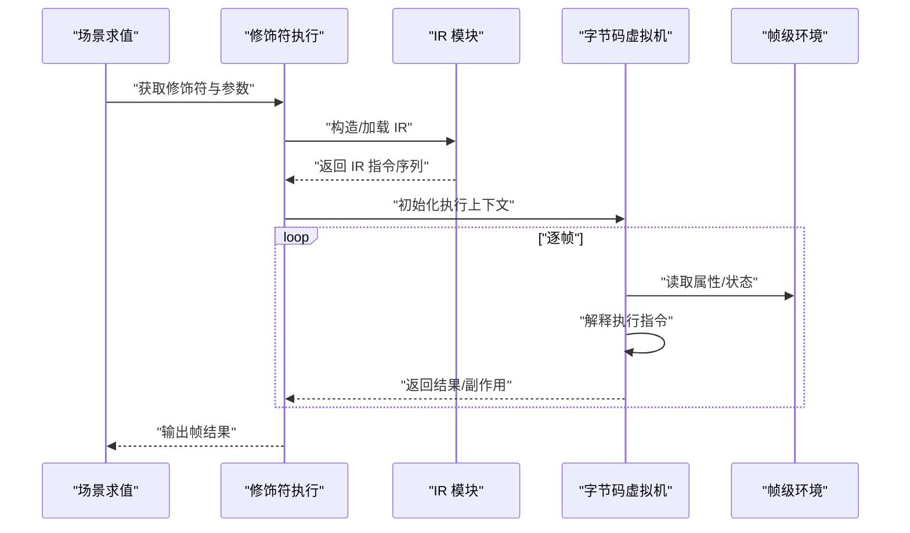
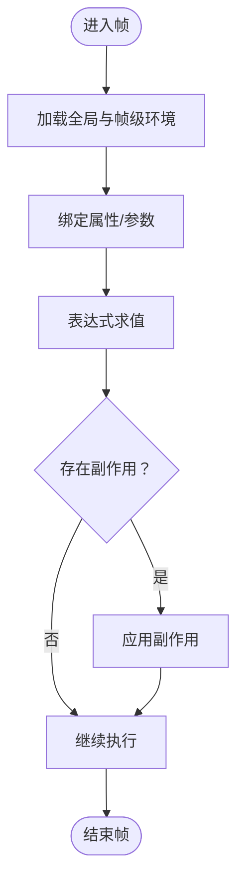
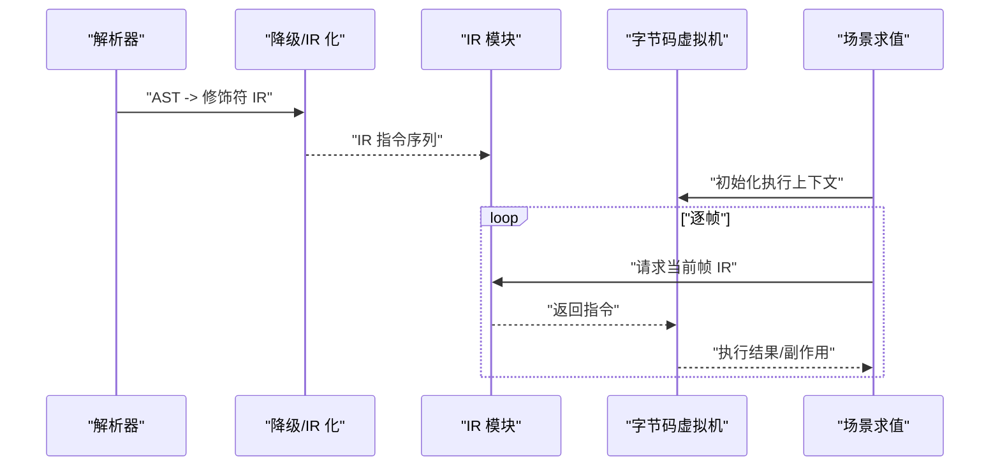
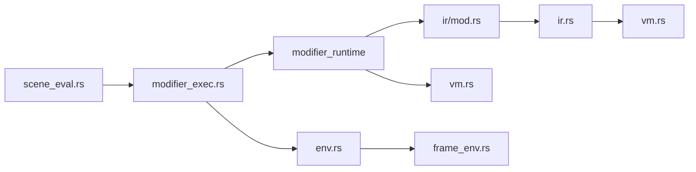

# 修饰符运行时

<cite>
**本文引用的文件**
- [crates/animatix/src/lib.rs](file://crates/animatix/src/lib.rs)
- [crates/animatix/src/main.rs](file://crates/animatix/src/main.rs)
- [crates/animatix/src/timeline/modifier_runtime/mod.rs](file://crates/animatix/src/timeline/modifier_runtime/mod.rs)
- [crates/animatix/src/timeline/modifier_runtime/vm.rs](file://crates/animatix/src/timeline/modifier_runtime/vm.rs)
- [crates/animatix/src/timeline/modifier_runtime/ir/mod.rs](file://crates/animatix/src/timeline/modifier_runtime/ir/mod.rs)
- [crates/animatix/src/timeline/modifier_runtime/ir/lower.rs](file://crates/animatix/src/timeline/modifier_runtime/ir/lower.rs)
- [crates/animatix/src/timeline/modifier_runtime/ir/eval.rs](file://crates/animatix/src/timeline/modifier_runtime/ir/eval.rs)
- [crates/animatix/src/timeline/modifier_runtime/ir/types.rs](file://crates/animatix/src/timeline/modifier_runtime/ir/types.rs)
- [crates/animatix/src/timeline/modifier_runtime/ir/display.rs](file://crates/animatix/src/timeline/modifier_runtime/ir/display.rs)
- [crates/animatix/src/timeline/modifier_exec.rs](file://crates/animatix/src/timeline/modifier_exec.rs)
- [crates/animatix/src/timeline/env.rs](file://crates/animatix/src/timeline/env.rs)
- [crates/animatix/src/timeline/frame_env.rs](file://crates/animatix/src/timeline/frame_env.rs)
- [crates/animatix/src/timeline/scene_eval.rs](file://crates/animatix/src/timeline/scene_eval.rs)
- [crates/animatix/src/ir.rs](file://crates/animatix/src/ir.rs)
- [crates/animatix/src/vm.rs](file://crates/animatix/src/vm.rs)
- [crates/animatix/src/benchmarks/modifier_runtime.rs](file://crates/animatix/src/benches/modifier_runtime.rs)
- [examples/22_expressions.amx](file://examples/22_expressions.amx)
- [examples/04_motion.amx](file://examples/04_motion.amx)
- [examples/06_reactive.amx](file://examples/06_reactive.amx)
- [examples/16_showcase.amx](file://examples/16_showcase.amx)
</cite>

## 目录
1. [引言](#引言)
2. [项目结构](#项目结构)
3. [核心组件](#核心组件)
4. [架构总览](#架构总览)
5. [详细组件分析](#详细组件分析)
6. [依赖关系分析](#依赖关系分析)
7. [性能考量](#性能考量)
8. [故障排查指南](#故障排查指南)
9. [结论](#结论)
10. [附录](#附录)

## 引言
本文件面向“修饰符运行时”系统，系统性阐述修饰符从语法树（AST）到中间表示（IR），再到字节码虚拟机（VM）的完整执行链路；解释修饰符在运行时的环境变量管理、表达式求值与副作用处理；总结性能优化策略（如缓存与基准测试）；并给出可操作的示例与实践建议。目标读者既包括需要快速上手的使用者，也包括希望深入理解实现细节的开发者。

## 项目结构
修饰符运行时相关的核心代码集中在以下模块：
- 运行时入口与公共接口：lib.rs、main.rs
- 修饰符运行时子系统：modifier_runtime（IR 与 VM）
- 通用 IR 与 VM：ir.rs、vm.rs
- 运行时环境：env.rs、frame_env.rs
- 场景求值与修饰符执行：scene_eval.rs、modifier_exec.rs
- 基准测试：benches/modifier_runtime.rs
- 示例场景：examples 下多份 amx 文件

图表来源
- [crates/animatix/src/lib.rs](file://crates/animatix/src/lib.rs)
- [crates/animatix/src/timeline/modifier_runtime/mod.rs](file://crates/animatix/src/timeline/modifier_runtime/mod.rs)
- [crates/animatix/src/timeline/modifier_runtime/ir/mod.rs](file://crates/animatix/src/timeline/modifier_runtime/ir/mod.rs)
- [crates/animatix/src/timeline/modifier_runtime/vm.rs](file://crates/animatix/src/timeline/modifier_runtime/vm.rs)
- [crates/animatix/src/ir.rs](file://crates/animatix/src/ir.rs)
- [crates/animatix/src/vm.rs](file://crates/animatix/src/vm.rs)
- [crates/animatix/src/timeline/env.rs](file://crates/animatix/src/timeline/env.rs)
- [crates/animatix/src/timeline/frame_env.rs](file://crates/animatix/src/timeline/frame_env.rs)
- [crates/animatix/src/timeline/scene_eval.rs](file://crates/animatix/src/timeline/scene_eval.rs)
- [crates/animatix/src/timeline/modifier_exec.rs](file://crates/animatix/src/timeline/modifier_exec.rs)
- [crates/animatix/src/benches/modifier_runtime.rs](file://crates/animatix/src/benches/modifier_runtime.rs)

章节来源
- [crates/animatix/src/lib.rs](file://crates/animatix/src/lib.rs)
- [crates/animatix/src/main.rs](file://crates/animatix/src/main.rs)

## 核心组件
- 修饰符运行时聚合器：负责组织 IR 与 VM 的协作，协调环境与求值。
- IR 子系统：定义修饰符 IR 的类型、显示与降级（lower）逻辑，以及求值（eval）接口。
- VM 子系统：承载字节码执行、栈管理、调用约定与运行时调度。
- 环境系统：提供全局与帧级上下文，支持属性查找与作用域隔离。
- 场景求值与修饰符执行：将场景图与修饰符绑定，驱动逐帧求值。
- 基准测试：对修饰符运行时进行性能度量与回归检测。

章节来源
- [crates/animatix/src/timeline/modifier_runtime/mod.rs](file://crates/animatix/src/timeline/modifier_runtime/mod.rs)
- [crates/animatix/src/timeline/modifier_runtime/ir/mod.rs](file://crates/animatix/src/timeline/modifier_runtime/ir/mod.rs)
- [crates/animatix/src/timeline/modifier_runtime/vm.rs](file://crates/animatix/src/timeline/modifier_runtime/vm.rs)
- [crates/animatix/src/timeline/env.rs](file://crates/animatix/src/timeline/env.rs)
- [crates/animatix/src/timeline/frame_env.rs](file://crates/animatix/src/timeline/frame_env.rs)
- [crates/animatix/src/timeline/scene_eval.rs](file://crates/animatix/src/timeline/scene_eval.rs)
- [crates/animatix/src/timeline/modifier_exec.rs](file://crates/animatix/src/timeline/modifier_exec.rs)
- [crates/animatix/src/benches/modifier_runtime.rs](file://crates/animatix/src/benches/modifier_runtime.rs)

## 架构总览
修饰符运行时采用“IR 驱动 + 字节码 VM”的分层设计：
- 低层 IR：描述修饰符的语义结构与控制流，便于跨平台与跨后端优化。
- 中层 VM：以指令序列执行 IR，提供稳定的运行时抽象。
- 上层环境：提供属性解析、作用域与帧状态，支撑表达式求值与副作用管理。
- 外部集成：通过场景求值与修饰符执行，接入渲染管线或导出流程。

图表来源
- [crates/animatix/src/timeline/modifier_runtime/ir/mod.rs](file://crates/animatix/src/timeline/modifier_runtime/ir/mod.rs)
- [crates/animatix/src/timeline/modifier_runtime/ir/lower.rs](file://crates/animatix/src/timeline/modifier_runtime/ir/lower.rs)
- [crates/animatix/src/timeline/modifier_runtime/ir/eval.rs](file://crates/animatix/src/timeline/modifier_runtime/ir/eval.rs)
- [crates/animatix/src/timeline/modifier_runtime/vm.rs](file://crates/animatix/src/timeline/modifier_runtime/vm.rs)
- [crates/animatix/src/timeline/env.rs](file://crates/animatix/src/timeline/env.rs)
- [crates/animatix/src/timeline/frame_env.rs](file://crates/animatix/src/timeline/frame_env.rs)

## 详细组件分析

### IR 子系统
IR 子系统负责修饰符的中间表示定义、显示与降级：
- 类型与指令：定义修饰符的语义节点、控制流与数据流，确保 VM 可直接解释执行。
- 显示（Display）：提供 IR 的人类可读打印与调试输出。
- 降级（Lower）：将高层 IR 转换为更基础的 IR 形态，便于 VM 执行。
- 求值（Eval）：定义 IR 的求值接口与契约，统一不同 IR 结构的执行方式。

图表来源
- [crates/animatix/src/timeline/modifier_runtime/ir/mod.rs](file://crates/animatix/src/timeline/modifier_runtime/ir/mod.rs)
- [crates/animatix/src/timeline/modifier_runtime/ir/types.rs](file://crates/animatix/src/timeline/modifier_runtime/ir/types.rs)
- [crates/animatix/src/timeline/modifier_runtime/ir/lower.rs](file://crates/animatix/src/timeline/modifier_runtime/ir/lower.rs)
- [crates/animatix/src/timeline/modifier_runtime/ir/eval.rs](file://crates/animatix/src/timeline/modifier_runtime/ir/eval.rs)

章节来源
- [crates/animatix/src/timeline/modifier_runtime/ir/mod.rs](file://crates/animatix/src/timeline/modifier_runtime/ir/mod.rs)
- [crates/animatix/src/timeline/modifier_runtime/ir/types.rs](file://crates/animatix/src/timeline/modifier_runtime/ir/types.rs)
- [crates/animatix/src/timeline/modifier_runtime/ir/lower.rs](file://crates/animatix/src/timeline/modifier_runtime/ir/lower.rs)
- [crates/animatix/src/timeline/modifier_runtime/ir/eval.rs](file://crates/animatix/src/timeline/modifier_runtime/ir/eval.rs)
- [crates/animatix/src/timeline/modifier_runtime/ir/display.rs](file://crates/animatix/src/timeline/modifier_runtime/ir/display.rs)

### VM 子系统
VM 子系统承载字节码执行，包含：
- 指令解释器：根据 IR 指令推进执行，维护调用栈与寄存器。
- 运行时调度：按帧推进，处理条件分支、循环与函数调用。
- 与 IR 的交互：通过 eval 接口与 IR 模块协同，完成表达式与副作用的执行。

图表来源
- [crates/animatix/src/timeline/scene_eval.rs](file://crates/animatix/src/timeline/scene_eval.rs)
- [crates/animatix/src/timeline/modifier_exec.rs](file://crates/animatix/src/timeline/modifier_exec.rs)
- [crates/animatix/src/timeline/modifier_runtime/ir/mod.rs](file://crates/animatix/src/timeline/modifier_runtime/ir/mod.rs)
- [crates/animatix/src/timeline/modifier_runtime/vm.rs](file://crates/animatix/src/timeline/modifier_runtime/vm.rs)
- [crates/animatix/src/timeline/frame_env.rs](file://crates/animatix/src/timeline/frame_env.rs)

章节来源
- [crates/animatix/src/timeline/modifier_runtime/vm.rs](file://crates/animatix/src/timeline/modifier_runtime/vm.rs)

### 环境与作用域
- 全局环境（env.rs）：提供全局属性与常量，作为修饰符可访问的根命名空间。
- 帧级环境（frame_env.rs）：封装当前帧的状态、时间戳与局部变量，供表达式求值使用。
- 修饰符执行（modifier_exec.rs）：在每帧中将环境注入 IR/VM，驱动表达式计算与副作用更新。

图表来源
- [crates/animatix/src/timeline/env.rs](file://crates/animatix/src/timeline/env.rs)
- [crates/animatix/src/timeline/frame_env.rs](file://crates/animatix/src/timeline/frame_env.rs)
- [crates/animatix/src/timeline/modifier_exec.rs](file://crates/animatix/src/timeline/modifier_exec.rs)

章节来源
- [crates/animatix/src/timeline/env.rs](file://crates/animatix/src/timeline/env.rs)
- [crates/animatix/src/timeline/frame_env.rs](file://crates/animatix/src/timeline/frame_env.rs)
- [crates/animatix/src/timeline/modifier_exec.rs](file://crates/animatix/src/timeline/modifier_exec.rs)

### 编译与执行流程（从 AST 到字节码）
该流程由场景求值与修饰符执行共同完成：
- 解析与构建 AST：解析 amx 场景文件，生成 AST。
- 降级与 IR 化：将 AST 降级为修饰符 IR，准备 VM 执行。
- 初始化 VM：装载 IR 指令序列，建立执行上下文。
- 帧级求值：在每帧中读取环境、解释执行、收集结果与副作用。

图表来源
- [crates/animatix/src/timeline/scene_eval.rs](file://crates/animatix/src/timeline/scene_eval.rs)
- [crates/animatix/src/timeline/modifier_runtime/ir/lower.rs](file://crates/animatix/src/timeline/modifier_runtime/ir/lower.rs)
- [crates/animatix/src/timeline/modifier_runtime/ir/mod.rs](file://crates/animatix/src/timeline/modifier_runtime/ir/mod.rs)
- [crates/animatix/src/timeline/modifier_runtime/vm.rs](file://crates/animatix/src/timeline/modifier_runtime/vm.rs)

章节来源
- [crates/animatix/src/timeline/scene_eval.rs](file://crates/animatix/src/timeline/scene_eval.rs)
- [crates/animatix/src/timeline/modifier_runtime/ir/lower.rs](file://crates/animatix/src/timeline/modifier_runtime/ir/lower.rs)

### 性能优化策略
- 缓存与复用：对已求值的表达式与中间结果进行缓存，避免重复计算。
- 基准测试：通过 benches/modifier_runtime.rs 对关键路径进行回归检测与热点识别。
- IR 降级与 VM 指令优化：通过 IR 层的降级与 VM 层的指令解释，平衡可移植性与执行效率。

章节来源
- [crates/animatix/src/benches/modifier_runtime.rs](file://crates/animatix/src/benches/modifier_runtime.rs)

## 依赖关系分析
修饰符运行时的关键依赖关系如下：
- 修饰符运行时聚合器依赖 IR 与 VM 子系统。
- IR 子系统依赖通用 IR 与 VM 抽象。
- 场景求值与修饰符执行依赖环境系统与 VM。
- 基准测试依赖运行时模块以评估性能。

图表来源
- [crates/animatix/src/timeline/modifier_runtime/mod.rs](file://crates/animatix/src/timeline/modifier_runtime/mod.rs)
- [crates/animatix/src/timeline/modifier_runtime/ir/mod.rs](file://crates/animatix/src/timeline/modifier_runtime/ir/mod.rs)
- [crates/animatix/src/timeline/modifier_runtime/vm.rs](file://crates/animatix/src/timeline/modifier_runtime/vm.rs)
- [crates/animatix/src/ir.rs](file://crates/animatix/src/ir.rs)
- [crates/animatix/src/vm.rs](file://crates/animatix/src/vm.rs)
- [crates/animatix/src/timeline/scene_eval.rs](file://crates/animatix/src/timeline/scene_eval.rs)
- [crates/animatix/src/timeline/modifier_exec.rs](file://crates/animatix/src/timeline/modifier_exec.rs)
- [crates/animatix/src/timeline/env.rs](file://crates/animatix/src/timeline/env.rs)
- [crates/animatix/src/timeline/frame_env.rs](file://crates/animatix/src/timeline/frame_env.rs)

章节来源
- [crates/animatix/src/timeline/modifier_runtime/mod.rs](file://crates/animatix/src/timeline/modifier_runtime/mod.rs)
- [crates/animatix/src/timeline/modifier_runtime/ir/mod.rs](file://crates/animatix/src/timeline/modifier_runtime/ir/mod.rs)
- [crates/animatix/src/timeline/modifier_runtime/vm.rs](file://crates/animatix/src/timeline/modifier_runtime/vm.rs)
- [crates/animatix/src/ir.rs](file://crates/animatix/src/ir.rs)
- [crates/animatix/src/vm.rs](file://crates/animatix/src/vm.rs)
- [crates/animatix/src/timeline/scene_eval.rs](file://crates/animatix/src/timeline/scene_eval.rs)
- [crates/animatix/src/timeline/modifier_exec.rs](file://crates/animatix/src/timeline/modifier_exec.rs)
- [crates/animatix/src/timeline/env.rs](file://crates/animatix/src/timeline/env.rs)
- [crates/animatix/src/timeline/frame_env.rs](file://crates/animatix/src/timeline/frame_env.rs)

## 性能考量
- 优先使用缓存：对表达式与属性查询进行缓存，减少重复开销。
- IR 降级策略：在保证正确性的前提下，尽量将复杂表达式简化为 VM 友好的指令序列。
- 基准测试驱动：通过 benches/modifier_runtime.rs 持续监控关键路径性能，及时发现回归。
- 分帧调度：合理安排修饰符的执行顺序与频率，避免单帧过载。

## 故障排查指南
- 表达式求值异常：检查帧级环境是否正确注入，确认属性键名与作用域一致。
- 副作用未生效：核对修饰符执行流程中的副作用应用阶段，确保在正确时机写回状态。
- 性能瓶颈：利用基准测试定位热点，结合 IR 降级与缓存策略优化。

章节来源
- [crates/animatix/src/timeline/frame_env.rs](file://crates/animatix/src/timeline/frame_env.rs)
- [crates/animatix/src/timeline/modifier_exec.rs](file://crates/animatix/src/timeline/modifier_exec.rs)
- [crates/animatix/src/benches/modifier_runtime.rs](file://crates/animatix/src/benches/modifier_runtime.rs)

## 结论
修饰符运行时通过“IR 驱动 + 字节码 VM”的架构，在保证可移植性的同时提供了高效的执行能力。配合完善的环境系统与基准测试，能够稳定地支撑复杂的动画与交互场景。建议在实践中优先考虑缓存与 IR 降级，并以基准测试持续优化关键路径。

## 附录

### 实际示例与实践建议
- 示例场景：examples/22_expressions.amx、examples/04_motion.amx、examples/06_reactive.amx、examples/16_showcase.amx 提供了丰富的修饰符用法，可作为学习与验证的基础。
- 编写步骤建议：
  1) 在 amx 场景中定义修饰符与属性。
  2) 使用场景求值加载并构建 IR。
  3) 初始化 VM 并在每帧推进执行。
  4) 通过帧级环境注入动态参数，观察表达式与副作用效果。
  5) 使用基准测试评估性能并迭代优化。

章节来源
- [examples/22_expressions.amx](file://examples/22_expressions.amx)
- [examples/04_motion.amx](file://examples/04_motion.amx)
- [examples/06_reactive.amx](file://examples/06_reactive.amx)
- [examples/16_showcase.amx](file://examples/16_showcase.amx)