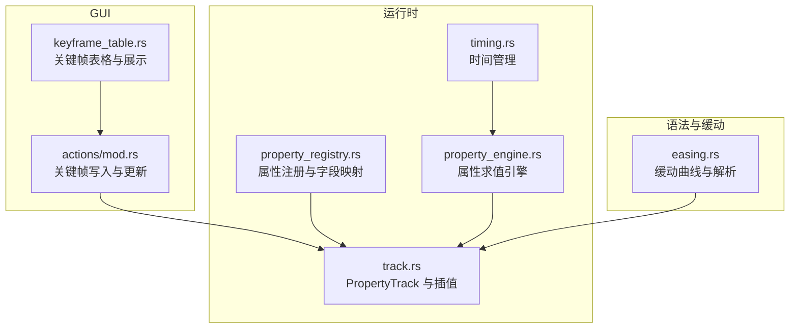
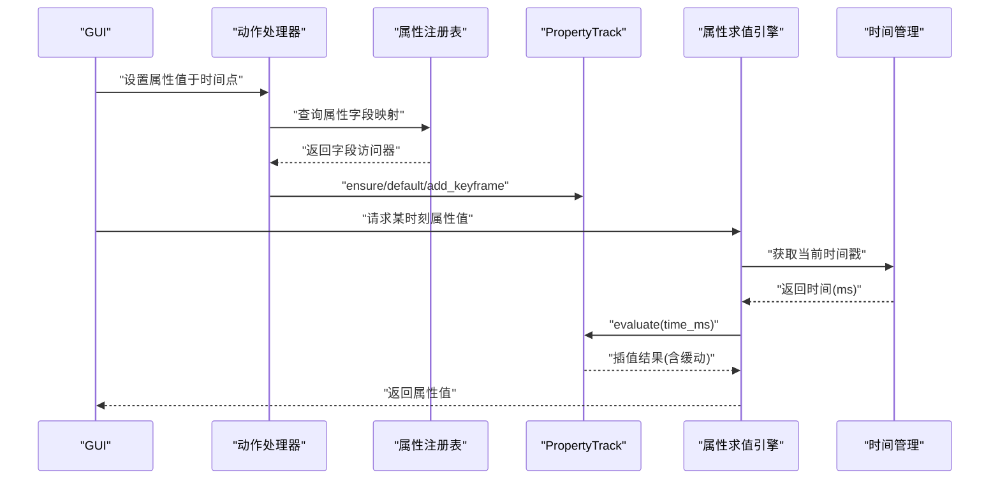
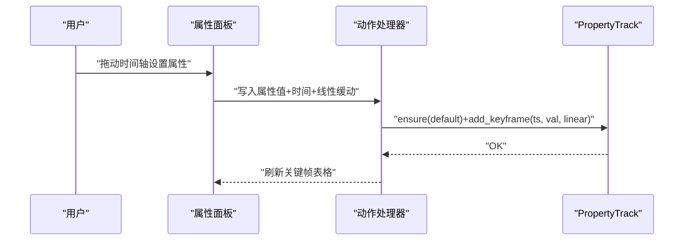
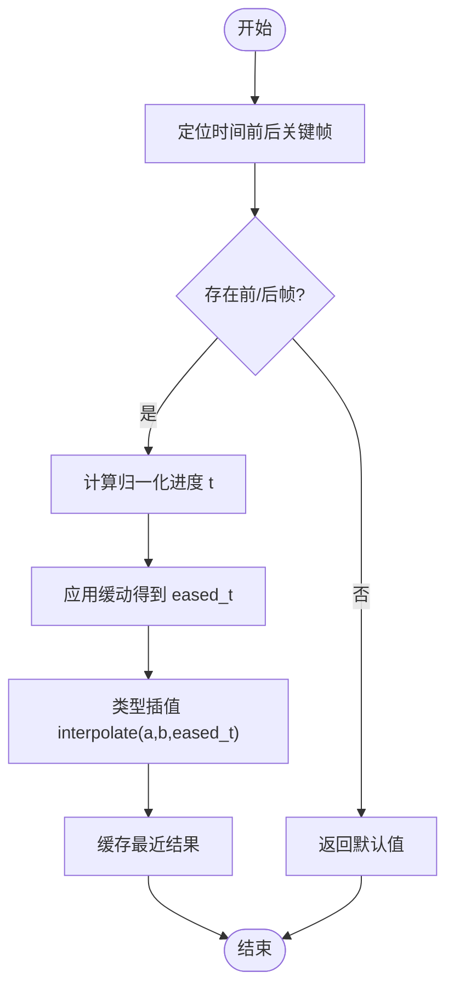
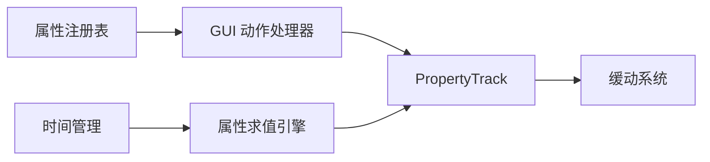

# 关键帧系统

<cite>
**本文引用的文件**
- [crates/animatix/src/timeline/track.rs](file://crates/animatix/src/timeline/track.rs)
- [crates/animatix/src/timeline/property_engine.rs](file://crates/animatix/src/timeline/property_engine.rs)
- [crates/animatix/src/timeline/property_registry.rs](file://crates/animatix/src/timeline/property_registry.rs)
- [crates/animatix/src/timeline/timing.rs](file://crates/animatix/src/timeline/timing.rs)
- [crates/animatix-syntax/src/easing.rs](file://crates/animatix-syntax/src/easing.rs)
- [crates/animatix-gui/src/app/actions/mod.rs](file://crates/animatix-gui/src/app/actions/mod.rs)
- [crates/animatix-gui/src/app/panels/inspector/keyframe_table.rs](file://crates/animatix-gui/src/app/panels/inspector/keyframe_table.rs)
</cite>

## 目录
1. [引言](#引言)
2. [项目结构](#项目结构)
3. [核心组件](#核心组件)
4. [架构总览](#架构总览)
5. [详细组件分析](#详细组件分析)
6. [依赖关系分析](#依赖关系分析)
7. [性能考量](#性能考量)
8. [故障排查指南](#故障排查指南)
9. [结论](#结论)
10. [附录](#附录)

## 引言
本文件围绕关键帧系统展开，系统性阐述关键帧的概念与实现机制，重点覆盖以下方面：
- PropertyTrack 的时间插值算法与缓动函数应用
- 关键帧的存储结构（时间戳、值与缓动）
- 不同类型属性（位置、旋转、缩放、颜色等）如何通过关键帧驱动动画
- 时间管理：时间戳处理、关键帧查找与插值计算
- 性能优化：缓存机制与增量更新策略
- 实际操作示例：创建、修改、删除关键帧的方法路径

## 项目结构
关键帧系统横跨语法层、运行时层与 GUI 层：
- 语法与缓动定义：位于 animatix-syntax，提供标准缓动曲线与解析
- 运行时与插值：位于 animatix，包含 PropertyTrack、插值接口与属性注册表
- 时间管理：位于 animatix 的 timeline 模块，统一处理时间戳与播放节奏
- GUI 交互：位于 animatix-gui，提供关键帧增删改查与可视化编辑



图表来源
- [crates/animatix/src/timeline/track.rs:438-447](file://crates/animatix/src/timeline/track.rs#L438-L447)
- [crates/animatix/src/timeline/property_engine.rs:1-50](file://crates/animatix/src/timeline/property_engine.rs#L1-L50)
- [crates/animatix/src/timeline/property_registry.rs:1-80](file://crates/animatix/src/timeline/property_registry.rs#L1-L80)
- [crates/animatix/src/timeline/timing.rs:1-60](file://crates/animatix/src/timeline/timing.rs#L1-L60)
- [crates/animatix-syntax/src/easing.rs:1-173](file://crates/animatix-syntax/src/easing.rs#L1-L173)
- [crates/animatix-gui/src/app/actions/mod.rs:491-515](file://crates/animatix-gui/src/app/actions/mod.rs#L491-L515)
- [crates/animatix-gui/src/app/panels/inspector/keyframe_table.rs:269-299](file://crates/animatix-gui/src/app/panels/inspector/keyframe_table.rs#L269-L299)

章节来源
- [crates/animatix/src/timeline/track.rs:438-447](file://crates/animatix/src/timeline/track.rs#L438-L447)
- [crates/animatix/src/timeline/property_registry.rs:1-80](file://crates/animatix/src/timeline/property_registry.rs#L1-L80)
- [crates/animatix/src/timeline/timing.rs:1-60](file://crates/animatix/src/timeline/timing.rs#L1-L60)
- [crates/animatix-syntax/src/easing.rs:1-173](file://crates/animatix-syntax/src/easing.rs#L1-L173)
- [crates/animatix-gui/src/app/actions/mod.rs:491-515](file://crates/animatix-gui/src/app/actions/mod.rs#L491-L515)
- [crates/animatix-gui/src/app/panels/inspector/keyframe_table.rs:269-299](file://crates/animatix-gui/src/app/panels/inspector/keyframe_table.rs#L269-L299)

## 核心组件
- PropertyTrack：按时间戳维护键值对（值, 缓动），支持默认值与最近一次评估缓存
- 插值接口 Interpolate：定义任意类型在两个状态之间的线性或非线性插值
- 缓动系统 Easing：提供多种标准曲线与自定义贝塞尔曲线
- 属性注册表：将属性名映射到具体字段，驱动 GUI 侧的关键帧写入
- 时间管理：统一时间戳单位与播放节奏，支撑关键帧查找与插值

章节来源
- [crates/animatix/src/timeline/track.rs:438-447](file://crates/animatix/src/timeline/track.rs#L438-L447)
- [crates/animatix/src/timeline/track.rs:196-226](file://crates/animatix/src/timeline/track.rs#L196-L226)
- [crates/animatix/src/timeline/property_engine.rs:1-50](file://crates/animatix/src/timeline/property_engine.rs#L1-L50)
- [crates/animatix/src/timeline/property_registry.rs:1-80](file://crates/animatix/src/timeline/property_registry.rs#L1-L80)
- [crates/animatix/src/timeline/timing.rs:1-60](file://crates/animatix/src/timeline/timing.rs#L1-L60)
- [crates/animatix-syntax/src/easing.rs:1-173](file://crates/animatix-syntax/src/easing.rs#L1-L173)

## 架构总览
关键帧系统采用“注册表驱动 + 运行时插值”的分层设计：
- 注册表层：声明属性与字段映射，决定哪些属性可被关键帧化
- 运行时层：根据当前时间在相邻关键帧间插值，应用缓动
- 语法层：提供缓动曲线与解析，确保一致性
- GUI 层：负责关键帧的创建、修改与删除，并写回运行时



图表来源
- [crates/animatix-gui/src/app/actions/mod.rs:491-515](file://crates/animatix-gui/src/app/actions/mod.rs#L491-L515)
- [crates/animatix/src/timeline/property_registry.rs:1-80](file://crates/animatix/src/timeline/property_registry.rs#L1-L80)
- [crates/animatix/src/timeline/track.rs:438-447](file://crates/animatix/src/timeline/track.rs#L438-L447)
- [crates/animatix/src/timeline/property_engine.rs:1-50](file://crates/animatix/src/timeline/property_engine.rs#L1-L50)
- [crates/animatix/src/timeline/timing.rs:1-60](file://crates/animatix/src/timeline/timing.rs#L1-L60)

## 详细组件分析

### PropertyTrack 与时间插值
- 存储结构：以 BTreeMap 维护“时间戳 → (值, 缓动)”对；提供默认值 fallback
- 评估流程：定位目标时间前后相邻关键帧，按缓动调整进度后调用 Interpolate::interpolate
- 缓存策略：最近一次评估结果缓存在 RefCell 中，避免重复计算

```mermaid
classDiagram
class PropertyTrack_T {
+keyframes : BTreeMap<u64, (T, Easing)>
+default_value : T
-last_evaluated : RefCell<Option<(u64, T)>>
+evaluate(time_ms) T
+add_keyframe(ts, value, easing) void
+last_value() T
+last_keyframe_time() Option<u64>
}
class Easing {
<<enum>>
+Linear
+EaseIn
+EaseOut
+EaseInOut
+Bounce
+Elastic
+Back
+Expo
+CubicBezier([f32; 4])
}
class Interpolate {
<<trait>>
+interpolate(other, t) T
}
PropertyTrack_T --> Easing : "使用"
PropertyTrack_T --> Interpolate : "调用"
```

图表来源
- [crates/animatix/src/timeline/track.rs:438-447](file://crates/animatix/src/timeline/track.rs#L438-L447)
- [crates/animatix/src/timeline/track.rs:196-226](file://crates/animatix/src/timeline/track.rs#L196-L226)
- [crates/animatix-syntax/src/easing.rs:1-173](file://crates/animatix-syntax/src/easing.rs#L1-L173)

章节来源
- [crates/animatix/src/timeline/track.rs:438-447](file://crates/animatix/src/timeline/track.rs#L438-L447)
- [crates/animatix/src/timeline/track.rs:196-226](file://crates/animatix/src/timeline/track.rs#L196-L226)
- [crates/animatix-syntax/src/easing.rs:1-173](file://crates/animatix-syntax/src/easing.rs#L1-L173)

### 缓动函数与应用
- 支持线性、缓入、缓出、缓入缓出、弹性、回退、指数、弹跳以及自定义三次贝塞尔
- 提供解析函数将名称映射为缓动枚举，便于 UI 与脚本层统一
- 在插值前先对归一化进度应用缓动，再进行类型特定插值

章节来源
- [crates/animatix-syntax/src/easing.rs:1-173](file://crates/animatix-syntax/src/easing.rs#L1-L173)

### 属性类型与关键帧控制
- 位置/旋转/缩放：常见几何属性，通常对应标量或向量类型，通过 PropertyTrack 管理
- 颜色：四元数或 RGBA 向量，插值时需注意色彩空间与环绕
- 文本/路径点列：复杂类型插值需保证长度一致与元素级插值

章节来源
- [crates/animatix/src/timeline/track.rs:428-436](file://crates/animatix/src/timeline/track.rs#L428-L436)
- [crates/animatix-gui/src/app/actions/mod.rs:491-515](file://crates/animatix-gui/src/app/actions/mod.rs#L491-L515)

### 时间管理与查找
- 时间戳单位：统一使用毫秒，便于 UI 与渲染管线协作
- 查找策略：利用 BTreeMap 的有序特性快速定位前后关键帧
- 边界处理：无关键帧时返回默认值；仅有一帧时直接返回该值

章节来源
- [crates/animatix/src/timeline/timing.rs:1-60](file://crates/animatix/src/timeline/timing.rs#L1-L60)
- [crates/animatix/src/timeline/track.rs:438-447](file://crates/animatix/src/timeline/track.rs#L438-L447)

### GUI 关键帧操作流
- 创建：当属性首次赋值时，若不存在对应 Track 则创建并写入默认值与关键帧
- 修改：更新已有关键帧的值或缓动
- 删除：移除指定时间戳的关键帧



图表来源
- [crates/animatix-gui/src/app/actions/mod.rs:491-515](file://crates/animatix-gui/src/app/actions/mod.rs#L491-L515)
- [crates/animatix-gui/src/app/panels/inspector/keyframe_table.rs:269-299](file://crates/animatix-gui/src/app/panels/inspector/keyframe_table.rs#L269-L299)

章节来源
- [crates/animatix-gui/src/app/actions/mod.rs:491-515](file://crates/animatix-gui/src/app/actions/mod.rs#L491-L515)
- [crates/animatix-gui/src/app/panels/inspector/keyframe_table.rs:269-299](file://crates/animatix-gui/src/app/panels/inspector/keyframe_table.rs#L269-L299)

### 关键帧存储结构与复杂度
- 结构：BTreeMap<u64, (T, Easing)>，按键序组织，便于范围查询与边界查找
- 复杂度：插入/查找/删除均为 O(log N)；相邻关键帧查找 O(1) 于定位后
- 默认值：作为空轨道的回退值，避免每次评估都构造新对象

章节来源
- [crates/animatix/src/timeline/track.rs:438-447](file://crates/animatix/src/timeline/track.rs#L438-L447)

### 插值算法流程


图表来源
- [crates/animatix/src/timeline/track.rs:196-226](file://crates/animatix/src/timeline/track.rs#L196-L226)
- [crates/animatix-syntax/src/easing.rs:51-105](file://crates/animatix-syntax/src/easing.rs#L51-L105)

## 依赖关系分析
- 注册表驱动 GUI 写入：属性名 → 字段映射 → Track 访问器
- 运行时求值：时间管理提供时间戳 → PropertyTrack 插值 → 属性引擎输出
- 缓动依赖：所有插值前均经由缓动模块转换进度



图表来源
- [crates/animatix/src/timeline/property_registry.rs:1-80](file://crates/animatix/src/timeline/property_registry.rs#L1-L80)
- [crates/animatix-gui/src/app/actions/mod.rs:491-515](file://crates/animatix-gui/src/app/actions/mod.rs#L491-L515)
- [crates/animatix/src/timeline/track.rs:438-447](file://crates/animatix/src/timeline/track.rs#L438-L447)
- [crates/animatix/src/timeline/property_engine.rs:1-50](file://crates/animatix/src/timeline/property_engine.rs#L1-L50)
- [crates/animatix/src/timeline/timing.rs:1-60](file://crates/animatix/src/timeline/timing.rs#L1-L60)
- [crates/animatix-syntax/src/easing.rs:1-173](file://crates/animatix-syntax/src/easing.rs#L1-L173)

章节来源
- [crates/animatix/src/timeline/property_registry.rs:1-80](file://crates/animatix/src/timeline/property_registry.rs#L1-L80)
- [crates/animatix/src/timeline/property_engine.rs:1-50](file://crates/animatix/src/timeline/property_engine.rs#L1-L50)
- [crates/animatix/src/timeline/timing.rs:1-60](file://crates/animatix/src/timeline/timing.rs#L1-L60)
- [crates/animatix/src/timeline/track.rs:438-447](file://crates/animatix/src/timeline/track.rs#L438-L447)
- [crates/animatix-syntax/src/easing.rs:1-173](file://crates/animatix-syntax/src/easing.rs#L1-L173)

## 性能考量
- 缓存机制：最近一次评估结果缓存，减少重复时间戳的重复计算
- 增量更新：仅在关键帧变更时重建相关区间，避免全轨道重算
- 数据结构选择：BTreeMap 提供稳定有序与高效查找，适合频繁插入与范围扫描
- 类型插值：针对复杂类型（如点列表）进行元素级插值，避免整组拷贝

章节来源
- [crates/animatix/src/timeline/track.rs:438-447](file://crates/animatix/src/timeline/track.rs#L438-L447)
- [crates/animatix/src/timeline/track.rs:428-436](file://crates/animatix/src/timeline/track.rs#L428-L436)

## 故障排查指南
- 关键帧未生效
  - 检查属性是否在注册表中启用关键帧
  - 确认时间戳是否正确（毫秒单位）
  - 核对是否存在默认值覆盖
- 插值异常
  - 检查相邻关键帧数量与顺序
  - 确认缓动参数是否有效
- 性能问题
  - 观察缓存命中率（最近评估缓存）
  - 减少不必要的关键帧密度

章节来源
- [crates/animatix/src/timeline/property_registry.rs:1-80](file://crates/animatix/src/timeline/property_registry.rs#L1-L80)
- [crates/animatix/src/timeline/track.rs:196-226](file://crates/animatix/src/timeline/track.rs#L196-L226)
- [crates/animatix/src/timeline/timing.rs:1-60](file://crates/animatix/src/timeline/timing.rs#L1-L60)

## 结论
关键帧系统通过“注册表驱动 + 运行时插值 + 缓动统一”的设计，在保证易用性的同时兼顾性能与扩展性。其核心在于：
- 明确的存储结构与时间管理
- 可组合的缓动与类型插值
- GUI 与运行时的一致性契约
- 面向未来的增量优化空间

## 附录
- 实际操作方法路径（不展示代码，仅给出路径）
  - 创建关键帧：[crates/animatix-gui/src/app/actions/mod.rs:491-515](file://crates/animatix-gui/src/app/actions/mod.rs#L491-L515)
  - 修改关键帧：[crates/animatix-gui/src/app/panels/inspector/keyframe_table.rs:269-299](file://crates/animatix-gui/src/app/panels/inspector/keyframe_table.rs#L269-L299)
  - 删除关键帧：[crates/animatix-gui/src/app/actions/mod.rs:491-515](file://crates/animatix-gui/src/app/actions/mod.rs#L491-L515)
  - 插值与缓动：[crates/animatix/src/timeline/track.rs:196-226](file://crates/animatix/src/timeline/track.rs#L196-L226), [crates/animatix-syntax/src/easing.rs:51-105](file://crates/animatix-syntax/src/easing.rs#L51-L105)
  - 属性注册与字段映射：[crates/animatix/src/timeline/property_registry.rs:1-80](file://crates/animatix/src/timeline/property_registry.rs#L1-L80)
  - 时间管理：[crates/animatix/src/timeline/timing.rs:1-60](file://crates/animatix/src/timeline/timing.rs#L1-L60)