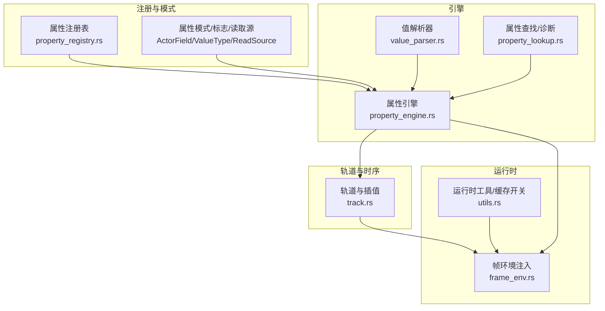
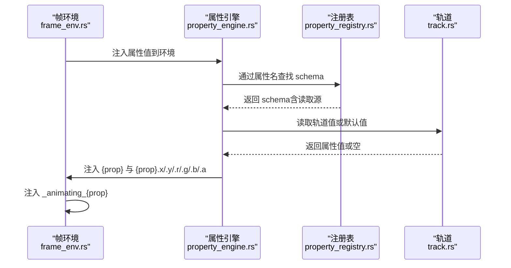
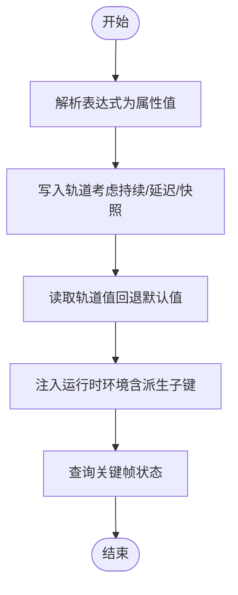
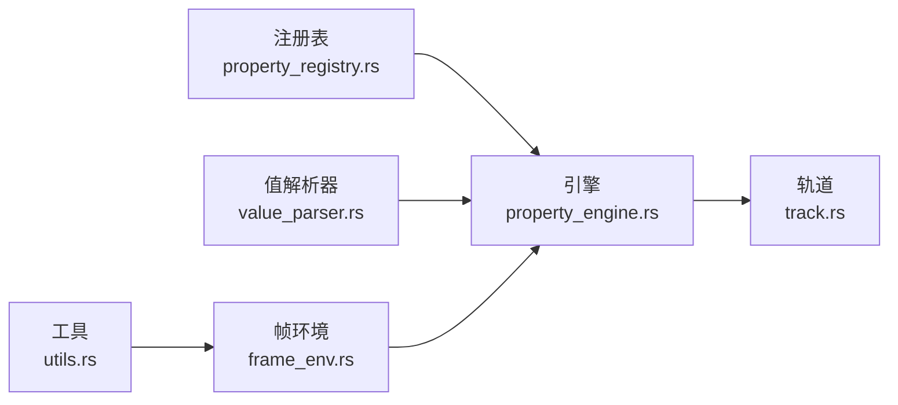

# 属性跟踪

<cite>
**本文引用的文件**   
- [property_registry.rs](file://crates/animatix/src/timeline/property_registry.rs)
- [property_engine.rs](file://crates/animatix/src/timeline/property_engine.rs)
- [property_lookup.rs](file://crates/animatix/src/timeline/property_lookup.rs)
- [value_parser.rs](file://crates/animatix/src/timeline/value_parser.rs)
- [track.rs](file://crates/animatix/src/timeline/track.rs)
- [frame_env.rs](file://crates/animatix/src/timeline/frame_env.rs)
- [utils.rs](file://crates/animatix/src/timeline/utils.rs)
</cite>

## 目录
1. [简介](#简介)
2. [项目结构](#项目结构)
3. [核心组件](#核心组件)
4. [架构总览](#架构总览)
5. [详细组件分析](#详细组件分析)
6. [依赖关系分析](#依赖关系分析)
7. [性能考量](#性能考量)
8. [故障排查指南](#故障排查指南)
9. [结论](#结论)
10. [附录：实际示例与用法指引](#附录实际示例与用法指引)

## 简介
本文件系统性阐述 Animatix 的属性跟踪体系，涵盖属性注册表、属性查找与属性值读取的完整流程；解释标量、向量、颜色与复合属性的跟踪方式；说明父子节点属性继承与覆盖规则；剖析属性评估的性能优化（含缓存与延迟计算）；并提供可操作的查询示例，帮助读者在实践中高效使用属性跟踪能力。

## 项目结构
属性跟踪系统主要由以下模块构成：
- 注册表与模式：定义属性名、类型、存储字段、适用对象、默认值与读取源等元信息，并提供二分查找接口。
- 引擎层：统一解析表达式为属性值、写入轨道、读取轨道值、注入运行时环境、查询关键帧状态。
- 轨道与插值：以时间轴为中心的键帧轨道，支持多种数值类型的插值与缓存。
- 运行时注入：将属性值及其派生子键（如 .x/.y/.r/.g/.b/.a）注入到运行时环境，支持覆盖优先级。
- 解析与诊断：表达式解析、颜色解析、路径建议与错误诊断。



**图表来源**
- [property_registry.rs:1-680](file://crates/animatix/src/timeline/property_registry.rs#L1-L680)
- [property_engine.rs:1-776](file://crates/animatix/src/timeline/property_engine.rs#L1-L776)
- [value_parser.rs:39-96](file://crates/animatix/src/timeline/value_parser.rs#L39-L96)
- [property_lookup.rs:1-190](file://crates/animatix/src/timeline/property_lookup.rs#L1-L190)
- [track.rs:438-537](file://crates/animatix/src/timeline/track.rs#L438-L537)
- [frame_env.rs:166-186](file://crates/animatix/src/timeline/frame_env.rs#L166-L186)
- [utils.rs:32-68](file://crates/animatix/src/timeline/utils.rs#L32-L68)

**章节来源**
- [property_registry.rs:1-680](file://crates/animatix/src/timeline/property_registry.rs#L1-L680)
- [property_engine.rs:1-776](file://crates/animatix/src/timeline/property_engine.rs#L1-L776)
- [track.rs:438-537](file://crates/animatix/src/timeline/track.rs#L438-L537)

## 核心组件
- 属性注册表与模式
  - 定义属性名、值类型、特征标志、存储字段、适用对象、默认值与读取源。
  - 提供按名称二分查找 schema 的接口，保证 O(log n) 查找复杂度。
- 属性引擎
  - 统一解析表达式为属性值，写入轨道，读取轨道值，注入运行时环境，查询关键帧状态。
  - 支持 override 优先级的“有效值”读取函数族。
- 键帧轨道与插值
  - 使用 BTreeMap 存储键帧，支持线性与自定义缓动曲线插值。
  - 内置最近一次查询结果的缓存，避免重复计算。
- 运行时环境注入
  - 将属性值与派生子键注入到帧环境，支持父子标签前缀与覆盖注入。
  - 自动注入“正在动画”的标记位，便于运行时判断。

**章节来源**
- [property_registry.rs:609-618](file://crates/animatix/src/timeline/property_registry.rs#L609-L618)
- [property_engine.rs:90-98](file://crates/animatix/src/timeline/property_engine.rs#L90-L98)
- [property_engine.rs:435-480](file://crates/animatix/src/timeline/property_engine.rs#L435-L480)
- [track.rs:448-514](file://crates/animatix/src/timeline/track.rs#L448-L514)
- [frame_env.rs:166-186](file://crates/animatix/src/timeline/frame_env.rs#L166-L186)

## 架构总览
属性跟踪从“注册表—引擎—轨道—运行时”的链路贯通，形成稳定的调度闭环。下图展示了典型帧评估的关键调用序列。



**图表来源**
- [frame_env.rs:166-186](file://crates/animatix/src/timeline/frame_env.rs#L166-L186)
- [property_engine.rs:588-643](file://crates/animatix/src/timeline/property_engine.rs#L588-L643)
- [property_registry.rs:609-618](file://crates/animatix/src/timeline/property_registry.rs#L609-L618)
- [track.rs:448-514](file://crates/animatix/src/timeline/track.rs#L448-L514)

## 详细组件分析

### 组件A：属性注册表与模式
- 职责
  - 描述所有内置属性的元数据，包括名称、值类型、特征标志、存储字段、适用对象、默认值与读取源。
  - 提供按名称二分查找 schema 的接口，确保 O(log n) 复杂度。
- 关键点
  - 值类型覆盖标量、向量、颜色、字符串、变换矩阵、命令列表、点集等。
  - 特征标志包含可动画、可赋值、可注入、影响布局等。
  - 读取源支持直接字段读取、别名读取、组件提取（如 width 由 size.x 派生）与不可读。
  - 适用对象通过枚举限定到具体 ActorKind 或形状种类。
- 设计优势
  - 将分散的匹配逻辑收敛为两步：schema 查找 + 枚举匹配，提升可维护性与扩展性。

```mermaid
classDiagram
class PropertySchema {
+string name
+ValueType value_type
+PropertyFlags flags
+ActorField field
+Option~GroupMembership~ group
+Applicable applicable
+fn default_value(kind) -> PropertyValue
+ReadSource read_source
}
class ReadSource {
+Field(ActorField)
+Alias(ActorField)
+Component{field,index,scale}
+None_
+read(track,time_ms) -> Option~PropertyValue~
+storage_field() -> Option~ActorField~
}
class ActorField {
<<enum>>
+Position, Size, Color, StrokeWidth...
+default_value() -> Option~PropertyValue~
}
PropertySchema --> ReadSource : "使用"
PropertySchema --> ActorField : "映射到"
```

**图表来源**
- [property_registry.rs:474-501](file://crates/animatix/src/timeline/property_registry.rs#L474-L501)
- [property_registry.rs:129-182](file://crates/animatix/src/timeline/property_registry.rs#L129-L182)
- [property_registry.rs:193-300](file://crates/animatix/src/timeline/property_registry.rs#L193-L300)

**章节来源**
- [property_registry.rs:14-31](file://crates/animatix/src/timeline/property_registry.rs#L14-L31)
- [property_registry.rs:609-618](file://crates/animatix/src/timeline/property_registry.rs#L609-L618)
- [property_registry.rs:302-373](file://crates/animatix/src/timeline/property_registry.rs#L302-L373)

### 组件B：属性引擎（解析、写入、读取、注入、关键帧查询）
- 职责
  - 解析表达式为属性值（委托给值解析器）。
  - 将属性值写入轨道，处理持续时间、延迟与快照。
  - 从轨道读取当前帧值，必要时回退到 schema 默认值。
  - 注入运行时环境，生成派生子键与“正在动画”标记。
  - 查询关键帧存在性、数量、时间与缓动。
- 关键流程
  - 解析：parse_property_value → value_parser::parse_value。
  - 写入：write_property_field → 针对 ActorField 的统一分发。
  - 读取：read_property_value → TrackFieldRef 分发。
  - 注入：inject_property_into_env → 逐项读取并注入。
  - 关键帧：property_has_keyframes / property_keyframe_count / property_keyframe_times / property_keyframe_easing。
- 性能要点
  - 读取时对 Copy 类型使用 evaluate_copy 避免克隆。
  - 注入时复用 key 缓冲区减少分配。
  - 有效值读取支持 override 优先级，避免重复解析。



**图表来源**
- [property_engine.rs:90-98](file://crates/animatix/src/timeline/property_engine.rs#L90-L98)
- [property_engine.rs:113-262](file://crates/animatix/src/timeline/property_engine.rs#L113-L262)
- [property_engine.rs:435-480](file://crates/animatix/src/timeline/property_engine.rs#L435-L480)
- [property_engine.rs:588-643](file://crates/animatix/src/timeline/property_engine.rs#L588-L643)
- [property_engine.rs:499-574](file://crates/animatix/src/timeline/property_engine.rs#L499-L574)

**章节来源**
- [property_engine.rs:85-98](file://crates/animatix/src/timeline/property_engine.rs#L85-L98)
- [property_engine.rs:113-262](file://crates/animatix/src/timeline/property_engine.rs#L113-L262)
- [property_engine.rs:435-574](file://crates/animatix/src/timeline/property_engine.rs#L435-L574)
- [property_engine.rs:588-698](file://crates/animatix/src/timeline/property_engine.rs#L588-L698)

### 组件C：值解析器（表达式到属性值）
- 职责
  - 根据期望的 ValueType 将 AST 表达式解析为属性值。
  - 对 Vec2/Vec4/Color 等进行类型校验与转换。
  - 对颜色解析提供环境查找与诊断建议。
- 关键点
  - F32/U32/Vec2/Vec4/Color/String/PointList/CommandList/Transform 等类型分支。
  - 颜色解析失败时提供候选建议与降级策略。
  - 数值向量解析失败时返回 None 并触发诊断。

**章节来源**
- [value_parser.rs:39-96](file://crates/animatix/src/timeline/value_parser.rs#L39-L96)
- [property_lookup.rs:100-138](file://crates/animatix/src/timeline/property_lookup.rs#L100-L138)

### 组件D：轨道与插值（PropertyTrack）
- 职责
  - 存储键帧（时间戳、值、缓动），提供 evaluate/evaluate_copy。
  - 内置“最近一次查询缓存”，命中则直接返回，未命中再执行插值。
  - 提供 is_currently_animating 判断是否处于真实动画中。
- 关键点
  - evaluate_with 支持自定义克隆策略，Copy 类型走 evaluate_copy。
  - 缓存失效：新增/删除键帧会清空缓存。
  - is_effectively_static 可用于静态优化路径。

**章节来源**
- [track.rs:438-537](file://crates/animatix/src/timeline/track.rs#L438-L537)
- [track.rs:448-514](file://crates/animatix/src/timeline/track.rs#L448-L514)

### 组件E：运行时环境注入与覆盖
- 职责
  - 将属性值注入到帧环境，同时注入派生子键（.x/.y/.r/.g/.b/.a）。
  - 支持 override 优先级：修饰器覆盖 > 轨道值 > 默认值。
  - 自动注入 _animating_{prop} 标记。
- 关键点
  - 通过 ReadSource 选择读取源（Field/Alias/Component/None）。
  - 对 Vec2/Color 注入 .x/.y 与 .r/.g/.b/.a 子键。
  - 在 frame_env 中按节点标签注入 overrides，并扩展 typed sub-keys。

**章节来源**
- [property_engine.rs:588-698](file://crates/animatix/src/timeline/property_engine.rs#L588-L698)
- [frame_env.rs:166-186](file://crates/animatix/src/timeline/frame_env.rs#L166-L186)

## 依赖关系分析
- 注册表与引擎
  - 引擎通过 lookup_property 获取 schema，再根据 ActorField 与 ReadSource 进行读写与注入。
- 引擎与轨道
  - 写入阶段使用 TrackFieldMut；读取阶段使用 TrackFieldRef；关键帧查询基于 TrackFieldRef。
- 引擎与值解析器
  - 解析阶段委托给 value_parser::parse_value，再由引擎写入轨道。
- 运行时与工具
  - utils 提供禁用/启用表达式求值缓存的开关，适合在高频采样场景中降低无效缓存命中成本。



**图表来源**
- [property_registry.rs:609-618](file://crates/animatix/src/timeline/property_registry.rs#L609-L618)
- [property_engine.rs:90-98](file://crates/animatix/src/timeline/property_engine.rs#L90-L98)
- [track.rs:438-537](file://crates/animatix/src/timeline/track.rs#L438-L537)
- [frame_env.rs:166-186](file://crates/animatix/src/timeline/frame_env.rs#L166-L186)
- [utils.rs:32-42](file://crates/animatix/src/timeline/utils.rs#L32-L42)

**章节来源**
- [property_engine.rs:113-262](file://crates/animatix/src/timeline/property_engine.rs#L113-L262)
- [track.rs:438-537](file://crates/animatix/src/timeline/track.rs#L438-L537)

## 性能考量
- 缓存策略
  - 轨道缓存：PropertyTrack 内部缓存最近一次查询结果，相同时间戳直接命中，显著降低重复查询开销。
  - 表达式求值缓存：utils 提供禁用/启用开关，可在密集采样循环中临时关闭以避免无效缓存。
- 延迟计算
  - evaluate_copy 用于 Copy 类型，避免不必要的堆分配与克隆。
  - is_currently_animating 仅在需要时检查后续键帧的缓动是否非线性，避免误判静态。
- 扩展建议
  - 对于大量同名属性的批量读取，优先使用引擎提供的批量注入接口，减少重复查找。
  - 在高频采样场景（如预览拖拽）中，结合 utils::disable_eval_cache 与批量渲染，平衡准确度与性能。

**章节来源**
- [track.rs:448-514](file://crates/animatix/src/timeline/track.rs#L448-L514)
- [utils.rs:32-42](file://crates/animatix/src/timeline/utils.rs#L32-L42)
- [property_engine.rs:460-480](file://crates/animatix/src/timeline/property_engine.rs#L460-L480)

## 故障排查指南
- 未知查找路径
  - 当表达式引用的变量名包含点号且未解析时，会尝试相似路径建议并记录诊断。
- 颜色引用问题
  - 颜色解析失败时，提供候选建议并使用默认颜色降级。
- 无法设置组字段
  - 尝试直接设置复合组字段（如 position 组）会产生警告，应改用其子属性。
- 关键帧查询
  - 使用 property_has_keyframes / property_keyframe_count / property_keyframe_times / property_keyframe_easing 获取关键帧状态与缓动。

**章节来源**
- [property_lookup.rs:16-35](file://crates/animatix/src/timeline/property_lookup.rs#L16-L35)
- [property_lookup.rs:81-98](file://crates/animatix/src/timeline/property_lookup.rs#L81-L98)
- [property_lookup.rs:100-138](file://crates/animatix/src/timeline/property_lookup.rs#L100-L138)
- [property_engine.rs:148-171](file://crates/animatix/src/timeline/property_engine.rs#L148-L171)
- [property_engine.rs:499-574](file://crates/animatix/src/timeline/property_engine.rs#L499-L574)

## 结论
Animatix 的属性跟踪系统以“注册表 + 引擎 + 轨道 + 运行时注入”为核心，实现了高内聚、低耦合的属性生命周期管理。通过二分查找 schema、统一的解析与写入、带缓存的轨道插值以及覆盖优先级的注入机制，系统在易用性与性能之间取得良好平衡。对于扩展新属性或优化性能，建议遵循现有模式与缓存策略，保持一致的数据流与控制流。

## 附录：实际示例与用法指引
以下示例均以“代码片段路径”形式给出，便于在工程中定位实现位置：

- 查询属性值
  - 读取轨道值（回退默认值）：[读取函数:462-480](file://crates/animatix/src/timeline/property_engine.rs#L462-L480)
  - 注入运行时环境（含派生子键）：[注入函数:588-643](file://crates/animatix/src/timeline/property_engine.rs#L588-643)，[派生子键注入:645-698](file://crates/animatix/src/timeline/property_engine.rs#L645-698)
  - 覆盖优先级的有效值读取：[f32:707-725](file://crates/animatix/src/timeline/property_engine.rs#L707-725)，[Vec2:729-747](file://crates/animatix/src/timeline/property_engine.rs#L729-747)，[Transform:749-775](file://crates/animatix/src/timeline/property_engine.rs#L749-775)

- 检查关键帧存在性与元数据
  - 是否有关键帧：[has_keyframes:499-502](file://crates/animatix/src/timeline/property_engine.rs#L499-L502)
  - 指定时间是否存在关键帧：[has_keyframe_at:504-520](file://crates/animatix/src/timeline/property_engine.rs#L504-L520)
  - 关键帧数量与时间：[keyframe_count:522-538](file://crates/animatix/src/timeline/property_engine.rs#L522-L538)，[keyframe_times:541-556](file://crates/animatix/src/timeline/property_engine.rs#L541-L556)
  - 指定时间的缓动：[keyframe_easing:558-574](file://crates/animatix/src/timeline/property_engine.rs#L558-L574)

- 解析与诊断
  - 表达式解析为属性值：[parse_property_value:90-98](file://crates/animatix/src/timeline/property_engine.rs#L90-L98)，[parse_value:39-96](file://crates/animatix/src/timeline/value_parser.rs#L39-L96)
  - 颜色解析与建议：[parse_color_in_env_with_lookup_diagnostic:100-138](file://crates/animatix/src/timeline/property_lookup.rs#L100-L138)
  - 未知路径提示与建议：[evaluate_expr_with_lookup_diagnostic:81-98](file://crates/animatix/src/timeline/property_lookup.rs#L81-L98)，[best_path_suggestion:60-79](file://crates/animatix/src/timeline/property_lookup.rs#L60-L79)

- 父子节点属性继承与覆盖
  - 节点覆盖注入（按标签前缀）：[frame_env 注入覆盖:166-186](file://crates/animatix/src/timeline/frame_env.rs#L166-L186)
  - 注入 _animating_* 标记：[inject_property_into_env:634-642](file://crates/animatix/src/timeline/property_engine.rs#L634-L642)

- 性能优化
  - 禁用/启用表达式求值缓存：[disable_eval_cache:32-42](file://crates/animatix/src/timeline/utils.rs#L32-L42)，[enable_eval_cache:39-42](file://crates/animatix/src/timeline/utils.rs#L39-L42)
  - 轨道缓存与拷贝优化：[evaluate_copy:464-467](file://crates/animatix/src/timeline/track.rs#L464-L467)，[缓存实现:478-514](file://crates/animatix/src/timeline/track.rs#L478-L514)