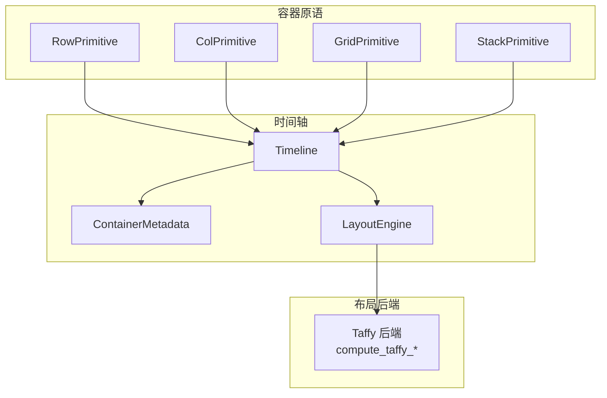
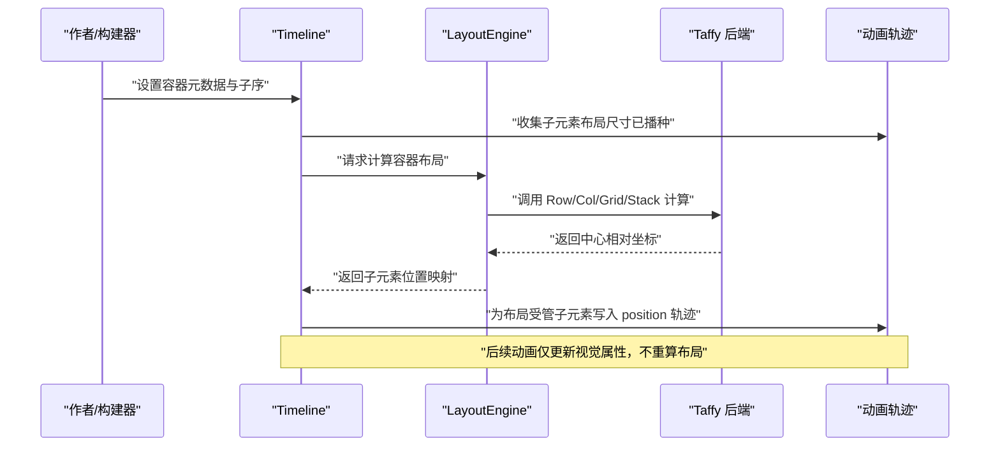
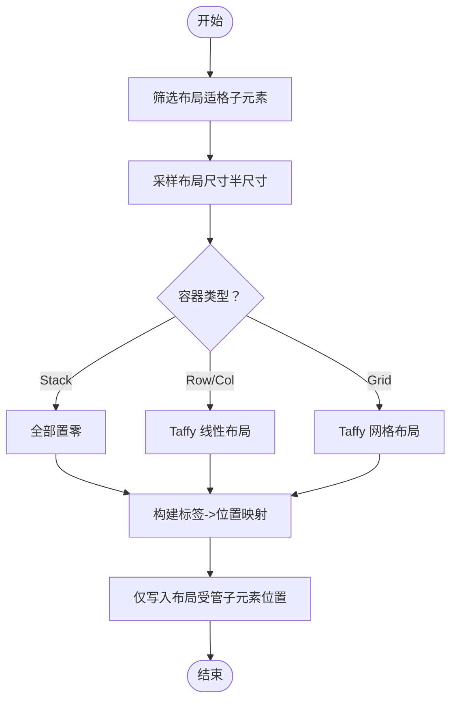
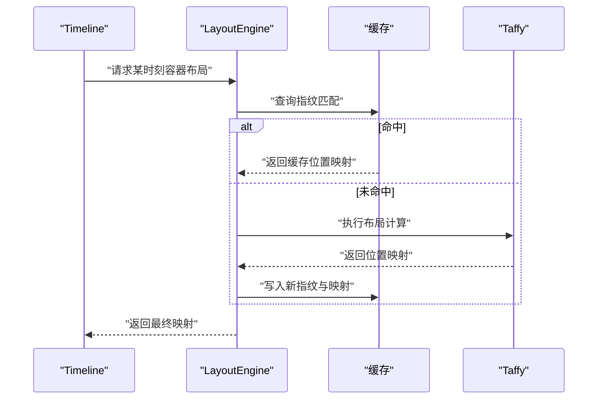
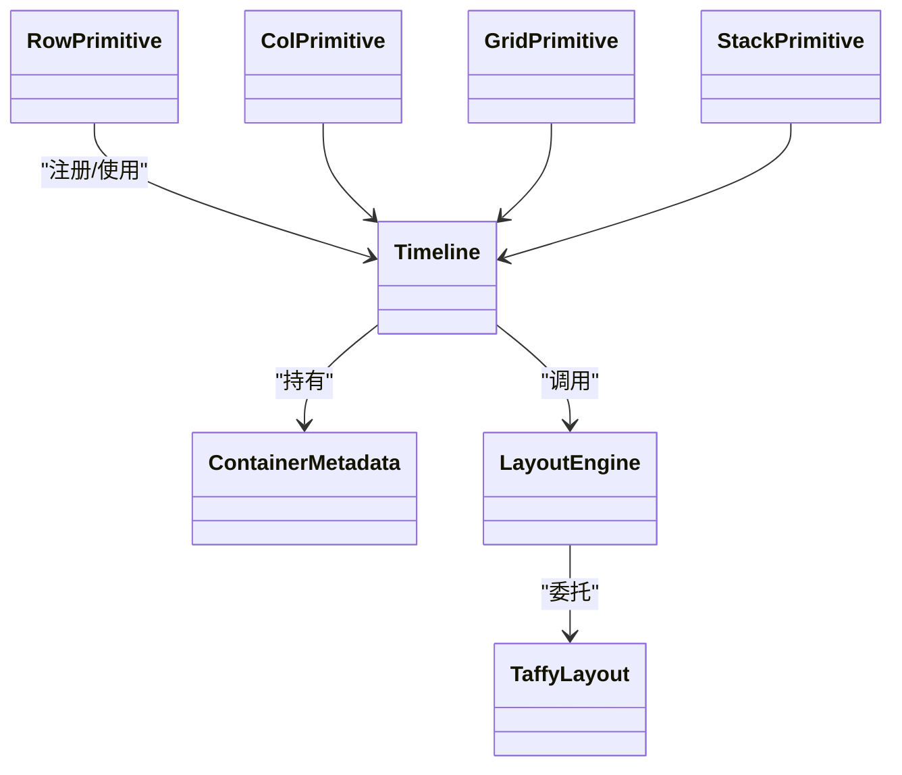

# 布局引擎

<cite>
**本文引用的文件**
- [crates/animatix/src/primitives/row.rs](file://crates/animatix/src/primitives/row.rs)
- [crates/animatix/src/primitives/col.rs](file://crates/animatix/src/primitives/col.rs)
- [crates/animatix/src/primitives/grid.rs](file://crates/animatix/src/primitives/grid.rs)
- [crates/animatix/src/primitives/stack.rs](file://crates/animatix/src/primitives/stack.rs)
- [crates/animatix/src/timeline/layout.rs](file://crates/animatix/src/timeline/layout.rs)
- [crates/animatix/src/timeline/taffy_layout.rs](file://crates/animatix/src/timeline/taffy_layout.rs)
- [crates/animatix/src/timeline/mod.rs](file://crates/animatix/src/timeline/mod.rs)
</cite>

## 目录
1. [简介](#简介)
2. [项目结构](#项目结构)
3. [核心组件](#核心组件)
4. [架构总览](#架构总览)
5. [详细组件分析](#详细组件分析)
6. [依赖关系分析](#依赖关系分析)
7. [性能考量](#性能考量)
8. [故障排查指南](#故障排查指南)
9. [结论](#结论)
10. [附录](#附录)

## 简介
本文件系统性阐述动画布局引擎的设计与实现，重点覆盖四类容器布局：Row（行）、Col（列）、Grid（网格）、Stack（堆叠）。文档从容器元数据到子元素位置计算的完整流程入手，解释声明期布局、Taffy 引擎集成、布局缓存与增量更新策略，并给出尺寸计算规则（内边距、间距、对齐）及实际使用示例，帮助读者在不牺牲可预测性的前提下，高效构建响应式与可维护的动画场景。

## 项目结构
布局系统位于时间轴模块中，采用“编译期声明布局 + 运行时定位赋值”的分层设计：
- 容器原语：Row、Col、Grid、Stack 作为容器型 Actor，负责声明布局类型与默认属性。
- 时间轴与布局：Timeline 负责收集容器元数据、筛选布局适格子元素、调用布局引擎并写入位置轨迹。
- 布局引擎：LayoutEngine 提供缓存与纯函数式布局计算；Taffy 后端提供 Row/Col/Stack 的线性布局与 Grid 的栅格布局。
- 属性与类型：ContainerMetadata 描述容器配置；PlacementMode 控制子元素是否参与布局赋位。

图表来源
- [crates/animatix/src/primitives/row.rs:14-49](file://crates/animatix/src/primitives/row.rs#L14-L49)
- [crates/animatix/src/primitives/col.rs:14-49](file://crates/animatix/src/primitives/col.rs#L14-L49)
- [crates/animatix/src/primitives/grid.rs:14-49](file://crates/animatix/src/primitives/grid.rs#L14-L49)
- [crates/animatix/src/primitives/stack.rs:14-49](file://crates/animatix/src/primitives/stack.rs#L14-L49)
- [crates/animatix/src/timeline/mod.rs:234-324](file://crates/animatix/src/timeline/mod.rs#L234-L324)
- [crates/animatix/src/timeline/layout.rs:82-200](file://crates/animatix/src/timeline/layout.rs#L82-L200)
- [crates/animatix/src/timeline/taffy_layout.rs:24-120](file://crates/animatix/src/timeline/taffy_layout.rs#L24-L120)

章节来源
- [crates/animatix/src/timeline/mod.rs:1-120](file://crates/animatix/src/timeline/mod.rs#L1-L120)

## 核心组件
- 容器原语（Row/Col/Grid/Stack）
  - 类型名、显示名、图标、分类、是否容器、种类 ID、默认属性（gap、padding、align、grid 列数等）。
- 容器元数据（ContainerMetadata）
  - 包含布局类型、间隙、内边距、对齐、列数、原始子序等。
- 布局引擎（LayoutEngine）
  - 缓存键：按容器子序字符串；指纹：每个子元素的半宽高与放置模式；命中则直接返回缓存位置映射。
- Taffy 后端
  - Row/Col 使用 Flexbox，Stack 特殊处理（全部置于原点），Grid 使用网格模板与行列划分。
- 时间轴（Timeline）
  - 构建阶段：筛选布局适格子元素（必须有已播种的布局尺寸），应用容器布局并将结果写入 position 轨迹。
  - 运行阶段：支持动态布局开关与子序动画插值。

章节来源
- [crates/animatix/src/primitives/row.rs:14-49](file://crates/animatix/src/primitives/row.rs#L14-L49)
- [crates/animatix/src/primitives/col.rs:14-49](file://crates/animatix/src/primitives/col.rs#L14-L49)
- [crates/animatix/src/primitives/grid.rs:14-49](file://crates/animatix/src/primitives/grid.rs#L14-L49)
- [crates/animatix/src/primitives/stack.rs:14-49](file://crates/animatix/src/primitives/stack.rs#L14-L49)
- [crates/animatix/src/timeline/mod.rs:234-324](file://crates/animatix/src/timeline/mod.rs#L234-L324)
- [crates/animatix/src/timeline/layout.rs:82-200](file://crates/animatix/src/timeline/layout.rs#L82-L200)
- [crates/animatix/src/timeline/taffy_layout.rs:24-120](file://crates/animatix/src/timeline/taffy_layout.rs#L24-L120)

## 架构总览
布局引擎遵循“声明期布局、非采样重算”的契约：容器在编译期根据子元素的布局尺寸进行一次确定性布局，后续动画仅改变视觉属性（如 position、scale、rotation），不触发重新布局。该设计确保了动画的可预测性与性能稳定性。

图表来源
- [crates/animatix/src/timeline/layout.rs:107-200](file://crates/animatix/src/timeline/layout.rs#L107-L200)
- [crates/animatix/src/timeline/taffy_layout.rs:53-120](file://crates/animatix/src/timeline/taffy_layout.rs#L53-L120)
- [crates/animatix/src/timeline/mod.rs:262-314](file://crates/animatix/src/timeline/mod.rs#L262-L314)

## 详细组件分析

### Row/Col/Stack/ Grid 容器特性与适用场景
- Row（行）
  - 水平主轴排列，适合横向卡片流、按钮行、进度条等。
  - 默认属性：gap、padding、align（跨轴对齐）。
- Col（列）
  - 垂直主轴排列，适合纵向列表、信息块堆叠、菜单等。
  - 默认属性：gap、padding、align。
- Grid（网格）
  - 固定列数栅格布局，适合图片画廊、仪表盘网格、规则排布的单元格。
  - 默认属性：gap、padding、align、cols。
- Stack（堆叠）
  - 所有子元素统一放置于容器原点，适合叠加遮罩、多图层合成、装饰叠加等。
  - 默认属性：gap、padding、align。

章节来源
- [crates/animatix/src/primitives/row.rs:42-48](file://crates/animatix/src/primitives/row.rs#L42-L48)
- [crates/animatix/src/primitives/col.rs:42-48](file://crates/animatix/src/primitives/col.rs#L42-L48)
- [crates/animatix/src/primitives/grid.rs:42-49](file://crates/animatix/src/primitives/grid.rs#L42-L49)
- [crates/animatix/src/primitives/stack.rs:42-48](file://crates/animatix/src/primitives/stack.rs#L42-L48)

### 布局计算流程（从容器元数据到子元素位置）
- 子元素筛选
  - 仅接受已播种布局尺寸且放置模式为“布局受管”的子元素；手动子元素虽参与容器尺寸计算，但不被分配位置。
- 尺寸采样
  - 在当前时间点从布局尺寸轨迹采样子元素半尺寸，形成 ChildExtent 列表。
- 布局计算
  - Stack：所有子元素位置为 [0, 0]。
  - Row/Col：委托 Taffy 线性布局，转换为容器中心相对坐标。
  - Grid：委托 Taffy 网格布局，按列数自动换行，生成行列模板。
- 结果写入
  - 仅将布局受管子元素的位置写入 position 轨迹，保证与手动子元素共存。

图表来源
- [crates/animatix/src/timeline/layout.rs:107-200](file://crates/animatix/src/timeline/layout.rs#L107-L200)
- [crates/animatix/src/timeline/taffy_layout.rs:53-215](file://crates/animatix/src/timeline/taffy_layout.rs#L53-L215)

章节来源
- [crates/animatix/src/timeline/layout.rs:107-200](file://crates/animatix/src/timeline/layout.rs#L107-L200)
- [crates/animatix/src/timeline/taffy_layout.rs:53-215](file://crates/animatix/src/timeline/taffy_layout.rs#L53-L215)

### 动态布局机制（缓存、增量更新与子序动画）
- 布局缓存
  - 键：容器子序字符串；指纹：每个子元素的半尺寸与放置模式索引；命中则直接返回缓存映射。
- 增量更新
  - 若指纹未变化，跳过 Taffy 计算，避免重复布局。
- 子序动画
  - 当存在子序轨迹时，在两关键帧之间插值，分别计算旧/新子序下的布局，再按缓动参数混合，实现平滑过渡。

图表来源
- [crates/animatix/src/timeline/layout.rs:134-200](file://crates/animatix/src/timeline/layout.rs#L134-L200)

章节来源
- [crates/animatix/src/timeline/layout.rs:134-200](file://crates/animatix/src/timeline/layout.rs#L134-L200)

### 尺寸计算规则（内边距、间距、对齐）
- 内边距（padding）
  - 统一应用于容器四边，影响布局区域边界，不参与子元素尺寸。
- 间距（gap）
  - Row/Col：沿主轴方向的等距空白；Grid：行列间统一空白。
- 对齐（align）
  - Row：交叉轴对齐（start/end/center）；Col：同理。
  - Stack：对齐语义保留但不改变所有子元素均在原点的事实。
- 尺寸采样
  - 子元素尺寸来自布局尺寸轨迹（已播种），Stack 不考虑子元素尺寸（全部原点）。

章节来源
- [crates/animatix/src/timeline/taffy_layout.rs:81-104](file://crates/animatix/src/timeline/taffy_layout.rs#L81-L104)
- [crates/animatix/src/timeline/taffy_layout.rs:159-176](file://crates/animatix/src/timeline/taffy_layout.rs#L159-L176)

### 实际示例（配置与使用要点）
- 配置容器属性
  - Row/Col：设置 gap、padding、align；Col 的 align 通常用于控制水平居中或靠边对齐。
  - Grid：设置 cols、gap、padding；列数决定换行与模板宽度。
  - Stack：适合叠放多个元素，无需额外对齐。
- 管理子元素顺序
  - 通过容器元数据中的原始子序控制布局顺序；若启用子序动画，可在时间轴上插入子序关键帧实现动态重组。
- 处理布局冲突
  - 手动子元素（PlacementMode::Manual）不参与布局赋位，但仍会参与容器尺寸计算，避免与布局元素产生尺寸冲突。
  - 若子元素未播种布局尺寸，将被排除在布局适格集合之外，避免无测量导致的布局错误。

章节来源
- [crates/animatix/src/timeline/mod.rs:262-314](file://crates/animatix/src/timeline/mod.rs#L262-L314)
- [crates/animatix/src/timeline/layout.rs:221-264](file://crates/animatix/src/timeline/layout.rs#L221-L264)

## 依赖关系分析
- 容器原语依赖 Timeline 的 SceneDimensions 提供默认属性上下文。
- Timeline 依赖 ContainerMetadata 与 LayoutEngine 协作完成布局。
- LayoutEngine 依赖 Taffy 后端实现具体布局算法。
- Taffy 后端将 Taffy 坐标系转换为中心相对坐标，保持引擎坐标语义一致。

图表来源
- [crates/animatix/src/primitives/row.rs:14-49](file://crates/animatix/src/primitives/row.rs#L14-L49)
- [crates/animatix/src/primitives/col.rs:14-49](file://crates/animatix/src/primitives/col.rs#L14-L49)
- [crates/animatix/src/primitives/grid.rs:14-49](file://crates/animatix/src/primitives/grid.rs#L14-L49)
- [crates/animatix/src/primitives/stack.rs:14-49](file://crates/animatix/src/primitives/stack.rs#L14-L49)
- [crates/animatix/src/timeline/mod.rs:234-324](file://crates/animatix/src/timeline/mod.rs#L234-L324)
- [crates/animatix/src/timeline/layout.rs:82-200](file://crates/animatix/src/timeline/layout.rs#L82-L200)
- [crates/animatix/src/timeline/taffy_layout.rs:24-120](file://crates/animatix/src/timeline/taffy_layout.rs#L24-L120)

章节来源
- [crates/animatix/src/timeline/mod.rs:234-324](file://crates/animatix/src/timeline/mod.rs#L234-L324)
- [crates/animatix/src/timeline/layout.rs:82-200](file://crates/animatix/src/timeline/layout.rs#L82-L200)
- [crates/animatix/src/timeline/taffy_layout.rs:24-120](file://crates/animatix/src/timeline/taffy_layout.rs#L24-L120)

## 性能考量
- 声明期布局与静态赋位
  - 避免每帧重算布局，显著降低 CPU 开销，适合复杂场景与长视频导出。
- 布局缓存
  - 以指纹快速判定是否复用上次结果，减少 Taffy 计算次数。
- 子序动画插值
  - 在关键帧间插值布局，避免频繁重建容器结构。
- 注意事项
  - 若大量子元素同时变更尺寸或对齐，仍可能触发缓存失效；建议分批调整或合并关键帧。

## 故障排查指南
- 子元素未参与布局
  - 可能原因：未播种布局尺寸或放置模式为 Manual。
  - 解决：为文本、图像、SVG 等提供测量或内在尺寸；或调整放置模式。
- 布局尺寸回退告警
  - 现象：构建诊断提示某子元素因无布局尺寸而被排除。
  - 处理：检查该子元素的布局尺寸轨迹是否正确播种。
- Stack 布局异常
  - 现象：期望子元素分散但全部重合。
  - 说明：Stack 设计即全部置于原点，应改用 Row/Col/Grid。
- 对齐与间距不符合预期
  - 检查 align/gap/padding 设置；确认 Row/Col 的主轴与交叉轴方向。

章节来源
- [crates/animatix/src/timeline/layout.rs:202-220](file://crates/animatix/src/timeline/layout.rs#L202-L220)
- [crates/animatix/src/timeline/layout.rs:221-264](file://crates/animatix/src/timeline/layout.rs#L221-L264)
- [crates/animatix/src/timeline/taffy_layout.rs:53-120](file://crates/animatix/src/timeline/taffy_layout.rs#L53-L120)

## 结论
该布局引擎通过“声明期布局 + 运行时定位赋位”的架构，结合 Taffy 引擎与本地缓存，实现了高性能、可预测的容器布局。Row/Col/Stack/Grid 各司其职，配合内边距、间距与对齐规则，能够覆盖大多数动画场景。动态布局能力（缓存、增量更新、子序动画）进一步提升了交互体验与编辑效率。

## 附录
- 关键流程路径参考
  - 容器原语默认属性：[row.rs:42-48](file://crates/animatix/src/primitives/row.rs#L42-L48)、[col.rs:42-48](file://crates/animatix/src/primitives/col.rs#L42-L48)、[grid.rs:42-49](file://crates/animatix/src/primitives/grid.rs#L42-L49)、[stack.rs:42-48](file://crates/animatix/src/primitives/stack.rs#L42-L48)
  - 布局计算入口与缓存：[layout.rs:107-200](file://crates/animatix/src/timeline/layout.rs#L107-L200)
  - Taffy 线性/网格布局：[taffy_layout.rs:53-215](file://crates/animatix/src/timeline/taffy_layout.rs#L53-L215)
  - 容器元数据与类型定义：[mod.rs:234-324](file://crates/animatix/src/timeline/mod.rs#L234-L324)