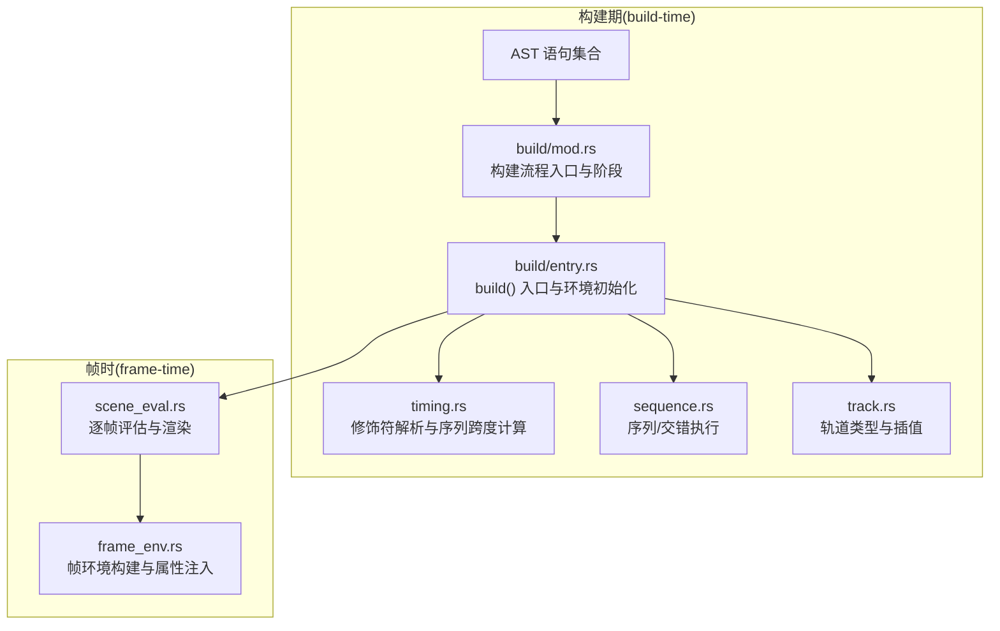
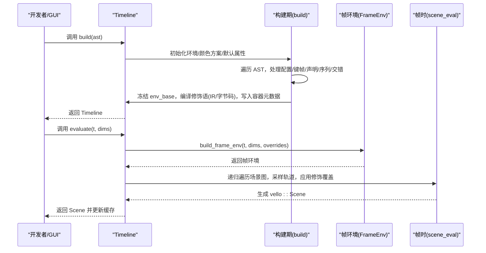
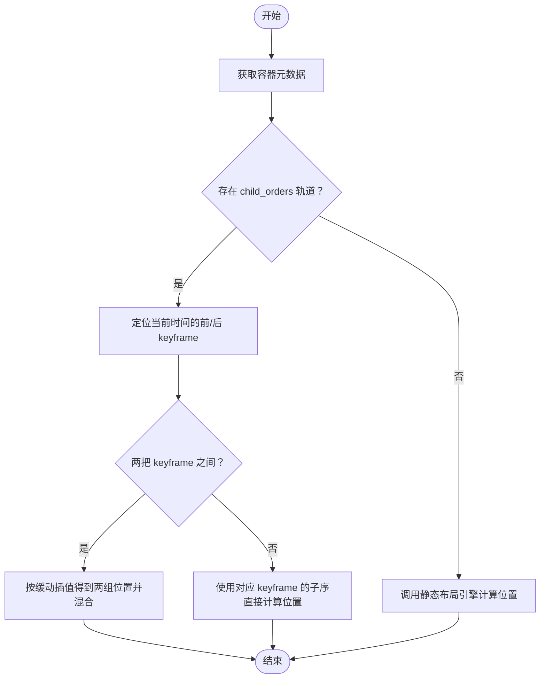
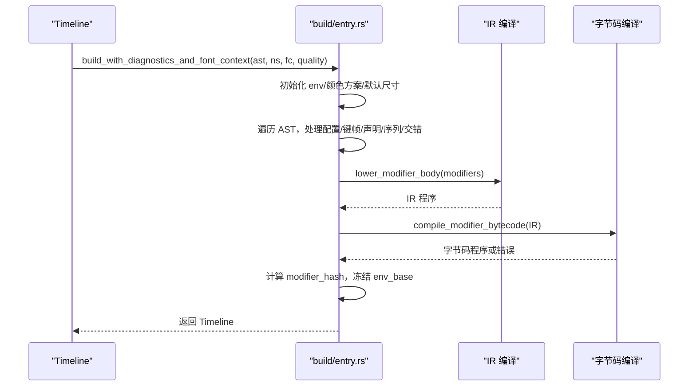
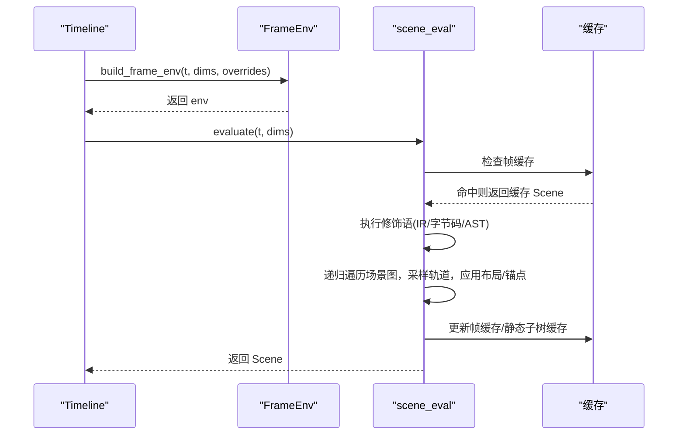
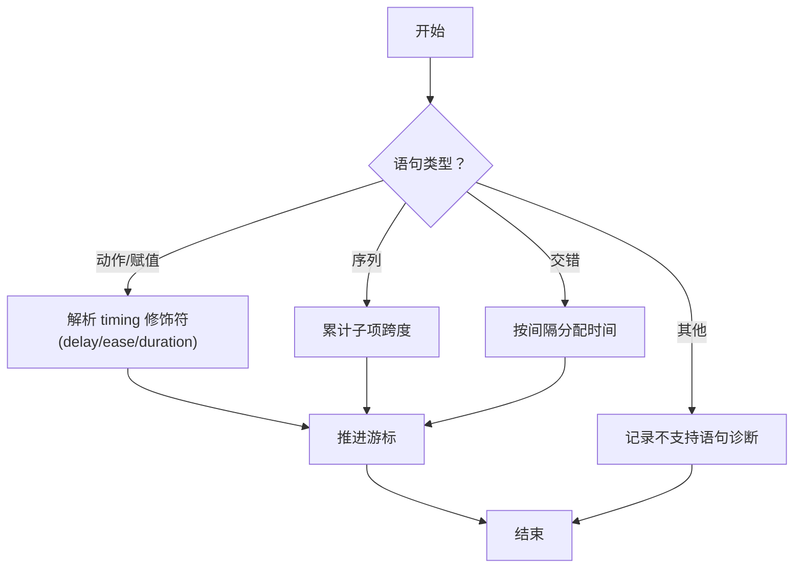
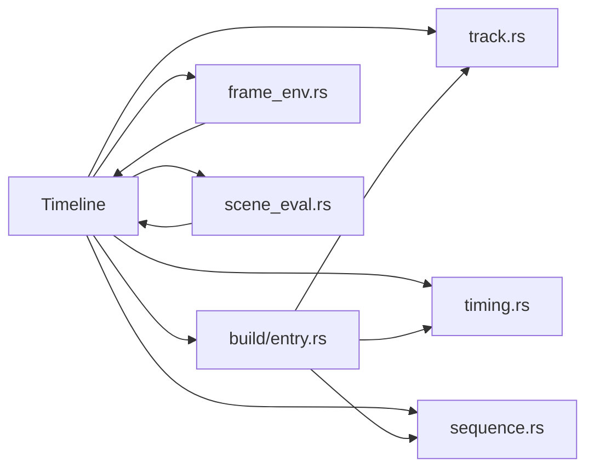

# 时间线架构

<cite>
**本文引用的文件**
- [timeline/mod.rs](file://crates/animatix/src/timeline/mod.rs)
- [timeline/track.rs](file://crates/animatix/src/timeline/track.rs)
- [timeline/build/mod.rs](file://crates/animatix/src/timeline/build/mod.rs)
- [timeline/build/entry.rs](file://crates/animatix/src/timeline/build/entry.rs)
- [timeline/scene_eval.rs](file://crates/animatix/src/timeline/scene_eval.rs)
- [timeline/frame_env.rs](file://crates/animatix/src/timeline/frame_env.rs)
- [timeline/timing.rs](file://crates/animatix/src/timeline/timing.rs)
- [timeline/sequence.rs](file://crates/animatix/src/timeline/sequence.rs)
</cite>

## 目录
1. [引言](#引言)
2. [项目结构](#项目结构)
3. [核心组件](#核心组件)
4. [架构总览](#架构总览)
5. [详细组件分析](#详细组件分析)
6. [依赖分析](#依赖分析)
7. [性能考量](#性能考量)
8. [故障排查指南](#故障排查指南)
9. [结论](#结论)
10. [附录](#附录)

## 引言
本文件系统性阐述 Animatix 的时间线（Timeline）架构，重点覆盖以下方面：
- 场景图（scene graph）的层次结构与父子继承关系
- 构建期（build-time）与帧时（frame-time）的边界划分
- 时间线生命周期管理：从 AST 解析到最终渲染场景
- 核心数据结构：AnimationTrack、PropertyTrack、VariableTrack 及其关系
- 时间推进机制与帧间缓存策略
- 实际代码示例路径，帮助读者快速定位实现细节

## 项目结构
时间线相关代码主要位于 crates/animatix/src/timeline 目录下，采用“按职责分层”的模块化组织方式：
- build 子模块：负责从 AST 到 Timeline 的编译与降级
- 运行时子模块：负责每帧评估与渲染场景组装
- track 模块：定义属性轨道与插值逻辑
- timing/sequence：解析修饰符与序列/交错执行
- frame_env：构建帧环境，驱动修饰语与属性查找



图表来源
- [timeline/build/mod.rs:1-55](file://crates/animatix/src/timeline/build/mod.rs#L1-L55)
- [timeline/build/entry.rs:1-257](file://crates/animatix/src/timeline/build/entry.rs#L1-L257)
- [timeline/scene_eval.rs:1-1136](file://crates/animatix/src/timeline/scene_eval.rs#L1-L1136)
- [timeline/frame_env.rs:1-207](file://crates/animatix/src/timeline/frame_env.rs#L1-L207)
- [timeline/timing.rs:1-588](file://crates/animatix/src/timeline/timing.rs#L1-L588)
- [timeline/sequence.rs:1-118](file://crates/animatix/src/timeline/sequence.rs#L1-L118)
- [timeline/track.rs:1-800](file://crates/animatix/src/timeline/track.rs#L1-L800)

章节来源
- [timeline/build/mod.rs:1-55](file://crates/animatix/src/timeline/build/mod.rs#L1-L55)
- [timeline/build/entry.rs:1-257](file://crates/animatix/src/timeline/build/entry.rs#L1-L257)

## 核心组件
- Timeline：编译后的动画包，包含场景图、属性轨道、修饰程序、缓存等
- AnimationTrack：每个演员（actor）的动画轨道，承载几何、样式、布局等属性轨道
- PropertyTrack：带缓存的键帧插值轨道，支持多种可插值类型
- VariableTrack：按时间片断的变量轨道，用于 keyframe 内部的 let 声明
- FrameEnv：每帧的运行时环境，注入 t、场景尺寸、背景色、演员属性与修饰覆盖

章节来源
- [timeline/mod.rs:431-502](file://crates/animatix/src/timeline/mod.rs#L431-L502)
- [timeline/track.rs:438-537](file://crates/animatix/src/timeline/track.rs#L438-L537)
- [timeline/mod.rs:377-400](file://crates/animatix/src/timeline/mod.rs#L377-L400)
- [timeline/frame_env.rs:104-121](file://crates/animatix/src/timeline/frame_env.rs#L104-L121)

## 架构总览
时间线架构以“构建期一次性降级 + 帧时增量评估”为核心：
- 构建期：解析 AST，展开组件与导入，收集修饰语，构建轨道，完成修饰语 IR/字节码编译，冻结基础环境，建立容器元数据与布局缓存
- 帧时：根据当前时间与场景尺寸构建帧环境，执行修饰语（IR/字节码/AST 回退），采样轨道，应用布局与锚点，生成 Vello 场景，使用多级缓存避免重复计算



图表来源
- [timeline/build/entry.rs:80-257](file://crates/animatix/src/timeline/build/entry.rs#L80-L257)
- [timeline/frame_env.rs:64-121](file://crates/animatix/src/timeline/frame_env.rs#L64-L121)
- [timeline/scene_eval.rs:700-901](file://crates/animatix/src/timeline/scene_eval.rs#L700-L901)

## 详细组件分析

### 组件一：场景图与容器布局
- 场景图以演员标签为节点，通过 AnimationTrack.children 维护父子关系
- 容器元数据（ContainerMetadata）记录布局类型、间距、对齐、列数与子序
- 动态布局：按时间计算子项位置；静态布局：按容器元数据直接计算
- 布局缓存：按容器子序字符串键缓存，避免重复布局计算



图表来源
- [timeline/mod.rs:777-849](file://crates/animatix/src/timeline/mod.rs#L777-L849)

章节来源
- [timeline/mod.rs:275-314](file://crates/animatix/src/timeline/mod.rs#L275-L314)
- [timeline/mod.rs:777-849](file://crates/animatix/src/timeline/mod.rs#L777-L849)

### 组件二：构建期（Build-time）
- 入口函数：build/build_with_diagnostics/build_with_font_context
- 关键步骤：
  - 加载标准库与颜色方案，设置默认场景尺寸
  - 处理配置、键帧与相对键帧，按时间推进
  - 收集修饰语（always），编译为 IR，再尝试编译为字节码
  - 计算修饰语哈希，用于跨重建的 IR/字节码复用
  - 冻结基础环境（env_base），避免每帧复制大量条目
  - 注入容器元数据与初始布局



图表来源
- [timeline/build/entry.rs:80-257](file://crates/animatix/src/timeline/build/entry.rs#L80-L257)

章节来源
- [timeline/build/entry.rs:44-257](file://crates/animatix/src/timeline/build/entry.rs#L44-L257)

### 组件三：帧时评估（Frame-time）
- 帧环境构建：注入 t、场景尺寸、背景色、场景锚点、演员属性与修饰覆盖
- 修饰语执行：优先字节码，其次 IR，最后 AST 回退；错误收集为运行时诊断
- 场景遍历：DFS 遍历根节点，按需采样轨道，应用布局与锚点，生成 Vello 场景
- 多级缓存：
  - 帧缓存：相同时间/尺寸/无调试/无滤镜后端时直接返回缓存
  - 静态子树缓存：完全静态子树仅计算一次并复用
  - 变换缓存：同一父变换系数下的节点变换复用
  - 布局缓存：容器子序变化时才重新计算



图表来源
- [timeline/frame_env.rs:64-121](file://crates/animatix/src/timeline/frame_env.rs#L64-L121)
- [timeline/scene_eval.rs:700-901](file://crates/animatix/src/timeline/scene_eval.rs#L700-L901)

章节来源
- [timeline/frame_env.rs:104-207](file://crates/animatix/src/timeline/frame_env.rs#L104-L207)
- [timeline/scene_eval.rs:700-901](file://crates/animatix/src/timeline/scene_eval.rs#L700-L901)

### 组件四：轨道与插值（PropertyTrack/VariableTrack）
- PropertyTrack：键帧映射（毫秒时间戳 -> (值, 缓动)），支持默认值与最近值回退
- 插值缓存：针对同一查询时间的最近结果进行缓存，减少重复计算
- VariableTrack：按时间片断的变量值，用于 keyframe 内部的 let 声明，按“向前取最近”策略求值

```mermaid
classDiagram
class PropertyTrack~T~ {
+keyframes : BTreeMap<u64, (T, Easing)>
+default_value : T
+last_evaluated : RefCell<Option<(u64, T)>>
+add_keyframe(time_ms, value, easing)
+evaluate(time_ms) T
+evaluate_copy(time_ms) T
+is_currently_animating(time_ms) bool
+is_effectively_static() bool
}
class VariableTrack {
+keyframes : BTreeMap<u64, Value>
+new() VariableTrack
+evaluate(time_ms) Option<Value>
}
class Timeline {
+tracks : BTreeMap<String, AnimationTrack>
+variable_tracks : BTreeMap<String, VariableTrack>
+evaluate(time_s, dims) Scene
}
Timeline --> PropertyTrack : "持有"
Timeline --> VariableTrack : "持有"
```

图表来源
- [timeline/track.rs:438-537](file://crates/animatix/src/timeline/track.rs#L438-L537)
- [timeline/mod.rs:377-400](file://crates/animatix/src/timeline/mod.rs#L377-L400)
- [timeline/mod.rs:554-625](file://crates/animatix/src/timeline/mod.rs#L554-L625)

章节来源
- [timeline/track.rs:438-537](file://crates/animatix/src/timeline/track.rs#L438-L537)
- [timeline/mod.rs:377-425](file://crates/animatix/src/timeline/mod.rs#L377-L425)

### 组件五：修饰符与序列/交错
- 修饰符解析：支持 delay/ease/duration 等，morph 相关修饰仅在路径变形声明中有效
- 序列与交错：计算语句跨度，按时间游标顺序/交错间隔推进，不支持在序列内声明演员
- 错误诊断：对不支持的语句类型给出明确提示



图表来源
- [timeline/timing.rs:28-588](file://crates/animatix/src/timeline/timing.rs#L28-L588)
- [timeline/sequence.rs:8-118](file://crates/animatix/src/timeline/sequence.rs#L8-L118)

章节来源
- [timeline/timing.rs:283-588](file://crates/animatix/src/timeline/timing.rs#L283-L588)
- [timeline/sequence.rs:8-118](file://crates/animatix/src/timeline/sequence.rs#L8-L118)

## 依赖分析
- Timeline 对各模块的依赖关系：
  - 构建期：依赖 build/*、timing、sequence、track
  - 帧时：依赖 frame_env、scene_eval、track、timing（序列跨度）、layout（容器布局）
- 关键耦合点：
  - env_base 冻结基础环境，避免每帧复制大量条目
  - modifier_hash 用于 IR/字节码复用
  - transform_cache/static_subtree_cache/frame_cache 三重缓存降低重复计算



图表来源
- [timeline/mod.rs:1-1093](file://crates/animatix/src/timeline/mod.rs#L1-L1093)
- [timeline/build/entry.rs:1-257](file://crates/animatix/src/timeline/build/entry.rs#L1-L257)
- [timeline/scene_eval.rs:1-1136](file://crates/animatix/src/timeline/scene_eval.rs#L1-L1136)
- [timeline/frame_env.rs:1-207](file://crates/animatix/src/timeline/frame_env.rs#L1-L207)
- [timeline/timing.rs:1-588](file://crates/animatix/src/timeline/timing.rs#L1-L588)
- [timeline/sequence.rs:1-118](file://crates/animatix/src/timeline/sequence.rs#L1-L118)
- [timeline/track.rs:1-800](file://crates/animatix/src/timeline/track.rs#L1-L800)

章节来源
- [timeline/mod.rs:1-1093](file://crates/animatix/src/timeline/mod.rs#L1-L1093)

## 性能考量
- 插值缓存：PropertyTrack 对最近查询时间进行缓存，避免重复插值
- 帧缓存：相同时间/尺寸/无调试/无滤镜后端时直接返回缓存场景
- 静态子树缓存：完全静态子树仅计算一次并复用，显著降低复杂场景开销
- 变换缓存：同一父变换系数下的节点变换复用，提升动态布局场景性能
- 布局缓存：容器子序变化时才重新计算，避免重复 Taffy 计算
- 基础环境冻结：env_base 减少每帧环境复制成本
- 修饰语优化：优先字节码执行，失败回退 IR/AST

## 故障排查指南
- 修饰语冲突：同一修饰键多次出现会发出警告，以最后一次为准
- 不支持的序列/交错语句：在序列/交错块中使用不支持的语句类型会记录错误诊断
- always 覆盖 keyframe：当 always 写入某演员的某属性且该属性有 keyframe，会发出警告
- 修改器运行时错误：修饰语执行错误会被收集为运行时诊断，便于定位问题

章节来源
- [timeline/build/entry.rs:198-244](file://crates/animatix/src/timeline/build/entry.rs#L198-L244)
- [timeline/timing.rs:147-179](file://crates/animatix/src/timeline/timing.rs#L147-L179)
- [timeline/sequence.rs:68-84](file://crates/animatix/src/timeline/sequence.rs#L68-L84)
- [timeline/scene_eval.rs:796-806](file://crates/animatix/src/timeline/scene_eval.rs#L796-L806)

## 结论
Animatix 的时间线架构通过“构建期一次性降级 + 帧时增量评估”的设计，在保证表达力的同时兼顾了性能与可维护性。场景图驱动的父子继承、容器布局与锚点系统、修饰语 IR/字节码优化、以及多级缓存策略共同构成了高效稳定的渲染管线。

## 附录
- 如何创建与操作时间线对象（示例路径）
  - 创建空时间线：[Timeline::new:554-598](file://crates/animatix/src/timeline/mod.rs#L554-L598)
  - 从 AST 构建时间线：[Timeline::build_with_diagnostics_and_font_context:80-257](file://crates/animatix/src/timeline/build/entry.rs#L80-L257)
  - 逐帧评估并生成场景：[Timeline::evaluate:700-704](file://crates/animatix/src/timeline/scene_eval.rs#L700-L704)
  - 构建帧环境（含修饰覆盖）：[Timeline::build_frame_env:104-121](file://crates/animatix/src/timeline/frame_env.rs#L104-L121)
  - 采样属性轨道（含插值缓存）：[PropertyTrack::evaluate:460-514](file://crates/animatix/src/timeline/track.rs#L460-L514)
  - 变量轨道（向前取最近）：[VariableTrack::evaluate:394-399](file://crates/animatix/src/timeline/mod.rs#L394-L399)
  - 序列/交错跨度计算：[Timeline::sequence_statement_span_ms:8-56](file://crates/animatix/src/timeline/sequence.rs#L8-L56)
  - 修饰符解析（delay/ease/duration/morph）：[parse_timing_modifiers:283-588](file://crates/animatix/src/timeline/timing.rs#L283-L588)