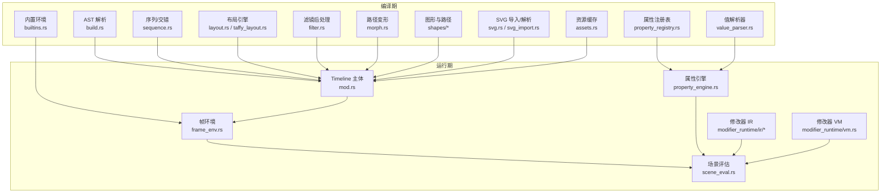
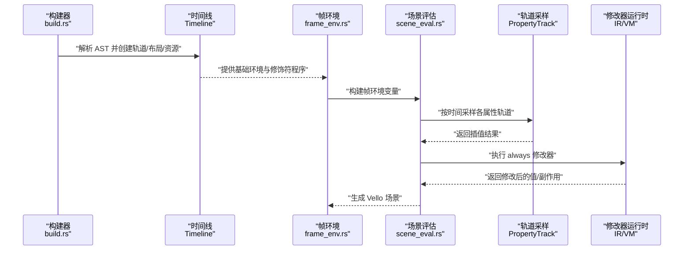
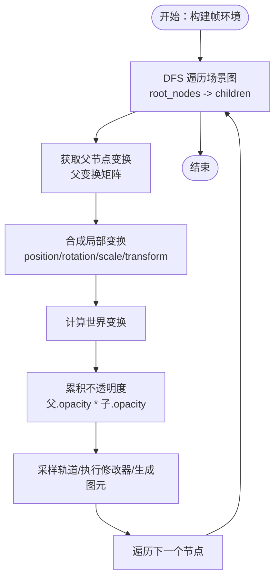
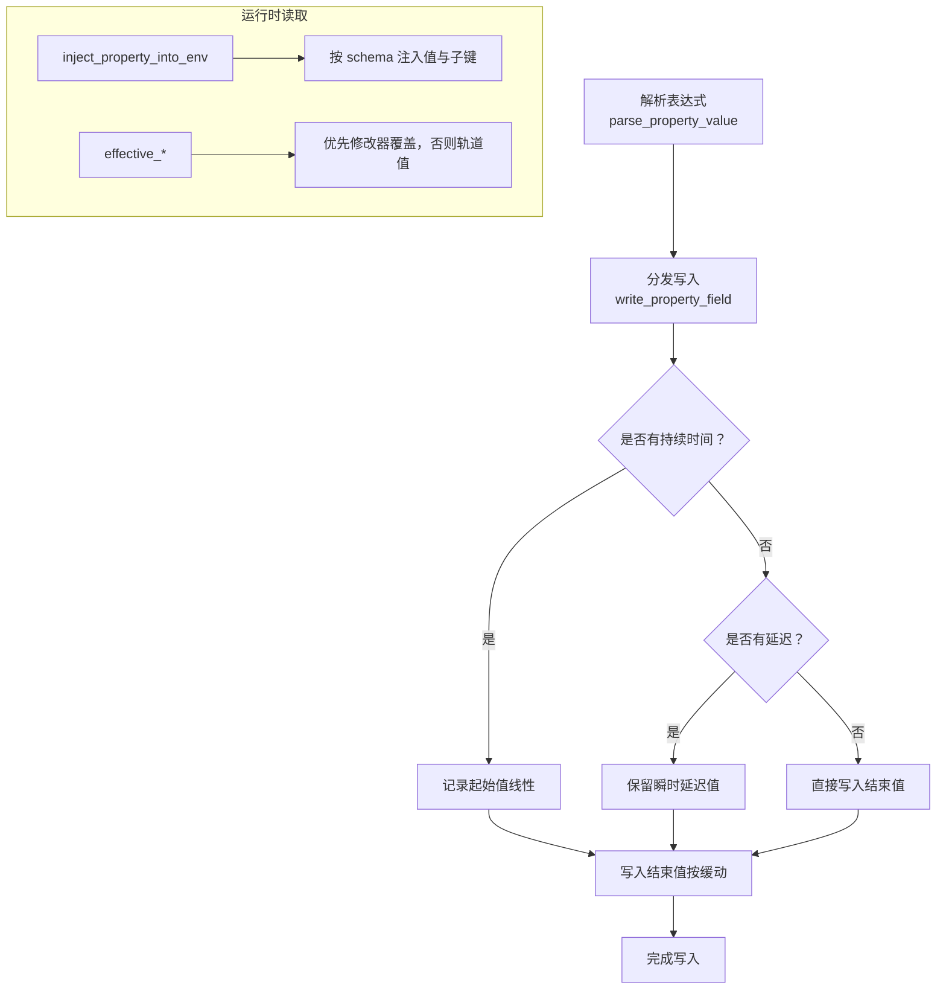
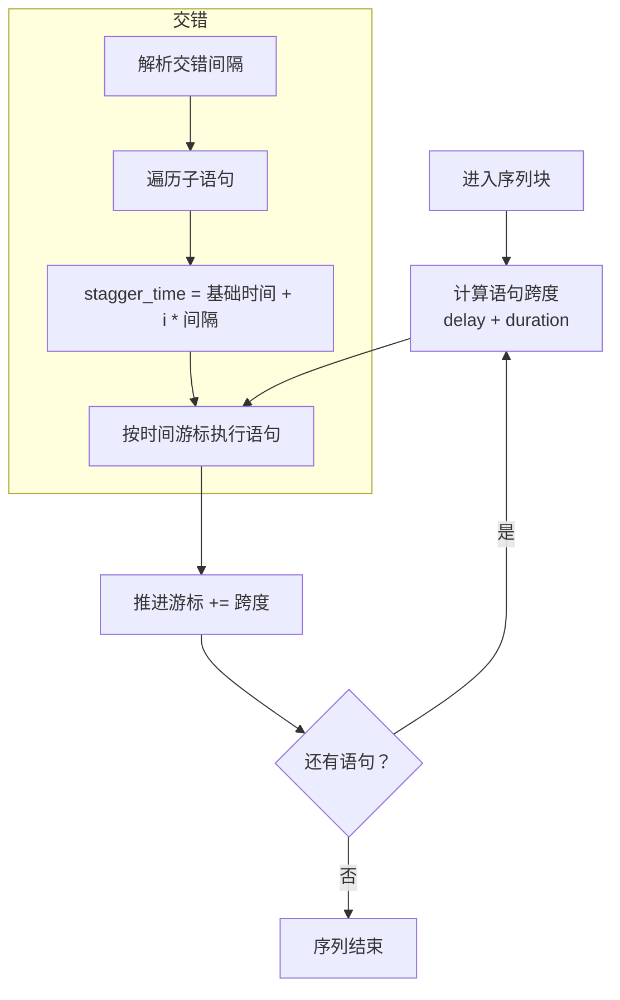
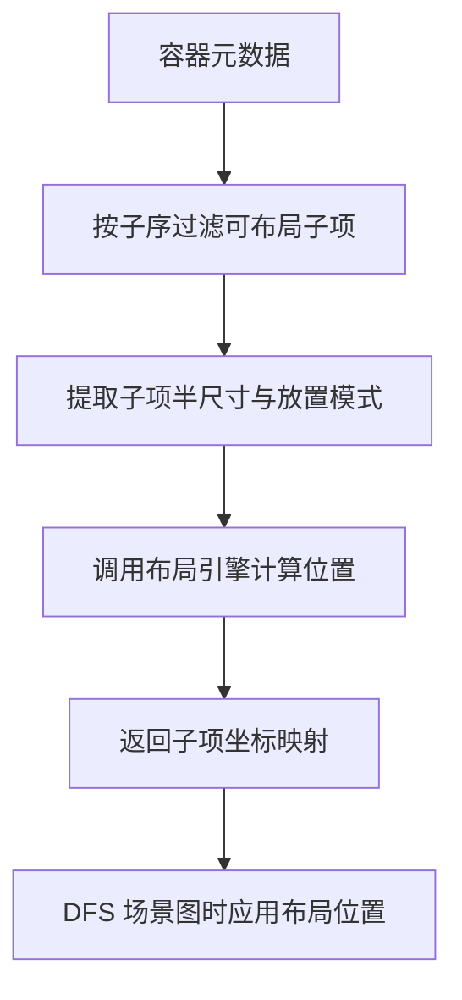
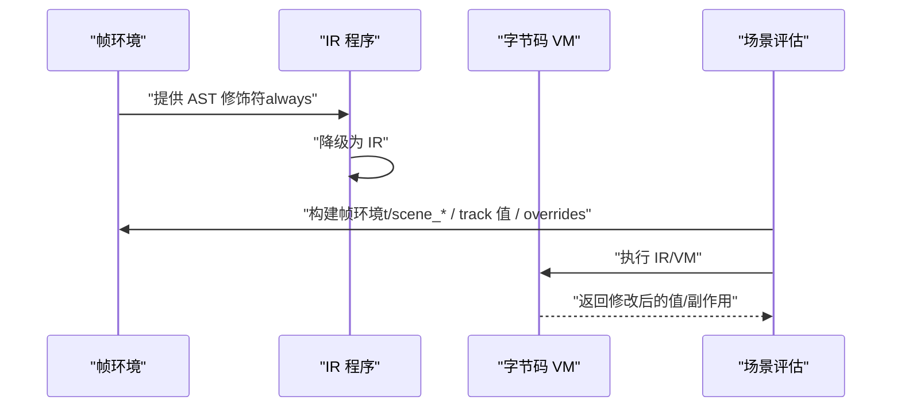
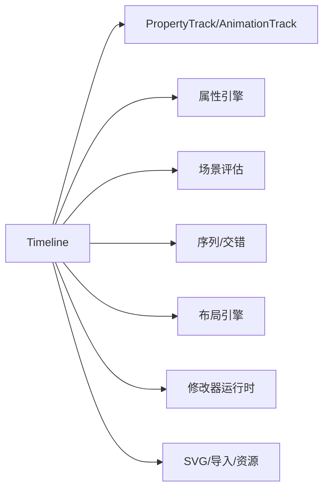

# 时间线系统

<cite>
**本文引用的文件**
- [timeline/mod.rs](file://crates/animatix/src/timeline/mod.rs)
- [timeline/sequence.rs](file://crates/animatix/src/timeline/sequence.rs)
- [timeline/track.rs](file://crates/animatix/src/timeline/track.rs)
- [timeline/property_engine.rs](file://crates/animatix/src/timeline/property_engine.rs)
- [timeline/scene_eval.rs](file://crates/animatix/src/timeline/scene_eval.rs)
- [timeline/build.rs](file://crates/animatix/src/timeline/build.rs)
- [timeline/layout.rs](file://crates/animatix/src/timeline/layout.rs)
- [timeline/filter.rs](file://crates/animatix/src/timeline/filter.rs)
- [timeline/morph.rs](file://crates/animatix/src/timeline/morph.rs)
- [timeline/plot.rs](file://crates/animatix/src/timeline/plot.rs)
- [timeline/utils.rs](file://crates/animatix/src/timeline/utils.rs)
- [timeline/env.rs](file://crates/animatix/src/timeline/env.rs)
- [timeline/value_parser.rs](file://crates/animatix/src/timeline/value_parser.rs)
- [timeline/property_registry.rs](file://crates/animatix/src/timeline/property_registry.rs)
- [timeline/frame_env.rs](file://crates/animatix/src/timeline/frame_env.rs)
- [timeline/index.rs](file://crates/animatix/src/timeline/index.rs)
- [timeline/assets.rs](file://crates/animatix/src/timeline/assets.rs)
- [timeline/primitive.rs](file://crates/animatix/src/timeline/primitive.rs)
- [timeline/position.rs](file://crates/animatix/src/timeline/position.rs)
- [timeline/svg.rs](file://crates/animatix/src/timeline/svg.rs)
- [timeline/svg_import.rs](file://crates/animatix/src/timeline/svg_import.rs)
- [timeline/timing.rs](file://crates/animatix/src/timeline/timing.rs)
- [timeline/kurbo_shapes.rs](file://crates/animatix/src/timeline/kurbo_shapes.rs)
- [timeline/taffy_layout.rs](file://crates/animatix/src/timeline/taffy_layout.rs)
- [timeline/vello_path.rs](file://crates/animatix/src/timeline/vello_path.rs)
- [timeline/actions/mod.rs](file://crates/animatix/src/timeline/actions/mod.rs)
- [timeline/actions/effects.rs](file://crates/animatix/src/timeline/actions/effects.rs)
- [timeline/actions/entrance.rs](file://crates/animatix/src/timeline/actions/entrance.rs)
- [timeline/actions/exit.rs](file://crates/animatix/src/timeline/actions/exit.rs)
- [timeline/actions/motion.rs](file://crates/animatix/src/timeline/actions/motion.rs)
- [timeline/actions/reorder.rs](file://crates/animatix/src/timeline/actions/reorder.rs)
- [timeline/actions/reveal.rs](file://crates/animatix/src/timeline/actions/reveal.rs)
- [timeline/actions/registry.rs](file://crates/animatix/src/timeline/actions/registry.rs)
- [timeline/modifier_runtime/mod.rs](file://crates/animatix/src/timeline/modifier_runtime/mod.rs)
- [timeline/modifier_runtime/ir/mod.rs](file://crates/animatix/src/timeline/modifier_runtime/ir/mod.rs)
- [timeline/modifier_runtime/ir/display.rs](file://crates/animatix/src/timeline/modifier_runtime/ir/display.rs)
- [timeline/modifier_runtime/ir/eval.rs](file://crates/animatix/src/timeline/modifier_runtime/ir/eval.rs)
- [timeline/modifier_runtime/ir/lower.rs](file://crates/animatix/src/timeline/modifier_runtime/ir/lower.rs)
- [timeline/modifier_runtime/ir/types.rs](file://crates/animatix/src/timeline/modifier_runtime/ir/types.rs)
- [timeline/modifier_runtime/vm.rs](file://crates/animatix/src/timeline/modifier_runtime/vm.rs)
- [timeline/modifier_exec.rs](file://crates/animatix/src/timeline/modifier_exec.rs)
- [timeline/shapes/mod.rs](file://crates/animatix/src/timeline/shapes/mod.rs)
- [timeline/shapes/primitives.rs](file://crates/animatix/src/timeline/shapes/primitives.rs)
- [timeline/path_progress.rs](file://crates/animatix/src/timeline/path_progress.rs)
- [timeline/image.rs](file://crates/animatix/src/timeline/image.rs)
- [timeline/colorscheme.rs](file://crates/animatix/src/timeline/colorscheme.rs)
- [timeline/declarations_text.rs](file://crates/animatix/src/timeline/declarations_text.rs)
- [timeline/assignments.rs](file://crates/animatix/src/timeline/assignments.rs)
- [timeline/builtins.rs](file://crates/animatix/src/timeline/builtins.rs)
- [timeline/timing.rs](file://crates/animatix/src/timeline/timing.rs)
- [timeline/property_lookup.rs](file://crates/animatix/src/timeline/property_lookup.rs)
- [timeline/utils.rs](file://crates/animatix/src/timeline/utils.rs)
- [timeline/scene_eval.rs](file://crates/animatix/src/timeline/scene_eval.rs)
</cite>

## 目录
1. [引言](#引言)
2. [项目结构](#项目结构)
3. [核心组件](#核心组件)
4. [架构总览](#架构总览)
5. [详细组件分析](#详细组件分析)
6. [依赖关系分析](#依赖关系分析)
7. [性能考量](#性能考量)
8. [故障排查指南](#故障排查指南)
9. [结论](#结论)
10. [附录](#附录)

## 引言
本文件系统性阐述 Animatix 的时间线系统：从编译期到运行期的完整流程，涵盖时间轴管理、关键帧系统、属性追踪与环境注入、时间推进机制、层次化场景图（scene_graph）以及变换与不透明度的深度优先级联传播。同时给出时间线构建过程（AST 到时间线）、属性评估与运行时求值、典型操作（序列组合、交错、多场景时间映射）以及性能优化与内存管理策略。

## 项目结构
Animatix 的时间线系统位于 crates/animatix/src/timeline 下，采用模块化组织，围绕 Timeline 结构体展开：
- 编译期：build.rs 将 AST 降低为 Timeline，解析导入、展开组件、创建轨道、布局、文本/数学/代码路径编译、资源加载
- 运行期：scene_eval.rs/frame_env.rs 负责每帧采样轨道、执行 always 块、解析锚点/百分比位置、组装渲染场景
- 关键帧与插值：track.rs 提供 PropertyTrack/AnimationTrack 及插值接口
- 属性引擎：property_engine.rs 统一解析/写入/读取属性，避免 N×M 分派爆炸
- 序列与交错：sequence.rs 处理序列块、交错块的时间跨度计算与调度
- 布局与容器：layout.rs/taffy_layout.rs 容器布局与缓存；ContainerMetadata/ContainerLayoutChild 描述容器布局配置
- 图形与路径：shapes/mod.rs、morph.rs、kurbo_shapes.rs、vello_path.rs 等负责矢量形状与路径插值
- 过滤与后处理：filter.rs 提供 CPU 图像处理能力
- 修改器运行时：modifier_runtime/ir 与 vm 提供 IR 与字节码执行 always 块
- 其他支撑：env.rs、value_parser.rs、property_registry.rs、timing.rs、position.rs、svg/svg_import.rs、assets.rs 等



**图表来源**
- [timeline/mod.rs:1-1093](file://crates/animatix/src/timeline/mod.rs#L1-L1093)
- [timeline/build.rs](file://crates/animatix/src/timeline/build.rs)
- [timeline/scene_eval.rs](file://crates/animatix/src/timeline/scene_eval.rs)
- [timeline/frame_env.rs](file://crates/animatix/src/timeline/frame_env.rs)
- [timeline/sequence.rs:1-118](file://crates/animatix/src/timeline/sequence.rs#L1-L118)
- [timeline/layout.rs](file://crates/animatix/src/timeline/layout.rs)
- [timeline/taffy_layout.rs](file://crates/animatix/src/timeline/taffy_layout.rs)
- [timeline/filter.rs](file://crates/animatix/src/timeline/filter.rs)
- [timeline/morph.rs](file://crates/animatix/src/timeline/morph.rs)
- [timeline/shapes/mod.rs](file://crates/animatix/src/timeline/shapes/mod.rs)
- [timeline/svg.rs](file://crates/animatix/src/timeline/svg.rs)
- [timeline/svg_import.rs](file://crates/animatix/src/timeline/svg_import.rs)
- [timeline/assets.rs](file://crates/animatix/src/timeline/assets.rs)
- [timeline/property_engine.rs:1-776](file://crates/animatix/src/timeline/property_engine.rs#L1-L776)
- [timeline/modifier_runtime/ir/mod.rs](file://crates/animatix/src/timeline/modifier_runtime/ir/mod.rs)
- [timeline/modifier_runtime/vm.rs](file://crates/animatix/src/timeline/modifier_runtime/vm.rs)

**章节来源**
- [timeline/mod.rs:1-1093](file://crates/animatix/src/timeline/mod.rs#L1-L1093)
- [timeline/sequence.rs:1-118](file://crates/animatix/src/timeline/sequence.rs#L1-L118)
- [timeline/track.rs:1-1559](file://crates/animatix/src/timeline/track.rs#L1-L1559)
- [timeline/property_engine.rs:1-776](file://crates/animatix/src/timeline/property_engine.rs#L1-L776)

## 核心组件
- Timeline：编译后的动画包，包含场景图（父子层级）、每个演员的关键帧轨道、颜色方案、容器元数据、布局引擎、文本编译器、缓存（帧缓存、变换缓存、静态子树缓存、场景缓冲）、音频片段、动作事件、修改器程序等。
- AnimationTrack：单个演员的所有可动画属性轨道集合，支持几何、样式、滤镜、形状、文本/媒体、布局、程序化绘图等。
- PropertyTrack<T>：带缓存的属性关键帧轨道，支持线性/非线性插值与默认值回退。
- 属性引擎（property_engine.rs）：统一的属性解析、写入、读取与环境注入，基于属性注册表与字段读取源。
- 序列与交错（sequence.rs）：计算语句时间跨度、顺序执行与交错延迟执行。
- 场景评估（scene_eval.rs/frame_env.rs）：构建每帧环境变量（时间 t、场景尺寸、track 值、覆盖值），采样轨道，执行修改器，解析锚点/百分比位置，生成 Vello 场景。
- 布局（layout.rs/taffy_layout.rs）：容器布局与缓存，按容器子序与布局大小计算子项位置。
- 修改器运行时（modifier_runtime/ir/vm）：将 always 语句编译为 IR 或字节码，按需执行以驱动动态行为。

**章节来源**
- [timeline/mod.rs:431-502](file://crates/animatix/src/timeline/mod.rs#L431-L502)
- [timeline/track.rs:448-537](file://crates/animatix/src/timeline/track.rs#L448-L537)
- [timeline/property_engine.rs:113-262](file://crates/animatix/src/timeline/property_engine.rs#L113-L262)
- [timeline/sequence.rs:7-90](file://crates/animatix/src/timeline/sequence.rs#L7-L90)
- [timeline/scene_eval.rs](file://crates/animatix/src/timeline/scene_eval.rs)
- [timeline/frame_env.rs](file://crates/animatix/src/timeline/frame_env.rs)
- [timeline/layout.rs](file://crates/animatix/src/timeline/layout.rs)
- [timeline/taffy_layout.rs](file://crates/animatix/src/timeline/taffy_layout.rs)
- [timeline/modifier_runtime/mod.rs](file://crates/animatix/src/timeline/modifier_runtime/mod.rs)
- [timeline/modifier_runtime/ir/mod.rs](file://crates/animatix/src/timeline/modifier_runtime/ir/mod.rs)
- [timeline/modifier_runtime/vm.rs](file://crates/animatix/src/timeline/modifier_runtime/vm.rs)

## 架构总览
时间线系统遵循“编译期一次性降低，运行期逐帧采样”的边界划分：
- 编译期（build.rs）：解析 AST、解析导入、展开组件、创建轨道、应用布局、编译文本/数学/代码路径、加载资源，产出 Timeline。
- 运行期（scene_eval.rs/frame_env.rs）：构建帧环境（t、scene_width、track 值、overrides），采样轨道，执行 always 修改器，解析锚点/百分比位置，生成 Vello 场景。



**图表来源**
- [timeline/mod.rs:7-14](file://crates/animatix/src/timeline/mod.rs#L7-L14)
- [timeline/build.rs](file://crates/animatix/src/timeline/build.rs)
- [timeline/frame_env.rs](file://crates/animatix/src/timeline/frame_env.rs)
- [timeline/scene_eval.rs](file://crates/animatix/src/timeline/scene_eval.rs)
- [timeline/track.rs:448-537](file://crates/animatix/src/timeline/track.rs#L448-L537)
- [timeline/modifier_runtime/ir/mod.rs](file://crates/animatix/src/timeline/modifier_runtime/ir/mod.rs)
- [timeline/modifier_runtime/vm.rs](file://crates/animatix/src/timeline/modifier_runtime/vm.rs)

## 详细组件分析

### 时间轴与场景图（scene_graph）
- Timeline 持有：
  - tracks：按标签索引的 AnimationTrack 映射
  - root_nodes：根节点列表
  - env/env_base：表达式环境与标准库基底
  - modifier_programs/bytecode_programs：编译后的修改器程序
  - colorscheme/external_colorschemes/auto_color_assignments：颜色方案与自动分配
  - container_metadata/layout_engine：容器布局元数据与缓存
  - dynamic_layout：是否启用动态布局
  - asset_cache/font_context：资源与字体上下文
  - build_quality：构建质量（草稿/预览/生产）影响采样精度
  - default_opacity：默认不透明度
  - child_orders：容器子序轨道
  - text_compiler：运行时文本编译器
  - frame_cache/transform_cache/static_subtree_cache/scene_buffer：缓存与重用缓冲
  - variable_tracks：关键帧作用域变量轨道
  - audio_segments：导出时混音的音频片段
  - action_events：动作事件（用于 GUI 时间线可视化）
  - plot_path_cache：静态绘图路径缓存
  - runtime_diagnostics：运行时诊断
  - modifier_hash：修改器 AST 哈希，跳过重复编译
- 场景图遍历与变换/不透明度级联：
  - 通过 root_nodes 与 AnimationTrack.children 进行 DFS 遍历
  - 每帧在 scene_eval.rs 中根据父变换矩阵与当前节点的 position/rotation/scale/transform 计算世界空间变换
  - 不透明度按层级相乘，实现深度优先级联



**图表来源**
- [timeline/mod.rs:431-502](file://crates/animatix/src/timeline/mod.rs#L431-L502)
- [timeline/scene_eval.rs](file://crates/animatix/src/timeline/scene_eval.rs)
- [timeline/frame_env.rs](file://crates/animatix/src/timeline/frame_env.rs)

**章节来源**
- [timeline/mod.rs:431-502](file://crates/animatix/src/timeline/mod.rs#L431-L502)
- [timeline/scene_eval.rs](file://crates/animatix/src/timeline/scene_eval.rs)
- [timeline/frame_env.rs](file://crates/animatix/src/timeline/frame_env.rs)

### 关键帧系统与插值
- PropertyTrack<T>：
  - 使用 BTreeMap 存储 (时间(ms), (值, 缓动))，默认值 fallback
  - evaluate/evaluate_copy 支持缓存，避免重复查询
  - is_currently_animating 判断是否处于非线性插值中
- AnimationTrack：
  - 包含大量可动画属性轨道（位置、旋转、缩放、变换、尺寸、颜色、不透明度、描边、填充、滤镜、形状、文本/媒体、布局、程序化绘图等）
  - 提供 max_keyframe_time、has_any_keyframes、layout_size_* 辅助方法
- 插值类型：
  - f32、[f32;2]、[f32;4]、[f32;6]、u32、Vec<[f32;2]>、String、Vec<String>、Vec<VelloPath>、Option<Image>、Vec<TextPath>、MorphOptions 等均实现 Interpolate
  - PositionBinding、PlacementMode、SceneAnchor 等枚举也实现插值或离散选择

```mermaid
classDiagram
class PropertyTrack_T {
+keyframes : BTreeMap<u64, (T, Easing)>
+default_value : T
+last_evaluated : RefCell<Option<(u64,T)>>
+add_keyframe(time_ms, value, easing)
+evaluate(time_ms) T
+evaluate_copy(time_ms) T
+is_currently_animating(time_ms) bool
+last_value() T
+last_keyframe_time() Option<u64>
+is_effectively_static() bool
}
class AnimationTrack {
+label : String
+kind : ActorKindId
+children : Vec<String>
+visible : bool
+locked : bool
+position : Option<PropertyTrack<[f32;2]>>
+rotation : Option<PropertyTrack<f32>>
+scale : Option<PropertyTrack<f32>>
+transform : Option<PropertyTrack<[f32;6]>>
+size : Option<PropertyTrack<[f32;2]>>
+color : Option<PropertyTrack<[f32;4]>>
+opacity : Option<PropertyTrack<f32>>
+stroke_* : ...
+morph_options : Option<PropertyTrack<MorphOptions>>
+text_* / font_* / image / svg_paths / vector_paths / points / commands : ...
+layout_size : Option<PropertyTrack<[f32;2]>>
+procedural_plot : Option<ProceduralPlot>
+max_keyframe_time() Option<u64>
+has_any_keyframes() bool
+layout_size_get/time/last/ensure/has : ...
}
PropertyTrack_T <.. AnimationTrack : "字段类型"
```

**图表来源**
- [timeline/track.rs:448-537](file://crates/animatix/src/timeline/track.rs#L448-L537)
- [timeline/track.rs:544-651](file://crates/animatix/src/timeline/track.rs#L544-L651)

**章节来源**
- [timeline/track.rs:448-537](file://crates/animatix/src/timeline/track.rs#L448-L537)
- [timeline/track.rs:544-651](file://crates/animatix/src/timeline/track.rs#L544-L651)

### 属性追踪与环境注入（属性引擎）
- 统一分发：
  - parse_property_value：按 ValueType 将 Expr 转换为 PropertyValue
  - write_property_field：将 PropertyValue 写入 AnimationTrack 对应字段，处理快照起始、延迟保留、结束写入与缓动
  - read_property_value/read_property_value_or_default：按时间读取属性值，必要时回退到 schema 默认
- 环境注入：
  - inject_property_into_env：将可注入属性注入运行时 Environment，并生成 .x/.y/.r/.g/.b/.a 等子键
  - effective_*：在修改器覆盖优先于轨道的前提下读取有效值



**图表来源**
- [timeline/property_engine.rs:90-121](file://crates/animatix/src/timeline/property_engine.rs#L90-L121)
- [timeline/property_engine.rs:113-262](file://crates/animatix/src/timeline/property_engine.rs#L113-L262)
- [timeline/property_engine.rs:588-643](file://crates/animatix/src/timeline/property_engine.rs#L588-L643)
- [timeline/property_engine.rs:707-775](file://crates/animatix/src/timeline/property_engine.rs#L707-L775)

**章节来源**
- [timeline/property_engine.rs:90-121](file://crates/animatix/src/timeline/property_engine.rs#L90-L121)
- [timeline/property_engine.rs:113-262](file://crates/animatix/src/timeline/property_engine.rs#L113-L262)
- [timeline/property_engine.rs:588-643](file://crates/animatix/src/timeline/property_engine.rs#L588-L643)
- [timeline/property_engine.rs:707-775](file://crates/animatix/src/timeline/property_engine.rs#L707-L775)

### 时间推进与序列/交错
- sequence_statement_span_ms：递归计算序列/交错语句的时间跨度（delay + duration），支持嵌套序列与交错间隔
- process_sequence/process_stagger：按时间游标顺序执行语句，交错按间隔偏移时间



**图表来源**
- [timeline/sequence.rs:8-56](file://crates/animatix/src/timeline/sequence.rs#L8-L56)
- [timeline/sequence.rs:58-90](file://crates/animatix/src/timeline/sequence.rs#L58-L90)
- [timeline/sequence.rs:92-116](file://crates/animatix/src/timeline/sequence.rs#L92-L116)

**章节来源**
- [timeline/sequence.rs:8-56](file://crates/animatix/src/timeline/sequence.rs#L8-L56)
- [timeline/sequence.rs:58-90](file://crates/animatix/src/timeline/sequence.rs#L58-L90)
- [timeline/sequence.rs:92-116](file://crates/animatix/src/timeline/sequence.rs#L92-L116)

### 布局与容器（深度优先与布局级联）
- ContainerMetadata/ContainerLayoutChild：描述容器布局类型、间距、对齐、列数、子序等
- LayoutEngine：按容器子序与布局大小计算子项位置，缓存避免重复 Taffy 计算
- 动态子序：child_orders 轨道支持在时间上切换容器子序，计算过渡位置



**图表来源**
- [timeline/mod.rs:275-314](file://crates/animatix/src/timeline/mod.rs#L275-L314)
- [timeline/mod.rs:316-331](file://crates/animatix/src/timeline/mod.rs#L316-L331)
- [timeline/mod.rs:745-775](file://crates/animatix/src/timeline/mod.rs#L745-L775)

**章节来源**
- [timeline/mod.rs:275-314](file://crates/animatix/src/timeline/mod.rs#L275-L314)
- [timeline/mod.rs:316-331](file://crates/animatix/src/timeline/mod.rs#L316-L331)
- [timeline/mod.rs:745-775](file://crates/animatix/src/timeline/mod.rs#L745-L775)

### 修改器运行时（always 块）
- IR：将 AST 语句降级为 IR 程序，便于后续优化与执行
- VM：字节码执行 always 块，支持动态文本编译与运行时求值
- 与帧环境结合：每次评估前构建帧环境，注入当前时间、场景尺寸、track 值与 overrides，修改器可读写这些变量



**图表来源**
- [timeline/modifier_runtime/ir/mod.rs](file://crates/animatix/src/timeline/modifier_runtime/ir/mod.rs)
- [timeline/modifier_runtime/vm.rs](file://crates/animatix/src/timeline/modifier_runtime/vm.rs)
- [timeline/frame_env.rs](file://crates/animatix/src/timeline/frame_env.rs)
- [timeline/scene_eval.rs](file://crates/animatix/src/timeline/scene_eval.rs)

**章节来源**
- [timeline/modifier_runtime/ir/mod.rs](file://crates/animatix/src/timeline/modifier_runtime/ir/mod.rs)
- [timeline/modifier_runtime/vm.rs](file://crates/animatix/src/timeline/modifier_runtime/vm.rs)
- [timeline/frame_env.rs](file://crates/animatix/src/timeline/frame_env.rs)
- [timeline/scene_eval.rs](file://crates/animatix/src/timeline/scene_eval.rs)

### 时间线构建过程（AST 到时间线）
- 解析与导入：解析 AST，解析导入，展开组件
- 创建轨道：为每个演员创建 AnimationTrack，初始化默认值
- 应用布局：计算容器布局，缓存布局结果
- 文本/数学/代码路径编译：按构建质量（Draft/Preview/Production）调整采样精度
- 资源加载：图像、字体、音频等资源缓存
- 修改器编译：收集修饰符 AST，生成 IR/字节码程序，记录哈希以跳过重复编译

**章节来源**
- [timeline/mod.rs:7-14](file://crates/animatix/src/timeline/mod.rs#L7-L14)
- [timeline/mod.rs:150-190](file://crates/animatix/src/timeline/mod.rs#L150-L190)
- [timeline/build.rs](file://crates/animatix/src/timeline/build.rs)

### 运行时求值与渲染
- 帧环境构建：包含时间 t、场景宽高、track 值、overrides
- 属性采样：按时间对各轨道进行插值
- 锚点/百分比解析：position_binding 支持绝对、场景锚点、场景百分比、容器默认/百分比
- 场景生成：将采样结果与修改器输出合并，生成 Vello 场景

**章节来源**
- [timeline/frame_env.rs](file://crates/animatix/src/timeline/frame_env.rs)
- [timeline/position.rs](file://crates/animatix/src/timeline/position.rs)
- [timeline/scene_eval.rs](file://crates/animatix/src/timeline/scene_eval.rs)

### 实际操作示例
- 序列组合：在序列块内按顺序执行多个动作/赋值，总时长为子项时长之和
- 交错效果：使用交错修饰符设置子项间的时间间隔，形成流水线式触发
- 多场景时间映射：通过全局时间与子场景时间戳映射，实现跨场景同步与拼接（在构建阶段完成）

**章节来源**
- [timeline/sequence.rs:35-52](file://crates/animatix/src/timeline/sequence.rs#L35-L52)
- [timeline/sequence.rs:43-52](file://crates/animatix/src/timeline/sequence.rs#L43-L52)
- [timeline/timing.rs](file://crates/animatix/src/timeline/timing.rs)

## 依赖关系分析
- Timeline 与各子模块的耦合：
  - 与 track.rs：强耦合（轨道定义与插值）
  - 与 property_engine.rs：强耦合（属性解析/写入/读取/注入）
  - 与 scene_eval.rs/frame_env.rs：强耦合（运行期求值）
  - 与 sequence.rs：中等耦合（时间跨度与调度）
  - 与 layout.rs/taffy_layout.rs：中等耦合（布局计算与缓存）
  - 与 modifier_runtime/*：中等耦合（IR/VM 执行）
  - 与 svg/svg_import/assets：弱耦合（资源与导入）
- 外部依赖：
  - Vello 渲染后端
  - Taffy 布局引擎
  - 树形语法解析器（tree-sitter-animatix）



**图表来源**
- [timeline/mod.rs:1-1093](file://crates/animatix/src/timeline/mod.rs#L1-L1093)
- [timeline/track.rs:1-1559](file://crates/animatix/src/timeline/track.rs#L1-L1559)
- [timeline/property_engine.rs:1-776](file://crates/animatix/src/timeline/property_engine.rs#L1-L776)
- [timeline/scene_eval.rs](file://crates/animatix/src/timeline/scene_eval.rs)
- [timeline/sequence.rs:1-118](file://crates/animatix/src/timeline/sequence.rs#L1-L118)
- [timeline/layout.rs](file://crates/animatix/src/timeline/layout.rs)
- [timeline/modifier_runtime/mod.rs](file://crates/animatix/src/timeline/modifier_runtime/mod.rs)
- [timeline/svg_import.rs](file://crates/animatix/src/timeline/svg_import.rs)
- [timeline/assets.rs](file://crates/animatix/src/timeline/assets.rs)

**章节来源**
- [timeline/mod.rs:1-1093](file://crates/animatix/src/timeline/mod.rs#L1-L1093)
- [timeline/track.rs:1-1559](file://crates/animatix/src/timeline/track.rs#L1-L1559)
- [timeline/property_engine.rs:1-776](file://crates/animatix/src/timeline/property_engine.rs#L1-L776)
- [timeline/scene_eval.rs](file://crates/animatix/src/timeline/scene_eval.rs)
- [timeline/sequence.rs:1-118](file://crates/animatix/src/timeline/sequence.rs#L1-L118)
- [timeline/layout.rs](file://crates/animatix/src/timeline/layout.rs)
- [timeline/modifier_runtime/mod.rs](file://crates/animatix/src/timeline/modifier_runtime/mod.rs)
- [timeline/svg_import.rs](file://crates/animatix/src/timeline/svg_import.rs)
- [timeline/assets.rs](file://crates/animatix/src/timeline/assets.rs)

## 性能考量
- 缓存策略
  - PropertyTrack.evaluate_with 使用 last_evaluated 缓存最近一次查询结果
  - Timeline.frame_cache 缓存帧评估结果，避免重复渲染
  - Timeline.transform_cache 缓存每个节点在特定时间的变换，提升 DFS 重用率
  - Timeline.static_subtree_cache 缓存完全静态子树的 Vello 场景
  - Timeline.scene_buffer 复用场景缓冲，减少分配
  - LayoutEngine 缓存容器布局结果，仅当尺寸变化时重新计算
  - plot_path_cache 缓存静态绘图路径，跨重建保留
- 构建质量等级
  - BuildQuality.Draft/Preview/Production 影响绘图采样精度与分辨率，GUI 编辑使用 Draft，导出使用 Production
- 运行时优化
  - evaluate_copy 用于 Copy 类型避免克隆开销
  - is_effectively_static 快速判断静态轨道
  - 优先覆盖（overrides）减少轨道查询
  - 修改器程序哈希避免重复 IR/字节码编译

**章节来源**
- [timeline/track.rs:478-514](file://crates/animatix/src/timeline/track.rs#L478-L514)
- [timeline/mod.rs:466-478](file://crates/animatix/src/timeline/mod.rs#L466-L478)
- [timeline/mod.rs:316-331](file://crates/animatix/src/timeline/mod.rs#L316-L331)
- [timeline/mod.rs:150-190](file://crates/animatix/src/timeline/mod.rs#L150-L190)
- [timeline/modifier_runtime/ir/mod.rs](file://crates/animatix/src/timeline/modifier_runtime/ir/mod.rs)
- [timeline/modifier_runtime/vm.rs](file://crates/animatix/src/timeline/modifier_runtime/vm.rs)

## 故障排查指南
- 关键帧与时间
  - 使用 collect_all_keyframe_times/property_keyframe_times 查看所有关键帧时间
  - 使用 property_has_keyframe_at 检查某时刻是否存在关键帧
- 属性读取
  - read_property_value_or_default 在轨道无值时回退到 schema 默认
  - effective_* 优先检查修改器覆盖值
- 诊断信息
  - runtime_diagnostics 在每帧评估开始清空，可用于定位修改器错误
  - sequence/交错不支持的语句会生成诊断
- 布局问题
  - 检查 ContainerMetadata.child_order 与 layout_children_for 的匹配
  - 若布局未更新，确认子项布局尺寸是否变化导致缓存失效

**章节来源**
- [timeline/mod.rs:212-224](file://crates/animatix/src/timeline/mod.rs#L212-L224)
- [timeline/property_engine.rs:500-574](file://crates/animatix/src/timeline/property_engine.rs#L500-L574)
- [timeline/property_engine.rs:707-775](file://crates/animatix/src/timeline/property_engine.rs#L707-L775)
- [timeline/sequence.rs:68-84](file://crates/animatix/src/timeline/sequence.rs#L68-L84)
- [timeline/mod.rs:495-497](file://crates/animatix/src/timeline/mod.rs#L495-L497)

## 结论
Animatix 的时间线系统通过清晰的编译期/运行期边界、统一的属性引擎与缓存体系，实现了高效、可扩展的动画管线。其场景图驱动的变换与不透明度级联、灵活的序列/交错控制、可配置的构建质量与运行时缓存，共同构成了高性能与易用性的平衡。配合修改器运行时与布局缓存，系统能够胜任从实时编辑到高质量导出的全链路需求。

## 附录
- 术语
  - 关键帧：在特定时间点设定的属性值及其缓动
  - 插值：在两个关键帧之间按缓动曲线计算中间值
  - 轨道：按时间组织的属性值序列
  - 帧环境：每帧评估时的变量集合（时间、场景尺寸、track 值、覆盖值）
  - 静态子树：在一段时间内不随时间变化的子场景图片段
- 相关文件
  - [timeline/mod.rs](file://crates/animatix/src/timeline/mod.rs)
  - [timeline/track.rs](file://crates/animatix/src/timeline/track.rs)
  - [timeline/property_engine.rs](file://crates/animatix/src/timeline/property_engine.rs)
  - [timeline/sequence.rs](file://crates/animatix/src/timeline/sequence.rs)
  - [timeline/scene_eval.rs](file://crates/animatix/src/timeline/scene_eval.rs)
  - [timeline/frame_env.rs](file://crates/animatix/src/timeline/frame_env.rs)
  - [timeline/layout.rs](file://crates/animatix/src/timeline/layout.rs)
  - [timeline/taffy_layout.rs](file://crates/animatix/src/timeline/taffy_layout.rs)
  - [timeline/modifier_runtime/ir/mod.rs](file://crates/animatix/src/timeline/modifier_runtime/ir/mod.rs)
  - [timeline/modifier_runtime/vm.rs](file://crates/animatix/src/timeline/modifier_runtime/vm.rs)
  - [timeline/svg_import.rs](file://crates/animatix/src/timeline/svg_import.rs)
  - [timeline/assets.rs](file://crates/animatix/src/timeline/assets.rs)
  - [timeline/colorscheme.rs](file://crates/animatix/src/timeline/colorscheme.rs)
  - [timeline/position.rs](file://crates/animatix/src/timeline/position.rs)
  - [timeline/timing.rs](file://crates/animatix/src/timeline/timing.rs)
  - [timeline/property_registry.rs](file://crates/animatix/src/timeline/property_registry.rs)
  - [timeline/value_parser.rs](file://crates/animatix/src/timeline/value_parser.rs)
  - [timeline/env.rs](file://crates/animatix/src/timeline/env.rs)
  - [timeline/utils.rs](file://crates/animatix/src/timeline/utils.rs)
  - [timeline/shapes/mod.rs](file://crates/animatix/src/timeline/shapes/mod.rs)
  - [timeline/morph.rs](file://crates/animatix/src/timeline/morph.rs)
  - [timeline/kurbo_shapes.rs](file://crates/animatix/src/timeline/kurbo_shapes.rs)
  - [timeline/vello_path.rs](file://crates/animatix/src/timeline/vello_path.rs)
  - [timeline/actions/mod.rs](file://crates/animatix/src/timeline/actions/mod.rs)
  - [timeline/actions/effects.rs](file://crates/animatix/src/timeline/actions/effects.rs)
  - [timeline/actions/entrance.rs](file://crates/animatix/src/timeline/actions/entrance.rs)
  - [timeline/actions/exit.rs](file://crates/animatix/src/timeline/actions/exit.rs)
  - [timeline/actions/motion.rs](file://crates/animatix/src/timeline/actions/motion.rs)
  - [timeline/actions/reorder.rs](file://crates/animatix/src/timeline/actions/reorder.rs)
  - [timeline/actions/reveal.rs](file://crates/animatix/src/timeline/actions/reveal.rs)
  - [timeline/actions/registry.rs](file://crates/animatix/src/timeline/actions/registry.rs)
  - [timeline/modifier_exec.rs](file://crates/animatix/src/timeline/modifier_exec.rs)
  - [timeline/path_progress.rs](file://crates/animatix/src/timeline/path_progress.rs)
  - [timeline/image.rs](file://crates/animatix/src/timeline/image.rs)
  - [timeline/declarations_text.rs](file://crates/animatix/src/timeline/declarations_text.rs)
  - [timeline/assignments.rs](file://crates/animatix/src/timeline/assignments.rs)
  - [timeline/builtins.rs](file://crates/animatix/src/timeline/builtins.rs)
  - [timeline/property_lookup.rs](file://crates/animatix/src/timeline/property_lookup.rs)
  - [timeline/index.rs](file://crates/animatix/src/timeline/index.rs)
  - [timeline/svg.rs](file://crates/animatix/src/timeline/svg.rs)