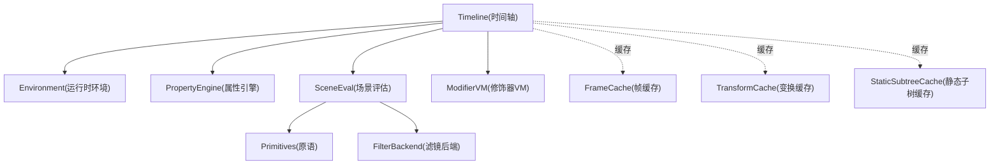
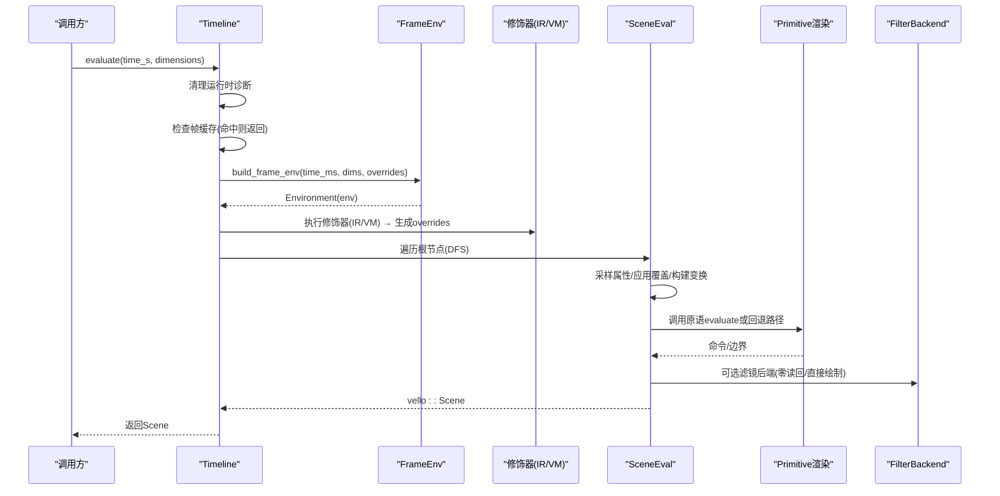
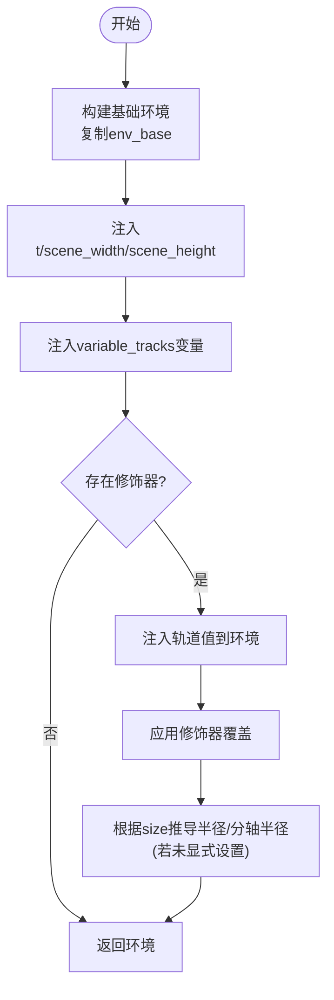
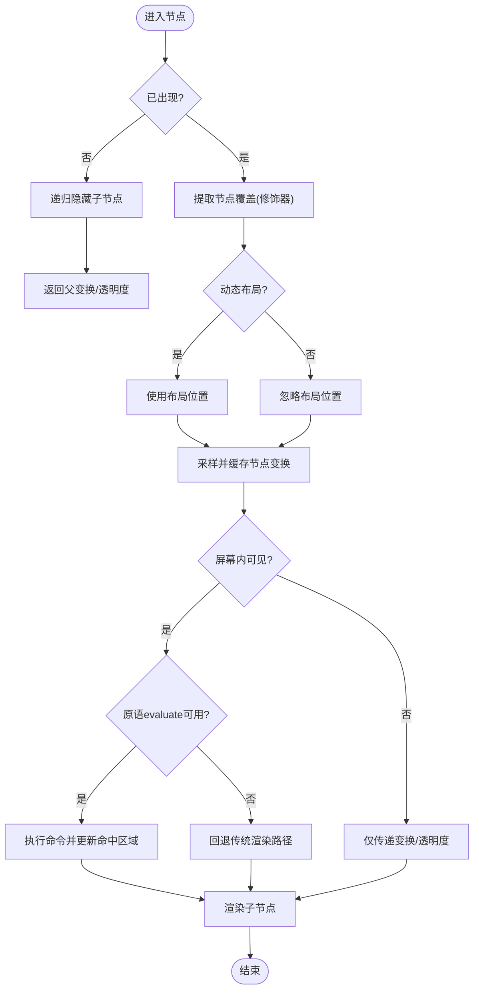
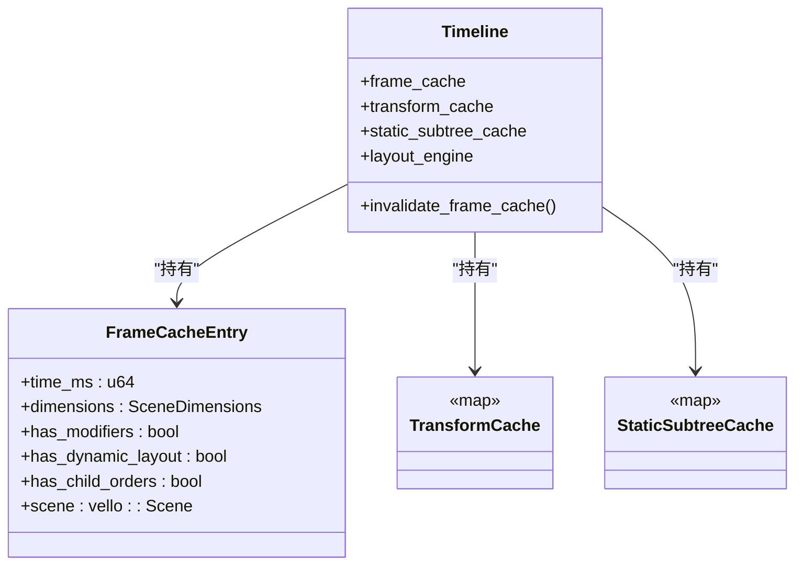
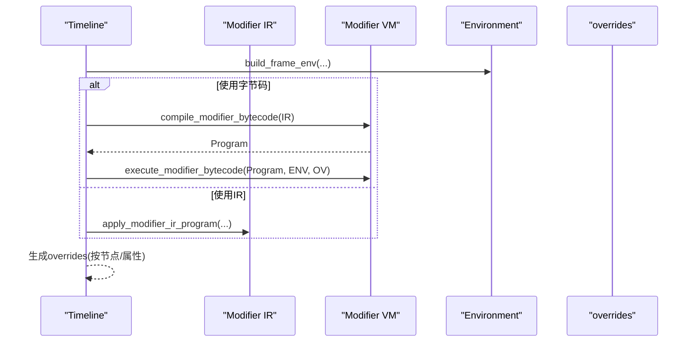
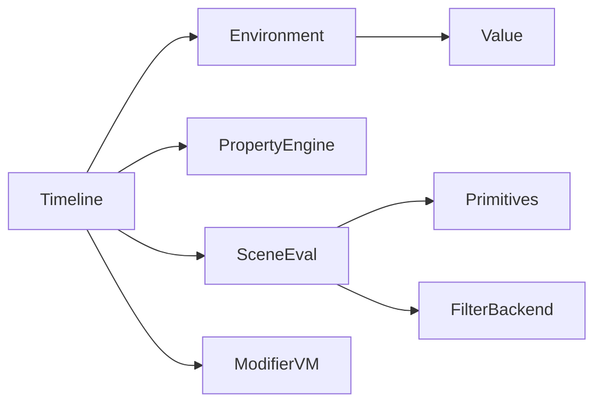

# 求值引擎

<cite>
**本文引用的文件**
- [crates/animatix/src/timeline/scene_eval.rs](file://crates/animatix/src/timeline/scene_eval.rs)
- [crates/animatix/src/timeline/frame_env.rs](file://crates/animatix/src/timeline/frame_env.rs)
- [crates/animatix/src/timeline/env.rs](file://crates/animatix/src/timeline/env.rs)
- [crates/animatix/src/timeline/property_engine.rs](file://crates/animatix/src/timeline/property_engine.rs)
- [crates/animatix/src/timeline/mod.rs](file://crates/animatix/src/timeline/mod.rs)
- [crates/animatix/src/timeline/modifier_runtime/vm.rs](file://crates/animatix/src/timeline/modifier_runtime/vm.rs)
- [crates/animatix/benches/scene_costs.rs](file://crates/animatix/benches/scene_costs.rs)
- [crates/animatix/tests/ir_tests.rs](file://crates/animatix/tests/ir_tests.rs)
</cite>

## 目录
1. [引言](#引言)
2. [项目结构](#项目结构)
3. [核心组件](#核心组件)
4. [架构总览](#架构总览)
5. [详细组件分析](#详细组件分析)
6. [依赖关系分析](#依赖关系分析)
7. [性能考量](#性能考量)
8. [故障排查指南](#故障排查指南)
9. [结论](#结论)
10. [附录](#附录)

## 引言
本文件系统性梳理动画时间轴的“求值引擎”，覆盖从时间推进到场景生成的完整流程：帧环境构建（全局变量、局部变量与环境继承）、场景遍历与变换级联（深度优先搜索）、缓存机制（帧缓存、变换缓存、静态子树缓存），并结合基准测试与一致性测试给出实际示例与优化建议。目标是帮助读者在不深入源码细节的前提下理解运行时行为，并在需要时快速定位实现位置。

## 项目结构
求值引擎位于时间轴模块中，主要由以下文件构成：
- 场景评估与渲染管线：scene_eval.rs
- 帧环境构建与修饰器执行：frame_env.rs
- 运行时环境与值类型：env.rs
- 属性解析与注入：property_engine.rs
- 时间轴主模块与缓存定义：mod.rs
- 修饰器字节码虚拟机：modifier_runtime/vm.rs
- 性能基准与一致性测试：benches/scene_costs.rs、tests/ir_tests.rs

图表来源
- [crates/animatix/src/timeline/scene_eval.rs](file://crates/animatix/src/timeline/scene_eval.rs)
- [crates/animatix/src/timeline/frame_env.rs](file://crates/animatix/src/timeline/frame_env.rs)
- [crates/animatix/src/timeline/env.rs](file://crates/animatix/src/timeline/env.rs)
- [crates/animatix/src/timeline/property_engine.rs](file://crates/animatix/src/timeline/property_engine.rs)
- [crates/animatix/src/timeline/mod.rs](file://crates/animatix/src/timeline/mod.rs)
- [crates/animatix/src/timeline/modifier_runtime/vm.rs](file://crates/animatix/src/timeline/modifier_runtime/vm.rs)

章节来源
- [crates/animatix/src/timeline/scene_eval.rs](file://crates/animatix/src/timeline/scene_eval.rs)
- [crates/animatix/src/timeline/frame_env.rs](file://crates/animatix/src/timeline/frame_env.rs)
- [crates/animatix/src/timeline/env.rs](file://crates/animatix/src/timeline/env.rs)
- [crates/animatix/src/timeline/property_engine.rs](file://crates/animatix/src/timeline/property_engine.rs)
- [crates/animatix/src/timeline/mod.rs](file://crates/animatix/src/timeline/mod.rs)
- [crates/animatix/src/timeline/modifier_runtime/vm.rs](file://crates/animatix/src/timeline/modifier_runtime/vm.rs)

## 核心组件
- 帧环境（Environment）：以“覆盖层+共享基础层”的方式存储全局变量（如 t、scene_width、scene_height）与按标签注入的属性值；支持绑定覆盖（双槽位）以降低采样开销。
- 属性引擎（PropertyEngine）：统一解析表达式为 Typed 值，写入轨道字段，以及将轨道值注入环境供修饰器与渲染使用。
- 场景评估（SceneEval）：深度优先遍历场景图，按需采样属性、应用修饰器覆盖、构建节点变换、进行视口剔除与静态子树复用。
- 修饰器执行（ModifierRuntime/VM）：支持 IR 与字节码两种路径，最终产出 per-node 的属性覆盖映射。
- 缓存体系：帧缓存（按时间、尺寸、修饰器/布局变更标志）、变换缓存（按父变换系数与时间）、静态子树缓存（全静态子树一次性编码并复用）。

章节来源
- [crates/animatix/src/timeline/env.rs](file://crates/animatix/src/timeline/env.rs)
- [crates/animatix/src/timeline/property_engine.rs](file://crates/animatix/src/timeline/property_engine.rs)
- [crates/animatix/src/timeline/scene_eval.rs](file://crates/animatix/src/timeline/scene_eval.rs)
- [crates/animatix/src/timeline/modifier_runtime/vm.rs](file://crates/animatix/src/timeline/modifier_runtime/vm.rs)

## 架构总览
下图展示了从时间推进到场景生成的关键调用链路与数据流。

图表来源
- [crates/animatix/src/timeline/scene_eval.rs](file://crates/animatix/src/timeline/scene_eval.rs)
- [crates/animatix/src/timeline/frame_env.rs](file://crates/animatix/src/timeline/frame_env.rs)
- [crates/animatix/src/timeline/modifier_runtime/vm.rs](file://crates/animatix/src/timeline/modifier_runtime/vm.rs)

## 详细组件分析

### 帧环境构建与修饰器执行
- 全局变量注入：t（秒）、scene_width、scene_height；同时注入场景锚点向量与背景色。
- 按标签注入属性：通过属性注册表将轨道值注入环境（含派生键如 .x/.y/.r/.g/.b/.a）。
- 修饰器覆盖：IR/VM 执行后生成 per-node 的属性覆盖映射，随后在渲染阶段被优先采用。
- 环境继承：使用共享基础层避免复制大量标准库条目；支持增量覆盖与派生键自动补全。

图表来源
- [crates/animatix/src/timeline/frame_env.rs](file://crates/animatix/src/timeline/frame_env.rs)
- [crates/animatix/src/timeline/property_engine.rs](file://crates/animatix/src/timeline/property_engine.rs)

章节来源
- [crates/animatix/src/timeline/frame_env.rs](file://crates/animatix/src/timeline/frame_env.rs)
- [crates/animatix/src/timeline/env.rs](file://crates/animatix/src/timeline/env.rs)
- [crates/animatix/src/timeline/property_engine.rs](file://crates/animatix/src/timeline/property_engine.rs)

### 场景遍历与变换级联（深度优先）
- DFS 遍历：自根节点递归渲染子节点，容器节点（如 Filter/Mask）有特殊分支处理。
- 变换采样：先采样空间属性（position/shift/rotation/scale/transform/opactiy/size），再组合为局部仿射矩阵；对相同 (time, parent_transform) 的节点结果进行缓存。
- 视口剔除：基于世界包围盒与视口相交判断是否可见；不可见节点仍会传递变换给子节点。
- 子节点布局：动态布局时每帧重新计算子节点位置，用于锚定与绑定。

图表来源
- [crates/animatix/src/timeline/scene_eval.rs](file://crates/animatix/src/timeline/scene_eval.rs)

章节来源
- [crates/animatix/src/timeline/scene_eval.rs](file://crates/animatix/src/timeline/scene_eval.rs)

### 缓存机制设计
- 帧缓存（FrameCache）：以时间（毫秒）、尺寸、修饰器/动态布局/子顺序变更标志为键，命中则直接返回 vello::Scene 的克隆。
- 变换缓存（TransformCache）：以节点标签为键，缓存 (time, 父变换系数数组, NodeTransform)，避免重复采样与计算。
- 静态子树缓存（StaticSubtreeCache）：当某子树完全静态（无修饰器、无关键帧、无程序化绘图）时，一次性评估其编码并复用，显著降低重复帧成本。
- 帧缓存失效：当轨道数据变更或布局/修饰器状态变化时，主动清空帧缓存、静态子树缓存、变换缓存与布局引擎缓存。

图表来源
- [crates/animatix/src/timeline/mod.rs](file://crates/animatix/src/timeline/mod.rs)
- [crates/animatix/src/timeline/scene_eval.rs](file://crates/animatix/src/timeline/scene_eval.rs)

章节来源
- [crates/animatix/src/timeline/mod.rs](file://crates/animatix/src/timeline/mod.rs)
- [crates/animatix/src/timeline/scene_eval.rs](file://crates/animatix/src/timeline/scene_eval.rs)

### 修饰器执行（IR/VM）
- IR 路径：将修饰器 IR 逐条解释执行，写入 overrides 映射。
- 字节码路径：编译为指令序列，运行时虚拟机执行，性能更优；与 IR 结果一致。
- 覆盖优先级：渲染阶段对空间属性（position/rotation/scale/opacity/size/transform/shift）等进行覆盖，确保修饰器效果生效。

图表来源
- [crates/animatix/src/timeline/modifier_runtime/vm.rs](file://crates/animatix/src/timeline/modifier_runtime/vm.rs)
- [crates/animatix/src/timeline/frame_env.rs](file://crates/animatix/src/timeline/frame_env.rs)

章节来源
- [crates/animatix/src/timeline/modifier_runtime/vm.rs](file://crates/animatix/src/timeline/modifier_runtime/vm.rs)
- [crates/animatix/src/timeline/frame_env.rs](file://crates/animatix/src/timeline/frame_env.rs)

### 实际示例与最佳实践
- 评估特定时间点状态：调用 evaluate 或 evaluate_with_debug，传入秒数与场景尺寸；内部将转换为毫秒并检查帧缓存。
- 处理动态属性：通过 variable_tracks 注入随时间变化的变量；通过修饰器覆盖临时改写属性；属性引擎负责将轨道值注入环境并生成派生键。
- 优化重复计算：确保场景满足静态条件（无修饰器、无关键帧、无程序化绘图），可启用静态子树缓存；对于重复时间点的评估，利用帧缓存；对同一帧内多次采样的节点，利用变换缓存。

章节来源
- [crates/animatix/src/timeline/scene_eval.rs](file://crates/animatix/src/timeline/scene_eval.rs)
- [crates/animatix/src/timeline/frame_env.rs](file://crates/animatix/src/timeline/frame_env.rs)
- [crates/animatix/src/timeline/mod.rs](file://crates/animatix/src/timeline/mod.rs)

## 依赖关系分析
- Timeline 依赖 Environment 提供变量查找与派生键；依赖 PropertyEngine 完成属性注入与读取；依赖 SceneEval 执行渲染；依赖 ModifierVM/IR 执行修饰器。
- SceneEval 依赖 Primitive 渲染接口与 FilterBackend（可选）；对 TransformCache 与 StaticSubtreeCache 进行读写。
- Env 支持双槽位绑定覆盖，减少采样时的哈希表分配与拷贝。

图表来源
- [crates/animatix/src/timeline/scene_eval.rs](file://crates/animatix/src/timeline/scene_eval.rs)
- [crates/animatix/src/timeline/env.rs](file://crates/animatix/src/timeline/env.rs)
- [crates/animatix/src/timeline/property_engine.rs](file://crates/animatix/src/timeline/property_engine.rs)
- [crates/animatix/src/timeline/modifier_runtime/vm.rs](file://crates/animatix/src/timeline/modifier_runtime/vm.rs)

章节来源
- [crates/animatix/src/timeline/scene_eval.rs](file://crates/animatix/src/timeline/scene_eval.rs)
- [crates/animatix/src/timeline/env.rs](file://crates/animatix/src/timeline/env.rs)
- [crates/animatix/src/timeline/property_engine.rs](file://crates/animatix/src/timeline/property_engine.rs)
- [crates/animatix/src/timeline/modifier_runtime/vm.rs](file://crates/animatix/src/timeline/modifier_runtime/vm.rs)

## 性能考量
- 帧缓存命中：对同一时间与尺寸的连续评估可显著提速；基准测试包含“重复评估同一时间”场景，验证缓存收益。
- 零读回滤镜：当滤镜后端可用且满足安全条件时，可将滤镜输出作为 GPU 待合成项，避免中间图像读回。
- 静态子树复用：全静态子树仅评估一次并缓存其 vello 编码，后续帧直接追加，大幅降低 CPU/GPU 开销。
- 变换缓存：对相同父变换与时间的节点，避免重复采样与矩阵合成。
- 空间局部性：环境覆盖层容量预估与派生键增量更新，减少不必要的克隆与分配。

章节来源
- [crates/animatix/benches/scene_costs.rs](file://crates/animatix/benches/scene_costs.rs)
- [crates/animatix/src/timeline/scene_eval.rs](file://crates/animatix/src/timeline/scene_eval.rs)
- [crates/animatix/src/timeline/mod.rs](file://crates/animatix/src/timeline/mod.rs)

## 故障排查指南
- 修饰器错误：修饰器执行产生的错误会被收集为运行时诊断并记录；可在评估前清理旧诊断，评估后查看最新诊断列表。
- 变量未定义/类型不匹配：Environment 的 EvalError 会报告未定义变量、类型不匹配等问题；检查修饰器表达式与属性注入键名。
- 静态判定失败：若静态子树判定为非静态（存在修饰器、关键帧或程序化绘图），请确认轨道与修饰器配置；必要时禁用相关功能以启用静态缓存。
- 帧缓存未命中：检查时间戳、尺寸、修饰器/布局变更标志是否发生变化；可通过调试选项关闭缓存以定位问题。

章节来源
- [crates/animatix/src/timeline/mod.rs](file://crates/animatix/src/timeline/mod.rs)
- [crates/animatix/src/timeline/env.rs](file://crates/animatix/src/timeline/env.rs)

## 结论
该求值引擎通过“帧环境 + 属性注入 + 修饰器覆盖 + 深度优先渲染 + 多级缓存”的组合，在保证表达力的同时实现了高吞吐与低抖动。合理利用静态子树、帧缓存与变换缓存，可显著提升重复播放与交互时的性能；通过统一的属性引擎与环境模型，修饰器与渲染路径保持一致与可维护。

## 附录
- 一致性验证：IR 与字节码修饰器执行结果在多个时间点上保持一致，确保两种执行路径的正确性。
- 基准测试：包含静态/混合场景在不同时间点的评估与缓存命中测试，便于对比优化前后性能。

章节来源
- [crates/animatix/tests/ir_tests.rs](file://crates/animatix/tests/ir_tests.rs)
- [crates/animatix/benches/scene_costs.rs](file://crates/animatix/benches/scene_costs.rs)