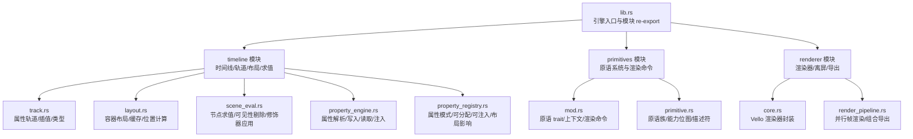
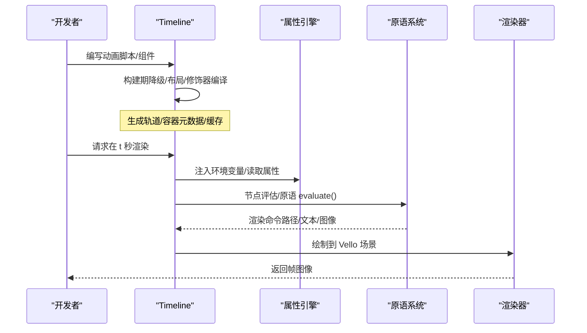
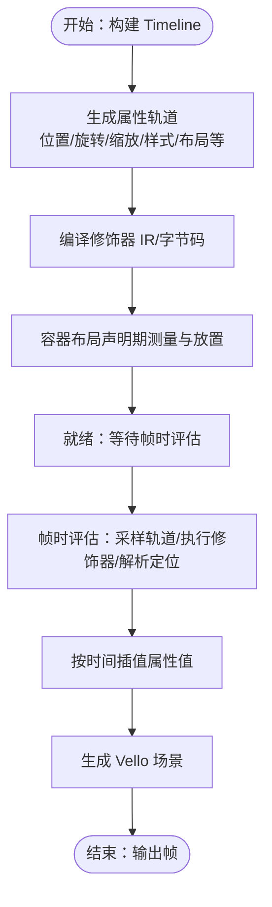
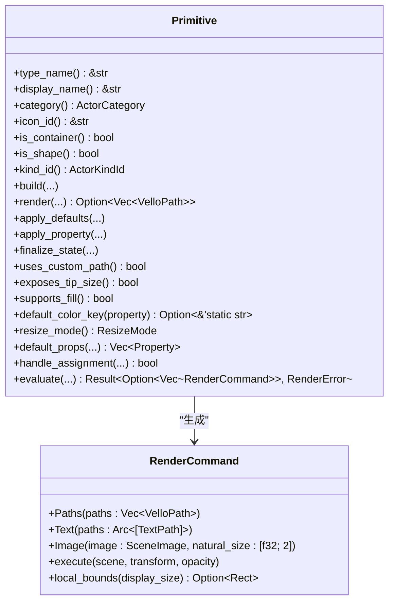
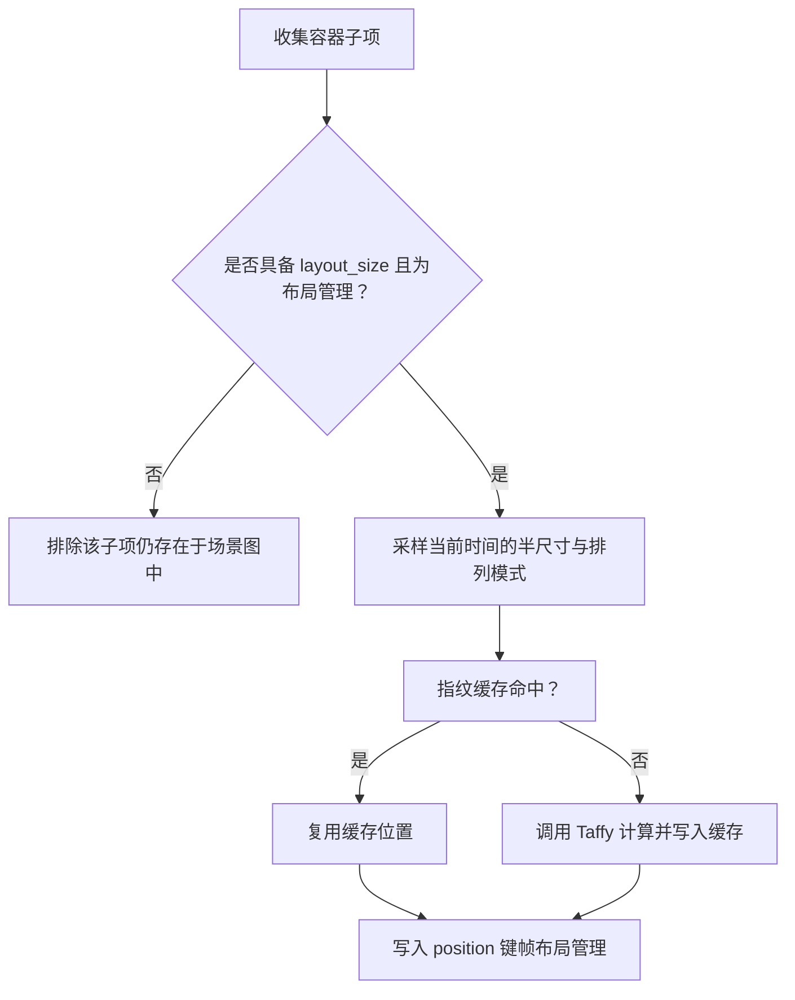
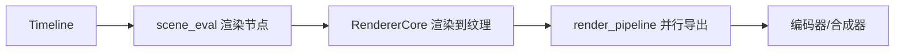
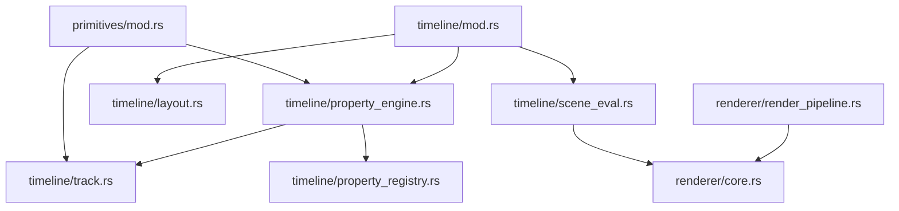

# 核心概念

<cite>
**本文引用的文件**
- [lib.rs](file://crates/animatix/src/lib.rs)
- [mod.rs](file://crates/animatix/src/timeline/mod.rs)
- [track.rs](file://crates/animatix/src/timeline/track.rs)
- [layout.rs](file://crates/animatix/src/timeline/layout.rs)
- [primitive.rs](file://crates/animatix/src/timeline/primitive.rs)
- [property_engine.rs](file://crates/animatix/src/timeline/property_engine.rs)
- [property_registry.rs](file://crates/animatix/src/timeline/property_registry.rs)
- [scene_eval.rs](file://crates/animatix/src/timeline/scene_eval.rs)
- [mod.rs](file://crates/animatix/src/primitives/mod.rs)
- [core.rs](file://crates/animatix/src/renderer/core.rs)
- [render_pipeline.rs](file://crates/animatix/src/renderer/render_pipeline.rs)
</cite>

## 目录
1. [引言](#引言)
2. [项目结构](#项目结构)
3. [核心组件](#核心组件)
4. [架构总览](#架构总览)
5. [详细组件分析](#详细组件分析)
6. [依赖关系分析](#依赖关系分析)
7. [性能考量](#性能考量)
8. [故障排查指南](#故障排查指南)
9. [结论](#结论)

## 引言
本文件面向 Animatix 的核心概念，系统性阐述以下主题：
- 声明式动画原理：以时间线为中心的编译与运行时评估模型，关键帧驱动的属性插值与修饰器执行。
- 时间线系统：构建期与帧时边界、动作事件记录、子场景与导出质量等级。
- 原语系统：统一抽象接口，覆盖形状、文本、媒体与图表等视觉元素的共同特征与差异化能力。
- 布局系统：容器化布局、动态重计算与手动定位的协作机制。
- 渲染管线：基于 Vello/WGPU 的 GPU 渲染、离屏合成与并行导出流水线。

## 项目结构
Animatix 的核心位于 crates/animatix/src 下，采用模块化分层设计：
- timeline：时间线、轨道、属性注册表、布局、场景求值与修饰器执行。
- primitives：原语系统与渲染命令抽象。
- renderer：渲染器封装、离屏渲染、滤镜后端、导出流水线。
- lib.rs：对外 re-export 与模块组织入口。

**图表来源**
- [lib.rs:1-24](file://crates/animatix/src/lib.rs#L1-L24)
- [mod.rs:1-120](file://crates/animatix/src/timeline/mod.rs#L1-L120)
- [track.rs:1-120](file://crates/animatix/src/timeline/track.rs#L1-L120)
- [layout.rs:1-120](file://crates/animatix/src/timeline/layout.rs#L1-L120)
- [scene_eval.rs:1-120](file://crates/animatix/src/timeline/scene_eval.rs#L1-L120)
- [property_engine.rs:1-120](file://crates/animatix/src/timeline/property_engine.rs#L1-L120)
- [property_registry.rs:1-120](file://crates/animatix/src/timeline/property_registry.rs#L1-L120)
- [mod.rs:1-120](file://crates/animatix/src/primitives/mod.rs#L1-L120)
- [primitive.rs:1-120](file://crates/animatix/src/timeline/primitive.rs#L1-L120)
- [core.rs:1-120](file://crates/animatix/src/renderer/core.rs#L1-L120)
- [render_pipeline.rs:1-120](file://crates/animatix/src/renderer/render_pipeline.rs#L1-L120)

**章节来源**
- [lib.rs:1-24](file://crates/animatix/src/lib.rs#L1-L24)

## 核心组件
- 时间线（Timeline）：编译后的动画包，包含场景图、属性轨道、修饰器程序、容器元数据与布局引擎，以及帧时缓存与诊断信息。
- 属性轨道（PropertyTrack）：键控属性值随时间变化的存储单元，支持默认值、缓存与插值。
- 原语（Primitive）：所有可视元素的统一抽象，定义构建、渲染、评估与交互能力。
- 布局（LayoutEngine）：容器内子项的声明期测量与放置，支持 Row/Col/Grid/Stack，并带指纹缓存避免重复计算。
- 渲染器（RendererCore）：基于 Vello/WGPU 的 GPU 渲染封装，支持零读回纹理合成与背景色渲染。

**章节来源**
- [mod.rs:431-502](file://crates/animatix/src/timeline/mod.rs#L431-L502)
- [track.rs:438-537](file://crates/animatix/src/timeline/track.rs#L438-L537)
- [mod.rs:416-568](file://crates/animatix/src/primitives/mod.rs#L416-L568)
- [layout.rs:82-200](file://crates/animatix/src/timeline/layout.rs#L82-L200)
- [core.rs:6-90](file://crates/animatix/src/renderer/core.rs#L6-L90)

## 架构总览
Animatix 的运行时由“构建期”与“帧时评估”两大阶段构成：
- 构建期：AST 降级为 Timeline，生成轨道、布局、修饰器 IR/字节码、资源缓存与调试事件。
- 帧时评估：按时间采样轨道、执行修饰器、应用锚点/百分比定位、组装 Vello 场景并输出帧。

**图表来源**
- [mod.rs:1-40](file://crates/animatix/src/timeline/mod.rs#L1-L40)
- [scene_eval.rs:700-800](file://crates/animatix/src/timeline/scene_eval.rs#L700-L800)
- [property_engine.rs:588-643](file://crates/animatix/src/timeline/property_engine.rs#L588-L643)
- [mod.rs:268-414](file://crates/animatix/src/primitives/mod.rs#L268-L414)
- [core.rs:53-90](file://crates/animatix/src/renderer/core.rs#L53-L90)

## 详细组件分析

### 时间线系统与声明式动画
- 构建期与帧时边界：build.rs 生成 Timeline；evaluate.rs 在每帧采样轨道、执行修饰器、解析锚点与百分比定位。
- 动画轨道与插值：PropertyTrack 支持键帧集合、默认值、缓存与插值；Interpolate 为标量/向量/颜色/变换等类型提供插值实现。
- 关键帧与缓动：每个键帧携带缓动函数，evaluate 阶段按进度应用缓动曲线。
- 修饰器执行：支持 IR/字节码/AST 三种路径，优先使用已编译的字节码以获得最佳性能。
- 动作事件：构建期将交互动作转换为关键帧并保留元数据用于 GUI 时间轴可视化。

**图表来源**
- [mod.rs:1-40](file://crates/animatix/src/timeline/mod.rs#L1-L40)
- [track.rs:438-537](file://crates/animatix/src/timeline/track.rs#L438-L537)
- [scene_eval.rs:700-800](file://crates/animatix/src/timeline/scene_eval.rs#L700-L800)

**章节来源**
- [mod.rs:1-120](file://crates/animatix/src/timeline/mod.rs#L1-L120)
- [track.rs:228-537](file://crates/animatix/src/timeline/track.rs#L228-L537)
- [scene_eval.rs:700-800](file://crates/animatix/src/timeline/scene_eval.rs#L700-L800)

### 原语系统与统一抽象
- 原语 trait：所有可视元素实现统一接口，包括构建（Build）、渲染（Render）、评估（Evaluate）与属性处理（apply_property/finalize）。
- 渲染命令：RenderCommand 将具体绘制操作抽象为路径、文本与图像三类，交由 scene_eval 执行到 Vello 场景。
- 原语族与能力位图：通过 PrimitiveDescriptor 描述家族（文本/矢量形状/媒体/图表/容器/组）与能力（文本路径/矢量路径/图像载入/布局容器/可形变路径/矢量揭示目标/绘图几何）。
- 文本/形状/图像/SVG/音频等原语均遵循同一接口，便于扩展与迁移。

**图表来源**
- [mod.rs:416-568](file://crates/animatix/src/primitives/mod.rs#L416-L568)
- [mod.rs:268-414](file://crates/animatix/src/primitives/mod.rs#L268-L414)
- [primitive.rs:25-149](file://crates/animatix/src/timeline/primitive.rs#L25-L149)

**章节来源**
- [mod.rs:1-120](file://crates/animatix/src/primitives/mod.rs#L1-L120)
- [mod.rs:416-568](file://crates/animatix/src/primitives/mod.rs#L416-L568)
- [primitive.rs:1-184](file://crates/animatix/src/timeline/primitive.rs#L1-L184)

### 布局系统：容器化、动态重计算与手动定位
- 容器类型：Row/Col/Grid/Stack，声明期决定子项半尺寸与放置策略。
- 子项准入：仅拥有“已播种”的布局尺寸（layout_size）且处于“布局管理”模式的子项参与布局。
- 布局缓存：以子项半尺寸与排列模式指纹为键缓存结果，避免重复 Taffy 计算。
- 动态布局：当启用动态布局时，按时间计算子项位置并与容器布局协同。
- 手动定位：若设置“at”或“position”，则覆盖容器布局，直接使用绝对定位。

**图表来源**
- [layout.rs:202-309](file://crates/animatix/src/timeline/layout.rs#L202-L309)
- [layout.rs:82-200](file://crates/animatix/src/timeline/layout.rs#L82-L200)

**章节来源**
- [layout.rs:1-200](file://crates/animatix/src/timeline/layout.rs#L1-L200)
- [layout.rs:202-309](file://crates/animatix/src/timeline/layout.rs#L202-L309)

### 渲染管线：GPU 与并行导出
- Vello/WGPU 渲染：RendererCore 封装 Vello 渲染器，支持背景色渲染与零读回纹理合成。
- 离屏渲染：OffscreenRenderer 提供 CPU 可读帧缓冲，配合导出编码器进行视频/GIF 导出。
- 并行帧渲染：render_pipeline 提供多线程分块渲染，严格顺序输出，限制内存占用。
- 过渡与组合：Composition 支持硬切场景切换，过渡混合将在后续阶段实现。

**图表来源**
- [core.rs:14-90](file://crates/animatix/src/renderer/core.rs#L14-L90)
- [render_pipeline.rs:42-137](file://crates/animatix/src/renderer/render_pipeline.rs#L42-L137)

**章节来源**
- [core.rs:1-183](file://crates/animatix/src/renderer/core.rs#L1-L183)
- [render_pipeline.rs:1-301](file://crates/animatix/src/renderer/render_pipeline.rs#L1-L301)

## 依赖关系分析
- 时间线模块依赖属性注册表与属性引擎，确保属性解析、写入、读取与环境注入的一致性。
- 原语系统依赖时间线的轨道与上下文，将抽象渲染命令下发至场景求值。
- 渲染模块依赖 Vello/WGPU 设备与队列，负责最终帧输出与导出。

**图表来源**
- [mod.rs:1-120](file://crates/animatix/src/primitives/mod.rs#L1-L120)
- [property_engine.rs:1-120](file://crates/animatix/src/timeline/property_engine.rs#L1-L120)
- [property_registry.rs:1-120](file://crates/animatix/src/timeline/property_registry.rs#L1-L120)
- [track.rs:1-120](file://crates/animatix/src/timeline/track.rs#L1-L120)
- [mod.rs:1-120](file://crates/animatix/src/timeline/mod.rs#L1-L120)
- [layout.rs:1-120](file://crates/animatix/src/timeline/layout.rs#L1-L120)
- [scene_eval.rs:1-120](file://crates/animatix/src/timeline/scene_eval.rs#L1-L120)
- [core.rs:1-120](file://crates/animatix/src/renderer/core.rs#L1-L120)
- [render_pipeline.rs:1-120](file://crates/animatix/src/renderer/render_pipeline.rs#L1-L120)

**章节来源**
- [mod.rs:1-120](file://crates/animatix/src/timeline/mod.rs#L1-L120)
- [track.rs:1-120](file://crates/animatix/src/timeline/track.rs#L1-L120)
- [property_engine.rs:1-120](file://crates/animatix/src/timeline/property_engine.rs#L1-L120)
- [property_registry.rs:1-120](file://crates/animatix/src/timeline/property_registry.rs#L1-L120)
- [mod.rs:1-120](file://crates/animatix/src/primitives/mod.rs#L1-L120)
- [core.rs:1-120](file://crates/animatix/src/renderer/core.rs#L1-L120)
- [render_pipeline.rs:1-120](file://crates/animatix/src/renderer/render_pipeline.rs#L1-L120)

## 性能考量
- 帧缓存与变换缓存：避免重复求值与变换采样，显著降低静态场景开销。
- 可见性剔除：基于视口与保守包围盒快速跳过离屏节点。
- 布局指纹缓存：以子项半尺寸与排列模式指纹作为缓存键，避免重复 Taffy 计算。
- 修饰器优先路径：优先使用字节码程序，其次 IR，最后 AST 回退。
- 并行导出：分块并行渲染，通道限流控制内存峰值。

[本节为通用指导，不直接分析具体文件]

## 故障排查指南
- 修饰器错误：帧时评估会收集修饰器错误并写入运行时诊断，可在 GUI 中查看。
- 布局尺寸缺失：若子项未播种 layout_size，将被排除在布局之外并产生警告诊断。
- 滤镜后端：若零读回合成失败，将回退到需要读回的路径；检查滤镜后端可用性与路径合法性。

**章节来源**
- [scene_eval.rs:795-800](file://crates/animatix/src/timeline/scene_eval.rs#L795-L800)
- [layout.rs:202-219](file://crates/animatix/src/timeline/layout.rs#L202-L219)

## 结论
Animatix 通过声明式时间线、统一原语抽象与 GPU 渲染管线，提供了从构建到导出的完整动画工作流。其关键优势在于：
- 明确的构建期与帧时边界，保证可预测的性能与行为。
- 以属性注册表与属性引擎为核心的调度系统，简化了新属性与原语的接入。
- 布局系统在声明期完成测量与放置，结合缓存与可见性剔除提升运行效率。
- 基于 Vello/WGPU 的渲染器与并行导出流水线，满足高质量与高吞吐的导出需求。