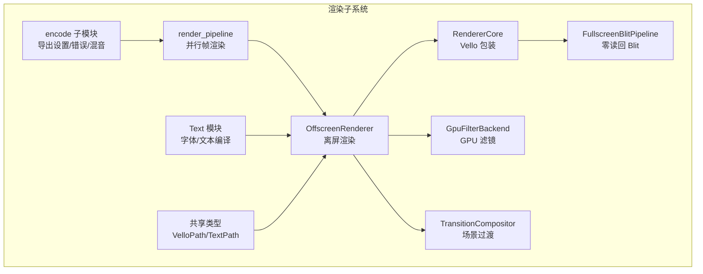
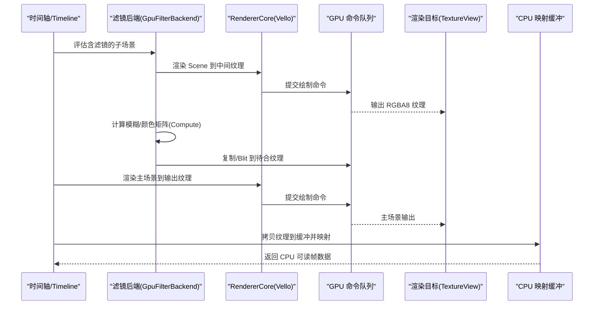
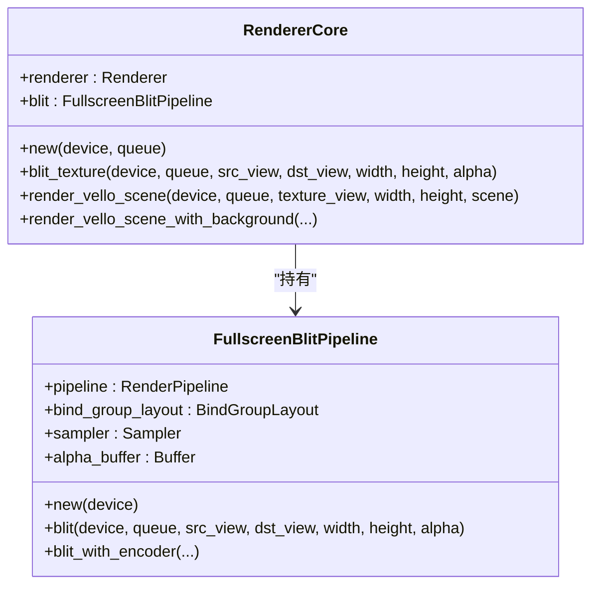
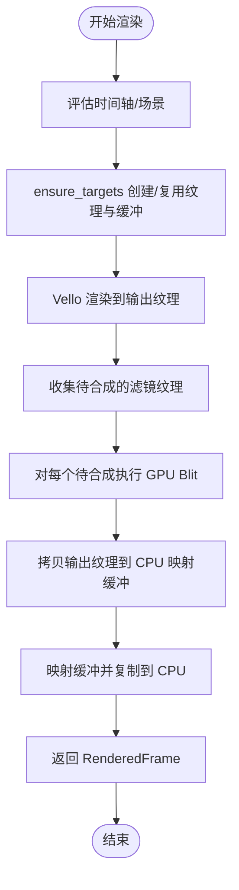
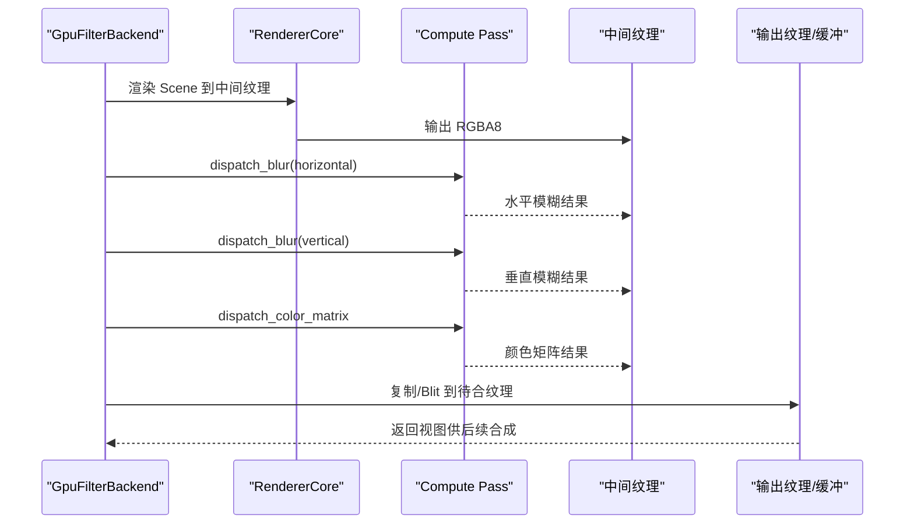
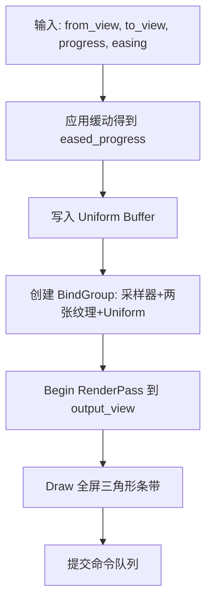
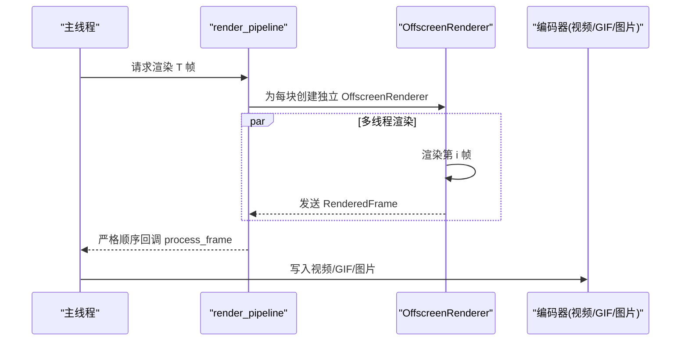
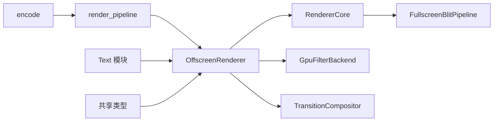

# 渲染管线

<cite>
**本文引用的文件**   
- [crates/animatix/src/renderer/mod.rs](file://crates/animatix/src/renderer/mod.rs)
- [crates/animatix/src/renderer/core.rs](file://crates/animatix/src/renderer/core.rs)
- [crates/animatix/src/renderer/offscreen.rs](file://crates/animatix/src/renderer/offscreen.rs)
- [crates/animatix/src/renderer/render_pipeline.rs](file://crates/animatix/src/renderer/render_pipeline.rs)
- [crates/animatix/src/renderer/types.rs](file://crates/animatix/src/renderer/types.rs)
- [crates/animatix/src/renderer/fullscreen_blit.rs](file://crates/animatix/src/renderer/fullscreen_blit.rs)
- [crates/animatix/src/renderer/filter_backend.rs](file://crates/animatix/src/renderer/filter_backend.rs)
- [crates/animatix/src/renderer/transition.rs](file://crates/animatix/src/renderer/transition.rs)
- [crates/animatix/src/renderer/video.rs](file://crates/animatix/src/renderer/video.rs)
- [crates/animatix/src/renderer/encode/mod.rs](file://crates/animatix/src/renderer/encode/mod.rs)
- [crates/animatix/src/renderer/text.rs](file://crates/animatix/src/renderer/text.rs)
- [crates/animatix/src/renderer/error.rs](file://crates/animatix/src/renderer/error.rs)
- [crates/animatix/src/timeline/filter.rs](file://crates/animatix/src/timeline/filter.rs)
- [crates/animatix/assets/shaders/engine_shader.wgsl](file://crates/animatix/assets/shaders/engine_shader.wgsl)
- [crates/animatix/assets/shaders/text_shader.wgsl](file://crates/animatix/assets/shaders/text_shader.wgsl)
</cite>

## 目录
1. [引言](#引言)
2. [项目结构](#项目结构)
3. [核心组件](#核心组件)
4. [架构总览](#架构总览)
5. [详细组件分析](#详细组件分析)
6. [依赖关系分析](#依赖关系分析)
7. [性能考量](#性能考量)
8. [故障排查指南](#故障排查指南)
9. [结论](#结论)
10. [附录](#附录)

## 引言
本文件系统性阐述 Animatix 的 GPU 加速渲染架构，围绕 Vello 渲染器、WGPU 图形 API 与 WebGPU/WGSL 着色器展开，覆盖从几何生成、滤镜与过渡合成，到最终像素输出的完整流水线。文档同时总结渲染状态管理、零读回纹理合成、并行帧渲染策略、以及多格式导出（视频、GIF、图片）的技术要点与性能优化建议。

## 项目结构
渲染子系统位于 crates/animatix/src/renderer 下，采用模块化设计：
- 核心封装：RendererCore 封装 Vello 渲染器与零读回全屏纹理 Blit。
- 离屏渲染：OffscreenRenderer 负责离屏场景评估、Vello 绘制、滤镜后读回。
- 过渡合成：TransitionCompositor 提供基于 WGSL 的场景过渡混合。
- 共享类型：VelloPath、TextPath 等跨模块数据结构。
- 文本支持：Text 模块负责字体解析、文本编译与路径提取。
- 导出与编码：encode 子模块统一导出错误、设置与音频混流；video 模块重导出具体编码函数。
- 并行渲染：render_pipeline 提供分块并行、顺序输出的流式渲染框架。

图示来源
- [crates/animatix/src/renderer/core.rs:1-183](file://crates/animatix/src/renderer/core.rs#L1-L183)
- [crates/animatix/src/renderer/offscreen.rs:1-529](file://crates/animatix/src/renderer/offscreen.rs#L1-L529)
- [crates/animatix/src/renderer/fullscreen_blit.rs:1-232](file://crates/animatix/src/renderer/fullscreen_blit.rs#L1-L232)
- [crates/animatix/src/renderer/transition.rs:1-295](file://crates/animatix/src/renderer/transition.rs#L1-L295)
- [crates/animatix/src/renderer/filter_backend.rs:1-982](file://crates/animatix/src/renderer/filter_backend.rs#L1-L982)
- [crates/animatix/src/renderer/render_pipeline.rs:1-301](file://crates/animatix/src/renderer/render_pipeline.rs#L1-L301)
- [crates/animatix/src/renderer/encode/mod.rs:1-400](file://crates/animatix/src/renderer/encode/mod.rs#L1-L400)
- [crates/animatix/src/renderer/text.rs:1-622](file://crates/animatix/src/renderer/text.rs#L1-L622)
- [crates/animatix/src/renderer/types.rs:1-41](file://crates/animatix/src/renderer/types.rs#L1-L41)

章节来源
- [crates/animatix/src/renderer/mod.rs:1-57](file://crates/animatix/src/renderer/mod.rs#L1-L57)

## 核心组件
- RendererCore：封装 Vello 渲染器实例与零读回 Blit 管线，负责将 Vello Scene 渲染至指定 TextureView，并可直接在 GPU 内 Blit 纹理。
- OffscreenRenderer：构建并维护 RGBA8 输出纹理、中间 Ping-Pong 纹理与 CPU 可映射缓冲，完成离屏绘制、滤镜后读回与过渡合成。
- GpuFilterBackend：独立的 GPU 滤镜后端，拥有自身 Vello 渲染器与临时纹理，执行高斯模糊与颜色矩阵计算，支持零读回复合。
- TransitionCompositor：基于 WGSL 的场景过渡混合器，支持 Cut/Fade/Wipe 等过渡类型。
- FullscreenBlitPipeline：自定义全屏四边形 Blit，避免 CPU 读回，直接在 GPU 合成滤镜结果。
- render_pipeline：并行帧渲染框架，按块切分、多线程渲染、有界通道限制内存峰值。
- encode：导出配置、错误类型与音频混流工具。
- text：字体数据库、文本/数学编译、路径提取与运行时缓存。
- 类型系统：VelloPath、TextPath 等跨模块共享的数据结构。

章节来源
- [crates/animatix/src/renderer/core.rs:1-183](file://crates/animatix/src/renderer/core.rs#L1-L183)
- [crates/animatix/src/renderer/offscreen.rs:1-529](file://crates/animatix/src/renderer/offscreen.rs#L1-L529)
- [crates/animatix/src/renderer/filter_backend.rs:1-982](file://crates/animatix/src/renderer/filter_backend.rs#L1-L982)
- [crates/animatix/src/renderer/transition.rs:1-295](file://crates/animatix/src/renderer/transition.rs#L1-L295)
- [crates/animatix/src/renderer/fullscreen_blit.rs:1-232](file://crates/animatix/src/renderer/fullscreen_blit.rs#L1-L232)
- [crates/animatix/src/renderer/render_pipeline.rs:1-301](file://crates/animatix/src/renderer/render_pipeline.rs#L1-L301)
- [crates/animatix/src/renderer/encode/mod.rs:1-400](file://crates/animatix/src/renderer/encode/mod.rs#L1-L400)
- [crates/animatix/src/renderer/text.rs:1-622](file://crates/animatix/src/renderer/text.rs#L1-L622)
- [crates/animatix/src/renderer/types.rs:1-41](file://crates/animatix/src/renderer/types.rs#L1-L41)

## 架构总览
下图展示从时间轴求值到最终像素输出的关键路径，包括滤镜与过渡的插入点。

图示来源
- [crates/animatix/src/renderer/offscreen.rs:112-167](file://crates/animatix/src/renderer/offscreen.rs#L112-L167)
- [crates/animatix/src/renderer/filter_backend.rs:619-746](file://crates/animatix/src/renderer/filter_backend.rs#L619-L746)
- [crates/animatix/src/renderer/core.rs:53-89](file://crates/animatix/src/renderer/core.rs#L53-L89)

## 详细组件分析

### Vello 渲染器与零读回 Blit
- RendererCore 在给定 WGPU 设备上初始化 Vello 渲染器，并持有 FullscreenBlitPipeline。
- render_vello_scene 接收 Scene 与目标 TextureView，使用 RenderParams 完成渲染。
- blit_texture 支持在 GPU 内将源纹理 Blit 到目标纹理，避免 CPU 读回，用于滤镜结果的零读回合成。

图示来源
- [crates/animatix/src/renderer/core.rs:1-183](file://crates/animatix/src/renderer/core.rs#L1-L183)
- [crates/animatix/src/renderer/fullscreen_blit.rs:1-232](file://crates/animatix/src/renderer/fullscreen_blit.rs#L1-L232)

章节来源
- [crates/animatix/src/renderer/core.rs:1-183](file://crates/animatix/src/renderer/core.rs#L1-L183)
- [crates/animatix/src/renderer/fullscreen_blit.rs:1-232](file://crates/animatix/src/renderer/fullscreen_blit.rs#L1-L232)

### 离屏渲染与读回
- OffscreenRenderer 维护输出纹理、双缓冲中间纹理与 CPU 可映射缓冲。
- render_timeline_with_debug 评估时间轴，调用 Vello 渲染到输出纹理，随后将纹理拷贝到 CPU 缓冲并返回 RenderedFrame。
- render_transition 使用 TransitionCompositor 对两帧进行过渡混合，再读回。
- render_timeline_to_texture_a/b 支持将中间帧渲染到纹理以供后续合成或滤镜复用。

图示来源
- [crates/animatix/src/renderer/offscreen.rs:94-167](file://crates/animatix/src/renderer/offscreen.rs#L94-L167)
- [crates/animatix/src/renderer/offscreen.rs:223-293](file://crates/animatix/src/renderer/offscreen.rs#L223-L293)

章节来源
- [crates/animatix/src/renderer/offscreen.rs:1-529](file://crates/animatix/src/renderer/offscreen.rs#L1-L529)

### GPU 滤镜后端（模糊与颜色矩阵）
- GpuFilterBackend 拥有独立的 Vello 渲染器与临时纹理，先将 Scene 渲染到中间纹理，再通过 Compute Shader 执行水平/垂直高斯模糊与颜色矩阵变换。
- 支持零读回复合：将最终滤镜结果复制到专用纹理，稍后由 FullscreenBlitPipeline 合入主场景。
- 提供 take_last_filtered_view 与 take_pending_composites，便于 OffscreenRenderer 在主渲染后进行零读回合成。

图示来源
- [crates/animatix/src/renderer/filter_backend.rs:619-746](file://crates/animatix/src/renderer/filter_backend.rs#L619-L746)
- [crates/animatix/src/renderer/fullscreen_blit.rs:155-231](file://crates/animatix/src/renderer/fullscreen_blit.rs#L155-L231)

章节来源
- [crates/animatix/src/renderer/filter_backend.rs:1-982](file://crates/animatix/src/renderer/filter_backend.rs#L1-L982)

### 场景过渡合成
- TransitionCompositor 使用自定义 WGSL 片元着色器，根据进度与过渡类型混合两张输入纹理。
- 支持 Cut/Fade/WipeLeft/Right/Up/Down 等过渡，结合缓动函数调整混合曲线。
- 通过 Uniform Buffer 传递进度与类型，绑定采样器与两张输入纹理，绘制一个全屏三角形条带。

图示来源
- [crates/animatix/src/renderer/transition.rs:215-293](file://crates/animatix/src/renderer/transition.rs#L215-L293)

章节来源
- [crates/animatix/src/renderer/transition.rs:1-295](file://crates/animatix/src/renderer/transition.rs#L1-L295)

### 文本渲染与字体系统
- text 模块提供 FontContext、TypstWorld 与多种编译入口（纯文本、数学公式、代码），将排版结果转换为 TextPath 或形状曲线。
- 提供 TextCompiler 的 LRU 风格缓存，避免重复编译相同文本。
- 字体来源包括内嵌字体与系统字体，字体解析与路径提取均在 GPU 友好的数据结构中完成。

章节来源
- [crates/animatix/src/renderer/text.rs:1-622](file://crates/animatix/src/renderer/text.rs#L1-L622)

### 并行帧渲染与导出
- render_pipeline 提供 render_frames_streaming 与 render_frames_streaming_composition，按块切分帧序列，多线程渲染并通过有界通道顺序输出，控制内存占用。
- encode 模块定义 ExportSettings、ExportError、H264Preset、VideoCodec 等导出配置与错误类型；video 模块重导出具体编码函数。
- 视频导出支持音频混流（ffmpeg），按片段延迟、裁剪与音量调整后混合输出。

图示来源
- [crates/animatix/src/renderer/render_pipeline.rs:38-137](file://crates/animatix/src/renderer/render_pipeline.rs#L38-L137)
- [crates/animatix/src/renderer/render_pipeline.rs:149-301](file://crates/animatix/src/renderer/render_pipeline.rs#L149-L301)
- [crates/animatix/src/renderer/video.rs:1-24](file://crates/animatix/src/renderer/video.rs#L1-L24)
- [crates/animatix/src/renderer/encode/mod.rs:1-400](file://crates/animatix/src/renderer/encode/mod.rs#L1-L400)

章节来源
- [crates/animatix/src/renderer/render_pipeline.rs:1-301](file://crates/animatix/src/renderer/render_pipeline.rs#L1-L301)
- [crates/animatix/src/renderer/video.rs:1-24](file://crates/animatix/src/renderer/video.rs#L1-L24)
- [crates/animatix/src/renderer/encode/mod.rs:1-400](file://crates/animatix/src/renderer/encode/mod.rs#L1-L400)

### 数据模型与共享类型
- VelloPath：包含 BezPath、可选填充与描边信息，用于 Vello 渲染。
- TextPath：从文本排版提取的字形路径及其颜色与不透明度。
- FilterBackend trait：定义滤镜后端接口，支持 CPU/GPU 双路径与零读回复合。

章节来源
- [crates/animatix/src/renderer/types.rs:1-41](file://crates/animatix/src/renderer/types.rs#L1-L41)
- [crates/animatix/src/timeline/filter.rs:1-270](file://crates/animatix/src/timeline/filter.rs#L1-L270)

## 依赖关系分析
- OffscreenRenderer 依赖 RendererCore、GpuFilterBackend、TransitionCompositor 与 WGPU 设备/队列。
- GpuFilterBackend 拥有独立的 Vello 渲染器与临时纹理，避免与主渲染器竞争资源。
- FullscreenBlitPipeline 作为通用零读回合成工具被多个模块复用。
- render_pipeline 与 encode 模块解耦导出配置与具体编码实现。
- 文本模块与渲染模块通过共享类型与 Scene 结构交互。

图示来源
- [crates/animatix/src/renderer/offscreen.rs:1-529](file://crates/animatix/src/renderer/offscreen.rs#L1-L529)
- [crates/animatix/src/renderer/core.rs:1-183](file://crates/animatix/src/renderer/core.rs#L1-L183)
- [crates/animatix/src/renderer/filter_backend.rs:1-982](file://crates/animatix/src/renderer/filter_backend.rs#L1-L982)
- [crates/animatix/src/renderer/transition.rs:1-295](file://crates/animatix/src/renderer/transition.rs#L1-L295)
- [crates/animatix/src/renderer/fullscreen_blit.rs:1-232](file://crates/animatix/src/renderer/fullscreen_blit.rs#L1-L232)
- [crates/animatix/src/renderer/render_pipeline.rs:1-301](file://crates/animatix/src/renderer/render_pipeline.rs#L1-L301)
- [crates/animatix/src/renderer/encode/mod.rs:1-400](file://crates/animatix/src/renderer/encode/mod.rs#L1-L400)
- [crates/animatix/src/renderer/text.rs:1-622](file://crates/animatix/src/renderer/text.rs#L1-L622)
- [crates/animatix/src/renderer/types.rs:1-41](file://crates/animatix/src/renderer/types.rs#L1-L41)

## 性能考量
- 并行渲染
  - render_pipeline 将帧序列按块切分，每块创建独立 OffscreenRenderer，降低适配器枚举并发风险。
  - 使用有界同步通道限制每块在途帧数，内存占用近似 O(线程数 × 单帧像素)。
- 零读回合成
  - FullscreenBlitPipeline 与 GpuFilterBackend 的零读回路径避免 CPU 读回，显著降低带宽与 CPU 开销。
- 状态与资源管理
  - OffscreenRenderer 在尺寸变化时重建纹理与缓冲，确保内存与带宽效率。
  - GpuFilterBackend 复用内部纹理与管线，减少状态切换与分配开销。
- 着色器与批处理
  - 使用实例化渲染（WGSL 中的 Storage Buffer + Instance）合并绘制调用，减少状态切换。
  - 过渡混合与滤镜计算在 GPU 上完成，避免 CPU-GPU 往返。
- 导出性能
  - 视频导出优先选择硬件编码器（如 NVENC/VAAPI），软件编码仅在无硬件时启用。
  - 音频混流通过 ffmpeg CLI 实现，按需延迟与裁剪，避免多余处理。

## 故障排查指南
- 适配器与设备
  - 若出现适配器不可用或设备请求失败，检查驱动版本与平台支持情况。
- Vello 初始化失败
  - 检查渲染选项与功能集是否满足要求，确认未禁用必要的特性。
- 帧渲染失败
  - 关注 RenderError::FrameRender，定位具体帧号与错误上下文。
- 导出错误
  - ExportError::VideoEncode/GifEncode/ImageEncode 分别对应不同编码阶段问题。
  - ExportError::FfmpegNotFound 表示缺少 ffmpeg，安装后重试。
- 文本编译失败
  - RenderError::TextCompilation 通常由字体缺失或排版错误导致，检查字体解析与内容合法性。

章节来源
- [crates/animatix/src/renderer/error.rs:1-29](file://crates/animatix/src/renderer/error.rs#L1-L29)
- [crates/animatix/src/renderer/encode/mod.rs:34-125](file://crates/animatix/src/renderer/encode/mod.rs#L34-L125)

## 结论
Animatix 的渲染管线以 Vello 为核心，结合 WGPU/WGSL 实现高效的 GPU 渲染与合成。通过零读回 Blit、GPU 滤镜与过渡混合、并行帧渲染与导出链路，系统在保证质量的同时兼顾了性能与可扩展性。面向未来，可进一步完善两场景过渡合成与更丰富的滤镜组合，持续优化资源池化与状态排序策略。

## 附录

### 着色器概览
- engine_shader.wgsl：顶点/片元着色器，使用实例化渲染绘制 SDF 形状，支持填充与描边混合。
- text_shader.wgsl：顶点/片元着色器，将字体纹理采样与颜色合成，用于文本渲染。

章节来源
- [crates/animatix/assets/shaders/engine_shader.wgsl:1-129](file://crates/animatix/assets/shaders/engine_shader.wgsl#L1-L129)
- [crates/animatix/assets/shaders/text_shader.wgsl:1-63](file://crates/animatix/assets/shaders/text_shader.wgsl#L1-L63)