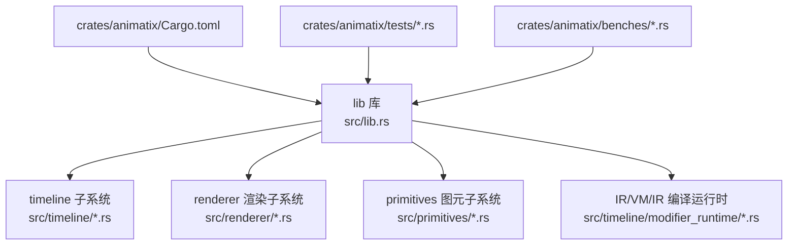
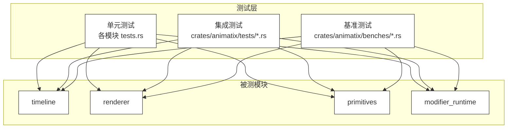
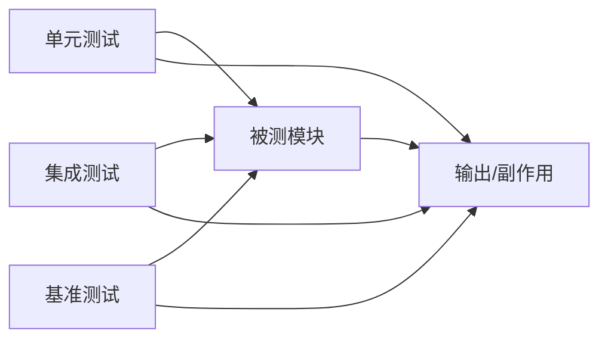

# 测试与调试

<cite>
**本文引用的文件**
- [crates/animatix/Cargo.toml](file://crates/animatix/Cargo.toml)
- [crates/animatix/src/lib.rs](file://crates/animatix/src/lib.rs)
- [crates/animatix/src/timeline/tests.rs](file://crates/animatix/src/timeline/tests.rs)
- [crates/animatix/src/timeline/mod.rs](file://crates/animatix/src/timeline/mod.rs)
- [crates/animatix/src/timeline/build/tests.rs](file://crates/animatix/src/timeline/build/tests.rs)
- [crates/animatix/src/timeline/modifier_runtime/tests.rs](file://crates/animatix/src/timeline/modifier_runtime/tests.rs)
- [crates/animatix/src/timeline/modifier_runtime/vm/tests.rs](file://crates/animatix/src/timeline/modifier_runtime/vm/tests.rs)
- [crates/animatix/src/timeline/modifier_runtime/ir/tests.rs](file://crates/animatix/src/timeline/modifier_runtime/ir/tests.rs)
- [crates/animatix/src/renderer/tests.rs](file://crates/animatix/src/renderer/tests.rs)
- [crates/animatix/src/primitives/tests.rs](file://crates/animatix/src/primitives/tests.rs)
- [crates/animatix/tests/ir_tests.rs](file://crates/animatix/tests/ir_tests.rs)
- [crates/animatix/tests/module_tests.rs](file://crates/animatix/tests/module_tests.rs)
- [crates/animatix/tests/parser_tests.rs](file://crates/animatix/tests/parser_tests.rs)
- [crates/animatix/tests/svg_import_tests.rs](file://crates/animatix/tests/svg_import_tests.rs)
- [crates/animatix/benches/common.rs](file://crates/animatix/benches/common.rs)
- [crates/animatix/benches/full_pipeline.rs](file://crates/animatix/benches/full_pipeline.rs)
- [crates/animatix/benches/property_interpolation.rs](file://crates/animatix/benches/property_interpolation.rs)
- [crates/animatix/benches/visibility_culling.rs](file://crates/animatix/benches/visibility_culling.rs)
- [crates/animatix/benches/timeline_eval.rs](file://crates/animatix/benches/timeline_eval.rs)
- [crates/animatix/benches/scrubbing.rs](file://crates/animatix/benches/scrubbing.rs)
- [crates/animatix/benches/scaling.rs](file://crates/animatix/benches/scaling.rs)
- [crates/animatix/benches/build_time.rs](file://crates/animatix/benches/build_time.rs)
- [crates/animatix/benches/scene_costs.rs](file://crates/animatix/benches/scene_costs.rs)
- [crates/animatix/benches/modifier_runtime.rs](file://crates/animatix/benches/modifier_runtime.rs)
- [crates/animatix/benches/vm_regression.rs](file://crates/animatix/benches/vm_regression.rs)
- [crates/animatix/benches/vm_vs_ir.rs](file://crates/animatix/benches/vm_vs_ir.rs)
- [crates/animatix/benches/scaling_breakdown.rs](file://crates/animatix/benches/scaling_breakdown.rs)
- [crates/animatix/benches/scaling_no_cache.rs](file://crates/animatix/benches/scaling_no_cache.rs)
- [crates/animatix/benches/cost_breakdown.rs](file://crates/animatix/benches/cost_breakdown.rs)
- [.github/workflows/ci.yml](file://.github/workflows/ci.yml)
- [crates/animatix/src/timeline/mod.rs](file://crates/animatix/src/timeline/mod.rs)
- [crates/animatix/src/timeline/build/mod.rs](file://crates/animatix/src/timeline/build/mod.rs)
- [crates/animatix/src/timeline/modifier_runtime/mod.rs](file://crates/animatix/src/timeline/modifier_runtime/mod.rs)
- [crates/animatix/src/timeline/modifier_runtime/vm/mod.rs](file://crates/animatix/src/timeline/modifier_runtime/vm/mod.rs)
- [crates/animatix/src/timeline/modifier_runtime/ir/mod.rs](file://crates/animatix/src/timeline/modifier_runtime/ir/mod.rs)
- [crates/animatix/src/renderer/mod.rs](file://crates/animatix/src/renderer/mod.rs)
- [crates/animatix/src/primitives/mod.rs](file://crates/animatix/src/primitives/mod.rs)
- [crates/animatix/src/timeline/actions/effects/tests.rs](file://crates/animatix/src/timeline/actions/effects/tests.rs)
- [crates/animatix/src/timeline/actions/motion/tests.rs](file://crates/animatix/src/timeline/actions/motion/tests.rs)
- [crates/animatix/src/timeline/actions/reveal/tests.rs](file://crates/animatix/src/timeline/actions/reveal/tests.rs)
- [crates/animatix/src/timeline/actions/entrance/tests.rs](file://crates/animatix/src/timeline/actions/entrance/tests.rs)
- [crates/animatix/src/timeline/actions/exit/tests.rs](file://crates/animatix/src/timeline/actions/exit/tests.rs)
- [crates/animatix/src/timeline/actions/reorder/tests.rs](file://crates/animatix/src/timeline/actions/reorder/tests.rs)
- [crates/animatix/src/timeline/actions/registry/tests.rs](file://crates/animatix/src/timeline/actions/registry/tests.rs)
- [crates/animatix/src/timeline/declarations_text/tests.rs](file://crates/animatix/src/timeline/declarations_text/tests.rs)
- [crates/animatix/src/timeline/value_parser/tests.rs](file://crates/animatix/src/timeline/value_parser/tests.rs)
- [crates/animatix/src/timeline/property_engine/tests.rs](file://crates/animatix/src/timeline/property_engine/tests.rs)
- [crates/animatix/src/timeline/property_registry/tests.rs](file://crates/animatix/src/timeline/property_registry/tests.rs)
- [crates/animatix/src/timeline/filter/tests.rs](file://crates/animatix/src/timeline/filter/tests.rs)
- [crates/animatix/src/timeline/layout/tests.rs](file://crates/animatix/src/timeline/layout/tests.rs)
- [crates/animatix/src/timeline/media/tests.rs](file://crates/animatix/src/timeline/media/tests.rs)
- [crates/animatix/src/timeline/svg/tests.rs](file://crates/animatix/src/timeline/svg/tests.rs)
- [crates/animatix/src/timeline/svg_import/tests.rs](file://crates/animatix/src/timeline/svg_import/tests.rs)
- [crates/animatix/src/timeline/kurbo_shapes/tests.rs](file://crates/animatix/src/timeline/kurbo_shapes/tests.rs)
- [crates/animatix/src/timeline/taffy_layout/tests.rs](file://crates/animatix/src/timeline/taffy_layout/tests.rs)
- [crates/animatix/src/timeline/plot/tests.rs](file://crates/animatix/src/timeline/plot/tests.rs)
- [crates/animatix/src/timeline/position/tests.rs](file://crates/animatix/src/timeline/position/tests.rs)
- [crates/animatix/src/timeline/image/tests.rs](file://crates/animatix/src/timeline/image/tests.rs)
- [crates/animatix/src/timeline/svg/tests.rs](file://crates/animatix/src/timeline/svg/tests.rs)
- [crates/animatix/src/timeline/svg_import/tests.rs](file://crates/animatix/src/timeline/svg_import/tests.rs)
- [crates/animatix/src/timeline/utils/tests.rs](file://crates/animatix/src/timeline/utils/tests.rs)
- [crates/animatix/src/timeline/scene_eval/tests.rs](file://crates/animatix/src/timeline/scene_eval/tests.rs)
- [crates/animatix/src/timeline/sequence/tests.rs](file://crates/animatix/src/timeline/sequence/tests.rs)
- [crates/animatix/src/timeline/frame_env/tests.rs](file://crates/animatix/src/timeline/frame_env/tests.rs)
- [crates/animatix/src/timeline/env/tests.rs](file://crates/animatix/src/timeline/env/tests.rs)
- [crates/animatix/src/timeline/colorscheme/tests.rs](file://crates/animatix/src/timeline/colorscheme/tests.rs)
- [crates/animatix/src/timeline/assets/tests.rs](file://crates/animatix/src/timeline/assets/tests.rs)
- [crates/animatix/src/timeline/index/tests.rs](file://crates/animatix/src/timeline/index/tests.rs)
- [crates/animatix/src/timeline/timing/tests.rs](file://crates/animatix/src/timeline/timing/tests.rs)
- [crates/animatix/src/timeline/track/tests.rs](file://crates/animatix/src/timeline/track/tests.rs)
- [crates/animatix/src/timeline/morph/tests.rs](file://crates/animatix/src/timeline/morph/tests.rs)
- [crates/animatix/src/timeline/path_progress/tests.rs](file://crates/animatix/src/timeline/path_progress/tests.rs)
- [crates/animatix/src/timeline/vello_path/tests.rs](file://crates/animatix/src/timeline/vello_path/tests.rs)
- [crates/animatix/src/timeline/actor_kind/tests.rs](file://crates/animatix/src/timeline/actor_kind/tests.rs)
- [crates/animatix/src/timeline/primitive/tests.rs](file://crates/animatix/src/timeline/primitive/tests.rs)
- [crates/animatix/src/timeline/assignments/tests.rs](file://crates/animatix/src/timeline/assignments/tests.rs)
- [crates/animatix/src/timeline/builtins/tests.rs](file://crates/animatix/src/timeline/builtins/tests.rs)
- [crates/animatix/src/timeline/filter_backend/tests.rs](file://crates/animatix/src/timeline/filter_backend/tests.rs)
- [crates/animatix/src/timeline/text/tests.rs](file://crates/animatix/src/timeline/text/tests.rs)
- [crates/animatix/src/timeline/transition/tests.rs](file://crates/animatix/src/timeline/transition/tests.rs)
- [crates/animatix/src/timeline/video/tests.rs](file://crates/animatix/src/timeline/video/tests.rs)
- [crates/animatix/src/timeline/offscreen/tests.rs](file://crates/animatix/src/timeline/offscreen/tests.rs)
- [crates/animatix/src/timeline/render_pipeline/tests.rs](file://crates/animatix/src/timeline/render_pipeline/tests.rs)
- [crates/animatix/src/timeline/fullscreen_blit/tests.rs](file://crates/animatix/src/timeline/fullscreen_blit/tests.rs)
- [crates/animatix/src/timeline/encode/tests.rs](file://crates/animatix/src/timeline/encode/tests.rs)
- [crates/animatix/src/timeline/types/tests.rs](file://crates/animatix/src/timeline/types/tests.rs)
- [crates/animatix/src/timeline/error/tests.rs](file://crates/animatix/src/timeline/error/tests.rs)
- [crates/animatix/src/timeline/property_lookup/tests.rs](file://crates/animatix/src/timeline/property_lookup/tests.rs)
- [crates/animatix/src/timeline/modifier_exec/tests.rs](file://crates/animatix/src/timeline/modifier_exec/tests.rs)
- [crates/animatix/src/timeline/shape/primitives/tests.rs](file://crates/animatix/src/timeline/shapes/primitives/tests.rs)
- [crates/animatix/src/timeline/shape/mod.rs](file://crates/animatix/src/timeline/shapes/mod.rs)
- [crates/animatix/src/timeline/shape/primitives/mod.rs](file://crates/animatix/src/timeline/shapes/primitives/mod.rs)
- [crates/animatix/src/timeline/shape/primitives/tests.rs](file://crates/animatix/src/timeline/shapes/primitives/tests.rs)
- [crates/animatix/src/timeline/shape/primitives/rect/tests.rs](file://crates/animatix/src/timeline/shapes/primitives/rect/tests.rs)
- [crates/animatix/src/timeline/shape/primitives/ellipse/tests.rs](file://crates/animatix/src/timeline/shapes/primitives/ellipse/tests.rs)
- [crates/animatix/src/timeline/shape/primitives/text/tests.rs](file://crates/animatix/src/timeline/shapes/primitives/text/tests.rs)
- [crates/animatix/src/timeline/shape/primitives/image/tests.rs](file://crates/animatix/src/timeline/shapes/primitives/image/tests.rs)
- [crates/animatix/src/timeline/shape/primitives/path/tests.rs](file://crates/animatix/src/timeline/shapes/primitives/path/tests.rs)
- [crates/animatix/src/timeline/shape/primitives/svg/tests.rs](file://crates/animatix/src/timeline/shapes/primitives/svg/tests.rs)
- [crates/animatix/src/timeline/shape/primitives/group/tests.rs](file://crates/animatix/src/timeline/shapes/primitives/group/tests.rs)
- [crates/animatix/src/timeline/shape/primitives/mask/tests.rs](file://crates/animatix/src/timeline/shapes/primitives/mask/tests.rs)
- [crates/animatix/src/timeline/shape/primitives/filter/tests.rs](file://crates/animatix/src/timeline/shapes/primitives/filter/tests.rs)
- [crates/animatix/src/timeline/shape/primitives/audio/tests.rs](file://crates/animatix/src/timeline/shapes/primitives/audio/tests.rs)
- [crates/animatix/src/timeline/shape/primitives/bar_chart/tests.rs](file://crates/animatix/src/timeline/shapes/primitives/bar_chart/tests.rs)
- [crates/animatix/src/timeline/shape/primitives/plot/tests.rs](file://crates/animatix/src/timeline/shapes/primitives/plot/tests.rs)
- [crates/animatix/src/timeline/shape/primitives/grid/tests.rs](file://crates/animatix/src/timeline/shapes/primitives/grid/tests.rs)
- [crates/animatix/src/timeline/shape/primitives/row/tests.rs](file://crates/animatix/src/timeline/shapes/primitives/row/tests.rs)
- [crates/animatix/src/timeline/shape/primitives/col/tests.rs](file://crates/animatix/src/timeline/shapes/primitives/col/tests.rs)
- [crates/animatix/src/timeline/shape/primitives/stack/tests.rs](file://crates/animatix/src/timeline/shapes/primitives/stack/tests.rs)
- [crates/animatix/src/timeline/shape/primitives/svg_import/tests.rs](file://crates/animatix/src/timeline/shapes/primitives/svg_import/tests.rs)
- [crates/animatix/src/timeline/shape/primitives/typst/tests.rs](file://crates/animatix/src/timeline/shapes/primitives/typst/tests.rs)
- [crates/animatix/src/timeline/shape/primitives/code/tests.rs](file://crates/animatix/src/timeline/shapes/primitives/code/tests.rs)
- [crates/animatix/src/timeline/shape/primitives/arrow/tests.rs](file://crates/animatix/src/timeline/shapes/primitives/arrow/tests.rs)
- [crates/animatix/src/timeline/shape/primitives/polygon/tests.rs](file://crates/animatix/src/timeline/shapes/primitives/polygon/tests.rs)
- [crates/animatix/src/timeline/shape/primitives/line/tests.rs](file://crates/animatix/src/timeline/shapes/primitives/line/tests.rs)
- [crates/animatix/src/timeline/shape/primitives/morph/tests.rs](file://crates/animatix/src/timeline/shapes/primitives/morph/tests.rs)
- [crates/animatix/src/timeline/shape/primitives/svg_import/tests.rs](file://crates/animatix/src/timeline/shapes/primitives/svg_import/tests.rs)
- [crates/animatix/src/timeline/shape/primitives/svg/tests.rs](file://crates/animatix/src/timeline/shapes/primitives/svg/tests.rs)
- [crates/animatix/src/timeline/shape/primitives/text/tests.rs](file://crates/animatix/src/timeline/shapes/primitives/text/tests.rs)
- [crates/animatix/src/timeline/shape/primitives/rect/tests.rs](file://crates/animatix/src/timeline/shapes/primitives/rect/tests.rs)
- [crates/animatix/src/timeline/shape/primitives/ellipse/tests.rs](file://crates/animatix/src/timeline/shapes/primitives/ellipse/tests.rs)
- [crates/animatix/src/timeline/shape/primitives/image/tests.rs](file://crates/animatix/src/timeline/shapes/primitives/image/tests.rs)
- [crates/animatix/src/timeline/shape/primitives/path/tests.rs](file://crates/animatix/src/timeline/shapes/primitives/path/tests.rs)
- [crates/animatix/src/timeline/shape/primitives/group/tests.rs](file://crates/animatix/src/timeline/shapes/primitives/group/tests.rs)
- [crates/animatix/src/timeline/shape/primitives/mask/tests.rs](file://crates/animatix/src/timeline/shapes/primitives/mask/tests.rs)
- [crates/animatix/src/timeline/shape/primitives/filter/tests.rs](file://crates/animatix/src/timeline/shapes/primitives/filter/tests.rs)
- [crates/animatix/src/timeline/shape/primitives/audio/tests.rs](file://crates/animatix/src/timeline/shapes/primitives/audio/tests.rs)
- [crates/animatix/src/timeline/shape/primitives/bar_chart/tests.rs](file://crates/animatix/src/timeline/shapes/primitives/bar_chart/tests.rs)
- [crates/animatix/src/timeline/shape/primitives/plot/tests.rs](file://crates/animatix/src/timeline/shapes/primitives/plot/tests.rs)
- [crates/animatix/src/timeline/shape/primitives/grid/tests.rs](file://crates/animatix/src/timeline/shapes/primitives/grid/tests.rs)
- [crates/animatix/src/timeline/shape/primitives/row/tests.rs](file://crates/animatix/src/timeline/shapes/primitives/row/tests.rs)
- [crates/animatix/src/timeline/shape/primitives/col/tests.rs](file://crates/animatix/src/timeline/shapes/primitives/col/tests.rs)
- [crates/animatix/src/timeline/shape/primitives/stack/tests.rs](file://crates/animatix/src/timeline/shapes/primitives/stack/tests.rs)
- [crates/animatix/src/timeline/shape/primitives/typst/tests.rs](file://crates/animatix/src/timeline/shapes/primitives/typst/tests.rs)
- [crates/animatix/src/timeline/shape/primitives/code/tests.rs](file://crates/animatix/src/timeline/shapes/primitives/code/tests.rs)
- [crates/animatix/src/timeline/shape/primitives/arrow/tests.rs](file://crates/animatix/src/timeline/shapes/primitives/arrow/tests.rs)
- [crates/animatix/src/timeline/shape/primitives/polygon/tests.rs](file://crates/animatix/src/timeline/shapes/primitives/polygon/tests.rs)
- [crates/animatix/src/timeline/shape/primitives/line/tests.rs](file://crates/animatix/src/timeline/shapes/primitives/line/tests.rs)
- [crates/animatix/src/timeline/shape/primitives/morph/tests.rs](file://crates/animatix/src/timeline/shapes/primitives/morph/tests.rs)
</cite>

## 目录
1. 引言
2. 项目结构
3. 核心组件
4. 架构总览
5. 详细组件分析
6. 依赖分析
7. 性能考虑
8. 故障排查指南
9. 结论
10. 附录

## 引言
本指南面向 Animatix 的开发者与贡献者，系统性介绍单元测试、集成测试与性能测试的编写方法与最佳实践；解释测试框架使用方式（如 Rust 标准测试、benches 基准测试）；提供模拟数据准备、断言策略、调试技巧（日志、断点、性能分析）以及常见问题的诊断与解决路径；最后覆盖测试自动化与持续集成配置、测试覆盖率提升与回归测试策略。

## 项目结构
Animatix 采用多 crate 组织，核心逻辑集中在 crates/animatix，测试与基准测试分布于：
- 单元测试：各模块内的 tests.rs 文件，例如 timeline、renderer、primitives 等子模块
- 集成测试：crates/animatix/tests 下的 ir_tests.rs、module_tests.rs、parser_tests.rs、svg_import_tests.rs
- 基准测试：crates/animatix/benches 下的多个 *.rs 文件

图示来源
- [crates/animatix/Cargo.toml](file://crates/animatix/Cargo.toml)
- [crates/animatix/src/lib.rs](file://crates/animatix/src/lib.rs)
- [crates/animatix/src/timeline/mod.rs](file://crates/animatix/src/timeline/mod.rs)
- [crates/animatix/src/renderer/mod.rs](file://crates/animatix/src/renderer/mod.rs)
- [crates/animatix/src/primitives/mod.rs](file://crates/animatix/src/primitives/mod.rs)
- [crates/animatix/src/timeline/modifier_runtime/mod.rs](file://crates/animatix/src/timeline/modifier_runtime/mod.rs)
- [crates/animatix/tests/ir_tests.rs](file://crates/animatix/tests/ir_tests.rs)
- [crates/animatix/benches/full_pipeline.rs](file://crates/animatix/benches/full_pipeline.rs)

章节来源
- [crates/animatix/Cargo.toml](file://crates/animatix/Cargo.toml)
- [crates/animatix/src/lib.rs](file://crates/animatix/src/lib.rs)

## 核心组件
- 时间线子系统：负责场景构建、动作执行、属性插值、布局与媒体处理等，是动画执行的核心
- 渲染子系统：负责离屏渲染、全屏 blit、视频/图片导出编码等
- 图元子系统：提供基础图形元素（矩形、椭圆、文本、图像、路径、SVG、矢量图等）
- IR/VM 运行时：将中间表示转换为可执行指令，并在虚拟机中执行，支持性能优化与调试

章节来源
- [crates/animatix/src/timeline/mod.rs](file://crates/animatix/src/timeline/mod.rs)
- [crates/animatix/src/renderer/mod.rs](file://crates/animatix/src/renderer/mod.rs)
- [crates/animatix/src/primitives/mod.rs](file://crates/animatix/src/primitives/mod.rs)
- [crates/animatix/src/timeline/modifier_runtime/mod.rs](file://crates/animatix/src/timeline/modifier_runtime/mod.rs)

## 架构总览
下图展示测试与被测模块之间的关系：单元测试位于各子模块内部，集成测试位于 crates/animatix/tests，基准测试位于 crates/animatix/benches。

图示来源
- [crates/animatix/src/timeline/mod.rs](file://crates/animatix/src/timeline/mod.rs)
- [crates/animatix/src/renderer/mod.rs](file://crates/animatix/src/renderer/mod.rs)
- [crates/animatix/src/primitives/mod.rs](file://crates/animatix/src/primitives/mod.rs)
- [crates/animatix/src/timeline/modifier_runtime/mod.rs](file://crates/animatix/src/timeline/modifier_runtime/mod.rs)
- [crates/animatix/tests/ir_tests.rs](file://crates/animatix/tests/ir_tests.rs)
- [crates/animatix/benches/full_pipeline.rs](file://crates/animatix/benches/full_pipeline.rs)

## 详细组件分析

### 单元测试组织与断言策略
- 模块内测试：每个子模块均提供 tests.rs，用于验证该模块内部行为与边界条件
- 断言建议：
  - 使用布尔断言验证流程正确性
  - 对数值结果使用近似相等断言（含容差），避免浮点误差导致的误判
  - 对字符串或序列化输出进行结构化断言，确保格式一致性
- 模拟数据：
  - 使用最小可验证输入构造测试场景
  - 对外部依赖（如文件系统、网络）通过 mock 或临时目录隔离
- 并发与资源：
  - 对共享资源加锁或使用无锁数据结构
  - 在测试结束清理临时资源，避免跨测试污染

章节来源
- [crates/animatix/src/timeline/tests.rs](file://crates/animatix/src/timeline/tests.rs)
- [crates/animatix/src/renderer/tests.rs](file://crates/animatix/src/renderer/tests.rs)
- [crates/animatix/src/primitives/tests.rs](file://crates/animatix/src/primitives/tests.rs)

### 集成测试：IR、模块、解析器与 SVG 导入
- IR 测试：验证中间表示生成与变换的正确性
- 模块测试：验证模块发现、展开与导入链路
- 解析器测试：验证语法解析与错误诊断
- SVG 导入测试：验证 SVG 转换为内部图元的准确性
- 断言策略：
  - 对 IR 输出进行结构化断言
  - 对模块导入链路进行依赖关系校验
  - 对解析错误与警告进行精确匹配
  - 对 SVG 导入后的几何与样式进行对比

章节来源
- [crates/animatix/tests/ir_tests.rs](file://crates/animatix/tests/ir_tests.rs)
- [crates/animatix/tests/module_tests.rs](file://crates/animatix/tests/module_tests.rs)
- [crates/animatix/tests/parser_tests.rs](file://crates/animatix/tests/parser_tests.rs)
- [crates/animatix/tests/svg_import_tests.rs](file://crates/animatix/tests/svg_import_tests.rs)

### 基准测试：性能评估与回归
- 全流水线：评估从解析到渲染的整体耗时
- 属性插值：测量属性计算与缓存命中开销
- 可见性剔除：评估剔除算法对帧率的影响
- 时间线求值：评估时间轴与关键帧检索效率
- 抓取（Scrubbing）：评估拖拽预览的流畅度
- 规模缩放：评估不同规模场景下的扩展性
- 构建耗时：评估编译与链接阶段的时间
- 场景成本：评估场景复杂度对性能的影响
- VM 回归与 VM vs IR：对比虚拟机执行与直接 IR 执行的差异
- 分解视图：拆分各子系统成本，定位瓶颈

章节来源
- [crates/animatix/benches/full_pipeline.rs](file://crates/animatix/benches/full_pipeline.rs)
- [crates/animatix/benches/property_interpolation.rs](file://crates/animatix/benches/property_interpolation.rs)
- [crates/animatix/benches/visibility_culling.rs](file://crates/animatix/benches/visibility_culling.rs)
- [crates/animatix/benches/timeline_eval.rs](file://crates/animatix/benches/timeline_eval.rs)
- [crates/animatix/benches/scrubbing.rs](file://crates/animatix/benches/scrubbing.rs)
- [crates/animatix/benches/scaling.rs](file://crates/animatix/benches/scaling.rs)
- [crates/animatix/benches/build_time.rs](file://crates/animatix/benches/build_time.rs)
- [crates/animatix/benches/scene_costs.rs](file://crates/animatix/benches/scene_costs.rs)
- [crates/animatix/benches/modifier_runtime.rs](file://crates/animatix/benches/modifier_runtime.rs)
- [crates/animatix/benches/vm_regression.rs](file://crates/animatix/benches/vm_regression.rs)
- [crates/animatix/benches/vm_vs_ir.rs](file://crates/animatix/benches/vm_vs_ir.rs)
- [crates/animatix/benches/scaling_breakdown.rs](file://crates/animatix/benches/scaling_breakdown.rs)
- [crates/animatix/benches/scaling_no_cache.rs](file://crates/animatix/benches/scaling_no_cache.rs)
- [crates/animatix/benches/cost_breakdown.rs](file://crates/animatix/benches/cost_breakdown.rs)

### 时间线子系统测试要点
- 动作与效果：入口、退出、重排、揭示、运动等动作的组合与顺序
- 属性引擎与注册表：属性声明、查找与回退机制
- 过滤器与布局：过滤后渲染与布局约束
- SVG/矢量与媒体：SVG 路径与媒体加载的兼容性
- 关键帧与插值：时间轴进度与属性插值的一致性
- 场景求值与序列：场景构建与播放序列的正确性

章节来源
- [crates/animatix/src/timeline/actions/effects/tests.rs](file://crates/animatix/src/timeline/actions/effects/tests.rs)
- [crates/animatix/src/timeline/actions/motion/tests.rs](file://crates/animatix/src/timeline/actions/motion/tests.rs)
- [crates/animatix/src/timeline/actions/reveal/tests.rs](file://crates/animatix/src/timeline/actions/reveal/tests.rs)
- [crates/animatix/src/timeline/actions/entrance/tests.rs](file://crates/animatix/src/timeline/actions/entrance/tests.rs)
- [crates/animatix/src/timeline/actions/exit/tests.rs](file://crates/animatix/src/timeline/actions/exit/tests.rs)
- [crates/animatix/src/timeline/actions/reorder/tests.rs](file://crates/animatix/src/timeline/actions/reorder/tests.rs)
- [crates/animatix/src/timeline/actions/registry/tests.rs](file://crates/animatix/src/timeline/actions/registry/tests.rs)
- [crates/animatix/src/timeline/declarations_text/tests.rs](file://crates/animatix/src/timeline/declarations_text/tests.rs)
- [crates/animatix/src/timeline/value_parser/tests.rs](file://crates/animatix/src/timeline/value_parser/tests.rs)
- [crates/animatix/src/timeline/property_engine/tests.rs](file://crates/animatix/src/timeline/property_engine/tests.rs)
- [crates/animatix/src/timeline/property_registry/tests.rs](file://crates/animatix/src/timeline/property_registry/tests.rs)
- [crates/animatix/src/timeline/filter/tests.rs](file://crates/animatix/src/timeline/filter/tests.rs)
- [crates/animatix/src/timeline/layout/tests.rs](file://crates/animatix/src/timeline/layout/tests.rs)
- [crates/animatix/src/timeline/media/tests.rs](file://crates/animatix/src/timeline/media/tests.rs)
- [crates/animatix/src/timeline/svg/tests.rs](file://crates/animatix/src/timeline/svg/tests.rs)
- [crates/animatix/src/timeline/svg_import/tests.rs](file://crates/animatix/src/timeline/svg_import/tests.rs)
- [crates/animatix/src/timeline/kurbo_shapes/tests.rs](file://crates/animatix/src/timeline/kurbo_shapes/tests.rs)
- [crates/animatix/src/timeline/taffy_layout/tests.rs](file://crates/animatix/src/timeline/taffy_layout/tests.rs)
- [crates/animatix/src/timeline/plot/tests.rs](file://crates/animatix/src/timeline/plot/tests.rs)
- [crates/animatix/src/timeline/position/tests.rs](file://crates/animatix/src/timeline/position/tests.rs)
- [crates/animatix/src/timeline/image/tests.rs](file://crates/animatix/src/timeline/image/tests.rs)
- [crates/animatix/src/timeline/svg/tests.rs](file://crates/animatix/src/timeline/svg/tests.rs)
- [crates/animatix/src/timeline/svg_import/tests.rs](file://crates/animatix/src/timeline/svg_import/tests.rs)
- [crates/animatix/src/timeline/utils/tests.rs](file://crates/animatix/src/timeline/utils/tests.rs)
- [crates/animatix/src/timeline/scene_eval/tests.rs](file://crates/animatix/src/timeline/scene_eval/tests.rs)
- [crates/animatix/src/timeline/sequence/tests.rs](file://crates/animatix/src/timeline/sequence/tests.rs)
- [crates/animatix/src/timeline/frame_env/tests.rs](file://crates/animatix/src/timeline/frame_env/tests.rs)
- [crates/animatix/src/timeline/env/tests.rs](file://crates/animatix/src/timeline/env/tests.rs)
- [crates/animatix/src/timeline/colorscheme/tests.rs](file://crates/animatix/src/timeline/colorscheme/tests.rs)
- [crates/animatix/src/timeline/assets/tests.rs](file://crates/animatix/src/timeline/assets/tests.rs)
- [crates/animatix/src/timeline/index/tests.rs](file://crates/animatix/src/timeline/index/tests.rs)
- [crates/animatix/src/timeline/timing/tests.rs](file://crates/animatix/src/timeline/timing/tests.rs)
- [crates/animatix/src/timeline/track/tests.rs](file://crates/animatix/src/timeline/track/tests.rs)
- [crates/animatix/src/timeline/morph/tests.rs](file://crates/animatix/src/timeline/morph/tests.rs)
- [crates/animatix/src/timeline/path_progress/tests.rs](file://crates/animatix/src/timeline/path_progress/tests.rs)
- [crates/animatix/src/timeline/vello_path/tests.rs](file://crates/animatix/src/timeline/vello_path/tests.rs)
- [crates/animatix/src/timeline/actor_kind/tests.rs](file://crates/animatix/src/timeline/actor_kind/tests.rs)
- [crates/animatix/src/timeline/primitive/tests.rs](file://crates/animatix/src/timeline/primitive/tests.rs)
- [crates/animatix/src/timeline/assignments/tests.rs](file://crates/animatix/src/timeline/assignments/tests.rs)
- [crates/animatix/src/timeline/builtins/tests.rs](file://crates/animatix/src/timeline/builtins/tests.rs)
- [crates/animatix/src/timeline/filter_backend/tests.rs](file://crates/animatix/src/timeline/filter_backend/tests.rs)
- [crates/animatix/src/timeline/text/tests.rs](file://crates/animatix/src/timeline/text/tests.rs)
- [crates/animatix/src/timeline/transition/tests.rs](file://crates/animatix/src/timeline/transition/tests.rs)
- [crates/animatix/src/timeline/video/tests.rs](file://crates/animatix/src/timeline/video/tests.rs)
- [crates/animatix/src/timeline/offscreen/tests.rs](file://crates/animatix/src/timeline/offscreen/tests.rs)
- [crates/animatix/src/timeline/render_pipeline/tests.rs](file://crates/animatix/src/timeline/render_pipeline/tests.rs)
- [crates/animatix/src/timeline/fullscreen_blit/tests.rs](file://crates/animatix/src/timeline/fullscreen_blit/tests.rs)
- [crates/animatix/src/timeline/encode/tests.rs](file://crates/animatix/src/timeline/encode/tests.rs)
- [crates/animatix/src/timeline/types/tests.rs](file://crates/animatix/src/timeline/types/tests.rs)
- [crates/animatix/src/timeline/error/tests.rs](file://crates/animatix/src/timeline/error/tests.rs)
- [crates/animatix/src/timeline/property_lookup/tests.rs](file://crates/animatix/src/timeline/property_lookup/tests.rs)
- [crates/animatix/src/timeline/modifier_exec/tests.rs](file://crates/animatix/src/timeline/modifier_exec/tests.rs)

### 渲染子系统测试要点
- 离屏渲染与全屏 blit：验证渲染目标切换与像素一致性
- 视频/图片导出：验证编码参数与输出质量
- 文本与过渡：验证字体与过渡效果渲染正确性
- 错误处理：验证渲染失败时的降级与错误传播

章节来源
- [crates/animatix/src/renderer/tests.rs](file://crates/animatix/src/renderer/tests.rs)

### 图元子系统测试要点
- 基础形状：矩形、椭圆、路径、多边形等几何正确性
- 文本与图像：字体度量与图像采样一致性
- SVG 与矢量：SVG 路径解析与渲染一致性
- 组合与遮罩：组内变换与遮罩裁剪正确性
- 过滤器与音频：滤镜效果与音频可视化一致性

章节来源
- [crates/animatix/src/primitives/tests.rs](file://crates/animatix/src/primitives/tests.rs)

### IR/VM/IR 运行时测试要点
- IR 生成与 lowering：验证中间表示与低级表示的正确映射
- VM 执行：验证指令执行与状态管理
- 性能回归：对比 VM 与 IR 执行的差异，识别回归点

章节来源
- [crates/animatix/src/timeline/modifier_runtime/tests.rs](file://crates/animatix/src/timeline/modifier_runtime/tests.rs)
- [crates/animatix/src/timeline/modifier_runtime/vm/tests.rs](file://crates/animatix/src/timeline/modifier_runtime/vm/tests.rs)
- [crates/animatix/src/timeline/modifier_runtime/ir/tests.rs](file://crates/animatix/src/timeline/modifier_runtime/ir/tests.rs)

## 依赖分析
- 测试与被测模块的耦合：单元测试尽量通过公共接口访问，减少对内部实现细节的耦合
- 外部依赖：文件系统、网络、GPU 设备等通过 mock 或隔离环境进行测试
- 基准测试与集成测试：共享同一套输入数据与场景，便于横向对比

图示来源
- [crates/animatix/src/timeline/mod.rs](file://crates/animatix/src/timeline/mod.rs)
- [crates/animatix/src/renderer/mod.rs](file://crates/animatix/src/renderer/mod.rs)
- [crates/animatix/src/primitives/mod.rs](file://crates/animatix/src/primitives/mod.rs)
- [crates/animatix/src/timeline/modifier_runtime/mod.rs](file://crates/animatix/src/timeline/modifier_runtime/mod.rs)

## 性能考虑
- 基准测试设计原则：
  - 控制变量：固定输入规模与场景复杂度，仅改变待测因素
  - 重复次数：足够多次迭代以降低噪声，必要时使用 warm-up
  - 统计指标：关注中位数、分位数与标准差，避免极端值误导
- 场景构建与缓存：
  - 合理利用缓存（如属性插值缓存）减少重复计算
  - 对热点路径进行内联与去分支化
- GPU/渲染路径：
  - 减少状态切换与绘制调用
  - 利用可见性剔除与层级合并
- 回归防护：
  - 将关键基准纳入 CI，触发回归告警
  - 对热点函数建立性能阈值

## 故障排查指南
- 动画异常
  - 关键帧插值异常：检查时间轴与属性插值逻辑，核对边界条件
  - 动作顺序错误：核对动作注册与执行顺序，确认重排与揭示的优先级
  - 属性查找失败：检查属性注册表与回退策略
- 渲染错误
  - 文本渲染异常：核对字体度量与字符映射
  - 视频导出异常：检查编码参数与像素格式
  - GPU 相关崩溃：启用调试上下文，捕获驱动错误
- 性能问题
  - 时间线求值缓慢：使用时间线求值基准定位瓶颈
  - 可见性剔除无效：检查剔除算法与场景复杂度
  - 内存泄漏：使用内存分析工具追踪分配与释放
- 日志与断点
  - 在关键路径添加结构化日志，保留时间戳与上下文
  - 使用断点调试关键状态变化，结合日志交叉验证
- 基准回归
  - 对比历史基准，识别回归点
  - 使用火焰图或采样分析定位热点

## 结论
通过模块化测试组织、完善的单元与集成测试、系统性的基准测试与回归防护，Animatix 能够在功能正确性与性能稳定性之间取得平衡。建议持续完善测试覆盖，强化自动化与可观测性，确保高质量交付。

## 附录

### 测试自动化与持续集成
- CI 工作流：参考仓库中的 CI 配置，确保拉取请求与主干分支均执行测试与基准
- 最小化测试集：在 PR 中优先运行关键测试与快速基准，加速反馈
- 覆盖率报告：在 CI 中收集覆盖率并生成报告，作为回归门槛
- 基准比较：在 CI 中记录基准结果，建立趋势监控

章节来源
- [.github/workflows/ci.yml](file://.github/workflows/ci.yml)

### 测试覆盖率与回归测试
- 提升覆盖率策略：
  - 优先补齐关键路径与边界条件的测试
  - 对外部依赖引入 mock，扩大可控测试范围
  - 对渲染与 GPU 相关逻辑引入像素级对比测试
- 回归测试实施：
  - 将热点基准纳入每日 CI
  - 对重大变更增加端到端场景测试
  - 建立回归用例库，定期回归验证