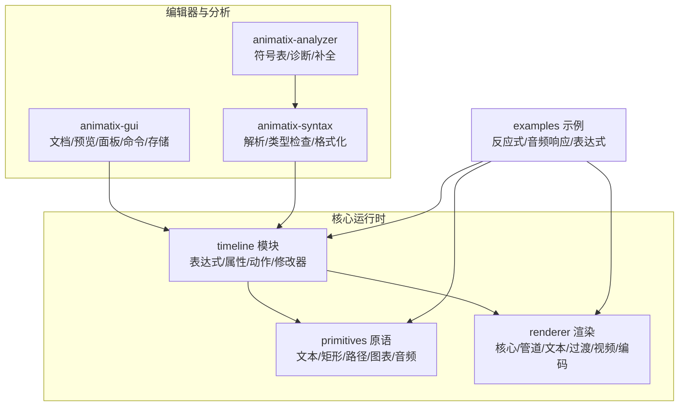
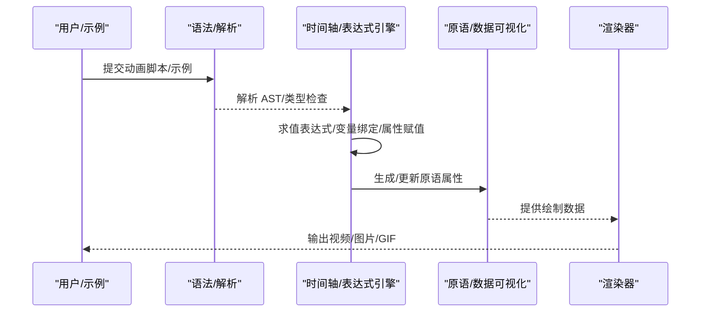
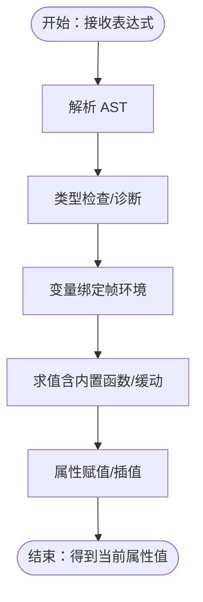
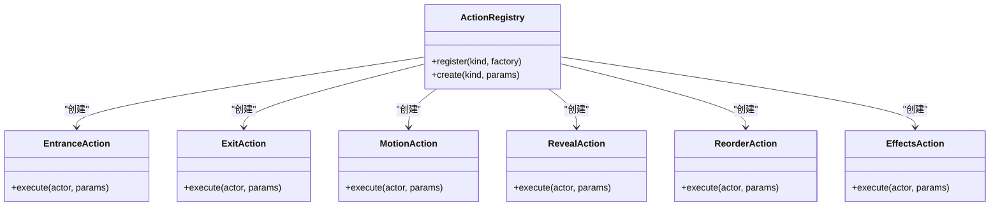
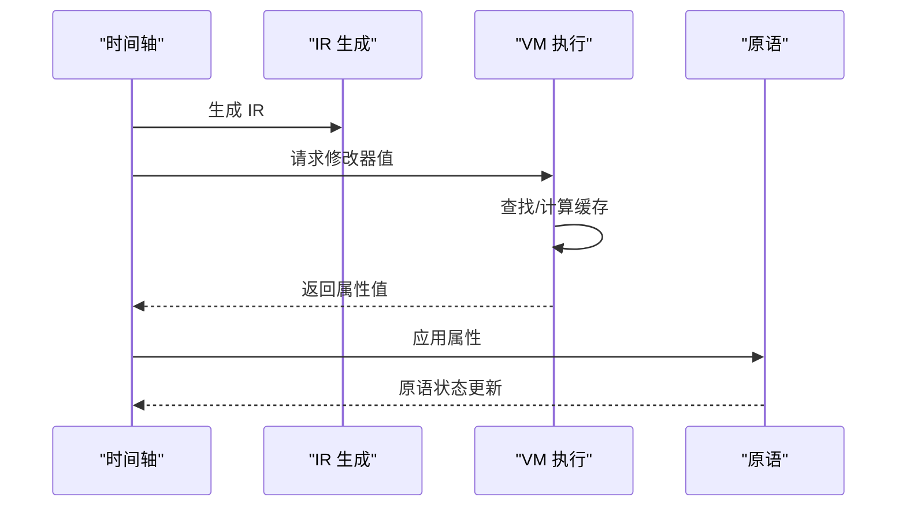
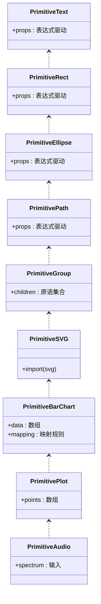
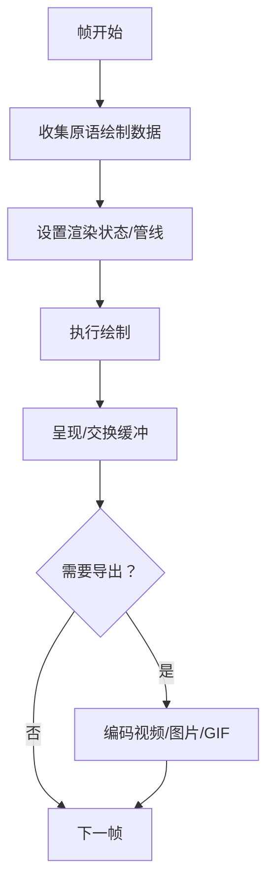

# 反应式动画

<cite>
**本文引用的文件**
- [crates/animatix/src/lib.rs](file://crates/animatix/src/lib.rs)
- [crates/animatix/src/main.rs](file://crates/animatix/src/main.rs)
- [crates/animatix/src/timeline/mod.rs](file://crates/animatix/src/timeline/mod.rs)
- [crates/animatix/src/timeline/property_engine.rs](file://crates/animatix/src/timeline/property_engine.rs)
- [crates/animatix/src/timeline/scene_eval.rs](file://crates/animatix/src/timeline/scene_eval.rs)
- [crates/animatix/src/timeline/value_parser.rs](file://crates/animatix/src/timeline/value_parser.rs)
- [crates/animatix/src/timeline/env.rs](file://crates/animatix/src/timeline/env.rs)
- [crates/animatix/src/timeline/assignments.rs](file://crates/animatix/src/timeline/assignments.rs)
- [crates/animatix/src/timeline/actions/effects.rs](file://crates/animatix/src/timeline/actions/effects.rs)
- [crates/animatix/src/timeline/actions/motion.rs](file://crates/animatix/src/timeline/actions/motion.rs)
- [crates/animatix/src/timeline/actions/entrance.rs](file://crates/animatix/src/timeline/actions/entrance.rs)
- [crates/animatix/src/timeline/actions/exit.rs](file://crates/animatix/src/timeline/actions/exit.rs)
- [crates/animatix/src/timeline/actions/reveal.rs](file://crates/animatix/src/timeline/actions/reveal.rs)
- [crates/animatix/src/timeline/actions/reorder.rs](file://crates/animatix/src/timeline/actions/reorder.rs)
- [crates/animatix/src/timeline/actions/registry.rs](file://crates/animatix/src/timeline/actions/registry.rs)
- [crates/animatix/src/timeline/declarations_text.rs](file://crates/animatix/src/timeline/declarations_text.rs)
- [crates/animatix/src/timeline/builtins.rs](file://crates/animatix/src/timeline/builtins.rs)
- [crates/animatix/src/timeline/filter.rs](file://crates/animatix/src/timeline/filter.rs)
- [crates/animatix/src/timeline/frame_env.rs](file://crates/animatix/src/timeline/frame_env.rs)
- [crates/animatix/src/timeline/layout.rs](file://crates/animatix/src/timeline/layout.rs)
- [crates/animatix/src/timeline/media.rs](file://crates/animatix/src/timeline/media.rs)
- [crates/animatix/src/timeline/primitive.rs](file://crates/animatix/src/timeline/primitive.rs)
- [crates/animatix/src/timeline/svg.rs](file://crates/animatix/src/timeline/svg.rs)
- [crates/animatix/src/timeline/plot.rs](file://crates/animatix/src/timeline/plot.rs)
- [crates/animatix/src/timeline/position.rs](file://crates/animatix/src/timeline/position.rs)
- [crates/animatix/src/timeline/utils.rs](file://crates/animatix/src/timeline/utils.rs)
- [crates/animatix/src/timeline/timing.rs](file://crates/animatix/src/timeline/timing.rs)
- [crates/animatix/src/timeline/track.rs](file://crates/animatix/src/timeline/track.rs)
- [crates/animatix/src/timeline/actor_kind.rs](file://crates/animatix/src/timeline/actor_kind.rs)
- [crates/animatix/src/timeline/assets.rs](file://crates/animatix/src/timeline/assets.rs)
- [crates/animatix/src/timeline/index.rs](file://crates/animatix/src/timeline/index.rs)
- [crates/animatix/src/timeline/kurbo_shapes.rs](file://crates/animatix/src/timeline/kurbo_shapes.rs)
- [crates/animatix/src/timeline/taffy_layout.rs](file://crates/animatix/src/timeline/taffy_layout.rs)
- [crates/animatix/src/timeline/svg_import.rs](file://crates/animatix/src/timeline/svg_import.rs)
- [crates/animatix/src/timeline/vello_path.rs](file://crates/animatix/src/timeline/vello_path.rs)
- [crates/animatix/src/timeline/path_progress.rs](file://crates/animatix/src/timeline/path_progress.rs)
- [crates/animatix/src/timeline/morph.rs](file://crates/animatix/src/timeline/morph.rs)
- [crates/animatix/src/timeline/colorscheme.rs](file://crates/animatix/src/timeline/colorscheme.rs)
- [crates/animatix/src/timeline/sequence.rs](file://crates/animatix/src/timeline/sequence.rs)
- [crates/animatix/src/timeline/tests.rs](file://crates/animatix/src/timeline/tests.rs)
- [crates/animatix/src/timeline/modifier_exec.rs](file://crates/animatix/src/timeline/modifier_exec.rs)
- [crates/animatix/src/timeline/modifier_runtime/vm.rs](file://crates/animatix/src/timeline/modifier_runtime/vm.rs)
- [crates/animatix/src/timeline/modifier_runtime/ir/mod.rs](file://crates/animatix/src/timeline/modifier_runtime/ir/mod.rs)
- [crates/animatix/src/timeline/modifier_runtime/ir/lower.rs](file://crates/animatix/src/timeline/modifier_runtime/ir/lower.rs)
- [crates/animatix/src/timeline/modifier_runtime/ir/eval.rs](file://crates/animatix/src/timeline/modifier_runtime/ir/eval.rs)
- [crates/animatix/src/timeline/modifier_runtime/ir/display.rs](file://crates/animatix/src/timeline/modifier_runtime/ir/display.rs)
- [crates/animatix/src/timeline/modifier_runtime/ir/types.rs](file://crates/animatix/src/timeline/modifier_runtime/ir/types.rs)
- [crates/animatix/src/renderer/core.rs](file://crates/animatix/src/renderer/core.rs)
- [crates/animatix/src/renderer/render_pipeline.rs](file://crates/animatix/src/renderer/render_pipeline.rs)
- [crates/animatix/src/renderer/text.rs](file://crates/animatix/src/renderer/text.rs)
- [crates/animatix/src/renderer/transition.rs](file://crates/animatix/src/renderer/transition.rs)
- [crates/animatix/src/renderer/types.rs](file://crates/animatix/src/renderer/types.rs)
- [crates/animatix/src/renderer/video.rs](file://crates/animatix/src/renderer/video.rs)
- [crates/animatix/src/renderer/offscreen.rs](file://crates/animatix/src/renderer/offscreen.rs)
- [crates/animatix/src/renderer/encode/image.rs](file://crates/animatix/src/renderer/encode/image.rs)
- [crates/animatix/src/renderer/encode/video.rs](file://crates/animatix/src/renderer/encode/video.rs)
- [crates/animatix/src/renderer/encode/gif.rs](file://crates/animatix/src/renderer/encode/gif.rs)
- [crates/animatix/src/renderer/error.rs](file://crates/animatix/src/renderer/error.rs)
- [crates/animatix/src/primitives/mod.rs](file://crates/animatix/src/primitives/mod.rs)
- [crates/animatix/src/primitives/text.rs](file://crates/animatix/src/primitives/text.rs)
- [crates/animatix/src/primitives/rect.rs](file://crates/animatix/src/primitives/rect.rs)
- [crates/animatix/src/primitives/ellipse.rs](file://crates/animatix/src/primitives/ellipse.rs)
- [crates/animatix/src/primitives/path.rs](file://crates/animatix/src/primitives/path.rs)
- [crates/animatix/src/primitives/group.rs](file://crates/animatix/src/primitives/group.rs)
- [crates/animatix/src/primitives/svg.rs](file://crates/animatix/src/primitives/svg.rs)
- [crates/animatix/src/primitives/bar_chart.rs](file://crates/animatix/src/primitives/bar_chart.rs)
- [crates/animatix/src/primitives/plot.rs](file://crates/animatix/src/primitives/plot.rs)
- [crates/animatix/src/primitives/audio.rs](file://crates/animatix/src/primitives/audio.rs)
- [examples/06_reactive.amx](file://examples/06_reactive.amx)
- [examples/17_audio_reactive.amx](file://examples/17_audio_reactive.amx)
- [examples/22_expressions.amx](file://examples/22_expressions.amx)
- [examples/README.md](file://examples/README.md)
- [docs/spec.md](file://docs/spec.md)
- [docs/architecture.md](file://docs/architecture.md)
- [docs/properties.md](file://docs/properties.md)
- [docs/primitives.md](file://docs/primitives.md)
- [docs/design/runtime_plot_params.md](file://docs/design/runtime_plot_params.md)
- [crates/animatix-syntax/src/parser/expr.rs](file://crates/animatix-syntax/src/parser/expr.rs)
- [crates/animatix-syntax/src/parser/stmt.rs](file://crates/animatix-syntax/src/parser/stmt.rs)
- [crates/animatix-syntax/src/typecheck.rs](file://crates/animatix-syntax/src/typecheck.rs)
- [crates/animatix-syntax/src/easing.rs](file://crates/animatix-syntax/src/easing.rs)
- [crates/animatix-syntax/src/module/expand.rs](file://crates/animatix-syntax/src/module/expand.rs)
- [crates/animatix-syntax/src/module/discovery.rs](file://crates/animatix-syntax/src/module/discovery.rs)
- [crates/animatix-syntax/src/module/inline_actions.rs](file://crates/animatix-syntax/src/module/inline_actions.rs)
- [crates/animatix-syntax/src/module/rewrite.rs](file://crates/animatix-syntax/src/module/rewrite.rs)
- [crates/animatix-syntax/src/format_core.rs](file://crates/animatix-syntax/src/format_core.rs)
- [crates/animatix-syntax/src/formatter.rs](file://crates/animatix-syntax/src/formatter.rs)
- [crates/animatix-syntax/src/to_source.rs](file://crates/animatix-syntax/src/to_source.rs)
- [crates/animatix-syntax/src/walk.rs](file://crates/animatix-syntax/src/walk.rs)
- [crates/animatix-syntax/src/diagnostics.rs](file://crates/animatix-syntax/src/diagnostics.rs)
- [crates/animatix-syntax/src/icon_glyphs.rs](file://crates/animatix-syntax/src/icon_glyphs.rs)
- [crates/animatix-syntax/src/lib.rs](file://crates/animatix-syntax/src/lib.rs)
- [crates/animatix-analyzer/src/symbol_table.rs](file://crates/animatix-analyzer/src/symbol_table.rs)
- [crates/animatix-analyzer/src/types.rs](file://crates/animatix-analyzer/src/types.rs)
- [crates/animatix-analyzer/src/completer.rs](file://crates/animatix-analyzer/src/completer.rs)
- [crates/animatix-analyzer/src/hover.rs](file://crates/animatix-analyzer/src/hover.rs)
- [crates/animatix-analyzer/src/references.rs](file://crates/animatix-analyzer/src/references.rs)
- [crates/animatix-analyzer/src/document_symbol.rs](file://crates/animatix-analyzer/src/document_symbol.rs)
- [crates/animatix-analyzer/src/workspace.rs](file://crates/animatix-analyzer/src/workspace.rs)
- [crates/animatix-analyzer/src/definition.rs](file://crates/animatix-analyzer/src/definition.rs)
- [crates/animatix-analyzer/src/diagnostics.rs](file://crates/animatix-analyzer/src/diagnostics.rs)
- [crates/animatix-analyzer/src/lib.rs](file://crates/animatix-analyzer/src/lib.rs)
- [crates/animatix-gui/src/app/document_controller.rs](file://crates/animatix-gui/src/app/document_controller.rs)
- [crates/animatix-gui/src/app/preview/context.rs](file://crates/animatix-gui/src/app/preview/context.rs)
- [crates/animatix-gui/src/app/preview/drag_handler.rs](file://crates/animatix-gui/src/app/preview/drag_handler.rs)
- [crates/animatix-gui/src/app/preview/grid.rs](file://crates/animatix-gui/src/app/preview/grid.rs)
- [crates/animatix-gui/src/app/preview/overlay.rs](file://crates/animatix-gui/src/app/preview/overlay.rs)
- [crates/animatix-gui/src/app/preview/performance.rs](file://crates/animatix-gui/src/app/preview/performance.rs)
- [crates/animatix-gui/src/app/preview/property_popup.rs](file://crates/animatix-gui/src/app/preview/property_popup.rs)
- [crates/animatix-gui/src/app/preview/selection.rs](file://crates/animatix-gui/src/app/preview/selection.rs)
- [crates/animatix-gui/src/app/preview/time_lens.rs](file://crates/animatix-gui/src/app/preview/time_lens.rs)
- [crates/animatix-gui/src/app/panels/timeline_panel.rs](file://crates/animatix-gui/src/app/panels/timeline_panel.rs)
- [crates/animatix-gui/src/app/panels/timeline_model.rs](file://crates/animatix-gui/src/app/panels/timeline_model.rs)
- [crates/animatix-gui/src/app/panels/editor_model.rs](file://crates/animatix-gui/src/app/panels/editor_model.rs)
- [crates/animatix-gui/src/app/panels/preview_model.rs](file://crates/animatix-gui/src/app/panels/preview_model.rs)
- [crates/animatix-gui/src/app/panels/sidebar_model.rs](file://crates/animatix-gui/src/app/panels/sidebar_model.rs)
- [crates/animatix-gui/src/app/panels/behavior.rs](file://crates/animatix-gui/src/app/panels/behavior.rs)
- [crates/animatix-gui/src/app/panels/editor.rs](file://crates/animatix-gui/src/app/panels/editor.rs)
- [crates/animatix-gui/src/app/panels/preview_panel.rs](file://crates/animatix-gui/src/app/panels/preview_panel.rs)
- [crates/animatix-gui/src/app/panels/sidebar.rs](file://crates/animatix-gui/src/app/panels/sidebar.rs)
- [crates/animatix-gui/src/app/handlers/playback.rs](file://crates/animatix-gui/src/app/handlers/playback.rs)
- [crates/animatix-gui/src/app/handlers/property.rs](file://crates/animatix-gui/src/app/handlers/property.rs)
- [crates/animatix-gui/src/app/handlers/scene.rs](file://crates/animatix-gui/src/app/handlers/scene.rs)
- [crates/animatix-gui/src/app/handlers/ui.rs](file://crates/animatix-gui/src/app/handlers/ui.rs)
- [crates/animatix-gui/src/app/handlers/keyframe.rs](file://crates/animatix-gui/src/app/handlers/keyframe.rs)
- [crates/animatix-gui/src/app/handlers/actor.rs](file://crates/animatix-gui/src/app/handlers/actor.rs)
- [crates/animatix-gui/src/app/services/renderer.rs](file://crates/animatix-gui/src/app/services/renderer.rs)
- [crates/animatix-gui/src/app/runtime.rs](file://crates/animatix-gui/src/app/runtime.rs)
- [crates/animatix-gui/src/app/persistence.rs](file://crates/animatix-gui/src/app/persistence.rs)
- [crates/animatix-gui/src/app/stores/document_store.rs](file://crates/animatix-gui/src/app/stores/document_store.rs)
- [crates/animatix-gui/src/app/stores/preview_store.rs](file://crates/animatix-gui/src/app/stores/preview_store.rs)
- [crates/animatix-gui/src/app/stores/source_store.rs](file://crates/animatix-gui/src/app/stores/source_store.rs)
- [crates/animatix-gui/src/app/stores/history_store.rs](file://crates/animatix-gui/src/app/stores/history_store.rs)
- [crates/animatix-gui/src/app/stores/ui_store.rs](file://crates/animatix-gui/src/app/stores/ui_store.rs)
- [crates/animatix-gui/src/app/stores/export_store.rs](file://crates/animatix-gui/src/app/stores/export_store.rs)
- [crates/animatix-gui/src/app/stores/workspace_store.rs](file://crates/animatix-gui/src/app/stores/workspace_store.rs)
- [crates/animatix-gui/src/app/command_bus.rs](file://crates/animatix-gui/src/app/command_bus.rs)
- [crates/animatix-gui/src/app/command_handlers.rs](file://crates/animatix-gui/src/app/command_handlers.rs)
- [crates/animatix-gui/src/app/commands.rs](file://crates/animatix-gui/src/app/commands.rs)
- [crates/animatix-gui/src/app/utils/labels.rs](file://crates/animatix-gui/src/app/utils/labels.rs)
- [crates/animatix-gui/src/app/utils/text.rs](file://crates/animatix-gui/src/app/utils/text.rs)
- [crates/animatix-gui/src/app/shell/toolbar.rs](file://crates/animatix-gui/src/app/shell/toolbar.rs)
- [crates/animatix-gui/src/app/shell/settings.rs](file://crates/animatix-gui/src/app/shell/settings.rs)
- [crates/animatix-gui/src/app/shell/export_dialog.rs](file://crates/animatix-gui/src/app/shell/export_dialog.rs)
- [crates/animatix-gui/src/app/shell/find_replace.rs](file://crates/animatix-gui/src/app/shell/find_replace.rs)
- [crates/animatix-gui/src/app/shell/insertion_palette.rs](file://crates/animatix-gui/src/app/shell/insertion_palette.rs)
- [crates/animatix-gui/src/app/shell/command_palette.rs](file://crates/animatix-gui/src/app/shell/command_palette.rs)
- [crates/animatix-gui/src/app/shell/shortcut_cheat_sheet.rs](file://crates/animatix-gui/src/app/shell/shortcut_cheat_sheet.rs)
- [crates/animatix-gui/src/app/panel/inspector/graph_editor.rs](file://crates/animatix-gui/src/app/panel/inspector/graph_editor.rs)
- [crates/animatix-gui/src/app/panel/inspector/keyframe_table.rs](file://crates/animatix-gui/src/app/panel/inspector/keyframe_table.rs)
- [crates/animatix-gui/src/app/panel/inspector/model.rs](file://crates/animatix-gui/src/app/panel/inspector/model.rs)
- [crates/animatix-gui/src/app/panel/inspector/property_groups.rs](file://crates/animatix-gui/src/app/panel/inspector/property_groups.rs)
- [crates/animatix-gui/src/app/panel/inspector/spreadsheet.rs](file://crates/animatix-gui/src/app/panel/inspector/spreadsheet.rs)
- [crates/animatix-gui/src/app/panel/inspector/mod.rs](file://crates/animatix-gui/src/app/panel/inspector/mod.rs)
- [crates/animatix-gui/src/app/panel/inspector/graph_editor.rs](file://crates/animatix-gui/src/app/panel/inspector/graph_editor.rs)
- [crates/animatix-gui/src/app/panel/inspector/keyframe_table.rs](file://crates/animatix-gui/src/app/panel/inspector/keyframe_table.rs)
- [crates/animatix-gui/src/app/panel/inspector/model.rs](file://crates/animatix-gui/src/app/panel/inspector/model.rs)
- [crates/animatix-gui/src/app/panel/inspector/property_groups.rs](file://crates/animatix-gui/src/app/panel/inspector/property_groups.rs)
- [crates/animatix-gui/src/app/panel/inspector/spreadsheet.rs](file://crates/animatix-gui/src/app/panel/inspector/spreadsheet.rs)
- [crates/animatix-gui/src/app/panel/inspector/mod.rs](file://crates/animatix-gui/src/app/panel/inspector/mod.rs)
</cite>

## 目录
1. [引言](#引言)
2. [项目结构](#项目结构)
3. [核心组件](#核心组件)
4. [架构总览](#架构总览)
5. [详细组件分析](#详细组件分析)
6. [依赖关系分析](#依赖关系分析)
7. [性能考量](#性能考量)
8. [故障排查指南](#故障排查指南)
9. [结论](#结论)
10. [附录](#附录)

## 引言
本指南聚焦于 Animatix 的“反应式动画”能力：如何以数据为驱动、以表达式为语言，构建能自动响应外部条件（如用户输入、音频频谱）或内部状态变化（如时间推进、属性变更）的动态动画。我们将从系统架构、表达式与变量绑定、动作与修改器执行、渲染管线与导出等方面，系统阐述反应式动画的设计与实践，并通过示例场景路径指引你快速上手。

## 项目结构
Animatix 采用多 crate 组织，核心运行时位于 animatix crate；GUI 编辑器位于 animatix-gui；语法与类型检查位于 animatix-syntax；分析器位于 animatix-analyzer。反应式动画的关键实现集中在 timeline 子系统（表达式求值、属性引擎、动作与修改器执行）、primitives（基础图形与数据可视化的原语）以及 renderer（渲染与导出）。

图示来源
- [crates/animatix/src/timeline/mod.rs](file://crates/animatix/src/timeline/mod.rs)
- [crates/animatix/src/primitives/mod.rs](file://crates/animatix/src/primitives/mod.rs)
- [crates/animatix/src/renderer/core.rs](file://crates/animatix/src/renderer/core.rs)
- [crates/animatix-gui/src/app/document_controller.rs](file://crates/animatix-gui/src/app/document_controller.rs)
- [crates/animatix-syntax/src/lib.rs](file://crates/animatix-syntax/src/lib.rs)
- [crates/animatix-analyzer/src/lib.rs](file://crates/animatix-analyzer/src/lib.rs)
- [examples/README.md](file://examples/README.md)

章节来源
- [crates/animatix/src/lib.rs](file://crates/animatix/src/lib.rs)
- [crates/animatix/src/main.rs](file://crates/animatix/src/main.rs)
- [examples/README.md](file://examples/README.md)

## 核心组件
- 表达式与属性引擎：负责解析与求值表达式、维护变量绑定、执行属性赋值与插值，是反应式动画的“大脑”。
- 动作系统：封装进入、退出、运动、揭示、重排等可组合的行为单元，支持以表达式驱动参数。
- 修改器执行：将高级描述编译为中间表示（IR），再由 VM 执行，实现高效、可缓存的逐帧计算。
- 原语与数据可视化：提供文本、几何、SVG、条形图、折线图、音频等原语，支持数据驱动的属性映射。
- 渲染与导出：统一的渲染管线，支持视频、图片序列、GIF 导出，满足最终输出需求。

章节来源
- [crates/animatix/src/timeline/property_engine.rs](file://crates/animatix/src/timeline/property_engine.rs)
- [crates/animatix/src/timeline/actions/registry.rs](file://crates/animatix/src/timeline/actions/registry.rs)
- [crates/animatix/src/timeline/modifier_exec.rs](file://crates/animatix/src/timeline/modifier_exec.rs)
- [crates/animatix/src/timeline/modifier_runtime/vm.rs](file://crates/animatix/src/timeline/modifier_runtime/vm.rs)
- [crates/animatix/src/primitives/mod.rs](file://crates/animatix/src/primitives/mod.rs)
- [crates/animatix/src/renderer/core.rs](file://crates/animatix/src/renderer/core.rs)

## 架构总览
下图展示了从“源码/示例”到“表达式求值/属性更新”，再到“原语生成与渲染”的端到端流程。GUI 与语法分析器为创作与验证提供支撑。

图示来源
- [crates/animatix/src/timeline/mod.rs](file://crates/animatix/src/timeline/mod.rs)
- [crates/animatix/src/timeline/property_engine.rs](file://crates/animatix/src/timeline/property_engine.rs)
- [crates/animatix/src/primitives/mod.rs](file://crates/animatix/src/primitives/mod.rs)
- [crates/animatix/src/renderer/core.rs](file://crates/animatix/src/renderer/core.rs)
- [crates/animatix-syntax/src/lib.rs](file://crates/animatix-syntax/src/lib.rs)

## 详细组件分析

### 表达式系统与变量绑定
- 表达式解析与类型检查：语法层提供表达式与语句解析、类型检查、格式化与诊断，确保表达式在编译期具备良好约束。
- 变量绑定与作用域：在帧环境（frame_env）中维护当前作用域的变量映射，支持局部与全局变量、内置常量与函数。
- 属性赋值与插值：属性引擎根据时间与轨迹计算当前值，结合插值策略（线性/缓动）生成平滑过渡。
- 赋值与声明：支持属性赋值、声明合并与文本化，便于在脚本中组织复杂表达式。

图示来源
- [crates/animatix/src/timeline/value_parser.rs](file://crates/animatix/src/timeline/value_parser.rs)
- [crates/animatix/src/timeline/env.rs](file://crates/animatix/src/timeline/env.rs)
- [crates/animatix/src/timeline/assignments.rs](file://crates/animatix/src/timeline/assignments.rs)
- [crates/animatix/src/timeline/builtins.rs](file://crates/animatix/src/timeline/builtins.rs)
- [crates/animatix-syntax/src/parser/expr.rs](file://crates/animatix-syntax/src/parser/expr.rs)
- [crates/animatix-syntax/src/typecheck.rs](file://crates/animatix-syntax/src/typecheck.rs)

章节来源
- [crates/animatix/src/timeline/value_parser.rs](file://crates/animatix/src/timeline/value_parser.rs)
- [crates/animatix/src/timeline/env.rs](file://crates/animatix/src/timeline/env.rs)
- [crates/animatix/src/timeline/assignments.rs](file://crates/animatix/src/timeline/assignments.rs)
- [crates/animatix/src/timeline/builtins.rs](file://crates/animatix/src/timeline/builtins.rs)
- [crates/animatix/src/timeline/declarations_text.rs](file://crates/animatix/src/timeline/declarations_text.rs)
- [crates/animatix-syntax/src/parser/expr.rs](file://crates/animatix-syntax/src/parser/expr.rs)
- [crates/animatix-syntax/src/typecheck.rs](file://crates/animatix-syntax/src/typecheck.rs)

### 动作系统与反应式行为
- 动作注册与组合：动作注册表集中管理动作类型，动作可按顺序、并行或条件组合，形成复杂的反应式序列。
- 进入/退出/运动/揭示/重排：这些动作分别对应生命周期事件与空间变换，均可通过表达式参数化，实现对输入的即时响应。
- 效果动作：支持滤镜、遮罩等视觉效果，配合表达式实现动态强度与参数变化。

图示来源
- [crates/animatix/src/timeline/actions/registry.rs](file://crates/animatix/src/timeline/actions/registry.rs)
- [crates/animatix/src/timeline/actions/entrance.rs](file://crates/animatix/src/timeline/actions/entrance.rs)
- [crates/animatix/src/timeline/actions/exit.rs](file://crates/animatix/src/timeline/actions/exit.rs)
- [crates/animatix/src/timeline/actions/motion.rs](file://crates/animatix/src/timeline/actions/motion.rs)
- [crates/animatix/src/timeline/actions/reveal.rs](file://crates/animatix/src/timeline/actions/reveal.rs)
- [crates/animatix/src/timeline/actions/reorder.rs](file://crates/animatix/src/timeline/actions/reorder.rs)
- [crates/animatix/src/timeline/actions/effects.rs](file://crates/animatix/src/timeline/actions/effects.rs)

章节来源
- [crates/animatix/src/timeline/actions/registry.rs](file://crates/animatix/src/timeline/actions/registry.rs)
- [crates/animatix/src/timeline/actions/entrance.rs](file://crates/animatix/src/timeline/actions/entrance.rs)
- [crates/animatix/src/timeline/actions/exit.rs](file://crates/animatix/src/timeline/actions/exit.rs)
- [crates/animatix/src/timeline/actions/motion.rs](file://crates/animatix/src/timeline/actions/motion.rs)
- [crates/animatix/src/timeline/actions/reveal.rs](file://crates/animatix/src/timeline/actions/reveal.rs)
- [crates/animatix/src/timeline/actions/reorder.rs](file://crates/animatix/src/timeline/actions/reorder.rs)
- [crates/animatix/src/timeline/actions/effects.rs](file://crates/animatix/src/timeline/actions/effects.rs)

### 修改器执行与虚拟机
- IR 与 Lower：将高层描述转换为中间表示，便于优化与执行。
- VM 执行：在帧级调度中调用 VM，按需求值修改器，避免重复计算，提升性能。
- 缓存与增量：通过索引与缓存机制减少每帧开销，保证高帧率下的流畅度。

图示来源
- [crates/animatix/src/timeline/modifier_exec.rs](file://crates/animatix/src/timeline/modifier_exec.rs)
- [crates/animatix/src/timeline/modifier_runtime/vm.rs](file://crates/animatix/src/timeline/modifier_runtime/vm.rs)
- [crates/animatix/src/timeline/modifier_runtime/ir/mod.rs](file://crates/animatix/src/timeline/modifier_runtime/ir/mod.rs)
- [crates/animatix/src/timeline/modifier_runtime/ir/lower.rs](file://crates/animatix/src/timeline/modifier_runtime/ir/lower.rs)
- [crates/animatix/src/timeline/modifier_runtime/ir/eval.rs](file://crates/animatix/src/timeline/modifier_runtime/ir/eval.rs)
- [crates/animatix/src/timeline/modifier_runtime/ir/display.rs](file://crates/animatix/src/timeline/modifier_runtime/ir/display.rs)
- [crates/animatix/src/timeline/modifier_runtime/ir/types.rs](file://crates/animatix/src/timeline/modifier_runtime/ir/types.rs)

章节来源
- [crates/animatix/src/timeline/modifier_exec.rs](file://crates/animatix/src/timeline/modifier_exec.rs)
- [crates/animatix/src/timeline/modifier_runtime/vm.rs](file://crates/animatix/src/timeline/modifier_runtime/vm.rs)
- [crates/animatix/src/timeline/modifier_runtime/ir/mod.rs](file://crates/animatix/src/timeline/modifier_runtime/ir/mod.rs)
- [crates/animatix/src/timeline/modifier_runtime/ir/lower.rs](file://crates/animatix/src/timeline/modifier_runtime/ir/lower.rs)
- [crates/animatix/src/timeline/modifier_runtime/ir/eval.rs](file://crates/animatix/src/timeline/modifier_runtime/ir/eval.rs)
- [crates/animatix/src/timeline/modifier_runtime/ir/display.rs](file://crates/animatix/src/timeline/modifier_runtime/ir/display.rs)
- [crates/animatix/src/timeline/modifier_runtime/ir/types.rs](file://crates/animatix/src/timeline/modifier_runtime/ir/types.rs)

### 数据驱动的原语与可视化
- 文本/几何/路径/组：提供基础形状与文本原语，支持通过表达式驱动位置、尺寸、颜色、旋转等属性。
- SVG/矢量：导入与渲染 SVG，支持路径进度、描边动画等。
- 图表：条形图、折线图等，支持数据数组到可视元素的映射，适合反应式数据流。
- 音频：音频原语支持频谱/波形输入，天然适配“音频响应式动画”。

图示来源
- [crates/animatix/src/primitives/text.rs](file://crates/animatix/src/primitives/text.rs)
- [crates/animatix/src/primitives/rect.rs](file://crates/animatix/src/primitives/rect.rs)
- [crates/animatix/src/primitives/ellipse.rs](file://crates/animatix/src/primitives/ellipse.rs)
- [crates/animatix/src/primitives/path.rs](file://crates/animatix/src/primitives/path.rs)
- [crates/animatix/src/primitives/group.rs](file://crates/animatix/src/primitives/group.rs)
- [crates/animatix/src/primitives/svg.rs](file://crates/animatix/src/primitives/svg.rs)
- [crates/animatix/src/primitives/bar_chart.rs](file://crates/animatix/src/primitives/bar_chart.rs)
- [crates/animatix/src/primitives/plot.rs](file://crates/animatix/src/primitives/plot.rs)
- [crates/animatix/src/primitives/audio.rs](file://crates/animatix/src/primitives/audio.rs)

章节来源
- [crates/animatix/src/primitives/mod.rs](file://crates/animatix/src/primitives/mod.rs)
- [crates/animatix/src/primitives/text.rs](file://crates/animatix/src/primitives/text.rs)
- [crates/animatix/src/primitives/rect.rs](file://crates/animatix/src/primitives/rect.rs)
- [crates/animatix/src/primitives/ellipse.rs](file://crates/animatix/src/primitives/ellipse.rs)
- [crates/animatix/src/primitives/path.rs](file://crates/animatix/src/primitives/path.rs)
- [crates/animatix/src/primitives/group.rs](file://crates/animatix/src/primitives/group.rs)
- [crates/animatix/src/primitives/svg.rs](file://crates/animatix/src/primitives/svg.rs)
- [crates/animatix/src/primitives/bar_chart.rs](file://crates/animatix/src/primitives/bar_chart.rs)
- [crates/animatix/src/primitives/plot.rs](file://crates/animatix/src/primitives/plot.rs)
- [crates/animatix/src/primitives/audio.rs](file://crates/animatix/src/primitives/audio.rs)

### 渲染管线与导出
- 渲染核心：统一的渲染上下文与资源管理，支持文本、路径、图像与过渡效果。
- 离屏渲染与全屏贴 blit：支持离屏缓冲与多通道合成，便于后处理与导出。
- 视频/图片/GIF 导出：提供编码器，将逐帧结果打包为常见媒体格式。

图示来源
- [crates/animatix/src/renderer/core.rs](file://crates/animatix/src/renderer/core.rs)
- [crates/animatix/src/renderer/render_pipeline.rs](file://crates/animatix/src/renderer/render_pipeline.rs)
- [crates/animatix/src/renderer/text.rs](file://crates/animatix/src/renderer/text.rs)
- [crates/animatix/src/renderer/transition.rs](file://crates/animatix/src/renderer/transition.rs)
- [crates/animatix/src/renderer/video.rs](file://crates/animatix/src/renderer/video.rs)
- [crates/animatix/src/renderer/offscreen.rs](file://crates/animatix/src/renderer/offscreen.rs)
- [crates/animatix/src/renderer/encode/video.rs](file://crates/animatix/src/renderer/encode/video.rs)
- [crates/animatix/src/renderer/encode/image.rs](file://crates/animatix/src/renderer/encode/image.rs)
- [crates/animatix/src/renderer/encode/gif.rs](file://crates/animatix/src/renderer/encode/gif.rs)

章节来源
- [crates/animatix/src/renderer/core.rs](file://crates/animatix/src/renderer/core.rs)
- [crates/animatix/src/renderer/render_pipeline.rs](file://crates/animatix/src/renderer/render_pipeline.rs)
- [crates/animatix/src/renderer/text.rs](file://crates/animatix/src/renderer/text.rs)
- [crates/animatix/src/renderer/transition.rs](file://crates/animatix/src/renderer/transition.rs)
- [crates/animatix/src/renderer/video.rs](file://crates/animatix/src/renderer/video.rs)
- [crates/animatix/src/renderer/offscreen.rs](file://crates/animatix/src/renderer/offscreen.rs)
- [crates/animatix/src/renderer/encode/video.rs](file://crates/animatix/src/renderer/encode/video.rs)
- [crates/animatix/src/renderer/encode/image.rs](file://crates/animatix/src/renderer/encode/image.rs)
- [crates/animatix/src/renderer/encode/gif.rs](file://crates/animatix/src/renderer/encode/gif.rs)

## 依赖关系分析
- 语法与分析：语法层为时间轴与原语提供类型安全的输入；分析器提供符号解析与诊断，保障表达式正确性。
- 时间轴与原语：时间轴模块依赖语法层提供的解析与类型信息，同时向原语模块提供属性值。
- 渲染与导出：渲染器独立于时间轴与原语，通过统一接口消费绘制数据，支持多种导出格式。

图示来源
- [crates/animatix-syntax/src/lib.rs](file://crates/animatix-syntax/src/lib.rs)
- [crates/animatix-analyzer/src/lib.rs](file://crates/animatix-analyzer/src/lib.rs)
- [crates/animatix/src/timeline/mod.rs](file://crates/animatix/src/timeline/mod.rs)
- [crates/animatix/src/primitives/mod.rs](file://crates/animatix/src/primitives/mod.rs)
- [crates/animatix/src/renderer/core.rs](file://crates/animatix/src/renderer/core.rs)

章节来源
- [crates/animatix-syntax/src/lib.rs](file://crates/animatix-syntax/src/lib.rs)
- [crates/animatix-analyzer/src/lib.rs](file://crates/animatix-analyzer/src/lib.rs)
- [crates/animatix/src/timeline/mod.rs](file://crates/animatix/src/timeline/mod.rs)
- [crates/animatix/src/primitives/mod.rs](file://crates/animatix/src/primitives/mod.rs)
- [crates/animatix/src/renderer/core.rs](file://crates/animatix/src/renderer/core.rs)

## 性能考量
- 修改器缓存与增量：通过 IR 与 VM 的缓存机制，避免重复计算，降低每帧 CPU 开销。
- 插值与轨迹：合理选择缓动与轨迹，平衡视觉效果与性能。
- 渲染批处理：合并绘制调用、减少状态切换，提高 GPU 利用率。
- 导出优化：在导出阶段进行必要的降采样与压缩，平衡质量与体积。

## 故障排查指南
- 表达式错误：检查语法与类型，确认变量名拼写与作用域；查看诊断信息定位问题。
- 动作冲突：核对动作顺序与参数，避免同一属性被多个动作覆盖。
- 原语异常：确认原语属性是否越界（如负尺寸、非法颜色），或数据映射是否为空。
- 渲染问题：检查渲染状态设置与资源绑定，确认导出配置正确。

章节来源
- [crates/animatix-syntax/src/diagnostics.rs](file://crates/animatix-syntax/src/diagnostics.rs)
- [crates/animatix-analyzer/src/diagnostics.rs](file://crates/animatix-analyzer/src/diagnostics.rs)
- [crates/animatix/src/renderer/error.rs](file://crates/animatix/src/renderer/error.rs)

## 结论
Animatix 的反应式动画以“表达式 + 动作 + 修改器 + 原语 + 渲染”为核心链路，既能在创作期通过 GUI 与语法分析获得良好体验，又能在运行期通过 IR+VM 实现高性能的逐帧计算。通过数据驱动与表达式系统，你可以轻松实现鼠标悬停、键盘响应、音频响应、数据可视化等多样化的交互动画。

## 附录

### 实战示例与场景路径
- 反应式动画示例：[examples/06_reactive.amx](file://examples/06_reactive.amx)
- 音频响应动画示例：[examples/17_audio_reactive.amx](file://examples/17_audio_reactive.amx)
- 表达式系统示例：[examples/22_expressions.amx](file://examples/22_expressions.amx)
- 示例说明：[examples/README.md](file://examples/README.md)

章节来源
- [examples/06_reactive.amx](file://examples/06_reactive.amx)
- [examples/17_audio_reactive.amx](file://examples/17_audio_reactive.amx)
- [examples/22_expressions.amx](file://examples/22_expressions.amx)
- [examples/README.md](file://examples/README.md)

### 设计与规范参考
- 系统设计概览：[docs/architecture.md](file://docs/architecture.md)
- 语法与表达式规范：[docs/spec.md](file://docs/spec.md)
- 属性与原语说明：[docs/properties.md](file://docs/properties.md), [docs/primitives.md](file://docs/primitives.md)
- 运行时绘图参数设计：[docs/design/runtime_plot_params.md](file://docs/design/runtime_plot_params.md)

章节来源
- [docs/architecture.md](file://docs/architecture.md)
- [docs/spec.md](file://docs/spec.md)
- [docs/properties.md](file://docs/properties.md)
- [docs/primitives.md](file://docs/primitives.md)
- [docs/design/runtime_plot_params.md](file://docs/design/runtime_plot_params.md)