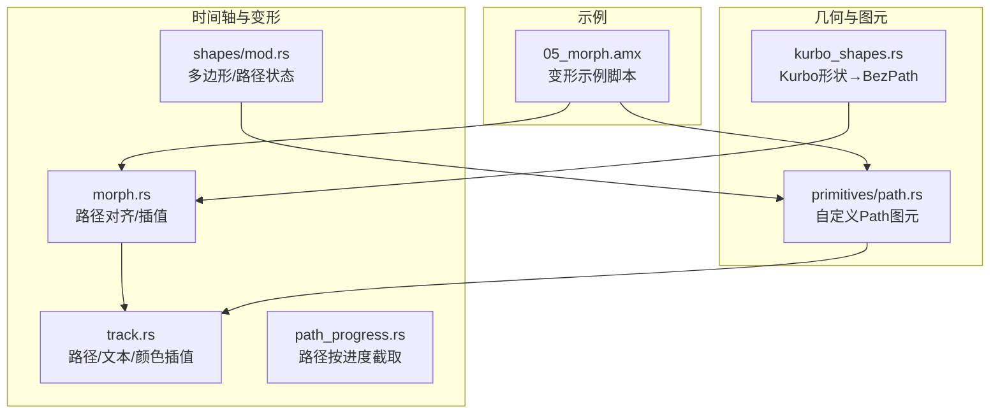
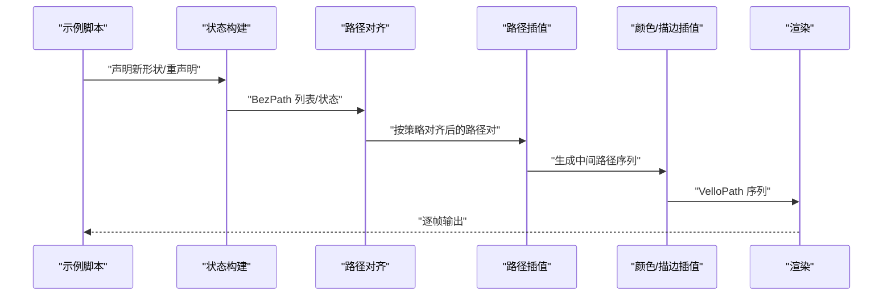
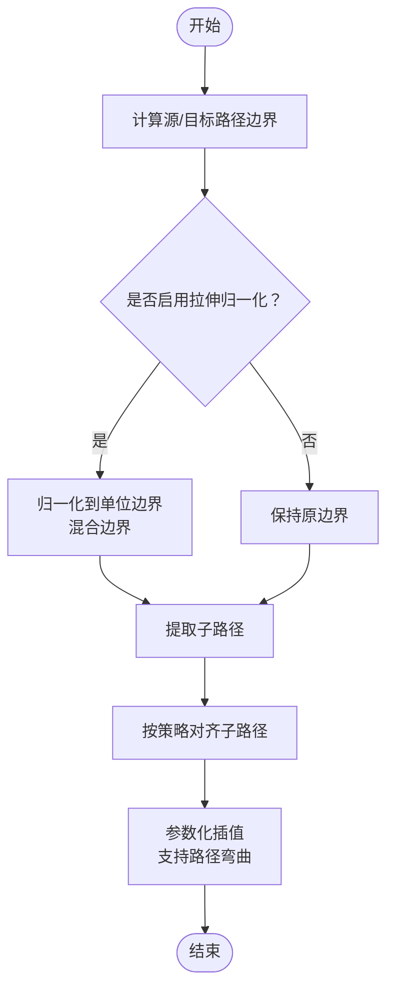
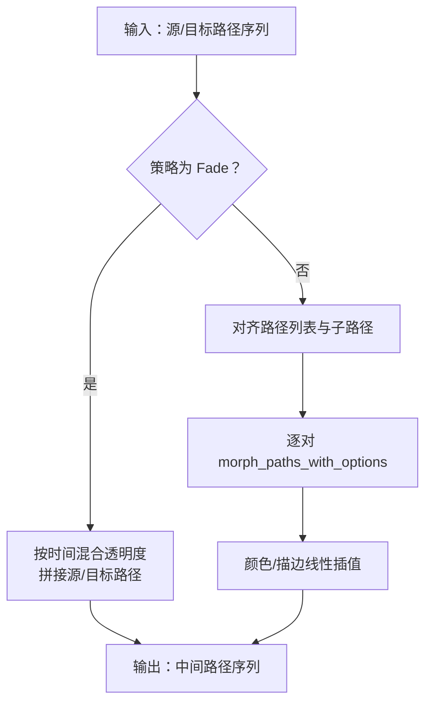
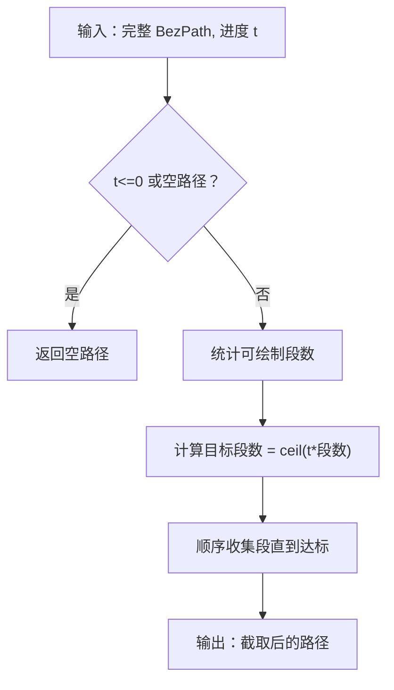
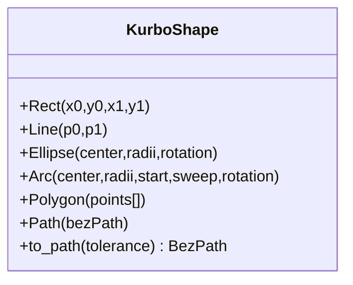
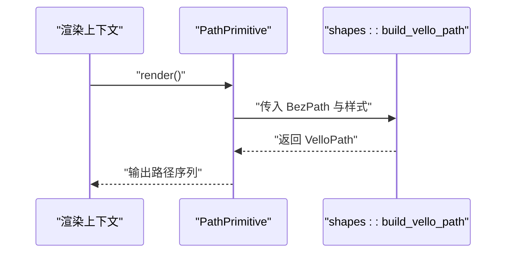
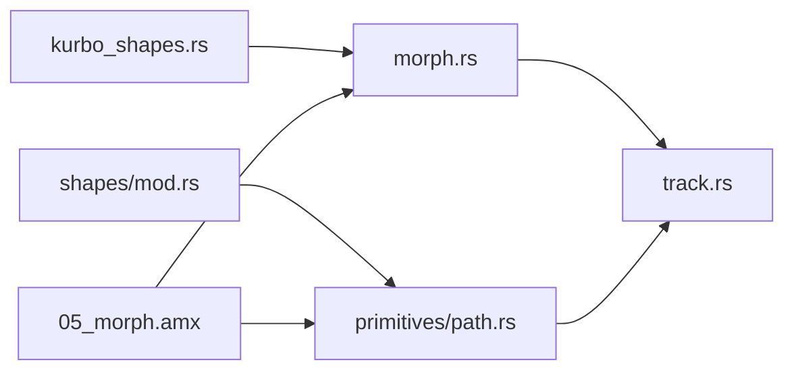

# 变形动画

<cite>
**本文引用的文件**
- [morph.rs](file://crates/animatix/src/timeline/morph.rs)
- [track.rs](file://crates/animatix/src/timeline/track.rs)
- [path_progress.rs](file://crates/animatix/src/timeline/path_progress.rs)
- [kurbo_shapes.rs](file://crates/animatix/src/timeline/kurbo_shapes.rs)
- [mod.rs（primitives/path）](file://crates/animatix/src/primitives/path.rs)
- [mod.rs（shapes）](file://crates/animatix/src/timeline/shapes/mod.rs)
- [05_morph.amx](file://examples/05_morph.amx)
</cite>

## 目录
1. [引言](#引言)
2. [项目结构](#项目结构)
3. [核心组件](#核心组件)
4. [架构总览](#架构总览)
5. [详细组件分析](#详细组件分析)
6. [依赖分析](#依赖分析)
7. [性能考量](#性能考量)
8. [故障排查指南](#故障排查指南)
9. [结论](#结论)
10. [附录](#附录)

## 引言
本文件系统性阐述 Animatix 的“变形动画”能力，聚焦于形态变化（morph）、路径变形与轮廓变化等高级动画效果。文档从算法原理、数据结构、处理流程、组合策略与性能优化等维度展开，并通过示例场景说明从简单形状变换到复杂路径变形的实现思路。

## 项目结构
与变形动画直接相关的模块主要分布在时间轴与图形容器层：
- 形态对齐与路径插值：timeline/morph.rs
- 路径级插值与颜色/描边插值：timeline/track.rs
- 路径截取（用于描边进度类动画）：timeline/path_progress.rs
- 基础几何形状到 BezPath 的转换：timeline/kurbo_shapes.rs
- 自定义 Path 图元渲染：primitives/path.rs
- 多边形/路径状态建模：timeline/shapes/mod.rs
- 示例：examples/05_morph.amx

图表来源
- [morph.rs:1-920](file://crates/animatix/src/timeline/morph.rs#L1-L920)
- [track.rs:228-933](file://crates/animatix/src/timeline/track.rs#L228-L933)
- [path_progress.rs:1-38](file://crates/animatix/src/timeline/path_progress.rs#L1-L38)
- [kurbo_shapes.rs:1-194](file://crates/animatix/src/timeline/kurbo_shapes.rs#L1-L194)
- [mod.rs（primitives/path）:1-56](file://crates/animatix/src/primitives/path.rs#L1-L56)
- [mod.rs（shapes）:146-693](file://crates/animatix/src/timeline/shapes/mod.rs#L146-L693)
- [05_morph.amx:1-41](file://examples/05_morph.amx#L1-L41)

章节来源
- [morph.rs:1-920](file://crates/animatix/src/timeline/morph.rs#L1-L920)
- [track.rs:228-933](file://crates/animatix/src/timeline/track.rs#L228-L933)
- [path_progress.rs:1-38](file://crates/animatix/src/timeline/path_progress.rs#L1-L38)
- [kurbo_shapes.rs:1-194](file://crates/animatix/src/timeline/kurbo_shapes.rs#L1-L194)
- [mod.rs（primitives/path）:1-56](file://crates/animatix/src/primitives/path.rs#L1-L56)
- [mod.rs（shapes）:146-693](file://crates/animatix/src/timeline/shapes/mod.rs#L146-L693)
- [05_morph.amx:1-41](file://examples/05_morph.amx#L1-L41)

## 核心组件
- 形态策略与选项
  - 策略枚举：自动、匹配（按质心排序）、淡入淡出、最近邻
  - 选项字段：路径弯曲度（弧度）、是否拉伸归一化
- 路径对齐与子路径处理
  - 列表对齐：根据策略将源路径集合与目标路径集合配对
  - 子路径对齐：将同名子路径进行元素级对齐（顶点对应）
- 插值管线
  - 路径插值：基于贝塞尔曲线段的参数化插值，支持路径弯曲与拉伸
  - 颜色/描边插值：线性混合填充色与描边色，按策略在边界处透明化
  - 文本路径/矢量路径插值：统一走对齐与插值流程
- 几何到路径的桥接
  - 将矩形、椭圆、直线、弧、多边形等 Kurbo 形状转换为 BezPath，供 morph 使用
- 渲染桥接
  - 将 BezPath 包装为渲染单元（VelloPath），并参与插值

章节来源
- [morph.rs:3-35](file://crates/animatix/src/timeline/morph.rs#L3-L35)
- [morph.rs:55-120](file://crates/animatix/src/timeline/morph.rs#L55-L120)
- [morph.rs:324-340](file://crates/animatix/src/timeline/morph.rs#L324-L340)
- [track.rs:380-384](file://crates/animatix/src/timeline/track.rs#L380-L384)
- [track.rs:839-933](file://crates/animatix/src/timeline/track.rs#L839-L933)
- [kurbo_shapes.rs:18-194](file://crates/animatix/src/timeline/kurbo_shapes.rs#L18-L194)
- [mod.rs（primitives/path）:29-37](file://crates/animatix/src/primitives/path.rs#L29-L37)

## 架构总览
变形动画的执行链路如下：
- 解析与声明：示例脚本中以“重声明”的方式触发自动插值
- 状态构建：将形状（含自定义 Path）解析为 BezPath 或状态对象
- 对齐与插值：根据策略对路径列表与子路径进行对齐，再进行参数化插值
- 颜色/描边过渡：在边界处按策略透明化或线性混合
- 渲染输出：生成 VelloPath 并进入渲染流水线

图表来源
- [05_morph.amx:1-41](file://examples/05_morph.amx#L1-L41)
- [morph.rs:55-120](file://crates/animatix/src/timeline/morph.rs#L55-L120)
- [track.rs:839-933](file://crates/animatix/src/timeline/track.rs#L839-L933)

## 详细组件分析

### 组件A：路径对齐与插值（morph.rs）
- 关键职责
  - 定义形态策略与插值选项
  - 计算路径边界与质心，支撑匹配与最近邻策略
  - 将路径标准化（可选拉伸归一化），对子路径进行元素级对齐
  - 执行参数化插值，支持路径弯曲度控制
- 数据结构与复杂度
  - PathBounds：常数开销，用于宽高计算与归一化
  - 质心计算：线性遍历路径元素，O(n)
  - 子路径提取与对齐：按 MoveTo 分割，整体 O(n)
  - 插值：对齐后按段线性插值，整体 O(n)
- 实现要点
  - 拉伸归一化：将源/目标路径映射到单位边界，再按时间混合边界，提升视觉均匀性
  - 路径弯曲：通过选项中的弧度参数控制中间过渡曲线的弯曲程度
  - 策略选择：Auto（索引对齐）、Match（按质心排序）、Nearest（空间最近邻）

图表来源
- [morph.rs:324-340](file://crates/animatix/src/timeline/morph.rs#L324-L340)
- [morph.rs:556-614](file://crates/animatix/src/timeline/morph.rs#L556-L614)
- [morph.rs:593-614](file://crates/animatix/src/timeline/morph.rs#L593-L614)

章节来源
- [morph.rs:3-35](file://crates/animatix/src/timeline/morph.rs#L3-L35)
- [morph.rs:55-120](file://crates/animatix/src/timeline/morph.rs#L55-L120)
- [morph.rs:324-340](file://crates/animatix/src/timeline/morph.rs#L324-L340)
- [morph.rs:556-614](file://crates/animatix/src/timeline/morph.rs#L556-L614)
- [morph.rs:851-904](file://crates/animatix/src/timeline/morph.rs#L851-L904)

### 组件B：路径/文本/颜色插值（track.rs）
- 关键职责
  - 定义通用插值接口与基础类型插值
  - 针对文本路径与矢量路径的特殊插值逻辑
  - 支持淡入淡出策略：在边界处透明化，中间阶段叠加
- 插值流程
  - 当策略为 Fade：按时间线性混合源/目标的透明度，拼接两组路径
  - 否则：先对齐路径列表与子路径，再对每对路径执行 morph_paths_with_options，同时对颜色/描边进行线性插值

图表来源
- [track.rs:380-384](file://crates/animatix/src/timeline/track.rs#L380-L384)
- [track.rs:839-933](file://crates/animatix/src/timeline/track.rs#L839-L933)

章节来源
- [track.rs:228-271](file://crates/animatix/src/timeline/track.rs#L228-L271)
- [track.rs:380-384](file://crates/animatix/src/timeline/track.rs#L380-L384)
- [track.rs:839-933](file://crates/animatix/src/timeline/track.rs#L839-L933)

### 组件C：路径截取（path_progress.rs）
- 关键职责
  - 按进度窗口截取路径片段，用于描边动画等场景
- 算法要点
  - 统计可绘制段数量（LineTo/QuadTo/CurveTo），按比例收集段落
  - 保留首个 MoveTo 以便正确连接

图表来源
- [path_progress.rs:14-38](file://crates/animatix/src/timeline/path_progress.rs#L14-L38)

章节来源
- [path_progress.rs:1-38](file://crates/animatix/src/timeline/path_progress.rs#L1-L38)

### 组件D：几何到路径的桥接（kurbo_shapes.rs）
- 关键职责
  - 提供多种 Kurbo 形状到 BezPath 的转换
  - 支持容差控制，平衡精度与性能
- 支持形状
  - 矩形、线段、椭圆、弧、多边形、原始路径

图表来源
- [kurbo_shapes.rs:18-194](file://crates/animatix/src/timeline/kurbo_shapes.rs#L18-L194)

章节来源
- [kurbo_shapes.rs:1-194](file://crates/animatix/src/timeline/kurbo_shapes.rs#L1-L194)

### 组件E：自定义 Path 图元（primitives/path.rs）
- 关键职责
  - 渲染自定义路径图元，将状态中的 BezPath 转换为 VelloPath
  - 提供默认属性与渲染入口

图表来源
- [mod.rs（primitives/path）:29-37](file://crates/animatix/src/primitives/path.rs#L29-L37)
- [mod.rs（shapes）:654-693](file://crates/animatix/src/timeline/shapes/mod.rs#L654-L693)

章节来源
- [mod.rs（primitives/path）:1-56](file://crates/animatix/src/primitives/path.rs#L1-L56)
- [mod.rs（shapes）:654-693](file://crates/animatix/src/timeline/shapes/mod.rs#L654-L693)

### 组件F：多边形/路径状态（shapes/mod.rs）
- 关键职责
  - 维护多边形与路径的状态（尺寸、半径、顶点、旋转等）
  - 提供构建箭头路径等辅助函数

章节来源
- [mod.rs（shapes）:146-192](file://crates/animatix/src/timeline/shapes/mod.rs#L146-L192)
- [mod.rs（shapes）:446-489](file://crates/animatix/src/timeline/shapes/mod.rs#L446-L489)

### 实战案例：示例脚本解析（05_morph.amx）
- 场景概览
  - 圆 → 矩形（auto 策略）
  - 矩形 → 椭圆（match 策略）
  - 多边形 → 多边形（match 策略 + 路径弧度 hint）
  - 矩形（现为椭圆）→ 多边形（fade 策略）
  - 矩形（现为椭圆）→ 路径（stretch=true）
- 关键点
  - 通过“重声明”触发自动插值
  - 不同策略影响对齐与过渡效果
  - path_arc 与 stretch 用于调节视觉曲线与尺寸一致性

章节来源
- [05_morph.amx:1-41](file://examples/05_morph.amx#L1-L41)

## 依赖分析
- 模块耦合
  - morph.rs 为核心算法模块，被 track.rs 与具体图元调用
  - track.rs 作为插值编排层，依赖 morph.rs 与渲染状态
  - kurbo_shapes.rs 为几何层，服务于 morph.rs 与图元构建
  - primitives/path.rs 与 shapes/mod.rs 为渲染桥接层
- 外部依赖
  - kurbo：路径表示与几何运算
  - vello：渲染色彩与路径绘制

图表来源
- [morph.rs:1-920](file://crates/animatix/src/timeline/morph.rs#L1-L920)
- [track.rs:839-933](file://crates/animatix/src/timeline/track.rs#L839-L933)
- [kurbo_shapes.rs:1-194](file://crates/animatix/src/timeline/kurbo_shapes.rs#L1-L194)
- [mod.rs（primitives/path）:1-56](file://crates/animatix/src/primitives/path.rs#L1-L56)
- [mod.rs（shapes）:146-693](file://crates/animatix/src/timeline/shapes/mod.rs#L146-L693)
- [05_morph.amx:1-41](file://examples/05_morph.amx#L1-L41)

## 性能考量
- 插值复杂度
  - 路径对齐与插值整体为 O(n)，n 为路径元素数量
  - 子路径分割与对齐在可接受范围内
- 拉伸归一化的成本
  - 归一化与边界混合带来一次额外的路径复制与变换，适合需要尺寸一致性的场景
- 容差与精度
  - 容差越小，路径细分越多，插值更精细但计算量增加
- 策略选择
  - Match/Nearest 在路径数量较多时需计算质心与距离，建议在必要时使用
  - Fade 策略避免复杂对齐，适合快速过渡

## 故障排查指南
- 路径数量不一致
  - 现象：某些路径无法对齐导致闪烁或跳变
  - 处理：优先使用 Match/Nearest 策略；或确保源/目标路径数量一致
- 过度弯曲或拉伸
  - 现象：过渡出现异常弧线或尺寸突变
  - 处理：调整 path_arc 与 stretch 选项；必要时关闭拉伸
- 透明度突变
  - 现象：淡入淡出在边界处出现不自然
  - 处理：确认 Fade 策略使用；检查颜色/透明度边界条件
- 描边进度异常
  - 现象：描边动画不按预期截取
  - 处理：核对 path_progress 的进度参数与段数统计

章节来源
- [morph.rs（测试用例）:851-904](file://crates/animatix/src/timeline/morph.rs#L851-L904)
- [track.rs（Fade 策略）:839-933](file://crates/animatix/src/timeline/track.rs#L839-L933)
- [path_progress.rs（截取逻辑）:14-38](file://crates/animatix/src/timeline/path_progress.rs#L14-L38)

## 结论
Animatix 的变形动画以“路径对齐 + 参数化插值”为核心，辅以策略化与可配置的过渡选项，既保证了视觉流畅性，又兼顾了灵活性与性能。通过示例脚本与模块化设计，用户可以轻松实现从简单形状到复杂路径的平滑过渡，并与其他动画类型（如位置、透明度、描边进度）协同工作。

## 附录
- 关键术语
  - 形态策略：Auto/Merge/Fade/Nearest
  - 拉伸归一化：将路径缩放到统一边界以获得一致的运动速度
  - 路径弯曲：通过弧度参数控制中间过渡曲线的弯曲程度
- 推荐实践
  - 简单过渡优先使用 Fade
  - 需要精确对齐时使用 Match/Nearest
  - 复杂路径建议先转换为 BezPath 再进行 morph
  - 控制容差与拉伸，权衡精度与性能