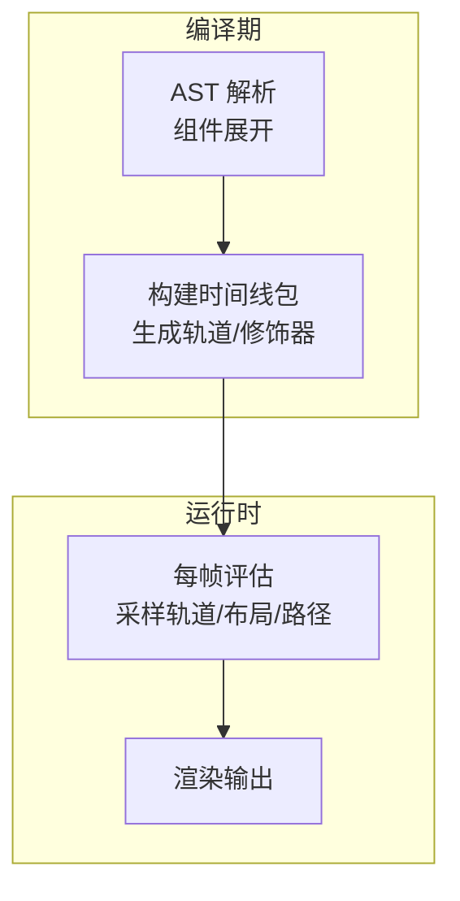
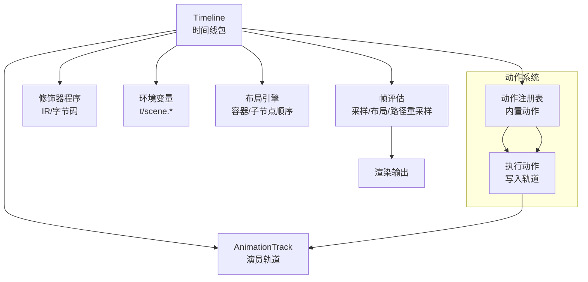
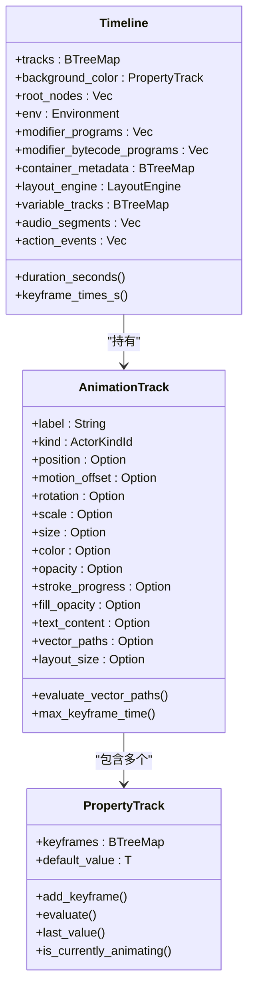
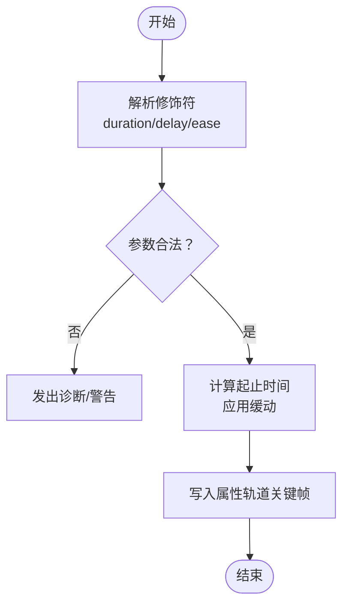
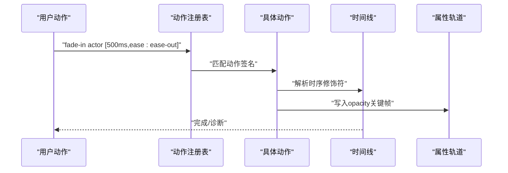
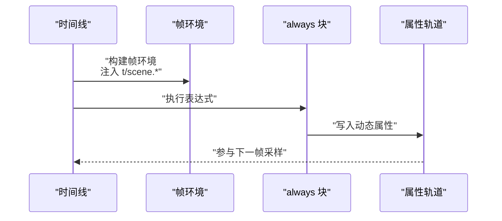
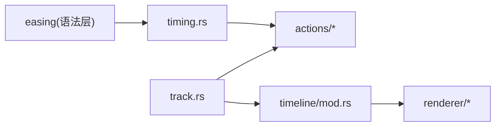

# 基础动画

<cite>
**本文引用的文件**
- [lib.rs](file://crates/animatix/src/lib.rs)
- [mod.rs](file://crates/animatix/src/timeline/mod.rs)
- [timing.rs](file://crates/animatix/src/timeline/timing.rs)
- [track.rs](file://crates/animatix/src/timeline/track.rs)
- [actions/mod.rs](file://crates/animatix/src/timeline/actions/mod.rs)
- [motion.rs](file://crates/animatix/src/timeline/actions/motion.rs)
- [entrance.rs](file://crates/animatix/src/timeline/actions/entrance.rs)
- [effects.rs](file://crates/animatix/src/timeline/actions/effects.rs)
- [reveal.rs](file://crates/animatix/src/timeline/actions/reveal.rs)
- [exit.rs](file://crates/animatix/src/timeline/actions/exit.rs)
- [03_timing.amx](file://examples/03_timing.amx)
- [04_motion.amx](file://examples/04_motion.amx)
- [06_reactive.amx](file://examples/06_reactive.amx)
- [07_plots.amx](file://examples/07_plots.amx)
</cite>

## 目录
1. [简介](#简介)
2. [项目结构](#项目结构)
3. [核心组件](#核心组件)
4. [架构总览](#架构总览)
5. [详细组件分析](#详细组件分析)
6. [依赖关系分析](#依赖关系分析)
7. [性能考量](#性能考量)
8. [故障排查指南](#故障排查指南)
9. [结论](#结论)
10. [附录](#附录)

## 简介
本指南面向初学者与进阶用户，系统讲解 Animatix 的基础动画能力：时间线系统、关键帧动画、缓动函数、动作系统（移动/旋转/缩放/淡入淡出）、反应式动画与自动化行为。通过示例场景与可视化流程图，帮助你快速掌握从入门到实用的动画制作技巧。

## 项目结构
Animatix 的动画引擎由“编译期构建”和“运行时评估”两部分组成：
- 编译期：解析 AST、展开组件、收集动作与属性、生成时间线包（包含场景图、属性轨道、修饰器程序等）。
- 运行时：按帧采样轨道、执行 always/修饰器、布局与路径重采样、渲染输出。

图表来源
- [mod.rs:1-120](file://crates/animatix/src/timeline/mod.rs#L1-L120)
- [lib.rs:1-24](file://crates/animatix/src/lib.rs#L1-L24)

章节来源
- [lib.rs:1-24](file://crates/animatix/src/lib.rs#L1-L24)
- [mod.rs:1-120](file://crates/animatix/src/timeline/mod.rs#L1-L120)

## 核心组件
- 时间线 Timeline：编译后的动画包，包含场景图、属性轨道、修饰器程序、容器元数据、布局引擎、缓存等。
- 属性轨道 PropertyTrack：以时间戳为键的插值轨道，支持数值、向量、颜色、矩阵、枚举等类型。
- 动作系统：内置动作（入场/退出/运动/效果/揭示），统一解析时序修饰符（时长、延迟、缓动）。
- 修饰器与 always：在帧内执行的表达式块，可驱动反应式动画与自动化行为。
- 缓动函数：线性、ease-in/out/in-out、弹性、回退、弹跳、指数等。

章节来源
- [track.rs:438-537](file://crates/animatix/src/timeline/track.rs#L438-L537)
- [timing.rs:81-137](file://crates/animatix/src/timeline/timing.rs#L81-L137)
- [actions/mod.rs:1-80](file://crates/animatix/src/timeline/actions/mod.rs#L1-L80)

## 架构总览
时间线系统的关键职责与模块边界如下：

图表来源
- [mod.rs:431-502](file://crates/animatix/src/timeline/mod.rs#L431-L502)
- [actions/mod.rs:224-283](file://crates/animatix/src/timeline/actions/mod.rs#L224-L283)

章节来源
- [mod.rs:431-502](file://crates/animatix/src/timeline/mod.rs#L431-L502)

## 详细组件分析

### 时间线系统与关键帧动画
- 时间线包 Timeline 包含：
  - 演员轨道 AnimationTrack：位置、位移、旋转、缩放、尺寸、颜色、不透明度、描边进度、填充不透明度、文本/矢量路径、滤镜、布局尺寸等。
  - 修饰器程序：IR 与字节码，用于 always 与修饰语块的高效执行。
  - 容器元数据与布局引擎：管理 Row/Col/Grid/Stack 等容器的子节点顺序与布局。
  - 多级缓存：帧结果、变换、静态子树片段、文本编译器缓存等。
- 关键帧轨道 PropertyTrack：
  - 以毫秒为单位的时间键，存储值与对应缓动。
  - 支持默认值、最近值查询、是否有效动画判断、带缓存的求值。
- 示例与用法：
  - 使用示例场景 03_timing.amx 展示序列、交错与缓动；04_motion.amx 展示移动/旋转/缩放与赋值动画；07_plots.amx 展示数据可视化与尺寸变化。

图表来源
- [track.rs:544-718](file://crates/animatix/src/timeline/track.rs#L544-L718)
- [track.rs:438-537](file://crates/animatix/src/timeline/track.rs#L438-L537)
- [mod.rs:431-502](file://crates/animatix/src/timeline/mod.rs#L431-L502)

章节来源
- [track.rs:438-537](file://crates/animatix/src/timeline/track.rs#L438-L537)
- [track.rs:544-718](file://crates/animatix/src/timeline/track.rs#L544-L718)
- [mod.rs:600-677](file://crates/animatix/src/timeline/mod.rs#L600-L677)
- [03_timing.amx:1-35](file://examples/03_timing.amx#L1-L35)
- [04_motion.amx:1-44](file://examples/04_motion.amx#L1-L44)
- [07_plots.amx:1-37](file://examples/07_plots.amx#L1-L37)

### 缓动函数与时序修饰符
- 缓动名称解析：支持 linear、ease-in、ease-out、ease-in-out、bounce、elastic、back、expo。
- 时序修饰符解析：支持 duration（时长）、delay（延迟）、ease（缓动）、morph 专用策略/弧长/拉伸等。
- 执行时应用：在动作执行阶段解析修饰符，生成关键帧并选择对应缓动曲线。

图表来源
- [timing.rs:283-587](file://crates/animatix/src/timeline/timing.rs#L283-L587)

章节来源
- [timing.rs:122-137](file://crates/animatix/src/timeline/timing.rs#L122-L137)
- [timing.rs:283-587](file://crates/animatix/src/timeline/timing.rs#L283-L587)

### 动作系统：移动、旋转、缩放、淡入淡出
- 移动/平移：支持绝对偏移 to 与相对偏移 by；写入 motion_offset 轨道。
- 旋转：相对角度 by，写入 rotation 轨道。
- 缩放：相对因子 by（需为正数），写入 scale 轨道。
- 淡入/淡出：写入 opacity 轨道，支持延迟与缓动。
- 入场/退出/效果/揭示：分别处理矢量描边进度与填充不透明度组合，确保视觉一致性。

图表来源
- [actions/mod.rs:247-275](file://crates/animatix/src/timeline/actions/mod.rs#L247-L275)
- [entrance.rs:74-128](file://crates/animatix/src/timeline/actions/entrance.rs#L74-L128)
- [exit.rs:8-65](file://crates/animatix/src/timeline/actions/exit.rs#L8-L65)

章节来源
- [motion.rs:188-268](file://crates/animatix/src/timeline/actions/motion.rs#L188-L268)
- [entrance.rs:74-128](file://crates/animatix/src/timeline/actions/entrance.rs#L74-L128)
- [exit.rs:8-65](file://crates/animatix/src/timeline/actions/exit.rs#L8-L65)
- [effects.rs:27-128](file://crates/animatix/src/timeline/actions/effects.rs#L27-L128)
- [reveal.rs:8-83](file://crates/animatix/src/timeline/actions/reveal.rs#L8-L83)

### 反应式动画与自动化行为
- always 块：在每帧执行，可读取时间 t 与场景上下文（如 scene.center），动态更新属性。
- 自动化行为：结合 _animating_* 标志检测关键帧驱动的动画状态，实现“跟踪中/空闲”等自动化切换。
- 示例：06_reactive.amx 中，always 将十字准星与环跟随目标位置，并根据动画状态切换颜色与尺寸。

图表来源
- [mod.rs:82-86](file://crates/animatix/src/timeline/mod.rs#L82-L86)
- [06_reactive.amx:26-49](file://examples/06_reactive.amx#L26-L49)

章节来源
- [06_reactive.amx:26-49](file://examples/06_reactive.amx#L26-L49)
- [mod.rs:82-86](file://crates/animatix/src/timeline/mod.rs#L82-L86)

### 序列、交错与缓动实践
- 序列：按顺序依次执行多个动作。
- 交错：对一组动作按固定间隔依次启动，形成“波浪”式动画。
- 缓动：通过 ease:* 修饰符选择不同缓动曲线，改变速度曲线与感知节奏。
- 示例：03_timing.amx 展示了交错淡入与序列尺寸变化，以及多种缓动曲线的对比。

章节来源
- [03_timing.amx:12-35](file://examples/03_timing.amx#L12-L35)
- [timing.rs:181-281](file://crates/animatix/src/timeline/timing.rs#L181-L281)

## 依赖关系分析
- 内部模块耦合：
  - timeline::mod 导出核心 API 并聚合各子模块。
  - actions 子模块依赖 timing 解析修饰符，依赖 track 提供轨道访问接口。
  - track 依赖 easing 提供缓动函数。
- 外部集成点：
  - 渲染后端（Vello/WGPU）在渲染模块中使用，与时间线解耦。
  - 字体与文本编译器缓存在时间线中复用，避免重复分配。

图表来源
- [timing.rs:1-10](file://crates/animatix/src/timeline/timing.rs#L1-L10)
- [actions/mod.rs:1-30](file://crates/animatix/src/timeline/actions/mod.rs#L1-L30)
- [track.rs:1-10](file://crates/animatix/src/timeline/track.rs#L1-L10)
- [mod.rs:1-20](file://crates/animatix/src/timeline/mod.rs#L1-L20)

章节来源
- [mod.rs:1-20](file://crates/animatix/src/timeline/mod.rs#L1-L20)

## 性能考量
- 缓存策略：
  - PropertyTrack 内置最近一次查询缓存，减少重复求值开销。
  - 时间线维护帧缓存、变换缓存、静态子树片段缓存、文本编译器缓存，避免重复编码与布局计算。
- 布质量等级：
  - Draft/Preview/Production 三档质量影响绘图采样密度与细节，GUI 实时编辑使用 Draft，导出使用 Production。
- 修饰器执行：
  - 修饰器先编译为 IR，再生成字节码，运行时按需执行，降低表达式解析成本。

章节来源
- [track.rs:478-514](file://crates/animatix/src/timeline/track.rs#L478-L514)
- [mod.rs:150-190](file://crates/animatix/src/timeline/mod.rs#L150-L190)

## 故障排查指南
- 常见诊断类型：
  - UnknownAction：动作名未知或拼写错误。
  - UnsupportedActionTarget：动作目标不支持（例如对图片/文本使用某些矢量揭示动作）。
  - InvalidModifierValue/UnsupportedModifierKey：修饰符值或键不合法。
  - ConflictingModifierKey：同一修饰符重复指定，采用最后值。
- 排查建议：
  - 检查动作签名与目标类型匹配性。
  - 核对修饰符键名与值格式（时长必须是 120ms 或 1s 这类字面量）。
  - 对于交错/序列，确认语句类型仅支持动作与赋值。

章节来源
- [actions/mod.rs:31-66](file://crates/animatix/src/timeline/actions/mod.rs#L31-L66)
- [timing.rs:30-51](file://crates/animatix/src/timeline/timing.rs#L30-L51)
- [timing.rs:147-179](file://crates/animatix/src/timeline/timing.rs#L147-L179)

## 结论
通过时间线系统与属性轨道，Animatix 提供了稳定、可扩展的基础动画能力。动作系统覆盖常见的移动/旋转/缩放/淡入淡出，配合缓动与交错/序列，可快速构建节奏清晰的动画。结合 always 块与 _animating_* 标志，可以实现反应式与自动化的行为。建议从示例场景入手，逐步掌握关键帧、缓动与反应式表达式的组合使用。

## 附录
- 快速参考
  - 动作类别：Entrance（入场）、Motion（运动）、Exit（退出）、Effect（效果）、Reorder（重排）、Reveal（揭示）。
  - 缓动名称：linear、ease-in、ease-out、ease-in-out、bounce、elastic、back、expo。
  - 时序修饰符：duration（时长）、delay（延迟）、ease（缓动）、morph 策略/弧长/拉伸。
  - 示例场景：
    - 03_timing.amx：交错与序列、缓动对比
    - 04_motion.amx：移动/旋转/缩放/赋值与 always
    - 06_reactive.amx：反应式跟随与状态切换
    - 07_plots.amx：数据可视化与尺寸变化

章节来源
- [actions/mod.rs:224-283](file://crates/animatix/src/timeline/actions/mod.rs#L224-L283)
- [timing.rs:122-137](file://crates/animatix/src/timeline/timing.rs#L122-L137)
- [03_timing.amx:1-35](file://examples/03_timing.amx#L1-L35)
- [04_motion.amx:1-44](file://examples/04_motion.amx#L1-L44)
- [06_reactive.amx:1-59](file://examples/06_reactive.amx#L1-L59)
- [07_plots.amx:1-37](file://examples/07_plots.amx#L1-L37)