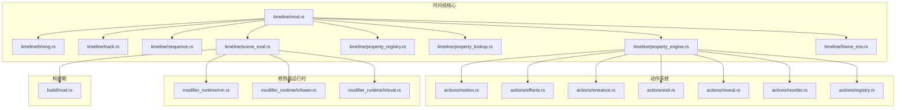
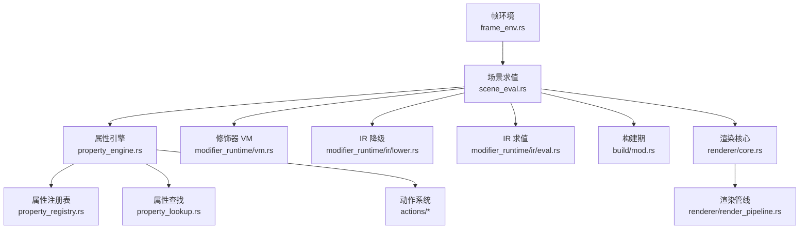
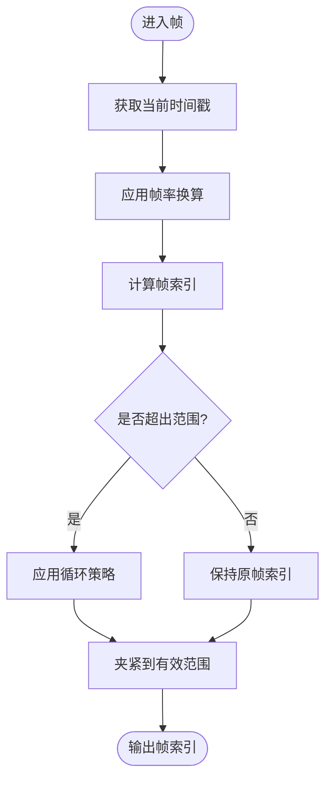
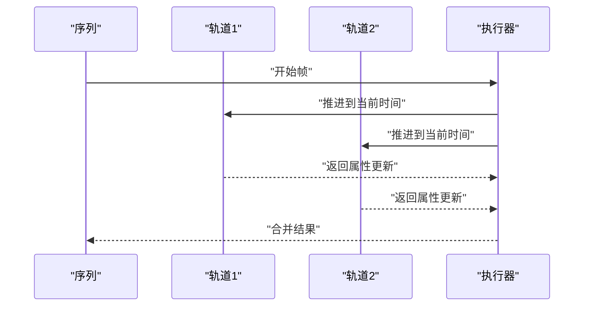
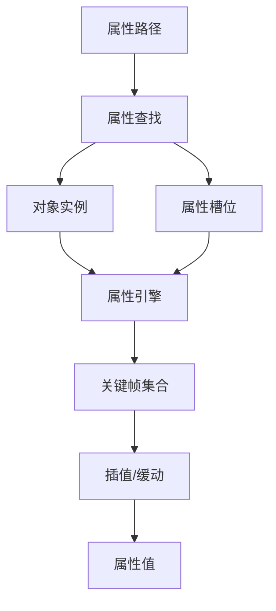
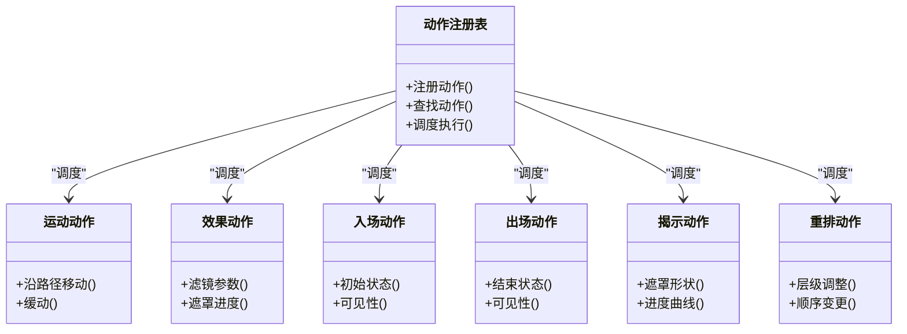
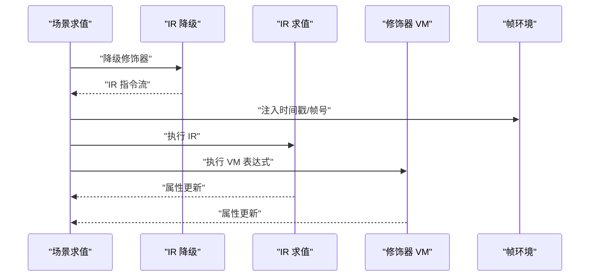
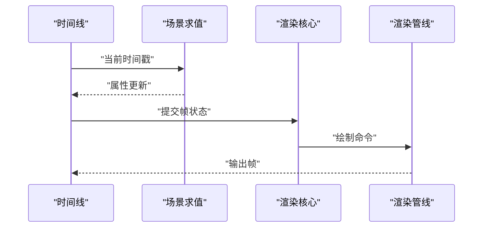
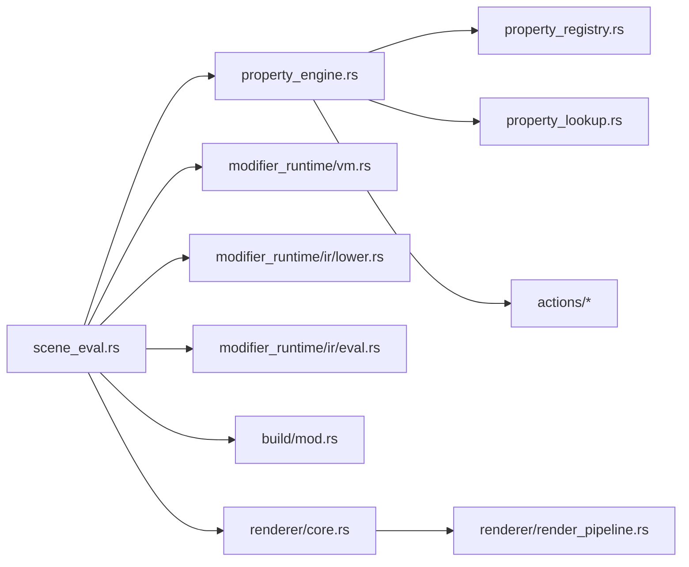

# 时间线系统

<cite>
**本文引用的文件**
- [crates/animatix/src/timeline/mod.rs](file://crates/animatix/src/timeline/mod.rs)
- [crates/animatix/src/timeline/timing.rs](file://crates/animatix/src/timeline/timing.rs)
- [crates/animatix/src/timeline/track.rs](file://crates/animatix/src/timeline/track.rs)
- [crates/animatix/src/timeline/sequence.rs](file://crates/animatix/src/timeline/sequence.rs)
- [crates/animatix/src/timeline/property_engine.rs](file://crates/animatix/src/timeline/property_engine.rs)
- [crates/animatix/src/timeline/property_registry.rs](file://crates/animatix/src/timeline/property_registry.rs)
- [crates/animatix/src/timeline/property_lookup.rs](file://crates/animatix/src/timeline/property_lookup.rs)
- [crates/animatix/src/timeline/scene_eval.rs](file://crates/animatix/src/timeline/scene_eval.rs)
- [crates/animatix/src/timeline/actions/motion.rs](file://crates/animatix/src/timeline/actions/motion.rs)
- [crates/animatix/src/timeline/actions/effects.rs](file://crates/animatix/src/timeline/actions/effects.rs)
- [crates/animatix/src/timeline/actions/entrance.rs](file://crates/animatix/src/timeline/actions/entrance.rs)
- [crates/animatix/src/timeline/actions/exit.rs](file://crates/animatix/src/timeline/actions/exit.rs)
- [crates/animatix/src/timeline/actions/reveal.rs](file://crates/animatix/src/timeline/actions/reveal.rs)
- [crates/animatix/src/timeline/actions/reorder.rs](file://crates/animatix/src/timeline/actions/reorder.rs)
- [crates/animatix/src/timeline/actions/registry.rs](file://crates/animatix/src/timeline/actions/registry.rs)
- [crates/animatix/src/timeline/build/mod.rs](file://crates/animatix/src/timeline/build/mod.rs)
- [crates/animatix/src/timeline/modifier_runtime/vm.rs](file://crates/animatix/src/timeline/modifier_runtime/vm.rs)
- [crates/animatix/src/timeline/modifier_runtime/ir/lower.rs](file://crates/animatix/src/timeline/modifier_runtime/ir/lower.rs)
- [crates/animatix/src/timeline/modifier_runtime/ir/eval.rs](file://crates/animatix/src/timeline/modifier_runtime/ir/eval.rs)
- [crates/animatix/src/timeline/frame_env.rs](file://crates/animatix/src/timeline/frame_env.rs)
- [crates/animatix/src/timeline/utils.rs](file://crates/animatix/src/timeline/utils.rs)
- [crates/animatix/src/renderer/core.rs](file://crates/animatix/src/renderer/core.rs)
- [crates/animatix/src/renderer/render_pipeline.rs](file://crates/animatix/src/renderer/render_pipeline.rs)
- [examples/03_timing.amx](file://examples/03_timing.amx)
- [examples/04_motion.amx](file://examples/04_motion.amx)
- [examples/05_morph.amx](file://examples/05_morph.amx)
- [examples/08_effects.amx](file://examples/08_effects.amx)
- [examples/18_number_plane_contours.amx](file://examples/18_number_plane_contours.amx)
</cite>

## 目录
1. [引言](#引言)
2. [项目结构](#项目结构)
3. [核心组件](#核心组件)
4. [架构总览](#架构总览)
5. [详细组件分析](#详细组件分析)
6. [依赖分析](#依赖分析)
7. [性能考虑](#性能考虑)
8. [故障排除指南](#故障排除指南)
9. [结论](#结论)
10. [附录](#附录)

## 引言
本文件系统性阐述 Animatix 的时间线系统：从时间轴管理、帧率控制、时间戳处理，到关键帧创建与管理、时间间隔与持续时间、播放控制；从属性插值算法、时间同步机制，到与渲染系统的交互及性能优化策略。文档以代码为依据，结合图示帮助读者理解时间线的构建过程与运行时行为。

## 项目结构
Animatix 的时间线系统主要位于 crates/animatix/src/timeline 目录下，包含以下关键子模块：
- timing：时间度量与播放控制
- track/sequence：轨道与时序组织
- property_engine/property_registry/property_lookup：属性注册与求值
- actions：动作（运动、效果、入场/出场、揭示、重排）
- modifier_runtime：修饰器运行时（VM/IR）
- build：构建期 IR 生成与降级
- frame_env：帧环境（时间戳、帧号等）
- renderer：渲染集成

**图表来源**
- [crates/animatix/src/timeline/mod.rs](file://crates/animatix/src/timeline/mod.rs)
- [crates/animatix/src/timeline/timing.rs](file://crates/animatix/src/timeline/timing.rs)
- [crates/animatix/src/timeline/track.rs](file://crates/animatix/src/timeline/track.rs)
- [crates/animatix/src/timeline/sequence.rs](file://crates/animatix/src/timeline/sequence.rs)
- [crates/animatix/src/timeline/property_engine.rs](file://crates/animatix/src/timeline/property_engine.rs)
- [crates/animatix/src/timeline/property_registry.rs](file://crates/animatix/src/timeline/property_registry.rs)
- [crates/animatix/src/timeline/property_lookup.rs](file://crates/animatix/src/timeline/property_lookup.rs)
- [crates/animatix/src/timeline/scene_eval.rs](file://crates/animatix/src/timeline/scene_eval.rs)
- [crates/animatix/src/timeline/actions/motion.rs](file://crates/animatix/src/timeline/actions/motion.rs)
- [crates/animatix/src/timeline/actions/effects.rs](file://crates/animatix/src/timeline/actions/effects.rs)
- [crates/animatix/src/timeline/actions/entrance.rs](file://crates/animatix/src/timeline/actions/entrance.rs)
- [crates/animatix/src/timeline/actions/exit.rs](file://crates/animatix/src/timeline/actions/exit.rs)
- [crates/animatix/src/timeline/actions/reveal.rs](file://crates/animatix/src/timeline/actions/reveal.rs)
- [crates/animatix/src/timeline/actions/reorder.rs](file://crates/animatix/src/timeline/actions/reorder.rs)
- [crates/animatix/src/timeline/actions/registry.rs](file://crates/animatix/src/timeline/actions/registry.rs)
- [crates/animatix/src/timeline/modifier_runtime/vm.rs](file://crates/animatix/src/timeline/modifier_runtime/vm.rs)
- [crates/animatix/src/timeline/modifier_runtime/ir/lower.rs](file://crates/animatix/src/timeline/modifier_runtime/ir/lower.rs)
- [crates/animatix/src/timeline/modifier_runtime/ir/eval.rs](file://crates/animatix/src/timeline/modifier_runtime/ir/eval.rs)
- [crates/animatix/src/timeline/build/mod.rs](file://crates/animatix/src/timeline/build/mod.rs)

**章节来源**
- [crates/animatix/src/timeline/mod.rs](file://crates/animatix/src/timeline/mod.rs)
- [crates/animatix/src/timeline/timing.rs](file://crates/animatix/src/timeline/timing.rs)
- [crates/animatix/src/timeline/track.rs](file://crates/animatix/src/timeline/track.rs)
- [crates/animatix/src/timeline/sequence.rs](file://crates/animatix/src/timeline/sequence.rs)

## 核心组件
- 时间度量与播放控制（timing）：定义时间戳、帧率、播放方向、循环策略等。
- 轨道与时序（track/sequence）：组织多个轨道，管理并行/串行组合与时间对齐。
- 属性引擎（property_engine/registry/lookup）：注册可动画属性、解析属性路径、执行插值。
- 动作系统（actions）：封装常见动画行为（运动、效果、入场/出场、揭示、重排）。
- 修饰器运行时（modifier_runtime）：在运行时评估修饰器表达式，支持 VM 与 IR。
- 构建期（build）：将高层描述转换为中间表示，便于后续降级与执行。
- 帧环境（frame_env）：承载当前帧的时间戳、帧号、采样点等上下文信息。
- 场景求值（scene_eval）：驱动整个场景在给定时间点的属性计算与渲染准备。

**章节来源**
- [crates/animatix/src/timeline/property_engine.rs](file://crates/animatix/src/timeline/property_engine.rs)
- [crates/animatix/src/timeline/property_registry.rs](file://crates/animatix/src/timeline/property_registry.rs)
- [crates/animatix/src/timeline/property_lookup.rs](file://crates/animatix/src/timeline/property_lookup.rs)
- [crates/animatix/src/timeline/scene_eval.rs](file://crates/animatix/src/timeline/scene_eval.rs)
- [crates/animatix/src/timeline/frame_env.rs](file://crates/animatix/src/timeline/frame_env.rs)

## 架构总览
时间线系统采用“构建期 IR + 运行时求值”的分层设计。构建期将高层动画描述转换为可执行的中间表示；运行时根据帧环境在每一帧对属性进行求值与插值，最终驱动渲染管线输出画面。

**图表来源**
- [crates/animatix/src/timeline/frame_env.rs](file://crates/animatix/src/timeline/frame_env.rs)
- [crates/animatix/src/timeline/scene_eval.rs](file://crates/animatix/src/timeline/scene_eval.rs)
- [crates/animatix/src/timeline/property_engine.rs](file://crates/animatix/src/timeline/property_engine.rs)
- [crates/animatix/src/timeline/property_registry.rs](file://crates/animatix/src/timeline/property_registry.rs)
- [crates/animatix/src/timeline/property_lookup.rs](file://crates/animatix/src/timeline/property_lookup.rs)
- [crates/animatix/src/timeline/actions/motion.rs](file://crates/animatix/src/timeline/actions/motion.rs)
- [crates/animatix/src/timeline/modifier_runtime/vm.rs](file://crates/animatix/src/timeline/modifier_runtime/vm.rs)
- [crates/animatix/src/timeline/modifier_runtime/ir/lower.rs](file://crates/animatix/src/timeline/modifier_runtime/ir/lower.rs)
- [crates/animatix/src/timeline/modifier_runtime/ir/eval.rs](file://crates/animatix/src/timeline/modifier_runtime/ir/eval.rs)
- [crates/animatix/src/timeline/build/mod.rs](file://crates/animatix/src/timeline/build/mod.rs)
- [crates/animatix/src/renderer/core.rs](file://crates/animatix/src/renderer/core.rs)
- [crates/animatix/src/renderer/render_pipeline.rs](file://crates/animatix/src/renderer/render_pipeline.rs)

## 详细组件分析

### 时间度量与播放控制（timing）
- 关键概念
  - 时间戳：以秒或帧为单位的绝对时间点。
  - 帧率：每秒帧数（FPS），用于将连续时间映射到离散帧。
  - 播放方向：正向/反向。
  - 循环策略：无循环、正向循环、来回循环。
  - 持续时间：单个片段或整体场景的时长。
- 实现要点
  - 将连续时间转换为帧索引，必要时进行取整或插值。
  - 在边界处应用循环策略，确保时间线无缝衔接。
  - 支持变速（如慢动作/快进）与暂停/恢复。

**图表来源**
- [crates/animatix/src/timeline/timing.rs](file://crates/animatix/src/timeline/timing.rs)

**章节来源**
- [crates/animatix/src/timeline/timing.rs](file://crates/animatix/src/timeline/timing.rs)

### 轨道与时序（track/sequence）
- 轨道（Track）：承载一组属性的关键帧与修饰器，按时间轴排列。
- 时序（Sequence）：组织多个轨道，支持并行/串行组合与对齐策略。
- 并行播放：多条轨道在同一时间轴上同时推进。
- 串行播放：轨道依次开始，前一条结束后再开始下一条。
- 对齐与裁剪：通过起始偏移、持续时间与对齐方式控制相对位置。

**图表来源**
- [crates/animatix/src/timeline/track.rs](file://crates/animatix/src/timeline/track.rs)
- [crates/animatix/src/timeline/sequence.rs](file://crates/animatix/src/timeline/sequence.rs)

**章节来源**
- [crates/animatix/src/timeline/track.rs](file://crates/animatix/src/timeline/track.rs)
- [crates/animatix/src/timeline/sequence.rs](file://crates/animatix/src/timeline/sequence.rs)

### 属性插值与求值（property_engine/registry/lookup）
- 属性注册（property_registry）：集中登记可动画属性及其类型约束。
- 属性查找（property_lookup）：根据路径定位目标对象与属性槽位。
- 插值算法（property_engine）：基于关键帧与缓动函数计算中间值。
- 类型安全：在编译期/构建期校验属性路径与类型一致性，运行期避免错误。

**图表来源**
- [crates/animatix/src/timeline/property_registry.rs](file://crates/animatix/src/timeline/property_registry.rs)
- [crates/animatix/src/timeline/property_lookup.rs](file://crates/animatix/src/timeline/property_lookup.rs)
- [crates/animatix/src/timeline/property_engine.rs](file://crates/animatix/src/timeline/property_engine.rs)

**章节来源**
- [crates/animatix/src/timeline/property_engine.rs](file://crates/animatix/src/timeline/property_engine.rs)
- [crates/animatix/src/timeline/property_registry.rs](file://crates/animatix/src/timeline/property_registry.rs)
- [crates/animatix/src/timeline/property_lookup.rs](file://crates/animatix/src/timeline/property_lookup.rs)

### 动作系统（actions）
- 运动（motion）：沿路径或坐标变化产生平滑过渡。
- 效果（effects）：滤镜、遮罩、混合模式等视觉效果的时序化。
- 入场/出场（entrance/exit）：控制可见性与初始/结束状态。
- 揭示（reveal）：基于遮罩或裁剪的逐步显隐。
- 重排（reorder）：层级与顺序的时序调整。
- 注册表（registry）：统一注册与调度各类动作。

**图表来源**
- [crates/animatix/src/timeline/actions/registry.rs](file://crates/animatix/src/timeline/actions/registry.rs)
- [crates/animatix/src/timeline/actions/motion.rs](file://crates/animatix/src/timeline/actions/motion.rs)
- [crates/animatix/src/timeline/actions/effects.rs](file://crates/animatix/src/timeline/actions/effects.rs)
- [crates/animatix/src/timeline/actions/entrance.rs](file://crates/animatix/src/timeline/actions/entrance.rs)
- [crates/animatix/src/timeline/actions/exit.rs](file://crates/animatix/src/timeline/actions/exit.rs)
- [crates/animatix/src/timeline/actions/reveal.rs](file://crates/animatix/src/timeline/actions/reveal.rs)
- [crates/animatix/src/timeline/actions/reorder.rs](file://crates/animatix/src/timeline/actions/reorder.rs)

**章节来源**
- [crates/animatix/src/timeline/actions/registry.rs](file://crates/animatix/src/timeline/actions/registry.rs)
- [crates/animatix/src/timeline/actions/motion.rs](file://crates/animatix/src/timeline/actions/motion.rs)
- [crates/animatix/src/timeline/actions/effects.rs](file://crates/animatix/src/timeline/actions/effects.rs)
- [crates/animatix/src/timeline/actions/entrance.rs](file://crates/animatix/src/timeline/actions/entrance.rs)
- [crates/animatix/src/timeline/actions/exit.rs](file://crates/animatix/src/timeline/actions/exit.rs)
- [crates/animatix/src/timeline/actions/reveal.rs](file://crates/animatix/src/timeline/actions/reveal.rs)
- [crates/animatix/src/timeline/actions/reorder.rs](file://crates/animatix/src/timeline/actions/reorder.rs)

### 修饰器运行时（modifier_runtime）
- VM：基于虚拟机的动态求值，适合表达式灵活但性能中等的场景。
- IR：中间表示，支持降级与优化，兼顾性能与可维护性。
- 降级（lower）：将高级修饰器转换为低级指令序列。
- 求值（eval）：在帧环境中执行 IR 指令流。

**图表来源**
- [crates/animatix/src/timeline/scene_eval.rs](file://crates/animatix/src/timeline/scene_eval.rs)
- [crates/animatix/src/timeline/modifier_runtime/ir/lower.rs](file://crates/animatix/src/timeline/modifier_runtime/ir/lower.rs)
- [crates/animatix/src/timeline/modifier_runtime/ir/eval.rs](file://crates/animatix/src/timeline/modifier_runtime/ir/eval.rs)
- [crates/animatix/src/timeline/modifier_runtime/vm.rs](file://crates/animatix/src/timeline/modifier_runtime/vm.rs)
- [crates/animatix/src/timeline/frame_env.rs](file://crates/animatix/src/timeline/frame_env.rs)

**章节来源**
- [crates/animatix/src/timeline/modifier_runtime/vm.rs](file://crates/animatix/src/timeline/modifier_runtime/vm.rs)
- [crates/animatix/src/timeline/modifier_runtime/ir/lower.rs](file://crates/animatix/src/timeline/modifier_runtime/ir/lower.rs)
- [crates/animatix/src/timeline/modifier_runtime/ir/eval.rs](file://crates/animatix/src/timeline/modifier_runtime/ir/eval.rs)
- [crates/animatix/src/timeline/scene_eval.rs](file://crates/animatix/src/timeline/scene_eval.rs)

### 构建期（build）
- 将高层动画描述转换为中间表示，便于后续降级与执行。
- 提供静态分析与优化机会，减少运行时开销。

**章节来源**
- [crates/animatix/src/timeline/build/mod.rs](file://crates/animatix/src/timeline/build/mod.rs)

### 帧环境（frame_env）
- 承载当前帧的时间戳、帧号、采样点等上下文信息。
- 作为求值链路的输入，确保所有组件共享一致的时间语义。

**章节来源**
- [crates/animatix/src/timeline/frame_env.rs](file://crates/animatix/src/timeline/frame_env.rs)

### 与渲染系统的交互
- 渲染核心（renderer/core.rs）负责接收属性更新后的场景状态。
- 渲染管线（renderer/render_pipeline.rs）将场景转换为图像帧。
- 时间线系统通过场景求值在每帧输出可渲染的状态，形成“时间线 → 属性 → 渲染”的闭环。

**图表来源**
- [crates/animatix/src/timeline/scene_eval.rs](file://crates/animatix/src/timeline/scene_eval.rs)
- [crates/animatix/src/renderer/core.rs](file://crates/animatix/src/renderer/core.rs)
- [crates/animatix/src/renderer/render_pipeline.rs](file://crates/animatix/src/renderer/render_pipeline.rs)

**章节来源**
- [crates/animatix/src/renderer/core.rs](file://crates/animatix/src/renderer/core.rs)
- [crates/animatix/src/renderer/render_pipeline.rs](file://crates/animatix/src/renderer/render_pipeline.rs)

## 依赖分析
- 组件耦合
  - scene_eval 是中枢，向上游（构建期/帧环境）与下游（渲染）连接。
  - property_engine 依赖 registry 与 lookup，形成稳定的属性访问链。
  - actions 通过注册表被调度，解耦具体实现。
  - modifier_runtime 为 scene_eval 提供可插拔的求值后端。
- 外部依赖
  - 渲染系统提供绘制接口，时间线系统仅负责状态生成。

**图表来源**
- [crates/animatix/src/timeline/scene_eval.rs](file://crates/animatix/src/timeline/scene_eval.rs)
- [crates/animatix/src/timeline/property_engine.rs](file://crates/animatix/src/timeline/property_engine.rs)
- [crates/animatix/src/timeline/property_registry.rs](file://crates/animatix/src/timeline/property_registry.rs)
- [crates/animatix/src/timeline/property_lookup.rs](file://crates/animatix/src/timeline/property_lookup.rs)
- [crates/animatix/src/timeline/actions/motion.rs](file://crates/animatix/src/timeline/actions/motion.rs)
- [crates/animatix/src/timeline/modifier_runtime/vm.rs](file://crates/animatix/src/timeline/modifier_runtime/vm.rs)
- [crates/animatix/src/timeline/modifier_runtime/ir/lower.rs](file://crates/animatix/src/timeline/modifier_runtime/ir/lower.rs)
- [crates/animatix/src/timeline/modifier_runtime/ir/eval.rs](file://crates/animatix/src/timeline/modifier_runtime/ir/eval.rs)
- [crates/animatix/src/timeline/build/mod.rs](file://crates/animatix/src/timeline/build/mod.rs)
- [crates/animatix/src/renderer/core.rs](file://crates/animatix/src/renderer/core.rs)
- [crates/animatix/src/renderer/render_pipeline.rs](file://crates/animatix/src/renderer/render_pipeline.rs)

**章节来源**
- [crates/animatix/src/timeline/scene_eval.rs](file://crates/animatix/src/timeline/scene_eval.rs)
- [crates/animatix/src/timeline/property_engine.rs](file://crates/animatix/src/timeline/property_engine.rs)
- [crates/animatix/src/timeline/property_registry.rs](file://crates/animatix/src/timeline/property_registry.rs)
- [crates/animatix/src/timeline/property_lookup.rs](file://crates/animatix/src/timeline/property_lookup.rs)
- [crates/animatix/src/timeline/actions/motion.rs](file://crates/animatix/src/timeline/actions/motion.rs)
- [crates/animatix/src/timeline/modifier_runtime/vm.rs](file://crates/animatix/src/timeline/modifier_runtime/vm.rs)
- [crates/animatix/src/timeline/modifier_runtime/ir/lower.rs](file://crates/animatix/src/timeline/modifier_runtime/ir/lower.rs)
- [crates/animatix/src/timeline/modifier_runtime/ir/eval.rs](file://crates/animatix/src/timeline/modifier_runtime/ir/eval.rs)
- [crates/animatix/src/timeline/build/mod.rs](file://crates/animatix/src/timeline/build/mod.rs)
- [crates/animatix/src/renderer/core.rs](file://crates/animatix/src/renderer/core.rs)
- [crates/animatix/src/renderer/render_pipeline.rs](file://crates/animatix/src/renderer/render_pipeline.rs)

## 性能考虑
- 缓存与去重
  - 对重复属性查询与插值结果进行缓存，避免重复计算。
  - 合理利用帧间相关性，仅在关键帧或属性变化时更新。
- 修饰器优化
  - 优先使用 IR 降级路径，减少表达式解析成本。
  - 在 VM 路径中避免频繁的符号查找与动态分派。
- 时间同步
  - 使用统一的帧环境与时间戳，减少跨模块的时间漂移。
  - 对长序列采用分段缓存与增量更新策略。
- 渲染协同
  - 将昂贵的属性计算前置到时间线阶段，降低渲染阶段压力。
  - 利用可见性剔除与属性裁剪减少无效绘制。

[本节为通用指导，无需列出章节来源]

## 故障排除指南
- 关键帧不生效
  - 检查属性路径是否正确且已注册。
  - 确认时间戳落在关键帧区间内，或插值逻辑是否覆盖该区间。
- 插值异常
  - 核对缓动函数与关键帧切线设置。
  - 验证数据类型一致性，避免类型不匹配导致的回退。
- 性能瓶颈
  - 分析修饰器表达式的复杂度，简化不必要的动态计算。
  - 合理拆分轨道与时序，避免单帧过多属性更新。
- 渲染错乱
  - 确保帧环境中的时间戳与渲染帧号一致。
  - 排查序列对齐与裁剪设置，避免越界访问。

**章节来源**
- [crates/animatix/src/timeline/property_registry.rs](file://crates/animatix/src/timeline/property_registry.rs)
- [crates/animatix/src/timeline/property_lookup.rs](file://crates/animatix/src/timeline/property_lookup.rs)
- [crates/animatix/src/timeline/property_engine.rs](file://crates/animatix/src/timeline/property_engine.rs)
- [crates/animatix/src/timeline/scene_eval.rs](file://crates/animatix/src/timeline/scene_eval.rs)

## 结论
Animatix 的时间线系统通过清晰的层次划分与严格的属性管理，实现了从时间度量、轨道组织、属性插值到渲染输出的完整链路。其修饰器运行时提供了灵活的表达能力，而构建期与运行时的配合则保证了性能与可维护性的平衡。结合本文档的实践建议，用户可以高效地构建复杂的时间线结构，并获得稳定、流畅的播放体验。

[本节为总结性内容，无需列出章节来源]

## 附录
- 示例参考
  - 时间与帧率：[examples/03_timing.amx](file://examples/03_timing.amx)
  - 运动与路径：[examples/04_motion.amx](file://examples/04_motion.amx)
  - 形变与形态切换：[examples/05_morph.amx](file://examples/05_morph.amx)
  - 视觉效果：[examples/08_effects.amx](file://examples/08_effects.amx)
  - 数值平面轮廓：[examples/18_number_plane_contours.amx](file://examples/18_number_plane_contours.amx)

**章节来源**
- [examples/03_timing.amx](file://examples/03_timing.amx)
- [examples/04_motion.amx](file://examples/04_motion.amx)
- [examples/05_morph.amx](file://examples/05_morph.amx)
- [examples/08_effects.amx](file://examples/08_effects.amx)
- [examples/18_number_plane_contours.amx](file://examples/18_number_plane_contours.amx)