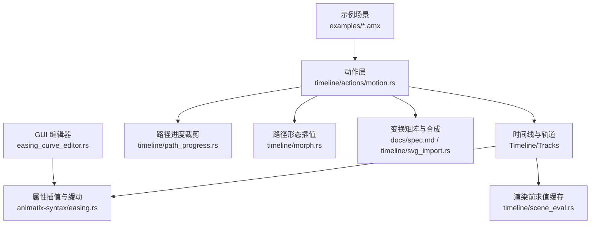
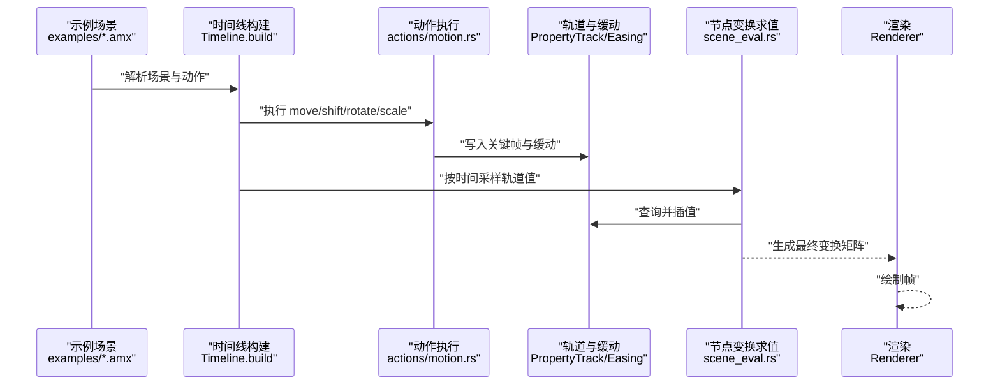
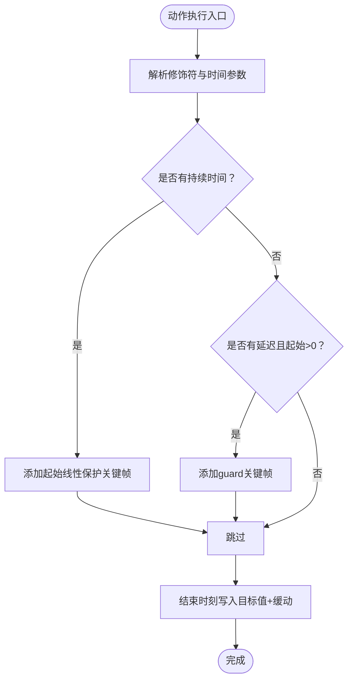
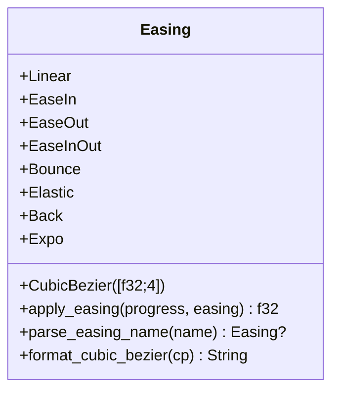
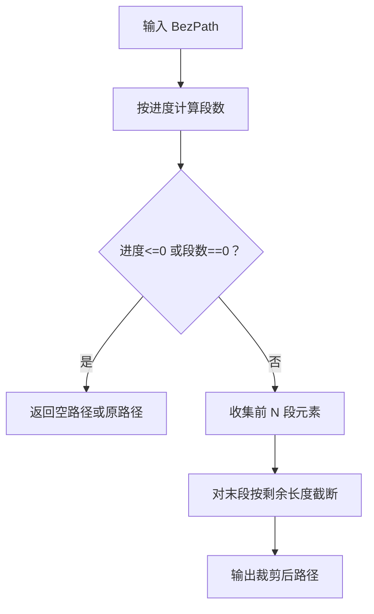
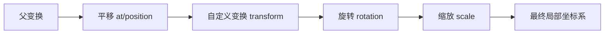
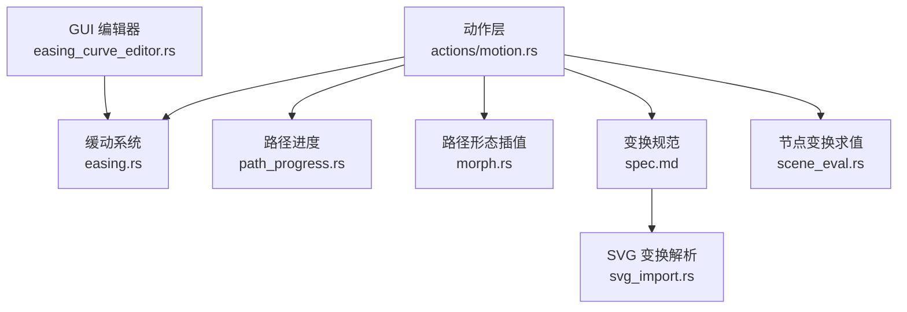

# 运动动画

<cite>
**本文引用的文件**
- [crates/animatix/src/timeline/actions/motion.rs](file://crates/animatix/src/timeline/actions/motion.rs)
- [crates/animatix-syntax/src/easing.rs](file://crates/animatix-syntax/src/easing.rs)
- [examples/04_motion.amx](file://examples/04_motion.amx)
- [examples/13_paths.amx](file://examples/13_paths.amx)
- [crates/animatix/src/timeline/path_progress.rs](file://crates/animatix/src/timeline/path_progress.rs)
- [docs/spec.md](file://docs/spec.md)
- [crates/animatix/src/timeline/svg_import.rs](file://crates/animatix/src/timeline/svg_import.rs)
- [crates/animatix/src/timeline/scene_eval.rs](file://crates/animatix/src/timeline/scene_eval.rs)
- [crates/animatix-gui/src/app/components/easing_curve_editor.rs](file://crates/animatix-gui/src/app/components/easing_curve_editor.rs)
- [crates/animatix/src/timeline/morph.rs](file://crates/animatix/src/timeline/morph.rs)
- [docs/design/curve_trace.md](file://docs/design/curve_trace.md)
</cite>

## 目录
1. [简介](#简介)
2. [项目结构](#项目结构)
3. [核心组件](#核心组件)
4. [架构总览](#架构总览)
5. [详细组件分析](#详细组件分析)
6. [依赖分析](#依赖分析)
7. [性能考量](#性能考量)
8. [故障排查指南](#故障排查指南)
9. [结论](#结论)
10. [附录](#附录)

## 简介
本指南系统讲解 Animatix 的运动动画能力，覆盖平移、旋转、缩放、倾斜等几何变换动画；运动轨迹（直线、曲线、路径跟随）的定义方式；缓动函数的使用与自定义；以及如何组合多种运动效果形成复杂动画序列。同时结合项目中的路径裁剪、贝塞尔曲线扁平等能力，说明运动动画与图形路径、物理特性（加速度、减速度、惯性）的关系与实践。

## 项目结构
与运动动画相关的关键模块分布如下：
- 动作与运动：timeline/actions/motion.rs 定义了 move、shift、rotate、scale 等内置动作，负责解析修饰符、时序参数与缓动，并写入对应轨道。
- 缓动系统：animatix-syntax/easing.rs 提供标准缓动曲线与自定义三次贝塞尔缓动的计算。
- 示例：examples/04_motion.amx 展示了基础几何变换动画与缓动用法；examples/13_paths.amx 演示路径与变换矩阵。
- 路径与进度：timeline/path_progress.rs 支持按进度裁剪路径，用于描边类动画；morph.rs 实现路径形态插值。
- 变换与矩阵：spec.md 描述 transform 属性与合成顺序；svg_import.rs 解析 SVG transform 并叠加到内部变换模型。
- 运行时求值：scene_eval.rs 对节点变换进行缓存以提升性能。
- GUI 编辑器：easing_curve_editor.rs 提供三次贝塞尔控制点可视化编辑。

**图表来源**
- [crates/animatix/src/timeline/actions/motion.rs:1-816](file://crates/animatix/src/timeline/actions/motion.rs#L1-L816)
- [crates/animatix-syntax/src/easing.rs:1-174](file://crates/animatix-syntax/src/easing.rs#L1-L174)
- [crates/animatix/src/timeline/path_progress.rs:1-38](file://crates/animatix/src/timeline/path_progress.rs#L1-L38)
- [crates/animatix/src/timeline/morph.rs:283-614](file://crates/animatix/src/timeline/morph.rs#L283-L614)
- [docs/spec.md:480-516](file://docs/spec.md#L480-L516)
- [crates/animatix/src/timeline/svg_import.rs:229-297](file://crates/animatix/src/timeline/svg_import.rs#L229-L297)
- [crates/animatix/src/timeline/scene_eval.rs:320-351](file://crates/animatix/src/timeline/scene_eval.rs#L320-L351)
- [crates/animatix-gui/src/app/components/easing_curve_editor.rs:88-172](file://crates/animatix-gui/src/app/components/easing_curve_editor.rs#L88-L172)

**章节来源**
- [crates/animatix/src/timeline/actions/motion.rs:1-816](file://crates/animatix/src/timeline/actions/motion.rs#L1-L816)
- [crates/animatix-syntax/src/easing.rs:1-174](file://crates/animatix-syntax/src/easing.rs#L1-L174)
- [examples/04_motion.amx:1-44](file://examples/04_motion.amx#L1-L44)
- [examples/13_paths.amx:1-50](file://examples/13_paths.amx#L1-L50)
- [crates/animatix/src/timeline/path_progress.rs:1-38](file://crates/animatix/src/timeline/path_progress.rs#L1-L38)
- [crates/animatix/src/timeline/morph.rs:283-614](file://crates/animatix/src/timeline/morph.rs#L283-L614)
- [docs/spec.md:480-516](file://docs/spec.md#L480-L516)
- [crates/animatix/src/timeline/svg_import.rs:229-297](file://crates/animatix/src/timeline/svg_import.rs#L229-L297)
- [crates/animatix/src/timeline/scene_eval.rs:320-351](file://crates/animatix/src/timeline/scene_eval.rs#L320-L351)
- [crates/animatix-gui/src/app/components/easing_curve_editor.rs:88-172](file://crates/animatix-gui/src/app/components/easing_curve_editor.rs#L88-L172)

## 核心组件
- 几何变换动作
  - move：绝对本地位移，目标为“to”向量，写入 motion_offset 轨道。
  - shift：相对本地位移，目标为“by”向量，累加到当前 motion_offset。
  - rotate：相对本地旋转（弧度），写入 rotation 轨道。
  - scale：相对均匀缩放因子（>0），写入 scale 轨道。
- 时间与缓动
  - 所有动作共享统一的时间参数解析与缓动选择逻辑，支持延迟、持续时间与缓动类型。
- 轨道与求值
  - 每个目标对象维护独立轨道（如 motion_offset、rotation、scale），在指定时间点通过缓动插值得到中间状态。
- 路径与进度
  - path_progress 提供按进度裁剪路径，适合描边动画；morph 提供路径形态插值。
- 变换矩阵
  - transform 属性为 6 元素仿射矩阵，与 rotation、scale 分层叠加，支持倾斜（shear）等非均匀变换。

**章节来源**
- [crates/animatix/src/timeline/actions/motion.rs:188-511](file://crates/animatix/src/timeline/actions/motion.rs#L188-L511)
- [crates/animatix/src/timeline/path_progress.rs:14-38](file://crates/animatix/src/timeline/path_progress.rs#L14-L38)
- [crates/animatix/src/timeline/morph.rs:320-330](file://crates/animatix/src/timeline/morph.rs#L320-L330)
- [docs/spec.md:480-516](file://docs/spec.md#L480-L516)

## 架构总览
下图展示了从动作声明到最终渲染的端到端流程：示例场景解析为 AST，构建时间线并生成各轨道；运行时根据时间采样轨道值，应用缓动与变换矩阵，最后渲染输出。

**图表来源**
- [examples/04_motion.amx:1-44](file://examples/04_motion.amx#L1-L44)
- [examples/13_paths.amx:1-50](file://examples/13_paths.amx#L1-L50)
- [crates/animatix/src/timeline/actions/motion.rs:204-267](file://crates/animatix/src/timeline/actions/motion.rs#L204-L267)
- [crates/animatix/src/timeline/scene_eval.rs:320-351](file://crates/animatix/src/timeline/scene_eval.rs#L320-L351)

## 详细组件分析

### 几何变换动作：move、shift、rotate、scale
- 参数与修饰符
  - move：需要“to: (x,y)”修饰符；shift：需要“by: (dx,dy)”修饰符；rotate：需要“by: 角度（可使用 deg()）”；scale：需要“by: 正数因子”。
  - 共享时间参数：duration、delay、ease（缓动名称或自定义三次贝塞尔）。
- 关键帧生成策略
  - 若存在持续时间，会在起始时刻插入线性缓动的“保护关键帧”，确保动画连续。
  - 若存在延迟且起始时刻大于 0，会插入一个 guard 帧以避免时间边界处的不连续。
  - 在结束时刻写入目标值与所选缓动。
- 数据流
  - 将解析后的目标值写入对应轨道（motion_offset/rotation/scale），由轨道在渲染前进行插值与缓动。

**图表来源**
- [crates/animatix/src/timeline/actions/motion.rs:204-267](file://crates/animatix/src/timeline/actions/motion.rs#L204-L267)
- [crates/animatix/src/timeline/actions/motion.rs:286-350](file://crates/animatix/src/timeline/actions/motion.rs#L286-L350)
- [crates/animatix/src/timeline/actions/motion.rs:369-430](file://crates/animatix/src/timeline/actions/motion.rs#L369-L430)
- [crates/animatix/src/timeline/actions/motion.rs:449-511](file://crates/animatix/src/timeline/actions/motion.rs#L449-L511)

**章节来源**
- [crates/animatix/src/timeline/actions/motion.rs:8-38](file://crates/animatix/src/timeline/actions/motion.rs#L8-L38)
- [crates/animatix/src/timeline/actions/motion.rs:204-267](file://crates/animatix/src/timeline/actions/motion.rs#L204-L267)
- [crates/animatix/src/timeline/actions/motion.rs:286-350](file://crates/animatix/src/timeline/actions/motion.rs#L286-L350)
- [crates/animatix/src/timeline/actions/motion.rs:369-430](file://crates/animatix/src/timeline/actions/motion.rs#L369-L430)
- [crates/animatix/src/timeline/actions/motion.rs:449-511](file://crates/animatix/src/timeline/actions/motion.rs#L449-L511)

### 缓动函数与自定义
- 内置缓动
  - Linear、EaseIn、EaseOut、EaseInOut、Bounce、Elastic、Back、Expo。
- 自定义缓动
  - CubicBezier([p1x,p1y,p2x,p2y])，通过二分搜索反算贝塞尔曲线的 y 值。
- 名称解析与格式化
  - 支持连字符与无连字符形式；默认“custom”映射到常用 EaseInOut 控制点。
- GUI 编辑器
  - 提供图形化控制点拖拽与实时预览，便于设计缓动曲线。

**图表来源**
- [crates/animatix-syntax/src/easing.rs:6-30](file://crates/animatix-syntax/src/easing.rs#L6-L30)
- [crates/animatix-syntax/src/easing.rs:55-105](file://crates/animatix-syntax/src/easing.rs#L55-L105)
- [crates/animatix-syntax/src/easing.rs:153-166](file://crates/animatix-syntax/src/easing.rs#L153-L166)
- [crates/animatix-gui/src/app/components/easing_curve_editor.rs:88-172](file://crates/animatix-gui/src/app/components/easing_curve_editor.rs#L88-L172)

**章节来源**
- [crates/animatix-syntax/src/easing.rs:1-174](file://crates/animatix-syntax/src/easing.rs#L1-L174)
- [crates/animatix-gui/src/app/components/easing_curve_editor.rs:88-172](file://crates/animatix-gui/src/app/components/easing_curve_editor.rs#L88-L172)

### 运动轨迹与路径跟随
- 直线运动
  - 使用 shift 或 move 在 motion_offset 上建立关键帧，即可实现直线位移。
- 曲线运动与路径跟随
  - 使用路径裁剪（trim path by progress）实现描边动画；使用 morph 对路径形态进行插值。
  - 文档中提供了基于贝塞尔路径的前缀裁剪示例，可用于“画笔”式描边效果。
- 示例参考
  - 04_motion.amx 展示了平移与旋转的组合；13_paths.amx 展示了路径与变换矩阵。

**图表来源**
- [crates/animatix/src/timeline/path_progress.rs:14-38](file://crates/animatix/src/timeline/path_progress.rs#L14-L38)
- [docs/design/curve_trace.md:200-235](file://docs/design/curve_trace.md#L200-L235)

**章节来源**
- [crates/animatix/src/timeline/path_progress.rs:1-38](file://crates/animatix/src/timeline/path_progress.rs#L1-L38)
- [crates/animatix/src/timeline/morph.rs:320-330](file://crates/animatix/src/timeline/morph.rs#L320-L330)
- [docs/design/curve_trace.md:197-235](file://docs/design/curve_trace.md#L197-L235)
- [examples/04_motion.amx:1-44](file://examples/04_motion.amx#L1-L44)
- [examples/13_paths.amx:1-50](file://examples/13_paths.amx#L1-L50)

### 变换矩阵与物理特性
- 变换合成顺序
  - 从父到子累积：parent × translate × transform(matrix) × rotate × scale。
  - transform 属性为 6 元素仿射矩阵，支持缩放、旋转、倾斜与平移。
- 物理特性映射
  - 加速度/减速度：通过缓动曲线（EaseIn/EaseOut/EaseInOut/Bounce/Elastic）自然体现。
  - 惯性：可通过较长持续时间与合适的缓动组合模拟；GUI 编辑器可直观调整三次贝塞尔控制点。
- SVG 导入
  - 支持解析 translate/rotate/scale/matrix 并叠加到内部变换模型。

**图表来源**
- [docs/spec.md:480-516](file://docs/spec.md#L480-L516)
- [crates/animatix/src/timeline/svg_import.rs:229-297](file://crates/animatix/src/timeline/svg_import.rs#L229-L297)

**章节来源**
- [docs/spec.md:480-516](file://docs/spec.md#L480-L516)
- [crates/animatix/src/timeline/svg_import.rs:229-297](file://crates/animatix/src/timeline/svg_import.rs#L229-L297)

### 复杂动画序列与组合
- 组合策略
  - 将多个动作按时间轴叠加：先位移动画，再旋转与缩放；颜色变化与几何变换并行。
  - 使用“stagger”等机制实现多对象依次入场与联动。
- 示例参考
  - 04_motion.amx 展示了 shift → rotate → scale 的序列；13_paths.amx 展示了路径形态 morph 与变换矩阵叠加。

**章节来源**
- [examples/04_motion.amx:13-35](file://examples/04_motion.amx#L13-L35)
- [examples/13_paths.amx:30-50](file://examples/13_paths.amx#L30-L50)

## 依赖分析
- 动作层依赖时间线与轨道系统，负责将用户意图转化为关键帧与缓动。
- 缓动系统被所有动作共享，提供统一的插值接口。
- 路径与形态处理模块为描边与形状变化提供底层支持。
- 变换矩阵与合成规则贯穿渲染前求值阶段，保证层级关系正确。
- GUI 编辑器通过三次贝塞尔控制点增强缓动设计体验。

**图表来源**
- [crates/animatix/src/timeline/actions/motion.rs:1-816](file://crates/animatix/src/timeline/actions/motion.rs#L1-L816)
- [crates/animatix-syntax/src/easing.rs:1-174](file://crates/animatix-syntax/src/easing.rs#L1-L174)
- [crates/animatix/src/timeline/path_progress.rs:1-38](file://crates/animatix/src/timeline/path_progress.rs#L1-L38)
- [crates/animatix/src/timeline/morph.rs:283-614](file://crates/animatix/src/timeline/morph.rs#L283-L614)
- [docs/spec.md:480-516](file://docs/spec.md#L480-L516)
- [crates/animatix/src/timeline/svg_import.rs:229-297](file://crates/animatix/src/timeline/svg_import.rs#L229-L297)
- [crates/animatix/src/timeline/scene_eval.rs:320-351](file://crates/animatix/src/timeline/scene_eval.rs#L320-L351)
- [crates/animatix-gui/src/app/components/easing_curve_editor.rs:88-172](file://crates/animatix-gui/src/app/components/easing_curve_editor.rs#L88-L172)

**章节来源**
- [crates/animatix/src/timeline/actions/motion.rs:1-816](file://crates/animatix/src/timeline/actions/motion.rs#L1-L816)
- [crates/animatix-syntax/src/easing.rs:1-174](file://crates/animatix-syntax/src/easing.rs#L1-L174)
- [crates/animatix/src/timeline/path_progress.rs:1-38](file://crates/animatix/src/timeline/path_progress.rs#L1-L38)
- [crates/animatix/src/timeline/morph.rs:283-614](file://crates/animatix/src/timeline/morph.rs#L283-L614)
- [docs/spec.md:480-516](file://docs/spec.md#L480-L516)
- [crates/animatix/src/timeline/svg_import.rs:229-297](file://crates/animatix/src/timeline/svg_import.rs#L229-L297)
- [crates/animatix/src/timeline/scene_eval.rs:320-351](file://crates/animatix/src/timeline/scene_eval.rs#L320-L351)
- [crates/animatix-gui/src/app/components/easing_curve_editor.rs:88-172](file://crates/animatix-gui/src/app/components/easing_curve_editor.rs#L88-L172)

## 性能考量
- 节点变换缓存
  - 同一时间与父变换组合命中缓存，避免重复求值，显著降低渲染前开销。
- 轨道插值
  - 使用缓动与关键帧插值，避免每帧重复昂贵的表达式计算。
- 路径裁剪与扁平化
  - 路径描边前可进行扁平化与段数裁剪，减少渲染阶段的几何复杂度。

**章节来源**
- [crates/animatix/src/timeline/scene_eval.rs:320-351](file://crates/animatix/src/timeline/scene_eval.rs#L320-L351)
- [crates/animatix/src/timeline/path_progress.rs:14-38](file://crates/animatix/src/timeline/path_progress.rs#L14-L38)
- [docs/design/curve_trace.md:200-235](file://docs/design/curve_trace.md#L200-L235)

## 故障排查指南
- 参数校验
  - move 需要“to: (x,y)”；shift 需要“by: (dx,dy)”；rotate 需要“by: 角度”；scale 需要正数“by: factor”。
  - 若提供冲突或无效修饰符，将产生诊断警告，提示使用最后一个值或参数类型错误。
- 时间参数
  - 持续时间与延迟必须为正值；若为负或零，将触发诊断。
- 缓动名称
  - 不识别的名称将导致解析失败；建议使用“ease-in/out/in-out/bounce/elastic/back/expo/linear/custom”。

**章节来源**
- [crates/animatix/src/timeline/actions/motion.rs:51-173](file://crates/animatix/src/timeline/actions/motion.rs#L51-L173)
- [crates/animatix-syntax/src/easing.rs:153-166](file://crates/animatix-syntax/src/easing.rs#L153-L166)

## 结论
Animatix 的运动动画以“动作 → 轨道 → 缓动”的清晰管线为核心，既支持基础的平移、旋转、缩放，也通过 transform 矩阵与路径处理扩展到更丰富的视觉表现。配合 GUI 编辑器与示例场景，开发者可以快速构建从简单到复杂的动画序列，并通过缓动与路径裁剪实现自然流畅的运动效果。

## 附录
- 快速上手建议
  - 从 04_motion.amx 开始，逐步尝试 shift → rotate → scale 的组合。
  - 使用 13_paths.amx 学习路径与变换矩阵的叠加。
  - 在 GUI 中调整三次贝塞尔控制点，观察缓动曲线对运动节奏的影响。
- 相关文件索引
  - 动作与轨道：[crates/animatix/src/timeline/actions/motion.rs](file://crates/animatix/src/timeline/actions/motion.rs)
  - 缓动系统：[crates/animatix-syntax/src/easing.rs](file://crates/animatix-syntax/src/easing.rs)
  - 路径进度：[crates/animatix/src/timeline/path_progress.rs](file://crates/animatix/src/timeline/path_progress.rs)
  - 路径形态插值：[crates/animatix/src/timeline/morph.rs](file://crates/animatix/src/timeline/morph.rs)
  - 变换规范：[docs/spec.md](file://docs/spec.md)
  - SVG 变换解析：[crates/animatix/src/timeline/svg_import.rs](file://crates/animatix/src/timeline/svg_import.rs)
  - 运行时求值缓存：[crates/animatix/src/timeline/scene_eval.rs](file://crates/animatix/src/timeline/scene_eval.rs)
  - 缓动编辑器：[crates/animatix-gui/src/app/components/easing_curve_editor.rs](file://crates/animatix-gui/src/app/components/easing_curve_editor.rs)