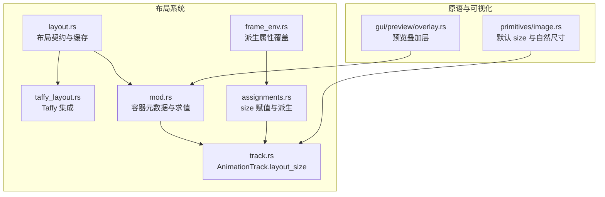
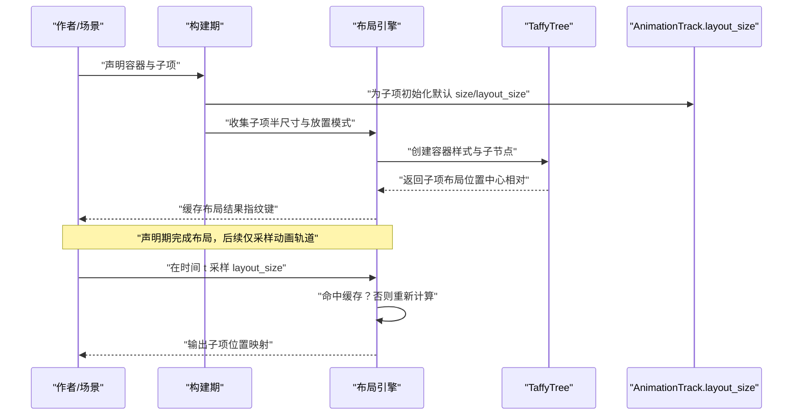
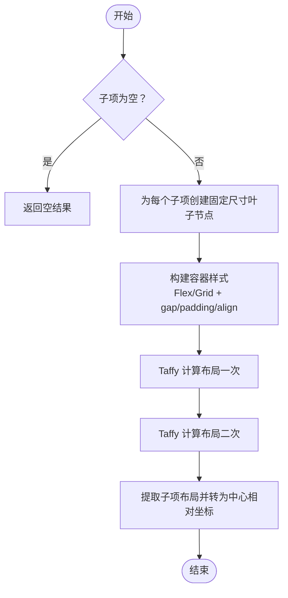
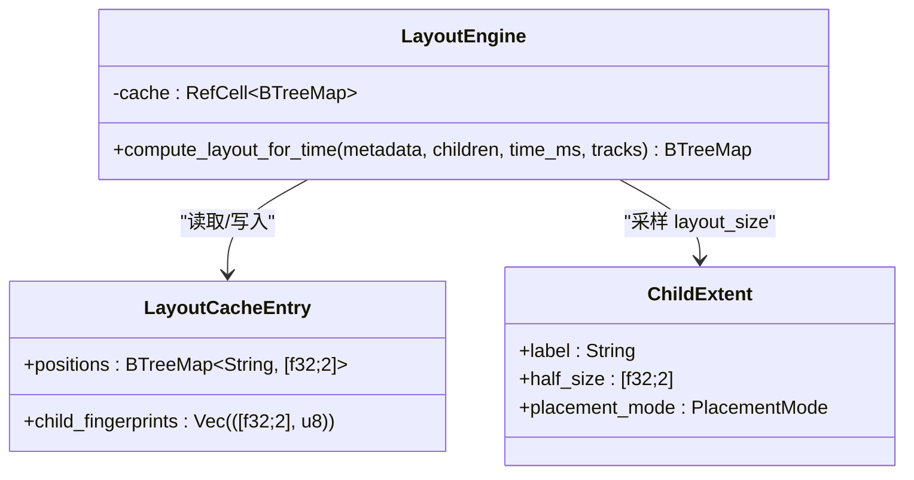
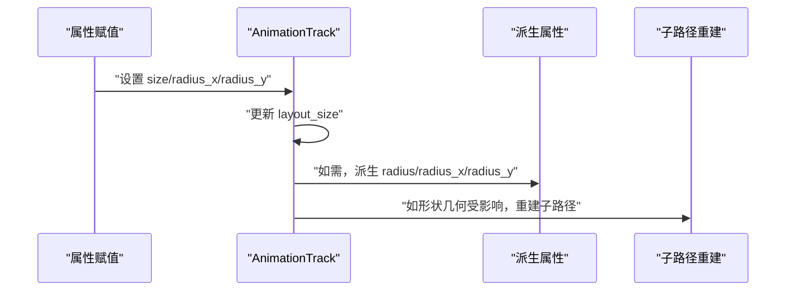
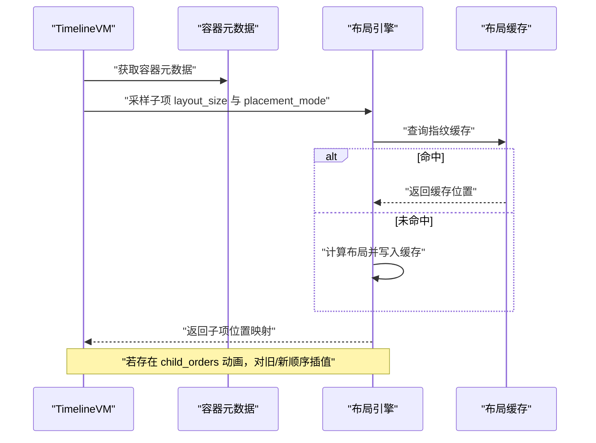
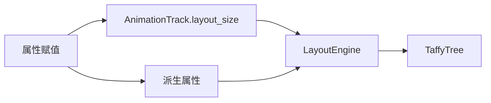

# 动态布局计算

<cite>
**本文引用的文件**
- [crates/animatix/src/timeline/taffy_layout.rs](file://crates/animatix/src/timeline/taffy_layout.rs)
- [crates/animatix/src/timeline/layout.rs](file://crates/animatix/src/timeline/layout.rs)
- [crates/animatix/src/timeline/mod.rs](file://crates/animatix/src/timeline/mod.rs)
- [crates/animatix/src/timeline/track.rs](file://crates/animatix/src/timeline/track.rs)
- [crates/animatix/src/timeline/assignments.rs](file://crates/animatix/src/timeline/assignments.rs)
- [crates/animatix/src/timeline/frame_env.rs](file://crates/animatix/src/timeline/frame_env.rs)
- [crates/animatix/src/primitives/image.rs](file://crates/animatix/src/primitives/image.rs)
- [crates/animatix-gui/src/app/preview/overlay.rs](file://crates/animatix-gui/src/app/preview/overlay.rs)
</cite>

## 目录
1. [引言](#引言)
2. [项目结构](#项目结构)
3. [核心组件](#核心组件)
4. [架构总览](#架构总览)
5. [详细组件分析](#详细组件分析)
6. [依赖关系分析](#依赖关系分析)
7. [性能考量](#性能考量)
8. [故障排查指南](#故障排查指南)
9. [结论](#结论)
10. [附录](#附录)

## 引言
本文件聚焦 Animatix 的动态布局计算能力，系统阐述其如何在声明期完成容器布局与尺寸推导，并在运行时通过动画轨道驱动位置与尺寸变化，同时保持布局结果的确定性与可预测性。Animatix 将 Taffy 布局引擎作为底层计算内核，结合自身的动画系统，实现了对 Row/Col 线性布局、Grid 网格布局以及 Stack 叠放布局的支持；并以“声明期测量、容器放置、帧内复用”的设计契约，避免了每帧重排带来的性能与一致性问题。

## 项目结构
与动态布局直接相关的核心模块位于 timeline 子系统中，围绕以下职责划分：
- 布局契约与缓存：定义“声明期测量、容器放置、帧内复用”的布局契约，并提供按子节点布局尺寸指纹的缓存机制。
- Taffy 集成：封装 Row/Col 线性布局与 Grid 网格布局的计算流程，统一输出中心相对坐标。
- 动画轨道与尺寸：通过 AnimationTrack 的 layout_size 字段记录声明期测量的半尺寸，供布局计算使用。
- 属性赋值与派生：在 size/radius 等属性赋值时同步更新 layout_size，并在需要时派生 radius_x/radius_y 等派生属性。
- 运行时求值：在指定时间点采样 layout_size，结合容器元数据与缓存，输出各子节点的位置映射。

**图示来源**
- [crates/animatix/src/timeline/layout.rs:1-29](file://crates/animatix/src/timeline/layout.rs#L1-L29)
- [crates/animatix/src/timeline/taffy_layout.rs:24-120](file://crates/animatix/src/timeline/taffy_layout.rs#L24-L120)
- [crates/animatix/src/timeline/mod.rs:247-273](file://crates/animatix/src/timeline/mod.rs#L247-L273)
- [crates/animatix/src/timeline/track.rs:712-736](file://crates/animatix/src/timeline/track.rs#L712-L736)
- [crates/animatix/src/timeline/assignments.rs:244-367](file://crates/animatix/src/timeline/assignments.rs#L244-L367)
- [crates/animatix/src/timeline/frame_env.rs:188-206](file://crates/animatix/src/timeline/frame_env.rs#L188-L206)
- [crates/animatix/src/primitives/image.rs:103-125](file://crates/animatix/src/primitives/image.rs#L103-L125)
- [crates/animatix-gui/src/app/preview/overlay.rs:248-261](file://crates/animatix-gui/src/app/preview/overlay.rs#L248-L261)

**章节来源**
- [crates/animatix/src/timeline/layout.rs:1-29](file://crates/animatix/src/timeline/layout.rs#L1-L29)
- [crates/animatix/src/timeline/taffy_layout.rs:24-120](file://crates/animatix/src/timeline/taffy_layout.rs#L24-L120)
- [crates/animatix/src/timeline/mod.rs:247-273](file://crates/animatix/src/timeline/mod.rs#L247-L273)

## 核心组件
- 布局契约与缓存（layout.rs）
  - 契约要点：声明期测量、容器放置、帧内复用、作者显式 at 覆盖、根容器默认居中等。
  - 缓存策略：基于子节点半尺寸与放置模式的指纹进行命中判断，避免重复调用 Taffy 计算。
- Taffy 集成（taffy_layout.rs）
  - 线性布局：Row/Col 使用 Flex 排版，gap/padding/align-items 对齐控制，返回中心相对坐标。
  - 网格布局：Grid 使用 grid-template-columns/rows 与 gap/padding，按列数自动铺排，返回中心相对坐标。
  - 固定叶节点样式：根据 ChildExtent 的半尺寸生成固定尺寸的叶子节点样式。
- 动画轨道与尺寸（track.rs）
  - layout_size 字段用于存储声明期测量的半尺寸，支持 evaluate/last_value/ensure 等便捷访问。
- 属性赋值与派生（assignments.rs）
  - size/radius_x/radius_y 的赋值逻辑：写入 size 同时更新 layout_size；在某些形状类型下触发子路径重建或刻度标签缩放。
- 运行时求值（mod.rs）
  - 在指定时间点采样 layout_size，结合容器元数据与缓存，输出子节点位置映射；支持 child_orders 动画过渡插值。
- 派生属性覆盖（frame_env.rs）
  - 当 size 显式覆盖时，若未显式设置 radius，则自动派生 radius 与 radius_x/y。

**章节来源**
- [crates/animatix/src/timeline/layout.rs:1-29](file://crates/animatix/src/timeline/layout.rs#L1-L29)
- [crates/animatix/src/timeline/layout.rs:134-200](file://crates/animatix/src/timeline/layout.rs#L134-L200)
- [crates/animatix/src/timeline/taffy_layout.rs:29-120](file://crates/animatix/src/timeline/taffy_layout.rs#L29-L120)
- [crates/animatix/src/timeline/taffy_layout.rs:122-215](file://crates/animatix/src/timeline/taffy_layout.rs#L122-L215)
- [crates/animatix/src/timeline/track.rs:712-736](file://crates/animatix/src/timeline/track.rs#L712-L736)
- [crates/animatix/src/timeline/assignments.rs:244-367](file://crates/animatix/src/timeline/assignments.rs#L244-L367)
- [crates/animatix/src/timeline/mod.rs:754-825](file://crates/animatix/src/timeline/mod.rs#L754-L825)
- [crates/animatix/src/timeline/frame_env.rs:188-206](file://crates/animatix/src/timeline/frame_env.rs#L188-L206)

## 架构总览
Animatix 的动态布局由“声明期测量 + 容器放置 + 帧内复用”构成，Taffy 仅参与声明期的布局计算，运行时通过动画轨道驱动位置与尺寸变化，确保布局结果稳定且可预测。

**图示来源**
- [crates/animatix/src/timeline/layout.rs:134-200](file://crates/animatix/src/timeline/layout.rs#L134-L200)
- [crates/animatix/src/timeline/taffy_layout.rs:59-120](file://crates/animatix/src/timeline/taffy_layout.rs#L59-L120)
- [crates/animatix/src/timeline/taffy_layout.rs:122-215](file://crates/animatix/src/timeline/taffy_layout.rs#L122-L215)
- [crates/animatix/src/timeline/track.rs:712-736](file://crates/animatix/src/timeline/track.rs#L712-L736)

## 详细组件分析

### 组件一：线性布局（Row/Col）与网格布局（Grid）
- 线性布局
  - 输入：子项半尺寸数组、容器类型（Row/Col）、gap、padding、align。
  - 处理：为每个子项创建固定尺寸的叶子节点样式；设置容器 Flex 方向、对齐、间距与内边距；两次计算布局以确保稳定；输出每个子项的中心相对位置。
- 网格布局
  - 输入：子项半尺寸数组、gap、padding、列数。
  - 处理：计算列宽与行高（考虑手动定位子项以保证容器尺寸正确）；设置 grid-template-columns/rows、gap、padding；为每个子项设置 grid-row/grid-column；两次计算布局；输出每个子项的中心相对位置。
- 中心相对坐标
  - 将子项绝对布局位置转换为相对于容器中心的偏移，便于与 position 轨道叠加。

**图示来源**
- [crates/animatix/src/timeline/taffy_layout.rs:59-120](file://crates/animatix/src/timeline/taffy_layout.rs#L59-L120)
- [crates/animatix/src/timeline/taffy_layout.rs:122-215](file://crates/animatix/src/timeline/taffy_layout.rs#L122-L215)

**章节来源**
- [crates/animatix/src/timeline/taffy_layout.rs:29-120](file://crates/animatix/src/timeline/taffy_layout.rs#L29-L120)
- [crates/animatix/src/timeline/taffy_layout.rs:122-215](file://crates/animatix/src/timeline/taffy_layout.rs#L122-L215)

### 组件二：布局缓存与声明期契约
- 契约
  - 声明期测量：子项将半尺寸写入 layout_size；文本、图像、SVG 等从固有边界测量。
  - 容器放置：按声明顺序、gap、padding、对齐规则放置；作者显式 at 跳过容器放置。
  - 帧内复用：同一子项半尺寸与放置模式指纹不变则复用上次布局结果。
- 缓存
  - 键：容器内子项顺序拼接字符串；值：指纹列表与位置映射。
  - 命中条件：指纹完全一致才复用；否则重新计算并写入缓存。

**图示来源**
- [crates/animatix/src/timeline/layout.rs:134-200](file://crates/animatix/src/timeline/layout.rs#L134-L200)

**章节来源**
- [crates/animatix/src/timeline/layout.rs:1-29](file://crates/animatix/src/timeline/layout.rs#L1-L29)
- [crates/animatix/src/timeline/layout.rs:134-200](file://crates/animatix/src/timeline/layout.rs#L134-L200)

### 组件三：动画轨道与尺寸推导
- layout_size 字段
  - 提供 evaluate/last_value/ensure 等便捷方法；在声明期由原语或测量过程填充。
- size 赋值与派生
  - 赋值 size 时同步更新 layout_size；在特定形状类型下触发子路径重建或刻度标签缩放。
  - 若未显式设置 radius，且 size 发生覆盖，则自动派生 radius 与 radius_x/y。

**图示来源**
- [crates/animatix/src/timeline/track.rs:712-736](file://crates/animatix/src/timeline/track.rs#L712-L736)
- [crates/animatix/src/timeline/assignments.rs:244-367](file://crates/animatix/src/timeline/assignments.rs#L244-L367)
- [crates/animatix/src/timeline/frame_env.rs:188-206](file://crates/animatix/src/timeline/frame_env.rs#L188-L206)

**章节来源**
- [crates/animatix/src/timeline/track.rs:712-736](file://crates/animatix/src/timeline/track.rs#L712-L736)
- [crates/animatix/src/timeline/assignments.rs:244-367](file://crates/animatix/src/timeline/assignments.rs#L244-L367)
- [crates/animatix/src/timeline/frame_env.rs:188-206](file://crates/animatix/src/timeline/frame_env.rs#L188-L206)

### 组件四：运行时求值与子序过渡
- 时间点求值
  - 在指定时间点采样所有子项的 layout_size 与 placement_mode，调用布局引擎计算位置映射。
- 子序过渡
  - 若存在 child_orders 动画，对旧/新顺序对应的位置进行插值，形成平滑过渡。

**图示来源**
- [crates/animatix/src/timeline/mod.rs:754-825](file://crates/animatix/src/timeline/mod.rs#L754-L825)

**章节来源**
- [crates/animatix/src/timeline/mod.rs:754-825](file://crates/animatix/src/timeline/mod.rs#L754-L825)

### 组件五：原语与默认尺寸
- 图像原语
  - 默认 size 与自然尺寸：在渲染阶段使用 size 的自然尺寸（两倍半尺寸），并支持覆盖。
- 预览叠加层
  - 在预览界面中收集子项位置与尺寸，用于可视化辅助与调试。

**章节来源**
- [crates/animatix/src/primitives/image.rs:103-125](file://crates/animatix/src/primitives/image.rs#L103-L125)
- [crates/animatix-gui/src/app/preview/overlay.rs:248-261](file://crates/animatix-gui/src/app/preview/overlay.rs#L248-L261)

## 依赖关系分析
- 布局引擎依赖 AnimationTrack 的 layout_size 字段提供半尺寸输入。
- TaffyTree 仅在声明期参与计算，运行时通过缓存与轨道采样维持高效。
- 属性赋值链路贯穿到派生属性与子路径重建，影响布局稳定性与视觉一致性。

**图示来源**
- [crates/animatix/src/timeline/track.rs:712-736](file://crates/animatix/src/timeline/track.rs#L712-L736)
- [crates/animatix/src/timeline/taffy_layout.rs:29-120](file://crates/animatix/src/timeline/taffy_layout.rs#L29-L120)
- [crates/animatix/src/timeline/assignments.rs:244-367](file://crates/animatix/src/timeline/assignments.rs#L244-L367)

**章节来源**
- [crates/animatix/src/timeline/track.rs:712-736](file://crates/animatix/src/timeline/track.rs#L712-L736)
- [crates/animatix/src/timeline/taffy_layout.rs:29-120](file://crates/animatix/src/timeline/taffy_layout.rs#L29-L120)
- [crates/animatix/src/timeline/assignments.rs:244-367](file://crates/animatix/src/timeline/assignments.rs#L244-L367)

## 性能考量
- 声明期一次性布局：Taffy 计算仅在声明期执行，运行时通过缓存与轨道采样避免每帧重排。
- 缓存命中条件严格：指纹包含半尺寸与放置模式，任何微小变化都会触发重新计算。
- 子序过渡插值：child_orders 动画采用线性插值，复杂度与子项数量线性相关，建议控制子项规模与关键帧密度。
- 尺寸变更影响范围：size 变更可能触发子路径重建与派生属性更新，应尽量减少频繁的尺寸波动。

## 故障排查指南
- 布局不随尺寸变化而更新
  - 检查是否正确写入 layout_size；确认轨道中 size 是否有动画关键帧。
  - 参考：[crates/animatix/src/timeline/track.rs:712-736](file://crates/animatix/src/timeline/track.rs#L712-L736)
- 子项被作者 at 覆盖导致不参与容器放置
  - 确认 placement_mode 与 at 的使用；显式 at 的子项不会参与容器放置。
  - 参考：[crates/animatix/src/timeline/layout.rs:1-29](file://crates/animatix/src/timeline/layout.rs#L1-L29)
- 网格列数异常或子项错位
  - 检查 cols 参数与子项数量；确认 grid 行列索引计算与模板一致。
  - 参考：[crates/animatix/src/timeline/taffy_layout.rs:122-215](file://crates/animatix/src/timeline/taffy_layout.rs#L122-L215)
- 派生属性未生效
  - 若未显式设置 radius，size 覆盖后会自动派生 radius/radius_x/y；检查覆盖逻辑与派生时机。
  - 参考：[crates/animatix/src/timeline/frame_env.rs:188-206](file://crates/animatix/src/timeline/frame_env.rs#L188-L206)
- 预览叠加层显示异常
  - 检查子项 position 与 size 的采样是否正确；确认预览叠加层的数据收集逻辑。
  - 参考：[crates/animatix-gui/src/app/preview/overlay.rs:248-261](file://crates/animatix-gui/src/app/preview/overlay.rs#L248-L261)

**章节来源**
- [crates/animatix/src/timeline/layout.rs:1-29](file://crates/animatix/src/timeline/layout.rs#L1-L29)
- [crates/animatix/src/timeline/taffy_layout.rs:122-215](file://crates/animatix/src/timeline/taffy_layout.rs#L122-L215)
- [crates/animatix/src/timeline/frame_env.rs:188-206](file://crates/animatix/src/timeline/frame_env.rs#L188-L206)
- [crates/animatix-gui/src/app/preview/overlay.rs:248-261](file://crates/animatix-gui/src/app/preview/overlay.rs#L248-L261)

## 结论
Animatix 通过“声明期测量 + 容器放置 + 帧内复用”的布局契约，将 Taffy 的强大排版能力与自身的动画系统无缝整合。该设计在保证布局确定性的同时，允许在运行时通过动画轨道灵活调整尺寸与位置，兼顾了易用性与性能。对于复杂场景，建议合理使用缓存、控制子项数量与关键帧密度，并注意尺寸变更对派生属性与子路径的影响。

## 附录
- 关键流程路径参考
  - 线性布局计算入口：[crates/animatix/src/timeline/taffy_layout.rs:59-120](file://crates/animatix/src/timeline/taffy_layout.rs#L59-L120)
  - 网格布局计算入口：[crates/animatix/src/timeline/taffy_layout.rs:122-215](file://crates/animatix/src/timeline/taffy_layout.rs#L122-L215)
  - 布局缓存与求值：[crates/animatix/src/timeline/layout.rs:134-200](file://crates/animatix/src/timeline/layout.rs#L134-L200)
  - 运行时子序过渡：[crates/animatix/src/timeline/mod.rs:754-825](file://crates/animatix/src/timeline/mod.rs#L754-L825)
  - 尺寸赋值与派生：[crates/animatix/src/timeline/assignments.rs:244-367](file://crates/animatix/src/timeline/assignments.rs#L244-L367)
  - 默认尺寸与自然尺寸：[crates/animatix/src/primitives/image.rs:103-125](file://crates/animatix/src/primitives/image.rs#L103-L125)