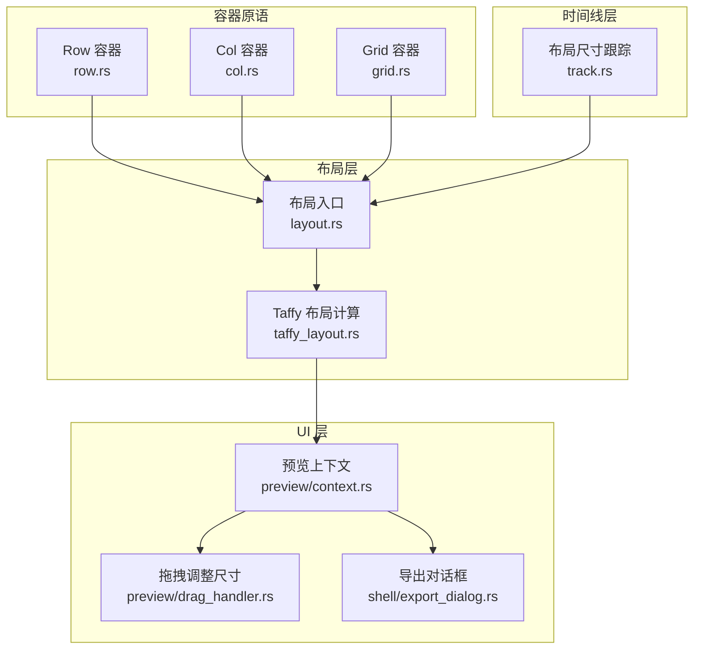
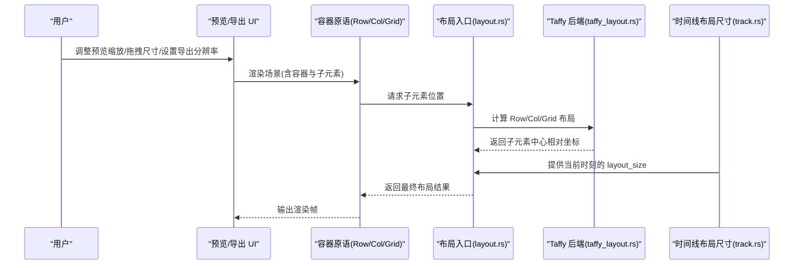
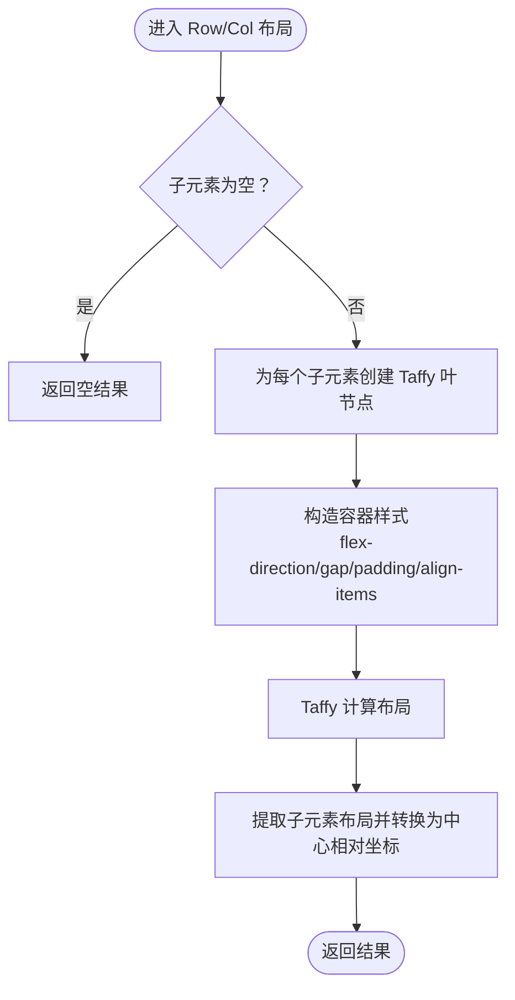
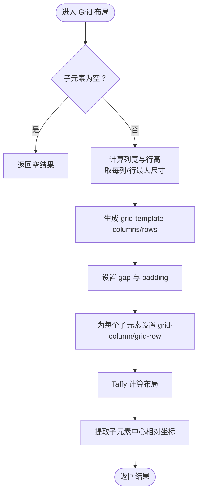
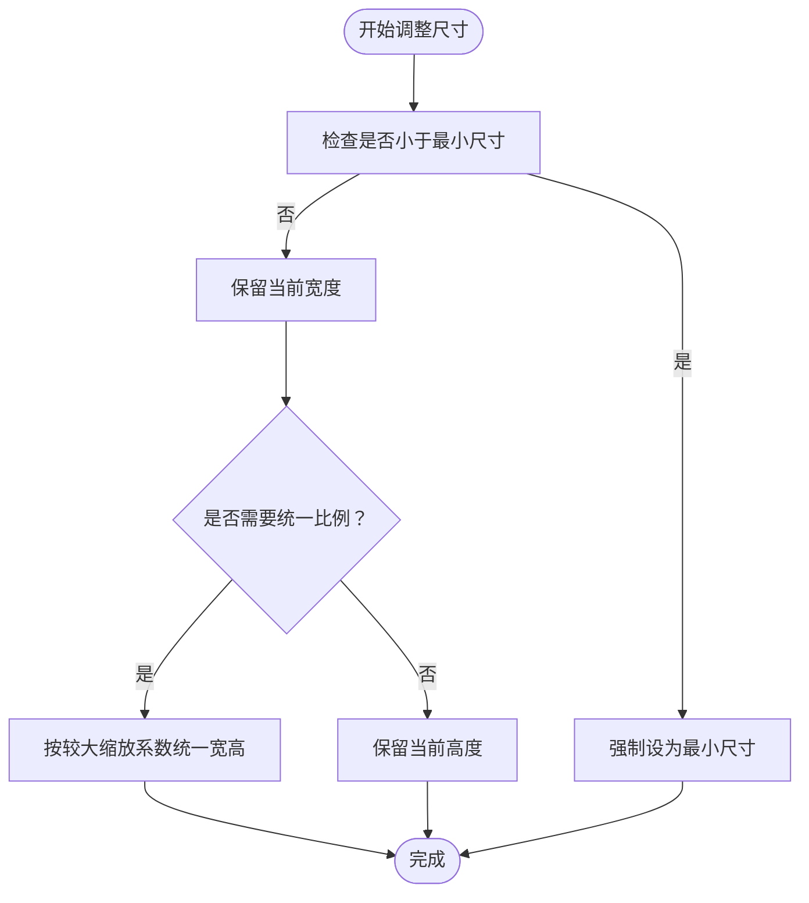
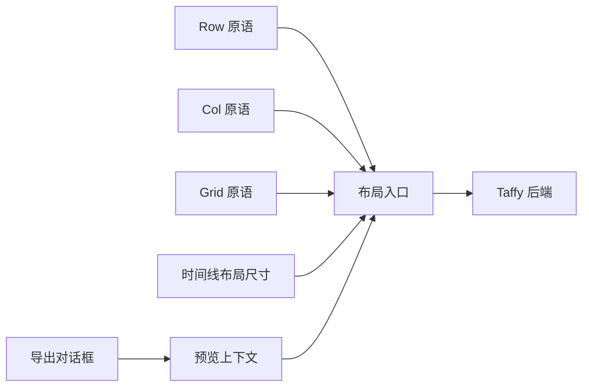

# 响应式设计

<cite>
**本文引用的文件**
- [crates/animatix/src/timeline/taffy_layout.rs](file://crates/animatix/src/timeline/taffy_layout.rs)
- [crates/animatix/src/timeline/layout.rs](file://crates/animatix/src/timeline/layout.rs)
- [crates/animatix/src/timeline/track.rs](file://crates/animatix/src/timeline/track.rs)
- [crates/animatix/src/primitives/row.rs](file://crates/animatix/src/primitives/row.rs)
- [crates/animatix/src/primitives/col.rs](file://crates/animatix/src/primitives/col.rs)
- [crates/animatix/src/primitives/grid.rs](file://crates/animatix/src/primitives/grid.rs)
- [crates/animatix-gui/src/app/preview/context.rs](file://crates/animatix-gui/src/app/preview/context.rs)
- [crates/animatix-gui/src/app/preview/drag_handler.rs](file://crates/animatix-gui/src/app/preview/drag_handler.rs)
- [crates/animatix-gui/src/app/shell/export_dialog.rs](file://crates/animatix-gui/src/app/shell/export_dialog.rs)
- [docs/architecture.md](file://docs/architecture.md)
- [examples/02_layout.amx](file://examples/02_layout.amx)
- [examples/16_showcase.amx](file://examples/16_showcase.amx)
</cite>

## 目录
1. [引言](#引言)
2. [项目结构](#项目结构)
3. [核心组件](#核心组件)
4. [架构总览](#架构总览)
5. [详细组件分析](#详细组件分析)
6. [依赖关系分析](#依赖关系分析)
7. [性能考量](#性能考量)
8. [故障排查指南](#故障排查指南)
9. [结论](#结论)
10. [附录](#附录)

## 引言
本文件面向希望在 Animatix 中构建“自适应布局与多屏幕适配”的开发者与设计师，系统阐述断点系统、弹性布局与流式布局的实现原理，并结合实际示例说明如何在不同分辨率与设备上保持一致的动画界面表现。文档同时覆盖媒体查询、尺寸约束与布局回退策略的应用方法，并总结性能优化与兼容性最佳实践。

## 项目结构
Animatix 的响应式能力由“布局引擎 + 时间线属性 + 预览与导出交互”三部分协同实现：
- 布局引擎：基于 Taffy 的 Flex/Grid 计算，统一输出容器内子元素的中心相对坐标，确保跨设备的一致性。
- 时间线属性：通过可随时间演化的尺寸与位置属性，支持动态布局与响应式动画。
- 预览与导出：提供预览画布缩放/平移、拖拽调整尺寸、导出分辨率设置等交互，便于在不同屏幕与分辨率下验证布局。

图表来源
- [crates/animatix/src/timeline/taffy_layout.rs:1-319](file://crates/animatix/src/timeline/taffy_layout.rs#L1-L319)
- [crates/animatix/src/timeline/layout.rs:66-101](file://crates/animatix/src/timeline/layout.rs#L66-L101)
- [crates/animatix/src/timeline/track.rs:740-756](file://crates/animatix/src/timeline/track.rs#L740-L756)
- [crates/animatix/src/primitives/row.rs:1-49](file://crates/animatix/src/primitives/row.rs#L1-L49)
- [crates/animatix/src/primitives/col.rs:1-49](file://crates/animatix/src/primitives/col.rs#L1-L49)
- [crates/animatix/src/primitives/grid.rs:1-50](file://crates/animatix/src/primitives/grid.rs#L1-L50)
- [crates/animatix-gui/src/app/preview/context.rs:821-862](file://crates/animatix-gui/src/app/preview/context.rs#L821-L862)
- [crates/animatix-gui/src/app/preview/drag_handler.rs:530-551](file://crates/animatix-gui/src/app/preview/drag_handler.rs#L530-L551)
- [crates/animatix-gui/src/app/shell/export_dialog.rs:388-432](file://crates/animatix-gui/src/app/shell/export_dialog.rs#L388-L432)

章节来源
- [crates/animatix/src/timeline/taffy_layout.rs:1-319](file://crates/animatix/src/timeline/taffy_layout.rs#L1-L319)
- [crates/animatix/src/timeline/layout.rs:66-101](file://crates/animatix/src/timeline/layout.rs#L66-L101)
- [crates/animatix/src/timeline/track.rs:740-756](file://crates/animatix/src/timeline/track.rs#L740-L756)
- [crates/animatix/src/primitives/row.rs:1-49](file://crates/animatix/src/primitives/row.rs#L1-L49)
- [crates/animatix/src/primitives/col.rs:1-49](file://crates/animatix/src/primitives/col.rs#L1-L49)
- [crates/animatix/src/primitives/grid.rs:1-50](file://crates/animatix/src/primitives/grid.rs#L1-L50)
- [crates/animatix-gui/src/app/preview/context.rs:821-862](file://crates/animatix-gui/src/app/preview/context.rs#L821-L862)
- [crates/animatix-gui/src/app/preview/drag_handler.rs:530-551](file://crates/animatix-gui/src/app/preview/drag_handler.rs#L530-L551)
- [crates/animatix-gui/src/app/shell/export_dialog.rs:388-432](file://crates/animatix-gui/src/app/shell/export_dialog.rs#L388-L432)

## 核心组件
- Taffy 布局后端：负责 Row/Col 线性布局与 Grid 网格布局的计算，输出子元素的中心相对坐标，保证容器尺寸变化时的视觉一致性。
- 布局入口：封装 Row/Col/Grid 的布局调用，统一返回子元素相对容器中心的位置数组。
- 时间线布局尺寸跟踪：为容器提供可随时间演化的 layout_size 属性，支持动态布局与响应式动画。
- 容器原语：Row/Col/Grid 提供 gap、padding、align 等属性，作为断点与响应式的基础配置项。
- 预览与导出交互：提供缩放/平移、拖拽调整尺寸、导出分辨率设置，用于在不同屏幕与分辨率下验证布局。

章节来源
- [crates/animatix/src/timeline/taffy_layout.rs:1-319](file://crates/animatix/src/timeline/taffy_layout.rs#L1-L319)
- [crates/animatix/src/timeline/layout.rs:66-101](file://crates/animatix/src/timeline/layout.rs#L66-L101)
- [crates/animatix/src/timeline/track.rs:740-756](file://crates/animatix/src/timeline/track.rs#L740-L756)
- [crates/animatix/src/primitives/row.rs:1-49](file://crates/animatix/src/primitives/row.rs#L1-L49)
- [crates/animatix/src/primitives/col.rs:1-49](file://crates/animatix/src/primitives/col.rs#L1-L49)
- [crates/animatix/src/primitives/grid.rs:1-50](file://crates/animatix/src/primitives/grid.rs#L1-L50)
- [crates/animatix-gui/src/app/preview/context.rs:821-862](file://crates/animatix-gui/src/app/preview/context.rs#L821-L862)
- [crates/animatix-gui/src/app/preview/drag_handler.rs:530-551](file://crates/animatix-gui/src/app/preview/drag_handler.rs#L530-L551)
- [crates/animatix-gui/src/app/shell/export_dialog.rs:388-432](file://crates/animatix-gui/src/app/shell/export_dialog.rs#L388-L432)

## 架构总览
Animatix 的响应式路径从“容器原语”出发，经“布局入口”调用“Taffy 后端”，再结合“时间线布局尺寸跟踪”与“预览/导出交互”，形成完整的自适应闭环。

图表来源
- [crates/animatix/src/timeline/layout.rs:66-101](file://crates/animatix/src/timeline/layout.rs#L66-L101)
- [crates/animatix/src/timeline/taffy_layout.rs:1-319](file://crates/animatix/src/timeline/taffy_layout.rs#L1-L319)
- [crates/animatix/src/timeline/track.rs:740-756](file://crates/animatix/src/timeline/track.rs#L740-L756)
- [crates/animatix/src/primitives/row.rs:1-49](file://crates/animatix/src/primitives/row.rs#L1-L49)
- [crates/animatix/src/primitives/col.rs:1-49](file://crates/animatix/src/primitives/col.rs#L1-L49)
- [crates/animatix/src/primitives/grid.rs:1-50](file://crates/animatix/src/primitives/grid.rs#L1-L50)
- [crates/animatix-gui/src/app/preview/context.rs:821-862](file://crates/animatix-gui/src/app/preview/context.rs#L821-L862)
- [crates/animatix-gui/src/app/shell/export_dialog.rs:388-432](file://crates/animatix-gui/src/app/shell/export_dialog.rs#L388-L432)

## 详细组件分析

### 断点系统与媒体查询
- 断点定义：通过容器属性（如 gap、padding、align、cols）与时间线属性（layout_size）组合，可在不同时间点切换布局策略，实现“基于时间”的断点效果。
- 媒体查询：在 Animatix 中以“时间轴上的属性变化”模拟媒体查询行为；例如在特定时间点改变 cols 或 align，即可在不同播放阶段呈现不同布局。
- 实践建议：
  - 使用时间线属性驱动容器尺寸与间距，避免硬编码绝对值。
  - 在关键帧处切换容器类型或列数，形成自然的断点过渡。

章节来源
- [crates/animatix/src/timeline/track.rs:740-756](file://crates/animatix/src/timeline/track.rs#L740-L756)
- [crates/animatix/src/primitives/grid.rs:42-49](file://crates/animatix/src/primitives/grid.rs#L42-L49)
- [crates/animatix/src/primitives/row.rs:42-48](file://crates/animatix/src/primitives/row.rs#L42-L48)
- [crates/animatix/src/primitives/col.rs:42-48](file://crates/animatix/src/primitives/col.rs#L42-L48)

### 弹性布局（Row/Col）
- 行/列布局采用 Flexbox 思想，支持主轴排列、交叉轴对齐与间距控制。
- 关键点：
  - 主轴方向由 Row/Col 决定。
  - 对齐方式通过 align 控制（start/end/center）。
  - 间距 gap 与内边距 padding 统一映射到 Taffy 的 gap 与 padding。
- 动态布局：当启用动态布局时，容器会在每帧根据 layout_size 重新采样并重算子元素位置，但容器成员与顺序保持静态。

图表来源
- [crates/animatix/src/timeline/taffy_layout.rs:59-120](file://crates/animatix/src/timeline/taffy_layout.rs#L59-L120)
- [crates/animatix/src/timeline/taffy_layout.rs:81-106](file://crates/animatix/src/timeline/taffy_layout.rs#L81-L106)

章节来源
- [crates/animatix/src/timeline/taffy_layout.rs:59-120](file://crates/animatix/src/timeline/taffy_layout.rs#L59-L120)
- [crates/animatix/src/timeline/taffy_layout.rs:81-106](file://crates/animatix/src/timeline/taffy_layout.rs#L81-L106)
- [docs/architecture.md:143-146](file://docs/architecture.md#L143-L146)

### 流式布局（Grid）
- 网格布局按列数自动换行，子元素按声明顺序填充网格单元。
- 关键点：
  - 列数 cols 由容器属性决定，行数按元素数量与列数推导。
  - 每个网格单元的宽高取该列/行中所有子元素对应维度的最大值，保证视觉对齐。
  - 间距 gap 与内边距 padding 映射到 Taffy 的 grid-template-columns/rows 与 gap/padding。
- 动态布局：同弹性布局，启用动态布局时每帧根据 layout_size 重算。

图表来源
- [crates/animatix/src/timeline/taffy_layout.rs:123-215](file://crates/animatix/src/timeline/taffy_layout.rs#L123-L215)
- [crates/animatix/src/timeline/taffy_layout.rs:218-238](file://crates/animatix/src/timeline/taffy_layout.rs#L218-L238)

章节来源
- [crates/animatix/src/timeline/taffy_layout.rs:123-215](file://crates/animatix/src/timeline/taffy_layout.rs#L123-L215)
- [crates/animatix/src/timeline/taffy_layout.rs:218-238](file://crates/animatix/src/timeline/taffy_layout.rs#L218-L238)
- [crates/animatix/src/primitives/grid.rs:42-49](file://crates/animatix/src/primitives/grid.rs#L42-L49)

### 尺寸约束与布局回退策略
- 尺寸约束：
  - 预览画布缩放/平移时，使用 clamp_pan_value 限制可视范围，避免越界。
  - 拖拽调整尺寸时，强制最小尺寸与统一比例（可选），防止布局被过度压缩。
- 回退策略：
  - 当容器无显式尺寸时，回退到基于子元素内容的计算结果。
  - 当启用动态布局时，若某时刻 layout_size 未设置，则回退到最近一次有效值。

图表来源
- [crates/animatix-gui/src/app/preview/drag_handler.rs:530-551](file://crates/animatix-gui/src/app/preview/drag_handler.rs#L530-L551)

章节来源
- [crates/animatix-gui/src/app/preview/context.rs:821-862](file://crates/animatix-gui/src/app/preview/context.rs#L821-L862)
- [crates/animatix-gui/src/app/preview/drag_handler.rs:530-551](file://crates/animatix-gui/src/app/preview/drag_handler.rs#L530-L551)
- [crates/animatix/src/timeline/track.rs:740-756](file://crates/animatix/src/timeline/track.rs#L740-L756)

### 多屏幕适配与导出
- 导出分辨率：在导出对话框中可设置目标宽高，亦可一键匹配场景原始尺寸，确保在不同设备与平台上的稳定输出。
- 预览适配：通过预览画布的缩放与平移，快速验证在小屏/大屏下的布局表现。

章节来源
- [crates/animatix-gui/src/app/shell/export_dialog.rs:388-432](file://crates/animatix-gui/src/app/shell/export_dialog.rs#L388-L432)
- [crates/animatix-gui/src/app/preview/context.rs:821-862](file://crates/animatix-gui/src/app/preview/context.rs#L821-L862)

### 示例参考
- 布局示例：通过示例文件中的容器与属性设置，观察 Row/Col/Grid 在不同参数下的布局行为。
- 展示示例：综合演示多种容器与动画效果，便于在不同分辨率下对比布局表现。

章节来源
- [examples/02_layout.amx](file://examples/02_layout.amx)
- [examples/16_showcase.amx](file://examples/16_showcase.amx)

## 依赖关系分析
- 容器原语依赖布局入口；布局入口依赖 Taffy 后端；时间线布局尺寸跟踪为布局提供动态数据源。
- 预览与导出交互依赖场景尺寸与预览画布状态，间接影响布局计算的输入条件。

图表来源
- [crates/animatix/src/timeline/layout.rs:66-101](file://crates/animatix/src/timeline/layout.rs#L66-L101)
- [crates/animatix/src/timeline/taffy_layout.rs:1-319](file://crates/animatix/src/timeline/taffy_layout.rs#L1-L319)
- [crates/animatix/src/timeline/track.rs:740-756](file://crates/animatix/src/timeline/track.rs#L740-L756)
- [crates/animatix/src/primitives/row.rs:1-49](file://crates/animatix/src/primitives/row.rs#L1-L49)
- [crates/animatix/src/primitives/col.rs:1-49](file://crates/animatix/src/primitives/col.rs#L1-L49)
- [crates/animatix/src/primitives/grid.rs:1-50](file://crates/animatix/src/primitives/grid.rs#L1-L50)
- [crates/animatix-gui/src/app/preview/context.rs:821-862](file://crates/animatix-gui/src/app/preview/context.rs#L821-L862)
- [crates/animatix-gui/src/app/shell/export_dialog.rs:388-432](file://crates/animatix-gui/src/app/shell/export_dialog.rs#L388-L432)

章节来源
- [crates/animatix/src/timeline/layout.rs:66-101](file://crates/animatix/src/timeline/layout.rs#L66-L101)
- [crates/animatix/src/timeline/taffy_layout.rs:1-319](file://crates/animatix/src/timeline/taffy_layout.rs#L1-L319)
- [crates/animatix/src/timeline/track.rs:740-756](file://crates/animatix/src/timeline/track.rs#L740-L756)
- [crates/animatix/src/primitives/row.rs:1-49](file://crates/animatix/src/primitives/row.rs#L1-L49)
- [crates/animatix/src/primitives/col.rs:1-49](file://crates/animatix/src/primitives/col.rs#L1-L49)
- [crates/animatix/src/primitives/grid.rs:1-50](file://crates/animatix/src/primitives/grid.rs#L1-L50)
- [crates/animatix-gui/src/app/preview/context.rs:821-862](file://crates/animatix-gui/src/app/preview/context.rs#L821-L862)
- [crates/animatix-gui/src/app/shell/export_dialog.rs:388-432](file://crates/animatix-gui/src/app/shell/export_dialog.rs#L388-L432)

## 性能考量
- 布局缓存：布局入口提供缓存条目结构，可通过指纹化输入减少重复计算。
- 动态布局成本：启用动态布局时，每帧需根据 layout_size 重算布局，建议在复杂场景中谨慎使用或进行必要的节流。
- 最小化重排：尽量通过时间线属性驱动布局而非频繁变更容器成员；合理设置 gap/padding，避免过大的网格尺寸导致计算开销。
- 预览与导出：在预览中适度降低计算复杂度，在导出时选择合适的分辨率以平衡质量与体积。

章节来源
- [crates/animatix/src/timeline/layout.rs:86-101](file://crates/animatix/src/timeline/layout.rs#L86-L101)
- [docs/architecture.md:143-146](file://docs/architecture.md#L143-L146)

## 故障排查指南
- 子元素位置异常：确认容器是否启用了动态布局，以及 layout_size 是否在目标时间点有值；检查手动定位子元素是否参与了容器尺寸计算。
- 预览越界：检查 clamp_pan_value 的边界逻辑，确保场景尺寸与预览画布尺寸比例合理。
- 拖拽尺寸无效：检查最小尺寸阈值与统一比例模式，确保约束条件符合预期。

章节来源
- [crates/animatix/src/timeline/track.rs:740-756](file://crates/animatix/src/timeline/track.rs#L740-L756)
- [crates/animatix-gui/src/app/preview/context.rs:821-862](file://crates/animatix-gui/src/app/preview/context.rs#L821-L862)
- [crates/animatix-gui/src/app/preview/drag_handler.rs:530-551](file://crates/animatix-gui/src/app/preview/drag_handler.rs#L530-L551)

## 结论
Animatix 通过 Taffy 布局后端与时间线属性的结合，提供了灵活且高效的自适应布局方案。借助容器属性与时间轴断点，可在不同分辨率与设备上实现一致的动画界面体验；配合预览与导出交互，能够快速验证与稳定输出。实践中建议优先使用时间线驱动的断点与动态布局，并结合缓存与性能优化策略，以获得更佳的开发与运行效率。

## 附录
- 进一步阅读：可参考文档中的动态布局说明与示例文件，加深对容器与动画在不同时间点表现的理解。

章节来源
- [docs/architecture.md:143-146](file://docs/architecture.md#L143-L146)
- [examples/02_layout.amx](file://examples/02_layout.amx)
- [examples/16_showcase.amx](file://examples/16_showcase.amx)