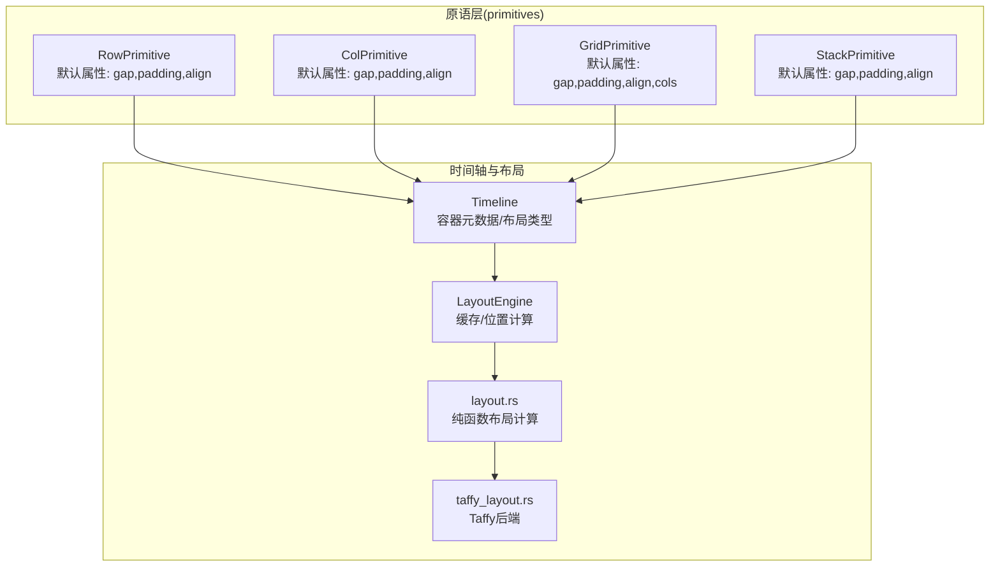
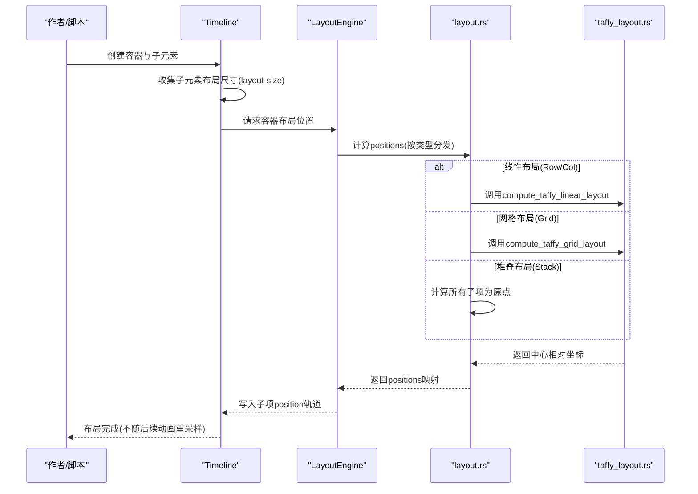
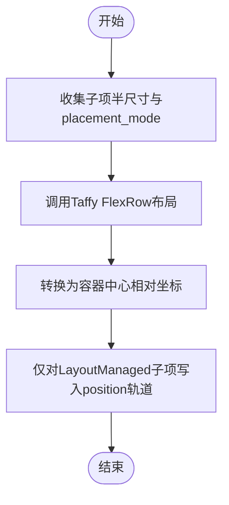
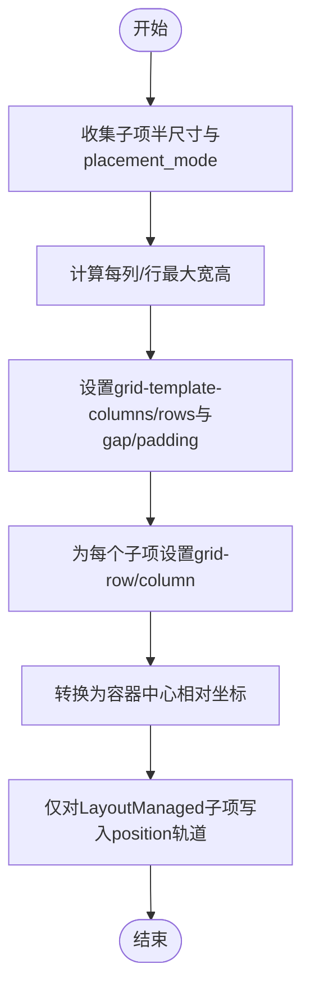
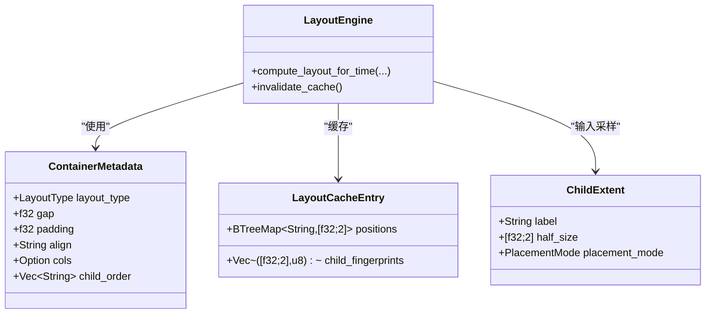
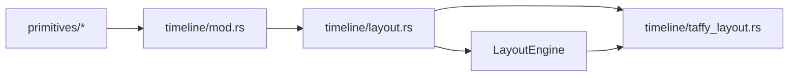

# 容器布局

<cite>
**本文引用的文件**   
- [crates/animatix/src/primitives/row.rs](file://crates/animatix/src/primitives/row.rs)
- [crates/animatix/src/primitives/col.rs](file://crates/animatix/src/primitives/col.rs)
- [crates/animatix/src/primitives/grid.rs](file://crates/animatix/src/primitives/grid.rs)
- [crates/animatix/src/primitives/stack.rs](file://crates/animatix/src/primitives/stack.rs)
- [crates/animatix/src/timeline/layout.rs](file://crates/animatix/src/timeline/layout.rs)
- [crates/animatix/src/timeline/taffy_layout.rs](file://crates/animatix/src/timeline/taffy_layout.rs)
- [crates/animatix/src/timeline/mod.rs](file://crates/animatix/src/timeline/mod.rs)
- [examples/02_layout.amx](file://examples/02_layout.amx)
- [docs/primitives.md](file://docs/primitives.md)
</cite>

## 目录
1. [引言](#引言)
2. [项目结构](#项目结构)
3. [核心组件](#核心组件)
4. [架构总览](#架构总览)
5. [详细组件分析](#详细组件分析)
6. [依赖关系分析](#依赖关系分析)
7. [性能考量](#性能考量)
8. [故障排查指南](#故障排查指南)
9. [结论](#结论)
10. [附录](#附录)

## 引言
本文件系统性梳理 Animatix 的容器布局体系，重点覆盖 Row（行）、Col（列）、Grid（网格）、Stack（堆叠）四大容器。内容涵盖：
- 布局契约与实现原理：声明期测量与放置、Taffy 引擎集成、缓存策略与性能权衡
- 属性配置与适用场景：gap、padding、align、cols 等参数的作用边界
- 复杂布局模式：多级嵌套、混合布局、根容器默认定位、手动定位子元素
- 动画场景中的使用：如何在时间轴上稳定地组织视觉元素
- 性能优化与最佳实践：缓存命中、避免重复计算、合理设置尺寸与对齐

## 项目结构
容器布局相关代码主要分布在以下模块：
- primitives 层：定义 Row/Col/Grid/Stack 的类型与默认属性
- timeline.layout：容器布局的核心算法与缓存
- timeline.taffy_layout：基于 Taffy 的线性布局与网格布局实现
- timeline.mod：容器元数据、布局类型枚举、布局引擎等
- 示例与文档：02_layout.amx 演示四种容器；primitives.md 提供容器属性说明

**图示来源**
- [crates/animatix/src/primitives/row.rs:14-48](file://crates/animatix/src/primitives/row.rs#L14-L48)
- [crates/animatix/src/primitives/col.rs:14-48](file://crates/animatix/src/primitives/col.rs#L14-L48)
- [crates/animatix/src/primitives/grid.rs:14-49](file://crates/animatix/src/primitives/grid.rs#L14-L49)
- [crates/animatix/src/primitives/stack.rs:14-48](file://crates/animatix/src/primitives/stack.rs#L14-L48)
- [crates/animatix/src/timeline/mod.rs:247-339](file://crates/animatix/src/timeline/mod.rs#L247-L339)
- [crates/animatix/src/timeline/layout.rs:107-200](file://crates/animatix/src/timeline/layout.rs#L107-L200)
- [crates/animatix/src/timeline/taffy_layout.rs:53-215](file://crates/animatix/src/timeline/taffy_layout.rs#L53-L215)

**章节来源**
- [crates/animatix/src/primitives/row.rs:1-50](file://crates/animatix/src/primitives/row.rs#L1-L50)
- [crates/animatix/src/primitives/col.rs:1-50](file://crates/animatix/src/primitives/col.rs#L1-L50)
- [crates/animatix/src/primitives/grid.rs:1-51](file://crates/animatix/src/primitives/grid.rs#L1-L51)
- [crates/animatix/src/primitives/stack.rs:1-50](file://crates/animatix/src/primitives/stack.rs#L1-L50)
- [crates/animatix/src/timeline/layout.rs:1-310](file://crates/animatix/src/timeline/layout.rs#L1-L310)
- [crates/animatix/src/timeline/taffy_layout.rs:1-320](file://crates/animatix/src/timeline/taffy_layout.rs#L1-L320)
- [crates/animatix/src/timeline/mod.rs:247-339](file://crates/animatix/src/timeline/mod.rs#L247-L339)

## 核心组件
- RowPrimitive/ColPrimitive/GridPrimitive/StackPrimitive：定义容器类型、图标、分类、是否为容器、默认属性集合
- ContainerMetadata：容器元数据，包含布局类型、gap、padding、align、cols、子顺序等
- LayoutEngine：布局引擎，负责缓存与按时间采样计算位置
- layout.rs：纯函数布局计算入口，分发到线性或网格布局
- taffy_layout.rs：基于 Taffy 的线性/网格布局实现，保持中心相对坐标语义

关键点：
- 默认属性均支持动画，但布局本身是“声明期测量+放置”，不随后续动画重新采样
- 手动定位子元素（placement_mode=Manual）参与容器尺寸计算但不被容器分配位置
- 根容器未显式 at 时，默认位于场景中心

**章节来源**
- [crates/animatix/src/primitives/row.rs:14-48](file://crates/animatix/src/primitives/row.rs#L14-L48)
- [crates/animatix/src/primitives/col.rs:14-48](file://crates/animatix/src/primitives/col.rs#L14-L48)
- [crates/animatix/src/primitives/grid.rs:14-49](file://crates/animatix/src/primitives/grid.rs#L14-L49)
- [crates/animatix/src/primitives/stack.rs:14-48](file://crates/animatix/src/primitives/stack.rs#L14-L48)
- [crates/animatix/src/timeline/mod.rs:247-339](file://crates/animatix/src/timeline/mod.rs#L247-L339)
- [crates/animatix/src/timeline/layout.rs:107-200](file://crates/animatix/src/timeline/layout.rs#L107-L200)
- [crates/animatix/src/timeline/taffy_layout.rs:53-215](file://crates/animatix/src/timeline/taffy_layout.rs#L53-L215)

## 架构总览
容器布局遵循“声明期测量与放置”的契约：容器在构建时读取每个子项的布局尺寸（layout-size），并根据 gap/padding/align/cols 等参数确定子项位置，随后将这些位置写入子项的位置轨道（position）。该过程不随后续动画重新采样，以换取可预测性与性能。

**图示来源**
- [crates/animatix/src/timeline/layout.rs:134-200](file://crates/animatix/src/timeline/layout.rs#L134-L200)
- [crates/animatix/src/timeline/taffy_layout.rs:53-215](file://crates/animatix/src/timeline/taffy_layout.rs#L53-L215)

**章节来源**
- [crates/animatix/src/timeline/layout.rs:1-310](file://crates/animatix/src/timeline/layout.rs#L1-L310)
- [crates/animatix/src/timeline/taffy_layout.rs:1-320](file://crates/animatix/src/timeline/taffy_layout.rs#L1-L320)

## 详细组件分析

### Row 容器
- 角色：水平线性排列容器
- 默认属性：gap、padding、align（start/center/end）
- 行为：使用 Taffy 的 FlexRow 计算，gap 映射为间距，padding 映射为内边距，align 控制交叉轴对齐
- 适用场景：工具栏、按钮组、横向卡片流

**图示来源**
- [crates/animatix/src/timeline/layout.rs:53-68](file://crates/animatix/src/timeline/layout.rs#L53-L68)
- [crates/animatix/src/timeline/taffy_layout.rs:59-120](file://crates/animatix/src/timeline/taffy_layout.rs#L59-L120)

**章节来源**
- [crates/animatix/src/primitives/row.rs:14-48](file://crates/animatix/src/primitives/row.rs#L14-L48)
- [crates/animatix/src/timeline/layout.rs:53-68](file://crates/animatix/src/timeline/layout.rs#L53-L68)
- [crates/animatix/src/timeline/taffy_layout.rs:59-120](file://crates/animatix/src/timeline/taffy_layout.rs#L59-L120)

### Col 容器
- 角色：垂直线性排列容器
- 默认属性：gap、padding、align
- 行为：使用 Taffy 的 FlexCol 计算，其余同 Row

**章节来源**
- [crates/animatix/src/primitives/col.rs:14-48](file://crates/animatix/src/primitives/col.rs#L14-L48)
- [crates/animatix/src/timeline/layout.rs:53-68](file://crates/animatix/src/timeline/layout.rs#L53-L68)
- [crates/animatix/src/timeline/taffy_layout.rs:59-120](file://crates/animatix/src/timeline/taffy_layout.rs#L59-L120)

### Grid 容器
- 角色：二维网格排列容器
- 默认属性：gap、padding、align、cols
- 行为：使用 Taffy Grid 计算，按 cols 自动推导行列，子项按声明顺序填充网格单元
- 适用场景：相册网格、仪表盘、规则化布局

**图示来源**
- [crates/animatix/src/timeline/layout.rs:72-80](file://crates/animatix/src/timeline/layout.rs#L72-L80)
- [crates/animatix/src/timeline/taffy_layout.rs:123-215](file://crates/animatix/src/timeline/taffy_layout.rs#L123-L215)

**章节来源**
- [crates/animatix/src/primitives/grid.rs:14-49](file://crates/animatix/src/primitives/grid.rs#L14-L49)
- [crates/animatix/src/timeline/layout.rs:72-80](file://crates/animatix/src/timeline/layout.rs#L72-L80)
- [crates/animatix/src/timeline/taffy_layout.rs:123-215](file://crates/animatix/src/timeline/taffy_layout.rs#L123-L215)

### Stack 容器
- 角色：层叠容器，所有子项共享原点
- 默认属性：gap、padding、align
- 行为：直接返回原点位置；适合叠加背景、前景等需要对齐的元素

**章节来源**
- [crates/animatix/src/primitives/stack.rs:14-48](file://crates/animatix/src/primitives/stack.rs#L14-L48)
- [crates/animatix/src/timeline/layout.rs:47-49](file://crates/animatix/src/timeline/layout.rs#L47-L49)

### 布局算法与缓存
- 输入：每个子项的半尺寸 [w,h] 与 placement_mode
- 输出：每个 LayoutManaged 子项的中心相对坐标
- 缓存键：容器子序拼接字符串；指纹：(半尺寸, placement_mode索引) 列表
- 命中条件：指纹完全一致且容器子序未变化

**图示来源**
- [crates/animatix/src/timeline/mod.rs:275-314](file://crates/animatix/src/timeline/mod.rs#L275-L314)
- [crates/animatix/src/timeline/layout.rs:86-93](file://crates/animatix/src/timeline/layout.rs#L86-L93)
- [crates/animatix/src/timeline/layout.rs:140-200](file://crates/animatix/src/timeline/layout.rs#L140-L200)

**章节来源**
- [crates/animatix/src/timeline/layout.rs:86-200](file://crates/animatix/src/timeline/layout.rs#L86-L200)
- [crates/animatix/src/timeline/mod.rs:275-314](file://crates/animatix/src/timeline/mod.rs#L275-L314)

### 属性配置与适用场景
- gap：子项间间距（像素）
- padding：容器内边距（像素）
- align：交叉轴对齐（start/center/end）
- cols：网格列数（仅 Grid）

参考文档与示例：
- 官方文档列出各容器属性与状态
- 示例场景展示四种容器与动画的组合使用

**章节来源**
- [docs/primitives.md:381-428](file://docs/primitives.md#L381-L428)
- [examples/02_layout.amx:6-31](file://examples/02_layout.amx#L6-L31)

### 复杂布局与嵌套
- 多级嵌套：容器可包含其他容器，形成复合布局
- 混合布局：同一层级可混用 Row/Col/Grid/Stack
- 根容器默认：未显式 at 的根容器默认位于场景中心
- 手动定位：placement_mode=Manual 的子项参与尺寸计算但不由容器分配位置

**章节来源**
- [crates/animatix/src/timeline/layout.rs:1-27](file://crates/animatix/src/timeline/layout.rs#L1-L27)
- [crates/animatix/src/timeline/taffy_layout.rs:53-23](file://crates/animatix/src/timeline/taffy_layout.rs#L53-L23)

### 动画场景中的使用
- 在时间轴上，容器布局只在构建时计算一次，不随后续动画重新采样
- 可通过动画改变 gap/padding/align/cols 等属性，但不会触发重新布局
- 对于需要动态跟随的元素，应使用手动定位或锚点绑定

**章节来源**
- [crates/animatix/src/timeline/layout.rs:4-27](file://crates/animatix/src/timeline/layout.rs#L4-L27)
- [crates/animatix/src/timeline/scene_eval.rs:87-113](file://crates/animatix/src/timeline/scene_eval.rs#L87-L113)

## 依赖关系分析
- primitives 仅注册容器类型与默认属性，具体布局逻辑由 timeline 实现
- layout.rs 作为纯函数层，集中分发到线性/网格/堆叠布局
- taffy_layout.rs 封装 Taffy 的 Flex/Grid 计算，并统一坐标系转换
- LayoutEngine 通过指纹与子序进行缓存，避免重复计算

**图示来源**
- [crates/animatix/src/primitives/row.rs:14-48](file://crates/animatix/src/primitives/row.rs#L14-L48)
- [crates/animatix/src/timeline/mod.rs:247-339](file://crates/animatix/src/timeline/mod.rs#L247-L339)
- [crates/animatix/src/timeline/layout.rs:107-200](file://crates/animatix/src/timeline/layout.rs#L107-L200)
- [crates/animatix/src/timeline/taffy_layout.rs:53-215](file://crates/animatix/src/timeline/taffy_layout.rs#L53-L215)

**章节来源**
- [crates/animatix/src/timeline/mod.rs:247-339](file://crates/animatix/src/timeline/mod.rs#L247-L339)
- [crates/animatix/src/timeline/layout.rs:107-200](file://crates/animatix/src/timeline/layout.rs#L107-L200)
- [crates/animatix/src/timeline/taffy_layout.rs:53-215](file://crates/animatix/src/timeline/taffy_layout.rs#L53-L215)

## 性能考量
- 布局只在构建时计算一次，避免每帧重算带来的开销
- 使用指纹与子序缓存，当子项尺寸与布局模式不变时直接复用结果
- 手动定位子项不影响布局缓存，但会参与容器尺寸计算
- 合理设置 gap/padding/align/cols，避免过大的网格导致过多节点与计算

最佳实践：
- 尽量使用声明期属性驱动布局，减少运行时动态计算
- 频繁变化的尺寸建议通过父容器的 gap/padding 或整体缩放实现
- 对大网格优先考虑 cols 合理拆分，降低 Taffy 节点数量

[本节为通用性能建议，无需特定文件引用]

## 故障排查指南
常见问题与处理：
- 子项未被纳入布局：若子项未生成 layout-size，则会被排除在布局准入之外，构建阶段会产生告警
- 手动定位冲突：若子项已设置 at（override），容器将跳过为其分配位置
- 根容器未显式 at：默认位于场景中心，如需绝对定位请使用 anchor/offset/at

定位与修复建议：
- 查看构建诊断，确认子项是否具备 layout-size
- 若需要子项参与布局但又希望临时手动定位，可先切换 placement_mode=Manual，再在合适时机恢复

**章节来源**
- [crates/animatix/src/timeline/layout.rs:202-264](file://crates/animatix/src/timeline/layout.rs#L202-L264)
- [crates/animatix/src/timeline/scene_eval.rs:87-113](file://crates/animatix/src/timeline/scene_eval.rs#L87-L113)

## 结论
Animatix 的容器布局以“声明期测量与放置”为核心，结合 Taffy 的高效布局能力与局部缓存机制，在保证布局稳定性的同时兼顾性能。通过 gap/padding/align/cols 等属性，开发者可以快速搭建从线性到网格再到堆叠的多样化布局；在动画场景中，建议将布局参数作为整体控制对象，配合手动定位与锚点绑定实现更灵活的视觉效果。

[本节为总结性内容，无需特定文件引用]

## 附录
- 示例场景：02_layout.amx 展示了四种容器的基本用法与动画序列
- 官方文档：primitives.md 提供容器属性与状态说明

**章节来源**
- [examples/02_layout.amx:1-53](file://examples/02_layout.amx#L1-L53)
- [docs/primitives.md:381-428](file://docs/primitives.md#L381-L428)