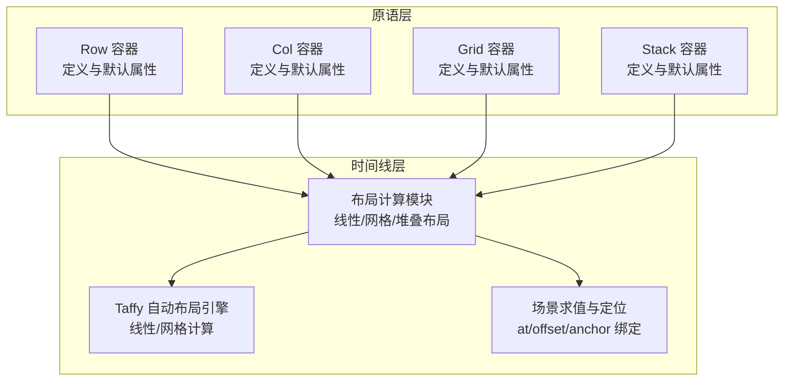
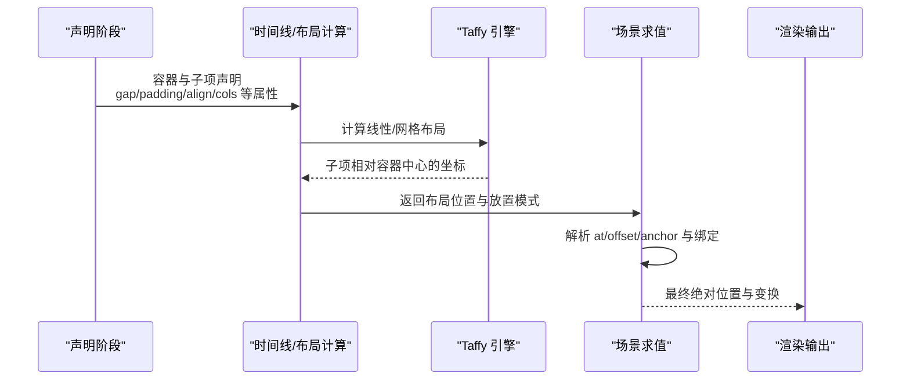
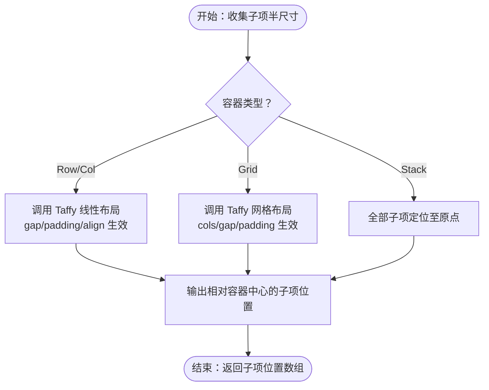
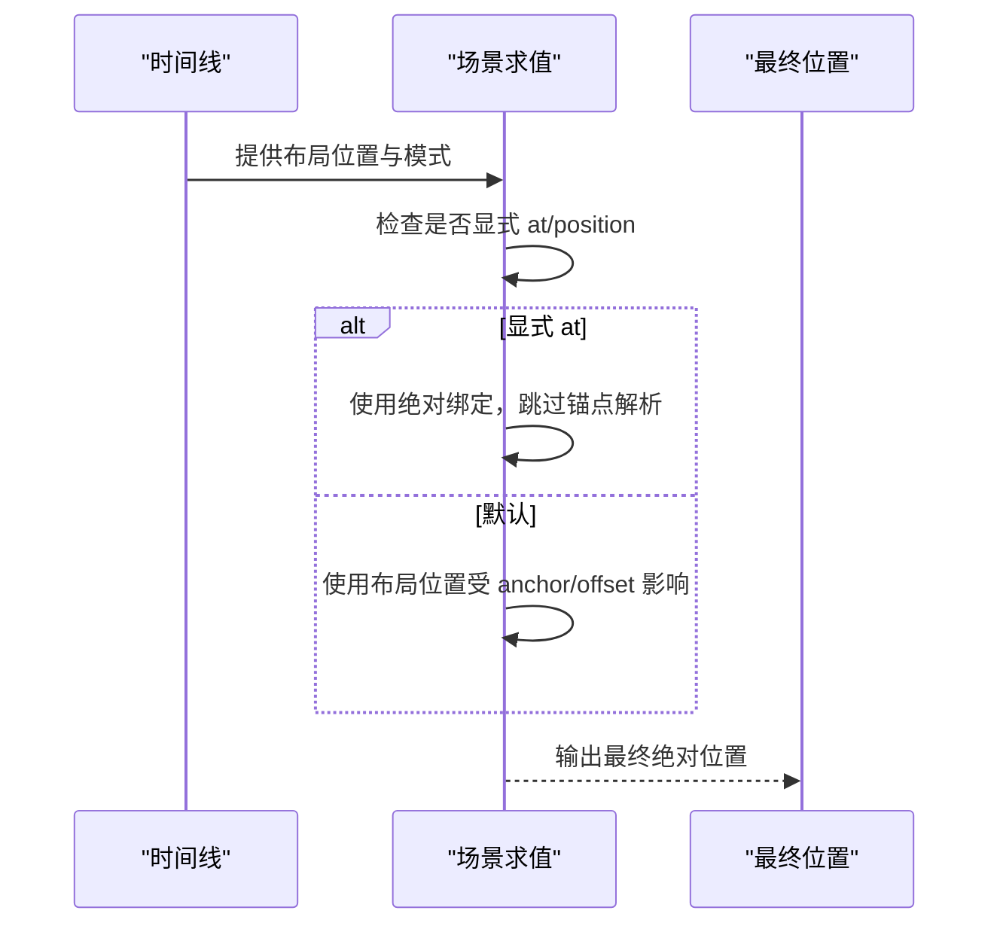
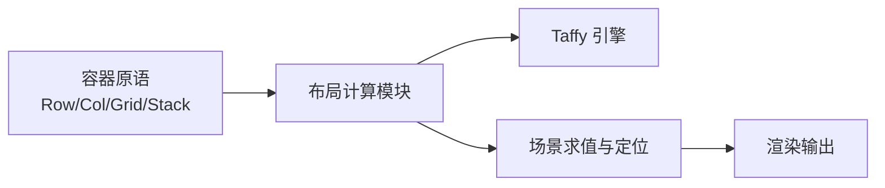

# 布局系统

<cite>
**本文引用的文件**
- [crates/animatix/src/primitives/row.rs](file://crates/animatix/src/primitives/row.rs)
- [crates/animatix/src/primitives/col.rs](file://crates/animatix/src/primitives/col.rs)
- [crates/animatix/src/primitives/grid.rs](file://crates/animatix/src/primitives/grid.rs)
- [crates/animatix/src/primitives/stack.rs](file://crates/animatix/src/primitives/stack.rs)
- [crates/animatix/src/timeline/layout.rs](file://crates/animatix/src/timeline/layout.rs)
- [crates/animatix/src/timeline/taffy_layout.rs](file://crates/animatix/src/timeline/taffy_layout.rs)
- [crates/animatix/src/timeline/scene_eval.rs](file://crates/animatix/src/timeline/scene_eval.rs)
- [examples/02_layout.amx](file://examples/02_layout.amx)
- [docs/primitives.md](file://docs/primitives.md)
</cite>

## 目录
1. [引言](#引言)
2. [项目结构](#项目结构)
3. [核心组件](#核心组件)
4. [架构总览](#架构总览)
5. [详细组件分析](#详细组件分析)
6. [依赖关系分析](#依赖关系分析)
7. [性能考量](#性能考量)
8. [故障排查指南](#故障排查指南)
9. [结论](#结论)
10. [附录](#附录)

## 引言
本指南系统性地介绍 Animatix 的容器化布局能力，覆盖 Row、Col、Grid、Stack 四类容器的定义、属性与行为；解析动态布局计算（基于 Taffy 的线性布局与网格布局）、手动定位控制（at/offset/anchor）以及响应式设计原理；并通过示例演示如何组合这些容器构建复杂页面结构，并给出嵌套与性能优化的最佳实践。

## 项目结构
Animatix 将布局系统分为“原语层”和“时间线/运行时层”。原语层定义容器类型及其默认属性；时间线层负责在动画时间线上进行布局计算与位置应用；底层通过 Taffy 提供高效的自动布局引擎。

图表来源
- [crates/animatix/src/primitives/row.rs](file://crates/animatix/src/primitives/row.rs)
- [crates/animatix/src/primitives/col.rs](file://crates/animatix/src/primitives/col.rs)
- [crates/animatix/src/primitives/grid.rs](file://crates/animatix/src/primitives/grid.rs)
- [crates/animatix/src/primitives/stack.rs](file://crates/animatix/src/primitives/stack.rs)
- [crates/animatix/src/timeline/layout.rs](file://crates/animatix/src/timeline/layout.rs)
- [crates/animatix/src/timeline/taffy_layout.rs](file://crates/animatix/src/timeline/taffy_layout.rs)
- [crates/animatix/src/timeline/scene_eval.rs](file://crates/animatix/src/timeline/scene_eval.rs)

章节来源
- [crates/animatix/src/primitives/row.rs](file://crates/animatix/src/primitives/row.rs)
- [crates/animatix/src/primitives/col.rs](file://crates/animatix/src/primitives/col.rs)
- [crates/animatix/src/primitives/grid.rs](file://crates/animatix/src/primitives/grid.rs)
- [crates/animatix/src/primitives/stack.rs](file://crates/animatix/src/primitives/stack.rs)
- [crates/animatix/src/timeline/layout.rs](file://crates/animatix/src/timeline/layout.rs)
- [crates/animatix/src/timeline/taffy_layout.rs](file://crates/animatix/src/timeline/taffy_layout.rs)
- [crates/animatix/src/timeline/scene_eval.rs](file://crates/animatix/src/timeline/scene_eval.rs)

## 核心组件
- Row：水平线性布局容器，支持 gap、padding、align。
- Col：垂直线性布局容器，支持 gap、padding、align。
- Grid：二维网格布局容器，支持 cols、gap、padding。
- Stack：层叠布局容器，子元素共享同一原点，适合重叠叠加效果。

上述容器均被标记为容器类型，具备默认属性集合，用于声明式布局与动画联动。

章节来源
- [crates/animatix/src/primitives/row.rs](file://crates/animatix/src/primitives/row.rs)
- [crates/animatix/src/primitives/col.rs](file://crates/animatix/src/primitives/col.rs)
- [crates/animatix/src/primitives/grid.rs](file://crates/animatix/src/primitives/grid.rs)
- [crates/animatix/src/primitives/stack.rs](file://crates/animatix/src/primitives/stack.rs)
- [docs/primitives.md](file://docs/primitives.md)

## 架构总览
布局系统遵循“声明式容器 + 动态计算 + 手动定位”的模式。容器在声明阶段提供尺寸与间距等信息，时间线在每一帧根据当前时间与属性插值计算出每个子项的位置；若显式指定 at/offset/anchor，则以手动定位优先。

图表来源
- [crates/animatix/src/timeline/layout.rs](file://crates/animatix/src/timeline/layout.rs)
- [crates/animatix/src/timeline/taffy_layout.rs](file://crates/animatix/src/timeline/taffy_layout.rs)
- [crates/animatix/src/timeline/scene_eval.rs](file://crates/animatix/src/timeline/scene_eval.rs)

## 详细组件分析

### Row 容器
- 角色：水平线性布局容器，常用于横向排列按钮、卡片等。
- 关键属性：gap、padding、align（start/center/end）。
- 行为：使用 Taffy 进行线性布局计算，返回子项相对容器中心的水平排列坐标。
- 典型用法：与动画属性（如 opacity、transform）结合实现进入/退出效果。

章节来源
- [crates/animatix/src/primitives/row.rs](file://crates/animatix/src/primitives/row.rs)
- [crates/animatix/src/timeline/layout.rs](file://crates/animatix/src/timeline/layout.rs)
- [docs/primitives.md](file://docs/primitives.md)

### Col 容器
- 角色：垂直线性布局容器，常用于纵向列表、导航或内容块堆叠。
- 关键属性：gap、padding、align。
- 行为：使用 Taffy 进行线性布局计算，返回子项相对容器中心的垂直排列坐标。
- 典型用法：与 stagger、fade-in 等动作组合，形成有序出现的视觉节奏。

章节来源
- [crates/animatix/src/primitives/col.rs](file://crates/animatix/src/primitives/col.rs)
- [crates/animatix/src/timeline/layout.rs](file://crates/animatix/src/timeline/layout.rs)
- [docs/primitives.md](file://docs/primitives.md)

### Grid 容器
- 角色：二维网格布局容器，按声明顺序填充单元格。
- 关键属性：cols、gap、padding。
- 行为：使用 Taffy 进行网格布局计算，确定每行每列的子项位置。
- 典型用法：媒体画廊、仪表盘卡片网格、响应式栅格。

章节来源
- [crates/animatix/src/primitives/grid.rs](file://crates/animatix/src/primitives/grid.rs)
- [crates/animatix/src/timeline/layout.rs](file://crates/animatix/src/timeline/layout.rs)
- [docs/primitives.md](file://docs/primitives.md)

### Stack 容器
- 角色：层叠布局容器，所有子项共享原点，适合叠加、遮罩、前景装饰等。
- 关键属性：gap、padding。
- 行为：返回所有子项统一的原点位置，便于后续叠加动画。
- 典型用法：背景板 + 中间图形 + 前景图标，逐层放大/缩小形成深度感。

章节来源
- [crates/animatix/src/primitives/stack.rs](file://crates/animatix/src/primitives/stack.rs)
- [crates/animatix/src/timeline/layout.rs](file://crates/animatix/src/timeline/layout.rs)
- [docs/primitives.md](file://docs/primitives.md)

### 动态布局计算机制
- 线性布局（Row/Col）：基于 Taffy 的线性布局算法，考虑子项半尺寸、gap、padding、align，输出相对容器中心的子项位置。
- 网格布局（Grid）：基于 Taffy 的网格算法，按 cols 与 gap 确定行列位置。
- 堆叠布局（Stack）：直接将所有子项定位到原点，便于层叠叠加。

图表来源
- [crates/animatix/src/timeline/layout.rs](file://crates/animatix/src/timeline/layout.rs)
- [crates/animatix/src/timeline/taffy_layout.rs](file://crates/animatix/src/timeline/taffy_layout.rs)

章节来源
- [crates/animatix/src/timeline/layout.rs](file://crates/animatix/src/timeline/layout.rs)
- [crates/animatix/src/timeline/taffy_layout.rs](file://crates/animatix/src/timeline/taffy_layout.rs)

### 手动定位控制
- at/position：显式设置绝对位置，覆盖布局计算结果。
- offset：在基础位置上偏移。
- anchor：锚点绑定，如 scene.*，决定相对场景的对齐方式。
- 放置模式（PlacementMode）：LayoutManaged 或由 at 强制的绝对模式。

图表来源
- [crates/animatix/src/timeline/scene_eval.rs](file://crates/animatix/src/timeline/scene_eval.rs)

章节来源
- [crates/animatix/src/timeline/scene_eval.rs](file://crates/animatix/src/timeline/scene_eval.rs)

### 响应式设计原理
- 场景维度（SceneDimensions）：作为布局与定位的参考基准。
- 百分比 at：可使用百分比表达相对场景的定位。
- 适配不同分辨率：通过调整容器属性与场景尺寸，保持相对比例一致。

章节来源
- [crates/animatix/src/timeline/scene_eval.rs](file://crates/animatix/src/timeline/scene_eval.rs)

### 复杂页面布局示例
以下示例展示了多列布局、网格系统与层级排列的组合使用，以及动画过渡：

- 多列布局：Row/Col 并用，分别实现横向与纵向排列。
- 网格系统：Grid 指定 cols 实现规则网格。
- 层级排列：Stack 在右侧区域实现背景-中景-前景的叠加。

章节来源
- [examples/02_layout.amx](file://examples/02_layout.amx)

## 依赖关系分析
- 容器原语依赖于时间线层的布局计算模块；布局计算模块进一步依赖 Taffy 引擎。
- 场景求值模块负责将布局位置与手动定位（at/offset/anchor）融合，输出最终绝对位置。
- 文档与示例共同说明容器属性、行为与典型用法。

图表来源
- [crates/animatix/src/primitives/row.rs](file://crates/animatix/src/primitives/row.rs)
- [crates/animatix/src/primitives/col.rs](file://crates/animatix/src/primitives/col.rs)
- [crates/animatix/src/primitives/grid.rs](file://crates/animatix/src/primitives/grid.rs)
- [crates/animatix/src/primitives/stack.rs](file://crates/animatix/src/primitives/stack.rs)
- [crates/animatix/src/timeline/layout.rs](file://crates/animatix/src/timeline/layout.rs)
- [crates/animatix/src/timeline/taffy_layout.rs](file://crates/animatix/src/timeline/taffy_layout.rs)
- [crates/animatix/src/timeline/scene_eval.rs](file://crates/animatix/src/timeline/scene_eval.rs)

章节来源
- [crates/animatix/src/timeline/layout.rs](file://crates/animatix/src/timeline/layout.rs)
- [crates/animatix/src/timeline/taffy_layout.rs](file://crates/animatix/src/timeline/taffy_layout.rs)
- [crates/animatix/src/timeline/scene_eval.rs](file://crates/animatix/src/timeline/scene_eval.rs)

## 性能考量
- 合理使用容器：Row/Col/Stack 的计算复杂度较低；Grid 的网格计算在列数较多时需关注成本。
- 减少频繁重排：尽量避免在高频动画中频繁修改 cols、gap、align 等影响布局树的属性。
- 控制嵌套层级：深层嵌套会增加布局传播与求值开销，建议通过扁平化或合理拆分容器降低复杂度。
- 利用 at/offset/anchor 的绝对定位：在需要固定位置时使用 at 可绕过布局计算，减少每帧开销。
- 预估场景尺寸：在高分辨率场景下，适当增大 padding/gap 以减少重绘压力。

## 故障排查指南
- 子项未按预期排列
  - 检查容器类型与 align/gap/padding 设置是否符合预期。
  - 确认是否存在显式的 at/position 覆盖导致布局失效。
- 网格错位
  - 确认 cols 数量与实际子项数量匹配，避免空位导致的换行异常。
- 层叠错位
  - Stack 下所有子项共享原点，注意尺寸差异带来的视觉偏移。
- 定位异常
  - 检查 anchor/offset/at 的组合是否正确，必要时切换为绝对绑定以验证问题。

章节来源
- [crates/animatix/src/timeline/scene_eval.rs](file://crates/animatix/src/timeline/scene_eval.rs)
- [crates/animatix/src/timeline/layout.rs](file://crates/animatix/src/timeline/layout.rs)

## 结论
Animatix 的布局系统以容器原语为核心，结合 Taffy 的高效自动布局与灵活的手动定位，既能满足声明式快速搭建，也能在复杂场景中通过 at/offset/anchor 精准控制。通过合理的属性选择、嵌套策略与性能优化，可以构建既灵活又高效的动画界面。

## 附录
- 示例文件：02_layout.amx 展示了 Row、Col、Grid、Stack 的综合使用与动画过渡。
- 官方文档：primitives.md 对容器状态、属性与行为有权威说明。

章节来源
- [examples/02_layout.amx](file://examples/02_layout.amx)
- [docs/primitives.md](file://docs/primitives.md)