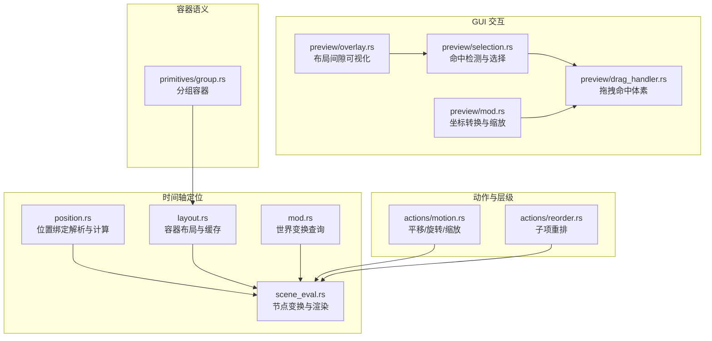
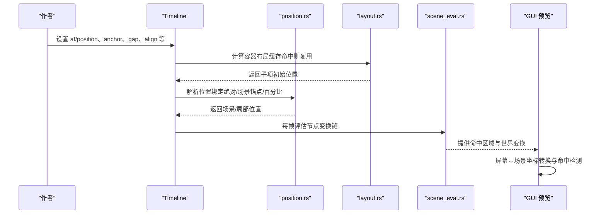
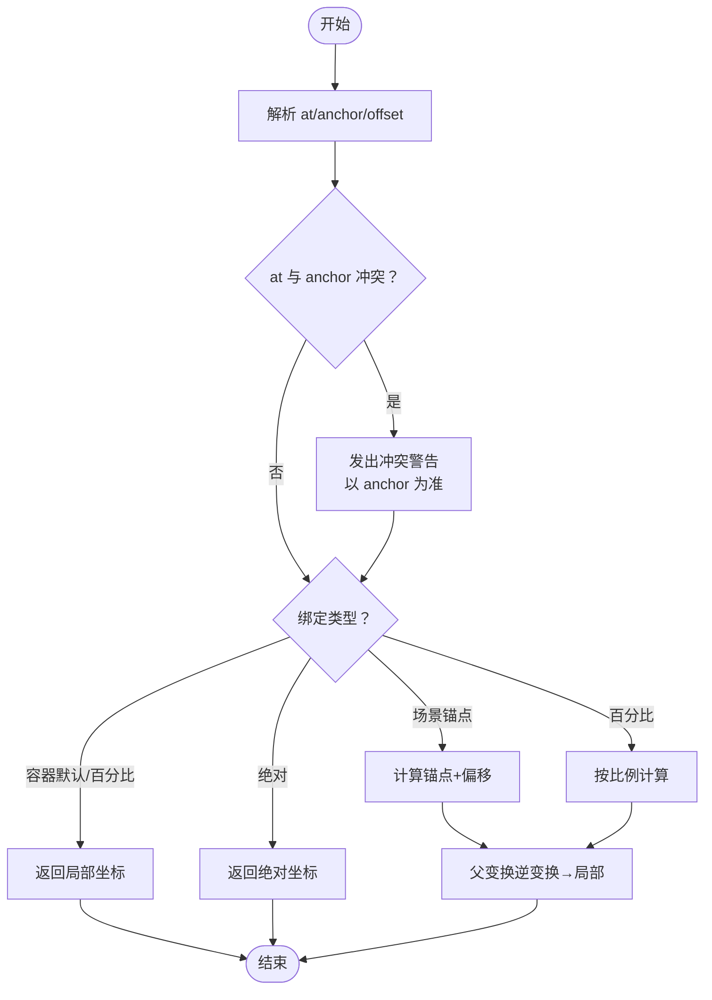
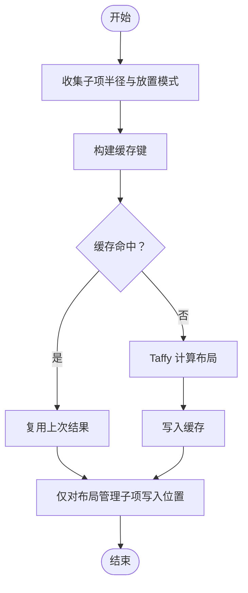
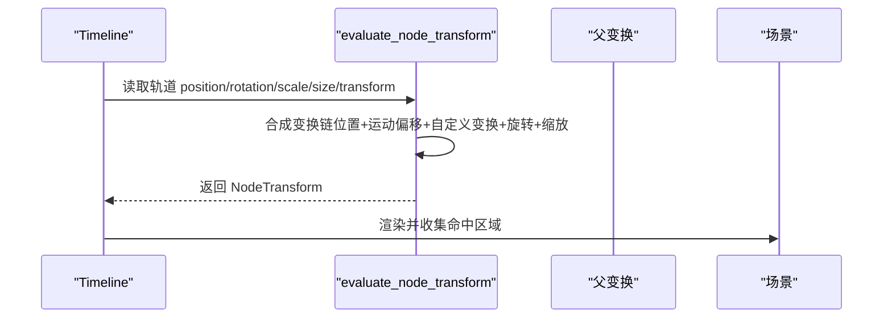
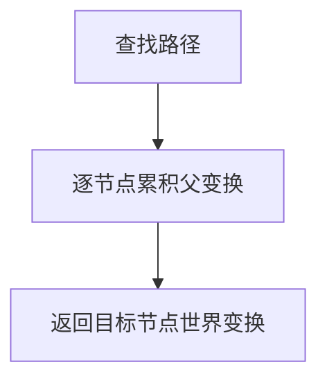
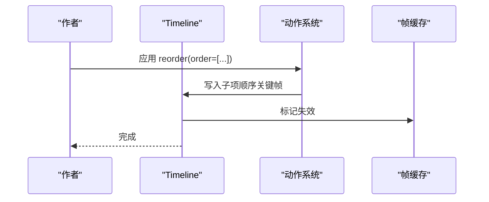
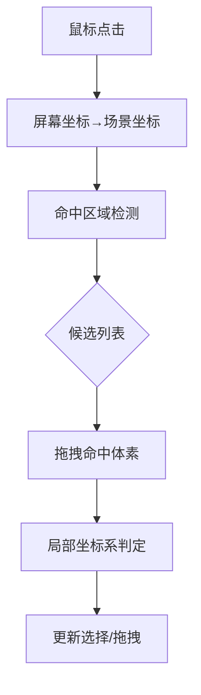
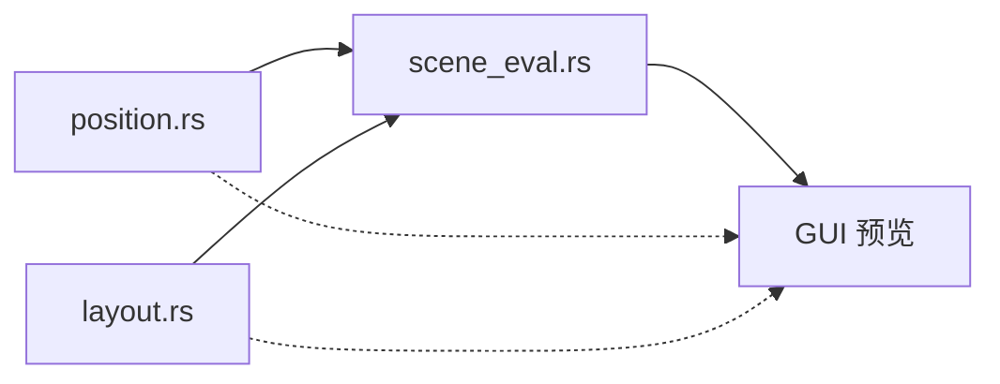

# 手动定位控制

<cite>
**本文引用的文件**
- [position.rs](file://crates/animatix/src/timeline/position.rs)
- [layout.rs](file://crates/animatix/src/timeline/layout.rs)
- [scene_eval.rs](file://crates/animatix/src/timeline/scene_eval.rs)
- [mod.rs](file://crates/animatix/src/timeline/mod.rs)
- [motion.rs](file://crates/animatix/src/timeline/actions/motion.rs)
- [reorder.rs](file://crates/animatix/src/timeline/actions/reorder.rs)
- [overlay.rs](file://crates/animatix-gui/src/app/preview/overlay.rs)
- [selection.rs](file://crates/animatix-gui/src/app/preview/selection.rs)
- [drag_handler.rs](file://crates/animatix-gui/src/app/preview/drag_handler.rs)
- [mod.rs（GUI 预览）](file://crates/animatix-gui/src/app/preview/mod.rs)
- [group.rs](file://crates/animatix/src/primitives/group.rs)
</cite>

## 目录
1. [简介](#简介)
2. [项目结构](#项目结构)
3. [核心组件](#核心组件)
4. [架构总览](#架构总览)
5. [详细组件分析](#详细组件分析)
6. [依赖关系分析](#依赖关系分析)
7. [性能考量](#性能考量)
8. [故障排查指南](#故障排查指南)
9. [结论](#结论)
10. [附录](#附录)

## 简介
本指南聚焦于“手动定位控制”，系统讲解如何在 Animatix 中精确控制元素的位置与层级关系。内容涵盖：
- 绝对定位、相对定位与容器布局的实现机制
- 坐标系统、对齐方式与间距控制
- 元素重排、遮挡处理与交互区域管理
- 定位精度、性能影响与常见问题的解决方案

## 项目结构
与手动定位控制直接相关的模块主要分布在时间轴引擎与 GUI 预览层：
- 时间轴定位与布局：position.rs、layout.rs、scene_eval.rs、mod.rs
- 动作与层级：actions/motion.rs、actions/reorder.rs
- GUI 交互与命中检测：preview/overlay.rs、preview/selection.rs、preview/drag_handler.rs、preview/mod.rs
- 容器语义：primitives/group.rs

**图表来源**
- [position.rs:1-395](file://crates/animatix/src/timeline/position.rs#L1-L395)
- [layout.rs:1-310](file://crates/animatix/src/timeline/layout.rs#L1-L310)
- [scene_eval.rs:1-800](file://crates/animatix/src/timeline/scene_eval.rs#L1-L800)
- [mod.rs:995-1023](file://crates/animatix/src/timeline/mod.rs#L995-L1023)
- [motion.rs:329-447](file://crates/animatix/src/timeline/actions/motion.rs#L329-L447)
- [reorder.rs:157-189](file://crates/animatix/src/timeline/actions/reorder.rs#L157-L189)
- [overlay.rs:263-280](file://crates/animatix-gui/src/app/preview/overlay.rs#L263-L280)
- [selection.rs:39-130](file://crates/animatix-gui/src/app/preview/selection.rs#L39-L130)
- [drag_handler.rs:267-281](file://crates/animatix-gui/src/app/preview/drag_handler.rs#L267-L281)
- [mod.rs（GUI 预览）:46-107](file://crates/animatix-gui/src/app/preview/mod.rs#L46-L107)
- [group.rs:1-46](file://crates/animatix/src/primitives/group.rs#L1-L46)

**章节来源**
- [position.rs:1-395](file://crates/animatix/src/timeline/position.rs#L1-L395)
- [layout.rs:1-310](file://crates/animatix/src/timeline/layout.rs#L1-L310)
- [scene_eval.rs:1-800](file://crates/animatix/src/timeline/scene_eval.rs#L1-L800)
- [mod.rs:995-1023](file://crates/animatix/src/timeline/mod.rs#L995-L1023)
- [motion.rs:329-447](file://crates/animatix/src/timeline/actions/motion.rs#L329-L447)
- [reorder.rs:157-189](file://crates/animatix/src/timeline/actions/reorder.rs#L157-L189)
- [overlay.rs:263-280](file://crates/animatix-gui/src/app/preview/overlay.rs#L263-L280)
- [selection.rs:39-130](file://crates/animatix-gui/src/app/preview/selection.rs#L39-L130)
- [drag_handler.rs:267-281](file://crates/animatix-gui/src/app/preview/drag_handler.rs#L267-L281)
- [mod.rs（GUI 预览）:46-107](file://crates/animatix-gui/src/app/preview/mod.rs#L46-L107)
- [group.rs:1-46](file://crates/animatix/src/primitives/group.rs#L1-L46)

## 核心组件
- 位置绑定与解析：负责将作者声明的 at/anchor/offset 解析为场景空间或局部空间的最终位置，并支持绝对定位、场景锚点、百分比定位等模式。
- 容器布局：基于 Taffy 的线性布局与网格布局，按声明顺序、间距、内边距与对齐方式确定子元素的初始位置；支持缓存以避免重复计算。
- 节点变换与渲染：在每一帧评估节点的变换链（位置、运动偏移、自定义变换、旋转、缩放），并进行视口裁剪与命中区域收集。
- 世界变换查询：提供从根到目标节点的完整仿射变换，用于外部系统（如 GUI）进行定位与交互。
- 动作与层级：提供平移/旋转/缩放等运动动作，以及子项重排动作，改变渲染顺序与交互层级。
- GUI 交互：通过屏幕坐标与场景坐标的双向转换、命中检测与拖拽命中体素，实现精确的交互体验。

**章节来源**
- [position.rs:11-165](file://crates/animatix/src/timeline/position.rs#L11-L165)
- [layout.rs:107-200](file://crates/animatix/src/timeline/layout.rs#L107-L200)
- [scene_eval.rs:75-153](file://crates/animatix/src/timeline/scene_eval.rs#L75-L153)
- [mod.rs:995-1023](file://crates/animatix/src/timeline/mod.rs#L995-L1023)
- [motion.rs:329-447](file://crates/animatix/src/timeline/actions/motion.rs#L329-L447)
- [reorder.rs:157-189](file://crates/animatix/src/timeline/actions/reorder.rs#L157-L189)
- [selection.rs:39-130](file://crates/animatix-gui/src/app/preview/selection.rs#L39-L130)
- [drag_handler.rs:267-281](file://crates/animatix-gui/src/app/preview/drag_handler.rs#L267-L281)
- [mod.rs（GUI 预览）:46-107](file://crates/animatix-gui/src/app/preview/mod.rs#L46-L107)

## 架构总览
手动定位控制贯穿“声明期布局”与“运行时渲染”两个阶段：
- 声明期：容器布局根据子项半径与排列规则一次性计算，生成初始位置；作者可通过 at/position 明确覆盖。
- 运行时：每帧根据轨道值与修饰器计算节点变换，结合父级变换得到世界坐标；同时维护命中区域用于交互。

**图表来源**
- [layout.rs:107-200](file://crates/animatix/src/timeline/layout.rs#L107-L200)
- [position.rs:41-112](file://crates/animatix/src/timeline/position.rs#L41-L112)
- [scene_eval.rs:75-153](file://crates/animatix/src/timeline/scene_eval.rs#L75-L153)
- [mod.rs（GUI 预览）:86-107](file://crates/animatix-gui/src/app/preview/mod.rs#L86-L107)

## 详细组件分析

### 组件一：位置绑定与解析（绝对/相对/百分比）
- 支持的绑定类型
  - 绝对定位：直接使用作者提供的坐标，忽略父级变换。
  - 场景锚点：以场景四角、边缘与中心为锚点，可叠加偏移。
  - 百分比定位：以场景宽高比例定位，常用于响应式布局。
  - 容器默认/百分比：容器内部的相对定位，返回已处于局部坐标系的结果。
- 冲突与警告
  - 当 at 与 anchor 同时出现时，以 anchor 为准，并发出冲突警告。
  - 使用绝对 at 时，offset 将被忽略并提示。
- 关键流程
  - 解析 at/anchor/offset 表达式，生成 PositionBinding。
  - 若存在父级变换，将场景空间位置逆变换回局部坐标。
  - 当存在覆盖位置（修饰器 always）时，强制使用绝对绑定。

**图表来源**
- [position.rs:41-112](file://crates/animatix/src/timeline/position.rs#L41-L112)
- [position.rs:134-165](file://crates/animatix/src/timeline/position.rs#L134-L165)

**章节来源**
- [position.rs:11-112](file://crates/animatix/src/timeline/position.rs#L11-L112)
- [position.rs:134-165](file://crates/animatix/src/timeline/position.rs#L134-L165)

### 组件二：容器布局与间距控制（Row/Col/Grid/Stack）
- 设计契约
  - 布局为声明期度量与放置，不随动画轨道重新采样。
  - 子项需具备布局尺寸（由形状/文本/图像/矢量等种子），未测量的布局管理子项会被排除。
  - 容器外的手工定位（含 at）会跳过容器放置，作者自行负责位置。
- 计算与缓存
  - 使用 Taffy 计算线性布局与网格布局，支持 gap、padding、align。
  - 缓存键包含子项指纹（半径与放置模式），避免重复布局。
- 根容器默认
  - 无 at 的根布局容器默认位于场景中心。

**图表来源**
- [layout.rs:140-200](file://crates/animatix/src/timeline/layout.rs#L140-L200)
- [layout.rs:202-310](file://crates/animatix/src/timeline/layout.rs#L202-L310)

**章节来源**
- [layout.rs:1-310](file://crates/animatix/src/timeline/layout.rs#L1-L310)

### 组件三：节点变换链与渲染（含命中区域）
- 变换链
  - 位置：优先使用覆盖位置（修饰器 always），否则使用轨道 position 或布局位置。
  - 运动偏移：shift 作为额外的本地偏移叠加。
  - 自定义变换：transform 矩阵。
  - 旋转与缩放：分别叠加到变换链中。
- 视口裁剪与缓存
  - 基于世界包围盒与视口相交判断是否渲染。
  - 对相同 (time, parent_transform) 的节点变换进行缓存，提升性能。
- 命中区域
  - 在渲染过程中收集每个节点的世界包围盒，用于点击选择与悬停反馈。

**图表来源**
- [scene_eval.rs:75-153](file://crates/animatix/src/timeline/scene_eval.rs#L75-L153)
- [scene_eval.rs:308-393](file://crates/animatix/src/timeline/scene_eval.rs#L308-L393)

**章节来源**
- [scene_eval.rs:75-153](file://crates/animatix/src/timeline/scene_eval.rs#L75-L153)
- [scene_eval.rs:308-393](file://crates/animatix/src/timeline/scene_eval.rs#L308-L393)

### 组件四：世界变换查询（用于外部系统）
- 提供从根到任意节点的仿射变换，确保外部系统（如 GUI）能正确进行定位与交互。
- 路径遍历中累积父级变换，最终得到目标节点的世界变换。

**图表来源**
- [mod.rs:995-1023](file://crates/animatix/src/timeline/mod.rs#L995-L1023)

**章节来源**
- [mod.rs:995-1023](file://crates/animatix/src/timeline/mod.rs#L995-L1023)

### 组件五：运动与层级（平移/旋转/缩放、重排）
- 平移/旋转/缩放
  - 通过动作系统为轨道添加关键帧，支持延迟与缓动。
  - 旋转与缩放为相对增量，叠加到现有值上。
- 子项重排
  - 通过 reorder 动作设置子项顺序的关键帧，触发渲染顺序变化。
  - 重排后使帧缓存失效，确保下一帧采用新顺序。

**图表来源**
- [reorder.rs:157-189](file://crates/animatix/src/timeline/actions/reorder.rs#L157-L189)

**章节来源**
- [motion.rs:329-447](file://crates/animatix/src/timeline/actions/motion.rs#L329-L447)
- [reorder.rs:157-189](file://crates/animatix/src/timeline/actions/reorder.rs#L157-L189)

### 组件六：交互区域管理（命中检测与拖拽）
- 命中检测
  - 依据渲染时收集的命中区域，按从上到下的顺序返回点击候选。
  - 支持多选与循环切换。
- 拖拽命中体素
  - 将屏幕坐标转换为场景坐标，再将场景坐标反旋转到局部坐标，判断是否落入矩形范围。
- 坐标转换
  - 提供统一的屏幕↔场景坐标转换函数，考虑缩放与平移。

**图表来源**
- [selection.rs:39-130](file://crates/animatix-gui/src/app/preview/selection.rs#L39-L130)
- [drag_handler.rs:267-281](file://crates/animatix-gui/src/app/preview/drag_handler.rs#L267-L281)
- [mod.rs（GUI 预览）:86-107](file://crates/animatix-gui/src/app/preview/mod.rs#L86-L107)

**章节来源**
- [selection.rs:39-130](file://crates/animatix-gui/src/app/preview/selection.rs#L39-L130)
- [drag_handler.rs:267-281](file://crates/animatix-gui/src/app/preview/drag_handler.rs#L267-L281)
- [mod.rs（GUI 预览）:46-107](file://crates/animatix-gui/src/app/preview/mod.rs#L46-L107)

### 组件七：容器语义与布局间隙可视化
- 分组容器
  - 作为逻辑容器，不参与布局计算，但可承载子项并影响渲染顺序。
- 布局间隙可视化
  - 在预览面板中计算相邻子项之间的间隙中心与大小，辅助对齐与间距调试。

**章节来源**
- [group.rs:1-46](file://crates/animatix/src/primitives/group.rs#L1-L46)
- [overlay.rs:263-280](file://crates/animatix-gui/src/app/preview/overlay.rs#L263-L280)

## 依赖关系分析
- position.rs 依赖于环境解析与诊断系统，输出 PositionBinding 供 scene_eval.rs 使用。
- layout.rs 依赖 Taffy 引擎与容器元数据，输出子项位置映射。
- scene_eval.rs 串联 position.rs 与 layout.rs 的结果，形成节点变换链，并产出命中区域。
- GUI 预览层通过坐标转换与命中检测，将渲染结果映射到用户交互。

**图表来源**
- [position.rs:1-395](file://crates/animatix/src/timeline/position.rs#L1-L395)
- [layout.rs:1-310](file://crates/animatix/src/timeline/layout.rs#L1-L310)
- [scene_eval.rs:1-800](file://crates/animatix/src/timeline/scene_eval.rs#L1-L800)

**章节来源**
- [position.rs:1-395](file://crates/animatix/src/timeline/position.rs#L1-L395)
- [layout.rs:1-310](file://crates/animatix/src/timeline/layout.rs#L1-L310)
- [scene_eval.rs:1-800](file://crates/animatix/src/timeline/scene_eval.rs#L1-L800)

## 性能考量
- 布局缓存：容器布局使用指纹缓存，避免重复计算。
- 帧缓存：当时间、尺寸与修饰/动态布局状态不变时，直接复用缓存场景。
- 变换缓存：对相同 (time, parent_transform) 的节点变换进行缓存。
- 视口裁剪：仅渲染可见对象，减少无关绘制。
- 静态子树缓存：完全静态的子树仅编码一次，后续帧直接复用。

**章节来源**
- [layout.rs:140-200](file://crates/animatix/src/timeline/layout.rs#L140-L200)
- [scene_eval.rs:719-734](file://crates/animatix/src/timeline/scene_eval.rs#L719-L734)
- [scene_eval.rs:320-362](file://crates/animatix/src/timeline/scene_eval.rs#L320-L362)
- [scene_eval.rs:373-393](file://crates/animatix/src/timeline/scene_eval.rs#L373-L393)
- [scene_eval.rs:827-854](file://crates/animatix/src/timeline/scene_eval.rs#L827-L854)

## 故障排查指南
- 绝对定位与偏移冲突
  - 现象：使用绝对 at 且设置了 offset，出现“offset 被忽略”的警告。
  - 处理：移除 offset，或改用 anchor/percent 绑定。
- at 与 anchor 冲突
  - 现象：同时指定 at 与 anchor，出现冲突警告，以 anchor 为准。
  - 处理：明确二选一，避免混淆。
- 布局尺寸缺失导致子项被排除
  - 现象：某些子项未出现在布局中。
  - 处理：确保子项具备可测量的布局尺寸（形状/文本/图像/矢量）。
- 重排后视觉未更新
  - 现象：更改子项顺序后，画面未立即变化。
  - 处理：确认已写入关键帧并使帧缓存失效，等待下一帧生效。
- 交互区域异常
  - 现象：点击无响应或误选。
  - 处理：检查命中区域收集与坐标转换逻辑，确认拖拽命中体素的局部坐标判定。

**章节来源**
- [position.rs:53-112](file://crates/animatix/src/timeline/position.rs#L53-L112)
- [layout.rs:202-264](file://crates/animatix/src/timeline/layout.rs#L202-L264)
- [reorder.rs:157-189](file://crates/animatix/src/timeline/actions/reorder.rs#L157-L189)
- [selection.rs:39-130](file://crates/animatix-gui/src/app/preview/selection.rs#L39-L130)
- [drag_handler.rs:267-281](file://crates/animatix-gui/src/app/preview/drag_handler.rs#L267-L281)

## 结论
Animatix 的手动定位控制以“声明期布局 + 运行时渲染”的方式实现了高精度与高性能的定位体系。通过位置绑定、容器布局、变换链与命中区域的协同，既能满足复杂视觉布局需求，又能保证交互体验的流畅与准确。配合动作系统与 GUI 交互层，开发者可以高效地完成元素的精确定位、层级调整与交互管理。

## 附录
- 常用术语
  - 绝对定位：直接使用作者提供的坐标。
  - 场景锚点：以场景四角、边缘与中心为参考点。
  - 百分比定位：以场景宽高比例定位。
  - 容器布局：基于 Row/Col/Grid/Stack 的自动排列。
  - 命中区域：渲染时收集的节点世界包围盒，用于交互检测。
- 实践建议
  - 优先使用容器布局与百分比定位实现响应式设计。
  - 对需要严格对齐的场景，使用绝对定位并配合偏移微调。
  - 通过重排动作管理渲染层级，注意缓存失效与帧率影响。
  - 利用命中区域与坐标转换优化交互体验，确保拖拽命中体素的准确性。