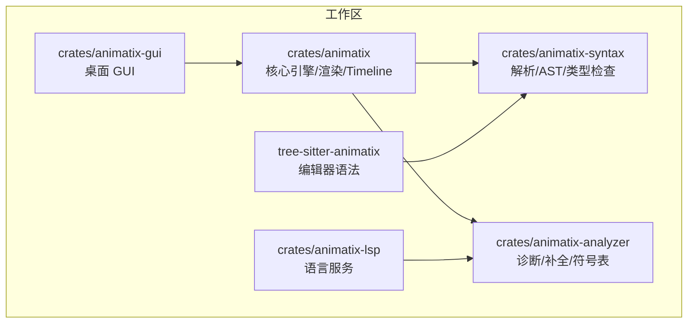
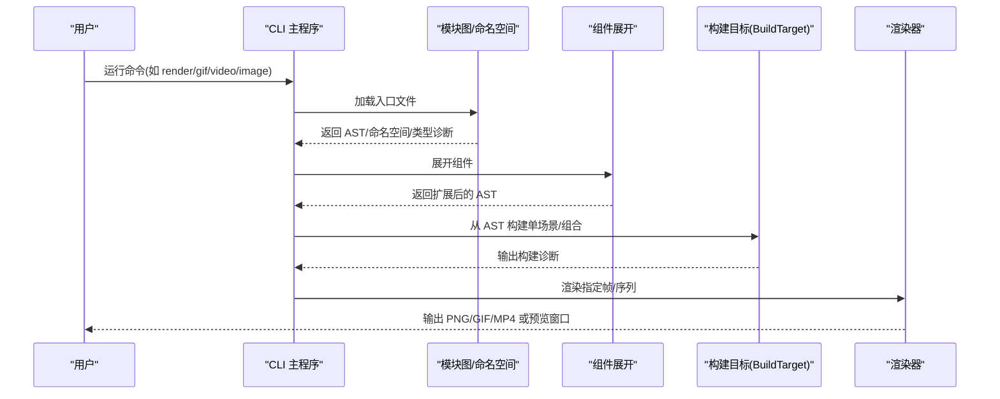
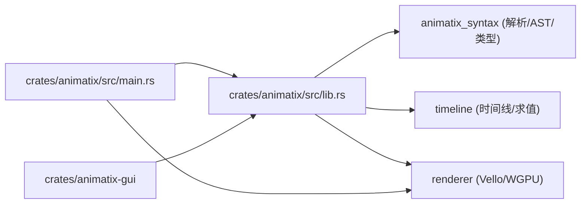

# 快速入门

<cite>
**本文引用的文件**
- [Readme.md](file://Readme.md)
- [Cargo.toml](file://Cargo.toml)
- [examples/00_hello.amx](file://examples/00_hello.amx)
- [examples/01_shapes.amx](file://examples/01_shapes.amx)
- [examples/02_layout.amx](file://examples/02_layout.amx)
- [examples/03_timing.amx](file://examples/03_timing.amx)
- [examples/04_motion.amx](file://examples/04_motion.amx)
- [examples/README.md](file://examples/README.md)
- [docs/spec.md](file://docs/spec.md)
- [docs/primitives.md](file://docs/primitives.md)
- [crates/animatix/src/lib.rs](file://crates/animatix/src/lib.rs)
- [crates/animatix/src/main.rs](file://crates/animatix/src/main.rs)
- [examples/lib/components.amx](file://examples/lib/components.amx)
</cite>

## 目录
1. [简介](#简介)
2. [项目结构](#项目结构)
3. [核心组件](#核心组件)
4. [架构总览](#架构总览)
5. [详细组件分析](#详细组件分析)
6. [依赖关系分析](#依赖关系分析)
7. [性能与使用建议](#性能与使用建议)
8. [故障排查指南](#故障排查指南)
9. [结论](#结论)
10. [附录：从零开始你的第一个动画](#附录从零开始你的第一个动画)

## 简介
本指南面向初学者，带你用 Animatix 快速完成“Hello World”动画，并逐步掌握形状绘制、布局系统与基础动画概念。你将了解 Animatix 的声明式语法、时间线与关键帧、动作（actions）与修饰符（modifiers）、颜色系统、容器布局以及反应式表达式等核心能力。文档提供可直接运行的示例路径与命令，帮助你在最短时间内完成第一次动画创作。

## 项目结构
仓库采用多 crate 工作区组织，核心模块包括：
- 核心引擎与渲染：crates/animatix
- 桌面 GUI：crates/animatix-gui
- 语言支持与语法树：crates/animatix-syntax、tree-sitter-animatix
- 分析器与 LSP：crates/animatix-analyzer、crates/animatix-lsp

图表来源
- [Cargo.toml:1-11](file://Cargo.toml#L1-L11)
- [crates/animatix/src/lib.rs:1-24](file://crates/animatix/src/lib.rs#L1-L24)

章节来源
- [Cargo.toml:1-11](file://Cargo.toml#L1-L11)
- [crates/animatix/src/lib.rs:1-24](file://crates/animatix/src/lib.rs#L1-L24)

## 核心组件
- 声明式场景与演员（actors）：通过标签、类型与属性声明对象，再在时间线上进行动画化。
- 时间线与关键帧：以绝对或相对时间标记（如 #0s、#+1s）组织动画序列。
- 动作与修饰符：内置动作（如 fade-in、shift、rotate、scale），修饰符用于时长、延迟与缓动曲线。
- 颜色系统：支持主题配色方案、语义令牌与 RGBA 值。
- 容器布局：Row、Col、Grid、Stack、Group 提供声明式自动布局。
- 反应式表达式：always 块按时间 t 实时计算属性，适合物理模拟与随时间变化的视觉效果。
- 组件与导入：pub component 定义可复用模板，import 导入模块与组件。

章节来源
- [docs/spec.md:90-160](file://docs/spec.md#L90-L160)
- [docs/spec.md:219-375](file://docs/spec.md#L219-L375)
- [docs/spec.md:411-436](file://docs/spec.md#L411-L436)
- [docs/spec.md:584-714](file://docs/spec.md#L584-L714)
- [docs/primitives.md:1-455](file://docs/primitives.md#L1-L455)

## 架构总览
Animatix 的运行流程从 CLI 入口开始，加载 .amx 文件，构建模块图与命名空间，展开组件，生成构建目标（单场景或多场景组合），随后进入渲染阶段输出图像、视频或 GIF。

图表来源
- [crates/animatix/src/main.rs:210-230](file://crates/animatix/src/main.rs#L210-L230)
- [crates/animatix/src/main.rs:335-714](file://crates/animatix/src/main.rs#L335-L714)

章节来源
- [crates/animatix/src/main.rs:1-799](file://crates/animatix/src/main.rs#L1-L799)

## 详细组件分析

### 声明式语法与基本工作原理
- 场景声明：config 块设置配色方案与分辨率；默认场景尺寸由 config 决定。
- 演员声明：label: Type, prop: value；未在首个关键帧前声明的演员默认不可见，需显式 opacity 或入场动作使其出现。
- 关键帧：#0s、#2.5s、#+1s；同一关键帧内的动作并行执行。
- 修饰符：[duration, delay, ease]；支持时长、延迟与缓动曲线；部分修饰键仅对特定语句生效。
- 颜色系统：支持主题令牌（如 text.primary）、自动分配（auto）、命名颜色（RED/white 等）与 RGBA 元组。

章节来源
- [docs/spec.md:90-160](file://docs/spec.md#L90-L160)
- [docs/spec.md:165-216](file://docs/spec.md#L165-L216)
- [docs/spec.md:219-247](file://docs/spec.md#L219-L247)

### 形状与媒体：从 Hello 到 Gallery
- 基础形状：Rect、Ellipse、Polygon、Path、Line。
- 文本与代码：Text、Typst（替代旧版 Math）、Code。
- 媒体：Svg、Image。
- 示例路径：00_hello.amx（标题卡片）、01_shapes.amx（形状画廊）。

章节来源
- [examples/00_hello.amx:1-22](file://examples/00_hello.amx#L1-L22)
- [examples/01_shapes.amx:1-46](file://examples/01_shapes.amx#L1-L46)
- [docs/primitives.md:9-455](file://docs/primitives.md#L9-L455)

### 布局系统：Row、Col、Grid、Stack、Group
- Row/Col：gap、padding、align；子元素按声明顺序自动排列。
- Grid：cols、gap、padding；二维网格布局。
- Stack：重叠层叠，围绕共享原点叠加。
- Group：非布局分组，继承变换但不参与布局算法。
- 注意：在受控布局中设置 at/position 会触发警告；如需视觉偏移，请使用 transform。

章节来源
- [examples/02_layout.amx:1-55](file://examples/02_layout.amx#L1-L55)
- [docs/spec.md:411-436](file://docs/spec.md#L411-L436)

### 时间与节奏：sequence、stagger、easing
- sequence：按累计时长串联多个动作。
- stagger：为一组动作设置统一间隔偏移。
- easing：支持 linear、ease-in、ease-out、ease-in-out、bounce 等。
- 示例路径：03_timing.amx（序列、交错与缓动）。

章节来源
- [examples/03_timing.amx:1-35](file://examples/03_timing.amx#L1-L35)
- [docs/spec.md:354-375](file://docs/spec.md#L354-L375)

### 动作与运动：shift、rotate、scale、move
- shift：沿向量平移（by: (dx, dy)）
- rotate：绕自身旋转（by: 角度，默认弧度，可用 deg() 转换）
- scale：缩放（by: 比例）
- move：移动到绝对位置（to: (x, y)）
- 示例路径：04_motion.amx（位移、旋转、缩放与脉冲跟随）。

章节来源
- [examples/04_motion.amx:1-44](file://examples/04_motion.amx#L1-L44)
- [docs/spec.md:249-291](file://docs/spec.md#L249-L291)

### 反应式表达式：always 与 t
- always 块内可读取 t（秒）、scene_width/height、场景锚点与任意演员属性。
- 可检测属性是否正在被关键帧插值（_animating_* 标志），从而避免覆盖正在进行的动画。
- 示例路径：04_motion.amx（脉冲跟随轨道与正弦缩放）。

章节来源
- [docs/spec.md:584-714](file://docs/spec.md#L584-L714)
- [examples/04_motion.amx:37-44](file://examples/04_motion.amx#L37-L44)

### 组件与导入：pub component 与 import
- pub component 定义可复用模板，支持参数、内部 action 与 @slot 插槽。
- import 支持扁平导入与命名空间导入（as），便于模块化与复用。
- 示例路径：examples/lib/components.amx（按钮、徽章、面板、标签、分割线、间距器）。

章节来源
- [examples/lib/components.amx:1-64](file://examples/lib/components.amx#L1-L64)
- [docs/spec.md:716-757](file://docs/spec.md#L716-L757)

## 依赖关系分析
Animatix 的 CLI 主程序依赖于语法模块（解析与类型检查）、模块图（组件展开与命名空间）、构建目标（单场景或组合）与渲染器（图像/视频/GIF 输出）。GUI 作为独立二进制依赖核心引擎。

图表来源
- [crates/animatix/src/main.rs:1-11](file://crates/animatix/src/main.rs#L1-L11)
- [crates/animatix/src/lib.rs:5-23](file://crates/animatix/src/lib.rs#L5-L23)

章节来源
- [crates/animatix/src/main.rs:1-799](file://crates/animatix/src/main.rs#L1-L799)
- [crates/animatix/src/lib.rs:1-24](file://crates/animatix/src/lib.rs#L1-L24)

## 性能与使用建议
- 使用 stagger/sequence 合理组织动画，避免过多并行动画导致渲染压力。
- 在需要视觉偏移而不破坏布局时，优先使用 transform 而非 at/position。
- 大规模数据可视化建议使用专用绘图原语（如 BarChart、PlotCurve）以获得更优性能。
- 导出视频时根据目标平台选择合适编码器与预设；必要时降低分辨率或帧率以平衡质量与体积。
- 使用 always 做轻量级实时计算，避免在每帧做昂贵操作；复杂物理模拟建议使用解析表达式而非状态机。

## 故障排查指南
- 解析错误：使用 animatix ast 查看 AST，定位语法问题。
- 类型与构建诊断：使用 animatix check 输出诊断信息；JSON 格式便于自动化集成。
- 渲染烟雾测试：添加 --render-smoke 参数快速验证渲染管线。
- 命令行输出着色：可通过 --no-color 关闭 ANSI 颜色；通过 -v/-vv 控制日志级别。
- 常见问题：
  - 子元素在布局容器中设置 at/position：会被忽略并产生警告；改用 transform。
  - 未在首个关键帧前声明的演员默认不可见；需显式 opacity 或入场动作。
  - 不支持的修饰键（如 duration 用于音频片段）会被拒绝。

章节来源
- [crates/animatix/src/main.rs:448-597](file://crates/animatix/src/main.rs#L448-L597)
- [docs/spec.md:422-425](file://docs/spec.md#L422-L425)

## 结论
通过本指南，你已掌握 Animatix 的声明式语法、时间线与关键帧、动作与修饰符、颜色系统、容器布局、反应式表达式与组件化开发。建议从 00_hello.amx 开始，逐步尝试 01_shapes.amx、02_layout.amx、03_timing.amx、04_motion.amx，最终完成一个综合示例。配合 CLI 命令与 GUI，你可以高效地创作高质量的解释性数学、图表与矢量动画。

## 附录：从零开始你的第一个动画
以下步骤基于仓库中的示例与规范，帮助你完成一次完整的创作流程。

### 步骤一：准备环境
- 安装 Rust（推荐使用 nix 或包管理器）。
- 克隆仓库并在根目录执行构建与测试：
  - cargo build
  - cargo test
- 如需 GUI，可运行 cargo run --bin animatix-gui 打开桌面应用。

章节来源
- [Readme.md:143-178](file://Readme.md#L143-L178)

### 步骤二：编写你的第一个场景
- 新建一个 .amx 文件，例如 my_first_scene.amx。
- 在文件顶部添加 config 块，设置配色方案与分辨率：
  - config { colorscheme: "editorial-dark", resolution: (1280, 720) }
- 声明一个标题文本演员：
  - title: Text, text: "你好 Animatix", font_size: 96, color: text.primary, anchor: scene.center
- 添加一个淡入动画：
  - #0.5s
  - fade-in title [1s, ease: ease-out]

章节来源
- [examples/00_hello.amx:4-22](file://examples/00_hello.amx#L4-L22)
- [docs/spec.md:90-127](file://docs/spec.md#L90-L127)

### 步骤三：绘制基础形状
- 在场景中加入矩形、椭圆、直线等形状，观察它们的属性（size、color、stroke、stroke_width 等）。
- 示例参考：01_shapes.amx 中的 Grid 容器与多种形状的排列。

章节来源
- [examples/01_shapes.amx:6-18](file://examples/01_shapes.amx#L6-L18)
- [docs/primitives.md:93-141](file://docs/primitives.md#L93-L141)

### 步骤四：使用布局系统
- 将多个形状放入 Row/Col/Grid/Stack/Group 中，体验自动布局与对齐。
- 修改 gap、padding、align 等属性，观察布局变化。
- 示例参考：02_layout.amx。

章节来源
- [examples/02_layout.amx:6-31](file://examples/02_layout.amx#L6-L31)
- [docs/spec.md:411-436](file://docs/spec.md#L411-L436)

### 步骤五：添加时间与节奏
- 使用 # 绝对或相对时间标记，为不同演员添加淡入、变色等动画。
- 使用 sequence 与 stagger 组织复杂的节奏。
- 示例参考：03_timing.amx。

章节来源
- [examples/03_timing.amx:12-28](file://examples/03_timing.amx#L12-L28)
- [docs/spec.md:354-375](file://docs/spec.md#L354-L375)

### 步骤六：运动与反应式表达式
- 为演员添加位移、旋转、缩放等动作。
- 使用 always 块实现随时间变化的效果（如脉冲、轨道运动）。
- 示例参考：04_motion.amx。

章节来源
- [examples/04_motion.amx:9-44](file://examples/04_motion.amx#L9-L44)
- [docs/spec.md:249-291](file://docs/spec.md#L249-L291)

### 步骤七：导出与预览
- 导出静态图片：animatix image examples/00_hello.amx --time 1.0 --output hello.png
- 导出 GIF：animatix gif examples/00_hello.amx --fps 15 --duration 5 --output hello.gif
- 导出视频：animatix video examples/00_hello.amx --fps 30 --duration 5 --output hello.mp4
- 打开 GUI：cargo run --bin animatix-gui examples/00_hello.amx

章节来源
- [Readme.md:63-96](file://Readme.md#L63-L96)

### 步骤八：探索更多示例
- 浏览 examples/README.md，按顺序阅读每个示例，理解其展示的概念。
- 尝试组合多个示例中的技巧，创作属于自己的动画。

章节来源
- [examples/README.md:1-77](file://examples/README.md#L1-L77)