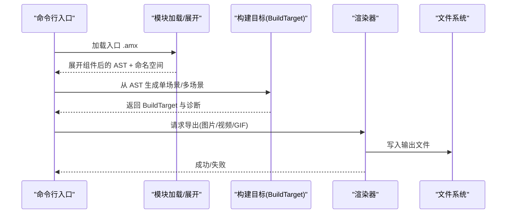
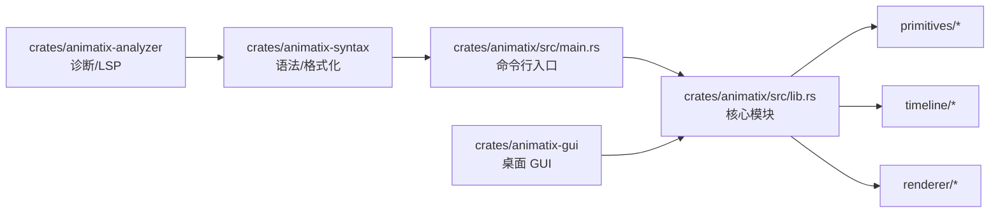

# 用户指南

<cite>
**本文引用的文件**
- [Readme.md](file://Readme.md)
- [Cargo.toml](file://Cargo.toml)
- [crates/animatix/src/lib.rs](file://crates/animatix/src/lib.rs)
- [crates/animatix/src/main.rs](file://crates/animatix/src/main.rs)
- [examples/00_hello.amx](file://examples/00_hello.amx)
- [examples/01_shapes.amx](file://examples/01_shapes.amx)
- [examples/02_layout.amx](file://examples/02_layout.amx)
- [examples/03_timing.amx](file://examples/03_timing.amx)
- [examples/04_motion.amx](file://examples/04_motion.amx)
- [examples/05_morph.amx](file://examples/05_morph.amx)
- [examples/06_reactive.amx](file://examples/06_reactive.amx)
- [examples/07_plots.amx](file://examples/07_plots.amx)
- [examples/08_effects.amx](file://examples/08_effects.amx)
- [examples/09_components.amx](file://examples/09_components.amx)
- [examples/10_modules.amx](file://examples/10_modules.amx)
- [examples/11_colors.amx](file://examples/11_colors.amx)
- [examples/13_paths.amx](file://examples/13_paths.amx)
- [examples/14_multiscene.amx](file://examples/14_multiscene.amx)
- [examples/16_showcase.amx](file://examples/16_showcase.amx)
- [examples/17_audio_reactive.amx](file://examples/17_audio_reactive.amx)
</cite>

## 目录
1. [简介](#简介)
2. [项目结构](#项目结构)
3. [核心组件](#核心组件)
4. [架构总览](#架构总览)
5. [详细组件解析](#详细组件解析)
6. [依赖关系分析](#依赖关系分析)
7. [性能与渲染](#性能与渲染)
8. [故障排查](#故障排查)
9. [结论](#结论)
10. [附录：示例与用法索引](#附录示例与用法索引)

## 简介
Animatix 是一门声明式的动画语言与 Rust 渲染引擎，专注于解释性数学、图表与矢量动画的创作。它提供：
- 命令行渲染器（CLI）与桌面 GUI 编辑器
- 丰富的原语（文本、数学、代码、SVG、图像、矩形、线段、椭圆、多边形、路径等）
- 容器布局（行、列、网格、堆叠、分组）
- 时间轴与动作系统（入场、出场、遮罩、重排、揭示、运动等）
- 组件与模块化导入/导出
- 多场景组合与转场
- 滤镜与特效（模糊、亮度、色相等）
- 数据可视化（函数图、向量场、热力图、曲线族）
- 反应式表达式与音频驱动

你可以通过命令行直接渲染图片、视频或 GIF，也可以在 GUI 中进行编辑与预览。

章节来源
- [Readme.md:1-178](file://Readme.md#L1-L178)

## 项目结构
仓库采用工作区组织，核心模块位于 crates/animatix，GUI 在 crates/animatix-gui，语法与分析器在独立 crate 中。examples 提供循序渐进的示例，覆盖从基础形状到高级组合的完整学习路径。

```mermaid
graph TB
subgraph "工作区"
A["crates/animatix<br/>核心引擎与运行时"]
B["crates/animatix-gui<br/>桌面 GUI"]
C["crates/animatix-analyzer<br/>诊断与分析"]
D["crates/animatix-lsp<br/>语言服务"]
E["crates/animatix-syntax<br/>语法与格式化"]
F["crates/tree-sitter-animatix<br/>编辑器语法树"]
end
subgraph "示例"
X1["examples/00_hello.amx"]
X2["examples/01_shapes.amx"]
X3["examples/02_layout.amx"]
X4["examples/03_timing.amx"]
X5["examples/04_motion.amx"]
X6["examples/05_morph.amx"]
X7["examples/06_reactive.amx"]
X8["examples/07_plots.amx"]
X9["examples/08_effects.amx"]
X10["examples/09_components.amx"]
X11["examples/10_modules.amx"]
X12["examples/11_colors.amx"]
X13["examples/13_paths.amx"]
X14["examples/14_multiscene.amx"]
X16["examples/16_showcase.amx"]
X17["examples/17_audio_reactive.amx"]
end
A --> B
A --> C
A --> D
A --> E
A --> F
X1 --> A
X2 --> A
X3 --> A
X4 --> A
X5 --> A
X6 --> A
X7 --> A
X8 --> A
X9 --> A
X10 --> A
X11 --> A
X12 --> A
X13 --> A
X14 --> A
X16 --> A
X17 --> A
```

图表来源
- [Cargo.toml:1-11](file://Cargo.toml#L1-L11)
- [crates/animatix/src/lib.rs:1-24](file://crates/animatix/src/lib.rs#L1-L24)

章节来源
- [Cargo.toml:1-11](file://Cargo.toml#L1-L11)
- [crates/animatix/src/lib.rs:1-24](file://crates/animatix/src/lib.rs#L1-L24)

## 核心组件
- 语言与语法：声明式语法、模块系统、类型检查与诊断
- 时间轴与动作：序列、交错、缓动、入场/出场/遮罩/重排/揭示、局部运动（平移/旋转/缩放）、全局变换矩阵
- 原语与容器：文本、数学、代码、SVG、图像、矩形、线段、椭圆、多边形、路径；行/列/网格/堆叠/分组
- 渲染后端：基于 Vello/WGPU 的离屏渲染与导出
- 多场景组合：场景声明、转场、自动路由与构建目标
- 滤镜与特效：模糊、亮度、饱和度、色相、对比度等
- 数据可视化：笛卡尔/极坐标/参数/隐式曲线族、向量场、热力图
- 反应式：always 表达式与 _animating_* 标志位检测

章节来源
- [Readme.md:100-113](file://Readme.md#L100-L113)
- [crates/animatix/src/lib.rs:12-24](file://crates/animatix/src/lib.rs#L12-L24)

## 架构总览
Animatix 的执行链路从 CLI 入口开始，加载与展开模块，构建 AST 并进行类型检查，随后生成单场景时间轴或跨场景组合，并调用渲染器输出图片、视频或 GIF。

图表来源
- [crates/animatix/src/main.rs:210-230](file://crates/animatix/src/main.rs#L210-L230)
- [crates/animatix/src/main.rs:346-446](file://crates/animatix/src/main.rs#L346-L446)
- [crates/animatix/src/main.rs:472-509](file://crates/animatix/src/main.rs#L472-L509)

章节来源
- [crates/animatix/src/main.rs:12-204](file://crates/animatix/src/main.rs#L12-L204)
- [crates/animatix/src/main.rs:210-230](file://crates/animatix/src/main.rs#L210-L230)
- [crates/animatix/src/main.rs:346-446](file://crates/animatix/src/main.rs#L346-L446)
- [crates/animatix/src/main.rs:472-509](file://crates/animatix/src/main.rs#L472-L509)

## 详细组件解析

### 形状与媒体：从基础到多样原语
- 学习要点：文本、数学、代码、SVG、图像、矩形、线段、椭圆、多边形、路径
- 实践建议：先用 Grid/Row/Col/Stack/Group 组织布局，再逐个为元素添加属性与动画
- 示例参考：
  - [examples/01_shapes.amx:1-46](file://examples/01_shapes.amx#L1-L46)
  - [examples/00_hello.amx:1-22](file://examples/00_hello.amx#L1-L22)

章节来源
- [examples/01_shapes.amx:1-46](file://examples/01_shapes.amx#L1-L46)
- [examples/00_hello.amx:1-22](file://examples/00_hello.amx#L1-L22)

### 容器与布局：行/列/网格/堆叠/分组
- 学习要点：容器的对齐、间距、内边距、锚点与偏移；动态属性（如透明度）可随时间变化
- 实践建议：先用容器承载子元素，再用交错/序列控制出现节奏
- 示例参考：
  - [examples/02_layout.amx:1-55](file://examples/02_layout.amx#L1-L55)

章节来源
- [examples/02_layout.amx:1-55](file://examples/02_layout.amx#L1-L55)

### 时间与节奏：序列、交错与缓动
- 学习要点：stagger 与 sequence 控制节奏；ease-* 缓动函数塑造动感
- 实践建议：从 100–200ms 的微小延迟开始，逐步增加到 500ms+ 的明显停顿
- 示例参考：
  - [examples/03_timing.amx:1-35](file://examples/03_timing.amx#L1-L35)

章节来源
- [examples/03_timing.amx:1-35](file://examples/03_timing.amx#L1-L35)

### 运动与变换：平移/旋转/缩放与反应式
- 学习要点：shift/rotate/scale 动作；transform 矩阵；always 反应式表达式
- 实践建议：先做单一动作验证，再叠加多个动作；利用 always 驱动实时反馈
- 示例参考：
  - [examples/04_motion.amx:1-44](file://examples/04_motion.amx#L1-L44)
  - [examples/06_reactive.amx:1-59](file://examples/06_reactive.amx#L1-L59)

章节来源
- [examples/04_motion.amx:1-44](file://examples/04_motion.amx#L1-L44)
- [examples/06_reactive.amx:1-59](file://examples/06_reactive.amx#L1-L59)

### 形变与插值：形状互换与策略
- 学习要点：重新声明触发自动插值；strategy/auto/match/fade/stretch/path_arc 等策略
- 实践建议：从简单几何（圆→方）开始，逐步尝试复杂多边形与路径
- 示例参考：
  - [examples/05_morph.amx:1-41](file://examples/05_morph.amx#L1-L41)

章节来源
- [examples/05_morph.amx:1-41](file://examples/05_morph.amx#L1-L41)

### 路径与变换矩阵：贝塞尔、仿射与形态变化
- 学习要点：Path 命令集；多边形与路径之间的形态变化；仿射变换矩阵
- 实践建议：先掌握 move_to/line_to/close，再引入曲线命令
- 示例参考：
  - [examples/13_paths.amx:1-50](file://examples/13_paths.amx#L1-L50)

章节来源
- [examples/13_paths.amx:1-50](file://examples/13_paths.amx#L1-L50)

### 效果与滤镜：模糊/亮度/色相等
- 学习要点：Filter 原语支持多类效果；结合 shake/pulse/bounce 等动作
- 实践建议：先在背景层应用模糊/亮度，再在前景层叠加色相等效果
- 示例参考：
  - [examples/08_effects.amx:1-63](file://examples/08_effects.amx#L1-L63)

章节来源
- [examples/08_effects.amx:1-63](file://examples/08_effects.amx#L1-L63)

### 数据可视化：函数图/向量场/热力图
- 学习要点：Graph/PlotCurve 支持多种坐标系；VectorField/Heatmap
- 实践建议：先画主图，再叠加其他图层；注意 domain 与 size 的匹配
- 示例参考：
  - [examples/07_plots.amx:1-37](file://examples/07_plots.amx#L1-L37)

章节来源
- [examples/07_plots.amx:1-37](file://examples/07_plots.amx#L1-L37)

### 颜色系统：语义令牌、auto、常量与扩展
- 学习要点：Colorscheme extends、auto 自动配色、内置颜色常量
- 实践建议：定义主题色板后，统一使用语义令牌命名
- 示例参考：
  - [examples/11_colors.amx:1-76](file://examples/11_colors.amx#L1-L76)

章节来源
- [examples/11_colors.amx:1-76](file://examples/11_colors.amx#L1-L76)

### 组件与模块：导入/导出/设计令牌
- 学习要点：pub component、@slot、action、import/作为/导出/重导出链
- 实践建议：将通用卡片/按钮封装为组件，通过参数化复用
- 示例参考：
  - [examples/09_components.amx:1-62](file://examples/09_components.amx#L1-L62)
  - [examples/10_modules.amx:1-54](file://examples/10_modules.amx#L1-L54)

章节来源
- [examples/09_components.amx:1-62](file://examples/09_components.amx#L1-L62)
- [examples/10_modules.amx:1-54](file://examples/10_modules.amx#L1-L54)

### 多场景组合：场景声明与转场
- 学习要点：#场景名、play 切换、per-scene 时间轴、自动路由
- 实践建议：先在本地验证各场景，再整体导出
- 示例参考：
  - [examples/14_multiscene.amx:1-72](file://examples/14_multiscene.amx#L1-L72)

章节来源
- [examples/14_multiscene.amx:1-72](file://examples/14_multiscene.amx#L1-L72)

### 音频驱动：波形可视化
- 学习要点：Audio 非可视音轨；always 驱动条形高度
- 实践建议：配合音轨长度设置动画时长，保持视觉与听觉同步
- 示例参考：
  - [examples/17_audio_reactive.amx:1-63](file://examples/17_audio_reactive.amx#L1-L63)

章节来源
- [examples/17_audio_reactive.amx:1-63](file://examples/17_audio_reactive.amx#L1-L63)

### 综合展示：布局·形变·路径·反应式
- 学习要点：多元素组合、多阶段动画、always 实时缩放
- 实践建议：以“标题—牌组—星标—脉冲”为主线，逐步叠加效果
- 示例参考：
  - [examples/16_showcase.amx:1-59](file://examples/16_showcase.amx#L1-L59)

章节来源
- [examples/16_showcase.amx:1-59](file://examples/16_showcase.amx#L1-L59)

## 依赖关系分析
Animatix 的 CLI 作为统一入口，负责加载模块、构建目标并调度渲染器；核心引擎提供时间轴、原语与渲染能力；GUI 依赖核心引擎进行预览与交互；语法与分析器为编辑体验提供支撑。

图表来源
- [crates/animatix/src/main.rs:12-204](file://crates/animatix/src/main.rs#L12-L204)
- [crates/animatix/src/lib.rs:12-24](file://crates/animatix/src/lib.rs#L12-L24)

章节来源
- [crates/animatix/src/main.rs:12-204](file://crates/animatix/src/main.rs#L12-L204)
- [crates/animatix/src/lib.rs:12-24](file://crates/animatix/src/lib.rs#L12-L24)

## 性能与渲染
- 导出选项
  - 图片：指定分辨率与时间戳，输出 PNG
  - 视频：指定分辨率、帧率、时长与编码器/预设
  - GIF：指定分辨率、帧率、时长与线程数
- 调试辅助
  - 可选绘制节点边界框
  - 渲染烟雾测试（在 Check 命令中启用）
- 多场景导出
  - 自动路由与转场拼接，按场景时长与 hold 参数决定最终时长

章节来源
- [crates/animatix/src/main.rs:52-158](file://crates/animatix/src/main.rs#L52-L158)
- [crates/animatix/src/main.rs:159-203](file://crates/animatix/src/main.rs#L159-L203)
- [crates/animatix/src/main.rs:232-238](file://crates/animatix/src/main.rs#L232-L238)
- [crates/animatix/src/main.rs:250-312](file://crates/animatix/src/main.rs#L250-L312)

## 故障排查
- 诊断输出
  - 文本/JSON 两种格式；错误会终止进程
  - 可与源码高亮联动，定位问题行
- 渲染烟雾测试
  - 在 Check 中启用，快速发现渲染器异常
- 常见问题
  - 解析错误：检查语法与括号匹配
  - 类型错误：确认属性与原语兼容
  - 多场景缺失场景名：确保 play 目标存在

章节来源
- [crates/animatix/src/main.rs:511-597](file://crates/animatix/src/main.rs#L511-L597)
- [crates/animatix/src/main.rs:598-713](file://crates/animatix/src/main.rs#L598-L713)
- [crates/animatix/src/main.rs:789-799](file://crates/animatix/src/main.rs#L789-L799)

## 结论
通过从基础形状与布局入手，逐步掌握时间轴、运动、形变、路径、滤镜、数据可视化与组件/模块化体系，你可以在 Animatix 中实现从入门到专业的动画创作。结合 CLI 的高效导出与 GUI 的直观预览，可以快速迭代并交付高质量作品。

## 附录：示例与用法索引
- 快速上手与多场景导出：[Readme.md:9-96](file://Readme.md#L9-L96)
- 基础示例清单与说明：[Readme.md:114-141](file://Readme.md#L114-L141)
- 逐级示例路径
  - Hello 与标题卡：[examples/00_hello.amx:1-22](file://examples/00_hello.amx#L1-L22)
  - 形状画廊：[examples/01_shapes.amx:1-46](file://examples/01_shapes.amx#L1-L46)
  - 容器与网格：[examples/02_layout.amx:1-55](file://examples/02_layout.amx#L1-L55)
  - 序列/交错/缓动：[examples/03_timing.amx:1-35](file://examples/03_timing.amx#L1-L35)
  - 运动与反应式：[examples/04_motion.amx:1-44](file://examples/04_motion.amx#L1-L44)、[examples/06_reactive.amx:1-59](file://examples/06_reactive.amx#L1-L59)
  - 形变与策略：[examples/05_morph.amx:1-41](file://examples/05_morph.amx#L1-L41)
  - 路径与矩阵：[examples/13_paths.amx:1-50](file://examples/13_paths.amx#L1-L50)
  - 效果与滤镜：[examples/08_effects.amx:1-63](file://examples/08_effects.amx#L1-L63)
  - 数据可视化：[examples/07_plots.amx:1-37](file://examples/07_plots.amx#L1-L37)
  - 颜色系统：[examples/11_colors.amx:1-76](file://examples/11_colors.amx#L1-L76)
  - 组件与模块：[examples/09_components.amx:1-62](file://examples/09_components.amx#L1-L62)、[examples/10_modules.amx:1-54](file://examples/10_modules.amx#L1-L54)
  - 多场景组合：[examples/14_multiscene.amx:1-72](file://examples/14_multiscene.amx#L1-L72)
  - 音频驱动：[examples/17_audio_reactive.amx:1-63](file://examples/17_audio_reactive.amx#L1-L63)
  - 综合展示：[examples/16_showcase.amx:1-59](file://examples/16_showcase.amx#L1-L59)