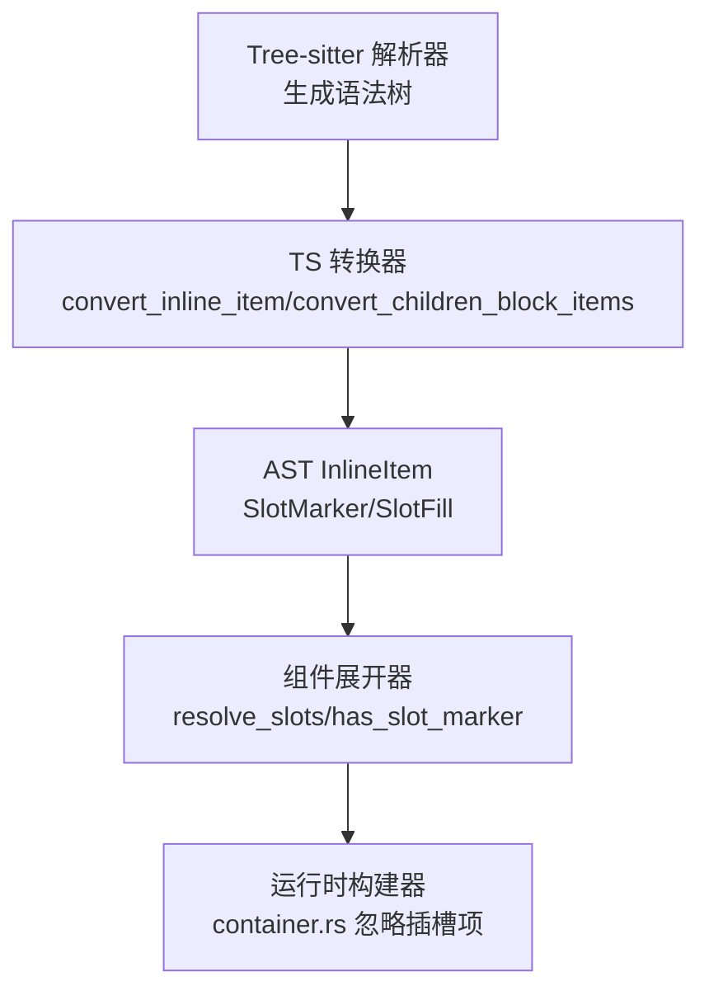
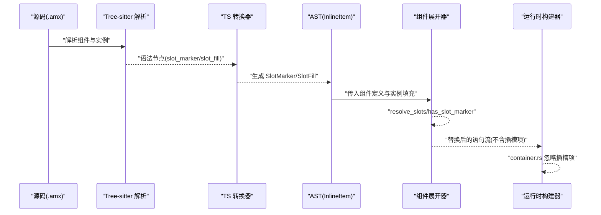
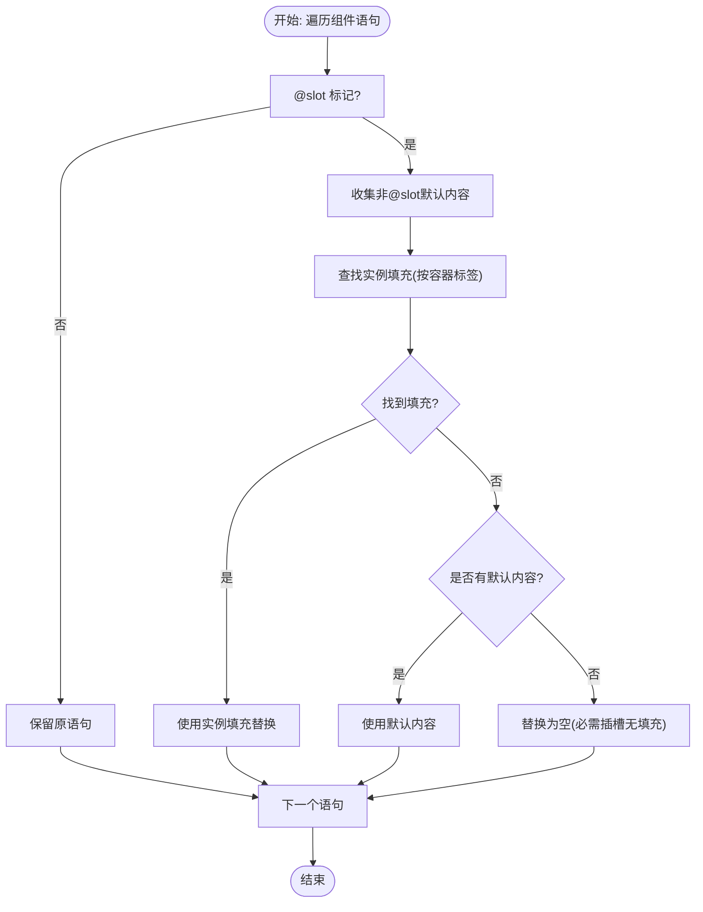

# 插槽机制

<cite>
**本文引用的文件**
- [crates/animatix-syntax/src/ast.rs](file://crates/animatix-syntax/src/ast.rs)
- [crates/animatix-syntax/src/ts_convert.rs](file://crates/animatix-syntax/src/ts_convert.rs)
- [crates/animatix-syntax/src/module/expand.rs](file://crates/animatix-syntax/src/module/expand.rs)
- [crates/animatix/src/timeline/build/container.rs](file://crates/animatix/src/timeline/build/container.rs)
- [crates/animatix/tests/module_tests.rs](file://crates/animatix/tests/module_tests.rs)
- [crates/animatix/tests/parser_tests.rs](file://crates/animatix/tests/parser_tests.rs)
- [tree-sitter-animatix/queries/slots_and_actions.txt](file://tree-sitter-animatix/queries/slots_and_actions.txt)
- [examples/lib/components.amx](file://examples/lib/components.amx)
- [examples/lib/card.amx](file://examples/lib/card.amx)
- [examples/09_components.amx](file://examples/09_components.amx)
</cite>

## 目录
1. [引言](#引言)
2. [项目结构](#项目结构)
3. [核心组件](#核心组件)
4. [架构总览](#架构总览)
5. [详细组件分析](#详细组件分析)
6. [依赖关系分析](#依赖关系分析)
7. [性能考量](#性能考量)
8. [故障排查指南](#故障排查指南)
9. [结论](#结论)
10. [附录](#附录)

## 引言
本文件系统性阐述 Animatix 中“插槽（@slot）”机制的设计与实现，覆盖从语法解析、AST 表达、组件展开到运行时构建的全链路。重点说明：
- @slot 的工作原理：标记容器内的可替换内容区域，支持默认内容与实例填充。
- 使用方法：在组件容器内声明 @slot，并在实例中通过 @slot 块为对应容器注入内容。
- 高级用法：嵌套插槽、空填充、非存在插槽名忽略、混合填充与默认回退。
- 生命周期与通信：解析阶段识别与转换、展开阶段解析并替换、构建阶段忽略插槽项。
- 实战示例：基础内容替换、多插槽卡片组件、复杂布局嵌套与响应式调整。

## 项目结构
围绕插槽机制的关键模块与文件如下：
- 语法与 AST 定义：在语法层定义 SlotMarker 与 SlotFill；在类型系统中表达插槽项。
- 解析与转换：将 Tree-sitter 结果映射为 AST 的 InlineItem，识别 @slot 与 @slot 填充块。
- 组件展开：在组件实例化时，按容器标签匹配插槽，优先使用实例填充，否则回退到组件默认内容。
- 运行时构建：构建阶段遇到插槽项会跳过处理，因为插槽已在展开阶段完成替换。

图表来源
- [crates/animatix-syntax/src/ts_convert.rs:1107-1201](file://crates/animatix-syntax/src/ts_convert.rs#L1107-L1201)
- [crates/animatix-syntax/src/ast.rs:457-481](file://crates/animatix-syntax/src/ast.rs#L457-L481)
- [crates/animatix-syntax/src/module/expand.rs:438-478](file://crates/animatix-syntax/src/module/expand.rs#L438-L478)
- [crates/animatix/src/timeline/build/container.rs:68-70](file://crates/animatix/src/timeline/build/container.rs#L68-L70)

章节来源
- [crates/animatix-syntax/src/ts_convert.rs:1107-1201](file://crates/animatix-syntax/src/ts_convert.rs#L1107-L1201)
- [crates/animatix-syntax/src/ast.rs:457-481](file://crates/animatix-syntax/src/ast.rs#L457-L481)
- [crates/animatix-syntax/src/module/expand.rs:438-478](file://crates/animatix-syntax/src/module/expand.rs#L438-L478)
- [crates/animatix/src/timeline/build/container.rs:68-70](file://crates/animatix/src/timeline/build/container.rs#L68-L70)

## 核心组件
- AST 插槽项类型
  - SlotMarker：表示容器内的 @slot 标记，用于标识该容器为可替换区域。
  - SlotFill：表示实例对某容器插槽的填充，包含插槽名与填充内容列表。
- 解析与转换
  - 将 Tree-sitter 的 “slot_marker”、“slot_fill” 节点转换为 AST 的 InlineItem。
- 展开逻辑
  - 在组件实例化时，收集实例提供的 SlotFill，按容器标签匹配原组件中的 SlotMarker。
  - 若有实例填充则替换，否则使用组件默认内容；若两者皆无则为空。
- 构建阶段
  - 构建器遇到插槽项会直接跳过，因为插槽已由展开阶段完成替换。

章节来源
- [crates/animatix-syntax/src/ast.rs:457-481](file://crates/animatix-syntax/src/ast.rs#L457-L481)
- [crates/animatix-syntax/src/ts_convert.rs:1107-1201](file://crates/animatix-syntax/src/ts_convert.rs#L1107-L1201)
- [crates/animatix-syntax/src/module/expand.rs:438-478](file://crates/animatix-syntax/src/module/expand.rs#L438-L478)
- [crates/animatix/src/timeline/build/container.rs:68-70](file://crates/animatix/src/timeline/build/container.rs#L68-L70)

## 架构总览
下图展示了从源码到运行时的插槽处理流程：

图表来源
- [crates/animatix-syntax/src/ts_convert.rs:1107-1201](file://crates/animatix-syntax/src/ts_convert.rs#L1107-L1201)
- [crates/animatix-syntax/src/module/expand.rs:438-478](file://crates/animatix-syntax/src/module/expand.rs#L438-L478)
- [crates/animatix/src/timeline/build/container.rs:68-70](file://crates/animatix/src/timeline/build/container.rs#L68-L70)

## 详细组件分析

### 语法与 AST：@slot 的表示
- SlotMarker：出现在容器 children 中，标记该容器为插槽区域。
- SlotFill：出现在实例 children 中，携带插槽名与填充内容列表。
- 默认内容：当容器仅包含 @slot 时视为必需插槽；若容器还包含其他子项，则这些子项作为默认内容参与回退。

章节来源
- [crates/animatix-syntax/src/ast.rs:457-481](file://crates/animatix-syntax/src/ast.rs#L457-L481)
- [crates/animatix/tests/parser_tests.rs:1446-1468](file://crates/animatix/tests/parser_tests.rs#L1446-L1468)

### 解析与转换：从 Tree-sitter 到 AST
- 将 “slot_marker” 节点转换为 SlotMarker。
- 将 “slot_fill” 节点转换为 SlotFill，提取名称与内部子项列表。
- children_block 中同时出现 @slot 与默认内容时，均被转换为 InlineItem 序列。

章节来源
- [crates/animatix-syntax/src/ts_convert.rs:1107-1201](file://crates/animatix-syntax/src/ts_convert.rs#L1107-L1201)
- [crates/animatix/tests/parser_tests.rs:1470-1484](file://crates/animatix/tests/parser_tests.rs#L1470-L1484)

### 组件展开：插槽解析与替换
- 收集实例中的 SlotFill，以容器标签为键建立映射。
- 遍历组件定义的语句，遇到包含 @slot 的容器：
  - 提取非 @slot 的默认内容；
  - 查找实例是否提供了同名插槽填充；
  - 优先使用实例填充，否则使用默认内容；若两者都不存在则为空。
- 展开后得到不含插槽项的语句序列，供后续构建阶段使用。

图表来源
- [crates/animatix-syntax/src/module/expand.rs:438-478](file://crates/animatix-syntax/src/module/expand.rs#L438-L478)

章节来源
- [crates/animatix-syntax/src/module/expand.rs:438-478](file://crates/animatix-syntax/src/module/expand.rs#L438-L478)

### 运行时构建：插槽项的忽略
- 构建阶段遇到插槽项会直接跳过，因为插槽已在展开阶段完成替换。
- 这保证了构建器只处理最终确定的子树，避免重复或遗漏。

章节来源
- [crates/animatix/src/timeline/build/container.rs:68-70](file://crates/animatix/src/timeline/build/container.rs#L68-L70)

### 测试验证：典型场景
- 基础插槽填充与展开校验。
- 默认内容回退策略。
- 混合填充与未填充插槽。
- 空填充与非存在插槽名的处理。
- 多实例共享同一组件的不同填充。

章节来源
- [crates/animatix/tests/module_tests.rs:461-502](file://crates/animatix/tests/module_tests.rs#L461-L502)
- [crates/animatix/tests/module_tests.rs:504-539](file://crates/animatix/tests/module_tests.rs#L504-L539)
- [crates/animatix/tests/module_tests.rs:541-583](file://crates/animatix/tests/module_tests.rs#L541-L583)
- [crates/animatix/tests/module_tests.rs:687-723](file://crates/animatix/tests/module_tests.rs#L687-L723)
- [crates/animatix/tests/module_tests.rs:725-762](file://crates/animatix/tests/module_tests.rs#L725-L762)
- [crates/animatix/tests/module_tests.rs:764-803](file://crates/animatix/tests/module_tests.rs#L764-L803)
- [crates/animatix/tests/module_tests.rs:805-841](file://crates/animatix/tests/module_tests.rs#L805-L841)

### 示例与实战：组件与场景
- 组件库示例：定义带多个插槽的卡片组件，供不同场景复用。
- 场景文件：在具体场景中实例化组件并填充插槽，形成多样化布局。
- 查询文件：Tree-sitter 查询中包含插槽与动作相关规则，辅助语法高亮与工具链行为。

章节来源
- [examples/lib/components.amx](file://examples/lib/components.amx)
- [examples/lib/card.amx](file://examples/lib/card.amx)
- [examples/09_components.amx](file://examples/09_components.amx)
- [tree-sitter-animatix/queries/slots_and_actions.txt](file://tree-sitter-animatix/queries/slots_and_actions.txt)

## 依赖关系分析
- 语法层依赖：Tree-sitter 节点类型与 TS 转换器共同产出 AST 的插槽项。
- 展开层依赖：组件展开器依赖 AST 中的 SlotMarker/SlotFill 与容器标签进行匹配与替换。
- 构建层依赖：构建器不关心插槽项，仅处理展开后的最终语句流。

图表来源
- [crates/animatix-syntax/src/ts_convert.rs:1107-1201](file://crates/animatix-syntax/src/ts_convert.rs#L1107-L1201)
- [crates/animatix-syntax/src/module/expand.rs:438-478](file://crates/animatix-syntax/src/module/expand.rs#L438-L478)
- [crates/animatix/src/timeline/build/container.rs:68-70](file://crates/animatix/src/timeline/build/container.rs#L68-L70)

章节来源
- [crates/animatix-syntax/src/ts_convert.rs:1107-1201](file://crates/animatix-syntax/src/ts_convert.rs#L1107-L1201)
- [crates/animatix-syntax/src/module/expand.rs:438-478](file://crates/animatix-syntax/src/module/expand.rs#L438-L478)
- [crates/animatix/src/timeline/build/container.rs:68-70](file://crates/animatix/src/timeline/build/container.rs#L68-L70)

## 性能考量
- 解析与转换阶段：将 Tree-sitter 节点映射为 AST 的开销较小，主要为线性扫描与克隆。
- 组件展开阶段：按容器标签匹配插槽填充，时间复杂度近似 O(N)（N 为组件语句数），哈希查找填充映射为平均 O(1)。
- 构建阶段：忽略插槽项，避免重复遍历，整体构建效率稳定。
- 内存占用：插槽展开后不再保留插槽项，减少运行时数据结构体积。

## 故障排查指南
- 插槽未生效
  - 检查实例中的 @slot 块是否正确命名，且与组件容器标签一致。
  - 确认组件容器中确实存在 @slot 标记；若仅有默认内容而无 @slot，则不会产生可填充的插槽。
- 默认内容未出现
  - 当实例提供了同名插槽填充时，默认内容会被忽略；确认是否误填或漏填。
  - 若容器仅包含 @slot，且实例未提供填充，则该插槽为空。
- 非存在插槽名
  - 实例中填写了组件不存在的插槽名会被忽略，不会报错但也不会生效。
- 空填充
  - 实例中 @slot {} 会清空该插槽，确保默认内容不会出现。

章节来源
- [crates/animatix/tests/module_tests.rs:687-723](file://crates/animatix/tests/module_tests.rs#L687-L723)
- [crates/animatix/tests/module_tests.rs:764-803](file://crates/animatix/tests/module_tests.rs#L764-L803)
- [crates/animatix/tests/parser_tests.rs:1536-1557](file://crates/animatix/tests/parser_tests.rs#L1536-L1557)

## 结论
Animatix 的插槽机制通过清晰的语法标记、严谨的 AST 表达、高效的展开替换与稳定的构建阶段处理，实现了灵活的组件内容可替换能力。其设计兼顾易用性与性能，适用于多种复杂布局与响应式场景。遵循本文的最佳实践与排障建议，可在项目中高效地使用插槽提升组件复用与维护性。

## 附录
- 最佳实践
  - 明确区分“必需插槽（仅 @slot）”与“可选插槽（@slot + 默认内容）”，并在实例中按需填充。
  - 对于复杂组件，建议为每个重要容器提供命名插槽，便于多实例差异化定制。
  - 避免在实例中使用不存在的插槽名；如需清空插槽，使用空 @slot 块。
  - 在多实例场景中，统一管理组件库与场景文件，保持插槽命名一致性。
- 参考示例
  - 组件库与场景文件展示了插槽在实际项目中的应用方式，可作为模板参考。

章节来源
- [examples/lib/components.amx](file://examples/lib/components.amx)
- [examples/lib/card.amx](file://examples/lib/card.amx)
- [examples/09_components.amx](file://examples/09_components.amx)
- [tree-sitter-animatix/queries/slots_and_actions.txt](file://tree-sitter-animatix/queries/slots_and_actions.txt)