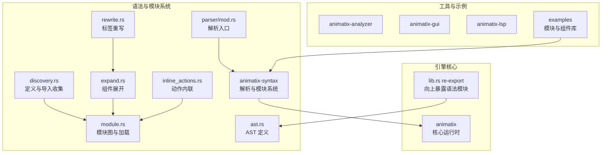
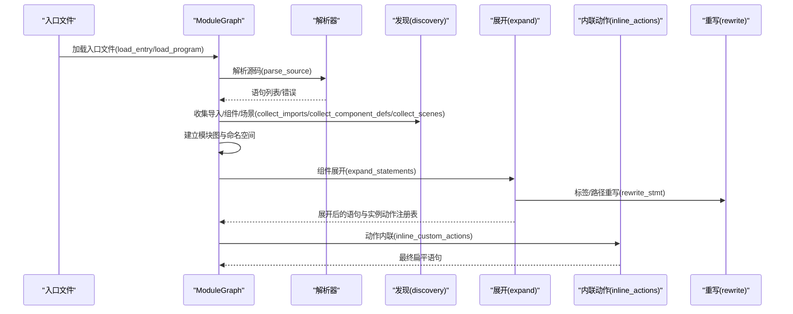
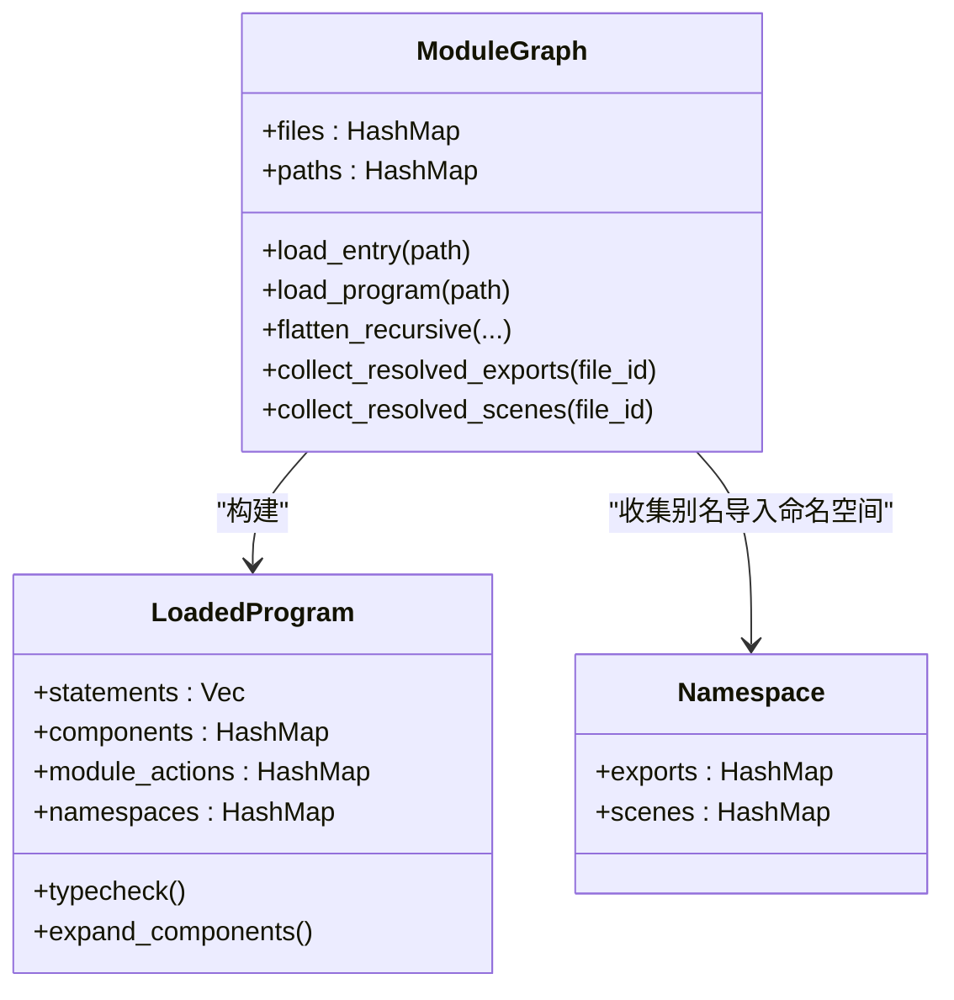
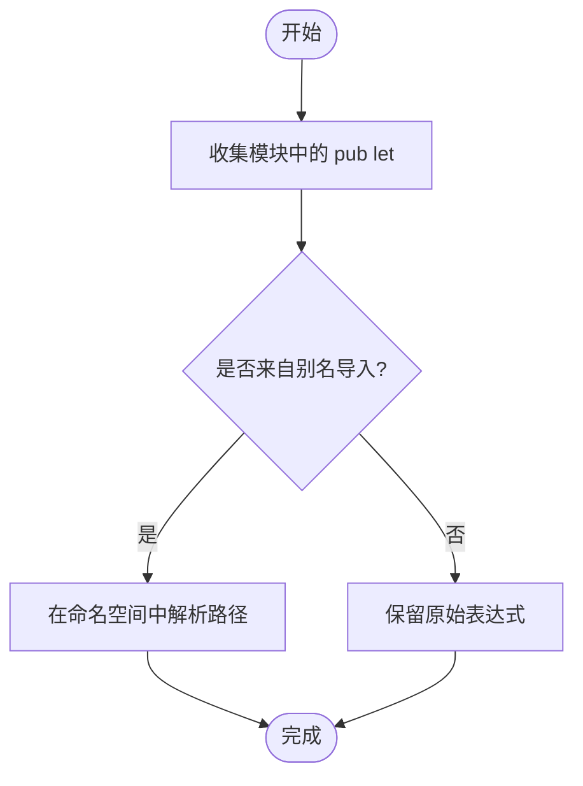
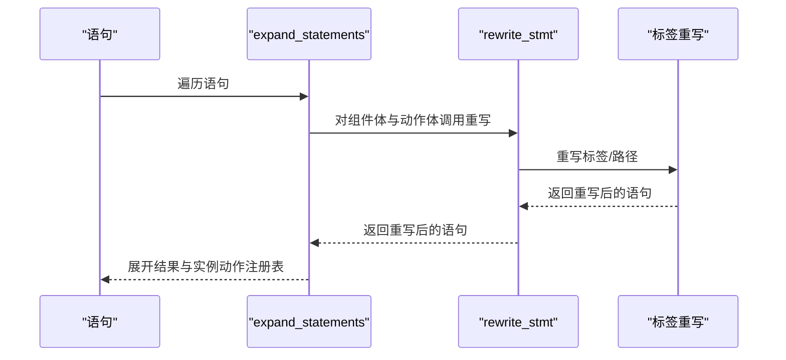
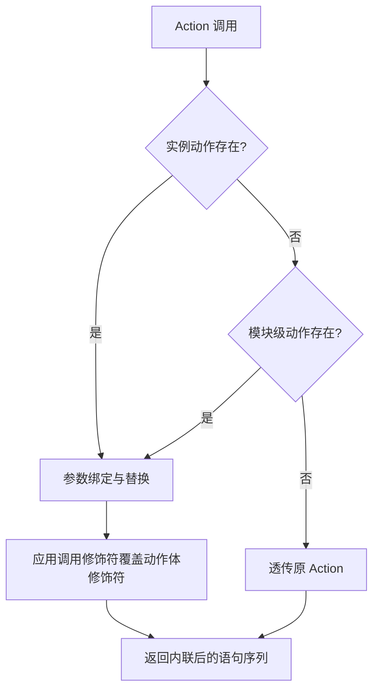
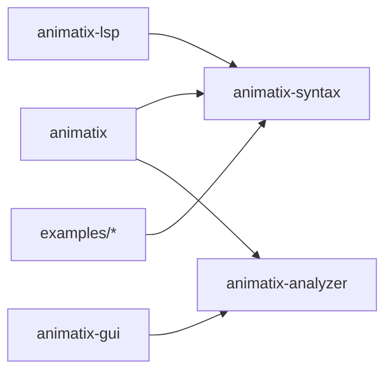

# 模块系统

<cite>
**本文引用的文件**
- [crates/animatix/src/lib.rs](file://crates/animatix/src/lib.rs)
- [crates/animatix/Cargo.toml](file://crates/animatix/Cargo.toml)
- [crates/animatix-syntax/src/lib.rs](file://crates/animatix-syntax/src/lib.rs)
- [crates/animatix-syntax/src/module.rs](file://crates/animatix-syntax/src/module.rs)
- [crates/animatix-syntax/src/module/discovery.rs](file://crates/animatix-syntax/src/module/discovery.rs)
- [crates/animatix-syntax/src/module/expand.rs](file://crates/animatix-syntax/src/module/expand.rs)
- [crates/animatix-syntax/src/module/inline_actions.rs](file://crates/animatix-syntax/src/module/inline_actions.rs)
- [crates/animatix-syntax/src/module/rewrite.rs](file://crates/animatix-syntax/src/module/rewrite.rs)
- [crates/animatix-syntax/src/parser/mod.rs](file://crates/animatix-syntax/src/parser/mod.rs)
- [crates/animatix-syntax/src/ast.rs](file://crates/animatix-syntax/src/ast.rs)
- [examples/lib/actions.amx](file://examples/lib/actions.amx)
- [examples/lib/components.amx](file://examples/lib/components.amx)
- [examples/lib/reexport.amx](file://examples/lib/reexport.amx)
- [examples/lib/palette.amx](file://examples/lib/palette.amx)
- [examples/lib/tokens.amx](file://examples/lib/tokens.amx)
- [examples/lib/card.amx](file://examples/lib/card.amx)
- [examples/10_modules.amx](file://examples/10_modules.amx)
</cite>

## 目录
1. [引言](#引言)
2. [项目结构](#项目结构)
3. [核心组件](#核心组件)
4. [架构总览](#架构总览)
5. [详细组件分析](#详细组件分析)
6. [依赖分析](#依赖分析)
7. [性能考量](#性能考量)
8. [故障排查指南](#故障排查指南)
9. [结论](#结论)
10. [附录](#附录)

## 引言
本文件系统性阐述 Animatix 的模块系统：如何在多文件源码中进行导入与导出（pub 导出、私有成员与重导出）、命名空间管理、模块路径解析与依赖关系处理；并深入讲解模块间通信（组件动作、实例动作、模块级动作）、接口设计与版本兼容性考虑。同时给出模块组织最佳实践（目录结构、职责划分、依赖管理）以及大型项目的模块化开发与组件库构建方法。

## 项目结构
Animatix 采用多 crate 的分层组织：
- animatix-syntax：语法解析、AST 定义、模块系统实现（含发现、展开、内联、重写等子模块）
- animatix：引擎核心（组合、中间表示、原语、渲染、时间线、虚拟机），内部通过 re-export 向上暴露语法模块
- animatix-analyzer：语言分析器（补全、跳转、诊断等）
- animatix-gui：可视化编辑器
- animatix-lsp：语言服务
- examples：示例与组件库，演示模块导入、pub 导出与重导出链

图表来源
- [crates/animatix/src/lib.rs:1-24](file://crates/animatix/src/lib.rs#L1-L24)
- [crates/animatix-syntax/src/lib.rs:1-29](file://crates/animatix-syntax/src/lib.rs#L1-L29)
- [crates/animatix-syntax/src/module.rs:1-800](file://crates/animatix-syntax/src/module.rs#L1-L800)
- [crates/animatix-syntax/src/module/discovery.rs:1-186](file://crates/animatix-syntax/src/module/discovery.rs#L1-L186)
- [crates/animatix-syntax/src/module/expand.rs:1-499](file://crates/animatix-syntax/src/module/expand.rs#L1-L499)
- [crates/animatix-syntax/src/module/inline_actions.rs:1-611](file://crates/animatix-syntax/src/module/inline_actions.rs#L1-L611)
- [crates/animatix-syntax/src/module/rewrite.rs:1-745](file://crates/animatix-syntax/src/module/rewrite.rs#L1-L745)
- [crates/animatix-syntax/src/parser/mod.rs:1-676](file://crates/animatix-syntax/src/parser/mod.rs#L1-L676)
- [crates/animatix-syntax/src/ast.rs:1-200](file://crates/animatix-syntax/src/ast.rs#L1-L200)

章节来源
- [crates/animatix/src/lib.rs:1-24](file://crates/animatix/src/lib.rs#L1-L24)
- [crates/animatix-syntax/src/lib.rs:1-29](file://crates/animatix-syntax/src/lib.rs#L1-L29)

## 核心组件
- 模块图与加载（ModuleGraph、LoadedProgram）：负责文件加载、导入解析、组件与动作收集、命名空间构建、场景数据扁平化与重导出解析
- 发现与剥离（discovery）：收集 import、pub let、组件定义、场景等；剥离 import 以生成扁平语句
- 展开（expand）：将组件实例展开为具体语句，收集实例动作模板，支持槽位填充与循环检测
- 内联动作（inline_actions）：按调用参数替换动作体，应用调用修饰符覆盖默认修饰符
- 重写（rewrite）：对标签、路径、表达式进行前缀重写，确保作用域与实例隔离
- 解析器（parser/mod）：chumsky 递归下降解析器，支持增量树-锯解析回退
- AST（ast）：表达式、语句、修饰符、属性、场景等节点定义

章节来源
- [crates/animatix-syntax/src/module.rs:48-128](file://crates/animatix-syntax/src/module.rs#L48-L128)
- [crates/animatix-syntax/src/module/discovery.rs:6-186](file://crates/animatix-syntax/src/module/discovery.rs#L6-L186)
- [crates/animatix-syntax/src/module/expand.rs:34-395](file://crates/animatix-syntax/src/module/expand.rs#L34-L395)
- [crates/animatix-syntax/src/module/inline_actions.rs:22-378](file://crates/animatix-syntax/src/module/inline_actions.rs#L22-L378)
- [crates/animatix-syntax/src/module/rewrite.rs:114-318](file://crates/animatix-syntax/src/module/rewrite.rs#L114-L318)
- [crates/animatix-syntax/src/parser/mod.rs:94-128](file://crates/animatix-syntax/src/parser/mod.rs#L94-L128)
- [crates/animatix-syntax/src/ast.rs:101-154](file://crates/animatix-syntax/src/ast.rs#L101-L154)

## 架构总览
模块系统从“入口文件”开始，递归加载所有导入文件，构建模块图；随后收集组件、动作、命名空间与场景，再进行组件展开与动作内联，最终得到可执行的扁平语句流。期间通过“重写”保证标签与路径的作用域安全。

图表来源
- [crates/animatix-syntax/src/module.rs:486-583](file://crates/animatix-syntax/src/module.rs#L486-L583)
- [crates/animatix-syntax/src/module/expand.rs:34-204](file://crates/animatix-syntax/src/module/expand.rs#L34-L204)
- [crates/animatix-syntax/src/module/inline_actions.rs:22-63](file://crates/animatix-syntax/src/module/inline_actions.rs#L22-L63)
- [crates/animatix-syntax/src/module/rewrite.rs:114-318](file://crates/animatix-syntax/src/module/rewrite.rs#L114-L318)
- [crates/animatix-syntax/src/parser/mod.rs:94-128](file://crates/animatix-syntax/src/parser/mod.rs#L94-L128)

## 详细组件分析

### 模块图与命名空间（ModuleGraph、LoadedProgram、Namespace）
- 文件缓存与去重：基于文件路径与 FileId 缓存已加载模块，避免重复解析
- 路径解析：相对路径拼接，规范化后作为键值
- 循环检测：访问栈记录当前路径，遇到环即报错
- 命名空间：仅对“别名导入”建立命名空间，解析 re-export 表达式，支持多段路径解析
- 场景收集：扁平化模块语句，提取场景及其“文件前言”（共享上下文）

图表来源
- [crates/animatix-syntax/src/module.rs:48-128](file://crates/animatix-syntax/src/module.rs#L48-L128)
- [crates/animatix-syntax/src/module.rs:518-583](file://crates/animatix-syntax/src/module.rs#L518-L583)
- [crates/animatix-syntax/src/module.rs:635-707](file://crates/animatix-syntax/src/module.rs#L635-L707)

章节来源
- [crates/animatix-syntax/src/module.rs:345-583](file://crates/animatix-syntax/src/module.rs#L345-L583)

### 导入与导出机制（pub let、私有成员、重导出）
- 导入：支持“import ... as 别名”与“import ...”两种形式；仅别名导入会进入命名空间
- pub let 导出：收集模块中的 pub let，形成导出映射
- 重导出：当 pub let 是“别名.标识符”路径时，解析到对应命名空间并递归解析
- 私有成员：未标记 pub 的 let 不参与导出

图表来源
- [crates/animatix-syntax/src/module.rs:157-198](file://crates/animatix-syntax/src/module.rs#L157-L198)
- [crates/animatix-syntax/src/module.rs:184-247](file://crates/animatix-syntax/src/module.rs#L184-L247)

章节来源
- [crates/animatix-syntax/src/module.rs:157-247](file://crates/animatix-syntax/src/module.rs#L157-L247)

### 组件展开与实例动作（expand、rewrite）
- 组件展开：遍历语句，遇到组件实例则根据参数绑定与槽位填充展开为具体语句，收集实例动作模板
- 标签重写：为每个实例生成唯一前缀，重写 self/根标签与已知标签，避免跨实例冲突
- 循环保护：最大展开深度限制，防止循环引用导致无限递归

图表来源
- [crates/animatix-syntax/src/module/expand.rs:34-204](file://crates/animatix-syntax/src/module/expand.rs#L34-L204)
- [crates/animatix-syntax/src/module/rewrite.rs:114-318](file://crates/animatix-syntax/src/module/rewrite.rs#L114-L318)

章节来源
- [crates/animatix-syntax/src/module/expand.rs:322-395](file://crates/animatix-syntax/src/module/expand.rs#L322-L395)
- [crates/animatix-syntax/src/module/rewrite.rs:601-682](file://crates/animatix-syntax/src/module/rewrite.rs#L601-L682)

### 动作内联（inline_actions）
- 实例动作优先：先在实例动作注册表中查找匹配的动作模板
- 模块级动作回退：若无实例动作，则尝试模块级动作
- 参数替换：按调用修饰符绑定参数，未消费的修饰符用于覆盖动作体修饰符
- 位置时间参数：如 duration 存在，位置型时间修饰符自动绑定

图表来源
- [crates/animatix-syntax/src/module/inline_actions.rs:22-63](file://crates/animatix-syntax/src/module/inline_actions.rs#L22-L63)
- [crates/animatix-syntax/src/module/inline_actions.rs:71-119](file://crates/animatix-syntax/src/module/inline_actions.rs#L71-L119)
- [crates/animatix-syntax/src/module/inline_actions.rs:344-378](file://crates/animatix-syntax/src/module/inline_actions.rs#L344-L378)

章节来源
- [crates/animatix-syntax/src/module/inline_actions.rs:22-378](file://crates/animatix-syntax/src/module/inline_actions.rs#L22-L378)

### 解析与增量解析（parser/mod）
- 解析入口：strip_comments 去除行注释（保留换行），统一交给 chumsky 解析
- 增量解析：tree-sitter 转换器提供增量解析，失败时回退至 chumsky
- 错误格式化：将解析错误转换为带行列号与上下文的诊断信息

章节来源
- [crates/animatix-syntax/src/parser/mod.rs:48-128](file://crates/animatix-syntax/src/parser/mod.rs#L48-L128)
- [crates/animatix-syntax/src/parser/mod.rs:190-273](file://crates/animatix-syntax/src/parser/mod.rs#L190-L273)

### AST 与表达式（ast）
- 表达式类型：数值、百分比、字符串、布尔、空值、标识符、路径、索引、元组/列表、二元/一元运算、函数/方法调用、闭包、条件表达式、构造表达式
- 源码定位：Span/ByteSpan 支持从字节跨度转换为行列号，便于编辑器同步与诊断

章节来源
- [crates/animatix-syntax/src/ast.rs:101-154](file://crates/animatix-syntax/src/ast.rs#L101-L154)
- [crates/animatix-syntax/src/ast.rs:36-92](file://crates/animatix-syntax/src/ast.rs#L36-L92)

### 示例：模块导入、pub 导出与重导出链
- 导入与别名：示例中对 palette、tokens、reexport 进行别名导入
- 直接导出：palette 中的 pub let 可直接点取
- 重导出链：reexport 将 palette.primary 等重新导出，10_modules.amx 中以 theme.accent 形式使用
- 设计令牌：tokens 提供品牌色、间距、字号、动画时长、圆角、阴影等可复用常量

章节来源
- [examples/10_modules.amx:4-26](file://examples/10_modules.amx#L4-L26)
- [examples/lib/reexport.amx:1-5](file://examples/lib/reexport.amx#L1-L5)
- [examples/lib/palette.amx:1-9](file://examples/lib/palette.amx#L1-L9)
- [examples/lib/tokens.amx:1-58](file://examples/lib/tokens.amx#L1-L58)

## 依赖分析
- crate 间依赖：animatix 依赖 animatix-syntax 与 animatix-analyzer；GUI/LSP 分别依赖各自工具
- 特性开关：通过特性启用渲染、视频、文本、SVG 等功能，降低默认依赖体积
- 示例依赖：examples 通过相对路径 import 其他 .amx 文件，形成组件库与示例的解耦

图表来源
- [crates/animatix/Cargo.toml:14-37](file://crates/animatix/Cargo.toml#L14-L37)
- [crates/animatix/src/lib.rs:5-11](file://crates/animatix/src/lib.rs#L5-L11)

章节来源
- [crates/animatix/Cargo.toml:7-37](file://crates/animatix/Cargo.toml#L7-L37)
- [crates/animatix/src/lib.rs:5-24](file://crates/animatix/src/lib.rs#L5-L24)

## 性能考量
- 解析性能：tree-sitter 增量解析显著提升大文件小改动场景下的响应速度，失败时回退至 chumsky
- 展开与内联：采用扁平化语句与局部重写，避免深层递归带来的复杂度爆炸
- 命名空间解析：哈希表快速查找，路径解析按段递归，避免不必要的深拷贝
- 缓存与去重：模块图对已解析文件进行缓存与去重，避免重复 IO 与解析

## 故障排查指南
- 循环导入：模块图检测访问栈，出现环时抛出错误并列出路径
- 重复组件导出：同一组件名在不同文件导出会触发重复导出错误
- 解析错误：解析器将 chumsky 错误转换为带行列号与上下文的诊断，便于定位
- 重导出路径：若 re-export 路径无法解析，检查别名导入是否正确以及目标标识符是否存在

章节来源
- [crates/animatix-syntax/src/module.rs:264-343](file://crates/animatix-syntax/src/module.rs#L264-L343)
- [crates/animatix-syntax/src/parser/mod.rs:190-273](file://crates/animatix-syntax/src/parser/mod.rs#L190-L273)

## 结论
Animatix 的模块系统以“模块图 + 命名空间 + 组件展开 + 动作内联”为核心，结合“重写”保证实例隔离与作用域安全。通过别名导入与重导出链，实现了清晰的组件库与示例分离；借助 tree-sitter 增量解析与特性开关，兼顾了性能与可维护性。遵循本文最佳实践，可在大型项目中构建稳定、可演进的模块化体系。

## 附录

### 模块导入与导出最佳实践
- 目录结构
  - 将公共组件与动作集中于 lib/，示例置于 examples/，通过相对路径 import
  - 将设计令牌（颜色、间距、字号等）拆分为独立模块，便于主题切换
- 职责划分
  - 组件：封装 UI 原子与交互行为，提供 pub action
  - 动作：将常用交互抽象为可复用模板，支持参数与修饰符覆盖
  - 命名空间：仅通过别名导入暴露必要符号，避免全局污染
- 依赖管理
  - 使用特性开关裁剪依赖，减少默认二进制体积
  - 将第三方能力（渲染、视频、文本、SVG）以可选依赖形式提供

### 接口设计与版本兼容
- 动作参数：提供默认值与类型标注，保持向后兼容
- 重导出链：尽量保持稳定接口，新增项以新名称导出，旧名称保留别名
- 场景与文件前言：场景声明与共享上下文分离，便于跨文件复用

### 大型项目与组件库构建
- 组件库
  - 将通用组件与动作放入独立模块，提供 pub component 与 pub action
  - 通过 tokens 提供一致的设计语言与参数
- 示例与文档
  - 以示例驱动 API 设计，逐步完善组件与动作
  - 使用模块重导出链组织复杂主题或变体

章节来源
- [examples/lib/components.amx:1-64](file://examples/lib/components.amx#L1-L64)
- [examples/lib/actions.amx:1-50](file://examples/lib/actions.amx#L1-L50)
- [examples/lib/tokens.amx:1-58](file://examples/lib/tokens.amx#L1-L58)
- [examples/10_modules.amx:1-54](file://examples/10_modules.amx#L1-L54)