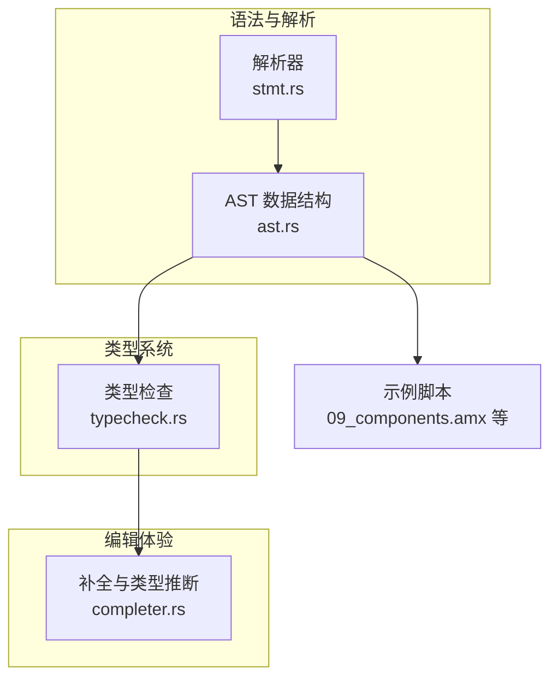
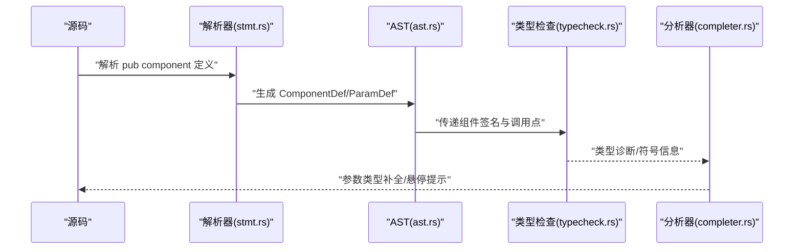
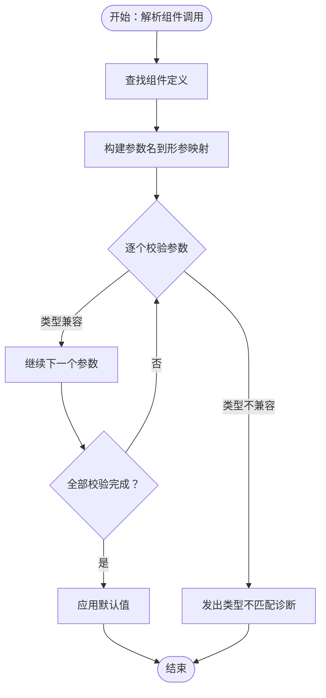
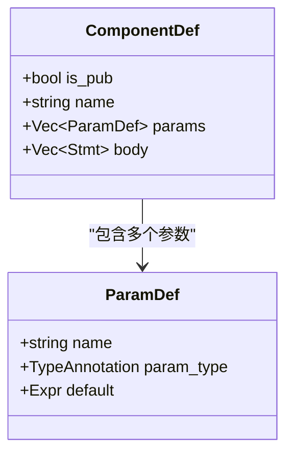
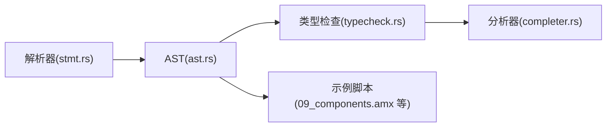

# 组件定义与参数

<cite>
**本文引用的文件**
- [crates/animatix-syntax/src/ast.rs](file://crates/animatix-syntax/src/ast.rs)
- [crates/animatix-syntax/src/parser/stmt.rs](file://crates/animatix-syntax/src/parser/stmt.rs)
- [crates/animatix-syntax/src/typecheck.rs](file://crates/animatix-syntax/src/typecheck.rs)
- [crates/animatix-analyzer/src/completer.rs](file://crates/animatix-analyzer/src/completer.rs)
- [examples/09_components.amx](file://examples/09_components.amx)
- [examples/lib/components.amx](file://examples/lib/components.amx)
- [examples/lib/card.amx](file://examples/lib/card.amx)
</cite>

## 目录
1. [简介](#简介)
2. [项目结构](#项目结构)
3. [核心组件](#核心组件)
4. [架构总览](#架构总览)
5. [详细组件分析](#详细组件分析)
6. [依赖关系分析](#依赖关系分析)
7. [性能考量](#性能考量)
8. [故障排查指南](#故障排查指南)
9. [结论](#结论)
10. [附录](#附录)

## 简介
本文件系统性阐述 Animatix 的“组件定义与参数”机制，围绕以下目标展开：
- 如何使用 pub component 关键字定义可复用的动画组件
- 组件参数的类型系统与默认值设置
- 组件内部状态管理（属性绑定、局部变量、作用域规则）
- 完整的组件定义语法说明（必需参数、可选参数、默认值）
- 实际组件开发示例（从简单文本组件到复杂复合组件），总结最佳实践

本说明以解析器、类型检查器与分析器的实现为依据，并结合官方示例进行落地说明。

## 项目结构
与组件定义与参数相关的核心实现分布在以下模块：
- 语法与 AST：定义组件与参数的数据结构
- 解析器：负责将源码解析为 AST，并限制组件体内的语句类型
- 类型检查：验证参数类型与调用时传入的实际类型匹配，支持严格模式下的类型注解要求
- 分析器：基于符号表提供补全与类型推断辅助（如按参数名查找期望类型）

图表来源
- [crates/animatix-syntax/src/parser/stmt.rs:468-500](file://crates/animatix-syntax/src/parser/stmt.rs#L468-L500)
- [crates/animatix-syntax/src/ast.rs:391-420](file://crates/animatix-syntax/src/ast.rs#L391-L420)
- [crates/animatix-syntax/src/typecheck.rs:279-302](file://crates/animatix-syntax/src/typecheck.rs#L279-L302)
- [crates/animatix-analyzer/src/completer.rs:510-524](file://crates/animatix-analyzer/src/completer.rs#L510-L524)

章节来源
- [crates/animatix-syntax/src/parser/stmt.rs:468-500](file://crates/animatix-syntax/src/parser/stmt.rs#L468-L500)
- [crates/animatix-syntax/src/ast.rs:391-420](file://crates/animatix-syntax/src/ast.rs#L391-L420)
- [crates/animatix-syntax/src/typecheck.rs:279-302](file://crates/animatix-syntax/src/typecheck.rs#L279-L302)
- [crates/animatix-analyzer/src/completer.rs:510-524](file://crates/animatix-analyzer/src/completer.rs#L510-L524)

## 核心组件
本节聚焦组件与参数在语法树中的表示方式，以及解析器对组件体的约束。

- 组件定义（ComponentDef）包含：
  - 是否导出（pub）
  - 名称
  - 参数列表（ParamDef）
  - 组件体（body：由语句序列组成）

- 参数定义（ParamDef）包含：
  - 名称
  - 可选类型注解（TypeAnnotation）
  - 可选默认值表达式（Expr）

- 解析器对组件体的限制：
  - 组件体不允许出现 import 语句
  - 组件体是演员模板，而非模块级容器

章节来源
- [crates/animatix-syntax/src/ast.rs:391-420](file://crates/animatix-syntax/src/ast.rs#L391-L420)
- [crates/animatix-syntax/src/parser/stmt.rs:488-500](file://crates/animatix-syntax/src/parser/stmt.rs#L488-L500)

## 架构总览
下图展示了从源码到类型检查再到补全的端到端流程，体现组件定义与参数系统在编译期的关键环节。

图表来源
- [crates/animatix-syntax/src/parser/stmt.rs:468-500](file://crates/animatix-syntax/src/parser/stmt.rs#L468-L500)
- [crates/animatix-syntax/src/ast.rs:391-420](file://crates/animatix-syntax/src/ast.rs#L391-L420)
- [crates/animatix-syntax/src/typecheck.rs:279-302](file://crates/animatix-syntax/src/typecheck.rs#L279-L302)
- [crates/animatix-analyzer/src/completer.rs:510-524](file://crates/animatix-analyzer/src/completer.rs#L510-L524)

## 详细组件分析

### 组件定义语法与作用域
- 语法要点
  - 使用关键字定义组件，支持 pub 声明导出
  - 参数列表采用括号包裹，逗号分隔
  - 组件体采用花括号包裹，且禁止导入语句
- 作用域规则
  - 组件体内的声明仅在该组件模板内可见
  - 组件参数通过名称绑定到组件体内，形成“输入参数”的作用域
  - 局部变量与属性绑定遵循与演员模板一致的作用域语义（组件体即演员模板）

章节来源
- [crates/animatix-syntax/src/parser/stmt.rs:468-500](file://crates/animatix-syntax/src/parser/stmt.rs#L468-L500)
- [crates/animatix-syntax/src/ast.rs:402-413](file://crates/animatix-syntax/src/ast.rs#L402-L413)

### 参数类型系统与默认值
- 类型系统
  - 每个参数可带可选类型注解；若启用严格模式，未标注类型会在缺少显式注解时产生诊断
  - 调用时会进行子类型检查，确保实参与形参类型兼容
- 默认值
  - 参数可携带默认值表达式；当调用方未提供对应参数时，使用默认值
  - 默认值表达式的类型需与参数类型兼容

章节来源
- [crates/animatix-syntax/src/typecheck.rs:279-302](file://crates/animatix-syntax/src/typecheck.rs#L279-L302)
- [crates/animatix-syntax/src/typecheck.rs:513-555](file://crates/animatix-syntax/src/typecheck.rs#L513-L555)
- [crates/animatix-syntax/src/ast.rs:391-400](file://crates/animatix-syntax/src/ast.rs#L391-L400)

### 编辑器辅助与类型推断
- 补全与类型推断
  - 分析器根据当前属性名与组件类型，从符号表中查询组件参数的期望类型
  - 为属性值提供合适的补全项（如布尔、空值等通用值）

章节来源
- [crates/animatix-analyzer/src/completer.rs:482-507](file://crates/animatix-analyzer/src/completer.rs#L482-L507)
- [crates/animatix-analyzer/src/completer.rs:510-524](file://crates/animatix-analyzer/src/completer.rs#L510-L524)

### 组件调用与类型检查流程

图表来源
- [crates/animatix-syntax/src/typecheck.rs:279-302](file://crates/animatix-syntax/src/typecheck.rs#L279-L302)

### 组件定义类图

图表来源
- [crates/animatix-syntax/src/ast.rs:391-420](file://crates/animatix-syntax/src/ast.rs#L391-L420)

## 依赖关系分析
- 组件定义依赖于解析器将其转换为 AST
- 类型检查依赖于 AST 中的类型注解与默认值信息
- 分析器依赖符号表与类型检查结果，提供补全与诊断
- 示例脚本依赖组件定义与调用语法进行演示

图表来源
- [crates/animatix-syntax/src/parser/stmt.rs:468-500](file://crates/animatix-syntax/src/parser/stmt.rs#L468-L500)
- [crates/animatix-syntax/src/ast.rs:391-420](file://crates/animatix-syntax/src/ast.rs#L391-L420)
- [crates/animatix-syntax/src/typecheck.rs:279-302](file://crates/animatix-syntax/src/typecheck.rs#L279-L302)
- [crates/animatix-analyzer/src/completer.rs:510-524](file://crates/animatix-analyzer/src/completer.rs#L510-L524)

章节来源
- [crates/animatix-syntax/src/parser/stmt.rs:468-500](file://crates/animatix-syntax/src/parser/stmt.rs#L468-L500)
- [crates/animatix-syntax/src/ast.rs:391-420](file://crates/animatix-syntax/src/ast.rs#L391-L420)
- [crates/animatix-syntax/src/typecheck.rs:279-302](file://crates/animatix-syntax/src/typecheck.rs#L279-L302)
- [crates/animatix-analyzer/src/completer.rs:510-524](file://crates/animatix-analyzer/src/completer.rs#L510-L524)

## 性能考量
- 类型检查在组件调用处进行，避免在运行时进行昂贵的类型推断
- 默认值表达式在解析阶段被记录，调用时直接应用，减少运行时分支判断
- 解析器在组件体内拒绝 import 语句，降低组件模板的复杂度与潜在的静态分析开销

## 故障排查指南
- 严格类型模式下缺失类型注解
  - 现象：启用严格类型后，未标注类型的参数会触发诊断
  - 处理：为参数添加明确的类型注解
  - 参考
    - [crates/animatix-syntax/src/typecheck.rs:513-555](file://crates/animatix-syntax/src/typecheck.rs#L513-L555)
- 参数类型不匹配
  - 现象：调用时实参与形参类型不兼容，发出类型不匹配诊断
  - 处理：修正实参类型或调整形参类型注解
  - 参考
    - [crates/animatix-syntax/src/typecheck.rs:279-302](file://crates/animatix-syntax/src/typecheck.rs#L279-L302)
- 组件体内使用 import
  - 现象：组件体内出现 import 会被解析器拒绝
  - 处理：将 import 移至模块顶层
  - 参考
    - [crates/animatix-syntax/src/parser/stmt.rs:488-500](file://crates/animatix-syntax/src/parser/stmt.rs#L488-L500)

章节来源
- [crates/animatix-syntax/src/typecheck.rs:279-302](file://crates/animatix-syntax/src/typecheck.rs#L279-L302)
- [crates/animatix-syntax/src/typecheck.rs:513-555](file://crates/animatix-syntax/src/typecheck.rs#L513-L555)
- [crates/animatix-syntax/src/parser/stmt.rs:488-500](file://crates/animatix-syntax/src/parser/stmt.rs#L488-L500)

## 结论
Animatix 的组件系统以清晰的语法与严格的类型检查为核心，辅以解析器对组件体的约束与分析器的补全能力，为开发者提供了可靠的组件化动画开发体验。通过参数类型注解与默认值，组件既具备强类型安全，又保持灵活的可复用性。建议在团队协作中开启严格类型模式，并在组件定义中明确参数类型与默认值，以获得更好的开发体验与可维护性。

## 附录

### 组件定义语法速查
- 定义组件
  - 语法：pub component 名称(参数列表) { 语句序列 }
  - 说明：参数列表为空时仍需保留括号；组件体内禁止 import
  - 参考
    - [crates/animatix-syntax/src/parser/stmt.rs:468-500](file://crates/animatix-syntax/src/parser/stmt.rs#L468-L500)
- 参数
  - 形态：名称: 类型 = 默认值
  - 必需参数：无默认值
  - 可选参数：有默认值
  - 参考
    - [crates/animatix-syntax/src/ast.rs:391-400](file://crates/animatix-syntax/src/ast.rs#L391-L400)
- 调用
  - 形态：名称(参数=值, ...)
  - 规则：按名称传参；未提供的可选参数使用默认值
  - 参考
    - [crates/animatix-syntax/src/typecheck.rs:279-302](file://crates/animatix-syntax/src/typecheck.rs#L279-L302)

### 实际示例参考
- 组件示例集合
  - 文件：examples/09_components.amx
  - 内容：涵盖基础组件、参数与调用的基础示例
  - 参考
    - [examples/09_components.amx](file://examples/09_components.amx)
- 库组件示例
  - 文件：examples/lib/components.amx
  - 内容：常用组件的定义与参数示例
  - 参考
    - [examples/lib/components.amx](file://examples/lib/components.amx)
- 卡片组件示例
  - 文件：examples/lib/card.amx
  - 内容：复合组件示例（标题、内容、样式等参数）
  - 参考
    - [examples/lib/card.amx](file://examples/lib/card.amx)