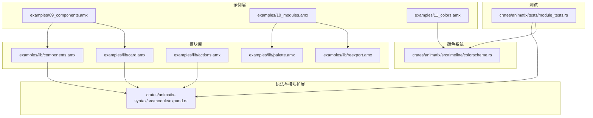
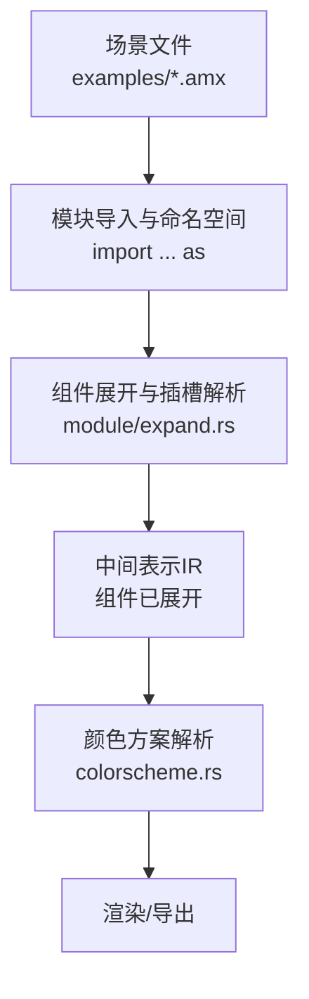
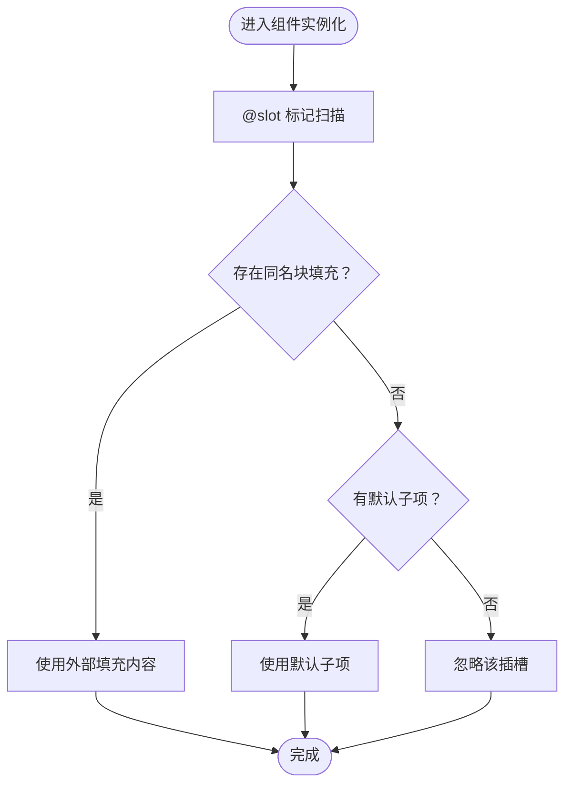
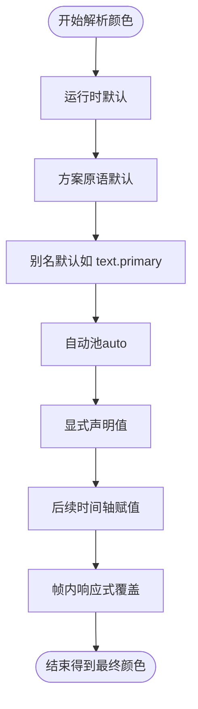
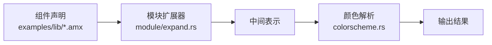

# 组件系统

<cite>
**本文引用的文件**
- [examples/09_components.amx](file://examples/09_components.amx)
- [examples/10_modules.amx](file://examples/10_modules.amx)
- [examples/11_colors.amx](file://examples/11_colors.amx)
- [examples/lib/components.amx](file://examples/lib/components.amx)
- [examples/lib/card.amx](file://examples/lib/card.amx)
- [examples/lib/actions.amx](file://examples/lib/actions.amx)
- [examples/lib/palette.amx](file://examples/lib/palette.amx)
- [examples/lib/reexport.amx](file://examples/lib/reexport.amx)
- [crates/animatix/src/timeline/colorscheme.rs](file://crates/animatix/src/timeline/colorscheme.rs)
- [crates/animatix-syntax/src/module/expand.rs](file://crates/animatix-syntax/src/module/expand.rs)
- [crates/animatix/tests/module_tests.rs](file://crates/animatix/tests/module_tests.rs)
</cite>

## 目录
1. 引言
2. 项目结构
3. 核心组件
4. 架构总览
5. 详细组件分析
6. 依赖关系分析
7. 性能考量
8. 故障排查指南
9. 结论
10. 附录

## 引言
本指南围绕 Animatix 的“组件系统”展开，目标是帮助你从零开始掌握模块化开发：如何定义组件、传递参数、使用插槽（@slot）机制；如何组织模块导入与导出、管理命名空间与重导出链；如何利用设计令牌（design tokens）构建可复用的主题与样式方案；以及如何在实践中完成从设计到实现再到使用的全流程。文中所有结论均来自仓库中的示例与测试代码，确保可验证性与一致性。

## 项目结构
Animatix 的组件系统由“示例场景 + 模块库 + 语法与类型系统 + 运行时解析器”共同构成。核心路径如下：
- 示例层：examples 下的 amx 场景文件演示组件、模块与颜色系统用法
- 模块库：examples/lib 提供可复用组件与主题模块（如卡片、按钮、动作行为、调色板）
- 语法与模块扩展：crates/animatix-syntax/src/module/expand.rs 实现组件展开与插槽解析
- 颜色系统：crates/animatix/src/timeline/colorscheme.rs 定义颜色方案解析与优先级
- 测试与验证：crates/animatix/tests/module_tests.rs 提供组件与模块行为的断言

图表来源
- [examples/09_components.amx](file://examples/09_components.amx)
- [examples/10_modules.amx](file://examples/10_modules.amx)
- [examples/11_colors.amx](file://examples/11_colors.amx)
- [examples/lib/components.amx](file://examples/lib/components.amx)
- [examples/lib/card.amx](file://examples/lib/card.amx)
- [examples/lib/actions.amx](file://examples/lib/actions.amx)
- [examples/lib/palette.amx](file://examples/lib/palette.amx)
- [examples/lib/reexport.amx](file://examples/lib/reexport.amx)
- [crates/animatix-syntax/src/module/expand.rs](file://crates/animatix-syntax/src/module/expand.rs)
- [crates/animatix/src/timeline/colorscheme.rs](file://crates/animatix/src/timeline/colorscheme.rs)
- [crates/animatix/tests/module_tests.rs](file://crates/animatix/tests/module_tests.rs)

章节来源
- [examples/09_components.amx:1-40](file://examples/09_components.amx#L1-L40)
- [examples/10_modules.amx:1-33](file://examples/10_modules.amx#L1-L33)
- [examples/11_colors.amx:1-20](file://examples/11_colors.amx#L1-L20)
- [examples/lib/components.amx:1-70](file://examples/lib/components.amx#L1-L70)
- [examples/lib/card.amx:1-20](file://examples/lib/card.amx#L1-L20)
- [examples/lib/actions.amx:1-60](file://examples/lib/actions.amx#L1-L60)
- [examples/lib/palette.amx:1-8](file://examples/lib/palette.amx#L1-L8)
- [examples/lib/reexport.amx:1-5](file://examples/lib/reexport.amx#L1-L5)
- [crates/animatix-syntax/src/module/expand.rs:438-478](file://crates/animatix-syntax/src/module/expand.rs#L438-L478)
- [crates/animatix/src/timeline/colorscheme.rs:1-62](file://crates/animatix/src/timeline/colorscheme.rs#L1-L62)
- [crates/animatix/tests/module_tests.rs:770-841](file://crates/animatix/tests/module_tests.rs#L770-L841)

## 核心组件
- 组件定义与参数传递
  - 在示例中，组件通过“带参数的 pub component”声明，支持默认值与类型标注，参数可在组件内部作为属性使用。
  - 示例参考：[examples/09_components.amx:5-15](file://examples/09_components.amx#L5-L15)、[examples/lib/components.amx:8-25](file://examples/lib/components.amx#L8-L25)、[examples/lib/card.amx:2-6](file://examples/lib/card.amx#L2-L6)
- 插槽机制（@slot）
  - 组件容器内使用 @slot 标记占位，外部实例化时以同名块填充；未填充时回退到默认子项；不存在匹配块则忽略。
  - 示例参考：[examples/09_components.amx:8-12](file://examples/09_components.amx#L8-L12)、[examples/lib/components.amx:33-37](file://examples/lib/components.amx#L33-L37)、[examples/lib/slide.amx:2-15](file://examples/lib/slide.amx#L2-L15)
- 动作行为（Actions）
  - 行为需在 pub component 内部定义，用于封装交互或状态切换逻辑，便于复用。
  - 示例参考：[examples/lib/actions.amx:2-6](file://examples/lib/actions.amx#L2-L6)、[examples/lib/actions.amx:24-30](file://examples/lib/actions.amx#L24-L30)、[examples/lib/actions.amx:41-47](file://examples/lib/actions.amx#L41-L47)
- 命名空间与重导出
  - 使用 import ... as 为模块设置别名；通过 pub let 导出符号；支持多级重导出链路，形成设计令牌风格的统一入口。
  - 示例参考：[examples/10_modules.amx:4-6](file://examples/10_modules.amx#L4-L6)、[examples/lib/reexport.amx:2-5](file://examples/lib/reexport.amx#L2-L5)、[examples/lib/palette.amx:1-8](file://examples/lib/palette.amx#L1-L8)
- 设计令牌（Design Tokens）
  - 将尺寸、字体、圆角等视觉变量集中管理，通过命名空间访问，提升主题一致性与可维护性。
  - 示例参考：[examples/10_modules.amx:28](file://examples/10_modules.amx#L28)、[examples/lib/tokens.amx:1-50](file://examples/lib/tokens.amx#L1-L50)
- 颜色系统
  - 支持内置颜色方案、自动分配池、别名映射与显式赋值；解析顺序保证预览与导出的一致性。
  - 示例参考：[examples/11_colors.amx:5-12](file://examples/11_colors.amx#L5-L12)、[crates/animatix/src/timeline/colorscheme.rs:1-62](file://crates/animatix/src/timeline/colorscheme.rs#L1-L62)

章节来源
- [examples/09_components.amx:1-40](file://examples/09_components.amx#L1-L40)
- [examples/lib/components.amx:1-70](file://examples/lib/components.amx#L1-L70)
- [examples/lib/card.amx:1-20](file://examples/lib/card.amx#L1-L20)
- [examples/lib/actions.amx:1-60](file://examples/lib/actions.amx#L1-L60)
- [examples/10_modules.amx:1-33](file://examples/10_modules.amx#L1-L33)
- [examples/lib/reexport.amx:1-5](file://examples/lib/reexport.amx#L1-L5)
- [examples/lib/palette.amx:1-8](file://examples/lib/palette.amx#L1-L8)
- [examples/11_colors.amx:1-20](file://examples/11_colors.amx#L1-L20)
- [crates/animatix/src/timeline/colorscheme.rs:1-62](file://crates/animatix/src/timeline/colorscheme.rs#L1-L62)

## 架构总览
组件系统的关键流程包括：模块加载与命名空间解析、组件声明与参数绑定、插槽填充与默认回退、颜色方案解析与优先级应用。下图展示了从场景到运行时的端到端关系。

图表来源
- [examples/10_modules.amx:4-6](file://examples/10_modules.amx#L4-L6)
- [crates/animatix-syntax/src/module/expand.rs:438-478](file://crates/animatix-syntax/src/module/expand.rs#L438-L478)
- [crates/animatix/src/timeline/colorscheme.rs:1-62](file://crates/animatix/src/timeline/colorscheme.rs#L1-L62)

## 详细组件分析

### 组件定义与参数传递
- 参数声明与默认值
  - 组件支持带默认值的参数列表，参数在组件体内作为属性使用，便于复用与定制。
  - 参考路径：[examples/09_components.amx:5-15](file://examples/09_components.amx#L5-L15)、[examples/lib/components.amx:8-25](file://examples/lib/components.amx#L8-L25)
- 参数在组件体内的作用域
  - 组件内部可直接引用传入的参数，用于驱动文本、尺寸、颜色等属性。
  - 参考路径：[examples/09_components.amx:9-12](file://examples/09_components.amx#L9-L12)、[examples/lib/card.amx:2-6](file://examples/lib/card.amx#L2-L6)

章节来源
- [examples/09_components.amx:5-15](file://examples/09_components.amx#L5-L15)
- [examples/lib/components.amx:8-25](file://examples/lib/components.amx#L8-L25)
- [examples/lib/card.amx:2-6](file://examples/lib/card.amx#L2-L6)

### 插槽机制（@slot）
- 插槽标记与默认回退
  - 组件容器内使用 @slot 标记占位；外部实例化时以同名块填充；若未填充，则使用默认子项；不存在匹配块则忽略。
  - 参考路径：[examples/09_components.amx:8-12](file://examples/09_components.amx#L8-L12)、[examples/lib/components.amx:33-37](file://examples/lib/components.amx#L33-L37)
- 多插槽与无匹配处理
  - 测试覆盖了“全部填充不使用默认”“部分填充混合默认”“不存在的插槽块被忽略”的情形。
  - 参考路径：[crates/animatix/tests/module_tests.rs:770-841](file://crates/animatix/tests/module_tests.rs#L770-L841)

图表来源
- [crates/animatix-syntax/src/module/expand.rs:438-478](file://crates/animatix-syntax/src/module/expand.rs#L438-L478)

章节来源
- [examples/09_components.amx:8-12](file://examples/09_components.amx#L8-L12)
- [examples/lib/components.amx:33-37](file://examples/lib/components.amx#L33-L37)
- [crates/animatix/tests/module_tests.rs:770-841](file://crates/animatix/tests/module_tests.rs#L770-L841)
- [crates/animatix-syntax/src/module/expand.rs:438-478](file://crates/animatix-syntax/src/module/expand.rs#L438-L478)

### 动作行为（Actions）
- 行为封装与复用
  - 将交互逻辑封装在 pub component 内部，便于在多个组件间复用，例如按压、切换、淡入淡出等。
  - 参考路径：[examples/lib/actions.amx:2-6](file://examples/lib/actions.amx#L2-L6)、[examples/lib/actions.amx:24-30](file://examples/lib/actions.amx#L24-L30)、[examples/lib/actions.amx:41-47](file://examples/lib/actions.amx#L41-L47)

章节来源
- [examples/lib/actions.amx:1-60](file://examples/lib/actions.amx#L1-L60)

### 模块导入与命名空间管理
- import ... as 与 pub let 导出
  - 使用 as 为模块设置别名；通过 pub let 将符号暴露给导入方，形成清晰的命名空间。
  - 参考路径：[examples/10_modules.amx:4-6](file://examples/10_modules.amx#L4-L6)、[examples/lib/reexport.amx:3-5](file://examples/lib/reexport.amx#L3-L5)
- 重导出链与设计令牌
  - 通过多级重导出形成统一入口，结合设计令牌（如 tokens.space_md）提升主题一致性。
  - 参考路径：[examples/10_modules.amx:28](file://examples/10_modules.amx#L28)、[examples/lib/reexport.amx:2-5](file://examples/lib/reexport.amx#L2-L5)

章节来源
- [examples/10_modules.amx:1-33](file://examples/10_modules.amx#L1-L33)
- [examples/lib/reexport.amx:1-5](file://examples/lib/reexport.amx#L1-L5)

### 颜色系统与主题方案
- 颜色方案解析与优先级
  - 解析顺序（低到高）：运行时默认 → 方案原语默认 → 别名默认 → 自动池 → 显式值 → 后续时间轴赋值 → 帧内响应式覆盖。
  - 参考路径：[crates/animatix/src/timeline/colorscheme.rs:1-12](file://crates/animatix/src/timeline/colorscheme.rs#L1-L12)
- 内置方案与自动色环
  - 提供多种内置方案（如 editorial-dark），并生成自动色环，确保连续使用时的色彩平衡。
  - 参考路径：[crates/animatix/src/timeline/colorscheme.rs:20-62](file://crates/animatix/src/timeline/colorscheme.rs#L20-L62)
- 场景中的颜色使用
  - 示例中通过 text.primary、accent.* 等别名访问颜色，体现方案与令牌的协同。
  - 参考路径：[examples/11_colors.amx:5-12](file://examples/11_colors.amx#L5-L12)

图表来源
- [crates/animatix/src/timeline/colorscheme.rs:1-12](file://crates/animatix/src/timeline/colorscheme.rs#L1-L12)

章节来源
- [examples/11_colors.amx:1-20](file://examples/11_colors.amx#L1-L20)
- [crates/animatix/src/timeline/colorscheme.rs:1-62](file://crates/animatix/src/timeline/colorscheme.rs#L1-L62)

### 组件库开发示例与最佳实践
- 卡片组件（Card）
  - 具备标题、数值、强调色等参数，适合仪表盘与信息展示。
  - 参考路径：[examples/lib/card.amx:2-6](file://examples/lib/card.amx#L2-L6)
- 按钮与标签（Button、Tag）
  - 参数化外观与强调色，便于统一风格。
  - 参考路径：[examples/lib/components.amx:8-12](file://examples/lib/components.amx#L8-L12)、[examples/lib/components.amx:46-50](file://examples/lib/components.amx#L46-L50)
- 幻灯片（Slide）
  - 使用 @slot 定义标题与内容区域，支持灵活填充。
  - 参考路径：[examples/lib/slide.amx:2-15](file://examples/lib/slide.amx#L2-L15)

章节来源
- [examples/lib/card.amx:1-20](file://examples/lib/card.amx#L1-L20)
- [examples/lib/components.amx:1-70](file://examples/lib/components.amx#L1-L70)
- [examples/lib/slide.amx:1-20](file://examples/lib/slide.amx#L1-L20)

## 依赖关系分析
- 组件与模块扩展
  - 组件声明经由模块扩展器展开，插槽解析在语法层完成，随后进入运行时解析阶段。
  - 参考路径：[crates/animatix-syntax/src/module/expand.rs:438-478](file://crates/animatix-syntax/src/module/expand.rs#L438-L478)
- 颜色解析与模块测试
  - 颜色解析规则在运行时生效；测试用例验证命名空间导出与组件展开行为。
  - 参考路径：[crates/animatix/tests/module_tests.rs:118-172](file://crates/animatix/tests/module_tests.rs#L118-L172)

图表来源
- [crates/animatix-syntax/src/module/expand.rs:438-478](file://crates/animatix-syntax/src/module/expand.rs#L438-L478)
- [crates/animatix/src/timeline/colorscheme.rs:1-62](file://crates/animatix/src/timeline/colorscheme.rs#L1-L62)

章节来源
- [crates/animatix-syntax/src/module/expand.rs:438-478](file://crates/animatix-syntax/src/module/expand.rs#L438-L478)
- [crates/animatix/tests/module_tests.rs:118-172](file://crates/animatix/tests/module_tests.rs#L118-L172)

## 性能考量
- 组件展开与颜色解析的确定性
  - 颜色解析在构建期完成，避免逐帧重复计算，确保预览与导出一致且高效。
  - 参考路径：[crates/animatix/src/timeline/colorscheme.rs:12](file://crates/animatix/src/timeline/colorscheme.rs#L12)
- 插槽解析与默认回退
  - 插槽填充与默认回退在构建期完成，减少运行时分支判断。
  - 参考路径：[crates/animatix-syntax/src/module/expand.rs:438-478](file://crates/animatix-syntax/src/module/expand.rs#L438-L478)

## 故障排查指南
- 插槽未填充导致显示异常
  - 若外部未提供某插槽块，组件会回退到默认子项；若既无填充也无默认，该插槽将被忽略。
  - 参考路径：[crates/animatix/tests/module_tests.rs:770-841](file://crates/animatix/tests/module_tests.rs#L770-L841)
- 命名空间访问失败
  - 确认模块是否正确 import ... as 设置别名，且被导出的符号是否为 pub let。
  - 参考路径：[examples/10_modules.amx:4-6](file://examples/10_modules.amx#L4-L6)、[examples/lib/reexport.amx:3-5](file://examples/lib/reexport.amx#L3-L5)
- 颜色未按预期显示
  - 检查颜色解析优先级：显式值应高于方案默认；若使用 auto，确认自动池是否可用。
  - 参考路径：[crates/animatix/src/timeline/colorscheme.rs:1-12](file://crates/animatix/src/timeline/colorscheme.rs#L1-L12)

章节来源
- [crates/animatix/tests/module_tests.rs:770-841](file://crates/animatix/tests/module_tests.rs#L770-L841)
- [examples/10_modules.amx:4-6](file://examples/10_modules.amx#L4-L6)
- [examples/lib/reexport.amx:3-5](file://examples/lib/reexport.amx#L3-L5)
- [crates/animatix/src/timeline/colorscheme.rs:1-12](file://crates/animatix/src/timeline/colorscheme.rs#L1-L12)

## 结论
Animatix 的组件系统以“模块化 + 命名空间 + 插槽 + 设计令牌 + 颜色方案”为核心，实现了从设计到实现再到使用的闭环。通过参数化组件、@slot 插槽与重导出链，开发者可以快速搭建可复用的组件库；借助设计令牌与颜色方案解析，主题与样式得以统一管理与高效渲染。配合测试用例与示例场景，你可以建立一套稳定、可维护且高性能的组件开发工作流。

## 附录
- 快速上手清单
  - 定义组件：使用 pub component 声明，提供合理默认值
  - 使用插槽：在组件容器中标注 @slot，外部实例化时按名称填充
  - 组织模块：使用 import ... as 管理命名空间，pub let 导出必要符号
  - 主题与样式：集中管理设计令牌，基于颜色方案解析实现一致风格
  - 验证行为：编写测试用例覆盖插槽填充、命名空间导出与组件展开