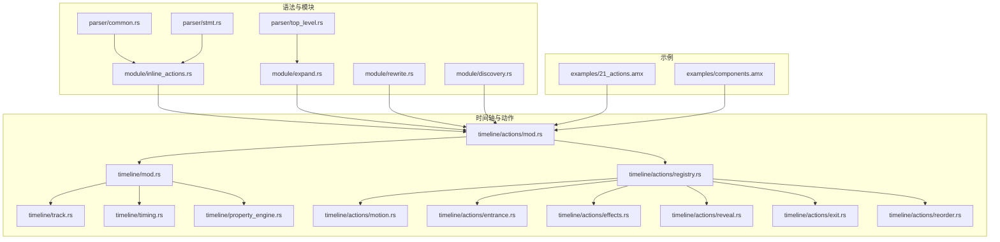
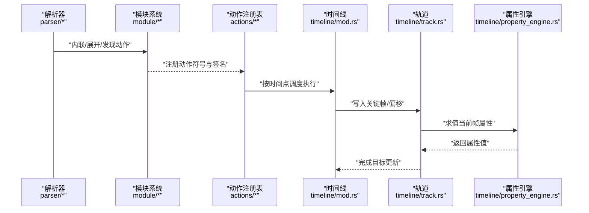
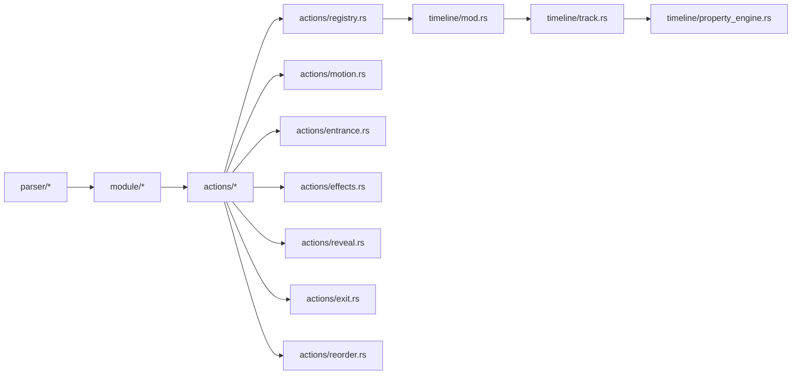

# 自定义动作

<cite>
**本文引用的文件**
- [crates/animatix/src/timeline/actions/mod.rs](file://crates/animatix/src/timeline/actions/mod.rs)
- [crates/animatix/src/timeline/actions/registry.rs](file://crates/animatix/src/timeline/actions/registry.rs)
- [crates/animatix/src/timeline/actions/motion.rs](file://crates/animatix/src/timeline/actions/motion.rs)
- [crates/animatix/src/timeline/actions/entrance.rs](file://crates/animatix/src/timeline/actions/entrance.rs)
- [crates/animatix/src/timeline/actions/effects.rs](file://crates/animatix/src/timeline/actions/effects.rs)
- [crates/animatix/src/timeline/actions/reveal.rs](file://crates/animatix/src/timeline/actions/reveal.rs)
- [crates/animatix/src/timeline/actions/exit.rs](file://crates/animatix/src/timeline/actions/exit.rs)
- [crates/animatix/src/timeline/actions/reorder.rs](file://crates/animatix/src/timeline/actions/reorder.rs)
- [crates/animatix/src/timeline/mod.rs](file://crates/animatix/src/timeline/mod.rs)
- [crates/animatix/src/timeline/track.rs](file://crates/animatix/src/timeline/track.rs)
- [crates/animatix/src/timeline/timing.rs](file://crates/animatix/src/timeline/timing.rs)
- [crates/animatix/src/timeline/property_engine.rs](file://crates/animatix/src/timeline/property_engine.rs)
- [crates/animatix/src/timeline/scene_eval.rs](file://crates/animatix/src/timeline/scene_eval.rs)
- [crates/animatix/src/timeline/build/mod.rs](file://crates/animatix/src/timeline/build/mod.rs)
- [examples/21_actions.amx](file://examples/21_actions.amx)
- [examples/components.amx](file://examples/components.amx)
- [crates/animatix-syntax/src/parser/common.rs](file://crates/animatix-syntax/src/parser/common.rs)
- [crates/animatix-syntax/src/parser/stmt.rs](file://crates/animatix-syntax/src/parser/stmt.rs)
- [crates/animatix-syntax/src/parser/top_level.rs](file://crates/animatix-syntax/src/parser/top_level.rs)
- [crates/animatix-syntax/src/module/inline_actions.rs](file://crates/animatix-syntax/src/module/inline_actions.rs)
- [crates/animatix-syntax/src/module/rewrite.rs](file://crates/animatix-syntax/src/module/rewrite.rs)
- [crates/animatix-syntax/src/module/expand.rs](file://crates/animatix-syntax/src/module/expand.rs)
- [crates/animatix-syntax/src/module/discovery.rs](file://crates/animatix-syntax/src/module/discovery.rs)
- [crates/animatix-syntax/src/easing.rs](file://crates/animatix-syntax/src/easing.rs)
- [crates/animatix-syntax/src/format_core.rs](file://crates/animatix-syntax/src/format_core.rs)
- [crates/animatix-syntax/src/to_source.rs](file://crates/animatix-syntax/src/to_source.rs)
- [crates/animatix-syntax/src/typecheck.rs](file://crates/animatix-syntax/src/typecheck.rs)
- [crates/animatix-syntax/src/walk.rs](file://crates/animatix-syntax/src/walk.rs)
</cite>

## 目录
1. [引言](#引言)
2. [项目结构](#项目结构)
3. [核心组件](#核心组件)
4. [架构总览](#架构总览)
5. [详细组件分析](#详细组件分析)
6. [依赖关系分析](#依赖关系分析)
7. [性能考量](#性能考量)
8. [故障排查指南](#故障排查指南)
9. [结论](#结论)
10. [附录](#附录)

## 引言
本指南聚焦于 Animatix 的“自定义动作”体系：如何在组件内部定义 action 块、命名与参数传递、执行时机与调度、与组件状态的交互、组合与条件触发、循环执行等。我们将结合源码中的内置动作实现与语法扩展，给出从简单过渡动画到复杂交互反馈的完整开发思路与最佳实践。

## 项目结构
动作系统位于时间轴子系统中，围绕“动作注册表（Registry）+ 动作执行器（Executor）+ 时间线调度（Timeline）+ 属性引擎（Property Engine）”组织。语法层负责解析与内联动作，构建期负责降级与优化，运行时负责按时间点求值与应用到目标属性。

图示来源
- [crates/animatix/src/timeline/actions/mod.rs](file://crates/animatix/src/timeline/actions/mod.rs)
- [crates/animatix/src/timeline/actions/registry.rs](file://crates/animatix/src/timeline/actions/registry.rs)
- [crates/animatix/src/timeline/mod.rs](file://crates/animatix/src/timeline/mod.rs)
- [crates/animatix/src/timeline/track.rs](file://crates/animatix/src/timeline/track.rs)
- [crates/animatix/src/timeline/timing.rs](file://crates/animatix/src/timeline/timing.rs)
- [crates/animatix/src/timeline/property_engine.rs](file://crates/animatix/src/timeline/property_engine.rs)
- [crates/animatix-syntax/src/parser/common.rs](file://crates/animatix-syntax/src/parser/common.rs)
- [crates/animatix-syntax/src/parser/stmt.rs](file://crates/animatix-syntax/src/parser/stmt.rs)
- [crates/animatix-syntax/src/parser/top_level.rs](file://crates/animatix-syntax/src/parser/top_level.rs)
- [crates/animatix-syntax/src/module/inline_actions.rs](file://crates/animatix-syntax/src/module/inline_actions.rs)
- [crates/animatix-syntax/src/module/expand.rs](file://crates/animatix-syntax/src/module/expand.rs)
- [crates/animatix-syntax/src/module/rewrite.rs](file://crates/animatix-syntax/src/module/rewrite.rs)
- [crates/animatix-syntax/src/module/discovery.rs](file://crates/animatix-syntax/src/module/discovery.rs)
- [examples/21_actions.amx](file://examples/21_actions.amx)
- [examples/components.amx](file://examples/components.amx)

章节来源
- [crates/animatix/src/timeline/actions/mod.rs](file://crates/animatix/src/timeline/actions/mod.rs)
- [crates/animatix/src/timeline/actions/registry.rs](file://crates/animatix/src/timeline/actions/registry.rs)
- [crates/animatix/src/timeline/mod.rs](file://crates/animatix/src/timeline/mod.rs)
- [crates/animatix/src/timeline/track.rs](file://crates/animatix/src/timeline/track.rs)
- [crates/animatix/src/timeline/timing.rs](file://crates/animatix/src/timeline/timing.rs)
- [crates/animatix/src/timeline/property_engine.rs](file://crates/animatix/src/timeline/property_engine.rs)
- [crates/animatix-syntax/src/parser/common.rs](file://crates/animatix-syntax/src/parser/common.rs)
- [crates/animatix-syntax/src/parser/stmt.rs](file://crates/animatix-syntax/src/parser/stmt.rs)
- [crates/animatix-syntax/src/parser/top_level.rs](file://crates/animatix-syntax/src/parser/top_level.rs)
- [crates/animatix-syntax/src/module/inline_actions.rs](file://crates/animatix-syntax/src/module/inline_actions.rs)
- [crates/animatix-syntax/src/module/expand.rs](file://crates/animatix-syntax/src/module/expand.rs)
- [crates/animatix-syntax/src/module/rewrite.rs](file://crates/animatix-syntax/src/module/rewrite.rs)
- [crates/animatix-syntax/src/module/discovery.rs](file://crates/animatix-syntax/src/module/discovery.rs)
- [examples/21_actions.amx](file://examples/21_actions.amx)
- [examples/components.amx](file://examples/components.amx)

## 核心组件
- 动作注册表与签名
  - 每个内置动作实现统一的执行接口，提供元数据签名（名称、分类、描述、参数、修饰符）。
  - 公共时间相关参数通过统一函数生成，便于复用与一致性。
- 执行器与时间线集成
  - 动作在给定时间点对目标进行属性插值或偏移设置；支持延迟、持续时间与缓动。
  - 通过时间线轨道（Track）写入关键帧或偏移，最终由属性引擎求值应用。
- 语法与模块系统
  - 解析器负责识别 action 块、参数与修饰符；模块系统支持内联动作、展开与重写。
- 示例与组件
  - 示例场景演示了动作的组合、条件与循环；组件文件展示了可复用的动作封装。

章节来源
- [crates/animatix/src/timeline/actions/registry.rs](file://crates/animatix/src/timeline/actions/registry.rs)
- [crates/animatix/src/timeline/actions/motion.rs](file://crates/animatix/src/timeline/actions/motion.rs)
- [crates/animatix/src/timeline/actions/entrance.rs](file://crates/animatix/src/timeline/actions/entrance.rs)
- [crates/animatix/src/timeline/actions/effects.rs](file://crates/animatix/src/timeline/actions/effects.rs)
- [crates/animatix/src/timeline/actions/reveal.rs](file://crates/animatix/src/timeline/actions/reveal.rs)
- [crates/animatix/src/timeline/actions/exit.rs](file://crates/animatix/src/timeline/actions/exit.rs)
- [crates/animatix/src/timeline/actions/reorder.rs](file://crates/animatix/src/timeline/actions/reorder.rs)
- [crates/animatix/src/timeline/track.rs](file://crates/animatix/src/timeline/track.rs)
- [crates/animatix/src/timeline/property_engine.rs](file://crates/animatix/src/timeline/property_engine.rs)
- [crates/animatix-syntax/src/parser/common.rs](file://crates/animatix-syntax/src/parser/common.rs)
- [crates/animatix-syntax/src/parser/stmt.rs](file://crates/animatix-syntax/src/parser/stmt.rs)
- [crates/animatix-syntax/src/parser/top_level.rs](file://crates/animatix-syntax/src/parser/top_level.rs)
- [crates/animatix-syntax/src/module/inline_actions.rs](file://crates/animatix-syntax/src/module/inline_actions.rs)
- [crates/animatix-syntax/src/module/expand.rs](file://crates/animatix-syntax/src/module/expand.rs)
- [crates/animatix-syntax/src/module/rewrite.rs](file://crates/animatix-syntax/src/module/rewrite.rs)
- [crates/animatix-syntax/src/module/discovery.rs](file://crates/animatix-syntax/src/module/discovery.rs)
- [examples/21_actions.amx](file://examples/21_actions.amx)
- [examples/components.amx](file://examples/components.amx)

## 架构总览
下图展示了从语法解析到动作执行、再到属性应用的整体流程。

图示来源
- [crates/animatix/src/timeline/actions/mod.rs](file://crates/animatix/src/timeline/actions/mod.rs)
- [crates/animatix/src/timeline/actions/registry.rs](file://crates/animatix/src/timeline/actions/registry.rs)
- [crates/animatix/src/timeline/mod.rs](file://crates/animatix/src/timeline/mod.rs)
- [crates/animatix/src/timeline/track.rs](file://crates/animatix/src/timeline/track.rs)
- [crates/animatix/src/timeline/property_engine.rs](file://crates/animatix/src/timeline/property_engine.rs)
- [crates/animatix-syntax/src/parser/common.rs](file://crates/animatix-syntax/src/parser/common.rs)
- [crates/animatix-syntax/src/parser/stmt.rs](file://crates/animatix-syntax/src/parser/stmt.rs)
- [crates/animatix-syntax/src/parser/top_level.rs](file://crates/animatix-syntax/src/parser/top_level.rs)
- [crates/animatix-syntax/src/module/inline_actions.rs](file://crates/animatix-syntax/src/module/inline_actions.rs)
- [crates/animatix-syntax/src/module/expand.rs](file://crates/animatix-syntax/src/module/expand.rs)
- [crates/animatix-syntax/src/module/rewrite.rs](file://crates/animatix-syntax/src/module/rewrite.rs)
- [crates/animatix-syntax/src/module/discovery.rs](file://crates/animatix-syntax/src/module/discovery.rs)

## 详细组件分析

### 动作注册表与签名
- 统一接口
  - 每个动作实现统一的执行接口，包含元数据签名与执行逻辑。
  - 签名包含名称、分类、描述、参数列表与修饰符集合。
- 通用时间参数
  - 提供公共的时间相关参数（如缓动、持续时间简写、延迟），确保所有动作具有一致的调参体验。
- 内置动作类别
  - 运动类（位移、旋转、缩放）、入场类（淡入、飞入等）、效果类（抖动、脉冲）、揭示/退出类、重排类等。

章节来源
- [crates/animatix/src/timeline/actions/registry.rs](file://crates/animatix/src/timeline/actions/registry.rs)
- [crates/animatix/src/timeline/actions/motion.rs](file://crates/animatix/src/timeline/actions/motion.rs)
- [crates/animatix/src/timeline/actions/entrance.rs](file://crates/animatix/src/timeline/actions/entrance.rs)
- [crates/animatix/src/timeline/actions/effects.rs](file://crates/animatix/src/timeline/actions/effects.rs)
- [crates/animatix/src/timeline/actions/reveal.rs](file://crates/animatix/src/timeline/actions/reveal.rs)
- [crates/animatix/src/timeline/actions/exit.rs](file://crates/animatix/src/timeline/actions/exit.rs)
- [crates/animatix/src/timeline/actions/reorder.rs](file://crates/animatix/src/timeline/actions/reorder.rs)

### 执行时机与调度
- 调度入口
  - 动作在时间线推进过程中被调度执行；每个动作根据自身签名与传入参数决定何时开始与持续多久。
- 时间计算
  - 延迟与持续时间用于计算起止时刻；缓动函数控制插值曲线。
- 目标验证
  - 在执行前校验目标是否存在，避免无效操作导致的错误传播。

章节来源
- [crates/animatix/src/timeline/actions/entrance.rs](file://crates/animatix/src/timeline/actions/entrance.rs)
- [crates/animatix/src/timeline/actions/effects.rs](file://crates/animatix/src/timeline/actions/effects.rs)
- [crates/animatix/src/timeline/timing.rs](file://crates/animatix/src/timeline/timing.rs)

### 与组件状态的交互
- 轨道与属性
  - 动作通过时间线轨道写入关键帧或偏移，最终由属性引擎在每一帧求值并应用到目标属性。
- 状态一致性
  - 动作执行不会直接修改组件字段，而是通过时间线与属性系统间接改变组件外观或布局状态。
- 多目标与并发
  - 支持多目标同时执行同一动作或不同动作，内部通过目标迭代与错误收集保证健壮性。

章节来源
- [crates/animatix/src/timeline/track.rs](file://crates/animatix/src/timeline/track.rs)
- [crates/animatix/src/timeline/property_engine.rs](file://crates/animatix/src/timeline/property_engine.rs)
- [crates/animatix/src/timeline/actions/entrance.rs](file://crates/animatix/src/timeline/actions/entrance.rs)
- [crates/animatix/src/timeline/actions/effects.rs](file://crates/animatix/src/timeline/actions/effects.rs)

### 参数与修饰符
- 参数类型
  - 动作参数与修饰符共同构成调参体系；参数用于表达动作语义，修饰符用于控制时间与缓动。
- 修饰符解析
  - 修饰符解析器负责把用户输入转换为具体的时间与缓动配置，贯穿所有内置动作。
- 缓动系统
  - 缓动函数由语法层定义并通过解析器传递给动作执行器，影响插值曲线。

章节来源
- [crates/animatix/src/timeline/actions/registry.rs](file://crates/animatix/src/timeline/actions/registry.rs)
- [crates/animatix/src/timeline/actions/entrance.rs](file://crates/animatix/src/timeline/actions/entrance.rs)
- [crates/animatix/src/timeline/actions/effects.rs](file://crates/animatix/src/timeline/actions/effects.rs)
- [crates/animatix-syntax/src/easing.rs](file://crates/animatix-syntax/src/easing.rs)

### 组合、条件与循环
- 组合
  - 多个动作可按顺序或并行组合，形成复合动画；通过时间线序列与轨道管理实现。
- 条件触发
  - 可基于时间点、事件或状态变化触发特定动作；语法层支持条件表达式与分支。
- 循环执行
  - 支持重复播放与往返播放；通过时间线的循环策略与缓动函数实现平滑过渡。

章节来源
- [crates/animatix/src/timeline/mod.rs](file://crates/animatix/src/timeline/mod.rs)
- [crates/animatix/src/timeline/timing.rs](file://crates/animatix/src/timeline/timing.rs)
- [crates/animatix-syntax/src/parser/common.rs](file://crates/animatix-syntax/src/parser/common.rs)
- [crates/animatix-syntax/src/parser/stmt.rs](file://crates/animatix-syntax/src/parser/stmt.rs)
- [crates/animatix-syntax/src/parser/top_level.rs](file://crates/animatix-syntax/src/parser/top_level.rs)

### 完整开发示例（从简单到复杂）
- 简单过渡动画
  - 使用淡入/淡出等入场/退出动作，配合延迟与缓动，实现基础显隐过渡。
- 复杂交互反馈
  - 结合运动类动作与效果类动作，形成点击反馈（缩放+脉冲）；通过条件触发与循环实现强调效果。
- 组件封装
  - 将常用动作序列封装为组件动作块，复用参数与修饰符，提升开发效率与一致性。

章节来源
- [examples/21_actions.amx](file://examples/21_actions.amx)
- [examples/components.amx](file://examples/components.amx)
- [crates/animatix/src/timeline/actions/entrance.rs](file://crates/animatix/src/timeline/actions/entrance.rs)
- [crates/animatix/src/timeline/actions/effects.rs](file://crates/animatix/src/timeline/actions/effects.rs)
- [crates/animatix/src/timeline/actions/motion.rs](file://crates/animatix/src/timeline/actions/motion.rs)

## 依赖关系分析
动作系统与时间线、轨道、属性引擎紧密耦合，语法模块负责将源码中的 action 块转换为可执行的调度单元。

图示来源
- [crates/animatix/src/timeline/actions/mod.rs](file://crates/animatix/src/timeline/actions/mod.rs)
- [crates/animatix/src/timeline/actions/registry.rs](file://crates/animatix/src/timeline/actions/registry.rs)
- [crates/animatix/src/timeline/actions/motion.rs](file://crates/animatix/src/timeline/actions/motion.rs)
- [crates/animatix/src/timeline/actions/entrance.rs](file://crates/animatix/src/timeline/actions/entrance.rs)
- [crates/animatix/src/timeline/actions/effects.rs](file://crates/animatix/src/timeline/actions/effects.rs)
- [crates/animatix/src/timeline/actions/reveal.rs](file://crates/animatix/src/timeline/actions/reveal.rs)
- [crates/animatix/src/timeline/actions/exit.rs](file://crates/animatix/src/timeline/actions/exit.rs)
- [crates/animatix/src/timeline/actions/reorder.rs](file://crates/animatix/src/timeline/actions/reorder.rs)
- [crates/animatix/src/timeline/mod.rs](file://crates/animatix/src/timeline/mod.rs)
- [crates/animatix/src/timeline/track.rs](file://crates/animatix/src/timeline/track.rs)
- [crates/animatix/src/timeline/property_engine.rs](file://crates/animatix/src/timeline/property_engine.rs)
- [crates/animatix-syntax/src/parser/common.rs](file://crates/animatix-syntax/src/parser/common.rs)
- [crates/animatix-syntax/src/parser/stmt.rs](file://crates/animatix-syntax/src/parser/stmt.rs)
- [crates/animatix-syntax/src/parser/top_level.rs](file://crates/animatix-syntax/src/parser/top_level.rs)
- [crates/animatix-syntax/src/module/inline_actions.rs](file://crates/animatix-syntax/src/module/inline_actions.rs)
- [crates/animatix-syntax/src/module/expand.rs](file://crates/animatix-syntax/src/module/expand.rs)
- [crates/animatix-syntax/src/module/rewrite.rs](file://crates/animatix-syntax/src/module/rewrite.rs)
- [crates/animatix-syntax/src/module/discovery.rs](file://crates/animatix-syntax/src/module/discovery.rs)

## 性能考量
- 关键帧密度与缓动
  - 合理设置持续时间与缓动，避免过度密集的关键帧导致求值开销增大。
- 目标数量与并发
  - 对大量目标执行同一动作时，注意轨道写入与属性求值的并行化能力。
- 循环与往返
  - 长时间循环应考虑缓存与增量更新策略，减少重复计算。

## 故障排查指南
- 目标不存在
  - 执行前会校验目标存在性，若失败需检查选择器或目标生命周期。
- 修饰符解析错误
  - 检查时间与缓动参数格式是否符合解析规则。
- 诊断信息
  - 执行器会收集诊断信息，可用于定位参数与调度问题。

章节来源
- [crates/animatix/src/timeline/actions/entrance.rs](file://crates/animatix/src/timeline/actions/entrance.rs)
- [crates/animatix/src/timeline/actions/effects.rs](file://crates/animatix/src/timeline/actions/effects.rs)

## 结论
自定义动作系统以“统一签名 + 一致参数 + 明确调度”为核心，通过语法层、模块层与运行时层的协同，实现了从简单过渡到复杂交互的全栈动画能力。建议在组件封装中沉淀常用动作序列，并结合条件与循环策略，提升可维护性与表现力。

## 附录
- 语法要点
  - 动作块的声明、参数与修饰符书写规范；内联动作与模块展开的关系。
- 最佳实践
  - 动作命名与分类；参数最小化与默认值设计；缓动与时间的平衡；错误处理与诊断。

章节来源
- [crates/animatix-syntax/src/parser/common.rs](file://crates/animatix-syntax/src/parser/common.rs)
- [crates/animatix-syntax/src/parser/stmt.rs](file://crates/animatix-syntax/src/parser/stmt.rs)
- [crates/animatix-syntax/src/parser/top_level.rs](file://crates/animatix-syntax/src/parser/top_level.rs)
- [crates/animatix-syntax/src/module/inline_actions.rs](file://crates/animatix-syntax/src/module/inline_actions.rs)
- [crates/animatix-syntax/src/module/expand.rs](file://crates/animatix-syntax/src/module/expand.rs)
- [crates/animatix-syntax/src/module/rewrite.rs](file://crates/animatix-syntax/src/module/rewrite.rs)
- [crates/animatix-syntax/src/module/discovery.rs](file://crates/animatix-syntax/src/module/discovery.rs)
- [crates/animatix/src/timeline/actions/registry.rs](file://crates/animatix/src/timeline/actions/registry.rs)
- [crates/animatix/src/timeline/actions/entrance.rs](file://crates/animatix/src/timeline/actions/entrance.rs)
- [crates/animatix/src/timeline/actions/effects.rs](file://crates/animatix/src/timeline/actions/effects.rs)
- [crates/animatix/src/timeline/track.rs](file://crates/animatix/src/timeline/track.rs)
- [crates/animatix/src/timeline/property_engine.rs](file://crates/animatix/src/timeline/property_engine.rs)
- [examples/21_actions.amx](file://examples/21_actions.amx)
- [examples/components.amx](file://examples/components.amx)