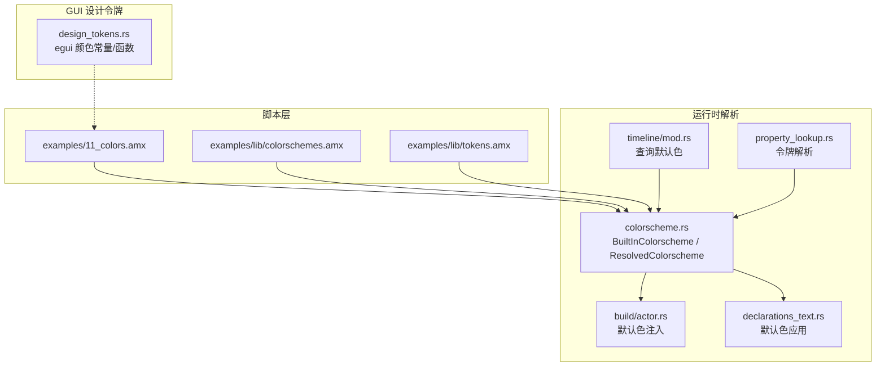
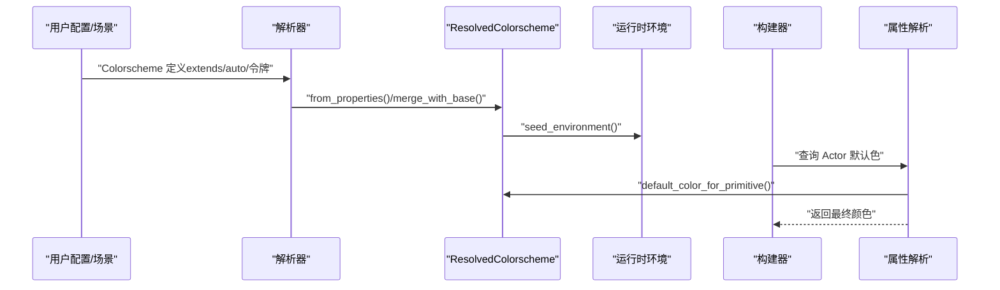
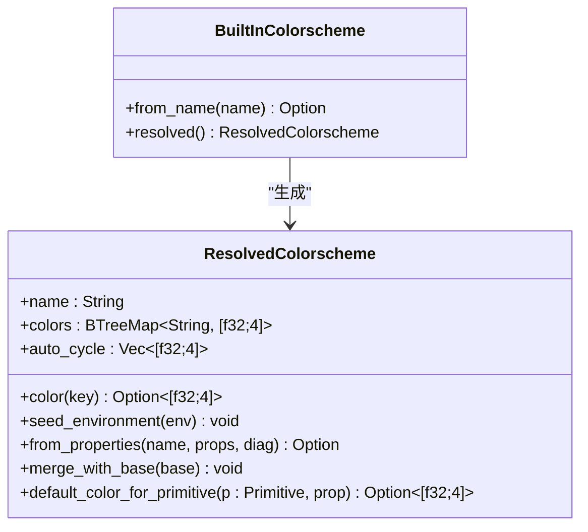
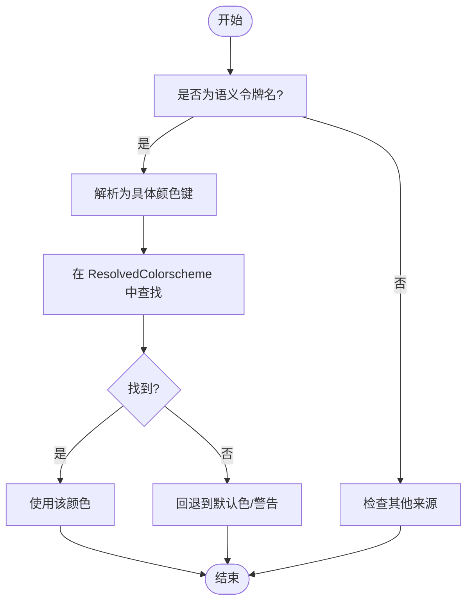
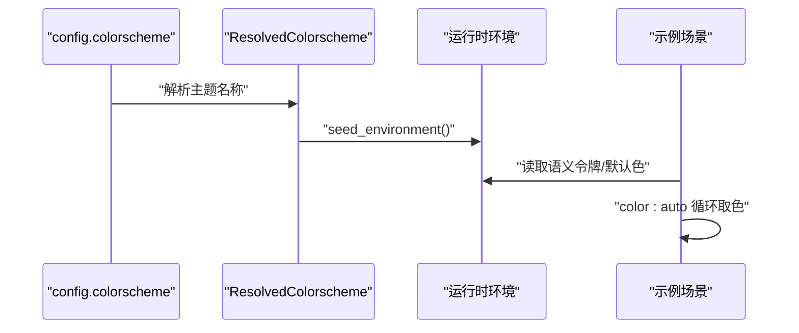
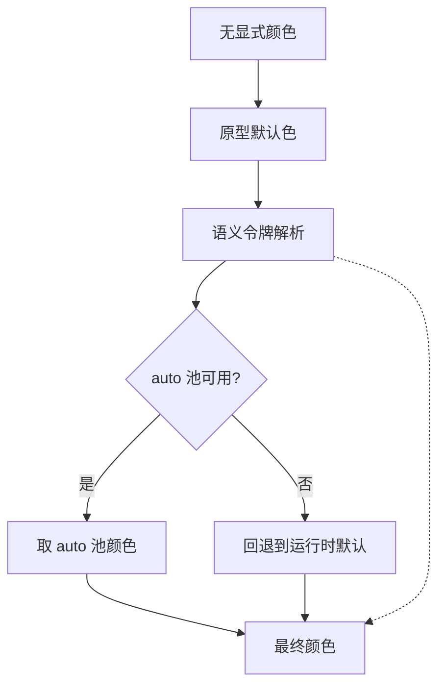
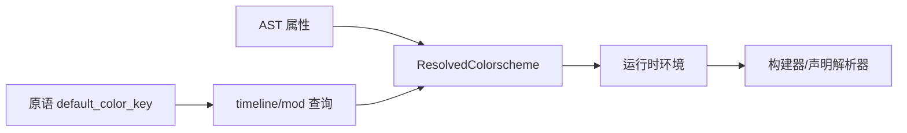

# 颜色系统

<cite>
**本文引用的文件**
- [crates/animatix/src/timeline/colorscheme.rs](file://crates/animatix/src/timeline/colorscheme.rs)
- [examples/11_colors.amx](file://examples/11_colors.amx)
- [examples/lib/colorschemes.amx](file://examples/lib/colorschemes.amx)
- [examples/lib/tokens.amx](file://examples/lib/tokens.amx)
- [crates/animatix-gui/src/app/design_tokens.rs](file://crates/animatix-gui/src/app/design_tokens.rs)
- [crates/animatix/src/timeline/build/actor.rs](file://crates/animatix/src/timeline/build/actor.rs)
- [crates/animatix/src/timeline/declarations_text.rs](file://crates/animatix/src/timeline/declarations_text.rs)
- [crates/animatix/src/timeline/mod.rs](file://crates/animatix/src/timeline/mod.rs)
- [crates/animatix/src/timeline/property_lookup.rs](file://crates/animatix/src/timeline/property_lookup.rs)
- [crates/animatix/src/primitives/mod.rs](file://crates/animatix/src/primitives/mod.rs)
</cite>

## 目录
1. [引言](#引言)
2. [项目结构](#项目结构)
3. [核心组件](#核心组件)
4. [架构总览](#架构总览)
5. [组件详解](#组件详解)
6. [依赖关系分析](#依赖关系分析)
7. [性能考量](#性能考量)
8. [故障排查指南](#故障排查指南)
9. [结论](#结论)
10. [附录](#附录)

## 引言
本文件系统性阐述 Animatix 的颜色系统：从语义化颜色、调色板与主题管理，到颜色方案的定义、颜色令牌的使用与动态主题切换；并给出内置颜色系统与自定义颜色方案的集成方式，以及在组件设计中的应用示例。同时覆盖无障碍访问与跨平台兼容性建议，帮助团队建立一致且可维护的颜色体系。

## 项目结构
颜色系统由“脚本层（场景与模块）+ 运行时解析 + GUI 设计令牌”三部分协同构成：
- 脚本层：通过 Colorscheme 声明主题，使用语义令牌与 auto 自动分配池，支持 extends 继承。
- 运行时解析：构建期解析 Colorscheme，生成 ResolvedColorscheme 并注入运行时环境。
- GUI 层：统一的 UI 设计令牌，确保编辑器界面与场景颜色体系一致。

图表来源
- [crates/animatix/src/timeline/colorscheme.rs:1-228](file://crates/animatix/src/timeline/colorscheme.rs#L1-L228)
- [examples/11_colors.amx:1-76](file://examples/11_colors.amx#L1-L76)
- [examples/lib/colorschemes.amx:1-76](file://examples/lib/colorschemes.amx#L1-L76)
- [examples/lib/tokens.amx:1-27](file://examples/lib/tokens.amx#L1-L27)
- [crates/animatix/src/timeline/build/actor.rs:352-386](file://crates/animatix/src/timeline/build/actor.rs#L352-L386)
- [crates/animatix/src/timeline/declarations_text.rs:164-208](file://crates/animatix/src/timeline/declarations_text.rs#L164-L208)
- [crates/animatix/src/timeline/mod.rs:988-991](file://crates/animatix/src/timeline/mod.rs#L988-L991)
- [crates/animatix/src/timeline/property_lookup.rs:127](file://crates/animatix/src/timeline/property_lookup.rs#L127)
- [crates/animatix-gui/src/app/design_tokens.rs:1-291](file://crates/animatix-gui/src/app/design_tokens.rs#L1-L291)

章节来源
- [crates/animatix/src/timeline/colorscheme.rs:1-228](file://crates/animatix/src/timeline/colorscheme.rs#L1-L228)
- [examples/11_colors.amx:1-76](file://examples/11_colors.amx#L1-L76)
- [examples/lib/colorschemes.amx:1-76](file://examples/lib/colorschemes.amx#L1-L76)
- [examples/lib/tokens.amx:1-27](file://examples/lib/tokens.amx#L1-L27)
- [crates/animatix-gui/src/app/design_tokens.rs:1-291](file://crates/animatix-gui/src/app/design_tokens.rs#L1-L291)

## 核心组件
- 内置预设与解析
  - BuiltInColorscheme 提供三种内置主题（深色、浅色、编辑器深色），并以 ResolvedColorscheme 形式输出完整颜色映射与 auto 循环池。
- 颜色方案与继承
  - 支持 Colorscheme extends 继承，允许仅覆盖 auto 池或未来支持的逐令牌覆盖（当前解析限制为非点号属性名）。
- 默认色与令牌解析
  - 当未显式指定颜色时，按优先级回退至默认色、语义令牌、auto 池等。
- GUI 设计令牌
  - 统一的 egui 颜色常量与函数，保证编辑器 UI 与场景颜色体系一致。

章节来源
- [crates/animatix/src/timeline/colorscheme.rs:20-126](file://crates/animatix/src/timeline/colorscheme.rs#L20-L126)
- [crates/animatix/src/timeline/colorscheme.rs:128-227](file://crates/animatix/src/timeline/colorscheme.rs#L128-L227)
- [examples/lib/colorschemes.amx:1-76](file://examples/lib/colorschemes.amx#L1-L76)
- [crates/animatix-gui/src/app/design_tokens.rs:1-291](file://crates/animatix-gui/src/app/design_tokens.rs#L1-L291)

## 架构总览
颜色系统的关键流程：
- 解析阶段：将 Colorscheme AST 属性转换为 ResolvedColorscheme，合并基色表与 auto 池。
- 注入阶段：将解析出的颜色键值对注入运行时环境，供属性解析使用。
- 应用阶段：当 Actor 缺省颜色时，按优先级选择默认色、语义令牌或 auto 池颜色。

图表来源
- [crates/animatix/src/timeline/colorscheme.rs:160-216](file://crates/animatix/src/timeline/colorscheme.rs#L160-L216)
- [crates/animatix/src/timeline/colorscheme.rs:145-158](file://crates/animatix/src/timeline/colorscheme.rs#L145-L158)
- [crates/animatix/src/timeline/build/actor.rs:352-386](file://crates/animatix/src/timeline/build/actor.rs#L352-L386)
- [crates/animatix/src/timeline/declarations_text.rs:200-208](file://crates/animatix/src/timeline/declarations_text.rs#L200-L208)
- [crates/animatix/src/timeline/mod.rs:988-991](file://crates/animatix/src/timeline/mod.rs#L988-L991)

## 组件详解

### 颜色方案与继承（BuiltInColorscheme / ResolvedColorscheme）
- 内置主题键值
  - 包含场景背景、文本主次、表面层级、强调色（primary/secondary/info/success/warning/danger）、描边默认等键。
- auto 循环池
  - 为 color: auto 提供循环取色序列，避免重复配色。
- 合并与回退
  - 通过 merge_with_base 将子方案缺失项回退到父方案，auto 池为空时继承父方案。

图表来源
- [crates/animatix/src/timeline/colorscheme.rs:20-126](file://crates/animatix/src/timeline/colorscheme.rs#L20-L126)
- [crates/animatix/src/timeline/colorscheme.rs:128-227](file://crates/animatix/src/timeline/colorscheme.rs#L128-L227)

章节来源
- [crates/animatix/src/timeline/colorscheme.rs:42-125](file://crates/animatix/src/timeline/colorscheme.rs#L42-L125)
- [crates/animatix/src/timeline/colorscheme.rs:160-216](file://crates/animatix/src/timeline/colorscheme.rs#L160-L216)

### 语义化颜色与令牌
- 场景语义令牌
  - 使用 text.primary/text.secondary、surface.primary/secondary、accent.primary/secondary/success/warning/danger 等语义键。
- 示例令牌库
  - 提供品牌色与常用语义别名（success/warning/info/error），便于复用与替换。
- 令牌解析与回退
  - 若属性为语义令牌名，则解析为具体 RGBA；若无效则回退到默认色并发出诊断。

图表来源
- [crates/animatix/src/timeline/property_lookup.rs:127](file://crates/animatix/src/timeline/property_lookup.rs#L127)
- [crates/animatix/src/timeline/colorscheme.rs:140-143](file://crates/animatix/src/timeline/colorscheme.rs#L140-L143)

章节来源
- [examples/lib/tokens.amx:1-27](file://examples/lib/tokens.amx#L1-L27)
- [crates/animatix/src/timeline/property_lookup.rs:127](file://crates/animatix/src/timeline/property_lookup.rs#L127)

### 动态主题切换与自动分配
- 主题切换
  - 在 config 中设置 colorscheme 名称，构建期解析为 ResolvedColorscheme 并注入环境。
- auto 自动分配
  - color: auto 从 auto_cycle 按顺序取色，适合批量元素快速着色。
- 示例验证
  - 11_colors.amx 展示了继承、语义令牌、auto 分配与内置常量的组合使用。

图表来源
- [examples/11_colors.amx:4](file://examples/11_colors.amx#L4)
- [crates/animatix/src/timeline/colorscheme.rs:145-158](file://crates/animatix/src/timeline/colorscheme.rs#L145-L158)
- [examples/11_colors.amx:30-36](file://examples/11_colors.amx#L30-L36)

章节来源
- [examples/11_colors.amx:1-76](file://examples/11_colors.amx#L1-L76)
- [examples/lib/colorschemes.amx:1-76](file://examples/lib/colorschemes.amx#L1-L76)

### 默认色注入与回退优先级
- 优先级（低到高）
  1) 运行时硬编码默认（白色）
  2) 原型类型默认色（属性缺省时）
  3) 语义令牌默认（如 text.primary）
  4) auto 池颜色
  5) 显式声明值
  6) 后续定时赋值
  7) 帧内响应式覆盖（always）
- 构建期确定性
  - 颜色解析在构建期完成，保证预览与导出的一致性。

图表来源
- [crates/animatix/src/timeline/colorscheme.rs:3-12](file://crates/animatix/src/timeline/colorscheme.rs#L3-L12)
- [crates/animatix/src/timeline/build/actor.rs:352-386](file://crates/animatix/src/timeline/build/actor.rs#L352-L386)
- [crates/animatix/src/timeline/declarations_text.rs:200-208](file://crates/animatix/src/timeline/declarations_text.rs#L200-L208)

章节来源
- [crates/animatix/src/timeline/colorscheme.rs:1-12](file://crates/animatix/src/timeline/colorscheme.rs#L1-L12)
- [crates/animatix/src/timeline/build/actor.rs:352-386](file://crates/animatix/src/timeline/build/actor.rs#L352-L386)
- [crates/animatix/src/timeline/declarations_text.rs:164-208](file://crates/animatix/src/timeline/declarations_text.rs#L164-L208)

### GUI 设计令牌与跨平台一致性
- 统一命名规范
  - 背景（BG_*）、文本（TEXT_*）、强调色（ACCENT_*/RED/GREEN/AMBER/PURPLE）、间距（SPACE_*）、字体大小（FONT_SIZE_*）、圆角（RADIUS_*）、时间线（TIMELINE_*）等。
- egui 颜色常量与函数
  - 提供 Color32 常量与带透明度插值、乘算等工具函数，便于 UI 渲染与过渡。
- 与场景颜色体系对齐
  - GUI 使用统一令牌，确保编辑器与场景在视觉上保持一致的基调与对比度。

章节来源
- [crates/animatix-gui/src/app/design_tokens.rs:1-291](file://crates/animatix-gui/src/app/design_tokens.rs#L1-L291)

## 依赖关系分析
- Colorscheme 解析依赖
  - 解析 AST 属性 → 生成 ResolvedColorscheme → 注入运行时环境 → 构建器/声明解析器查询默认色。
- 令牌解析依赖
  - 语义令牌名 → ResolvedColorscheme 查找 → 返回 RGBA；无效时回退并告警。
- 原型默认色依赖
  - 每个原语实现 default_color_key，用于根据属性名映射到对应的颜色键。

图表来源
- [crates/animatix/src/timeline/colorscheme.rs:160-216](file://crates/animatix/src/timeline/colorscheme.rs#L160-L216)
- [crates/animatix/src/timeline/mod.rs:988-991](file://crates/animatix/src/timeline/mod.rs#L988-L991)
- [crates/animatix/src/primitives/mod.rs:567-569](file://crates/animatix/src/primitives/mod.rs#L567-L569)

章节来源
- [crates/animatix/src/timeline/colorscheme.rs:160-216](file://crates/animatix/src/timeline/colorscheme.rs#L160-L216)
- [crates/animatix/src/timeline/mod.rs:988-991](file://crates/animatix/src/timeline/mod.rs#L988-L991)
- [crates/animatix/src/primitives/mod.rs:567-569](file://crates/animatix/src/primitives/mod.rs#L567-L569)

## 性能考量
- 构建期解析
  - 颜色解析在构建期完成，避免帧间计算开销，保证预览与导出稳定。
- auto 池缓存
  - auto 循环池为静态数组，索引访问 O(1)，批量元素着色高效。
- 令牌查找
  - BTreeMap 键查找 O(log N)，令牌数量有限，开销可忽略。
- GUI 颜色工具
  - 颜色插值与透明度乘算为简单像素运算，不影响整体性能。

## 故障排查指南
- 无效颜色值
  - 当 Colorscheme 属性值无法解析为有效 RGBA 时，会记录警告并跳过该属性。
- auto 无可用池
  - 当 color: auto 请求自动分配但当前方案无 auto 池时，回退到默认色并提示。
- 语义令牌未解析
  - 当属性为语义令牌名但未在当前方案中找到对应键时，回退到默认色并提示。

章节来源
- [crates/animatix/src/timeline/colorscheme.rs:182-198](file://crates/animatix/src/timeline/colorscheme.rs#L182-L198)
- [crates/animatix/src/timeline/build/actor.rs:386](file://crates/animatix/src/timeline/build/actor.rs#L386)
- [crates/animatix/src/timeline/declarations_text.rs:164](file://crates/animatix/src/timeline/declarations_text.rs#L164)
- [crates/animatix/src/timeline/property_lookup.rs:127](file://crates/animatix/src/timeline/property_lookup.rs#L127)

## 结论
Animatix 的颜色系统以“语义化 + 调色板 + 主题继承”为核心，结合构建期解析与运行时注入，实现了可维护、可扩展且可预测的颜色体系。通过统一的 GUI 设计令牌与场景颜色令牌，确保编辑器与动画内容在视觉上保持一致。配合 auto 自动分配与严格的回退策略，既满足创意灵活性，又保障可用性与可访问性。

## 附录

### 颜色系统最佳实践
- 优先使用语义令牌（text.*、surface.*、accent.*），避免直接绑定具体色调。
- 为每个主题提供完整的 auto 池，保证批量元素色彩协调。
- 在 GUI 与场景中统一使用 design_tokens.rs 的命名与取值范围，减少视觉割裂。
- 对于强调色（success/warning/danger），确保与无障碍对比度要求一致。

### 可访问性与跨平台兼容性
- 对比度
  - 文本与背景对比度应满足 WCAG AA/AAA 要求；在暗色主题下优先使用较亮的文本色，在浅色主题下使用较暗的文本色。
- 色盲友好
  - 避免仅依赖颜色区分信息；结合形状、纹理或标签辅助识别。
- 跨平台一致性
  - GUI 使用 egui 颜色常量与函数，场景使用 RGBA 浮点值，确保渲染后效果在不同平台一致。