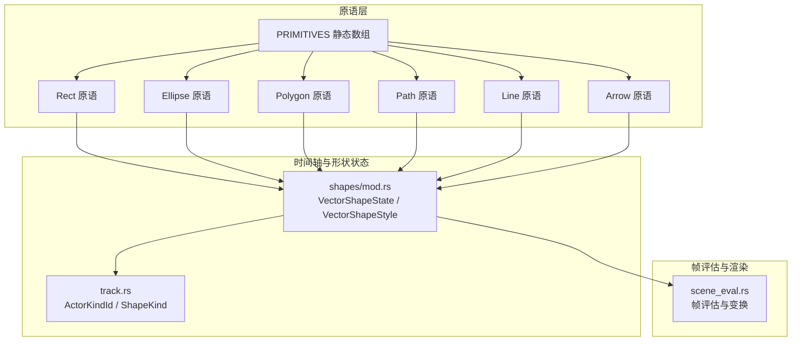
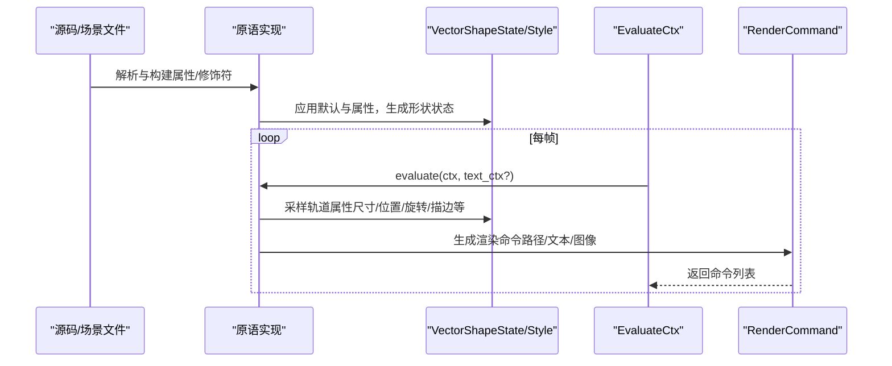
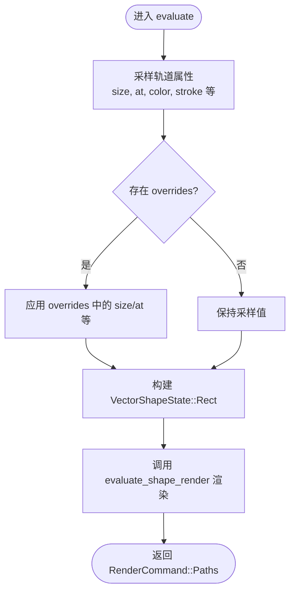
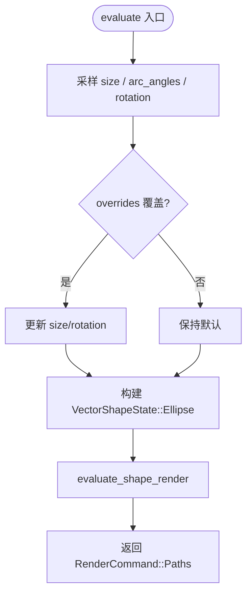
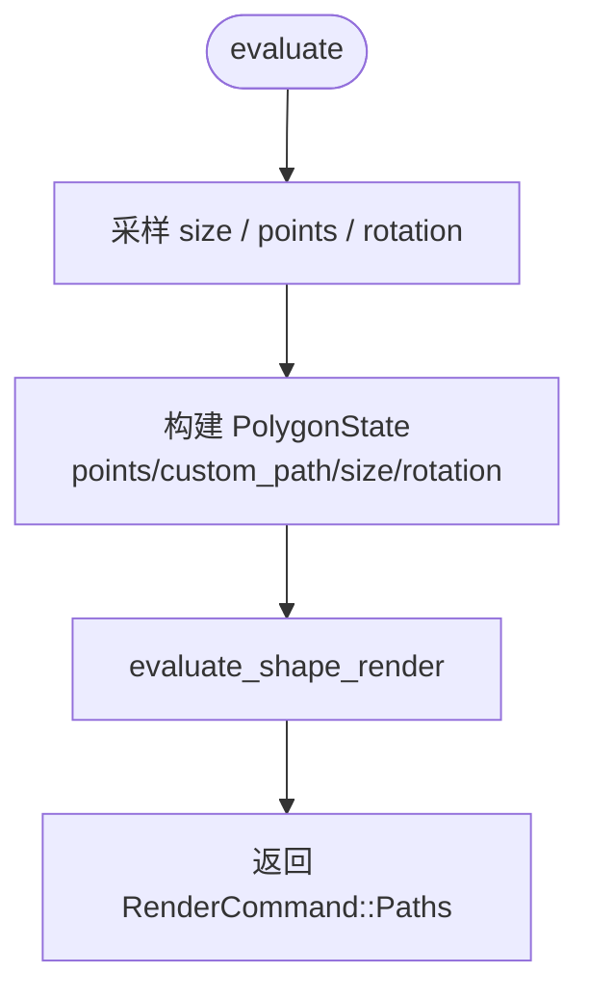
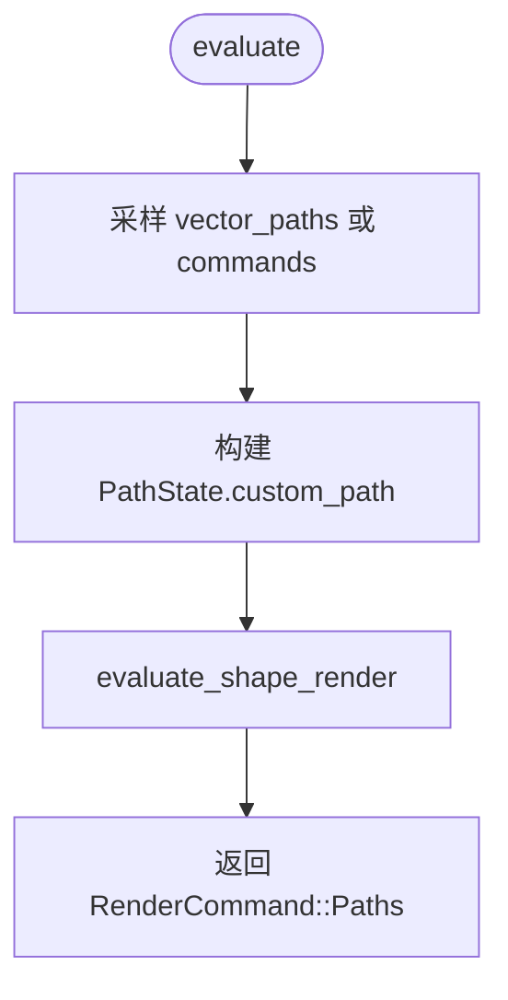
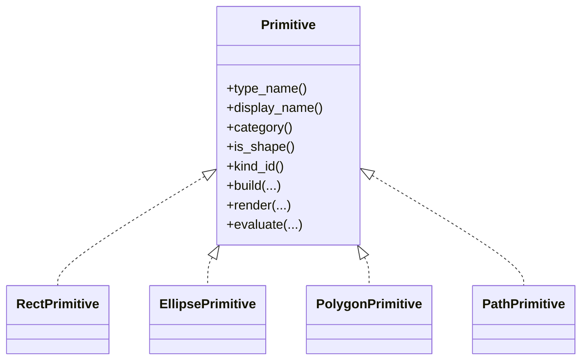
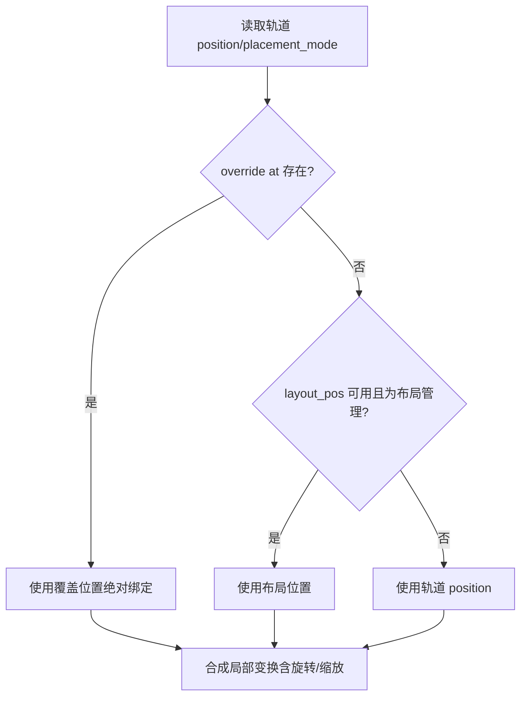

# 几何形状

<cite>
**本文引用的文件**
- [crates/animatix/src/primitives/mod.rs](file://crates/animatix/src/primitives/mod.rs)
- [crates/animatix/src/primitives/rect.rs](file://crates/animatix/src/primitives/rect.rs)
- [crates/animatix/src/primitives/ellipse.rs](file://crates/animatix/src/primitives/ellipse.rs)
- [crates/animatix/src/primitives/polygon.rs](file://crates/animatix/src/primitives/polygon.rs)
- [crates/animatix/src/primitives/path.rs](file://crates/animatix/src/primitives/path.rs)
- [crates/animatix/src/timeline/shapes/mod.rs](file://crates/animatix/src/timeline/shapes/mod.rs)
- [crates/animatix/src/timeline/track.rs](file://crates/animatix/src/timeline/track.rs)
- [crates/animatix/src/timeline/scene_eval.rs](file://crates/animatix/src/timeline/scene_eval.rs)
- [examples/01_shapes.amx](file://examples/01_shapes.amx)
</cite>

## 目录
1. [简介](#简介)
2. [项目结构](#项目结构)
3. [核心组件](#核心组件)
4. [架构总览](#架构总览)
5. [详细组件分析](#详细组件分析)
6. [依赖关系分析](#依赖关系分析)
7. [性能考量](#性能考量)
8. [故障排查指南](#故障排查指南)
9. [结论](#结论)
10. [附录](#附录)

## 简介
本章节面向希望系统性掌握 Animatix 几何形状原语的用户与开发者，全面覆盖以下内容：
- 支持的几何形状类型：矩形（Rect）、椭圆（Ellipse）、多边形（Polygon）、路径（Path），以及线（Line）与箭头（Arrow）等。
- 每种形状的属性配置：颜色、描边宽度与颜色、填充不透明度、线帽与连接样式等视觉效果。
- 形状的构建与渲染流程：从 AST 到时间轴轨道（AnimationTrack）再到最终绘制（VelloPath）。
- 变换与布局：位置、旋转、缩放、锚点与布局管理在帧评估阶段的行为与约束。
- 实用示例：通过示例场景文件展示如何创建与自定义不同几何形状。

## 项目结构
Animatix 的几何形状原语采用统一的“原语”体系，所有演员类型（形状、文本、媒体、图表、容器）均实现同一 Trait 并注册到全局静态数组中，形成可扩展的元数据注册表与派发机制。形状相关的状态、样式与路径生成集中在时间轴与原语模块中。

**图示来源**
- [crates/animatix/src/primitives/mod.rs:575-586](file://crates/animatix/src/primitives/mod.rs#L575-L586)
- [crates/animatix/src/timeline/shapes/mod.rs:215-234](file://crates/animatix/src/timeline/shapes/mod.rs#L215-L234)
- [crates/animatix/src/timeline/track.rs:115-130](file://crates/animatix/src/timeline/track.rs#L115-L130)

**章节来源**
- [crates/animatix/src/primitives/mod.rs:30-39](file://crates/animatix/src/primitives/mod.rs#L30-L39)
- [crates/animatix/src/primitives/mod.rs:575-586](file://crates/animatix/src/primitives/mod.rs#L575-L586)

## 核心组件
- 统一原语接口：每个形状实现统一的 Primitive Trait，包含元数据、构建（Build）、渲染（Render）、默认属性、属性应用、评估（Evaluate）等能力。
- 形状状态与样式：VectorShapeState 以枚举形式按需存储各形状所需字段；VectorShapeStyle 统一描述颜色、描边、填充与线型参数。
- 元数据注册：PRIMITIVES 数组作为唯一入口，自动构建 ActorKindMeta 注册表，支持按类型名查找与派发。
- 帧评估与变换：EvaluateCtx 提供当前轨道采样值、局部变换、继承不透明度等，RenderCommand 将命令执行到 Vello 场景。

**章节来源**
- [crates/animatix/src/primitives/mod.rs:419-568](file://crates/animatix/src/primitives/mod.rs#L419-L568)
- [crates/animatix/src/timeline/shapes/mod.rs:301-316](file://crates/animatix/src/timeline/shapes/mod.rs#L301-L316)
- [crates/animatix/src/timeline/shapes/mod.rs:215-234](file://crates/animatix/src/timeline/shapes/mod.rs#L215-L234)
- [crates/animatix/src/primitives/mod.rs:237-255](file://crates/animatix/src/primitives/mod.rs#L237-L255)

## 架构总览
下图展示了从源码声明到帧渲染的关键调用链：解析与构建阶段将 AST 转为轨道与形状状态；评估阶段在每一帧根据时间采样属性并生成渲染命令；最终由 RenderCommand 执行到 Vello 场景。

**图示来源**
- [crates/animatix/src/primitives/mod.rs:561-567](file://crates/animatix/src/primitives/mod.rs#L561-L567)
- [crates/animatix/src/timeline/shapes/mod.rs:406-431](file://crates/animatix/src/timeline/shapes/mod.rs#L406-L431)

## 详细组件分析

### 矩形（Rect）
- 类型与分类：ActorKindId::Shape(ShapeKind::Rect)，属于 Shape 分类。
- 默认属性：位置 at、尺寸 size、颜色 color。
- 渲染逻辑：基于半宽高构造轴对齐矩形路径，使用统一的 build_vello_path 生成填充与描边。
- 评估流程：从轨道采样 size，默认布局半尺寸，支持 overrides 覆盖。

**图示来源**
- [crates/animatix/src/primitives/rect.rs:86-107](file://crates/animatix/src/primitives/rect.rs#L86-L107)
- [crates/animatix/src/primitives/mod.rs:154-167](file://crates/animatix/src/primitives/mod.rs#L154-L167)

**章节来源**
- [crates/animatix/src/primitives/rect.rs:10-107](file://crates/animatix/src/primitives/rect.rs#L10-L107)
- [crates/animatix/src/timeline/shapes/mod.rs:91-102](file://crates/animatix/src/timeline/shapes/mod.rs#L91-L102)

### 椭圆（Ellipse）
- 类型与分类：ActorKindId::Shape(ShapeKind::Ellipse)，支持弧段（arc_angles）与旋转（rotation）。
- 默认属性：位置 at、尺寸 size、颜色 color。
- 渲染逻辑：根据 radii 与 rotation 生成椭圆或弧段路径，使用统一样式构建 VelloPath。
- 属性扩展：支持 radius_x / radius_y 等别名属性的解析与应用。

**图示来源**
- [crates/animatix/src/primitives/ellipse.rs:66-95](file://crates/animatix/src/primitives/ellipse.rs#L66-L95)

**章节来源**
- [crates/animatix/src/primitives/ellipse.rs:18-125](file://crates/animatix/src/primitives/ellipse.rs#L18-L125)
- [crates/animatix/src/timeline/shapes/mod.rs:104-123](file://crates/animatix/src/timeline/shapes/mod.rs#L104-L123)

### 多边形（Polygon）
- 类型与分类：ActorKindId::Shape(ShapeKind::Polygon)，支持自定义顶点列表或贝塞尔路径。
- 默认属性：位置 at、顶点 points、颜色 color。
- 渲染逻辑：优先使用显式 points 构建多边形路径；若无则使用 custom_path；否则为空路径。
- 属性应用：支持 points 属性解析为点序列并转换为自定义路径。

**图示来源**
- [crates/animatix/src/primitives/polygon.rs:66-99](file://crates/animatix/src/primitives/polygon.rs#L66-L99)

**章节来源**
- [crates/animatix/src/primitives/polygon.rs:16-125](file://crates/animatix/src/primitives/polygon.rs#L16-L125)
- [crates/animatix/src/timeline/shapes/mod.rs:146-174](file://crates/animatix/src/timeline/shapes/mod.rs#L146-L174)

### 路径（Path）
- 类型与分类：ActorKindId::Shape(ShapeKind::Path)，支持自定义贝塞尔命令序列。
- 默认属性：位置 at、命令列表 commands、颜色 color。
- 渲染逻辑：将 commands 解析为 BezPath，再统一构建 VelloPath。
- 属性应用：支持 commands 属性解析为 move_to/line_to/quad_to/curve_to/close 等命令序列。

**图示来源**
- [crates/animatix/src/primitives/path.rs:58-82](file://crates/animatix/src/primitives/path.rs#L58-L82)

**章节来源**
- [crates/animatix/src/primitives/path.rs:16-101](file://crates/animatix/src/primitives/path.rs#L16-L101)
- [crates/animatix/src/timeline/shapes/mod.rs:176-192](file://crates/animatix/src/timeline/shapes/mod.rs#L176-L192)

### 线（Line）与箭头（Arrow）
- 线（Line）：支持起点 from、终点 to、可选箭头 tip_size（通过 exposes_tip_size 暴露）。
- 箭头（Arrow）：专用箭头形状，包含 from、to、head_size 等参数，内部通过 build_arrow_path 生成带箭头的复合路径。
- 渲染特性：线与箭头通常仅描边，填充透明；必要时可强制描边以保证可见性。

说明：Line 与 Arrow 的具体实现位于独立文件中，其状态与路径生成遵循统一的 VectorShapeState 与 build_vello_path 流程。

**章节来源**
- [crates/animatix/src/timeline/shapes/mod.rs:125-144](file://crates/animatix/src/timeline/shapes/mod.rs#L125-L144)
- [crates/animatix/src/timeline/shapes/mod.rs:194-213](file://crates/animatix/src/timeline/shapes/mod.rs#L194-L213)
- [crates/animatix/src/timeline/shapes/mod.rs:446-489](file://crates/animatix/src/timeline/shapes/mod.rs#L446-L489)

## 依赖关系分析
- 原语注册：PRIMITIVES 数组集中注册所有形状原语，驱动 ActorKindMeta 自动构建与按类型名查找。
- 形状类型映射：ShapeType 与 ShapeKind 一一对应，用于区分几何类型并在渲染与布局中做分支处理。
- 样式与状态：VectorShapeStyle 统一管理颜色、描边、填充与线型；VectorShapeState 按需携带各形状特有参数。
- 帧评估：EvaluateCtx 提供当前时间、父变换、继承不透明度与轨道采样值，RenderCommand 将几何命令写入 Vello 场景。

**图示来源**
- [crates/animatix/src/primitives/mod.rs:419-568](file://crates/animatix/src/primitives/mod.rs#L419-L568)
- [crates/animatix/src/primitives/rect.rs:16-107](file://crates/animatix/src/primitives/rect.rs#L16-L107)
- [crates/animatix/src/primitives/ellipse.rs:18-125](file://crates/animatix/src/primitives/ellipse.rs#L18-L125)
- [crates/animatix/src/primitives/polygon.rs:16-125](file://crates/animatix/src/primitives/polygon.rs#L16-L125)
- [crates/animatix/src/primitives/path.rs:16-101](file://crates/animatix/src/primitives/path.rs#L16-L101)

**章节来源**
- [crates/animatix/src/primitives/mod.rs:575-586](file://crates/animatix/src/primitives/mod.rs#L575-L586)
- [crates/animatix/src/timeline/track.rs:115-130](file://crates/animatix/src/timeline/track.rs#L115-L130)

## 性能考量
- 路径构建复用：统一的 build_vello_path 与 build_vector_shape_vello_path 避免重复样板代码，减少内存拷贝与分支判断。
- 帧内缓存：scene_eval.rs 对节点变换进行缓存，避免相同时间与父变换重复采样与计算。
- 描边与填充策略：当 fill_opacity 为 0 或 stroke_width 为 0 时跳过相应绘制，降低无效绘制成本。
- 线条样式：line_cap 与 line_join 的枚举值映射到底层渲染库，确保高效绘制。

**章节来源**
- [crates/animatix/src/timeline/shapes/mod.rs:654-693](file://crates/animatix/src/timeline/shapes/mod.rs#L654-L693)
- [crates/animatix/src/timeline/scene_eval.rs:320-351](file://crates/animatix/src/timeline/scene_eval.rs#L320-L351)

## 故障排查指南
- 样式未生效
  - 检查轨道属性是否正确采样（如 color、stroke_width、fill_opacity）。
  - 确认 overrides 是否覆盖了目标属性。
- 路径为空或不可见
  - 对于 Polygon/Path，确认 points 或 commands 是否有效解析。
  - 对于 Line/Arrow，确认起点与终点是否重合导致长度为零。
- 渲染异常
  - 检查 RenderCommand::execute 的调用顺序与变换矩阵传递。
  - 确保不透明度与父级叠加逻辑正确。

**章节来源**
- [crates/animatix/src/primitives/mod.rs:102-151](file://crates/animatix/src/primitives/mod.rs#L102-L151)
- [crates/animatix/src/timeline/shapes/mod.rs:491-569](file://crates/animatix/src/timeline/shapes/mod.rs#L491-L569)

## 结论
Animatix 的几何形状原语通过统一的 Primitive 接口与 VectorShapeState/Style 抽象，实现了高内聚、低耦合的可扩展体系。借助 PRIMITIVES 注册表与 Evaluate/EvaluteCtx 的帧评估流程，开发者可以便捷地创建、定制与动画化各类矢量形状，并在布局与变换系统中获得一致的行为体验。

## 附录

### 属性与视觉效果一览
- 通用属性
  - 颜色：color（填充默认色）
  - 描边：stroke_color（描边色）、stroke_width（描边宽度）
  - 填充：fill_opacity（填充不透明度）
  - 线帽与连接：line_cap（0=Butt, 1=Round, 2=Square）、line_join（0=Miter, 1=Round, 2=Bevel）
- 形状特定属性
  - 矩形：size（宽高）
  - 椭圆：size（宽高）、arc_angles（起始/扫掠角度）、rotation（旋转弧度）
  - 多边形：points（顶点列表）、custom_path（自定义路径）、rotation（旋转弧度）
  - 路径：commands（贝塞尔命令序列）
  - 线/箭头：from/to（起点/终点）、head_size（箭头大小）

**章节来源**
- [crates/animatix/src/timeline/shapes/mod.rs:301-316](file://crates/animatix/src/timeline/shapes/mod.rs#L301-L316)
- [crates/animatix/src/primitives/ellipse.rs:97-124](file://crates/animatix/src/primitives/ellipse.rs#L97-L124)
- [crates/animatix/src/primitives/polygon.rs:101-122](file://crates/animatix/src/primitives/polygon.rs#L101-L122)
- [crates/animatix/src/primitives/path.rs:84-99](file://crates/animatix/src/primitives/path.rs#L84-L99)

### 示例：创建与自定义几何形状
- 使用示例场景文件快速创建一组基础形状与动画，涵盖颜色轮转与淡入效果。
- 参考路径：[examples/01_shapes.amx](file://examples/01_shapes.amx)

**章节来源**
- [examples/01_shapes.amx:6-18](file://examples/01_shapes.amx#L6-L18)

### 变换与布局行为
- 位置与锚点：帧评估阶段根据 placement_mode 与 position_binding 决定绝对或绑定位置，支持覆盖 at/position。
- 旋转与缩放：EvaluateCtx 提供局部变换（包含父变换、位置、旋转、缩放），RenderCommand 在执行时应用该变换。
- 布局约束：容器类形状（如 Grid）影响子节点的布局位置与尺寸，但几何形状本身主要受轨道属性与变换控制。

**图示来源**
- [crates/animatix/src/timeline/scene_eval.rs:87-112](file://crates/animatix/src/timeline/scene_eval.rs#L87-L112)

**章节来源**
- [crates/animatix/src/timeline/scene_eval.rs:87-112](file://crates/animatix/src/timeline/scene_eval.rs#L87-L112)