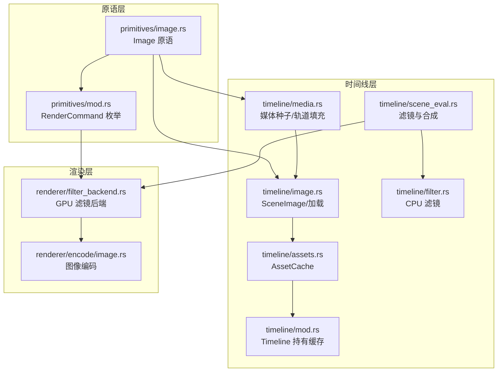
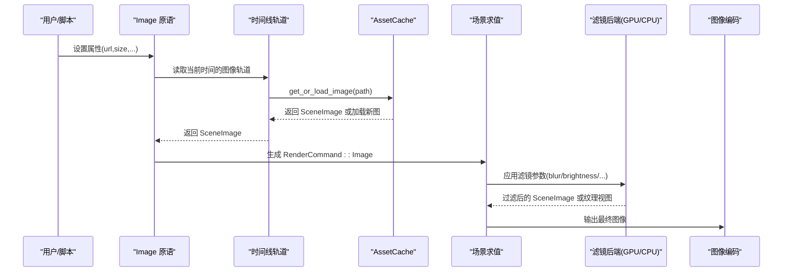
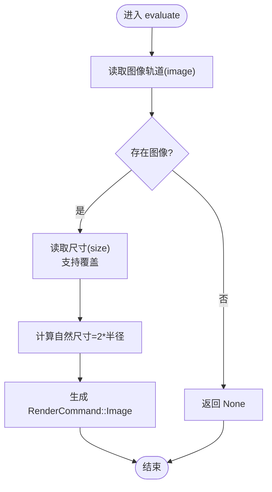
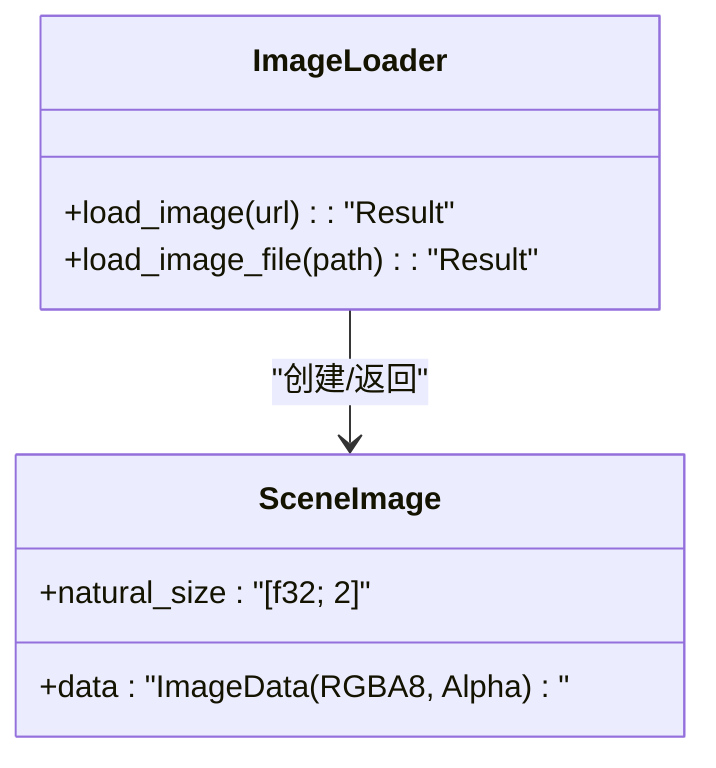
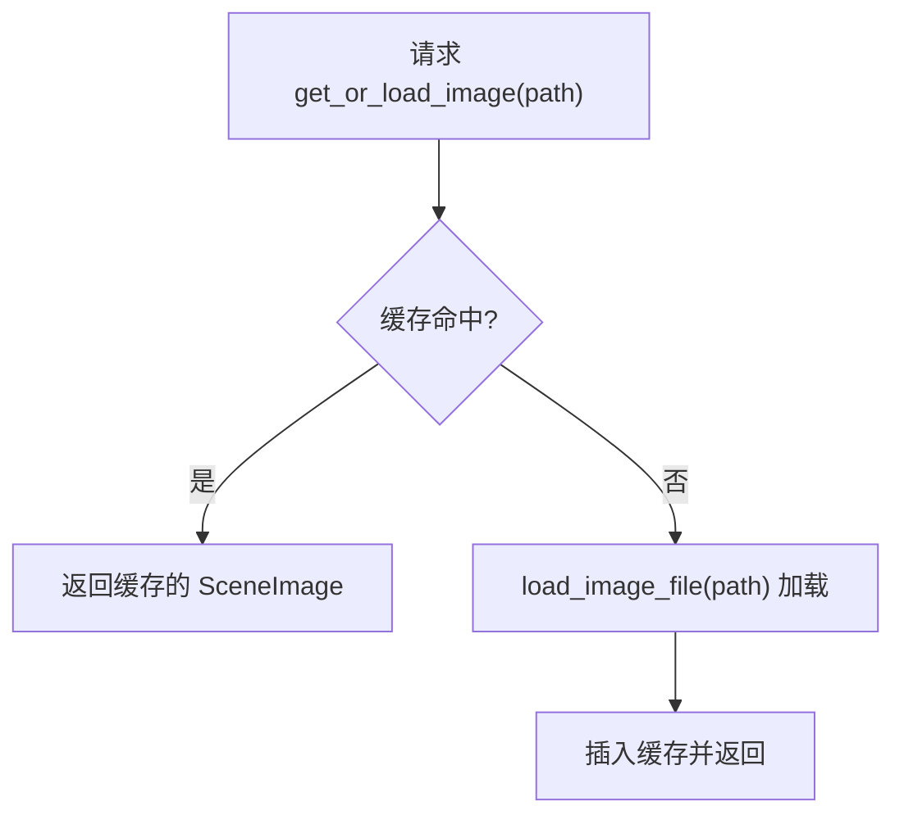
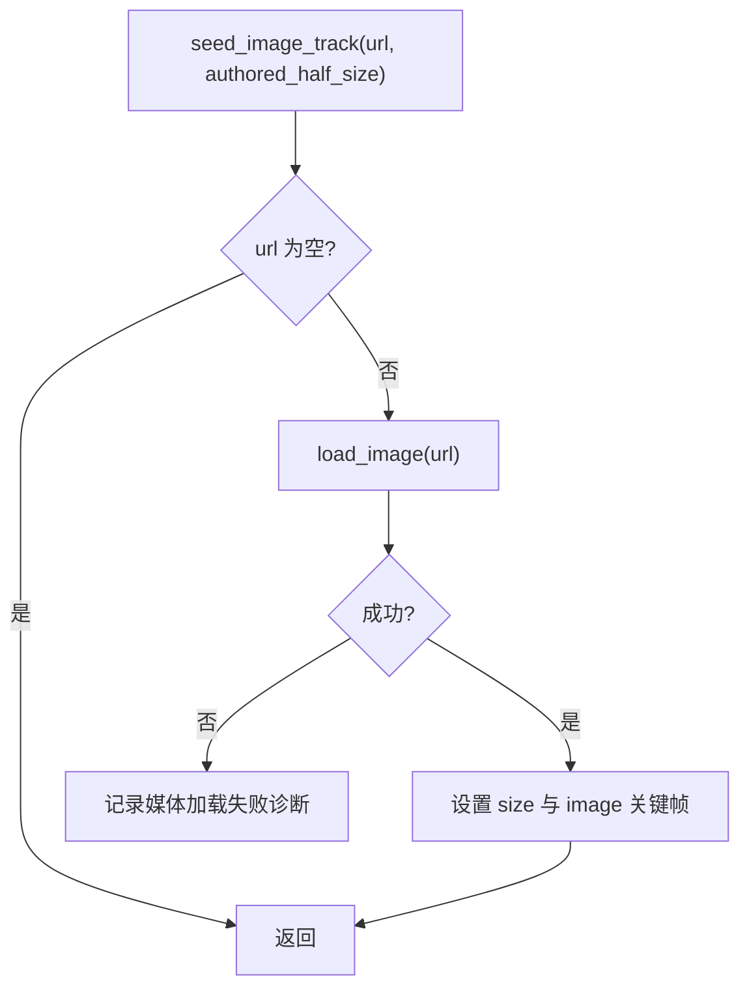
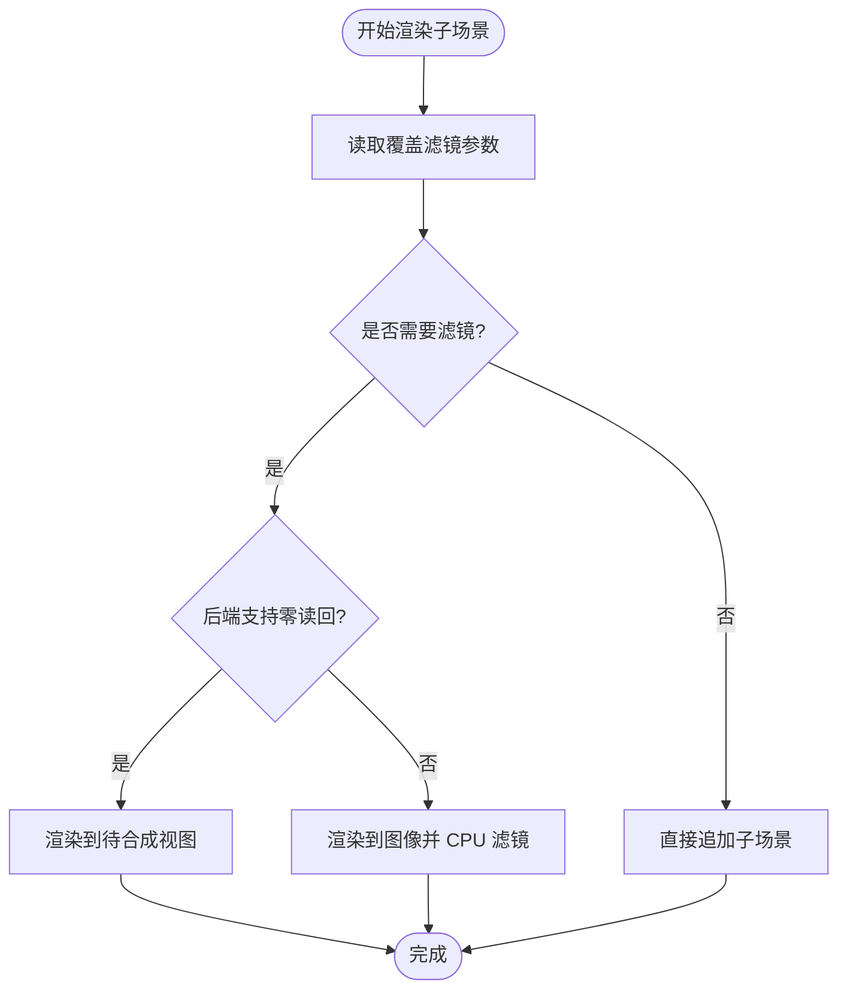
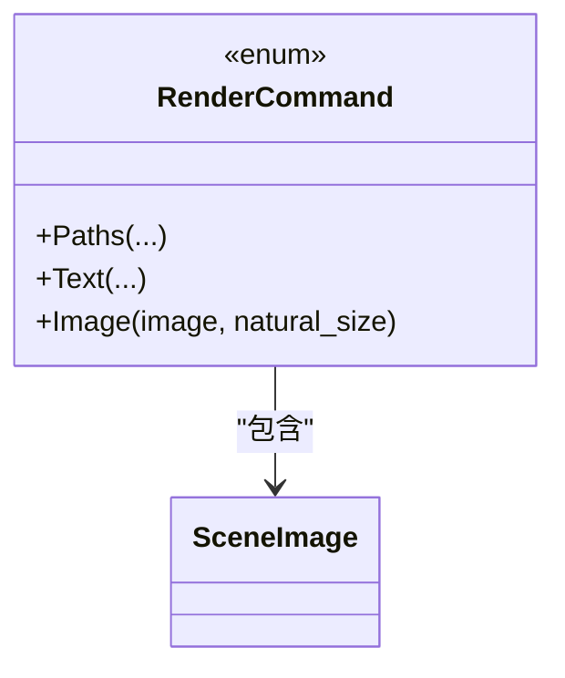
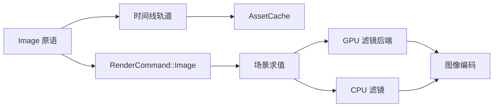

# 图像处理

<cite>
**本文引用的文件**
- [crates/animatix/src/primitives/image.rs](file://crates/animatix/src/primitives/image.rs)
- [crates/animatix/src/timeline/image.rs](file://crates/animatix/src/timeline/image.rs)
- [crates/animatix/src/timeline/assets.rs](file://crates/animatix/src/timeline/assets.rs)
- [crates/animatix/src/timeline/media.rs](file://crates/animatix/src/timeline/media.rs)
- [crates/animatix/src/timeline/scene_eval.rs](file://crates/animatix/src/timeline/scene_eval.rs)
- [crates/animatix/src/timeline/filter.rs](file://crates/animatix/src/timeline/filter.rs)
- [crates/animatix/src/renderer/filter_backend.rs](file://crates/animatix/src/renderer/filter_backend.rs)
- [crates/animatix/src/primitives/mod.rs](file://crates/animatix/src/primitives/mod.rs)
- [crates/animatix/src/timeline/mod.rs](file://crates/animatix/src/timeline/mod.rs)
- [crates/animatix/src/renderer/encode/image.rs](file://crates/animatix/src/renderer/encode/image.rs)
- [examples/08_effects.amx](file://examples/08_effects.amx)
- [examples/16_showcase.amx](file://examples/16_showcase.amx)
</cite>

## 目录
1. [简介](#简介)
2. [项目结构](#项目结构)
3. [核心组件](#核心组件)
4. [架构总览](#架构总览)
5. [详细组件分析](#详细组件分析)
6. [依赖关系分析](#依赖关系分析)
7. [性能考量](#性能考量)
8. [故障排查指南](#故障排查指南)
9. [结论](#结论)
10. [附录](#附录)

## 简介
本文件系统性梳理动画引擎中的“图像处理原语”（Image），覆盖以下主题：
- 图像加载与来源管理：本地文件、内容哈希标识、缓存机制
- 尺寸与布局：自然尺寸、半径尺寸、显示尺寸、默认属性
- 缩放与裁剪：通过尺寸与布局轨道控制实现的缩放与裁剪策略
- 透明度与滤镜：全局不透明度叠加、CPU/GPU 滤镜管线（模糊、亮度、对比度、饱和度、色相旋转、棕褐色）
- 响应式与适配：基于时间轴的关键帧与插值，结合场景维度进行自适应
- 资源管理与缓存：集中式资产缓存、零读回路径优化
- 实际用法示例：在动画中集成与处理图像素材

## 项目结构
与图像处理相关的核心模块分布如下：
- 原语层：定义 Image 原语类型、默认属性与评估流程
- 时间线层：图像轨道、媒体种子、SceneImage 数据模型、滤镜应用
- 渲染层：GPU/CPU 滤镜后端、场景合成、编码输出
- 工具与缓存：集中式 AssetCache、渲染命令枚举

**图表来源**
- [crates/animatix/src/primitives/image.rs:1-125](file://crates/animatix/src/primitives/image.rs#L1-L125)
- [crates/animatix/src/primitives/mod.rs:268-291](file://crates/animatix/src/primitives/mod.rs#L268-L291)
- [crates/animatix/src/timeline/image.rs:1-100](file://crates/animatix/src/timeline/image.rs#L1-L100)
- [crates/animatix/src/timeline/media.rs:80-115](file://crates/animatix/src/timeline/media.rs#L80-L115)
- [crates/animatix/src/timeline/assets.rs:1-38](file://crates/animatix/src/timeline/assets.rs#L1-L38)
- [crates/animatix/src/timeline/scene_eval.rs:571-618](file://crates/animatix/src/timeline/scene_eval.rs#L571-L618)
- [crates/animatix/src/timeline/filter.rs:30-67](file://crates/animatix/src/timeline/filter.rs#L30-L67)
- [crates/animatix/src/renderer/filter_backend.rs:517-855](file://crates/animatix/src/renderer/filter_backend.rs#L517-L855)
- [crates/animatix/src/renderer/encode/image.rs:1-200](file://crates/animatix/src/renderer/encode/image.rs#L1-L200)

**章节来源**
- [crates/animatix/src/primitives/image.rs:1-125](file://crates/animatix/src/primitives/image.rs#L1-L125)
- [crates/animatix/src/timeline/image.rs:1-100](file://crates/animatix/src/timeline/image.rs#L1-L100)
- [crates/animatix/src/timeline/assets.rs:1-38](file://crates/animatix/src/timeline/assets.rs#L1-L38)
- [crates/animatix/src/timeline/media.rs:80-115](file://crates/animatix/src/timeline/media.rs#L80-L115)
- [crates/animatix/src/timeline/scene_eval.rs:571-618](file://crates/animatix/src/timeline/scene_eval.rs#L571-L618)
- [crates/animatix/src/timeline/filter.rs:30-67](file://crates/animatix/src/timeline/filter.rs#L30-L67)
- [crates/animatix/src/renderer/filter_backend.rs:517-855](file://crates/animatix/src/renderer/filter_backend.rs#L517-L855)
- [crates/animatix/src/renderer/encode/image.rs:1-200](file://crates/animatix/src/renderer/encode/image.rs#L1-L200)

## 核心组件
- Image 原语：负责解析属性（位置、URL、尺寸）、从时间线轨道取图并生成渲染命令
- SceneImage：统一的图像数据载体，包含像素数据、自然尺寸与格式信息
- AssetCache：集中缓存已加载的图像与矢量路径，避免重复 IO
- 滤镜管线：CPU（基于图像库）与 GPU（基于 WGPU 着色器）双通道实现
- 渲染命令：RenderCommand::Image 将图像绘制到 Vello 场景

**章节来源**
- [crates/animatix/src/primitives/image.rs:103-125](file://crates/animatix/src/primitives/image.rs#L103-L125)
- [crates/animatix/src/timeline/image.rs:1-100](file://crates/animatix/src/timeline/image.rs#L1-L100)
- [crates/animatix/src/timeline/assets.rs:1-38](file://crates/animatix/src/timeline/assets.rs#L1-L38)
- [crates/animatix/src/timeline/filter.rs:113-210](file://crates/animatix/src/timeline/filter.rs#L113-L210)
- [crates/animatix/src/primitives/mod.rs:268-291](file://crates/animatix/src/primitives/mod.rs#L268-L291)

## 架构总览
下图展示了从原语到渲染的整体流程，以及滤镜与缓存的关键节点。

**图表来源**
- [crates/animatix/src/primitives/image.rs:103-125](file://crates/animatix/src/primitives/image.rs#L103-L125)
- [crates/animatix/src/timeline/assets.rs:31-38](file://crates/animatix/src/timeline/assets.rs#L31-L38)
- [crates/animatix/src/timeline/scene_eval.rs:571-618](file://crates/animatix/src/timeline/scene_eval.rs#L571-L618)
- [crates/animatix/src/renderer/filter_backend.rs:812-855](file://crates/animatix/src/renderer/filter_backend.rs#L812-L855)
- [crates/animatix/src/renderer/encode/image.rs:1-200](file://crates/animatix/src/renderer/encode/image.rs#L1-L200)

## 详细组件分析

### 图像原语（ImagePrimitive）
- 类型与分类：作为媒体类原语，提供默认属性（位置、URL、尺寸）
- 评估流程：根据当前时间从轨道读取图像，计算自然尺寸，生成 RenderCommand::Image
- 默认属性：位置为场景中心，尺寸默认 240×160；可通过时间轴关键帧覆盖

**图表来源**
- [crates/animatix/src/primitives/image.rs:103-125](file://crates/animatix/src/primitives/image.rs#L103-L125)

**章节来源**
- [crates/animatix/src/primitives/image.rs:1-125](file://crates/animatix/src/primitives/image.rs#L1-L125)

### 图像数据模型与加载（SceneImage 与加载函数）
- SceneImage：封装像素数据、自然尺寸与图像格式（RGBA8 Alpha）
- 加载接口：
  - load_image：按 URL 加载并返回 SceneImage
  - load_image_file：从文件路径加载并缓存
- 自然尺寸：用于布局与缩放计算的基础尺寸

**图表来源**
- [crates/animatix/src/timeline/image.rs:1-100](file://crates/animatix/src/timeline/image.rs#L1-L100)

**章节来源**
- [crates/animatix/src/timeline/image.rs:1-100](file://crates/animatix/src/timeline/image.rs#L1-L100)

### 资源管理与缓存（AssetCache）
- 缓存键：以源标识（文件路径或内容哈希）为键
- 缓存项：SVG 路径、图像、文本字形
- 行为：若未命中则加载并写入缓存，后续直接返回

**图表来源**
- [crates/animatix/src/timeline/assets.rs:31-38](file://crates/animatix/src/timeline/assets.rs#L31-L38)

**章节来源**
- [crates/animatix/src/timeline/assets.rs:1-38](file://crates/animatix/src/timeline/assets.rs#L1-L38)
- [crates/animatix/src/timeline/mod.rs:450-579](file://crates/animatix/src/timeline/mod.rs#L450-L579)

### 媒体种子与轨道填充（媒体加载）
- 种子逻辑：当媒体 URL 非空时尝试加载，失败则记录诊断
- 轨道填充：自动设置尺寸与图像关键帧，尺寸通常取自然尺寸的一半或作者指定值

**图表来源**
- [crates/animatix/src/timeline/media.rs:80-115](file://crates/animatix/src/timeline/media.rs#L80-L115)

**章节来源**
- [crates/animatix/src/timeline/media.rs:80-115](file://crates/animatix/src/timeline/media.rs#L80-L115)

### 滤镜效果与响应式处理
- 滤镜参数：blur、brightness、contrast、saturate、hue_rotate、sepia
- 应用时机：场景求值阶段根据覆盖参数与阈值判断是否需要滤镜
- GPU 优先：若后端支持零读回复合，则优先使用 GPU 路径；否则回退 CPU 读回
- 响应式：通过时间轴关键帧对滤镜参数进行插值，实现动态效果

**图表来源**
- [crates/animatix/src/timeline/scene_eval.rs:571-618](file://crates/animatix/src/timeline/scene_eval.rs#L571-L618)
- [crates/animatix/src/timeline/filter.rs:30-67](file://crates/animatix/src/timeline/filter.rs#L30-L67)
- [crates/animatix/src/renderer/filter_backend.rs:613-810](file://crates/animatix/src/renderer/filter_backend.rs#L613-L810)

**章节来源**
- [crates/animatix/src/timeline/scene_eval.rs:571-618](file://crates/animatix/src/timeline/scene_eval.rs#L571-L618)
- [crates/animatix/src/timeline/filter.rs:113-210](file://crates/animatix/src/timeline/filter.rs#L113-L210)
- [crates/animatix/src/renderer/filter_backend.rs:517-855](file://crates/animatix/src/renderer/filter_backend.rs#L517-L855)

### 渲染命令与输出
- RenderCommand::Image：携带 SceneImage 与自然尺寸，交由场景求值执行
- 输出：图像编码模块负责将最终 SceneImage 写出为静态图像或视频帧

**图表来源**
- [crates/animatix/src/primitives/mod.rs:268-291](file://crates/animatix/src/primitives/mod.rs#L268-L291)

**章节来源**
- [crates/animatix/src/primitives/mod.rs:268-291](file://crates/animatix/src/primitives/mod.rs#L268-L291)
- [crates/animatix/src/renderer/encode/image.rs:1-200](file://crates/animatix/src/renderer/encode/image.rs#L1-L200)

## 依赖关系分析
- 原语依赖时间线轨道与 AssetCache 提供的图像数据
- 场景求值依赖滤镜后端（GPU/CPU）进行滤镜处理
- 渲染后端依赖编码模块输出最终图像

**图表来源**
- [crates/animatix/src/primitives/image.rs:103-125](file://crates/animatix/src/primitives/image.rs#L103-L125)
- [crates/animatix/src/timeline/assets.rs:31-38](file://crates/animatix/src/timeline/assets.rs#L31-L38)
- [crates/animatix/src/timeline/scene_eval.rs:571-618](file://crates/animatix/src/timeline/scene_eval.rs#L571-L618)
- [crates/animatix/src/renderer/filter_backend.rs:812-855](file://crates/animatix/src/renderer/filter_backend.rs#L812-L855)
- [crates/animatix/src/renderer/encode/image.rs:1-200](file://crates/animatix/src/renderer/encode/image.rs#L1-L200)

**章节来源**
- [crates/animatix/src/primitives/image.rs:1-125](file://crates/animatix/src/primitives/image.rs#L1-L125)
- [crates/animatix/src/timeline/assets.rs:1-38](file://crates/animatix/src/timeline/assets.rs#L1-L38)
- [crates/animatix/src/timeline/scene_eval.rs:571-618](file://crates/animatix/src/timeline/scene_eval.rs#L571-L618)
- [crates/animatix/src/renderer/filter_backend.rs:517-855](file://crates/animatix/src/renderer/filter_backend.rs#L517-L855)
- [crates/animatix/src/renderer/encode/image.rs:1-200](file://crates/animatix/src/renderer/encode/image.rs#L1-L200)

## 性能考量
- 零读回路径：GPU 后端可将滤镜结果保留在纹理上，避免 CPU 读回，显著降低带宽与延迟
- 滤镜阈值：仅当滤镜参数偏离单位值超过阈值时才启用滤镜，减少不必要的开销
- 缓存复用：AssetCache 复用已加载图像，避免重复 IO
- 透明度叠加：全局不透明度与滤镜叠加时需注意顺序与代价

[本节为通用性能建议，无需特定文件引用]

## 故障排查指南
- 媒体加载失败：检查 URL 是否有效、文件是否存在、权限是否正确；查看诊断消息定位具体文件
- 滤镜无效果：确认滤镜参数是否超出阈值；检查后端是否支持零读回路径
- 尺寸异常：核对默认尺寸与作者指定尺寸；检查时间轴关键帧覆盖是否生效
- 缓存未命中：确认缓存键（路径或内容哈希）是否一致；清理缓存后重试

**章节来源**
- [crates/animatix/src/timeline/media.rs:80-115](file://crates/animatix/src/timeline/media.rs#L80-L115)
- [crates/animatix/src/timeline/scene_eval.rs:571-618](file://crates/animatix/src/timeline/scene_eval.rs#L571-L618)
- [crates/animatix/src/timeline/assets.rs:31-38](file://crates/animatix/src/timeline/assets.rs#L31-L38)

## 结论
图像原语在本引擎中通过“原语—时间线—场景求值—渲染后端”的清晰分层实现，具备完善的加载、缓存、滤镜与输出能力。其设计兼顾易用性与性能，既支持 CPU 滤镜的灵活性，也提供 GPU 零读回路径的高性能方案，并通过 AssetCache 与轨道关键帧实现高效的资源管理与响应式处理。

[本节为总结性内容，无需特定文件引用]

## 附录

### 支持的图片格式与尺寸规格
- 图片格式：通过 SceneImage 的图像数据格式字段可知使用 RGBA8 与 Alpha 透明类型，具体来源取决于加载器实现
- 尺寸规格：自然尺寸来自加载的图像；默认尺寸为 240×160；可通过属性与关键帧调整

**章节来源**
- [crates/animatix/src/timeline/image.rs:1-100](file://crates/animatix/src/timeline/image.rs#L1-L100)
- [crates/animatix/src/primitives/image.rs:118-125](file://crates/animatix/src/primitives/image.rs#L118-L125)

### 滤镜效果清单与顺序
- 支持的滤镜：模糊、亮度、对比度、饱和度、色相旋转、棕褐色
- 组合顺序：sepia → hue → saturate → contrast → brightness
- 应用方式：GPU 着色器或 CPU 图像处理

**章节来源**
- [crates/animatix/src/timeline/filter.rs:132-210](file://crates/animatix/src/timeline/filter.rs#L132-L210)
- [crates/animatix/src/renderer/filter_backend.rs:613-810](file://crates/animatix/src/renderer/filter_backend.rs#L613-L810)

### 响应式处理与适配策略
- 响应式：通过时间轴关键帧对尺寸、滤镜等属性进行插值
- 适配：根据场景维度与自然尺寸计算显示比例，确保在不同分辨率下保持一致观感

**章节来源**
- [crates/animatix/src/timeline/media.rs:80-115](file://crates/animatix/src/timeline/media.rs#L80-L115)
- [crates/animatix/src/timeline/scene_eval.rs:571-618](file://crates/animatix/src/timeline/scene_eval.rs#L571-L618)

### 资源管理与缓存机制
- 集中式缓存：AssetCache 以源标识为键缓存图像与矢量路径
- 生命周期：随 Timeline 共享，跨多个原语与场景复用
- 清理策略：当前实现未暴露显式清理接口，建议在长时间运行场景中关注内存占用

**章节来源**
- [crates/animatix/src/timeline/assets.rs:1-38](file://crates/animatix/src/timeline/assets.rs#L1-L38)
- [crates/animatix/src/timeline/mod.rs:450-579](file://crates/animatix/src/timeline/mod.rs#L450-L579)

### 实际使用示例
- 示例一：在“特效”场景中演示滤镜与图像组合
- 示例二：在“作品集”场景中展示图像的尺寸与布局动画

**章节来源**
- [examples/08_effects.amx](file://examples/08_effects.amx)
- [examples/16_showcase.amx](file://examples/16_showcase.amx)