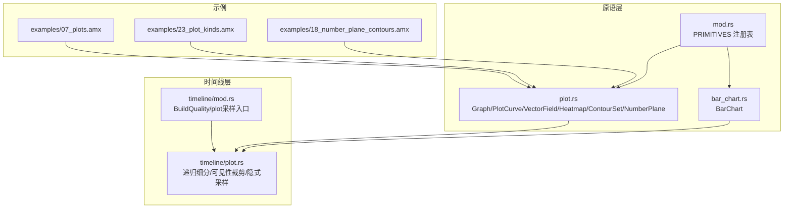
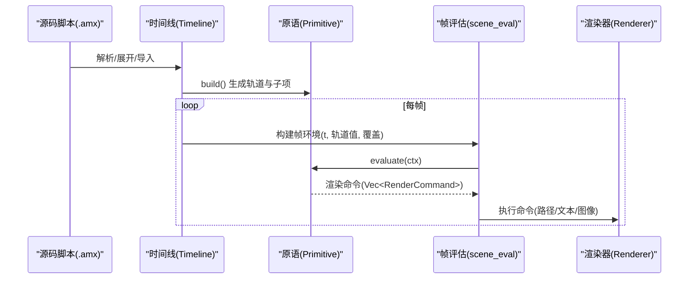
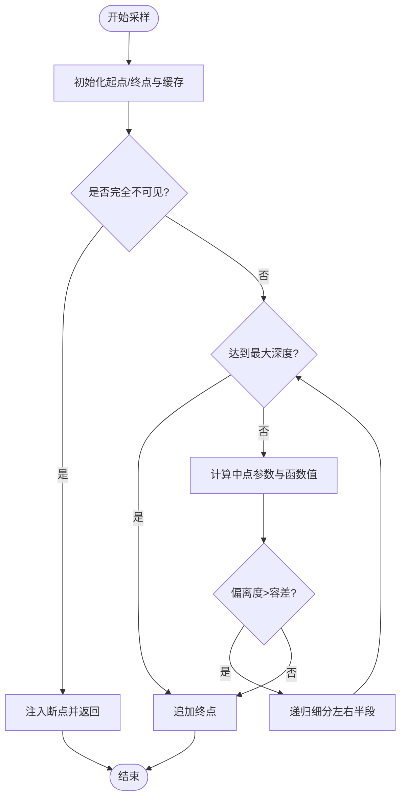
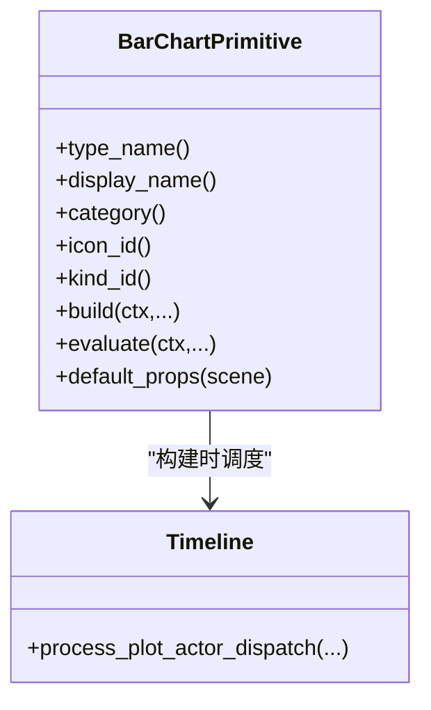
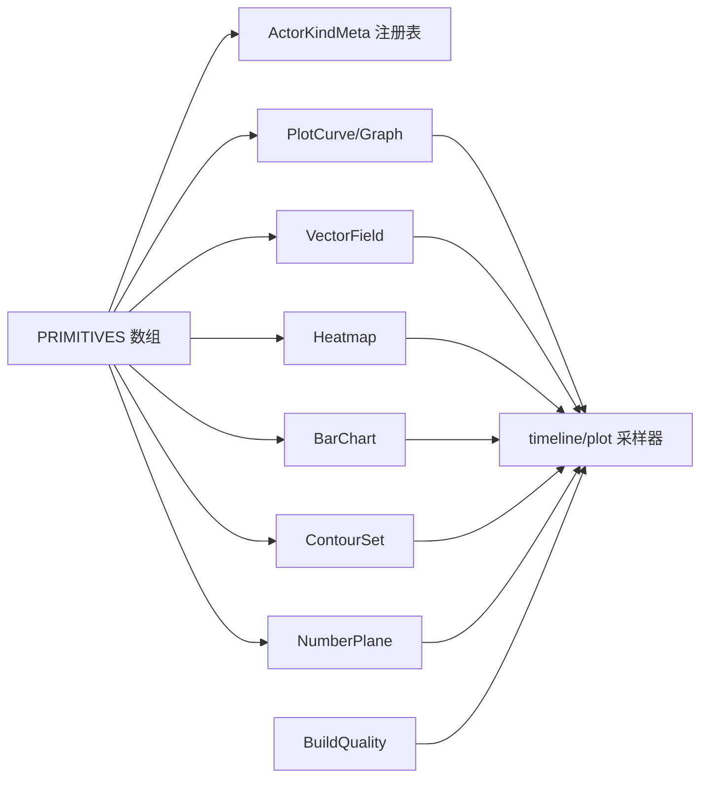

# 数据可视化

<cite>
**本文引用的文件**   
- [crates/animatix/src/primitives/mod.rs](file://crates/animatix/src/primitives/mod.rs)
- [crates/animatix/src/primitives/plot.rs](file://crates/animatix/src/primitives/plot.rs)
- [crates/animatix/src/primitives/bar_chart.rs](file://crates/animatix/src/primitives/bar_chart.rs)
- [crates/animatix/src/timeline/plot.rs](file://crates/animatix/src/timeline/plot.rs)
- [crates/animatix/src/timeline/mod.rs](file://crates/animatix/src/timeline/mod.rs)
- [examples/07_plots.amx](file://examples/07_plots.amx)
- [examples/23_plot_kinds.amx](file://examples/23_plot_kinds.amx)
- [examples/18_number_plane_contours.amx](file://examples/18_number_plane_contours.amx)
- [docs/primitives.md](file://docs/primitives.md)
</cite>

## 目录
1. [简介](#简介)
2. [项目结构](#项目结构)
3. [核心组件](#核心组件)
4. [架构总览](#架构总览)
5. [详细组件分析](#详细组件分析)
6. [依赖关系分析](#依赖关系分析)
7. [性能考量](#性能考量)
8. [故障排查指南](#故障排查指南)
9. [结论](#结论)
10. [附录](#附录)

## 简介
本文件系统性梳理 Animatix 的数据可视化原语与图表绘制能力，覆盖折线图（PlotCurve）、柱状图（BarChart）、热力图（Heatmap）、向量场（VectorField）、等高线集（ContourSet）、坐标平面（NumberPlane）等可视化元素。重点阐述：
- 数据绑定与映射：如何将数学函数或数值数据映射为视觉属性（路径、颜色、粗细）
- 坐标系与采样：笛卡尔/极坐标/参数方程/隐式曲线的自适应采样算法
- 动画化与过渡：基于时间线的关键帧与缓动，实现数据驱动的动态更新
- 使用示例与最佳实践：从简单函数绘图到复杂组合场景
- 预处理与格式化：输入域、分辨率、质量等级等参数对渲染的影响

## 项目结构
Animatix 将所有“演员类型”统一为“原语（Primitive）”，通过静态注册表集中管理元信息与构建/渲染逻辑。图表类原语位于 primitives 子模块，并在 timeline 中完成运行时采样与路径生成。

**图表来源**
- [crates/animatix/src/primitives/plot.rs:1-288](file://crates/animatix/src/primitives/plot.rs#L1-L288)
- [crates/animatix/src/primitives/bar_chart.rs:1-82](file://crates/animatix/src/primitives/bar_chart.rs#L1-L82)
- [crates/animatix/src/primitives/mod.rs:641-721](file://crates/animatix/src/primitives/mod.rs#L641-L721)
- [crates/animatix/src/timeline/plot.rs:1-812](file://crates/animatix/src/timeline/plot.rs#L1-L812)
- [crates/animatix/src/timeline/mod.rs:150-190](file://crates/animatix/src/timeline/mod.rs#L150-L190)
- [examples/07_plots.amx:1-37](file://examples/07_plots.amx#L1-L37)
- [examples/23_plot_kinds.amx:1-11](file://examples/23_plot_kinds.amx#L1-L11)
- [examples/18_number_plane_contours.amx:1-48](file://examples/18_number_plane_contours.amx#L1-L48)

**章节来源**
- [crates/animatix/src/primitives/mod.rs:18-40](file://crates/animatix/src/primitives/mod.rs#L18-L40)
- [crates/animatix/src/primitives/mod.rs:641-721](file://crates/animatix/src/primitives/mod.rs#L641-L721)
- [crates/animatix/src/timeline/mod.rs:1-200](file://crates/animatix/src/timeline/mod.rs#L1-L200)

## 核心组件
- 图表原语集合：Graph、PlotCurve、VectorField、Heatmap、ContourSet、NumberPlane、BarChart 均实现统一的 Primitive 接口，支持构建期解析与帧时间评估。
- 运行时采样器：timeline/plot 提供笛卡尔/极坐标/参数方程/隐式函数的自适应递归细分，结合可见性裁剪与断点注入，生成高质量路径。
- 质量等级：BuildQuality.Draft/Preview/Production 在构建期缩放容差、最大深度与分辨率，平衡交互流畅度与导出质量。
- 默认属性与外观：各原语提供默认位置、尺寸、坐标域与函数闭包，便于快速上手。

**章节来源**
- [crates/animatix/src/primitives/plot.rs:1-288](file://crates/animatix/src/primitives/plot.rs#L1-L288)
- [crates/animatix/src/primitives/bar_chart.rs:1-82](file://crates/animatix/src/primitives/bar_chart.rs#L1-L82)
- [crates/animatix/src/timeline/plot.rs:1-812](file://crates/animatix/src/timeline/plot.rs#L1-L812)
- [crates/animatix/src/timeline/mod.rs:150-190](file://crates/animatix/src/timeline/mod.rs#L150-L190)

## 架构总览
下图展示从源码声明到最终渲染命令的端到端流程：解析与构建阶段生成时间线与属性轨道；帧评估阶段按时间采样轨道值，调用原语 evaluate 生成渲染命令，再由渲染后端执行。

**图表来源**
- [crates/animatix/src/primitives/mod.rs:621-639](file://crates/animatix/src/primitives/mod.rs#L621-L639)
- [crates/animatix/src/timeline/mod.rs:1-200](file://crates/animatix/src/timeline/mod.rs#L1-L200)

## 详细组件分析

### 折线图（PlotCurve）
- 类型与用途：在 Graph 容器内绘制数学函数曲线，支持笛卡尔、极坐标、参数方程与隐式函数四种模式。
- 数据绑定与映射：
  - 函数闭包接收参数（如 x 或 t），返回 y（笛卡尔）或二维向量（参数方程）或 r（极坐标）。
  - 输入域（x_domain/y_domain 或 t_domain）决定屏幕空间映射范围。
  - 容差（tolerance）、最大深度（max_depth）控制采样精度；分辨率（resolution）影响隐式采样栅格密度。
- 坐标系与采样：
  - 自适应递归中点细分：比较实际函数值与线性插值，超过阈值则继续细分。
  - 可见性裁剪：超出屏幕边缘的段落注入断点，避免无效计算。
  - 断点处理：用于处理间断、渐近线等异常情况。
- 动画化：通过时间线轨道随时间变化的 color、stroke_width、func 参数实现动态曲线。

**图表来源**
- [crates/animatix/src/timeline/plot.rs:65-177](file://crates/animatix/src/timeline/plot.rs#L65-L177)
- [crates/animatix/src/timeline/plot.rs:179-288](file://crates/animatix/src/timeline/plot.rs#L179-L288)
- [crates/animatix/src/timeline/plot.rs:290-400](file://crates/animatix/src/timeline/plot.rs#L290-L400)

**章节来源**
- [crates/animatix/src/primitives/plot.rs:14-120](file://crates/animatix/src/primitives/plot.rs#L14-L120)
- [crates/animatix/src/timeline/plot.rs:591-610](file://crates/animatix/src/timeline/plot.rs#L591-L610)
- [crates/animatix/src/timeline/plot.rs:613-800](file://crates/animatix/src/timeline/plot.rs#L613-L800)
- [docs/primitives.md:263-307](file://docs/primitives.md#L263-L307)
- [examples/07_plots.amx:7-10](file://examples/07_plots.amx#L7-L10)
- [examples/23_plot_kinds.amx:6-10](file://examples/23_plot_kinds.amx#L6-L10)

### 柱状图（BarChart）
- 类型与用途：以矩形条呈现离散分组的数值大小，适合分类数据对比。
- 数据绑定与映射：通过子项定义类别与高度，颜色与边距由主题与轨道控制。
- 动画化：可对尺寸、颜色、排序进行关键帧动画，实现动态柱状图更新。

**图表来源**
- [crates/animatix/src/primitives/bar_chart.rs:1-82](file://crates/animatix/src/primitives/bar_chart.rs#L1-L82)

**章节来源**
- [crates/animatix/src/primitives/bar_chart.rs:1-82](file://crates/animatix/src/primitives/bar_chart.rs#L1-L82)
- [crates/animatix/src/primitives/mod.rs:181-182](file://crates/animatix/src/primitives/mod.rs#L181-L182)

### 热力图（Heatmap）
- 类型与用途：在二维平面上根据标量函数值着色，常用于密度或强度分布。
- 数据绑定与映射：func(x,y) 返回标量，颜色采用“热点”方案并通过 alpha 映射标量幅度。
- 分辨率与质量：resolution 控制栅格采样密度；BuildQuality 缩放分辨率以平衡性能与质量。

**章节来源**
- [crates/animatix/src/primitives/plot.rs:219-240](file://crates/animatix/src/primitives/plot.rs#L219-L240)
- [docs/primitives.md:263-307](file://docs/primitives.md#L263-L307)
- [examples/07_plots.amx:14-14](file://examples/07_plots.amx#L14-L14)

### 向量场（VectorField）
- 类型与用途：在二维平面上绘制方向场，每个点给出切向量（dx, dy）。
- 数据绑定与映射：func(x,y) 返回二维向量，密度控制采样点网格；颜色与线宽由轨道控制。
- 动画化：可随时间改变密度、颜色与函数表达式，实现动态流场。

**章节来源**
- [crates/animatix/src/primitives/plot.rs:150-175](file://crates/animatix/src/primitives/plot.rs#L150-L175)
- [examples/07_plots.amx:12-12](file://examples/07_plots.amx#L12-L12)

### 等高线集（ContourSet）与坐标平面（NumberPlane）
- ContourSet：绘制标量函数的若干等值线，levels 指定等值集合；resolution 控制采样网格。
- NumberPlane：独立的网格背景，提供自动刻度、轴线与网格，作为其他图表的底板。
- 组合使用：先放置 NumberPlane 作为背景，再叠加 ContourSet/VectorField/Heatmap 形成复合可视化。

**章节来源**
- [crates/animatix/src/primitives/plot.rs:276-288](file://crates/animatix/src/primitives/plot.rs#L276-L288)
- [docs/primitives.md:271-307](file://docs/primitives.md#L271-L307)
- [examples/18_number_plane_contours.amx:8-27](file://examples/18_number_plane_contours.amx#L8-L27)

## 依赖关系分析
- 原语注册：PRIMITIVES 数组集中注册所有原语，确保元信息与派发一致。
- 时间线集成：各图表原语在 build 阶段通过 process_plot_actor_dispatch 将声明转换为内部表示；evaluate 阶段输出渲染命令。
- 采样算法：timeline/plot 提供统一的递归细分与隐式采样实现，被多种原语共享。
- 质量策略：BuildQuality.scale_plot_params 在构建期调整容差/深度/分辨率，影响最终路径质量。

**图表来源**
- [crates/animatix/src/primitives/mod.rs:641-721](file://crates/animatix/src/primitives/mod.rs#L641-L721)
- [crates/animatix/src/timeline/plot.rs:1-812](file://crates/animatix/src/timeline/plot.rs#L1-L812)
- [crates/animatix/src/timeline/mod.rs:150-190](file://crates/animatix/src/timeline/mod.rs#L150-L190)

**章节来源**
- [crates/animatix/src/primitives/mod.rs:641-721](file://crates/animatix/src/primitives/mod.rs#L641-L721)
- [crates/animatix/src/timeline/mod.rs:150-190](file://crates/animatix/src/timeline/mod.rs#L150-L190)

## 性能考量
- 自适应采样：仅在曲线显著弯曲处增加采样点，避免平坦区域的冗余计算。
- 可见性裁剪：将完全不可见的段落以断点分隔，减少后续路径处理成本。
- 质量等级：Draft/Preview/Production 三档参数缩放，交互编辑优先保证帧率，导出阶段提升精度。
- 隐式采样：栅格化评估函数值，再通过等值线穿墙算法连接断续段，兼顾效率与正确性。

**章节来源**
- [crates/animatix/src/timeline/plot.rs:1-812](file://crates/animatix/src/timeline/plot.rs#L1-L812)
- [crates/animatix/src/timeline/mod.rs:150-190](file://crates/animatix/src/timeline/mod.rs#L150-L190)

## 故障排查指南
- 曲线不连续或出现错误连线：检查函数是否存在间断（如除零、根号负数）；必要时在表达式中引入断点或分段定义。
- 性能过低：降低分辨率（resolution）、提高容差（tolerance）、减小最大深度（max_depth）；在 Draft 模式下调试，Production 导出前再切换。
- 颜色/透明度异常：确认 color 与 stroke_width 的轨道关键帧设置；注意 alpha 通道与叠加顺序。
- 坐标域不匹配：核对 x_domain/y_domain 与 size 的比例关系，避免数值溢出或截断。

[本节为通用指导，无需特定文件引用]

## 结论
Animatix 的可视化原语以统一的 Primitive 接口与时间线系统为基础，结合自适应采样与质量等级策略，在交互与导出之间取得良好平衡。通过清晰的数据绑定与动画化机制，用户可以快速构建从基础函数曲线到复杂组合图表的可视化内容。

[本节为总结，无需特定文件引用]

## 附录

### 使用示例与最佳实践
- 基础折线图与多曲线叠加：参考示例脚本中的 Graph + 多个 PlotCurve，演示不同函数与样式叠加。
- 极坐标/参数方程/隐式曲线：使用 PlotCurve 的 kind 属性切换模式，配合合适的输入域与分辨率。
- 向量场与热力图：在相同坐标域下叠加 VectorField 与 Heatmap，形成动态场与密度的复合视图。
- 等高线与网格背景：先放置 NumberPlane 作为底板，再叠加 ContourSet/VectorField/Heatmap，实现专业级科技风图表。
- 动画化技巧：对 color、stroke_width、size、func 等属性添加关键帧与缓动，实现数据过渡与强调。

**章节来源**
- [examples/07_plots.amx:1-37](file://examples/07_plots.amx#L1-L37)
- [examples/23_plot_kinds.amx:1-11](file://examples/23_plot_kinds.amx#L1-L11)
- [examples/18_number_plane_contours.amx:1-48](file://examples/18_number_plane_contours.amx#L1-L48)

### 数据预处理与格式化要求
- 函数签名：PlotCurve 的 func 应与 kind 匹配（如笛卡尔需单参，参数方程返回二元向量）。
- 输入域与输出域：确保函数在输入域内有定义且输出在合理范围内，避免 NaN/Inf 导致路径断裂。
- 分辨率与容差：resolution 与 tolerance/max_depth 需权衡渲染质量与性能；Draft 下可适当放宽。
- 颜色方案：优先使用内置 colorscheme 键位，保持整体风格一致。

**章节来源**
- [docs/primitives.md:263-307](file://docs/primitives.md#L263-L307)
- [crates/animatix/src/timeline/mod.rs:150-190](file://crates/animatix/src/timeline/mod.rs#L150-L190)