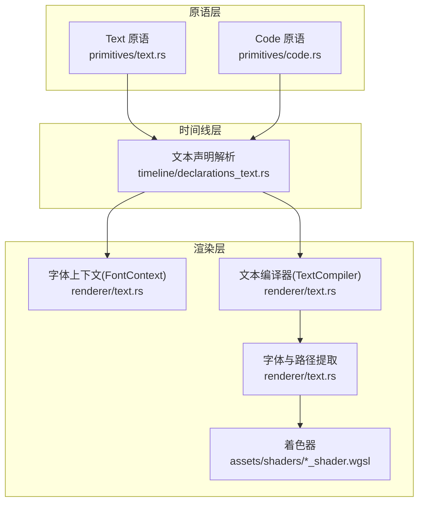
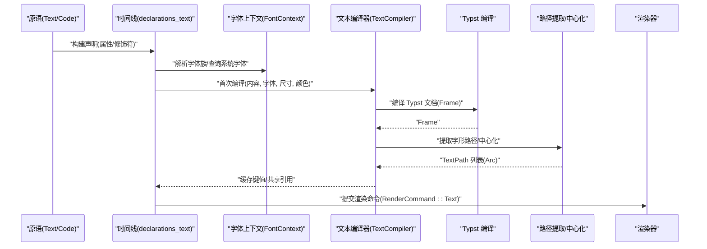
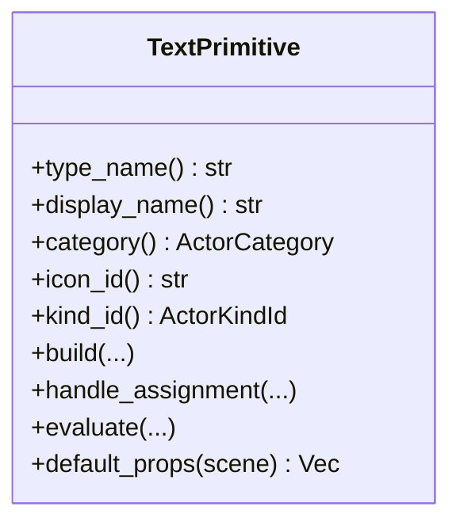
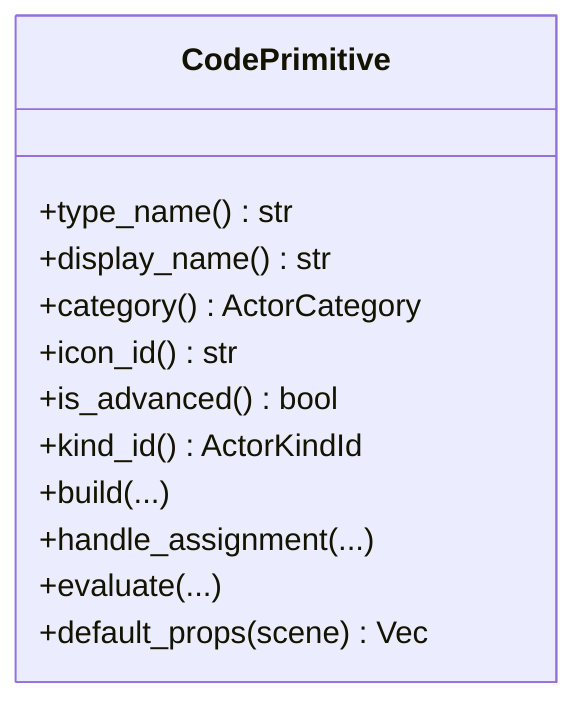
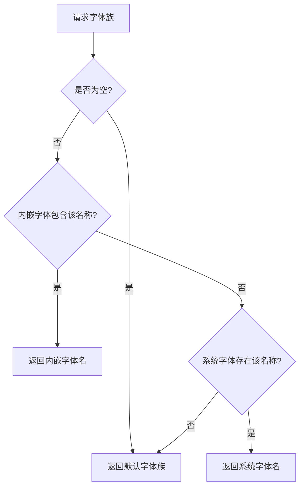
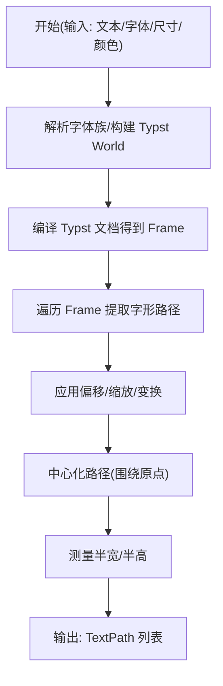
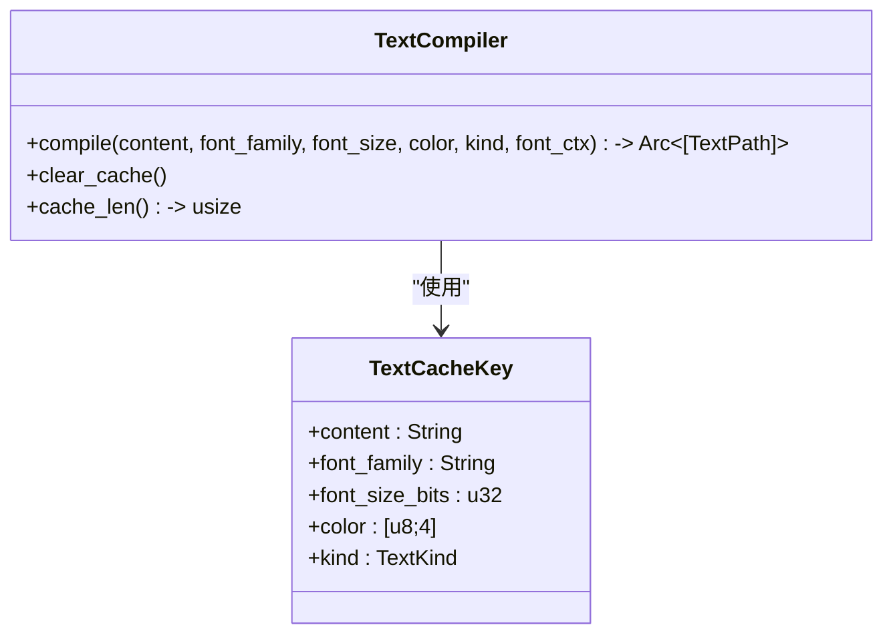
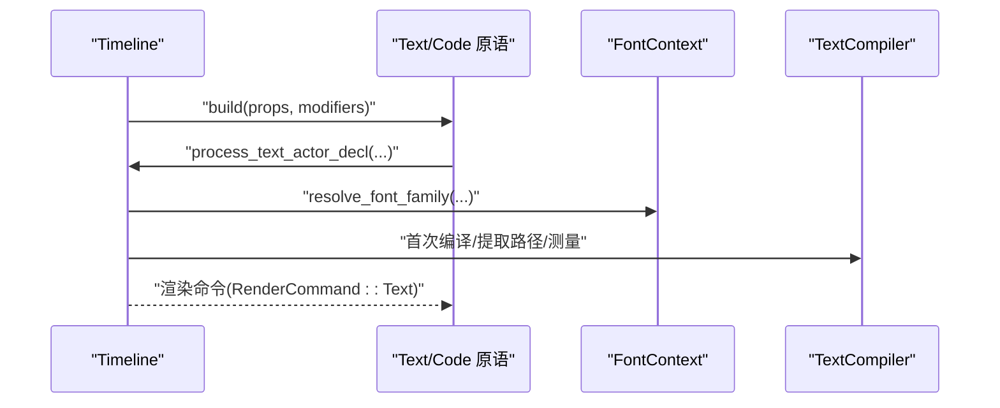
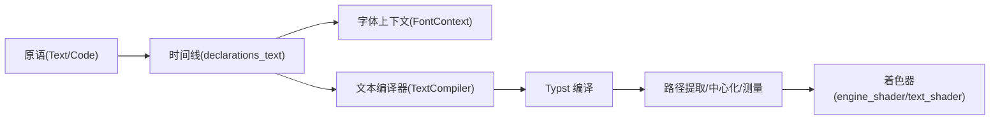

# 文本与代码显示

<cite>
**本文引用的文件**
- [crates/animatix/src/primitives/text.rs](file://crates/animatix/src/primitives/text.rs)
- [crates/animatix/src/primitives/code.rs](file://crates/animatix/src/primitives/code.rs)
- [crates/animatix/src/renderer/text.rs](file://crates/animatix/src/renderer/text.rs)
- [crates/animatix/src/timeline/declarations_text.rs](file://crates/animatix/src/timeline/declarations_text.rs)
- [crates/animatix/assets/shaders/text_shader.wgsl](file://crates/animatix/assets/shaders/text_shader.wgsl)
- [crates/animatix/assets/shaders/engine_shader.wgsl](file://crates/animatix/assets/shaders/engine_shader.wgsl)
- [examples/01_shapes.amx](file://examples/01_shapes.amx)
- [docs/spec.md](file://docs/spec.md)
</cite>

## 目录
1. [简介](#简介)
2. [项目结构](#项目结构)
3. [核心组件](#核心组件)
4. [架构总览](#架构总览)
5. [组件详解](#组件详解)
6. [依赖关系分析](#依赖关系分析)
7. [性能考量](#性能考量)
8. [故障排查指南](#故障排查指南)
9. [结论](#结论)
10. [附录：使用示例](#附录使用示例)

## 简介
本文件系统性地介绍文本与代码显示原语的设计与实现，覆盖以下方面：
- 文本原语（Text）的功能特性：字体管理、颜色、尺寸、位置与布局、默认属性等
- 代码原语（Code）的语法高亮与主题化能力：基于 Typst 的代码块渲染与字体选择
- 字体资源管理：本地字体扫描、系统字体查询、内嵌字体与回退策略
- 渲染管线：从声明到编译、提取路径、中心化与测量、缓存与批量复用
- 性能优化：字体缓存、运行时重编译缓存、共享引用计数减少拷贝
- 实际使用示例：如何在场景中创建标题、正文、数学公式与代码片段

## 项目结构
文本与代码显示相关的关键模块分布如下：
- 原语层：定义 Text 与 Code 两类原语，负责构建期声明解析与渲染命令生成
- 时间线层：解析文本类声明，填充轨道属性（内容、字体、尺寸、颜色、位置），并进行首次编译
- 渲染层：字体上下文、Typst 集成、路径提取、缓存与测量、着色器集成
- 示例与规范：示例场景展示用法；规范文档说明 Typst 数学语法差异

图表来源
- [crates/animatix/src/primitives/text.rs:15-121](file://crates/animatix/src/primitives/text.rs#L15-L121)
- [crates/animatix/src/primitives/code.rs:15-122](file://crates/animatix/src/primitives/code.rs#L15-L122)
- [crates/animatix/src/timeline/declarations_text.rs:69-422](file://crates/animatix/src/timeline/declarations_text.rs#L69-L422)
- [crates/animatix/src/renderer/text.rs:17-622](file://crates/animatix/src/renderer/text.rs#L17-L622)
- [crates/animatix/assets/shaders/text_shader.wgsl](file://crates/animatix/assets/shaders/text_shader.wgsl)
- [crates/animatix/assets/shaders/engine_shader.wgsl](file://crates/animatix/assets/shaders/engine_shader.wgsl)

章节来源
- [crates/animatix/src/primitives/text.rs:15-121](file://crates/animatix/src/primitives/text.rs#L15-L121)
- [crates/animatix/src/primitives/code.rs:15-122](file://crates/animatix/src/primitives/code.rs#L15-L122)
- [crates/animatix/src/timeline/declarations_text.rs:69-422](file://crates/animatix/src/timeline/declarations_text.rs#L69-L422)
- [crates/animatix/src/renderer/text.rs:17-622](file://crates/animatix/src/renderer/text.rs#L17-L622)

## 核心组件
- Text 原语：用于普通文本与数学表达式（通过 Typst 渲染），支持字体族、字号、颜色、位置等属性
- Code 原语：用于代码块渲染，具备语法高亮与主题化能力，适合展示源码片段
- 字体上下文（FontContext）：封装 fontdb 数据库，避免重复扫描系统字体，提供字体查询与可用字体列表
- 文本编译器（TextCompiler）：运行时按需编译文本为路径集合，采用 LRU 风格缓存与共享引用计数
- 路径提取与测量：从 Typst Frame 中提取字形路径，进行中心化与包围盒测量，便于布局与定位

章节来源
- [crates/animatix/src/primitives/text.rs:15-121](file://crates/animatix/src/primitives/text.rs#L15-L121)
- [crates/animatix/src/primitives/code.rs:15-122](file://crates/animatix/src/primitives/code.rs#L15-L122)
- [crates/animatix/src/renderer/text.rs:17-622](file://crates/animatix/src/renderer/text.rs#L17-L622)

## 架构总览
文本与代码显示的端到端流程如下：
- 原语构建阶段：Text/Code 原语将声明交由时间线解析，填充轨道属性与初始文本路径
- 字体与世界构建：根据请求的字体族与可用字体，构建 Typst World 并编译文档
- 路径提取：遍历 Frame，提取字形曲线并应用变换、缩放与平移
- 缓存与复用：TextCompiler 对相同输入进行缓存，命中时返回共享引用，避免重复克隆
- 渲染：将 TextPath 传递给渲染管线，结合着色器完成绘制

图表来源
- [crates/animatix/src/timeline/declarations_text.rs:350-422](file://crates/animatix/src/timeline/declarations_text.rs#L350-L422)
- [crates/animatix/src/renderer/text.rs:115-356](file://crates/animatix/src/renderer/text.rs#L115-L356)
- [crates/animatix/src/renderer/text.rs:542-621](file://crates/animatix/src/renderer/text.rs#L542-L621)

## 组件详解

### Text 原语
- 类别与标识：属于文本类别，图标与种类 ID 指向文本
- 构建流程：将声明交给时间线处理，解析属性与修饰符，记录初始文本路径与尺寸
- 运行时赋值：当 text/latex/math/code 属性变化时，触发重新编译与缓存更新
- 默认属性：居中位置、默认文本内容、默认字号
- 渲染输出：生成包含文本路径的渲染命令

图表来源
- [crates/animatix/src/primitives/text.rs:15-121](file://crates/animatix/src/primitives/text.rs#L15-L121)

章节来源
- [crates/animatix/src/primitives/text.rs:15-121](file://crates/animatix/src/primitives/text.rs#L15-L121)

### Code 原语
- 类别与标识：属于文本类别，高级原语，种类 ID 指向 Code
- 构建流程：与 Text 类似，但默认字号更小，适合代码块
- 运行时赋值：同样支持 text/latex/math/code 属性变更触发重编译
- 渲染输出：以 Code 模式编译，路径提取后提交渲染命令

图表来源
- [crates/animatix/src/primitives/code.rs:15-122](file://crates/animatix/src/primitives/code.rs#L15-L122)

章节来源
- [crates/animatix/src/primitives/code.rs:15-122](file://crates/animatix/src/primitives/code.rs#L15-L122)

### 字体资源管理
- FontContext：封装 fontdb，避免重复扫描系统字体；提供字体查询、可用字体列表与字体数据读取
- 内嵌字体：在构建时将指定字体打包进二进制，保证离线可用
- 字体解析：优先匹配内嵌字体，其次查询系统字体，最后回退到默认字体族
- 可用字体接口：汇总内嵌与系统字体，排序去重供上层使用

图表来源
- [crates/animatix/src/renderer/text.rs:147-165](file://crates/animatix/src/renderer/text.rs#L147-L165)
- [crates/animatix/src/renderer/text.rs:115-142](file://crates/animatix/src/renderer/text.rs#L115-L142)

章节来源
- [crates/animatix/src/renderer/text.rs:17-176](file://crates/animatix/src/renderer/text.rs#L17-L176)

### 文本编译与路径提取
- 编译入口：针对不同文本类型（纯文本、数学、代码、Typst）分别构造 Typst 源码并编译
- 路径提取：遍历 Frame，提取字形轮廓为 BezPath，并应用字符偏移、缩放与整体变换
- 中心化与测量：计算包围盒并平移至原点，便于布局系统按中心对齐
- 测量：返回半宽与半高，用于布局与碰撞检测

图表来源
- [crates/animatix/src/renderer/text.rs:293-417](file://crates/animatix/src/renderer/text.rs#L293-L417)

章节来源
- [crates/animatix/src/renderer/text.rs:293-417](file://crates/animatix/src/renderer/text.rs#L293-L417)

### 运行时文本重编译与缓存
- TextKind：区分文本类型（Text/Code/Typst/Math）
- TextCacheKey：以内容、字体族、字号位表示、颜色 RGBA、类型为键，避免 f32 直接哈希
- TextCompiler：LRU 风格缓存，命中返回共享 Arc 引用，未命中则编译并插入缓存；超过阈值时淘汰一半条目
- 与时间线协作：在属性变更时触发重编译，保持缓存一致性

图表来源
- [crates/animatix/src/renderer/text.rs:518-621](file://crates/animatix/src/renderer/text.rs#L518-L621)

章节来源
- [crates/animatix/src/renderer/text.rs:518-621](file://crates/animatix/src/renderer/text.rs#L518-L621)

### 时间线中的文本声明解析
- 支持三种声明类型：Text、Code、Typst；Math 已弃用，建议改用 Typst
- 解析属性：内容、字体族、字号、颜色、位置绑定（at/anchor/offset）、通用属性通过属性引擎写入轨道
- 首次编译：根据类型调用对应编译函数，提取路径并测量尺寸，写入轨道的 text_paths、size、layout_size
- 运行时重编译：当颜色或其它属性变化时，委托 TextCompiler 重编译并更新缓存

图表来源
- [crates/animatix/src/timeline/declarations_text.rs:350-422](file://crates/animatix/src/timeline/declarations_text.rs#L350-L422)
- [crates/animatix/src/primitives/text.rs:22-50](file://crates/animatix/src/primitives/text.rs#L22-L50)
- [crates/animatix/src/primitives/code.rs:23-51](file://crates/animatix/src/primitives/code.rs#L23-L51)

章节来源
- [crates/animatix/src/timeline/declarations_text.rs:69-422](file://crates/animatix/src/timeline/declarations_text.rs#L69-L422)

## 依赖关系分析
- 原语依赖时间线：Text/Code 原语通过时间线解析声明、写入轨道、触发首次编译
- 时间线依赖渲染层：字体解析、编译函数、路径提取与测量
- 渲染层依赖外部库：fontdb（字体扫描）、ttf-parser（轮廓提取）、typst（排版与编译）
- 渲染层依赖着色器：将 TextPath 传入着色器进行栅格化

图表来源
- [crates/animatix/src/primitives/text.rs:15-121](file://crates/animatix/src/primitives/text.rs#L15-L121)
- [crates/animatix/src/primitives/code.rs:15-122](file://crates/animatix/src/primitives/code.rs#L15-L122)
- [crates/animatix/src/timeline/declarations_text.rs:69-422](file://crates/animatix/src/timeline/declarations_text.rs#L69-L422)
- [crates/animatix/src/renderer/text.rs:17-622](file://crates/animatix/src/renderer/text.rs#L17-L622)
- [crates/animatix/assets/shaders/text_shader.wgsl](file://crates/animatix/assets/shaders/text_shader.wgsl)
- [crates/animatix/assets/shaders/engine_shader.wgsl](file://crates/animatix/assets/shaders/engine_shader.wgsl)

章节来源
- [crates/animatix/src/renderer/text.rs:17-622](file://crates/animatix/src/renderer/text.rs#L17-L622)

## 性能考量
- 字体缓存：FontContext 复用 fontdb 数据库，避免重复扫描系统字体
- 文本路径缓存：TextCompiler 使用 HashMap 缓存编译结果，命中返回共享 Arc 引用，显著降低内存与 CPU 开销
- 缓存淘汰：当缓存条目超过阈值时，淘汰约一半条目，防止内存无限增长
- 批量渲染：TextPath 作为共享引用传递，减少复制成本
- 字体回退：内嵌字体与默认字体确保在无系统字体时仍可渲染

章节来源
- [crates/animatix/src/renderer/text.rs:17-85](file://crates/animatix/src/renderer/text.rs#L17-L85)
- [crates/animatix/src/renderer/text.rs:542-621](file://crates/animatix/src/renderer/text.rs#L542-L621)

## 故障排查指南
- 数学语法差异：Math 原语已弃用，请使用 Typst 并通过 content 属性传入数学表达式；Typst 与 LaTeX 语法有显著差异
- 字体不可用：若请求的字体不存在，将回退到默认字体；可通过 available_font_families 查询可用字体列表
- 颜色解析失败：检查颜色表达式是否合法；auto 颜色需要配色方案支持自动分配
- 位置与锚点：确保 at/anchor/offset 表达式在当前时间点可求值
- 运行时重编译错误：当属性变更导致重编译失败时，查看诊断信息并确认内容、字体与颜色参数有效

章节来源
- [crates/animatix/src/timeline/declarations_text.rs:369-420](file://crates/animatix/src/timeline/declarations_text.rs#L369-L420)
- [crates/animatix/src/renderer/text.rs:147-165](file://crates/animatix/src/renderer/text.rs#L147-L165)
- [docs/spec.md:1136-1158](file://docs/spec.md#L1136-L1158)

## 结论
文本与代码显示原语通过 Typst 排版引擎实现了高质量的文本渲染，配合字体上下文与运行时编译缓存，在保证灵活性的同时兼顾性能。Text/Code 原语统一接入时间线与渲染管线，支持动态属性变更与高效复用。建议在复杂场景中充分利用缓存与默认字体回退策略，确保跨平台一致性与稳定性。

## 附录：使用示例
- 标题与正文：在网格布局中使用 Text 原语设置文本内容与字号
- 数学公式：使用 Text 原语并传入数学表达式，或改用 Typst 原语
- 代码片段：使用 Code 原语展示源码，适合演示编程语言或伪代码

章节来源
- [examples/01_shapes.amx:6-18](file://examples/01_shapes.amx#L6-L18)