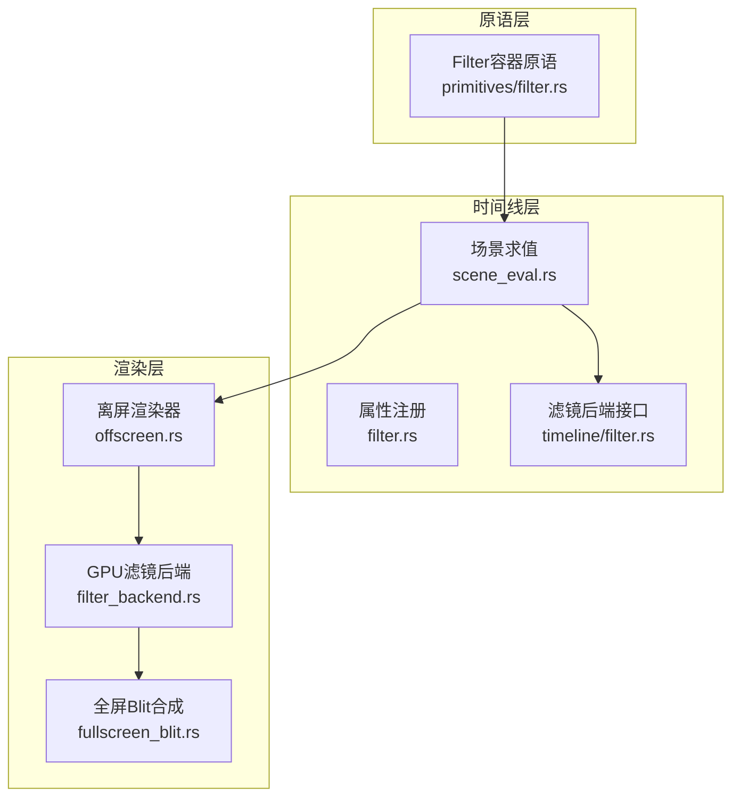
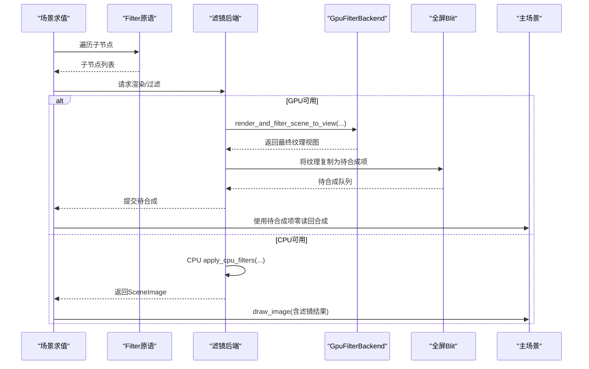
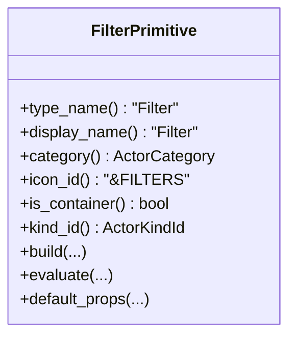
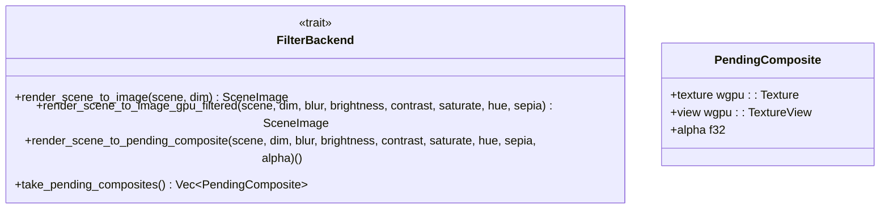
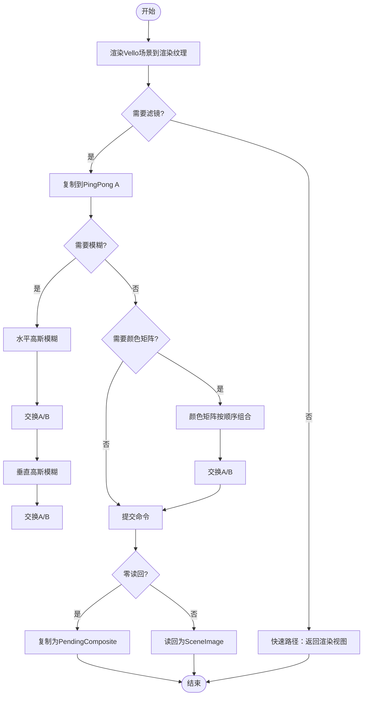
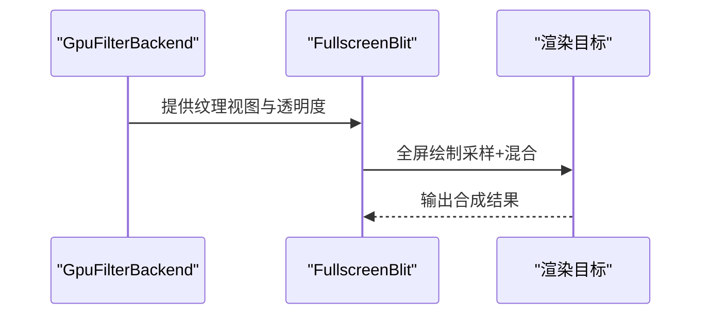
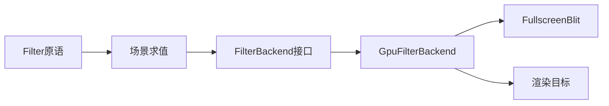

# 滤镜效果

<cite>
**本文引用的文件**
- [crates/animatix/src/primitives/filter.rs](file://crates/animatix/src/primitives/filter.rs)
- [crates/animatix/src/timeline/filter.rs](file://crates/animatix/src/timeline/filter.rs)
- [crates/animatix/src/renderer/filter_backend.rs](file://crates/animatix/src/renderer/filter_backend.rs)
- [crates/animatix/src/renderer/fullscreen_blit.rs](file://crates/animatix/src/renderer/fullscreen_blit.rs)
- [crates/animatix/src/renderer/offscreen.rs](file://crates/animatix/src/renderer/offscreen.rs)
- [crates/animatix/src/timeline/scene_eval.rs](file://crates/animatix/src/timeline/scene_eval.rs)
- [crates/animatix/assets/shaders/engine_shader.wgsl](file://crates/animatix/assets/shaders/engine_shader.wgsl)
- [crates/animatix/src/timeline/property_registry.rs](file://crates/animatix/src/timeline/property_registry.rs)
</cite>

## 目录
1. [简介](#简介)
2. [项目结构](#项目结构)
3. [核心组件](#核心组件)
4. [架构总览](#架构总览)
5. [详细组件分析](#详细组件分析)
6. [依赖关系分析](#依赖关系分析)
7. [性能考量](#性能考量)
8. [故障排查指南](#故障排查指南)
9. [结论](#结论)
10. [附录](#附录)

## 简介
本文件系统性阐述 Animatix 的滤镜效果体系，覆盖以下方面：
- 支持的视觉效果：阴影、模糊、发光、色彩调整（亮度、对比度、饱和度、色相旋转、暖褐色（sephia））、扭曲（通过容器与变换组合实现）
- 叠加机制与执行顺序：CPU 路径为“高斯模糊 → 颜色矩阵”，GPU 路径一致但以计算着色器替代 CPU 处理
- GPU 加速渲染：基于 WGSL 计算着色器的模糊与颜色矩阵管线，配合零读回合成路径
- 参数配置与使用示例：滤镜属性在属性注册表中的默认值与取值范围
- 性能优化：缓存与批处理策略、零读回合成、Ping-Pong 纹理减少内存占用
- 自定义滤镜扩展：FilterBackend 接口与 GpuFilterBackend 实现
- 在不同原语上的应用：Filter 容器原语对子树进行统一后处理

## 项目结构
滤镜系统由“时间线层（属性与后处理）+ 渲染层（CPU/GPU 后处理 + 合成）”构成，核心文件如下：
- 时间线层
  - 滤镜后端接口与 CPU 后处理：[crates/animatix/src/timeline/filter.rs](file://crates/animatix/src/timeline/filter.rs)
  - 属性注册与默认值：[crates/animatix/src/timeline/property_registry.rs](file://crates/animatix/src/timeline/property_registry.rs)
  - 场景求值中对 Filter 原语的处理：[crates/animatix/src/timeline/scene_eval.rs](file://crates/animatix/src/timeline/scene_eval.rs)
- 渲染层
  - GPU 滤镜后端与计算管线：[crates/animatix/src/renderer/filter_backend.rs](file://crates/animatix/src/renderer/filter_backend.rs)
  - 全屏纹理 Blit 合成（零读回）：[crates/animatix/src/renderer/fullscreen_blit.rs](file://crates/animatix/src/renderer/fullscreen_blit.rs)
  - 离屏渲染器与滤镜后端集成：[crates/animatix/src/renderer/offscreen.rs](file://crates/animatix/src/renderer/offscreen.rs)
- 原语层
  - Filter 容器原语：[crates/animatix/src/primitives/filter.rs](file://crates/animatix/src/primitives/filter.rs)
- 着色器
  - 引擎着色器（非滤镜，但与渲染管线相关）：[crates/animatix/assets/shaders/engine_shader.wgsl](file://crates/animatix/assets/shaders/engine_shader.wgsl)

**图表来源**
- [crates/animatix/src/timeline/filter.rs](file://crates/animatix/src/timeline/filter.rs)
- [crates/animatix/src/timeline/scene_eval.rs](file://crates/animatix/src/timeline/scene_eval.rs)
- [crates/animatix/src/renderer/offscreen.rs](file://crates/animatix/src/renderer/offscreen.rs)
- [crates/animatix/src/renderer/filter_backend.rs](file://crates/animatix/src/renderer/filter_backend.rs)
- [crates/animatix/src/renderer/fullscreen_blit.rs](file://crates/animatix/src/renderer/fullscreen_blit.rs)
- [crates/animatix/src/primitives/filter.rs](file://crates/animatix/src/primitives/filter.rs)

**章节来源**
- [crates/animatix/src/timeline/filter.rs](file://crates/animatix/src/timeline/filter.rs)
- [crates/animatix/src/timeline/property_registry.rs](file://crates/animatix/src/timeline/property_registry.rs)
- [crates/animatix/src/timeline/scene_eval.rs](file://crates/animatix/src/timeline/scene_eval.rs)
- [crates/animatix/src/renderer/filter_backend.rs](file://crates/animatix/src/renderer/filter_backend.rs)
- [crates/animatix/src/renderer/fullscreen_blit.rs](file://crates/animatix/src/renderer/fullscreen_blit.rs)
- [crates/animatix/src/renderer/offscreen.rs](file://crates/animatix/src/renderer/offscreen.rs)
- [crates/animatix/src/primitives/filter.rs](file://crates/animatix/src/primitives/filter.rs)

## 核心组件
- Filter 容器原语：作为滤镜作用域，其子节点被渲染到离屏纹理，随后统一应用滤镜效果。参见 [crates/animatix/src/primitives/filter.rs](file://crates/animatix/src/primitives/filter.rs)
- 滤镜后端接口（FilterBackend）：定义渲染到位图、GPU 过滤、零读回合成等能力。参见 [crates/animatix/src/timeline/filter.rs](file://crates/animatix/src/timeline/filter.rs)
- GpuFilterBackend：GPU 滤镜后端实现，包含模糊与颜色矩阵的计算管线、Ping-Pong 纹理、读回缓冲与零读回合成队列。参见 [crates/animatix/src/renderer/filter_backend.rs](file://crates/animatix/src/renderer/filter_backend.rs)
- 全屏 Blit 合成：用于将 GPU 滤镜结果直接合入主场景，避免 CPU 读回。参见 [crates/animatix/src/renderer/fullscreen_blit.rs](file://crates/animatix/src/renderer/fullscreen_blit.rs)
- 离屏渲染器：持有 GpuFilterBackend 并在导出/预览时调用滤镜流程。参见 [crates/animatix/src/renderer/offscreen.rs](file://crates/animatix/src/renderer/offscreen.rs)
- 场景求值：当遇到 Filter 节点时，根据是否存在滤镜后端决定是否进入滤镜流程或直接渲染子节点。参见 [crates/animatix/src/timeline/scene_eval.rs](file://crates/animatix/src/timeline/scene_eval.rs)

**章节来源**
- [crates/animatix/src/primitives/filter.rs](file://crates/animatix/src/primitives/filter.rs)
- [crates/animatix/src/timeline/filter.rs](file://crates/animatix/src/timeline/filter.rs)
- [crates/animatix/src/renderer/filter_backend.rs](file://crates/animatix/src/renderer/filter_backend.rs)
- [crates/animatix/src/renderer/fullscreen_blit.rs](file://crates/animatix/src/renderer/fullscreen_blit.rs)
- [crates/animatix/src/renderer/offscreen.rs](file://crates/animatix/src/renderer/offscreen.rs)
- [crates/animatix/src/timeline/scene_eval.rs](file://crates/animatix/src/timeline/scene_eval.rs)

## 架构总览
滤镜系统分为 CPU 与 GPU 两条路径：
- CPU 路径：将子场景渲染为位图，依次执行高斯模糊与颜色矩阵，再绘制回主场景。
- GPU 路径：在 GPU 内部完成模糊与颜色矩阵，支持零读回合成，仅在必要时进行一次 CPU 读回。

**图表来源**
- [crates/animatix/src/timeline/scene_eval.rs](file://crates/animatix/src/timeline/scene_eval.rs)
- [crates/animatix/src/timeline/filter.rs](file://crates/animatix/src/timeline/filter.rs)
- [crates/animatix/src/renderer/filter_backend.rs](file://crates/animatix/src/renderer/filter_backend.rs)
- [crates/animatix/src/renderer/fullscreen_blit.rs](file://crates/animatix/src/renderer/fullscreen_blit.rs)

## 详细组件分析

### 组件一：Filter 容器原语
- 角色：容器型原语，自身无视觉内容，负责将子节点渲染到离屏纹理并统一应用滤镜。
- 行为要点：
  - 类别为容器，类型名为 “Filter”
  - evaluate 返回空命令集，以便后续在渲染流程中统一处理子节点
- 应用范围：所有子节点共享同一滤镜参数，适合对一组原语做统一视觉增强。

**图表来源**
- [crates/animatix/src/primitives/filter.rs](file://crates/animatix/src/primitives/filter.rs)

**章节来源**
- [crates/animatix/src/primitives/filter.rs](file://crates/animatix/src/primitives/filter.rs)

### 组件二：滤镜后端接口（FilterBackend）
- 能力：
  - render_scene_to_image：将场景渲染为位图
  - render_scene_to_image_gpu_filtered：GPU 过滤后一次性读回
  - render_scene_to_pending_composite：生成可延迟合成的纹理（零读回）
  - take_pending_composites：取出待合成队列
- 默认实现：GPU 版本退化为 CPU 流程；零读回路径默认不支持，需具体后端实现。

**图表来源**
- [crates/animatix/src/timeline/filter.rs](file://crates/animatix/src/timeline/filter.rs)

**章节来源**
- [crates/animatix/src/timeline/filter.rs](file://crates/animatix/src/timeline/filter.rs)

### 组件三：GpuFilterBackend（GPU 滤镜后端）
- 关键资源：
  - 渲染目标纹理（Vello 绘制）
  - Ping-Pong 纹理 A/B（计算着色器输入/输出）
  - 读回缓冲（必要时）
  - 计算管线：模糊、颜色矩阵
  - 绑定组布局与统一缓冲
- 执行流程：
  - 快速路径：若无需滤镜，直接返回渲染视图
  - 复制渲染结果到 Ping-Pong A
  - 模糊：水平与垂直两次高斯卷积（Ping-Pong 交换）
  - 颜色矩阵：按顺序组合（暖褐色 → 色相 → 饱和度 → 对比度 → 亮度）
  - 若启用零读回：复制最终纹理为待合成项；否则提交命令并读回至 SceneImage
- 零读回合成：通过 PendingComposite 将纹理视图与透明度传递给上层合成阶段，避免 CPU 读回。

**图表来源**
- [crates/animatix/src/renderer/filter_backend.rs](file://crates/animatix/src/renderer/filter_backend.rs)
- [crates/animatix/src/timeline/filter.rs](file://crates/animatix/src/timeline/filter.rs)

**章节来源**
- [crates/animatix/src/renderer/filter_backend.rs](file://crates/animatix/src/renderer/filter_backend.rs)

### 组件四：全屏 Blit 合成（零读回）
- 功能：在不读回 CPU 的前提下，将 GPU 中的滤镜纹理直接合入主渲染目标。
- 实现：顶点/片段着色器绘制全屏三角带，采样源纹理并按透明度混合。

**图表来源**
- [crates/animatix/src/renderer/fullscreen_blit.rs](file://crates/animatix/src/renderer/fullscreen_blit.rs)
- [crates/animatix/src/renderer/filter_backend.rs](file://crates/animatix/src/renderer/filter_backend.rs)

**章节来源**
- [crates/animatix/src/renderer/fullscreen_blit.rs](file://crates/animatix/src/renderer/fullscreen_blit.rs)
- [crates/animatix/src/renderer/filter_backend.rs](file://crates/animatix/src/renderer/filter_backend.rs)

### 组件五：离屏渲染器与滤镜集成
- 角色：持有 GpuFilterBackend，按帧尺寸重建临时资源，复用滤镜后端进行子场景滤镜与合成。
- 关键点：缓存维度变化触发重建，避免频繁分配。

**章节来源**
- [crates/animatix/src/renderer/offscreen.rs](file://crates/animatix/src/renderer/offscreen.rs)

### 组件六：场景求值中的 Filter 处理
- 当节点类型为 Filter 时：
  - 若无滤镜后端：直接递归渲染子节点
  - 若有滤镜后端：进入滤镜流程（CPU/GPU），并将待合成项提交给上层

**章节来源**
- [crates/animatix/src/timeline/scene_eval.rs](file://crates/animatix/src/timeline/scene_eval.rs)

## 依赖关系分析
- Filter 容器原语依赖场景求值流程，后者在遇到 Filter 节点时决定是否启用滤镜后端
- 滤镜后端接口被离屏渲染器与 GUI 预览表面复用
- GpuFilterBackend 内部依赖 WGPU 设备/队列、计算管线与绑定组布局
- 全屏 Blit 合成与 GpuFilterBackend 协作实现零读回

**图表来源**
- [crates/animatix/src/primitives/filter.rs](file://crates/animatix/src/primitives/filter.rs)
- [crates/animatix/src/timeline/scene_eval.rs](file://crates/animatix/src/timeline/scene_eval.rs)
- [crates/animatix/src/timeline/filter.rs](file://crates/animatix/src/timeline/filter.rs)
- [crates/animatix/src/renderer/filter_backend.rs](file://crates/animatix/src/renderer/filter_backend.rs)
- [crates/animatix/src/renderer/fullscreen_blit.rs](file://crates/animatix/src/renderer/fullscreen_blit.rs)

**章节来源**
- [crates/animatix/src/primitives/filter.rs](file://crates/animatix/src/primitives/filter.rs)
- [crates/animatix/src/timeline/scene_eval.rs](file://crates/animatix/src/timeline/scene_eval.rs)
- [crates/animatix/src/timeline/filter.rs](file://crates/animatix/src/timeline/filter.rs)
- [crates/animatix/src/renderer/filter_backend.rs](file://crates/animatix/src/renderer/filter_backend.rs)
- [crates/animatix/src/renderer/fullscreen_blit.rs](file://crates/animatix/src/renderer/fullscreen_blit.rs)

## 性能考量
- 执行顺序与代价
  - 模糊：二维高斯卷积，计算量与半径成正比；GPU 路径通过 Ping-Pong 两步完成
  - 颜色矩阵：逐像素矩阵乘法，顺序为暖褐色 → 色相 → 饱和度 → 对比度 → 亮度
- 缓存与批处理
  - 离屏渲染器按尺寸缓存滤镜后端，尺寸不变时避免重建
  - 零读回路径减少 CPU 读写，显著降低带宽与延迟
- 内存与带宽
  - Ping-Pong 纹理避免额外中间缓冲，降低内存峰值
  - 仅在必要时读回（如导出或调试），其余时间保持在 GPU 内部
- 着色器与管线
  - 计算着色器以 16×16 工作组分发，充分利用 GPU 并行
  - 绑定组布局与统一缓冲按需更新，减少状态切换

[本节为通用性能讨论，不直接分析具体文件]

## 故障排查指南
- GPU 初始化失败
  - 症状：创建 GpuFilterBackend 报错
  - 排查：确认设备/队列有效、适配器请求成功、所需特性满足
  - 参考测试用例路径：[crates/animatix/src/renderer/filter_backend.rs](file://crates/animatix/src/renderer/filter_backend.rs)
- 滤镜未生效
  - 症状：子节点无任何视觉变化
  - 排查：检查属性是否为非默认值；确认场景求值已进入滤镜分支
  - 参考：场景求值对 Filter 的处理逻辑
- 零读回合成无效
  - 症状：期望零读回但仍有 CPU 读回
  - 排查：确认后端实现支持 render_scene_to_pending_composite；检查待合成队列是否正确提交
- 性能异常
  - 症状：模糊半径过大导致卡顿
  - 排查：降低 blur 参数；确认 Ping-Pong 交换与工作组分发正常

**章节来源**
- [crates/animatix/src/renderer/filter_backend.rs](file://crates/animatix/src/renderer/filter_backend.rs)
- [crates/animatix/src/timeline/scene_eval.rs](file://crates/animatix/src/timeline/scene_eval.rs)

## 结论
Animatix 的滤镜系统以 Filter 容器原语为核心，结合 CPU/GPU 两条后处理路径，实现了对子场景的统一视觉增强。GPU 路径通过计算着色器与零读回合成显著提升性能，而 CPU 路径保证了兼容性与易用性。通过合理的执行顺序、缓存与批处理策略，系统在质量与性能之间取得良好平衡。

[本节为总结性内容，不直接分析具体文件]

## 附录

### 滤镜参数与默认值
- 属性注册表中定义的滤镜属性及默认值：
  - FilterBlur：默认 0.0
  - FilterBrightness：默认 1.0
  - FilterContrast：默认 1.0
  - FilterSaturate：默认 1.0
  - FilterHueRotate：默认 0.0
  - FilterSepia：默认 0.0
- 取值范围建议（基于实现行为）：
  - 模糊半径：建议较小范围（如 0–20），过大将显著增加计算量
  - 亮度/对比度/饱和度：通常在 0.5–1.5 区间内调节
  - 色相旋转：单位为度，建议 0–360
  - 暖褐色：0–1 区间

**章节来源**
- [crates/animatix/src/timeline/property_registry.rs](file://crates/animatix/src/timeline/property_registry.rs)

### 滤镜叠加顺序与实现细节
- CPU 路径顺序：高斯模糊 → 颜色矩阵
- GPU 路径顺序：与 CPU 一致，但以计算着色器实现
- 颜色矩阵组合顺序（最终矩阵构建）：暖褐色 → 色相 → 饱和度 → 对比度 → 亮度

**章节来源**
- [crates/animatix/src/timeline/filter.rs](file://crates/animatix/src/timeline/filter.rs)
- [crates/animatix/src/renderer/filter_backend.rs](file://crates/animatix/src/renderer/filter_backend.rs)

### GPU 着色器程序实现原理
- 模糊（WGSL 计算着色器）
  - 输入：源纹理、半径、方向（水平/垂直）、纹理尺寸
  - 算法：高斯权重求和，归一化后写入目标纹理
  - 工作组：16×16
- 颜色矩阵（WGSL 计算着色器）
  - 输入：源纹理、4×4 颜色矩阵
  - 算法：逐像素与矩阵相乘，分量裁剪到 [0,1]
  - 工作组：16×16

**章节来源**
- [crates/animatix/src/renderer/filter_backend.rs](file://crates/animatix/src/renderer/filter_backend.rs)

### 自定义滤镜开发方法与扩展接口
- 扩展接口
  - 实现 FilterBackend：提供 render_scene_to_image 与可选的 GPU/零读回实现
  - 若需零读回：实现 render_scene_to_pending_composite 并在上层合成阶段消费待合成队列
- 开发步骤
  - 定义新滤镜参数与默认值（参考属性注册表）
  - 在 compose_color_matrix 或新增计算着色器中实现参数到矩阵的映射
  - 在 render_and_filter_scene_to_view 中插入新阶段或替换现有阶段
  - 如需零读回：复制最终纹理为 PendingComposite
- 注意事项
  - 保持执行顺序一致性（模糊 → 颜色矩阵）
  - 控制工作组大小与纹理尺寸，确保覆盖全部像素
  - 在离屏渲染器中按尺寸缓存后端实例

**章节来源**
- [crates/animatix/src/timeline/filter.rs](file://crates/animatix/src/timeline/filter.rs)
- [crates/animatix/src/renderer/filter_backend.rs](file://crates/animatix/src/renderer/filter_backend.rs)

### 在不同原语上的应用实例
- Filter 容器原语
  - 将多个形状、文本、图像等原语包裹在 Filter 下，统一应用模糊与色彩调整
  - 适用于需要整体视觉风格一致性的场景
- 引擎着色器（非滤镜）
  - 与滤镜系统协同工作，负责基础几何与描边渲染，滤镜在此基础上进行后处理

**章节来源**
- [crates/animatix/src/primitives/filter.rs](file://crates/animatix/src/primitives/filter.rs)
- [crates/animatix/assets/shaders/engine_shader.wgsl](file://crates/animatix/assets/shaders/engine_shader.wgsl)