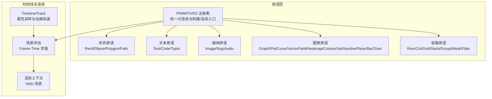
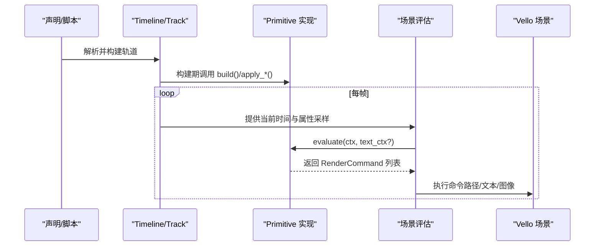
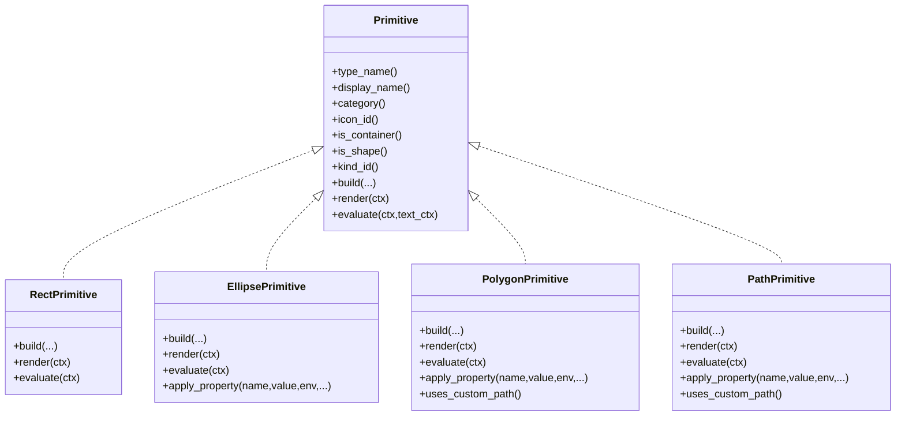
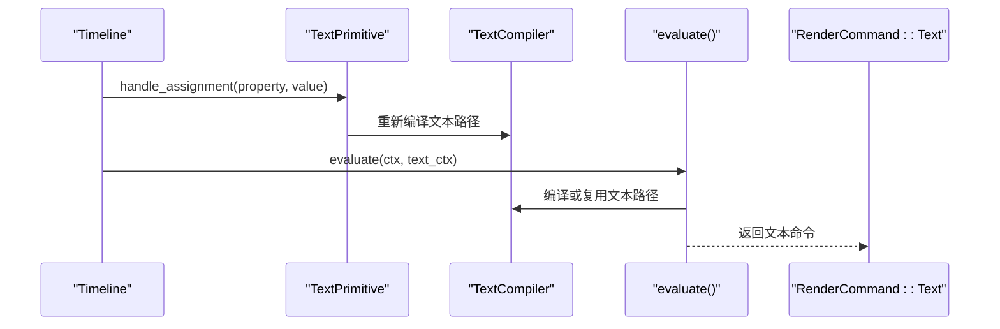
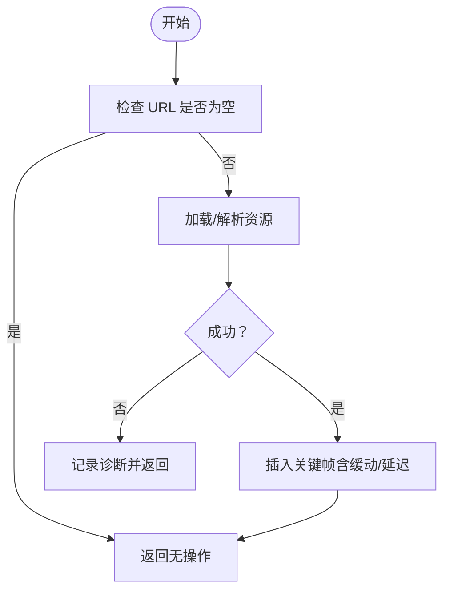
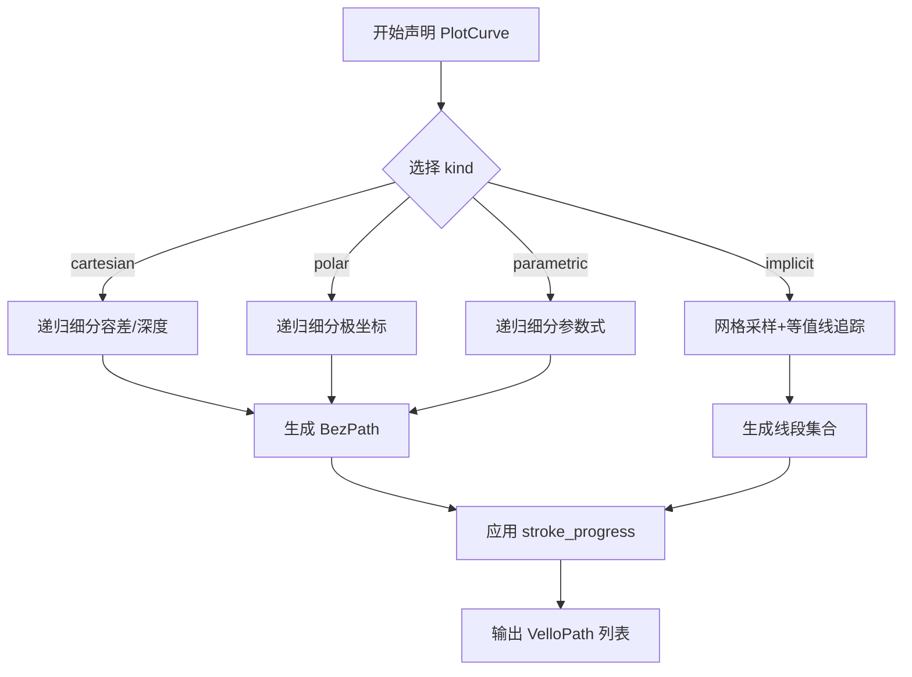
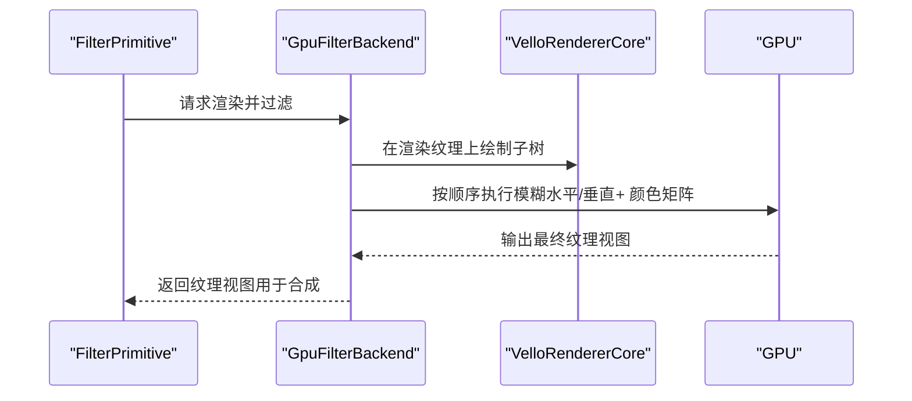
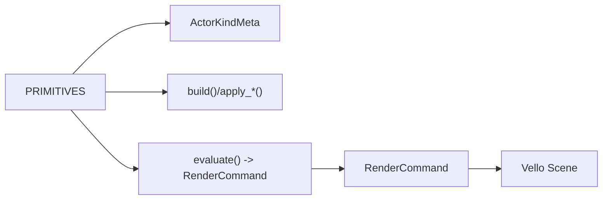

# 视觉原语

<cite>
**本文引用的文件**
- [crates/animatix/src/primitives/mod.rs](file://crates/animatix/src/primitives/mod.rs)
- [crates/animatix/src/primitives/rect.rs](file://crates/animatix/src/primitives/rect.rs)
- [crates/animatix/src/primitives/ellipse.rs](file://crates/animatix/src/primitives/ellipse.rs)
- [crates/animatix/src/primitives/polygon.rs](file://crates/animatix/src/primitives/polygon.rs)
- [crates/animatix/src/primitives/path.rs](file://crates/animatix/src/primitives/path.rs)
- [crates/animatix/src/primitives/text.rs](file://crates/animatix/src/primitives/text.rs)
- [crates/animatix/src/primitives/code.rs](file://crates/animatix/src/primitives/code.rs)
- [crates/animatix/src/primitives/image.rs](file://crates/animatix/src/primitives/image.rs)
- [crates/animatix/src/primitives/svg.rs](file://crates/animatix/src/primitives/svg.rs)
- [crates/animatix/src/primitives/plot.rs](file://crates/animatix/src/primitives/plot.rs)
- [crates/animatix/src/primitives/filter.rs](file://crates/animatix/src/primitives/filter.rs)
- [crates/animatix/src/timeline/plot.rs](file://crates/animatix/src/timeline/plot.rs)
- [crates/animatix/src/renderer/filter_backend.rs](file://crates/animatix/src/renderer/filter_backend.rs)
- [examples/07_plots.amx](file://examples/07_plots.amx)
- [examples/08_effects.amx](file://examples/08_effects.amx)
- [docs/primitives.md](file://docs/primitives.md)
</cite>

## 目录
1. [简介](#简介)
2. [项目结构](#项目结构)
3. [核心组件](#核心组件)
4. [架构总览](#架构总览)
5. [详细组件分析](#详细组件分析)
6. [依赖关系分析](#依赖关系分析)
7. [性能考量](#性能考量)
8. [故障排查指南](#故障排查指南)
9. [结论](#结论)
10. [附录](#附录)

## 简介
本文件系统性梳理 Animatix 的视觉原语体系，覆盖形状原语（矩形、椭圆、多边形、路径）、文本与代码显示、图像与矢量图形、数据可视化（折线图、向量场、热力图、等高线、坐标平面、柱状图）以及滤镜效果系统。文档以“可读性优先”的方式组织内容，既适合初学者快速上手，也为进阶用户提供实现细节与最佳实践参考。

## 项目结构
Animatix 将所有可视元素抽象为统一的 Primitive 接口，通过静态注册表集中管理元信息与构建逻辑；渲染阶段则按需生成 Vello 路径或文本字形，再由场景评估器统一执行绘制。滤镜系统采用 GPU 计算着色器在离屏纹理上进行高性价比后处理。

**图表来源**
- [crates/animatix/src/primitives/mod.rs:570-586](file://crates/animatix/src/primitives/mod.rs#L570-L586)
- [crates/animatix/src/primitives/rect.rs:16-50](file://crates/animatix/src/primitives/rect.rs#L16-L50)
- [crates/animatix/src/primitives/text.rs:15-50](file://crates/animatix/src/primitives/text.rs#L15-L50)
- [crates/animatix/src/primitives/image.rs:19-45](file://crates/animatix/src/primitives/image.rs#L19-L45)
- [crates/animatix/src/primitives/plot.rs:20-69](file://crates/animatix/src/primitives/plot.rs#L20-L69)

**章节来源**
- [crates/animatix/src/primitives/mod.rs:1-727](file://crates/animatix/src/primitives/mod.rs#L1-L727)

## 核心组件
- 统一原语接口：定义类型名、显示名、分类、图标、构建、渲染、默认属性、赋值期处理、帧求值等契约。
- 原语注册表：PRIMITIVES 静态数组作为单一真相源，自动生成 ActorKindMeta 元信息，支持按类型名查找。
- 渲染命令：RenderCommand 抽象出“绘制路径/文本/图像”，交由场景评估器统一执行。
- 图表采样：PlotCurve 使用自适应递归细分算法，支持笛卡尔/极坐标/参数式/隐式四种模式。
- 滤镜后端：GPU 计算着色器实现高斯模糊与颜色矩阵变换，支持零拷贝路径优化。

**章节来源**
- [crates/animatix/src/primitives/mod.rs:416-568](file://crates/animatix/src/primitives/mod.rs#L416-L568)
- [crates/animatix/src/primitives/mod.rs:570-641](file://crates/animatix/src/primitives/mod.rs#L570-L641)
- [crates/animatix/src/timeline/plot.rs:1-800](file://crates/animatix/src/timeline/plot.rs#L1-L800)
- [crates/animatix/src/renderer/filter_backend.rs:1-800](file://crates/animatix/src/renderer/filter_backend.rs#L1-L800)

## 架构总览
下图展示了从声明到渲染的关键流程：解析器将声明转换为 Timeline；原语在构建期注入轨道，在帧求值期根据时间采样属性并生成渲染命令，最终由场景评估器写入 Vello 场景。

**图表来源**
- [crates/animatix/src/primitives/mod.rs:550-567](file://crates/animatix/src/primitives/mod.rs#L550-L567)
- [crates/animatix/src/primitives/text.rs:94-112](file://crates/animatix/src/primitives/text.rs#L94-L112)
- [crates/animatix/src/primitives/image.rs:95-116](file://crates/animatix/src/primitives/image.rs#L95-L116)

## 详细组件分析

### 形状原语：矩形、椭圆、多边形、路径
- 矩形（Rect）：基于半轴尺寸生成路径，支持填充与描边。
- 椭圆（Ellipse）：支持显式半径属性与旋转，适配矢量描边。
- 多边形（Polygon）：支持顶点列表与自定义路径，可参与路径插值与动画。
- 路径（Path）：通过命令序列（move_to/line_to/curve_to/close）构造自定义轮廓。

**图表来源**
- [crates/animatix/src/primitives/rect.rs:16-107](file://crates/animatix/src/primitives/rect.rs#L16-L107)
- [crates/animatix/src/primitives/ellipse.rs:18-125](file://crates/animatix/src/primitives/ellipse.rs#L18-L125)
- [crates/animatix/src/primitives/polygon.rs:16-125](file://crates/animatix/src/primitives/polygon.rs#L16-L125)
- [crates/animatix/src/primitives/path.rs:16-101](file://crates/animatix/src/primitives/path.rs#L16-L101)

**章节来源**
- [crates/animatix/src/primitives/rect.rs:52-107](file://crates/animatix/src/primitives/rect.rs#L52-L107)
- [crates/animatix/src/primitives/ellipse.rs:30-96](file://crates/animatix/src/primitives/ellipse.rs#L30-L96)
- [crates/animatix/src/primitives/polygon.rs:28-99](file://crates/animatix/src/primitives/polygon.rs#L28-L99)
- [crates/animatix/src/primitives/path.rs:29-82](file://crates/animatix/src/primitives/path.rs#L29-L82)

### 文本与代码显示
- 文本（Text）：支持动态重编译，分配期对 text/latex/math/code 属性进行即时更新。
- 代码（Code）：沿用文本路径管线，字号更小，适合程序片段展示。
- Typst：替代旧版 Math，支持 Typst 标记语言内容。

**图表来源**
- [crates/animatix/src/primitives/text.rs:52-92](file://crates/animatix/src/primitives/text.rs#L52-L92)
- [crates/animatix/src/primitives/text.rs:94-112](file://crates/animatix/src/primitives/text.rs#L94-L112)
- [crates/animatix/src/primitives/code.rs:53-93](file://crates/animatix/src/primitives/code.rs#L53-L93)
- [crates/animatix/src/primitives/code.rs:95-113](file://crates/animatix/src/primitives/code.rs#L95-L113)

**章节来源**
- [crates/animatix/src/primitives/text.rs:22-50](file://crates/animatix/src/primitives/text.rs#L22-L50)
- [crates/animatix/src/primitives/code.rs:23-51](file://crates/animatix/src/primitives/code.rs#L23-L51)
- [docs/primitives.md:11-58](file://docs/primitives.md#L11-L58)

### 图像与矢量图形
- 图像（Image）：支持 URL 动态赋值，加载失败时产生诊断；按尺寸缩放绘制。
- SVG（Svg）：支持 URL 动态赋值，解析失败时产生诊断；直接输出路径集合。

**图表来源**
- [crates/animatix/src/primitives/image.rs:47-93](file://crates/animatix/src/primitives/image.rs#L47-L93)
- [crates/animatix/src/primitives/svg.rs:45-98](file://crates/animatix/src/primitives/svg.rs#L45-L98)

**章节来源**
- [crates/animatix/src/primitives/image.rs:26-45](file://crates/animatix/src/primitives/image.rs#L26-L45)
- [crates/animatix/src/primitives/svg.rs:24-43](file://crates/animatix/src/primitives/svg.rs#L24-L43)
- [docs/primitives.md:76-92](file://docs/primitives.md#L76-L92)
- [docs/primitives.md:59-75](file://docs/primitives.md#L59-L75)

### 数据可视化：折线图、向量场、热力图、等高线、坐标平面、柱状图
- 折线图（PlotCurve）：支持笛卡尔/极坐标/参数式/隐式四种采样策略，自适应细分控制精度与性能。
- 向量场（VectorField）：网格采样函数 (x,y)->(dx,dy)，以箭头形式渲染。
- 热力图（Heatmap）：像素级标量场，颜色随数值变化。
- 等高线（ContourSet）：多层级等值线集合。
- 坐标平面（NumberPlane）：独立的网格/刻度背景。
- 柱状图（BarChart）：支持独立与 Graph 子节点两种模式。

**图表来源**
- [crates/animatix/src/primitives/plot.rs:79-111](file://crates/animatix/src/primitives/plot.rs#L79-L111)
- [crates/animatix/src/timeline/plot.rs:65-177](file://crates/animatix/src/timeline/plot.rs#L65-L177)
- [crates/animatix/src/timeline/plot.rs:179-400](file://crates/animatix/src/timeline/plot.rs#L179-L400)
- [crates/animatix/src/timeline/plot.rs:402-583](file://crates/animatix/src/timeline/plot.rs#L402-L583)

**章节来源**
- [crates/animatix/src/primitives/plot.rs:20-69](file://crates/animatix/src/primitives/plot.rs#L20-L69)
- [crates/animatix/src/primitives/plot.rs:150-211](file://crates/animatix/src/primitives/plot.rs#L150-L211)
- [crates/animatix/src/primitives/plot.rs:213-274](file://crates/animatix/src/primitives/plot.rs#L213-L274)
- [crates/animatix/src/primitives/plot.rs:276-338](file://crates/animatix/src/primitives/plot.rs#L276-L338)
- [crates/animatix/src/primitives/plot.rs:340-395](file://crates/animatix/src/primitives/plot.rs#L340-L395)
- [docs/primitives.md:208-323](file://docs/primitives.md#L208-L323)

### 滤镜效果系统
- 容器（Filter）：将子树渲染至离屏纹理，随后在 GPU 上叠加滤镜（模糊、亮度、对比度、饱和度、色相旋转、棕褐色）。
- GPU 后端：包含高斯模糊与颜色矩阵两套计算着色器，支持零读回路径优化。

**图表来源**
- [crates/animatix/src/primitives/filter.rs:17-46](file://crates/animatix/src/primitives/filter.rs#L17-L46)
- [crates/animatix/src/renderer/filter_backend.rs:184-746](file://crates/animatix/src/renderer/filter_backend.rs#L184-L746)

**章节来源**
- [crates/animatix/src/primitives/filter.rs:17-51](file://crates/animatix/src/primitives/filter.rs#L17-L51)
- [crates/animatix/src/renderer/filter_backend.rs:20-111](file://crates/animatix/src/renderer/filter_backend.rs#L20-L111)
- [crates/animatix/src/renderer/filter_backend.rs:613-746](file://crates/animatix/src/renderer/filter_backend.rs#L613-L746)

## 依赖关系分析
- 原语注册与派发：PRIMITIVES 数组集中注册所有原语，ActorKindMeta 自动派生，find_primitive 提供按类型名查找。
- 渲染命令解耦：RenderCommand 封装绘制细节，避免场景评估器中出现巨无霸匹配分支。
- 图表采样模块化：PlotCurve 的四种采样策略共享同一自适应细分框架，差异体现在坐标映射与可见性剔除。

**图表来源**
- [crates/animatix/src/primitives/mod.rs:570-641](file://crates/animatix/src/primitives/mod.rs#L570-L641)
- [crates/animatix/src/primitives/mod.rs:268-414](file://crates/animatix/src/primitives/mod.rs#L268-L414)

**章节来源**
- [crates/animatix/src/primitives/mod.rs:570-641](file://crates/animatix/src/primitives/mod.rs#L570-L641)

## 性能考量
- 自适应采样：PlotCurve 通过容差与最大深度控制细分成本，避免在平坦区域过度采样。
- 可见性裁剪：在采样前对屏幕外区域注入断点，减少无效计算。
- GPU 滤镜：模糊与颜色矩阵在 GPU 上完成，支持零读回路径以降低内存带宽压力。
- 路径插值：几何输入（points/commands）支持动画轨道与路径插值，避免逐帧重建。

[本节为通用指导，不直接分析具体文件]

## 故障排查指南
- 文本/代码重编译失败：检查文本内容与字体配置，确认分配期返回的错误诊断。
- 图像/SVG 加载失败：检查 URL 是否存在且格式正确，查看构建期诊断。
- 图表采样异常：调整容差、最大深度与分辨率参数，观察曲线质量与性能权衡。
- 滤镜效果未生效：确认 Filter 容器内有子元素，且滤镜参数非单位值；检查 GPU 设备初始化状态。

**章节来源**
- [crates/animatix/src/primitives/text.rs:71-91](file://crates/animatix/src/primitives/text.rs#L71-L91)
- [crates/animatix/src/primitives/image.rs:70-91](file://crates/animatix/src/primitives/image.rs#L70-L91)
- [crates/animatix/src/primitives/svg.rs:68-96](file://crates/animatix/src/primitives/svg.rs#L68-L96)
- [crates/animatix/src/timeline/plot.rs:65-177](file://crates/animatix/src/timeline/plot.rs#L65-L177)
- [crates/animatix/src/renderer/filter_backend.rs:184-200](file://crates/animatix/src/renderer/filter_backend.rs#L184-L200)

## 结论
Animatix 的视觉原语体系以统一接口与静态注册为核心，结合自适应采样与 GPU 后处理，实现了从基础形状到复杂数据可视化的全栈支持。通过清晰的属性契约与帧求值模型，用户可以以声明式方式组合多种原语，高效表达创意。

[本节为总结性内容，不直接分析具体文件]

## 附录

### 使用示例与最佳实践
- 数据可视化示例：展示折线图、向量场、热力图与不同采样策略的组合使用。
- 滤镜与特效示例：演示背景模糊与前景棕褐色滤镜的叠加，配合震动/脉冲/弹跳等动作。

**章节来源**
- [examples/07_plots.amx:1-37](file://examples/07_plots.amx#L1-L37)
- [examples/08_effects.amx:1-63](file://examples/08_effects.amx#L1-L63)
- [docs/primitives.md:208-323](file://docs/primitives.md#L208-L323)