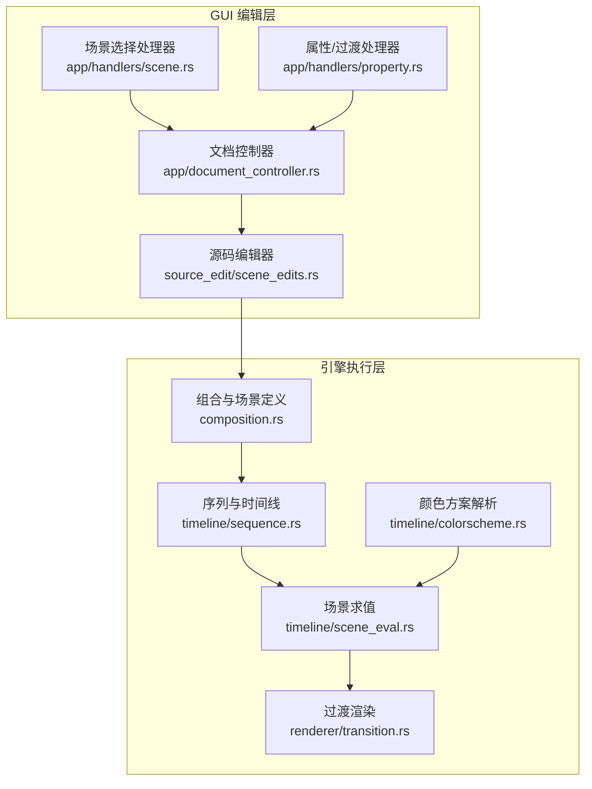
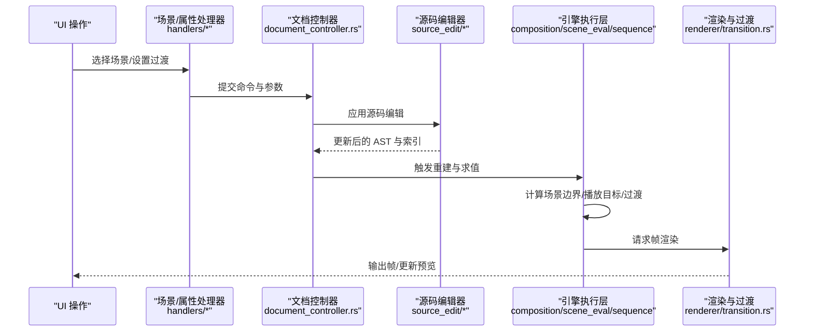
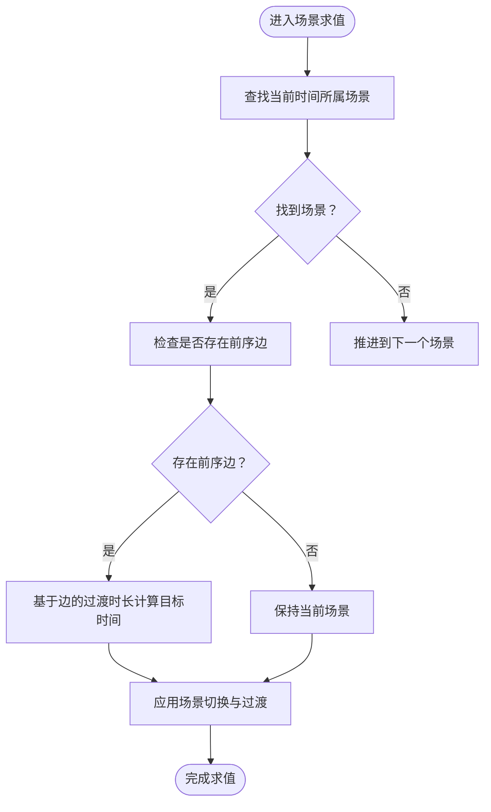
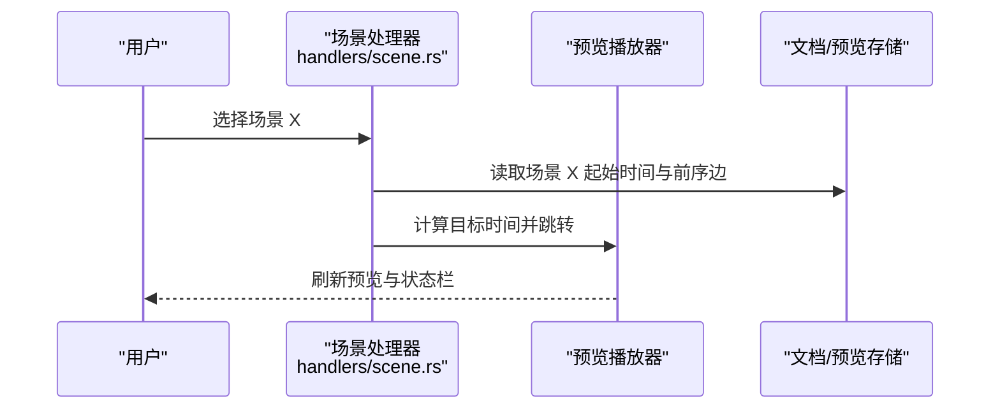
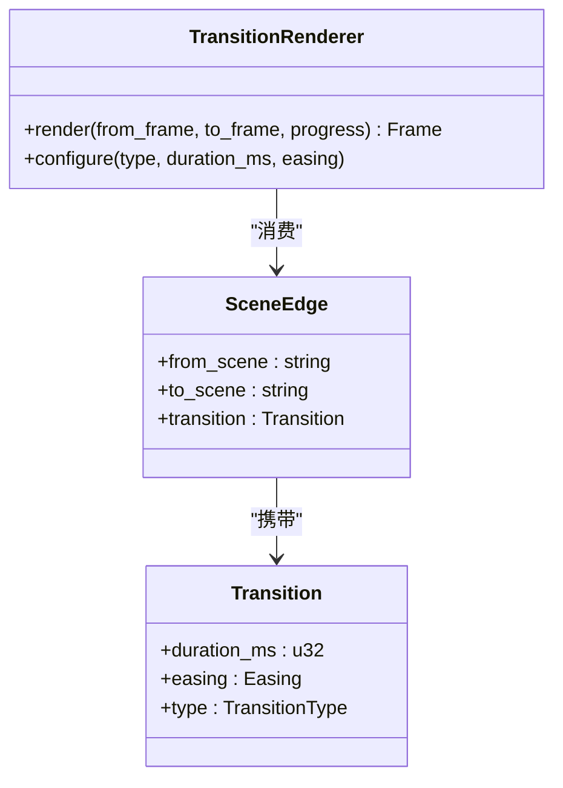
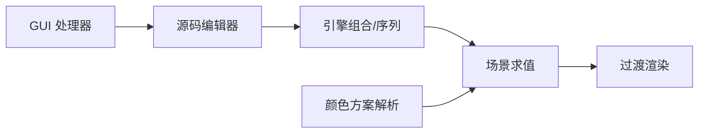

# 多场景组合

<cite>
**本文引用的文件**
- [composition.rs](file://crates/animatix/src/composition.rs)
- [scene_eval.rs](file://crates/animatix/src/timeline/scene_eval.rs)
- [sequence.rs](file://crates/animatix/src/timeline/sequence.rs)
- [transition.rs](file://crates/animatix/src/renderer/transition.rs)
- [colorscheme.rs](file://crates/animatix/src/timeline/colorscheme.rs)
- [scene.rs](file://crates/animatix-gui/src/app/handlers/scene.rs)
- [scene_edits.rs](file://crates/animatix-gui/src/source_edit/scene_edits.rs)
- [document_controller.rs](file://crates/animatix-gui/src/app/document_controller.rs)
- [property.rs](file://crates/animatix-gui/src/app/handlers/property.rs)
- [reel_intro.amx](file://examples/scenes/reel_intro.amx)
- [14_multiscene.amx](file://examples/14_multiscene.amx)
- [16_showcase.amx](file://examples/16_showcase.amx)
- [20_feature_reel.amx](file://examples/20_feature_reel.amx)
</cite>

## 目录
1. [引言](#引言)
2. [项目结构](#项目结构)
3. [核心组件](#核心组件)
4. [架构总览](#架构总览)
5. [详细组件分析](#详细组件分析)
6. [依赖关系分析](#依赖关系分析)
7. [性能考量](#性能考量)
8. [故障排查指南](#故障排查指南)
9. [结论](#结论)
10. [附录](#附录)

## 引言
本篇文档聚焦 Animatix 的“多场景组合”能力，系统阐述如何在 Animatix 中创建与管理多个场景（Scenes），包括场景声明、场景切换、全局配置与过渡效果。我们将从底层引擎到上层 GUI 的完整链路进行剖析，覆盖场景配置系统（分辨率、配色方案、场景特定样式）、场景间过渡（淡入淡出、擦除等）以及从场景规划到最终渲染的实践流程，并给出最佳实践与排错建议。

## 项目结构
Animatix 将“场景”抽象为可组合的时间线单元，通过编译期构建与运行时评估协同工作。GUI 层负责编辑与交互，引擎层负责解析、求值与渲染。多场景的核心数据结构与处理逻辑主要分布在以下模块：
- 组合与场景：composition.rs、timeline/scene_eval.rs、timeline/sequence.rs
- 渲染与过渡：renderer/transition.rs
- 颜色方案：timeline/colorscheme.rs
- GUI 编辑与命令：app/handlers/scene.rs、source_edit/scene_edits.rs、app/document_controller.rs、app/handlers/property.rs
- 示例：examples 下的多场景示例文件

图表来源
- [scene.rs:31-61](file://crates/animatix-gui/src/app/handlers/scene.rs#L31-L61)
- [property.rs:5-23](file://crates/animatix-gui/src/app/handlers/property.rs#L5-L23)
- [document_controller.rs:235-269](file://crates/animatix-gui/src/app/document_controller.rs#L235-L269)
- [scene_edits.rs:152-175](file://crates/animatix-gui/src/source_edit/scene_edits.rs#L152-L175)
- [composition.rs](file://crates/animatix/src/composition.rs)
- [sequence.rs](file://crates/animatix/src/timeline/sequence.rs)
- [scene_eval.rs](file://crates/animatix/src/timeline/scene_eval.rs)
- [transition.rs](file://crates/animatix/src/renderer/transition.rs)
- [colorscheme.rs:42-62](file://crates/animatix/src/timeline/colorscheme.rs#L42-L62)

章节来源
- [scene.rs:31-61](file://crates/animatix-gui/src/app/handlers/scene.rs#L31-L61)
- [property.rs:5-23](file://crates/animatix-gui/src/app/handlers/property.rs#L5-L23)
- [document_controller.rs:235-269](file://crates/animatix-gui/src/app/document_controller.rs#L235-L269)
- [scene_edits.rs:152-175](file://crates/animatix-gui/src/source_edit/scene_edits.rs#L152-L175)
- [composition.rs](file://crates/animatix/src/composition.rs)
- [sequence.rs](file://crates/animatix/src/timeline/sequence.rs)
- [scene_eval.rs](file://crates/animatix/src/timeline/scene_eval.rs)
- [transition.rs](file://crates/animatix/src/renderer/transition.rs)
- [colorscheme.rs:42-62](file://crates/animatix/src/timeline/colorscheme.rs#L42-L62)

## 核心组件
- 场景声明与组合：引擎侧以组合（Composition）组织场景集合，每个场景有起始时间、持续时间与播放目标（Play Target）。场景间通过边（Edges）连接形成序列。
- 场景切换与预览：GUI 侧在选择场景时计算目标时间点（考虑前序过渡），驱动播放器跳转并刷新预览状态。
- 过渡效果：引擎侧提供过渡渲染器，支持多种过渡类型；GUI 侧允许用户设置场景间过渡的参数（如时长、缓动曲线）。
- 配置与样式：颜色方案解析为键值映射，支持全局主题与场景特定样式覆盖；分辨率等全局配置由渲染管线与播放器控制。

章节来源
- [composition.rs](file://crates/animatix/src/composition.rs)
- [scene_eval.rs](file://crates/animatix/src/timeline/scene_eval.rs)
- [transition.rs](file://crates/animatix/src/renderer/transition.rs)
- [colorscheme.rs:42-62](file://crates/animatix/src/timeline/colorscheme.rs#L42-L62)
- [scene.rs:31-61](file://crates/animatix-gui/src/app/handlers/scene.rs#L31-L61)
- [scene_edits.rs:152-175](file://crates/animatix-gui/src/source_edit/scene_edits.rs#L152-L175)
- [document_controller.rs:235-269](file://crates/animatix-gui/src/app/document_controller.rs#L235-L269)
- [property.rs:5-23](file://crates/animatix-gui/src/app/handlers/property.rs#L5-L23)

## 架构总览
下图展示从 GUI 到引擎再到渲染的整体流程，重点标注了场景选择、过渡设置与场景求值的关键节点。

图表来源
- [scene.rs:31-61](file://crates/animatix-gui/src/app/handlers/scene.rs#L31-L61)
- [property.rs:5-23](file://crates/animatix-gui/src/app/handlers/property.rs#L5-L23)
- [document_controller.rs:235-269](file://crates/animatix-gui/src/app/document_controller.rs#L235-L269)
- [scene_edits.rs:152-175](file://crates/animatix-gui/src/source_edit/scene_edits.rs#L152-L175)
- [composition.rs](file://crates/animatix/src/composition.rs)
- [scene_eval.rs](file://crates/animatix/src/timeline/scene_eval.rs)
- [sequence.rs](file://crates/animatix/src/timeline/sequence.rs)
- [transition.rs](file://crates/animatix/src/renderer/transition.rs)

## 详细组件分析

### 场景声明与组合（Composition）
- 组合（Composition）维护场景字典、场景起始时间表与边（Edges）连接关系。每个场景包含其播放目标（Play Target）与可选的过渡配置。
- 时间线序列（Sequence）将多个场景按顺序拼接，计算每个场景的开始与结束时间，确保播放器能正确定位到当前场景。
- 场景求值（SceneEval）根据当前时间判断应处于哪个场景，并决定是否触发场景切换与过渡。

图表来源
- [composition.rs](file://crates/animatix/src/composition.rs)
- [sequence.rs](file://crates/animatix/src/timeline/sequence.rs)
- [scene_eval.rs](file://crates/animatix/src/timeline/scene_eval.rs)

章节来源
- [composition.rs](file://crates/animatix/src/composition.rs)
- [sequence.rs](file://crates/animatix/src/timeline/sequence.rs)
- [scene_eval.rs](file://crates/animatix/src/timeline/scene_eval.rs)

### 场景切换与预览（GUI）
- 场景选择处理器在用户点击某个场景时，读取该场景的起始时间与前序边的过渡时长，计算目标时间并驱动播放器跳转，同时刷新状态栏显示当前时间与总时长。
- 属性处理器封装了对过渡与播放目标的修改命令，统一走文档控制器应用，保证撤销/重做与状态同步。

图表来源
- [scene.rs:31-61](file://crates/animatix-gui/src/app/handlers/scene.rs#L31-L61)

章节来源
- [scene.rs:31-61](file://crates/animatix-gui/src/app/handlers/scene.rs#L31-L61)
- [property.rs:5-23](file://crates/animatix-gui/src/app/handlers/property.rs#L5-L23)
- [document_controller.rs:235-269](file://crates/animatix-gui/src/app/document_controller.rs#L235-L269)

### 过渡效果（Transition）
- 引擎侧提供过渡渲染器，支持多种过渡类型（如淡入淡出、擦除等）。过渡参数（时长、缓动曲线）由场景 Play 语句或边（Edges）上的 Transition 定义。
- GUI 侧通过属性处理器与文档控制器将用户设置写回源码 AST，并重新构建索引，确保渲染器读取到最新配置。

图表来源
- [transition.rs](file://crates/animatix/src/renderer/transition.rs)
- [scene_edits.rs:152-175](file://crates/animatix-gui/src/source_edit/scene_edits.rs#L152-L175)

章节来源
- [transition.rs](file://crates/animatix/src/renderer/transition.rs)
- [scene_edits.rs:152-175](file://crates/animatix-gui/src/source_edit/scene_edits.rs#L152-L175)
- [document_controller.rs:235-269](file://crates/animatix-gui/src/app/document_controller.rs#L235-L269)

### 配置系统（分辨率、配色方案、场景样式）
- 分辨率与全局渲染配置：由渲染管线与播放器控制，影响输出尺寸与画质。
- 颜色方案（ColorScheme）：内置主题解析为键值映射，支持全局主题与场景特定样式覆盖。键名通常采用命名空间化约定（如 scene.background、text.primary 等），便于在不同场景中复用与覆盖。
- 场景特定样式：可通过场景内的样式声明或 Play 语句中的样式参数进行局部覆盖，实现风格一致性与差异化。

章节来源
- [colorscheme.rs:42-62](file://crates/animatix/src/timeline/colorscheme.rs#L42-L62)

### 实践流程：从场景规划到渲染
- 场景规划：在源码中声明多个场景，设置每个场景的起始时间与持续时间；通过边（Edges）建立场景间的播放顺序与过渡。
- 过渡配置：在场景 Play 语句或边（Edges）上设置过渡类型、时长与缓动曲线；在 GUI 中通过属性面板即时调整并预览。
- 样式与主题：选择全局颜色方案，必要时在场景内覆盖关键样式键；调整分辨率与输出质量。
- 预览与导出：在预览器中逐场景验证，确认切换与过渡效果；最终导出视频或图片序列。

章节来源
- [composition.rs](file://crates/animatix/src/composition.rs)
- [scene_eval.rs](file://crates/animatix/src/timeline/scene_eval.rs)
- [transition.rs](file://crates/animatix/src/renderer/transition.rs)
- [colorscheme.rs:42-62](file://crates/animatix/src/timeline/colorscheme.rs#L42-L62)
- [scene.rs:31-61](file://crates/animatix-gui/src/app/handlers/scene.rs#L31-L61)
- [scene_edits.rs:152-175](file://crates/animatix-gui/src/source_edit/scene_edits.rs#L152-L175)
- [document_controller.rs:235-269](file://crates/animatix-gui/src/app/document_controller.rs#L235-L269)
- [property.rs:5-23](file://crates/animatix-gui/src/app/handlers/property.rs#L5-L23)

## 依赖关系分析
- GUI 与引擎的耦合：GUI 通过命令与编辑器写回 AST，引擎仅依赖已构建的组合与序列信息进行求值与渲染，降低双向耦合风险。
- 过渡与渲染：过渡参数经由引擎传递给渲染器，渲染器不感知 GUI 的交互细节，职责清晰。
- 配色方案：颜色解析独立于场景求值，通过键值映射供渲染与 UI 使用，便于主题切换与样式复用。

图表来源
- [scene.rs:31-61](file://crates/animatix-gui/src/app/handlers/scene.rs#L31-L61)
- [scene_edits.rs:152-175](file://crates/animatix-gui/src/source_edit/scene_edits.rs#L152-L175)
- [composition.rs](file://crates/animatix/src/composition.rs)
- [sequence.rs](file://crates/animatix/src/timeline/sequence.rs)
- [scene_eval.rs](file://crates/animatix/src/timeline/scene_eval.rs)
- [transition.rs](file://crates/animatix/src/renderer/transition.rs)
- [colorscheme.rs:42-62](file://crates/animatix/src/timeline/colorscheme.rs#L42-L62)

章节来源
- [scene.rs:31-61](file://crates/animatix-gui/src/app/handlers/scene.rs#L31-L61)
- [scene_edits.rs:152-175](file://crates/animatix-gui/src/source_edit/scene_edits.rs#L152-L175)
- [composition.rs](file://crates/animatix/src/composition.rs)
- [sequence.rs](file://crates/animatix/src/timeline/sequence.rs)
- [scene_eval.rs](file://crates/animatix/src/timeline/scene_eval.rs)
- [transition.rs](file://crates/animatix/src/renderer/transition.rs)
- [colorscheme.rs:42-62](file://crates/animatix/src/timeline/colorscheme.rs#L42-L62)

## 性能考量
- 场景切换与过渡：尽量减少过渡时长与复杂度，避免在高分辨率与复杂图层下频繁切换导致卡顿。
- 颜色方案与样式：集中管理颜色键，避免在场景内重复定义相同键，减少渲染阶段的样式切换开销。
- 预览与导出：预览时可降低分辨率与帧率，导出时再恢复至目标质量，平衡开发效率与成品质量。

## 故障排查指南
- 场景无法切换：检查场景起始时间与前序边是否存在；确认播放目标（Play Target）是否正确设置。
- 过渡未生效：确认过渡参数（时长、类型、缓动）已在源码中写回并重建索引；检查渲染器是否读取到最新配置。
- 颜色显示异常：核对颜色键是否存在于解析后的映射中；检查场景内是否有覆盖键导致视觉偏差。
- 预览卡顿：降低分辨率或过渡复杂度；分段预览以定位问题场景。

章节来源
- [scene.rs:31-61](file://crates/animatix-gui/src/app/handlers/scene.rs#L31-L61)
- [scene_edits.rs:152-175](file://crates/animatix-gui/src/source_edit/scene_edits.rs#L152-L175)
- [document_controller.rs:235-269](file://crates/animatix-gui/src/app/document_controller.rs#L235-L269)
- [colorscheme.rs:42-62](file://crates/animatix/src/timeline/colorscheme.rs#L42-L62)

## 结论
Animatix 的多场景组合以“声明式场景 + 边界连接 + 可配置过渡”的方式实现了灵活而可控的动画编排。通过 GUI 与引擎的清晰分工、颜色方案的集中管理与过渡渲染的可插拔设计，开发者可以高效地完成从场景规划到最终渲染的全流程创作。建议在大型项目中遵循“集中主题、局部覆盖、分段预览”的实践策略，以获得更佳的开发体验与成品质量。

## 附录
- 示例参考
  - [reel_intro.amx](file://examples/scenes/reel_intro.amx)
  - [14_multiscene.amx](file://examples/14_multiscene.amx)
  - [16_showcase.amx](file://examples/16_showcase.amx)
  - [20_feature_reel.amx](file://examples/20_feature_reel.amx)