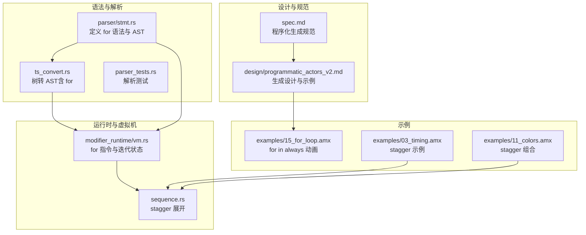
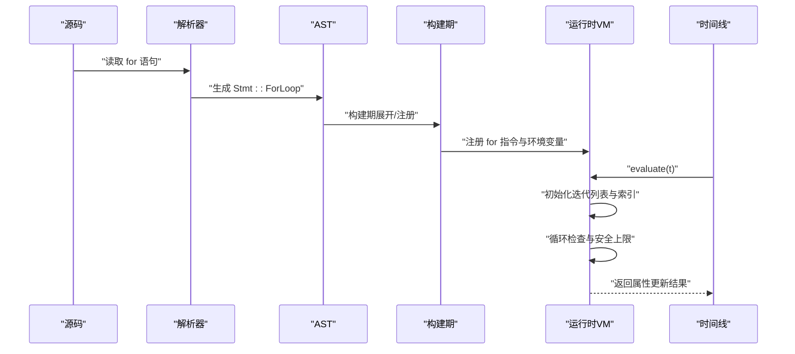
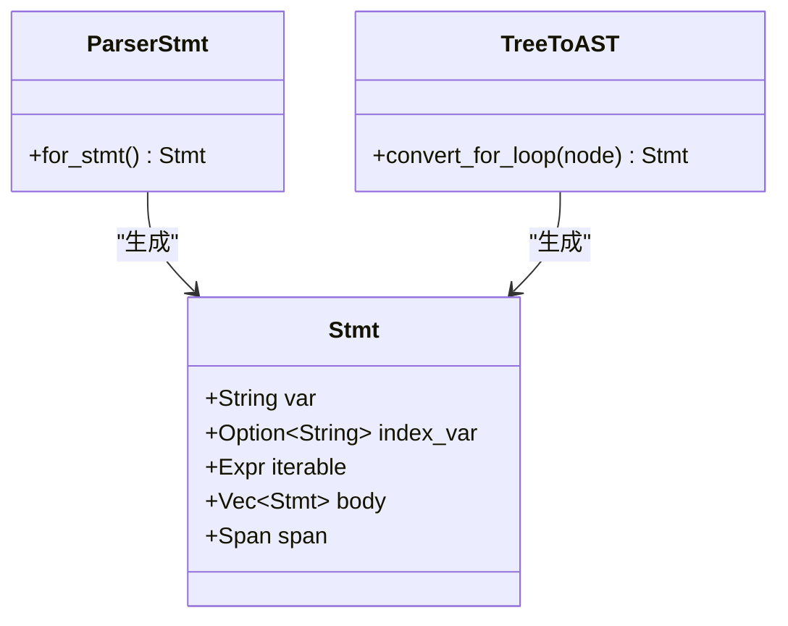
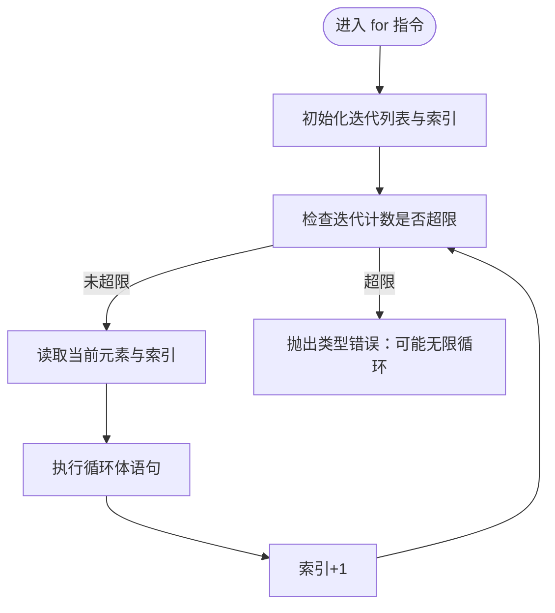
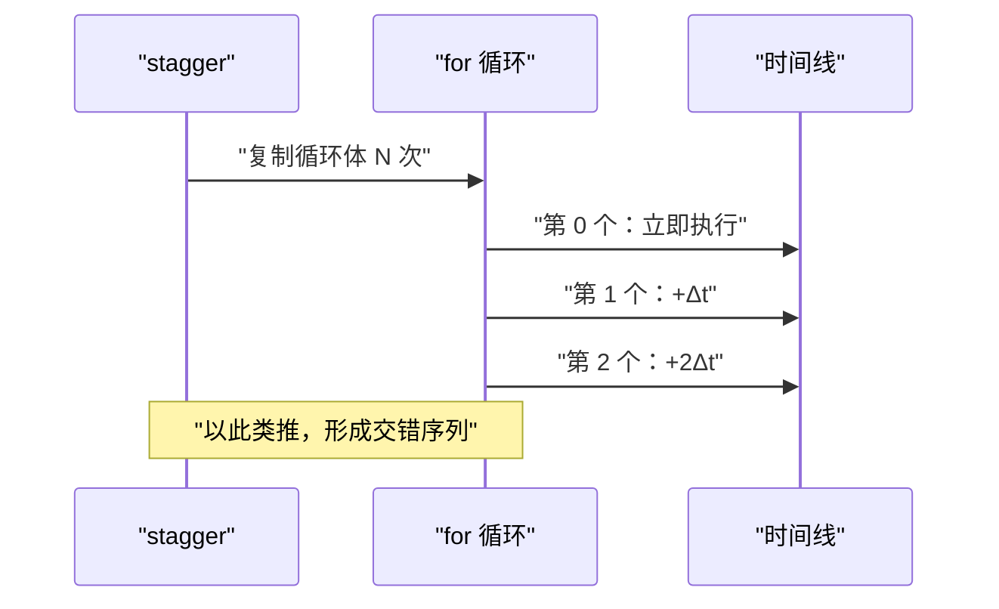
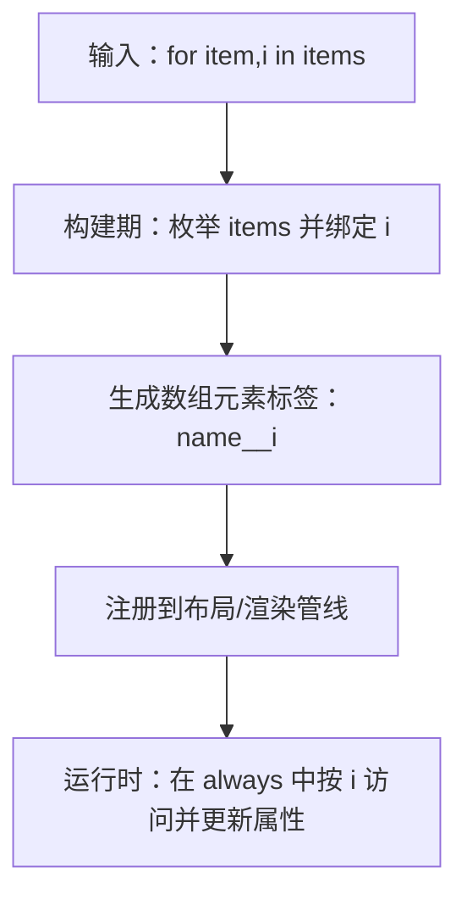
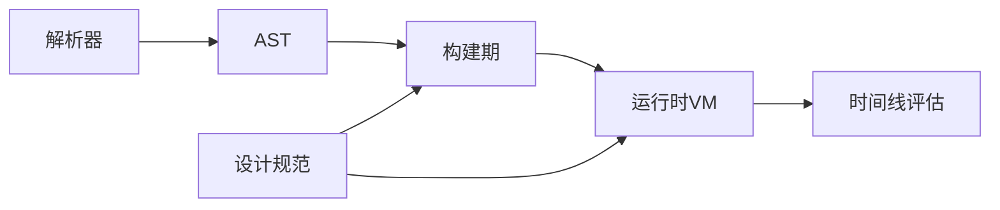

# 循环动画系统

<cite>
**本文引用的文件**
- [examples/15_for_loop.amx](file://examples/15_for_loop.amx)
- [crates/animatix-syntax/src/parser/stmt.rs](file://crates/animatix-syntax/src/parser/stmt.rs)
- [crates/animatix-syntax/src/ts_convert.rs](file://crates/animatix-syntax/src/ts_convert.rs)
- [crates/animatix/src/timeline/modifier_runtime/vm.rs](file://crates/animatix/src/timeline/modifier_runtime/vm.rs)
- [crates/animatix/src/timeline/sequence.rs](file://crates/animatix/src/timeline/sequence.rs)
- [docs/design/programmatic_actors_v2.md](file://docs/design/programmatic_actors_v2.md)
- [docs/spec.md](file://docs/spec.md)
- [crates/animatix/tests/parser_tests.rs](file://crates/animatix/tests/parser_tests.rs)
- [examples/03_timing.amx](file://examples/03_timing.amx)
- [examples/11_colors.amx](file://examples/11_colors.amx)
- [crates/animatix-analyzer/src/symbol_table.rs](file://crates/animatix-analyzer/src/symbol_table.rs)
- [crates/animatix/benches/vm_regression.rs](file://crates/animatix/benches/vm_regression.rs)
- [crates/animatix/benches/vm_vs_ir.rs](file://crates/animatix/benches/vm_vs_ir.rs)
</cite>

## 目录
1. [简介](#简介)
2. [项目结构](#项目结构)
3. [核心组件](#核心组件)
4. [架构总览](#架构总览)
5. [详细组件分析](#详细组件分析)
6. [依赖关系分析](#依赖关系分析)
7. [性能考量](#性能考量)
8. [故障排查指南](#故障排查指南)
9. [结论](#结论)
10. [附录：示例与用法清单](#附录示例与用法清单)

## 简介
本指南系统性介绍 Animatix 的循环动画系统，重点覆盖以下方面：
- for 循环语法与语义：支持“元素变量”和“可选索引变量”的绑定，以及在构建期与帧时间的不同执行时机。
- 程序化动画生成：通过数组索引标签与索引赋值，实现按数据批量生成动画对象与动作。
- 常见用法：波形排列、粒子系统风格的闪烁、条形图高度随数据变化等。
- 循环变量使用：索引访问、条件判断、动态计算（如基于索引的相位偏移）。
- 性能优化与内存管理：构建期展开、帧时间求值、缓存利用、迭代上限保护。
- 从简单到复杂的示例集合：从静态 for 循环到嵌套循环、交错延迟、布局容器内的生成。

## 项目结构
围绕循环动画系统的关键文件分布如下：
- 语法与解析层：定义 for 语句的语法、AST 节点与转换逻辑。
- 运行时与虚拟机：在帧时间执行 for 循环、维护迭代状态与安全上限。
- 时间线与序列：stagger 等控制块与 for 的组合扩展。
- 设计文档：程序化演员生成的设计目标、迁移阶段与最佳实践。
- 示例：演示 for 在 always 块中的逐帧动画、交错延迟与布局容器内生成。

**图表来源**
- [crates/animatix-syntax/src/parser/stmt.rs:419-440](file://crates/animatix-syntax/src/parser/stmt.rs#L419-L440)
- [crates/animatix-syntax/src/ts_convert.rs:476-493](file://crates/animatix-syntax/src/ts_convert.rs#L476-L493)
- [crates/animatix/src/timeline/modifier_runtime/vm.rs:446-471](file://crates/animatix/src/timeline/modifier_runtime/vm.rs#L446-L471)
- [crates/animatix/src/timeline/sequence.rs:92-117](file://crates/animatix/src/timeline/sequence.rs#L92-L117)
- [docs/spec.md:668-683](file://docs/spec.md#L668-L683)
- [docs/design/programmatic_actors_v2.md:67-140](file://docs/design/programmatic_actors_v2.md#L67-L140)
- [examples/15_for_loop.amx:1-41](file://examples/15_for_loop.amx#L1-L41)
- [examples/03_timing.amx:12-28](file://examples/03_timing.amx#L12-L28)
- [examples/11_colors.amx:51-76](file://examples/11_colors.amx#L51-L76)

**章节来源**
- [crates/animatix-syntax/src/parser/stmt.rs:419-440](file://crates/animatix-syntax/src/parser/stmt.rs#L419-L440)
- [crates/animatix-syntax/src/ts_convert.rs:476-493](file://crates/animatix-syntax/src/ts_convert.rs#L476-L493)
- [crates/animatix/src/timeline/modifier_runtime/vm.rs:446-471](file://crates/animatix/src/timeline/modifier_runtime/vm.rs#L446-L471)
- [crates/animatix/src/timeline/sequence.rs:92-117](file://crates/animatix/src/timeline/sequence.rs#L92-L117)
- [docs/spec.md:668-683](file://docs/spec.md#L668-L683)
- [docs/design/programmatic_actors_v2.md:67-140](file://docs/design/programmatic_actors_v2.md#L67-L140)
- [examples/15_for_loop.amx:1-41](file://examples/15_for_loop.amx#L1-L41)
- [examples/03_timing.amx:12-28](file://examples/03_timing.amx#L12-L28)
- [examples/11_colors.amx:51-76](file://examples/11_colors.amx#L51-L76)

## 核心组件
- 语法与解析
  - for 语句支持“元素变量”和“可选索引变量”，并解析为 AST。
  - 树转 AST 时保留 for 结构，便于后续构建期或运行时处理。
- 运行时虚拟机
  - 在帧时间执行 for 循环，维护迭代列表与当前索引，并设置安全上限防止无限循环。
- 时间线与序列
  - stagger 会将内部 for 循环展开为多条带延迟的动作，实现自然的“流水式”动画。
- 设计与规范
  - 规定了程序化演员生成的语义边界、标签模板与数组索引标签的命名规则。
- 示例
  - 展示了在 always 块中使用 for 实现逐帧波形动画，以及与 stagger 的组合。

**章节来源**
- [crates/animatix-syntax/src/parser/stmt.rs:419-440](file://crates/animatix-syntax/src/parser/stmt.rs#L419-L440)
- [crates/animatix-syntax/src/ts_convert.rs:476-493](file://crates/animatix-syntax/src/ts_convert.rs#L476-L493)
- [crates/animatix/src/timeline/modifier_runtime/vm.rs:446-471](file://crates/animatix/src/timeline/modifier_runtime/vm.rs#L446-L471)
- [crates/animatix/src/timeline/sequence.rs:92-117](file://crates/animatix/src/timeline/sequence.rs#L92-L117)
- [docs/spec.md:668-683](file://docs/spec.md#L668-L683)
- [docs/design/programmatic_actors_v2.md:67-140](file://docs/design/programmatic_actors_v2.md#L67-L140)
- [examples/15_for_loop.amx:17-27](file://examples/15_for_loop.amx#L17-L27)

## 架构总览
下图展示了从源码到运行时的循环动画执行路径：解析器将 for 语句转换为 AST；构建期根据上下文决定是构建期展开还是帧时间求值；运行时在每帧执行 for 循环指令，结合 stagger 等控制块完成序列化与交错动画。

**图表来源**
- [crates/animatix-syntax/src/parser/stmt.rs:419-440](file://crates/animatix-syntax/src/parser/stmt.rs#L419-L440)
- [crates/animatix/src/timeline/modifier_runtime/vm.rs:446-471](file://crates/animatix/src/timeline/modifier_runtime/vm.rs#L446-L471)

## 详细组件分析

### 组件A：for 语句语法与 AST
- 语法要点
  - 支持“元素变量”和“可选索引变量”的绑定。
  - 可迭代表达式在构建期求值（声明上下文）或在帧时间求值（always 上下文）。
- AST 表达
  - 语句节点包含变量名、索引变量（可空）、可迭代表达式与循环体。
- 解析与转换
  - 解析器与树转 AST 都保留 for 结构，确保后续构建与运行时处理一致。

**图表来源**
- [crates/animatix-syntax/src/parser/stmt.rs:419-440](file://crates/animatix-syntax/src/parser/stmt.rs#L419-L440)
- [crates/animatix-syntax/src/ts_convert.rs:476-493](file://crates/animatix-syntax/src/ts_convert.rs#L476-L493)

**章节来源**
- [crates/animatix-syntax/src/parser/stmt.rs:419-440](file://crates/animatix-syntax/src/parser/stmt.rs#L419-L440)
- [crates/animatix-syntax/src/ts_convert.rs:476-493](file://crates/animatix-syntax/src/ts_convert.rs#L476-L493)
- [crates/animatix/tests/parser_tests.rs:1345-1388](file://crates/animatix/tests/parser_tests.rs#L1345-L1388)
- [crates/animatix-analyzer/src/symbol_table.rs:382-390](file://crates/animatix-analyzer/src/symbol_table.rs#L382-L390)

### 组件B：运行时 for 循环执行（VM）
- 执行时机
  - 在帧时间（evaluate）执行，适合 always 块中的逐帧动画。
- 关键行为
  - 初始化迭代列表与索引变量，循环检查并设置安全上限（默认超过一定次数报错），逐项执行循环体。
- 环境变量
  - 使用特定键存储迭代列表与索引，供循环体内表达式与赋值使用。

**图表来源**
- [crates/animatix/src/timeline/modifier_runtime/vm.rs:446-471](file://crates/animatix/src/timeline/modifier_runtime/vm.rs#L446-L471)

**章节来源**
- [crates/animatix/src/timeline/modifier_runtime/vm.rs:446-471](file://crates/animatix/src/timeline/modifier_runtime/vm.rs#L446-L471)

### 组件C：stagger 与 for 的组合
- 展开机制
  - stagger 将循环体内的每个语句复制多次，分别加上递增的时间偏移，从而形成“流水式”动画。
- 适用场景
  - 与 for inside stagger 结合，实现条形图依次出现、点阵闪烁等效果。

**图表来源**
- [crates/animatix/src/timeline/sequence.rs:92-117](file://crates/animatix/src/timeline/sequence.rs#L92-L117)
- [docs/design/programmatic_actors_v2.md:93-104](file://docs/design/programmatic_actors_v2.md#L93-L104)

**章节来源**
- [crates/animatix/src/timeline/sequence.rs:92-117](file://crates/animatix/src/timeline/sequence.rs#L92-L117)
- [docs/design/programmatic_actors_v2.md:93-104](file://docs/design/programmatic_actors_v2.md#L93-L104)

### 组件D：程序化演员生成与数组索引标签
- 生成语义
  - 支持“元素变量, 索引变量”形式的 for，数组元素通过 name[index] 形式声明，内部标签以“基础名__索引”命名。
- 作用域与时机
  - 声明上下文在构建期展开；在 always 中进行帧时间赋值，适合逐帧动画。
- 嵌套与布局
  - 支持嵌套循环生成矩阵；生成的子元素参与布局容器的正常布局。

**图表来源**
- [docs/spec.md:668-683](file://docs/spec.md#L668-L683)
- [docs/design/programmatic_actors_v2.md:67-140](file://docs/design/programmatic_actors_v2.md#L67-L140)

**章节来源**
- [docs/spec.md:668-683](file://docs/spec.md#L668-L683)
- [docs/design/programmatic_actors_v2.md:67-140](file://docs/design/programmatic_actors_v2.md#L67-L140)

## 依赖关系分析
- 解析层依赖
  - 解析器与树转 AST 共同保证 for 语句在 AST 中的完整性。
- 构建期与运行时
  - 构建期负责将 for 展开为具体标签与动作；运行时在每帧执行循环指令并应用 stagger 等控制。
- 设计文档指导
  - 设计文档明确了生成的边界、标签模板与数组索引的命名规则，示例文档提供了丰富的组合用法。

**图表来源**
- [crates/animatix-syntax/src/parser/stmt.rs:419-440](file://crates/animatix-syntax/src/parser/stmt.rs#L419-L440)
- [crates/animatix/src/timeline/modifier_runtime/vm.rs:446-471](file://crates/animatix/src/timeline/modifier_runtime/vm.rs#L446-L471)
- [docs/spec.md:668-683](file://docs/spec.md#L668-L683)

**章节来源**
- [crates/animatix-syntax/src/parser/stmt.rs:419-440](file://crates/animatix-syntax/src/parser/stmt.rs#L419-L440)
- [crates/animatix/src/timeline/modifier_runtime/vm.rs:446-471](file://crates/animatix/src/timeline/modifier_runtime/vm.rs#L446-L471)
- [docs/spec.md:668-683](file://docs/spec.md#L668-L683)

## 性能考量
- 帧时间求值与缓存
  - 对于 always 块中的 for，建议尽量复用中间计算（例如将 sin/cos 等常量因子提取到循环外），减少每帧重复计算。
- 迭代上限保护
  - 运行时对 for 循环设置了迭代上限，避免无限循环导致卡顿或崩溃。
- 交错延迟与批处理
  - 使用 stagger 将大量动作分批执行，降低单帧压力；同时注意不要过度嵌套循环，以免产生过多副本。
- 基准测试参考
  - 提供了针对反应式播放的基准测试样例，可用于评估不同场景下的性能表现与缓存效果。

**章节来源**
- [crates/animatix/src/timeline/modifier_runtime/vm.rs:454-460](file://crates/animatix/src/timeline/modifier_runtime/vm.rs#L454-L460)
- [crates/animatix/benches/vm_regression.rs:26-46](file://crates/animatix/benches/vm_regression.rs#L26-L46)
- [crates/animatix/benches/vm_vs_ir.rs:40-43](file://crates/animatix/benches/vm_vs_ir.rs#L40-L43)

## 故障排查指南
- 无限循环警告
  - 当 for 循环迭代超过安全上限时，运行时会报告类型错误，提示可能存在无限循环。请检查可迭代表达式与退出条件。
- 解析错误
  - 若 for 语法不正确，解析测试会给出断言失败，需核对变量名、逗号与关键字位置。
- 标签冲突
  - 数组索引标签以“基础名__索引”命名，避免在同一作用域内重复使用相同索引导致覆盖或不可预期行为。

**章节来源**
- [crates/animatix/src/timeline/modifier_runtime/vm.rs:454-460](file://crates/animatix/src/timeline/modifier_runtime/vm.rs#L454-L460)
- [crates/animatix/tests/parser_tests.rs:1345-1388](file://crates/animatix/tests/parser_tests.rs#L1345-L1388)
- [docs/design/programmatic_actors_v2.md:67-140](file://docs/design/programmatic_actors_v2.md#L67-L140)

## 结论
Animatix 的循环动画系统通过“元素变量 + 可选索引变量”的 for 语法，结合构建期与帧时间两种执行模式，实现了从静态批量声明到逐帧动态生成的完整能力。配合 stagger 等控制块，可以轻松实现波形排列、流水式入场、矩阵式布局等常见动画效果。遵循设计规范与性能建议，可在保证可读性的同时获得良好的运行效率。

## 附录：示例与用法清单
- 基础 for in always：在每帧根据索引计算偏移，驱动多个对象的同步运动。
  - 示例路径：[examples/15_for_loop.amx:17-27](file://examples/15_for_loop.amx#L17-L27)
- 交错延迟（stagger）：将 for 循环体内的动作按固定间隔依次触发。
  - 示例路径：[examples/03_timing.amx:12-19](file://examples/03_timing.amx#L12-L19)，[examples/11_colors.amx:51-76](file://examples/11_colors.amx#L51-L76)
- 程序化演员生成：使用数组索引标签与索引赋值，实现按数据批量生成与动画。
  - 规范说明：[docs/spec.md:668-683](file://docs/spec.md#L668-L683)，[docs/design/programmatic_actors_v2.md:67-140](file://docs/design/programmatic_actors_v2.md#L67-L140)
- 嵌套循环与矩阵：外层循环生成行，内层循环生成列，形成二维矩阵。
  - 示例路径：[docs/design/programmatic_actors_v2.md:80-86](file://docs/design/programmatic_actors_v2.md#L80-L86)
- 与布局容器组合：生成的子元素直接参与父容器布局。
  - 示例路径：[docs/design/programmatic_actors_v2.md:127-133](file://docs/design/programmatic_actors_v2.md#L127-L133)