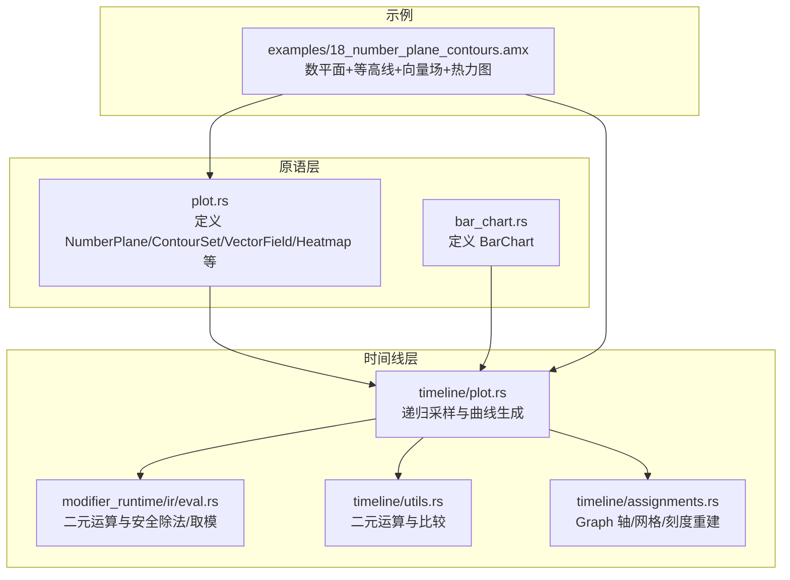
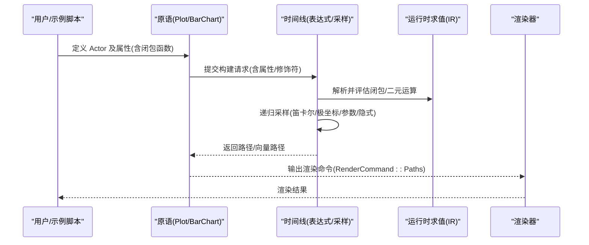
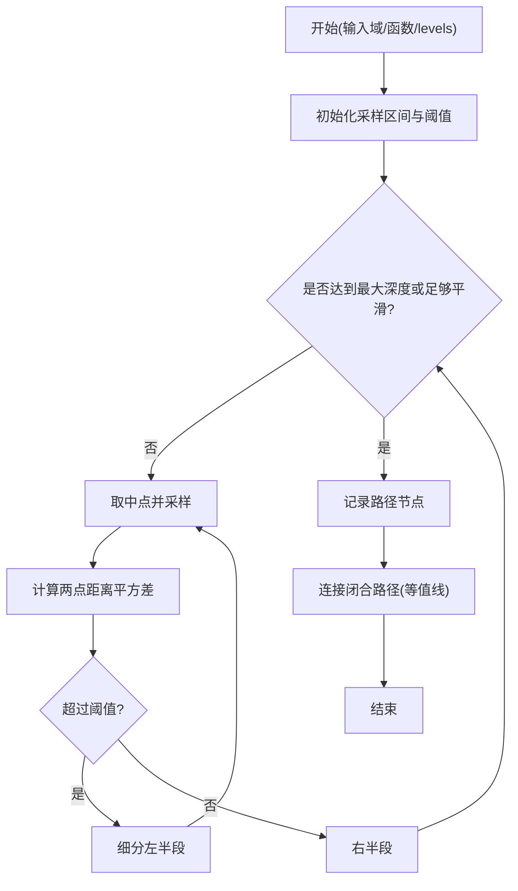
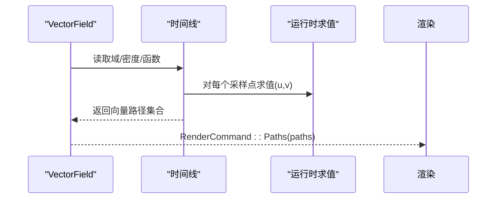
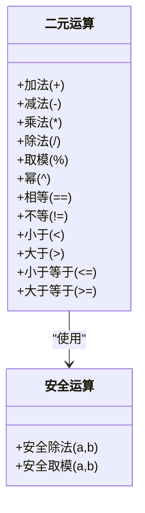
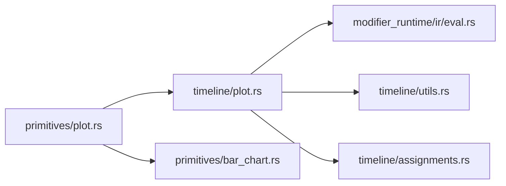

# 数学可视化

<cite>
**本文引用的文件**
- [crates/animatix/src/primitives/plot.rs](file://crates/animatix/src/primitives/plot.rs)
- [crates/animatix/src/timeline/plot.rs](file://crates/animatix/src/timeline/plot.rs)
- [crates/animatix/src/timeline/utils.rs](file://crates/animatix/src/timeline/utils.rs)
- [crates/animatix/src/timeline/modifier_runtime/ir/eval.rs](file://crates/animatix/src/timeline/modifier_runtime/ir/eval.rs)
- [crates/animatix/src/timeline/assignments.rs](file://crates/animatix/src/timeline/assignments.rs)
- [examples/18_number_plane_contours.amx](file://examples/18_number_plane_contours.amx)
- [docs/design/bar_chart_primitive.md](file://docs/design/bar_chart_primitive.md)
- [docs/primitives.md](file://docs/primitives.md)
- [docs/FFT_THOUGHT_EXPERIMENT.md](file://docs/FFT_THOUGHT_EXPERIMENT.md)
</cite>

## 目录
1. 引言
2. 项目结构
3. 核心组件
4. 架构总览
5. 组件详解
6. 依赖关系分析
7. 性能考量
8. 故障排查指南
9. 结论
10. 附录

## 引言
本指南面向希望在 Animatix 中进行数学可视化的用户与开发者，系统讲解如何绘制数平面、等高线（轮廓线）、向量场与统计图表，并解释数学表达式的语法与数值计算方法。文档覆盖从基础到进阶的主题：二维函数、参数曲线、极坐标、隐式曲线、三维函数的投影与切片思路、统计直方图/柱状图、以及热力图等。同时提供数学精度控制、性能优化与交互式探索的实践建议。

## 项目结构
Animatix 的数学可视化能力由“原语层”（primitives）与“时间线采样与渲染管线”共同实现：
- 原语层定义了具体的绘图类型（如 NumberPlane、ContourSet、VectorField、Heatmap、BarChart 等），并声明默认属性与构建流程。
- 时间线层负责解析表达式、执行递归采样算法、生成路径与向量路径，并将其交给渲染后端。
- 示例场景展示了这些原语的组合与动画效果。

**图表来源**
- [crates/animatix/src/primitives/plot.rs:150-349](file://crates/animatix/src/primitives/plot.rs#L150-L349)
- [crates/animatix/src/primitives/bar_chart.rs:1-59](file://crates/animatix/src/primitives/bar_chart.rs#L1-L59)
- [crates/animatix/src/timeline/plot.rs:43-739](file://crates/animatix/src/timeline/plot.rs#L43-L739)
- [crates/animatix/src/timeline/modifier_runtime/ir/eval.rs:577-627](file://crates/animatix/src/timeline/modifier_runtime/ir/eval.rs#L577-L627)
- [crates/animatix/src/timeline/utils.rs:217-255](file://crates/animatix/src/timeline/utils.rs#L217-L255)
- [crates/animatix/src/timeline/assignments.rs:462-489](file://crates/animatix/src/timeline/assignments.rs#L462-L489)
- [examples/18_number_plane_contours.amx:1-48](file://examples/18_number_plane_contours.amx#L1-L48)

**章节来源**
- [crates/animatix/src/primitives/plot.rs:150-349](file://crates/animatix/src/primitives/plot.rs#L150-L349)
- [crates/animatix/src/timeline/plot.rs:43-739](file://crates/animatix/src/timeline/plot.rs#L43-L739)
- [examples/18_number_plane_contours.amx:1-48](file://examples/18_number_plane_contours.amx#L1-L48)

## 核心组件
- 数平面（NumberPlane）
  - 作用：作为背景网格，提供带刻度与标签的坐标系。
  - 关键属性：x/y 域、尺寸、网格/刻度开关、颜色与线宽。
  - 实现要点：通过环境变量存储父图的域与尺寸，用于子图（如 PlotCurve/BarChart）坐标映射。

- 等高线集（ContourSet）
  - 作用：绘制二元标量函数的等值线（水平截面/等高线）。
  - 关键属性：函数体、等值集合、分辨率、域、尺寸。
  - 实现要点：基于递归细分采样，按阈值生成闭合路径。

- 向量场（VectorField）
  - 作用：在二维域内按密度采样，绘制方向场箭头或流线。
  - 关键属性：函数体（返回二维向量）、密度、域、尺寸。
  - 实现要点：将函数值映射为屏幕方向与长度，生成向量路径。

- 热力图（Heatmap）
  - 作用：以颜色深浅表示二元函数的数值大小。
  - 关键属性：函数体、分辨率、域、尺寸。
  - 实现要点：在规则网格上采样函数值，映射到色带并填充矩形路径。

- 柱状图（BarChart）
  - 作用：展示离散数据的频次或强度。
  - 关键属性：数据列表、条宽、间距、颜色、方向、轴显示、最大值等。
  - 实现要点：在独立或父图坐标系中，将数值映射为矩形路径。

**章节来源**
- [crates/animatix/src/primitives/plot.rs:150-349](file://crates/animatix/src/primitives/plot.rs#L150-L349)
- [crates/animatix/src/primitives/bar_chart.rs:1-59](file://crates/animatix/src/primitives/bar_chart.rs#L1-L59)
- [docs/design/bar_chart_primitive.md:346-501](file://docs/design/bar_chart_primitive.md#L346-L501)
- [docs/primitives.md:335-380](file://docs/primitives.md#L335-L380)

## 架构总览
下图展示了从表达式到渲染命令的关键流程：原语构建 → 表达式求值 → 递归采样 → 路径生成 → 渲染命令输出。

**图表来源**
- [crates/animatix/src/primitives/plot.rs:150-211](file://crates/animatix/src/primitives/plot.rs#L150-L211)
- [crates/animatix/src/timeline/plot.rs:65-739](file://crates/animatix/src/timeline/plot.rs#L65-L739)
- [crates/animatix/src/timeline/modifier_runtime/ir/eval.rs:577-627](file://crates/animatix/src/timeline/modifier_runtime/ir/eval.rs#L577-L627)

## 组件详解

### 数平面（NumberPlane）
- 功能定位：提供数学坐标系网格与刻度，作为其他绘图的背景。
- 关键点：
  - 域与尺寸来自父图环境变量，确保子图坐标一致。
  - 支持开启网格、刻度与标签，标签位置保持屏幕空间以保证可读性。
- 使用建议：
  - 在 Graph 内部统一管理域与尺寸，避免子图自设域导致不一致。
  - 对于高频细节，适当降低网格密度或关闭部分刻度。

**章节来源**
- [crates/animatix/src/timeline/assignments.rs:462-489](file://crates/animatix/src/timeline/assignments.rs#L462-L489)
- [docs/design/bar_chart_primitive.md:463-473](file://docs/design/bar_chart_primitive.md#L463-L473)

### 等高线集（ContourSet）
- 采样策略：递归细分，依据两点间屏幕距离平方差阈值决定是否进一步细分。
- 关键参数：
  - levels：等值集合，决定轮廓层级。
  - resolution：采样密度，影响平滑度与性能。
  - tolerance：容差阈值，平衡精度与采样数量。
- 复杂度与性能：
  - 递归深度与缓存哈希键共同影响采样成本；合理设置 tolerance 与 max_depth 可显著优化。
- 示例参考：
  - 示例场景中，ContourSet 与 NumberPlane 并置，配合 VectorField 与 Heatmap 形成多维信息叠加。

**图表来源**
- [crates/animatix/src/timeline/plot.rs:65-120](file://crates/animatix/src/timeline/plot.rs#L65-L120)
- [crates/animatix/src/timeline/plot.rs:721-739](file://crates/animatix/src/timeline/plot.rs#L721-L739)

**章节来源**
- [crates/animatix/src/primitives/plot.rs:276-349](file://crates/animatix/src/primitives/plot.rs#L276-L349)
- [crates/animatix/src/timeline/plot.rs:25-739](file://crates/animatix/src/timeline/plot.rs#L25-L739)
- [examples/18_number_plane_contours.amx:14-17](file://examples/18_number_plane_contours.amx#L14-L17)

### 向量场（VectorField）
- 输入：函数 (x,y) -> (u,v)，返回二维向量。
- 密度：控制采样点数量，密度越高越精细但更耗时。
- 输出：向量路径（箭头或流线段），可叠加在数平面之上。
- 应用：流体力学、场论教学、稳定性分析等。

**图表来源**
- [crates/animatix/src/primitives/plot.rs:150-211](file://crates/animatix/src/primitives/plot.rs#L150-L211)
- [crates/animatix/src/timeline/plot.rs:65-120](file://crates/animatix/src/timeline/plot.rs#L65-L120)

**章节来源**
- [crates/animatix/src/primitives/plot.rs:150-211](file://crates/animatix/src/primitives/plot.rs#L150-L211)
- [examples/18_number_plane_contours.amx:19-22](file://examples/18_number_plane_contours.amx#L19-L22)

### 热力图（Heatmap）
- 输入：函数 (x,y) -> z。
- 分辨率：决定网格细密程度；分辨率越高越平滑但更慢。
- 颜色映射：将 z 映射到色带，填充矩形路径形成热力图块。
- 适用：概率密度、标量场可视化、误差分布等。

**章节来源**
- [crates/animatix/src/primitives/plot.rs:213-259](file://crates/animatix/src/primitives/plot.rs#L213-L259)
- [examples/18_number_plane_contours.amx:24-27](file://examples/18_number_plane_contours.amx#L24-L27)

### 柱状图（BarChart）
- 数据：(key, value) 列表；支持垂直/水平两种方向。
- 样式：条宽、间距、颜色、边框、轴显示、最大值等。
- 坐标系：独立坐标系或作为 Graph 子图共享父图域。
- 动画：通过关键帧改变数据或样式，实现增长/切换等效果。

**章节来源**
- [crates/animatix/src/primitives/bar_chart.rs:1-59](file://crates/animatix/src/primitives/bar_chart.rs#L1-L59)
- [docs/design/bar_chart_primitive.md:346-501](file://docs/design/bar_chart_primitive.md#L346-L501)
- [docs/primitives.md:335-380](file://docs/primitives.md#L335-L380)

### 数学表达式语法与数值计算
- 闭包函数：(x,y) => ... 或 (t) => ...，支持二元运算与比较。
- 运算支持：加减乘除、取模、幂、相等/不等、大小比较等。
- 安全运算：提供安全除法与取模，避免异常。
- 比较运算：返回 0/1，便于条件逻辑与阈值处理。

**图表来源**
- [crates/animatix/src/timeline/modifier_runtime/ir/eval.rs:577-627](file://crates/animatix/src/timeline/modifier_runtime/ir/eval.rs#L577-L627)
- [crates/animatix/src/timeline/utils.rs:217-255](file://crates/animatix/src/timeline/utils.rs#L217-L255)

**章节来源**
- [crates/animatix/src/timeline/modifier_runtime/ir/eval.rs:577-627](file://crates/animatix/src/timeline/modifier_runtime/ir/eval.rs#L577-L627)
- [crates/animatix/src/timeline/utils.rs:217-255](file://crates/animatix/src/timeline/utils.rs#L217-L255)

### 复杂数学概念的可视化方案
- 三维函数的二维投影：
  - 将 z = f(x,y) 投影到二维：固定视角切片（z=常数）得到等高线；或采用伪彩深浅（热力图）表示高度。
  - 参数曲面：先在参数域采样，再映射到三维坐标，最后投影到二维屏幕。
- 参数曲线与极坐标：
  - 参数曲线：(x(t), y(t))，通过参数步进采样生成路径。
  - 极坐标：(r(θ), θ)，先计算 r 再转笛卡尔坐标。
- 隐式曲线：
  - 通过等值线采样（ContourSet）在 f(x,y)=0 处生成曲线；或使用符号距离场的零等值线。
- 统计分布：
  - 直方图/柱状图：离散化样本区间，统计频次。
  - 密度图：核密度估计后用热力图呈现。

**章节来源**
- [crates/animatix/src/timeline/plot.rs:43-739](file://crates/animatix/src/timeline/plot.rs#L43-L739)
- [docs/design/bar_chart_primitive.md:346-501](file://docs/design/bar_chart_primitive.md#L346-L501)

### 数学可视化艺术性与科学性结合
- 科学性：严格的坐标映射、数值精度控制、合理的采样策略与阈值设定。
- 艺术性：色彩搭配、线宽与透明度、动画过渡、布局与留白。
- 实践建议：
  - 使用统一的颜色方案与对比度，确保不同图层叠加清晰。
  - 控制动画节奏与持续时间，突出变化趋势而非炫技。
  - 在复杂场景中分层渲染，先背景网格/轴，再曲线/场，最后标注与高亮。

**章节来源**
- [examples/18_number_plane_contours.amx:1-48](file://examples/18_number_plane_contours.amx#L1-L48)
- [docs/FFT_THOUGHT_EXPERIMENT.md:236-288](file://docs/FFT_THOUGHT_EXPERIMENT.md#L236-L288)

## 依赖关系分析
- 原语层依赖时间线层提供的表达式求值与采样算法。
- 时间线层内部依赖运行时求值模块与工具模块完成二元运算与安全运算。
- Graph 环境变量为子图提供坐标映射，确保一致性。

**图表来源**
- [crates/animatix/src/primitives/plot.rs:150-349](file://crates/animatix/src/primitives/plot.rs#L150-L349)
- [crates/animatix/src/primitives/bar_chart.rs:1-59](file://crates/animatix/src/primitives/bar_chart.rs#L1-L59)
- [crates/animatix/src/timeline/plot.rs:43-739](file://crates/animatix/src/timeline/plot.rs#L43-L739)
- [crates/animatix/src/timeline/modifier_runtime/ir/eval.rs:577-627](file://crates/animatix/src/timeline/modifier_runtime/ir/eval.rs#L577-L627)
- [crates/animatix/src/timeline/utils.rs:217-255](file://crates/animatix/src/timeline/utils.rs#L217-L255)
- [crates/animatix/src/timeline/assignments.rs:462-489](file://crates/animatix/src/timeline/assignments.rs#L462-L489)

**章节来源**
- [crates/animatix/src/primitives/plot.rs:150-349](file://crates/animatix/src/primitives/plot.rs#L150-L349)
- [crates/animatix/src/timeline/plot.rs:43-739](file://crates/animatix/src/timeline/plot.rs#L43-L739)

## 性能考量
- 采样与递归：
  - tolerance 与 max_depth 控制曲线精度与采样成本；过小 tolerance 会显著增加点数。
  - 缓存中间结果可减少重复计算（例如按哈希键缓存采样值）。
- 密度与分辨率：
  - VectorField 与 Heatmap 的密度/分辨率直接影响渲染时间；根据屏幕尺寸与目标清晰度折中选择。
- 图层叠加：
  - 多图层叠加时优先绘制静态背景（如数平面网格），再绘制动态曲线/场，最后添加标注。
- 动画策略：
  - 关键帧之间重用稳定拓扑（如 BarChart 的矩形路径顺序）有利于插值与过渡。

**章节来源**
- [crates/animatix/src/timeline/plot.rs:25-739](file://crates/animatix/src/timeline/plot.rs#L25-L739)
- [docs/design/bar_chart_primitive.md:339-345](file://docs/design/bar_chart_primitive.md#L339-L345)

## 故障排查指南
- 函数未生效或无输出：
  - 检查闭包参数名与调用是否一致；确认函数体返回合法数值。
  - 对于 ContourSet/VectorField/Heatmap，确认 x_domain/y_domain 与 size 设置合理。
- 等高线断裂或不闭合：
  - 降低 tolerance 或提高 resolution；检查 levels 是否覆盖函数值范围。
- 向量场稀疏或方向异常：
  - 提高 density；检查函数返回的向量方向与幅度是否符合预期。
- 颜色映射异常：
  - 确认 z 值范围与色带映射一致；必要时显式设置颜色范围。
- 动画抖动或跳变：
  - 固定 max_value（如 BarChart）；确保关键帧时间与缓动函数匹配。

**章节来源**
- [crates/animatix/src/timeline/plot.rs:25-739](file://crates/animatix/src/timeline/plot.rs#L25-L739)
- [crates/animatix/src/timeline/modifier_runtime/ir/eval.rs:577-627](file://crates/animatix/src/timeline/modifier_runtime/ir/eval.rs#L577-L627)
- [docs/design/bar_chart_primitive.md:339-345](file://docs/design/bar_chart_primitive.md#L339-L345)

## 结论
Animatix 提供了从基础数平面到高级向量场与热力图的完整数学可视化能力。通过明确的表达式语法、严谨的递归采样与安全运算，以及灵活的属性与动画系统，用户可以在科学准确性与视觉表现之间取得良好平衡。建议在实践中以示例为起点，逐步调整精度与性能参数，并结合动画与交互提升教学与演示效果。

## 附录
- 示例场景参考：数平面与等高线、向量场、热力图的组合使用。
- 未来扩展方向：命名函数抽象、强调/高亮动作、自动图例与标注原语等。

**章节来源**
- [examples/18_number_plane_contours.amx:1-48](file://examples/18_number_plane_contours.amx#L1-L48)
- [docs/FFT_THOUGHT_EXPERIMENT.md:236-288](file://docs/FFT_THOUGHT_EXPERIMENT.md#L236-L288)