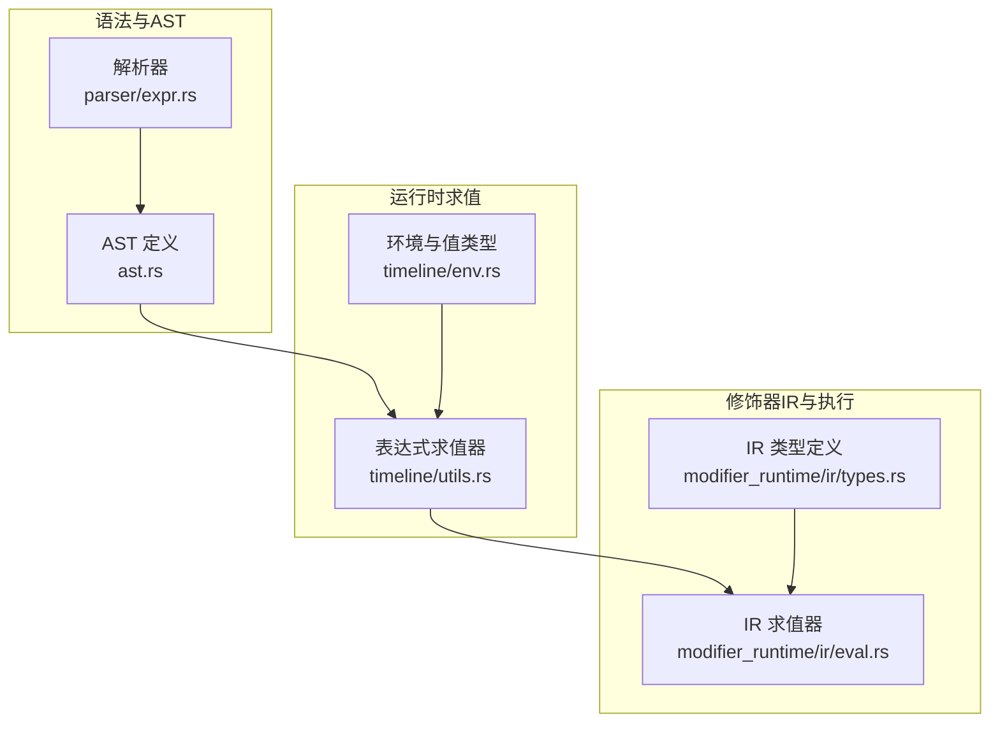
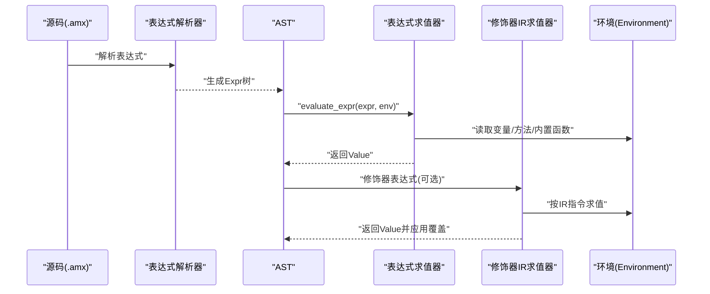
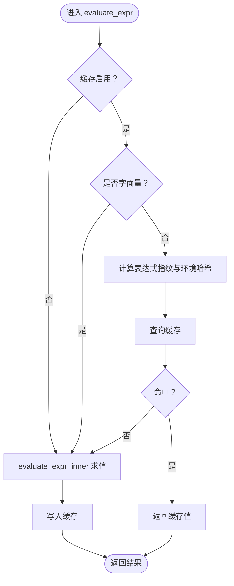
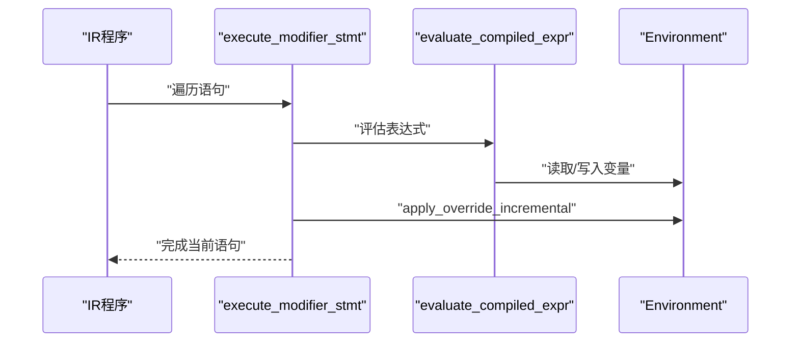
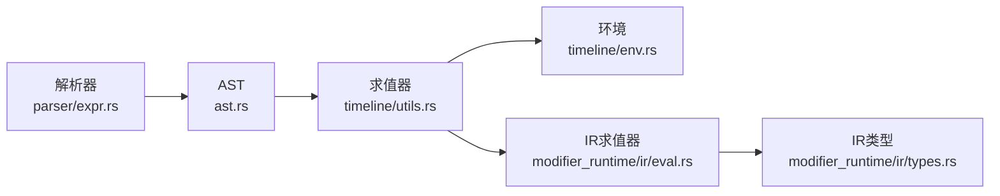

# 表达式系统

<cite>
**本文引用的文件**
- [crates/animatix-syntax/src/ast.rs](file://crates/animatix-syntax/src/ast.rs)
- [crates/animatix-syntax/src/parser/expr.rs](file://crates/animatix-syntax/src/parser/expr.rs)
- [crates/animatix/src/timeline/env.rs](file://crates/animatix/src/timeline/env.rs)
- [crates/animatix/src/timeline/utils.rs](file://crates/animatix/src/timeline/utils.rs)
- [crates/animatix/src/timeline/modifier_runtime/ir/eval.rs](file://crates/animatix/src/timeline/modifier_runtime/ir/eval.rs)
- [crates/animatix/src/timeline/modifier_runtime/ir/types.rs](file://crates/animatix/src/timeline/modifier_runtime/ir/types.rs)
- [crates/animatix/benches/vm_vs_ir.rs](file://crates/animatix/benches/vm_vs_ir.rs)
- [crates/animatix/benches/modifier_runtime.rs](file://crates/animatix/benches/modifier_runtime.rs)
- [examples/22_expressions.amx](file://examples/22_expressions.amx)
</cite>

## 目录
1. [引言](#引言)
2. [项目结构](#项目结构)
3. [核心组件](#核心组件)
4. [架构总览](#架构总览)
5. [详细组件分析](#详细组件分析)
6. [依赖关系分析](#依赖关系分析)
7. [性能考量](#性能考量)
8. [故障排查指南](#故障排查指南)
9. [结论](#结论)
10. [附录](#附录)

## 引言
本文件系统性阐述 Animatix 的表达式系统：从语法与解析、到运行时求值、类型系统与作用域、再到修饰器执行与性能优化。目标是帮助开发者高效编写数学表达式、逻辑运算与函数调用，正确处理类型与作用域，掌握复杂表达式的调试技巧，并将其应用于动画参数、条件控制与动态计算中。

## 项目结构
表达式系统由“语法定义与解析”“运行时环境与求值”“修饰器中间表示（IR）与执行”三部分组成，贯穿于时间线构建、修饰器评估与渲染管线之间。

图示来源
- [crates/animatix-syntax/src/parser/expr.rs:1-257](file://crates/animatix-syntax/src/parser/expr.rs#L1-L257)
- [crates/animatix-syntax/src/ast.rs:100-188](file://crates/animatix-syntax/src/ast.rs#L100-L188)
- [crates/animatix/src/timeline/env.rs:43-69](file://crates/animatix/src/timeline/env.rs#L43-L69)
- [crates/animatix/src/timeline/utils.rs:132-597](file://crates/animatix/src/timeline/utils.rs#L132-L597)
- [crates/animatix/src/timeline/modifier_runtime/ir/eval.rs:1-834](file://crates/animatix/src/timeline/modifier_runtime/ir/eval.rs#L1-L834)
- [crates/animatix/src/timeline/modifier_runtime/ir/types.rs](file://crates/animatix/src/timeline/modifier_runtime/ir/types.rs)

章节来源
- [crates/animatix-syntax/src/parser/expr.rs:1-257](file://crates/animatix-syntax/src/parser/expr.rs#L1-L257)
- [crates/animatix-syntax/src/ast.rs:100-188](file://crates/animatix-syntax/src/ast.rs#L100-L188)
- [crates/animatix/src/timeline/env.rs:43-69](file://crates/animatix/src/timeline/env.rs#L43-L69)
- [crates/animatix/src/timeline/utils.rs:132-597](file://crates/animatix/src/timeline/utils.rs#L132-L597)
- [crates/animatix/src/timeline/modifier_runtime/ir/eval.rs:1-834](file://crates/animatix/src/timeline/modifier_runtime/ir/eval.rs#L1-L834)

## 核心组件
- 语法与AST
  - 表达式类型覆盖字面量、标识符、路径访问、索引、元组/列表、二元/一元运算、函数/方法调用、条件表达式、构造体等。
  - 解析器按运算符优先级递归构建表达式树，支持前缀运算、点号字段访问、括号分组、幂次优先、乘除模加减、比较与逻辑与或、三元条件与闭包。
- 运行时环境与值类型
  - 值类型包括标量、字符串、布尔、向量（2/3/4）、颜色、列表、对象、原生函数与闭包。
  - 环境采用“基础层 + 覆盖层 + 双绑定槽”的设计，避免每次帧复制大量标准库条目；支持按名查找、零拷贝引用、批量扩展与键集合查询。
- 表达式求值器
  - 支持安全除法/取模、类型多态的二元运算、路径访问与索引、格式化函数、方法调用（字符串/列表/数值）。
  - 内置线程局部缓存，以“表达式指纹 + 环境哈希”为键，避免同一表达式在同一环境中重复求值。
- 修饰器IR与执行
  - 将常用表达式编译为IR指令，提供常量加载、向量构造、一元/二元运算、条件选择、内置函数调用、索引与方法调用等。
  - 在修饰器语句执行阶段，逐条评估并增量应用属性覆盖，支持条件分支与迭代。

章节来源
- [crates/animatix-syntax/src/ast.rs:100-188](file://crates/animatix-syntax/src/ast.rs#L100-L188)
- [crates/animatix-syntax/src/parser/expr.rs:167-257](file://crates/animatix-syntax/src/parser/expr.rs#L167-L257)
- [crates/animatix/src/timeline/env.rs:43-69](file://crates/animatix/src/timeline/env.rs#L43-L69)
- [crates/animatix/src/timeline/env.rs:200-355](file://crates/animatix/src/timeline/env.rs#L200-L355)
- [crates/animatix/src/timeline/utils.rs:132-597](file://crates/animatix/src/timeline/utils.rs#L132-L597)
- [crates/animatix/src/timeline/modifier_runtime/ir/eval.rs:1-834](file://crates/animatix/src/timeline/modifier_runtime/ir/eval.rs#L1-L834)

## 架构总览
表达式系统在“解析—AST—求值—IR—执行”的链路上协同工作，既保证灵活性（原生表达式），也兼顾性能（IR编译与缓存）。

图示来源
- [crates/animatix-syntax/src/parser/expr.rs:16-257](file://crates/animatix-syntax/src/parser/expr.rs#L16-L257)
- [crates/animatix/src/timeline/utils.rs:132-597](file://crates/animatix/src/timeline/utils.rs#L132-L597)
- [crates/animatix/src/timeline/modifier_runtime/ir/eval.rs:100-237](file://crates/animatix/src/timeline/modifier_runtime/ir/eval.rs#L100-L237)

## 详细组件分析

### 语法与解析（表达式）
- 支持的表达式形态
  - 字面量：数字、百分比、字符串、布尔、空值。
  - 访问：标识符、点号路径、索引（容器/字符串/向量/颜色）。
  - 容器：元组（长度2/3/4推导为向量，其他长度转为列表）、列表。
  - 运算：一元（负号、逻辑非）、二元（加减乘除模幂、比较、逻辑与或）。
  - 调用：函数调用、方法调用、闭包、条件表达式、类型构造。
- 运算符优先级与结合性
  - 幂次最高，乘除模次之，加减再次之，比较最后；逻辑与/或最低。
  - 二元运算右结合（幂），其余左结合；比较链式支持（如 a < b < c）。
- 关键实现要点
  - 使用递归子表达式与 foldl/repeated 组合，确保优先级与结合性正确。
  - 条件表达式与闭包语法明确，便于在修饰器与主表达式中复用。

章节来源
- [crates/animatix-syntax/src/parser/expr.rs:16-257](file://crates/animatix-syntax/src/parser/expr.rs#L16-L257)
- [crates/animatix-syntax/src/ast.rs:100-188](file://crates/animatix-syntax/src/ast.rs#L100-L188)

### 运行时求值（表达式求值器）
- 值类型与类型转换
  - 提供 as_num/as_str/as_bool/as_vec*/as_color/as_list 等统一提取接口，便于二元运算与方法调用。
  - 对象类型用于构造体字面量，字段通过路径访问或索引读取。
- 二元运算与类型多态
  - 数值与数值：支持全部算术与比较/逻辑运算。
  - 向量/颜色与向量/颜色：仅支持逐分量加减乘除（除/模使用安全实现）。
  - 向量/颜色与数值：广播到对应维度。
  - 其他不兼容组合：抛出类型不匹配错误。
- 方法调用
  - 字符串：length/split/contains/trim/startsWith/endsWith。
  - 列表：length/get/contains。
  - 数值：abs/floor/ceil/round。
- 函数调用
  - format：模板字符串占位替换，支持多种值类型的格式化。
  - 闭包：按调用时环境克隆并绑定参数后求值。
- 缓存与性能
  - 线程局部缓存：以“表达式指纹 + 环境哈希”为键，命中则直接返回。
  - 可禁用缓存：在密集采样场景（如绘图采样）中关闭缓存以避免抖动。
  - 安全除法/取模：除数为0时返回0，避免崩溃。

图示来源
- [crates/animatix/src/timeline/utils.rs:132-168](file://crates/animatix/src/timeline/utils.rs#L132-L168)
- [crates/animatix/src/timeline/utils.rs:170-597](file://crates/animatix/src/timeline/utils.rs#L170-L597)

章节来源
- [crates/animatix/src/timeline/env.rs:43-69](file://crates/animatix/src/timeline/env.rs#L43-L69)
- [crates/animatix/src/timeline/env.rs:109-198](file://crates/animatix/src/timeline/env.rs#L109-L198)
- [crates/animatix/src/timeline/utils.rs:132-597](file://crates/animatix/src/timeline/utils.rs#L132-L597)

### 修饰器IR与执行
- IR指令集
  - 常量、环境变量加载、向量构造、一元/二元运算、条件选择、内置函数调用、索引、方法调用。
  - 内置函数覆盖常见数学与格式化需求，如三角函数、插值、开方、指数、对数、夹取、取整、角度弧度换算、格式化等。
- 执行流程
  - 逐条执行修饰器IR语句：赋值（记录覆盖并增量应用）、局部变量声明、条件分支、迭代（列表/向量展开）。
  - 修饰器表达式可走IR或回退到通用求值器（Unsupported路径）。

图示来源
- [crates/animatix/src/timeline/modifier_runtime/ir/eval.rs:20-97](file://crates/animatix/src/timeline/modifier_runtime/ir/eval.rs#L20-L97)
- [crates/animatix/src/timeline/modifier_runtime/ir/eval.rs:100-237](file://crates/animatix/src/timeline/modifier_runtime/ir/eval.rs#L100-L237)

章节来源
- [crates/animatix/src/timeline/modifier_runtime/ir/eval.rs:1-834](file://crates/animatix/src/timeline/modifier_runtime/ir/eval.rs#L1-L834)
- [crates/animatix/src/timeline/modifier_runtime/ir/types.rs](file://crates/animatix/src/timeline/modifier_runtime/ir/types.rs)

### 类型系统与作用域规则
- 类型系统
  - 标量：Num（f64）、Bool、Str。
  - 复合：Vec2/Vec3/Vec4、Color、List、Object。
  - 可调用：NativeFn、Closure。
  - 类型转换：统一的 as_* 接口；二元运算按“数值/向量/颜色/列表/字符串”进行多态分派。
- 作用域与环境
  - 双绑定槽：为绘图采样等场景提供 x/y 快速注入，避免频繁克隆覆盖层。
  - 基础层共享：标准库函数与常量只在基础层维护，减少每帧复制成本。
  - 查找顺序：绑定槽 → 覆盖层 → 基础层 → 抛出未定义变量错误。
  - 路径访问：支持“a.b.c”形式的多段路径，先尝试整体键，再逐步对象字段遍历。

章节来源
- [crates/animatix/src/timeline/env.rs:43-69](file://crates/animatix/src/timeline/env.rs#L43-L69)
- [crates/animatix/src/timeline/env.rs:200-355](file://crates/animatix/src/timeline/env.rs#L200-L355)
- [crates/animatix/src/timeline/utils.rs:490-515](file://crates/animatix/src/timeline/utils.rs#L490-L515)

### 错误处理与诊断
- 常见错误
  - 未定义变量、类型不匹配、不可调用、不支持的方法、不支持的索引、不支持的构造体。
- 诊断建议
  - 检查变量拼写与作用域层级；确认二元运算两侧类型兼容；核对方法名与接收者类型。
  - 在密集采样场景临时禁用缓存以定位抖动问题。

章节来源
- [crates/animatix/src/timeline/env.rs:5-21](file://crates/animatix/src/timeline/env.rs#L5-L21)
- [crates/animatix/src/timeline/utils.rs:132-597](file://crates/animatix/src/timeline/utils.rs#L132-L597)

### 应用示例与最佳实践
- 动画参数
  - 使用数学表达式与内置函数（如三角、插值、夹取）驱动位置、尺寸、透明度等属性随时间变化。
- 条件控制
  - 使用条件表达式与逻辑运算在属性赋值与修饰器中实现分支与切换。
- 动态计算
  - 通过闭包与函数调用实现参数化与复用；利用对象构造体与路径访问组织复杂状态。
- 性能优化
  - 在修饰器中优先使用IR表达式；在主表达式中合理缓存；避免在热路径上频繁创建大对象。
  - 在密集采样（如绘图）时禁用缓存，结束后恢复启用。

章节来源
- [crates/animatix/src/timeline/modifier_runtime/ir/eval.rs:100-237](file://crates/animatix/src/timeline/modifier_runtime/ir/eval.rs#L100-L237)
- [crates/animatix/src/timeline/utils.rs:132-168](file://crates/animatix/src/timeline/utils.rs#L132-L168)

## 依赖关系分析
表达式系统内部模块耦合清晰，职责分离良好：解析器负责语法到AST的映射；求值器负责运行时计算；IR执行器负责修饰器场景的高性能路径。

图示来源
- [crates/animatix-syntax/src/parser/expr.rs:16-257](file://crates/animatix-syntax/src/parser/expr.rs#L16-L257)
- [crates/animatix-syntax/src/ast.rs:100-188](file://crates/animatix-syntax/src/ast.rs#L100-L188)
- [crates/animatix/src/timeline/utils.rs:132-597](file://crates/animatix/src/timeline/utils.rs#L132-L597)
- [crates/animatix/src/timeline/env.rs:200-355](file://crates/animatix/src/timeline/env.rs#L200-L355)
- [crates/animatix/src/timeline/modifier_runtime/ir/eval.rs:100-237](file://crates/animatix/src/timeline/modifier_runtime/ir/eval.rs#L100-L237)

章节来源
- [crates/animatix/src/timeline/utils.rs:132-597](file://crates/animatix/src/timeline/utils.rs#L132-L597)
- [crates/animatix/src/timeline/modifier_runtime/ir/eval.rs:100-237](file://crates/animatix/src/timeline/modifier_runtime/ir/eval.rs#L100-L237)

## 性能考量
- 缓存策略
  - 表达式指纹 + 环境哈希的两级缓存，显著降低重复求值成本；可通过开关禁用以适配高频抖动场景。
- IR路径
  - 修饰器表达式优先走IR指令，内置函数直接实现，避免通用求值器的分支开销。
- 安全运算
  - 除法/取模的安全实现避免异常，提升稳定性与性能一致性。
- 基准测试
  - 提供修饰器评估与虚拟机/IR对比的基准，便于回归与优化。

章节来源
- [crates/animatix/src/timeline/utils.rs:132-168](file://crates/animatix/src/timeline/utils.rs#L132-L168)
- [crates/animatix/src/timeline/modifier_runtime/ir/eval.rs:100-237](file://crates/animatix/src/timeline/modifier_runtime/ir/eval.rs#L100-L237)
- [crates/animatix/benches/vm_vs_ir.rs:1-43](file://crates/animatix/benches/vm_vs_ir.rs#L1-L43)
- [crates/animatix/benches/modifier_runtime.rs:1-43](file://crates/animatix/benches/modifier_runtime.rs#L1-L43)

## 故障排查指南
- 常见症状与定位
  - “未定义变量”：检查作用域与拼写；确认变量是否在基础层或覆盖层中存在。
  - “类型不匹配”：核对二元运算两侧类型；向量/颜色与数值的广播是否符合预期。
  - “不可调用”：确认被调用项为函数或闭包；闭包参数数量是否一致。
  - “不支持的方法”：确认接收者类型与方法名是否匹配。
  - “索引越界”：核对容器长度与索引范围。
- 调试技巧
  - 在密集采样场景临时禁用缓存，观察结果是否稳定。
  - 将复杂表达式拆分为局部变量，逐步验证中间值。
  - 使用条件表达式与格式化输出辅助定位。

章节来源
- [crates/animatix/src/timeline/env.rs:5-21](file://crates/animatix/src/timeline/env.rs#L5-L21)
- [crates/animatix/src/timeline/utils.rs:132-597](file://crates/animatix/src/timeline/utils.rs#L132-L597)

## 结论
Animatix 的表达式系统以清晰的语法与AST为基础，配合灵活的运行时环境与高效的IR执行路径，在动画参数驱动、条件控制与动态计算方面提供了强大能力。通过理解类型系统、作用域规则与缓存机制，开发者可以编写高性能且易维护的表达式，充分发挥 Animatix 的表现力与效率。

## 附录
- 示例参考
  - 表达式示例文件可用于学习语法与常见模式。
- 相关基准
  - 修饰器评估与虚拟机/IR对比基准可用于性能回归检测。

章节来源
- [examples/22_expressions.amx](file://examples/22_expressions.amx)
- [crates/animatix/benches/vm_vs_ir.rs:1-43](file://crates/animatix/benches/vm_vs_ir.rs#L1-L43)
- [crates/animatix/benches/modifier_runtime.rs:1-43](file://crates/animatix/benches/modifier_runtime.rs#L1-L43)