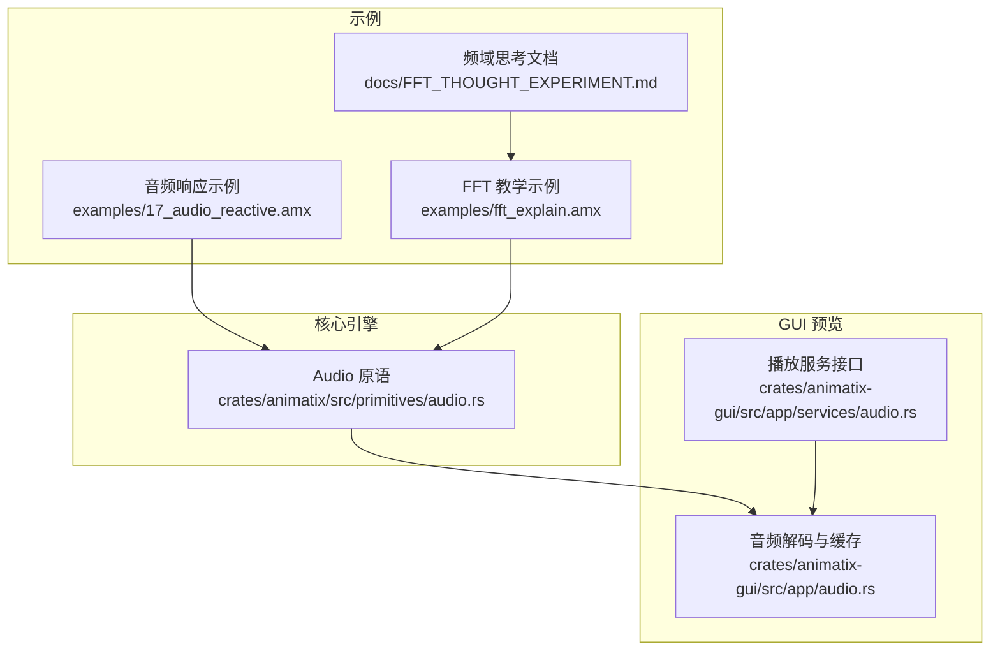
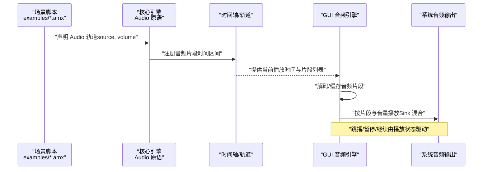
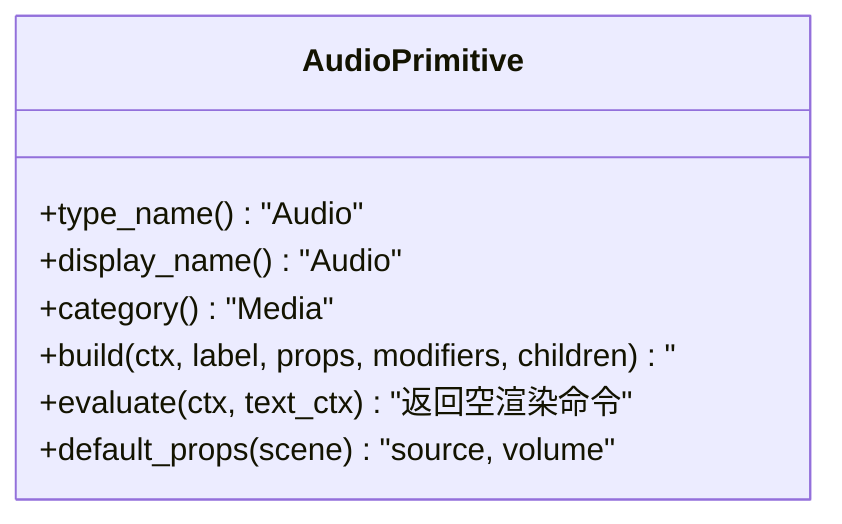
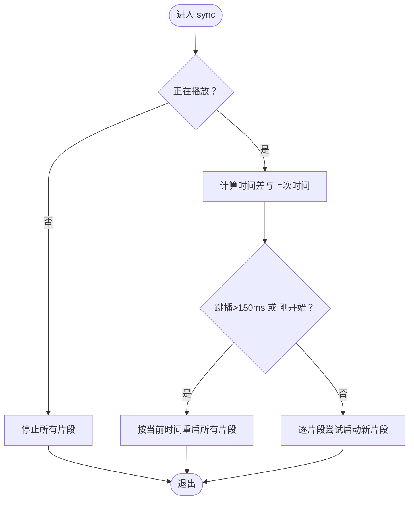
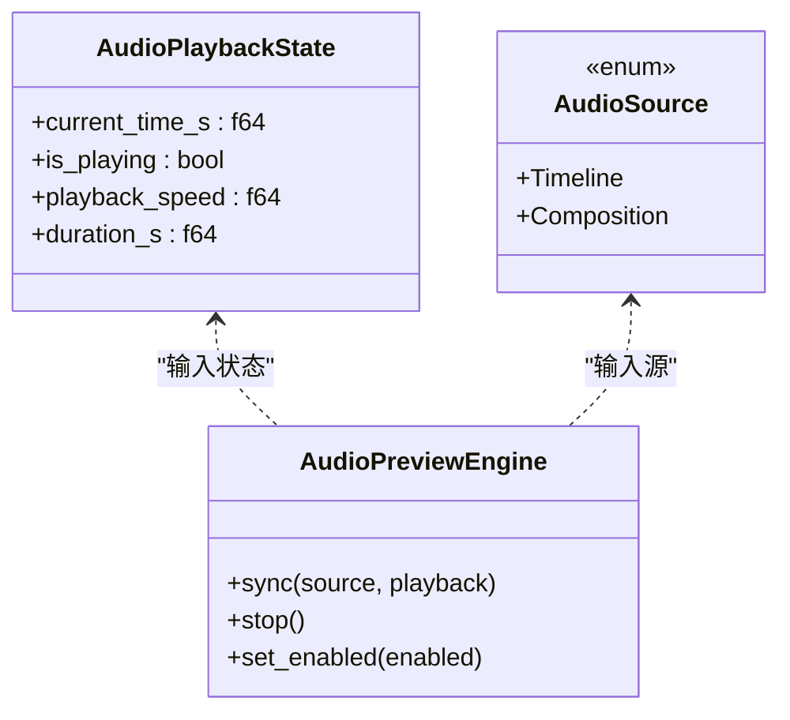
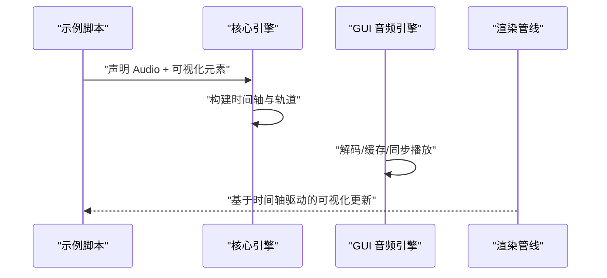
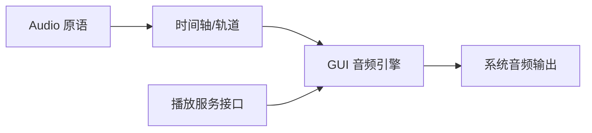

# 音频响应动画

<cite>
**本文引用的文件**
- [crates/animatix/src/primitives/audio.rs](file://crates/animatix/src/primitives/audio.rs)
- [crates/animatix-gui/src/app/audio.rs](file://crates/animatix-gui/src/app/audio.rs)
- [crates/animatix-gui/src/app/services/audio.rs](file://crates/animatix-gui/src/app/services/audio.rs)
- [examples/17_audio_reactive.amx](file://examples/17_audio_reactive.amx)
- [examples/fft_explain.amx](file://examples/fft_explain.amx)
- [docs/FFT_THOUGHT_EXPERIMENT.md](file://docs/FFT_THOUGHT_EXPERIMENT.md)
</cite>

## 目录
1. [引言](#引言)
2. [项目结构](#项目结构)
3. [核心组件](#核心组件)
4. [架构总览](#架构总览)
5. [详细组件分析](#详细组件分析)
6. [依赖关系分析](#依赖关系分析)
7. [性能考虑](#性能考虑)
8. [故障排查指南](#故障排查指南)
9. [结论](#结论)
10. [附录](#附录)

## 引言
本指南面向希望实现“音频驱动动画”的创作者与工程师，系统讲解如何在本项目中完成从“音频数据获取与处理”到“可视化呈现与响应”的完整流程。内容覆盖：
- 实时音频输入与音频文件播放的集成方式
- 音频数据（波形、频谱、节拍）的采集与处理思路
- 基于音频的动画设计原则与创意实践
- 可视化技术：波形显示、频谱图与动态效果
- 完整的音频处理管线与性能优化建议

本指南既适用于初学者快速上手，也提供面向高级用户的架构与实现细节。

## 项目结构
本项目采用多 Crate 的模块化组织，音频相关能力主要分布在以下位置：
- 核心引擎与原语定义：crates/animatix/src/primitives/audio.rs（声明 Audio 原语）
- GUI 预览与播放：crates/animatix-gui/src/app/audio.rs（解码、缓存、同步播放）
- 播放服务接口抽象：crates/animatix-gui/src/app/services/audio.rs（播放状态与同步接口）
- 示例场景：examples/17_audio_reactive.amx（非视觉音频 + 波形可视化示例）
- 教学演示与频域思考：examples/fft_explain.amx、docs/FFT_THOUGHT_EXPERIMENT.md（频域分解与可视化设计）

图表来源
- [crates/animatix/src/primitives/audio.rs:1-51](file://crates/animatix/src/primitives/audio.rs#L1-L51)
- [crates/animatix-gui/src/app/audio.rs:1-227](file://crates/animatix-gui/src/app/audio.rs#L1-L227)
- [crates/animatix-gui/src/app/services/audio.rs:1-49](file://crates/animatix-gui/src/app/services/audio.rs#L1-L49)
- [examples/17_audio_reactive.amx:1-23](file://examples/17_audio_reactive.amx#L1-L23)
- [examples/fft_explain.amx:1-90](file://examples/fft_explain.amx#L1-L90)
- [docs/FFT_THOUGHT_EXPERIMENT.md:166-234](file://docs/FFT_THOUGHT_EXPERIMENT.md#L166-L234)

章节来源
- [crates/animatix/src/primitives/audio.rs:1-51](file://crates/animatix/src/primitives/audio.rs#L1-L51)
- [crates/animatix-gui/src/app/audio.rs:1-227](file://crates/animatix-gui/src/app/audio.rs#L1-L227)
- [crates/animatix-gui/src/app/services/audio.rs:1-49](file://crates/animatix-gui/src/app/services/audio.rs#L1-L49)
- [examples/17_audio_reactive.amx:1-23](file://examples/17_audio_reactive.amx#L1-L23)
- [examples/fft_explain.amx:1-90](file://examples/fft_explain.amx#L1-L90)
- [docs/FFT_THOUGHT_EXPERIMENT.md:166-234](file://docs/FFT_THOUGHT_EXPERIMENT.md#L166-L234)

## 核心组件
- Audio 原语（非可视媒体）
  - 类型与分类：用于声明音频轨道，属于媒体类原语，不参与渲染，仅在导出时混音。
  - 关键职责：解析属性（如 source、volume），注册到时间轴的音频轨道中。
  - 默认属性：source（字符串）、volume（数值）。
- GUI 音频引擎
  - 解码与缓存：使用音频解码器将文件转为 PCM 缓冲，按路径缓存，避免重复解码。
  - 同步播放：根据时间轴播放进度，启动/重启片段，处理跳播与暂停。
  - 片段管理：记录当前活跃片段，支持多轨混合播放。
- 播放服务接口
  - 抽象播放状态：当前时间、播放状态、速度、总时长。
  - 同步接口：接收播放状态与源（时间轴或合成），驱动底层播放器。

章节来源
- [crates/animatix/src/primitives/audio.rs:10-51](file://crates/animatix/src/primitives/audio.rs#L10-L51)
- [crates/animatix-gui/src/app/audio.rs:10-227](file://crates/animatix-gui/src/app/audio.rs#L10-L227)
- [crates/animatix-gui/src/app/services/audio.rs:10-49](file://crates/animatix-gui/src/app/services/audio.rs#L10-L49)

## 架构总览
下图展示从“声明音频原语”到“GUI 预览播放”的端到端流程，以及与示例场景的衔接。

图表来源
- [crates/animatix/src/primitives/audio.rs:18-35](file://crates/animatix/src/primitives/audio.rs#L18-L35)
- [crates/animatix-gui/src/app/audio.rs:101-120](file://crates/animatix-gui/src/app/audio.rs#L101-L120)
- [crates/animatix-gui/src/app/services/audio.rs:25-34](file://crates/animatix-gui/src/app/services/audio.rs#L25-L34)

## 详细组件分析

### 组件一：Audio 原语（非可视媒体）
- 角色定位：声明式音频轨道，参与导出混音，不直接渲染。
- 关键行为：
  - 构建阶段：将属性与修饰符传递给时间轴处理函数，登记音频片段。
  - 评估阶段：返回空渲染命令，确保该原语不影响画面绘制。
  - 默认属性：source（音频路径）、volume（音量）。
- 设计意义：将“声音”与“画面”解耦，便于在动画中独立控制音频。

图表来源
- [crates/animatix/src/primitives/audio.rs:10-51](file://crates/animatix/src/primitives/audio.rs#L10-L51)

章节来源
- [crates/animatix/src/primitives/audio.rs:10-51](file://crates/animatix/src/primitives/audio.rs#L10-L51)

### 组件二：GUI 音频引擎（解码、缓存、同步）
- 数据结构
  - DecodedAudio：缓存 PCM 数据、采样率、通道数、总时长。
  - ActiveSegment：当前活跃片段及其 Sink。
- 核心流程
  - 解码与缓存：按需解码并写入缓存，计算时长。
  - 同步策略：帧级调用，检测跳播（>150ms）或播放状态变化，触发全量重启；否则按新片段增量启动。
  - 片段启动：计算样本范围，生成 SamplesBuffer，设置音量后加入 Sink。
- 错误处理：失败日志记录，避免中断播放循环。

图表来源
- [crates/animatix-gui/src/app/audio.rs:101-120](file://crates/animatix-gui/src/app/audio.rs#L101-L120)
- [crates/animatix-gui/src/app/audio.rs:159-214](file://crates/animatix-gui/src/app/audio.rs#L159-L214)

章节来源
- [crates/animatix-gui/src/app/audio.rs:10-227](file://crates/animatix-gui/src/app/audio.rs#L10-L227)

### 组件三：播放服务接口（抽象与桥接）
- 源类型：Timeline 或 Composition。
- 播放状态：当前时间、是否播放、播放速度、总时长。
- 接口职责：将播放状态同步到底层播放器，支持启用/禁用输出。

图表来源
- [crates/animatix-gui/src/app/services/audio.rs:10-49](file://crates/animatix-gui/src/app/services/audio.rs#L10-L49)

章节来源
- [crates/animatix-gui/src/app/services/audio.rs:1-49](file://crates/animatix-gui/src/app/services/audio.rs#L1-L49)

### 组件四：示例场景与可视化实践
- 非视觉音频 + 波形可视化示例
  - 场景配置：深色配色与分辨率。
  - 音轨声明：嵌入音频文件，指定起止时间与音量。
  - 可视化：以一组矩形条作为波形条，布局在场景中心下方。
- FFT 教学示例与频域思考
  - 教学分幕：从时域信号到正弦分解再到频谱。
  - 当前限制：无用户交互步骤、频谱条为手动矩形、无法对频率数据进行程序化迭代。
  - 改进建议：箭头标注、曲线描边动画、颜色自动循环、分场景淡入淡出等。

图表来源
- [examples/17_audio_reactive.amx:1-23](file://examples/17_audio_reactive.amx#L1-L23)
- [examples/fft_explain.amx:1-90](file://examples/fft_explain.amx#L1-L90)
- [docs/FFT_THOUGHT_EXPERIMENT.md:166-234](file://docs/FFT_THOUGHT_EXPERIMENT.md#L166-L234)

章节来源
- [examples/17_audio_reactive.amx:1-23](file://examples/17_audio_reactive.amx#L1-L23)
- [examples/fft_explain.amx:1-90](file://examples/fft_explain.amx#L1-L90)
- [docs/FFT_THOUGHT_EXPERIMENT.md:166-234](file://docs/FFT_THOUGHT_EXPERIMENT.md#L166-L234)

## 依赖关系分析
- Audio 原语依赖时间轴轨道系统，负责将声明转换为可播放片段。
- GUI 音频引擎依赖解码库与系统音频输出，维护缓存与活跃片段集合。
- 播放服务接口为 GUI 与底层播放器之间的抽象层，便于替换实现。

图表来源
- [crates/animatix/src/primitives/audio.rs:26-33](file://crates/animatix/src/primitives/audio.rs#L26-L33)
- [crates/animatix-gui/src/app/audio.rs:27-37](file://crates/animatix-gui/src/app/audio.rs#L27-L37)
- [crates/animatix-gui/src/app/services/audio.rs:39-49](file://crates/animatix-gui/src/app/services/audio.rs#L39-L49)

章节来源
- [crates/animatix/src/primitives/audio.rs:18-35](file://crates/animatix/src/primitives/audio.rs#L18-L35)
- [crates/animatix-gui/src/app/audio.rs:1-227](file://crates/animatix-gui/src/app/audio.rs#L1-L227)
- [crates/animatix-gui/src/app/services/audio.rs:1-49](file://crates/animatix-gui/src/app/services/audio.rs#L1-L49)

## 性能考虑
- 解码与缓存
  - 将已解码 PCM 缓存在内存中，避免重复解码；按需释放不再使用的缓存。
  - 对大文件采用流式解码，减少峰值内存占用。
- 播放同步
  - 帧级同步，跳播阈值（>150ms）触发全量重启，其余情况增量启动新片段。
  - 控制活跃片段数量，及时清理已完成的 Sink。
- 渲染侧
  - 非可视音频不参与渲染，降低 GPU/CPU 压力。
  - 可视化元素尽量使用批量绘制与共享资源。
- 线程与 I/O
  - 解码与播放分离线程，避免阻塞 UI。
  - 使用异步加载与预热缓存，缩短首帧延迟。

## 故障排查指南
- 无声或断续
  - 检查播放状态是否为暂停或跳播过大导致重启。
  - 确认片段起止时间与当前时间匹配。
- 卡顿或延迟
  - 查看是否有过多活跃片段未及时清理。
  - 检查解码缓存是否命中，避免重复解码。
- 音质问题
  - 确认采样率与通道数一致，避免重采样开销。
  - 检查音量叠加是否溢出（总音量不应超过 1.0）。
- 日志定位
  - 引擎内部会记录播放失败警告，优先查看相关日志。

章节来源
- [crates/animatix-gui/src/app/audio.rs:101-120](file://crates/animatix-gui/src/app/audio.rs#L101-L120)
- [crates/animatix-gui/src/app/audio.rs:216-221](file://crates/animatix-gui/src/app/audio.rs#L216-L221)

## 结论
本项目提供了清晰的“音频声明—解码缓存—同步播放—导出混音”的完整链路。通过 Audio 原语与 GUI 音频引擎的配合，可以稳定地在预览与导出阶段处理音频。结合示例场景与教学文档，开发者能够快速搭建“音频响应动画”，并在实践中不断优化可视化与性能。

## 附录

### 音频数据获取与处理要点
- 实时音频输入
  - 在现有架构中，音频输入通常来自文件或时间轴片段。若需接入实时麦克风，可在播放服务接口层扩展“实时源”类型，并在 GUI 音频引擎中增加实时流处理逻辑。
- 音频文件分析
  - 使用解码器提取 PCM 数据，按需进行窗口化、加窗、FFT 计算，得到频谱幅度序列，用于驱动可视化。
- 节拍检测与音量响应
  - 节拍检测：可基于能量包络或频域峰值识别节拍点；音量响应：将 RMS 或峰值映射到动画属性（缩放、透明度、位移等）。

### 音频可视化技术
- 波形显示
  - 使用一组垂直条（Rect）表示短时能量或幅值，随时间更新高度。
- 频谱图
  - 将频域幅度映射到条形高度，配合颜色渐变与平滑插值提升观感。
- 动态效果
  - 结合缓动与随机抖动，营造“跟随”“呼吸”“脉冲”等动感。

### 设计原则与创意案例
- 设计原则
  - 一致性：动画节奏与音频节拍保持同步。
  - 层次感：高频与低频分别对应不同视觉维度（亮度/尺寸/位置）。
  - 可读性：标签与标注应与动态元素保持空间关联。
- 创意案例
  - 音乐可视化：以鼓点驱动粒子爆发，以贝斯推动背景色彩变化。
  - 教育演示：将时域信号分解为多个正弦分量，逐步叠加形成复合波形。