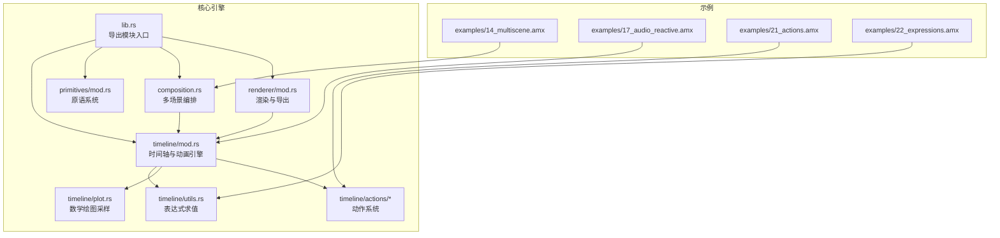
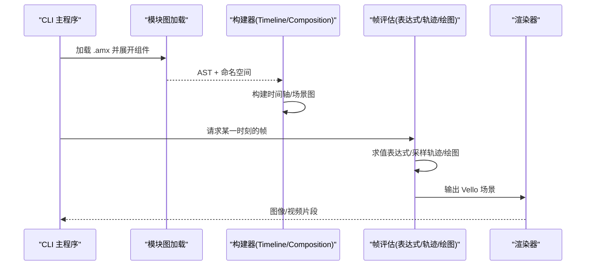
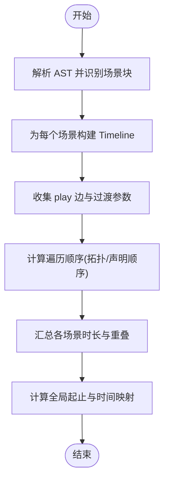
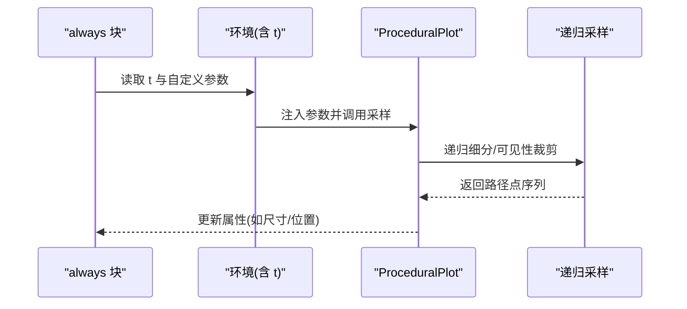
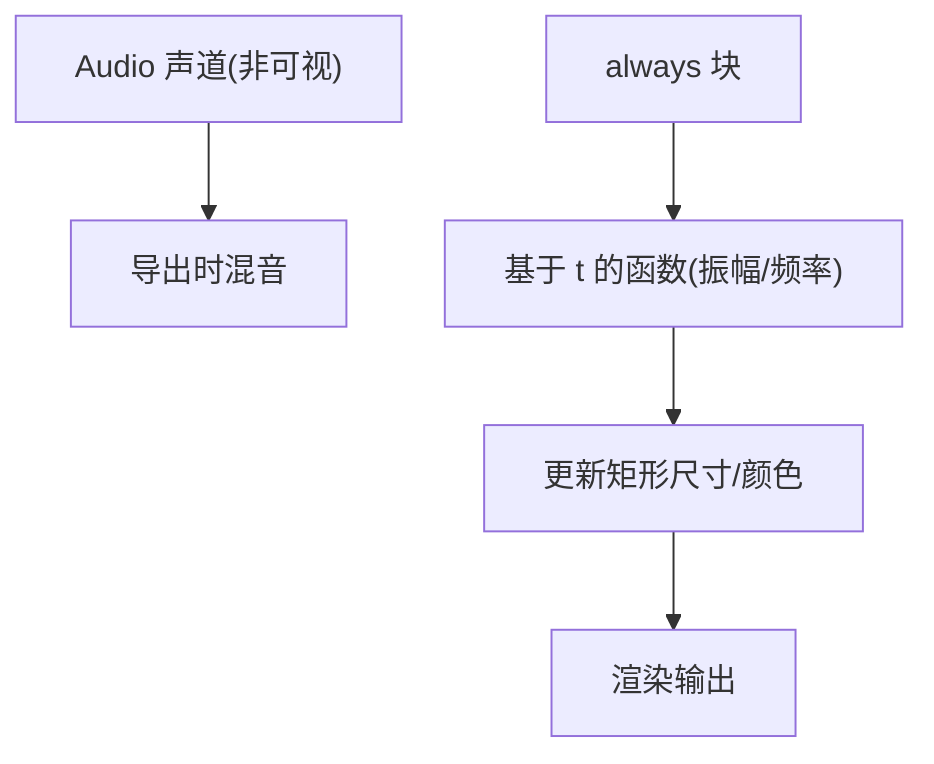
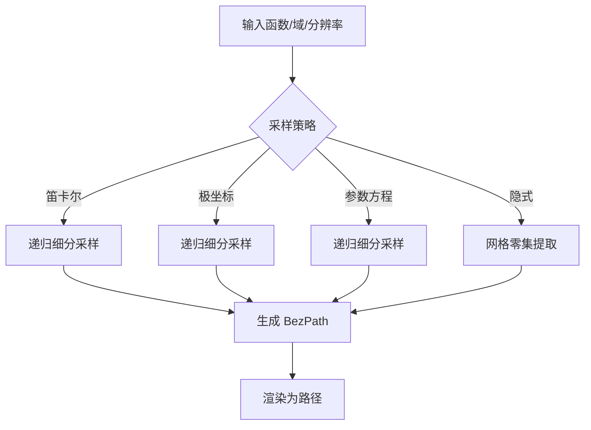
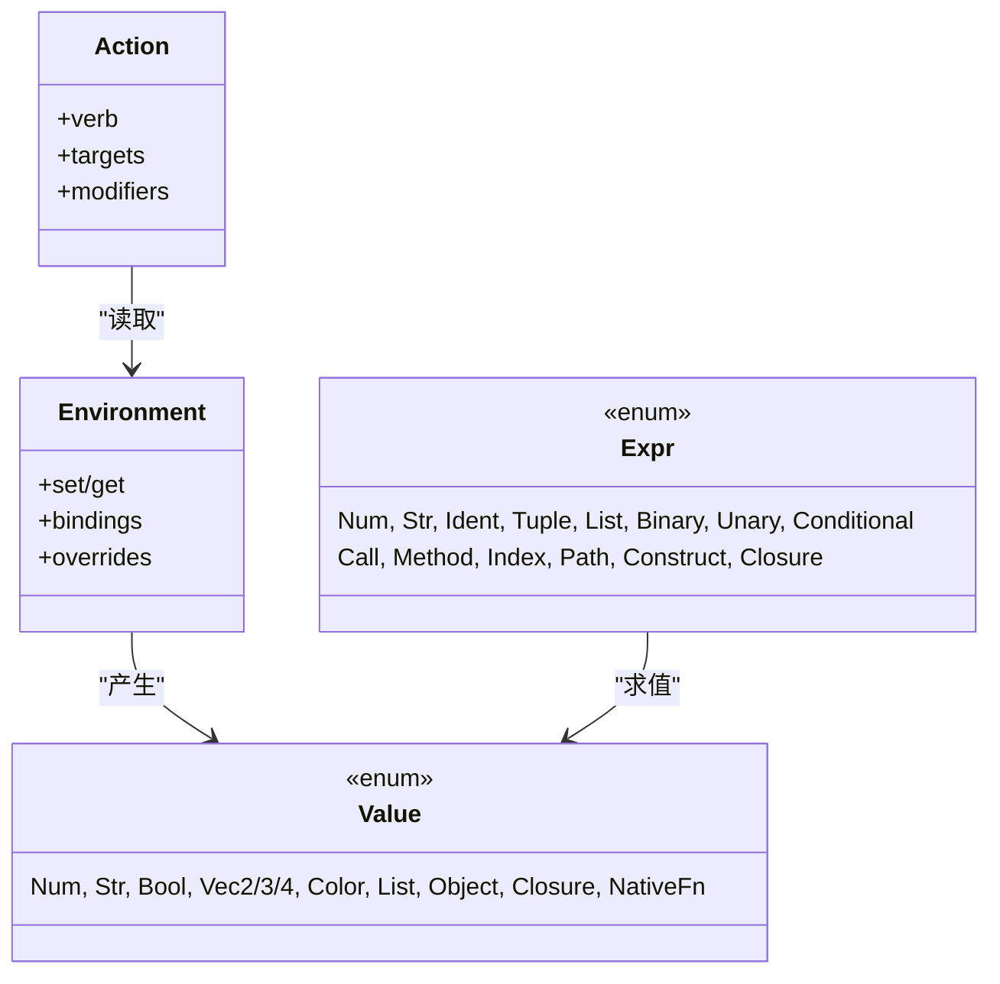
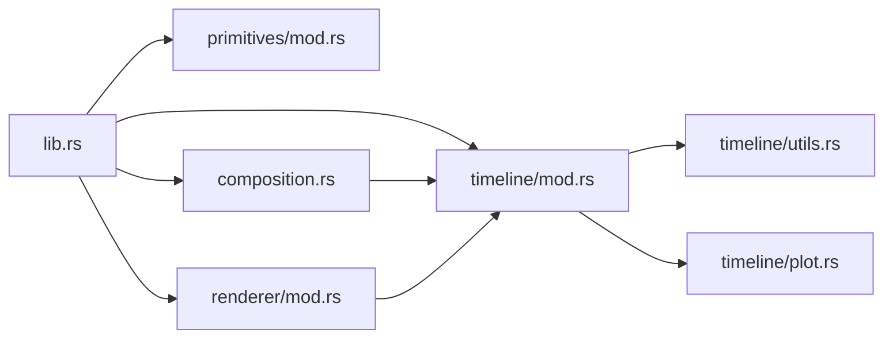

# 高级特性

<cite>
**本文引用的文件**
- [crates/animatix/src/lib.rs](file://crates/animatix/src/lib.rs)
- [crates/animatix/src/main.rs](file://crates/animatix/src/main.rs)
- [crates/animatix/src/timeline/mod.rs](file://crates/animatix/src/timeline/mod.rs)
- [crates/animatix/src/timeline/actions/mod.rs](file://crates/animatix/src/timeline/actions/mod.rs)
- [crates/animatix/src/timeline/actions/effects.rs](file://crates/animatix/src/timeline/actions/effects.rs)
- [crates/animatix/src/timeline/actions/motion.rs](file://crates/animatix/src/timeline/actions/motion.rs)
- [crates/animatix/src/timeline/plot.rs](file://crates/animatix/src/timeline/plot.rs)
- [crates/animatix/src/timeline/utils.rs](file://crates/animatix/src/timeline/utils.rs)
- [crates/animatix/src/primitives/mod.rs](file://crates/animatix/src/primitives/mod.rs)
- [crates/animatix/src/composition.rs](file://crates/animatix/src/composition.rs)
- [crates/animatix/src/renderer/mod.rs](file://crates/animatix/src/renderer/mod.rs)
- [examples/14_multiscene.amx](file://examples/14_multiscene.amx)
- [examples/17_audio_reactive.amx](file://examples/17_audio_reactive.amx)
- [examples/21_actions.amx](file://examples/21_actions.amx)
- [examples/22_expressions.amx](file://examples/22_expressions.amx)
</cite>

## 目录
1. [简介](#简介)
2. [项目结构](#项目结构)
3. [核心组件](#核心组件)
4. [架构总览](#架构总览)
5. [详细组件分析](#详细组件分析)
6. [依赖关系分析](#依赖关系分析)
7. [性能考量](#性能考量)
8. [故障排查指南](#故障排查指南)
9. [结论](#结论)
10. [附录](#附录)

## 简介
本指南聚焦 Animatix 的高级特性与专业应用场景，覆盖多场景动画（场景切换与全局配置）、循环动画与程序化生成、音频响应动画、数学可视化（数平面、轮廓线、向量场）、表达式系统与高级动作等主题。文档以循序渐进的方式呈现，既适合初学者快速上手，也提供面向专家的深度解析与实践建议。

## 项目结构
Animatix 采用模块化设计：核心引擎位于 animatix crate，渲染管线与导出在 renderer 子模块中；时间轴与动画编排在 timeline 模块；原语系统统一抽象于 primitives；GUI 与命令行工具分别在独立 crate 中。CLI 提供检查、格式化、渲染视频/图片/GIF 等能力。

图表来源
- [crates/animatix/src/lib.rs:1-24](file://crates/animatix/src/lib.rs#L1-L24)
- [crates/animatix/src/timeline/mod.rs:1-120](file://crates/animatix/src/timeline/mod.rs#L1-L120)
- [crates/animatix/src/primitives/mod.rs:1-120](file://crates/animatix/src/primitives/mod.rs#L1-L120)
- [crates/animatix/src/composition.rs:1-120](file://crates/animatix/src/composition.rs#L1-L120)
- [crates/animatix/src/renderer/mod.rs:1-57](file://crates/animatix/src/renderer/mod.rs#L1-L57)
- [crates/animatix/src/timeline/utils.rs:1-120](file://crates/animatix/src/timeline/utils.rs#L1-L120)
- [crates/animatix/src/timeline/plot.rs:1-120](file://crates/animatix/src/timeline/plot.rs#L1-L120)
- [crates/animatix/src/timeline/actions/mod.rs:1-120](file://crates/animatix/src/timeline/actions/mod.rs#L1-L120)

章节来源
- [crates/animatix/src/lib.rs:1-24](file://crates/animatix/src/lib.rs#L1-L24)
- [crates/animatix/src/main.rs:1-200](file://crates/animatix/src/main.rs#L1-L200)

## 核心组件
- 时间轴与动画引擎：负责构建、缓存、求值与渲染，支持布局、容器、路径、文本、媒体、绘图等全栈能力。
- 原语系统：统一形状、文本、媒体、绘图、容器等类型，提供构建、渲染、属性应用与默认色板映射。
- 多场景编排：解析场景声明、播放边、过渡与全局时序，支持跨文件场景引用与持续时间控制。
- 渲染与导出：离屏渲染、窗口预览、转场合成、视频/GIF 导出与编码设置。
- 表达式系统：内置函数、闭包、索引访问、条件分支、构造对象，带环境哈希缓存与禁用策略。
- 数学可视化：递归细分采样、可见性裁剪、断点处理、隐式曲线网格法。
- 动作系统：运动、进入/退出、矢量描画、效果（抖动、脉冲、弹性）等内置动作。

章节来源
- [crates/animatix/src/timeline/mod.rs:430-520](file://crates/animatix/src/timeline/mod.rs#L430-L520)
- [crates/animatix/src/primitives/mod.rs:416-568](file://crates/animatix/src/primitives/mod.rs#L416-L568)
- [crates/animatix/src/composition.rs:21-60](file://crates/animatix/src/composition.rs#L21-L60)
- [crates/animatix/src/renderer/mod.rs:1-57](file://crates/animatix/src/renderer/mod.rs#L1-L57)
- [crates/animatix/src/timeline/utils.rs:132-168](file://crates/animatix/src/timeline/utils.rs#L132-L168)
- [crates/animatix/src/timeline/plot.rs:591-610](file://crates/animatix/src/timeline/plot.rs#L591-L610)
- [crates/animatix/src/timeline/actions/mod.rs:224-283](file://crates/animatix/src/timeline/actions/mod.rs#L224-L283)

## 架构总览
Animatix 的执行流从 AST 解析开始，经由模块图加载与组件展开，构建为 Timeline 或 Composition；运行时按帧评估表达式、采样轨迹与绘图，并通过渲染器输出图像或视频。

图表来源
- [crates/animatix/src/main.rs:210-230](file://crates/animatix/src/main.rs#L210-L230)
- [crates/animatix/src/composition.rs:174-220](file://crates/animatix/src/composition.rs#L174-L220)
- [crates/animatix/src/timeline/mod.rs:430-520](file://crates/animatix/src/timeline/mod.rs#L430-L520)
- [crates/animatix/src/renderer/mod.rs:36-57](file://crates/animatix/src/renderer/mod.rs#L36-L57)

## 详细组件分析

### 多场景动画与全局配置管理
- 场景声明与播放边：通过场景块与 play 语义串联多个场景，支持显式过渡与重叠时长。
- 全局时序与持续时间：自动推导单场景时长，支持场景内显式 duration 覆盖；多场景按声明顺序与边连接计算全局起止。
- 场景级配置：每个场景可设置颜色方案、动态布局等，这些配置在构建时注入到对应 Timeline。
- 跨文件场景：支持 play alias.Scene 形式引用导入模块中的场景定义。

图表来源
- [crates/animatix/src/composition.rs:225-460](file://crates/animatix/src/composition.rs#L225-L460)
- [examples/14_multiscene.amx:1-72](file://examples/14_multiscene.amx#L1-L72)

章节来源
- [crates/animatix/src/composition.rs:225-460](file://crates/animatix/src/composition.rs#L225-L460)
- [examples/14_multiscene.amx:1-72](file://examples/14_multiscene.amx#L1-L72)

### 循环动画与程序化生成
- 表达式驱动的连续动画：利用 always 块与时间变量 t 实现随时间变化的属性更新，如条形高度随相位正弦波动。
- 程式化原语：通过 PlotCurve 的函数体与域参数，结合自定义参数（如频率、振幅），在每帧重新采样生成动态曲线。
- 绘图采样策略：递归中点细分、最大深度限制、可见性裁剪与断点注入，平衡精度与性能。

图表来源
- [examples/17_audio_reactive.amx:25-37](file://examples/17_audio_reactive.amx#L25-L37)
- [crates/animatix/src/timeline/plot.rs:611-800](file://crates/animatix/src/timeline/plot.rs#L611-L800)
- [crates/animatix/src/timeline/utils.rs:132-168](file://crates/animatix/src/timeline/utils.rs#L132-L168)

章节来源
- [examples/17_audio_reactive.amx:25-37](file://examples/17_audio_reactive.amx#L25-L37)
- [crates/animatix/src/timeline/plot.rs:611-800](file://crates/animatix/src/timeline/plot.rs#L611-L800)
- [crates/animatix/src/timeline/utils.rs:132-168](file://crates/animatix/src/timeline/utils.rs#L132-L168)

### 音频响应动画
- 非可视音频原语：Audio 声道在导出阶段被混音，不参与运行时渲染。
- 运行时驱动：always 块结合 t 与随机/周期性函数，对一组矩形条进行连续幅度调制，形成波形可视化。
- 可扩展性：可引入外部音频数据或节拍检测（当前版本未内置）。

图表来源
- [examples/17_audio_reactive.amx:6-37](file://examples/17_audio_reactive.amx#L6-L37)

章节来源
- [examples/17_audio_reactive.amx:6-37](file://examples/17_audio_reactive.amx#L6-L37)

### 数学可视化：数平面、轮廓线与向量场
- 曲线绘制：支持笛卡尔、极坐标、参数方程与隐式函数；通过递归细分与阈值控制保证视觉保真度。
- 轮廓线与等高线：隐式函数网格法提取零集，生成离散线段集合。
- 向量场：通过参数化采样与方向映射，绘制箭头或流线。
- 性能控制：构建质量等级（草稿/预览/生产）影响采样密度与容差。

图表来源
- [crates/animatix/src/timeline/plot.rs:65-177](file://crates/animatix/src/timeline/plot.rs#L65-L177)
- [crates/animatix/src/timeline/plot.rs:179-400](file://crates/animatix/src/timeline/plot.rs#L179-L400)
- [crates/animatix/src/timeline/plot.rs:402-583](file://crates/animatix/src/timeline/plot.rs#L402-L583)

章节来源
- [crates/animatix/src/timeline/plot.rs:65-177](file://crates/animatix/src/timeline/plot.rs#L65-L177)
- [crates/animatix/src/timeline/plot.rs:179-400](file://crates/animatix/src/timeline/plot.rs#L179-L400)
- [crates/animatix/src/timeline/plot.rs:402-583](file://crates/animatix/src/timeline/plot.rs#L402-L583)

### 表达式系统与高级动作
- 表达式求值：支持数值、向量、颜色、列表、对象、闭包与原生函数；带线程局部缓存与禁用策略，避免重复计算。
- 高级动作：运动（移动/平移/旋转/缩放）、进入/退出、矢量描画（绘制/揭示/擦除）、效果（抖动/脉冲/弹性）。
- 参数化与修饰：动作支持时序修饰（时长/延迟/缓动）与专用参数（强度、频率、目标偏移等）。

图表来源
- [crates/animatix/src/timeline/utils.rs:132-168](file://crates/animatix/src/timeline/utils.rs#L132-L168)
- [crates/animatix/src/timeline/actions/mod.rs:224-283](file://crates/animatix/src/timeline/actions/mod.rs#L224-L283)

章节来源
- [crates/animatix/src/timeline/utils.rs:132-168](file://crates/animatix/src/timeline/utils.rs#L132-L168)
- [crates/animatix/src/timeline/actions/effects.rs:27-128](file://crates/animatix/src/timeline/actions/effects.rs#L27-L128)
- [crates/animatix/src/timeline/actions/motion.rs:188-511](file://crates/animatix/src/timeline/actions/motion.rs#L188-L511)
- [examples/21_actions.amx:1-28](file://examples/21_actions.amx#L1-L28)
- [examples/22_expressions.amx:1-18](file://examples/22_expressions.amx#L1-L18)

## 依赖关系分析
- 模块耦合：lib.rs 将语法、运行时与渲染模块聚合；timeline 依赖 utils/plot/primitives；composition 依赖 timeline；renderer 依赖 timeline 输出。
- 外部集成：CLI 作为统一入口，调用渲染器与导出模块；GUI 与 LSP 在独立 crate 中复用语法与分析模块。

图表来源
- [crates/animatix/src/lib.rs:12-24](file://crates/animatix/src/lib.rs#L12-L24)
- [crates/animatix/src/timeline/mod.rs:1-120](file://crates/animatix/src/timeline/mod.rs#L1-L120)
- [crates/animatix/src/primitives/mod.rs:1-120](file://crates/animatix/src/primitives/mod.rs#L1-L120)
- [crates/animatix/src/composition.rs:1-120](file://crates/animatix/src/composition.rs#L1-L120)
- [crates/animatix/src/renderer/mod.rs:1-57](file://crates/animatix/src/renderer/mod.rs#L1-L57)

章节来源
- [crates/animatix/src/lib.rs:12-24](file://crates/animatix/src/lib.rs#L12-L24)

## 性能考量
- 表达式缓存：线程局部缓存与禁用策略用于避免重复求值；在密集采样（如绘图）时建议禁用缓存以降低命中成本。
- 构建质量：草稿/预览/生产三档质量控制绘图采样密度与容差，GUI 编辑使用草稿，导出使用生产。
- 帧缓存与静态子树缓存：避免重复计算与重绘，提升回放性能。
- 渲染并发：导出时可配置最大渲染线程数，平衡速度与资源占用。

章节来源
- [crates/animatix/src/timeline/utils.rs:13-85](file://crates/animatix/src/timeline/utils.rs#L13-L85)
- [crates/animatix/src/timeline/mod.rs:150-190](file://crates/animatix/src/timeline/mod.rs#L150-L190)
- [crates/animatix/src/timeline/mod.rs:470-520](file://crates/animatix/src/timeline/mod.rs#L470-L520)
- [crates/animatix/src/main.rs:356-440](file://crates/animatix/src/main.rs#L356-L440)

## 故障排查指南
- 构建诊断：CLI 提供检查与格式化命令，支持文本与 JSON 输出，便于定位语法与类型错误。
- 运行时诊断：帧评估会记录运行时诊断（如动作冲突、越界索引），可在 GUI 中查看。
- 常见问题：
  - 动作目标不存在：确保目标标签已声明且在当前作用域内。
  - 容器节点不支持矢量揭示：矢量揭示需作用于可渲染叶节点。
  - 采样异常：调整 tolerance/max_depth/resolution，或启用/禁用缓存。

章节来源
- [crates/animatix/src/main.rs:511-597](file://crates/animatix/src/main.rs#L511-L597)
- [crates/animatix/src/timeline/actions/mod.rs:162-222](file://crates/animatix/src/timeline/actions/mod.rs#L162-L222)
- [crates/animatix/src/timeline/utils.rs:26-42](file://crates/animatix/src/timeline/utils.rs#L26-L42)

## 结论
Animatix 通过模块化的引擎设计与强大的表达式系统，提供了从基础到专业的完整动画工作流。多场景编排、程序化生成、数学可视化与动作系统共同构成其高级特性矩阵。配合构建质量与渲染并发控制，可在交互编辑与高质量导出之间取得良好平衡。

## 附录
- 示例参考：
  - 多场景与过渡：[examples/14_multiscene.amx](file://examples/14_multiscene.amx)
  - 音频响应与 always 块：[examples/17_audio_reactive.amx](file://examples/17_audio_reactive.amx)
  - 动作演示：[examples/21_actions.amx](file://examples/21_actions.amx)
  - 表达式与构造：[examples/22_expressions.amx](file://examples/22_expressions.amx)