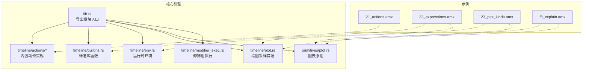
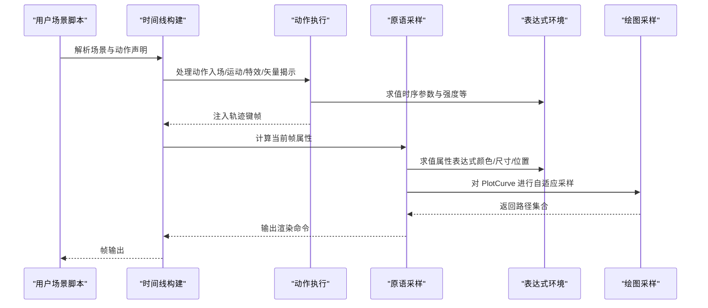
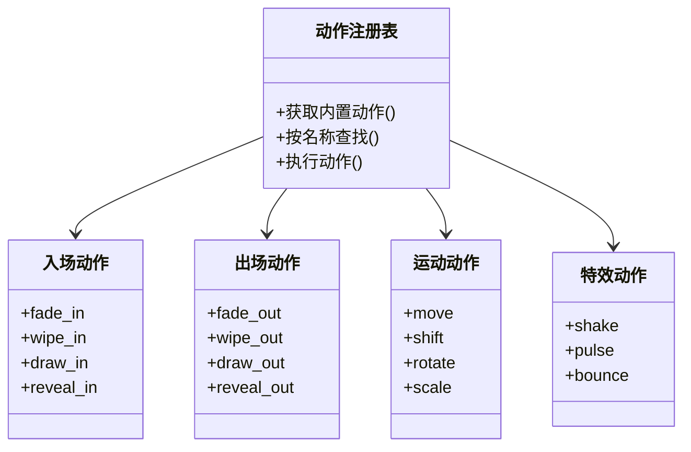
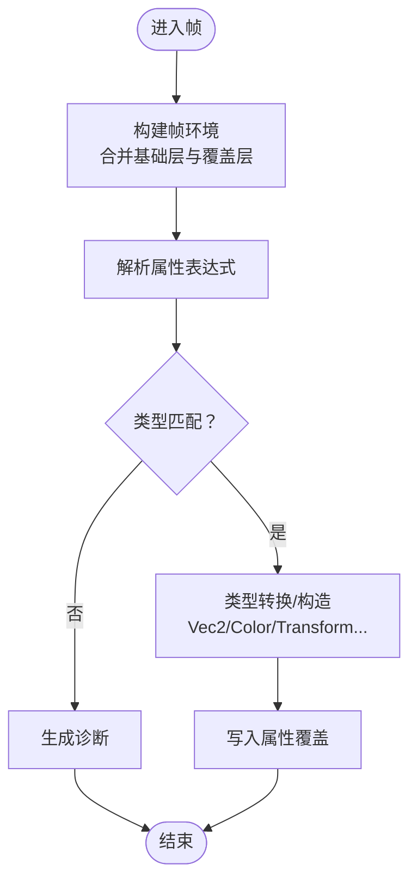
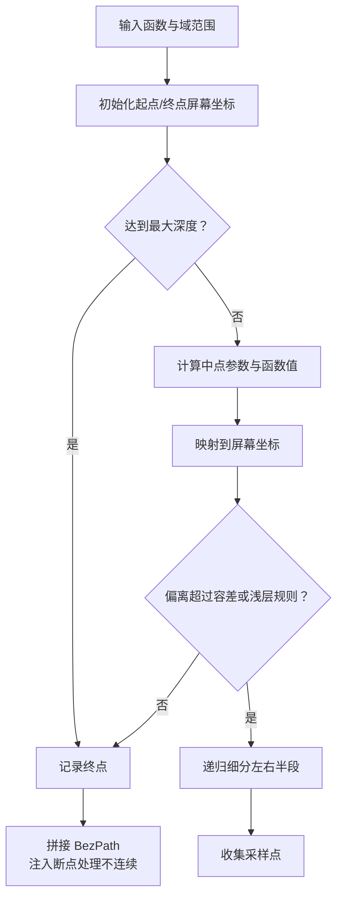
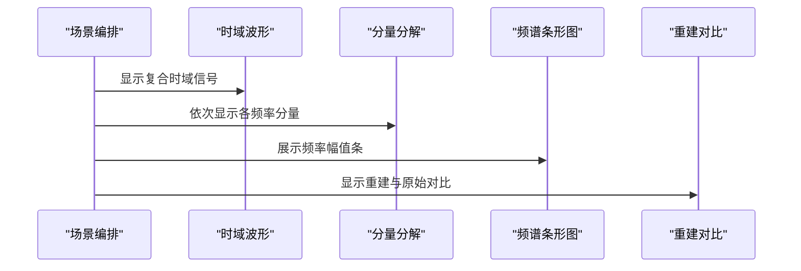
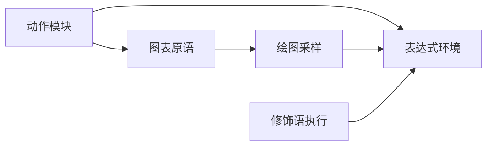

# 专业应用示例

<cite>
**本文引用的文件**
- [crates/animatix/src/lib.rs](file://crates/animatix/src/lib.rs)
- [crates/animatix/src/timeline/actions/mod.rs](file://crates/animatix/src/timeline/actions/mod.rs)
- [crates/animatix/src/timeline/actions/entrance.rs](file://crates/animatix/src/timeline/actions/entrance.rs)
- [crates/animatix/src/timeline/actions/motion.rs](file://crates/animatix/src/timeline/actions/motion.rs)
- [crates/animatix/src/timeline/actions/reveal.rs](file://crates/animatix/src/timeline/actions/reveal.rs)
- [crates/animatix/src/timeline/actions/exit.rs](file://crates/animatix/src/timeline/actions/exit.rs)
- [crates/animatix/src/timeline/actions/effects.rs](file://crates/animatix/src/timeline/actions/effects.rs)
- [crates/animatix/src/timeline/builtins.rs](file://crates/animatix/src/timeline/builtins.rs)
- [crates/animatix/src/timeline/env.rs](file://crates/animatix/src/timeline/env.rs)
- [crates/animatix/src/timeline/value_parser.rs](file://crates/animatix/src/timeline/value_parser.rs)
- [crates/animatix/src/timeline/plot.rs](file://crates/animatix/src/timeline/plot.rs)
- [crates/animatix/src/primitives/plot.rs](file://crates/animatix/src/primitives/plot.rs)
- [crates/animatix/src/timeline/modifier_exec.rs](file://crates/animatix/src/timeline/modifier_exec.rs)
- [examples/21_actions.amx](file://examples/21_actions.amx)
- [examples/22_expressions.amx](file://examples/22_expressions.amx)
- [examples/23_plot_kinds.amx](file://examples/23_plot_kinds.amx)
- [examples/fft_explain.amx](file://examples/fft_explain.amx)
</cite>

## 目录
1. [引言](#引言)
2. [项目结构](#项目结构)
3. [核心组件](#核心组件)
4. [架构总览](#架构总览)
5. [详细组件分析](#详细组件分析)
6. [依赖关系分析](#依赖关系分析)
7. [性能考量](#性能考量)
8. [故障排查指南](#故障排查指南)
9. [结论](#结论)
10. [附录](#附录)

## 引言
本专项文档聚焦 Animatix 的三大专业能力：动作系统（动作与序列）、表达式语言（数学与颜色）、以及特殊图表类型（极坐标、参数曲线、隐式曲线等）。我们将从代码层面解析这些能力的实现机制，并结合官方示例给出可复用的应用模式与最佳实践，帮助读者快速掌握动画系统的高级功能。

## 项目结构
Animatix 的核心引擎位于 crates/animatix，包含时间线、渲染器、原语与表达式求值等模块；examples 提供了丰富的专业示例场景，涵盖动作编排、表达式高级用法与频域可视化（FFT）。

**图示来源**
- [crates/animatix/src/lib.rs:1-24](file://crates/animatix/src/lib.rs#L1-L24)
- [crates/animatix/src/timeline/actions/mod.rs:1-800](file://crates/animatix/src/timeline/actions/mod.rs#L1-L800)
- [crates/animatix/src/timeline/builtins.rs:129-382](file://crates/animatix/src/timeline/builtins.rs#L129-L382)
- [crates/animatix/src/timeline/env.rs:200-355](file://crates/animatix/src/timeline/env.rs#L200-L355)
- [crates/animatix/src/timeline/plot.rs:1-812](file://crates/animatix/src/timeline/plot.rs#L1-L812)
- [crates/animatix/src/primitives/plot.rs:1-396](file://crates/animatix/src/primitives/plot.rs#L1-L396)
- [crates/animatix/src/timeline/modifier_exec.rs:1-114](file://crates/animatix/src/timeline/modifier_exec.rs#L1-L114)

**章节来源**
- [crates/animatix/src/lib.rs:1-24](file://crates/animatix/src/lib.rs#L1-L24)

## 核心组件
- 动作系统：内置动作注册表与执行流程，支持入场/出场/运动/特效/矢量揭示等类别，统一处理目标展开、时序参数与诊断信息。
- 表达式语言：运行时环境、类型系统与标准库函数（数学、颜色、插值、随机等），支持在属性与修饰语中直接使用。
- 图表原语：Graph/PlotCurve 等，配合自适应递归细分采样算法，支持笛卡尔/极坐标/参数/隐式四类曲线。
- 频域可视化：通过示例展示时域信号到频谱的可视化路径，结合 BarChart 与 Graph/PlotCurve 实现。

**章节来源**
- [crates/animatix/src/timeline/actions/mod.rs:224-283](file://crates/animatix/src/timeline/actions/mod.rs#L224-L283)
- [crates/animatix/src/timeline/builtins.rs:129-382](file://crates/animatix/src/timeline/builtins.rs#L129-L382)
- [crates/animatix/src/primitives/plot.rs:20-148](file://crates/animatix/src/primitives/plot.rs#L20-L148)
- [crates/animatix/src/timeline/plot.rs:43-800](file://crates/animatix/src/timeline/plot.rs#L43-L800)

## 架构总览
下图展示了“声明式场景 → 时间线构建 → 动作执行 → 原语采样 → 渲染”的端到端流程，重点标注了表达式求值与绘图采样的关键节点。

**图示来源**
- [crates/animatix/src/timeline/actions/mod.rs:247-275](file://crates/animatix/src/timeline/actions/mod.rs#L247-L275)
- [crates/animatix/src/timeline/env.rs:275-325](file://crates/animatix/src/timeline/env.rs#L275-L325)
- [crates/animatix/src/timeline/plot.rs:613-800](file://crates/animatix/src/timeline/plot.rs#L613-L800)
- [crates/animatix/src/primitives/plot.rs:79-147](file://crates/animatix/src/primitives/plot.rs#L79-L147)

## 详细组件分析

### 动作系统：扩展与序列编排
- 内置动作注册：集中于动作模块，统一签名、时序参数解析与执行。
- 目标展开策略：自动将组目标展开为叶子节点，布局容器（如 Row/Col/Grid/Stack/Group/Mask/Filter）会递归展开子项。
- 矢量揭示校验：对图像/文本等非矢量目标进行限制，确保矢量揭示动作仅作用于可描边/可填充的矢量路径。
- 典型动作类别：
  - 入场：fade-in、wipe-in、draw-in、reveal-in
  - 出场：fade-out、wipe-out、draw-out、reveal-out
  - 运动：move、shift、rotate、scale
  - 特效：shake、pulse、bounce
- 示例参考：动作表面演示了多元素的复合入场/出场序列编排。

**图示来源**
- [crates/animatix/src/timeline/actions/mod.rs:224-245](file://crates/animatix/src/timeline/actions/mod.rs#L224-L245)
- [crates/animatix/src/timeline/actions/entrance.rs:75-128](file://crates/animatix/src/timeline/actions/entrance.rs#L75-L128)
- [crates/animatix/src/timeline/actions/reveal.rs:8-83](file://crates/animatix/src/timeline/actions/reveal.rs#L8-L83)
- [crates/animatix/src/timeline/actions/motion.rs:189-511](file://crates/animatix/src/timeline/actions/motion.rs#L189-L511)
- [crates/animatix/src/timeline/actions/effects.rs:27-128](file://crates/animatix/src/timeline/actions/effects.rs#L27-L128)

**章节来源**
- [crates/animatix/src/timeline/actions/mod.rs:102-161](file://crates/animatix/src/timeline/actions/mod.rs#L102-L161)
- [crates/animatix/src/timeline/actions/mod.rs:162-222](file://crates/animatix/src/timeline/actions/mod.rs#L162-L222)
- [examples/21_actions.amx:1-28](file://examples/21_actions.amx#L1-L28)

### 表达式语言：高级用法与动态效果
- 类型系统与环境：
  - 支持数值、字符串、布尔、向量（Vec2/3/4）、颜色、列表、对象、原生函数与闭包。
  - 双层变量绑定：覆盖层 + 可共享的基础层，避免每帧复制标准库。
  - 绑定叠加：用于绘图采样时临时设置 x/y 等变量，零拷贝更新。
- 标准库函数：
  - 数学：三角、指数、对数、取整、平方根、角度换算、min/max/pow/atan2/hypot/rem/step 等。
  - 插值与缓动：lerp、smoothstep、clamp、ease_*、bounce/elastic/back/expo 等。
  - 颜色：rgb/rgba、vec2/vec3/vec4、hsv/hsla、预设颜色常量。
  - 随机：rand（0~1）、seeded_rand（确定性伪随机）。
- 属性解析：根据属性类型将表达式转换为具体属性值（如 Vec2/Color/Transform 等）。
- 示例参考：表达式示例展示了 lerp、clamp、seeded_rand、rgb/rgba、索引访问等组合使用。

**图示来源**
- [crates/animatix/src/timeline/env.rs:200-355](file://crates/animatix/src/timeline/env.rs#L200-L355)
- [crates/animatix/src/timeline/builtins.rs:129-382](file://crates/animatix/src/timeline/builtins.rs#L129-L382)
- [crates/animatix/src/timeline/value_parser.rs:45-137](file://crates/animatix/src/timeline/value_parser.rs#L45-L137)

**章节来源**
- [crates/animatix/src/timeline/env.rs:275-325](file://crates/animatix/src/timeline/env.rs#L275-L325)
- [crates/animatix/src/timeline/builtins.rs:129-382](file://crates/animatix/src/timeline/builtins.rs#L129-L382)
- [examples/22_expressions.amx:1-18](file://examples/22_expressions.amx#L1-L18)

### 特殊图表类型：极坐标、参数曲线与隐式曲线
- 图表原语：
  - Graph：容器型图表，承载多个 PlotCurve/向量场/热力/轮廓/数格等。
  - PlotCurve：支持四种曲线类型（cartesian/polar/parametric/implicit），默认属性包含域范围、采样分辨率、容差与函数体。
- 自适应采样算法：
  - 递归中点细分：以容差阈值控制细分，最大深度限制计算成本。
  - 可见性剔除：超出可视区域的片段注入 NaN 断点，避免无效采样。
  - 不连续处理：检测陡变（如渐近线）插入断点，防止错误连线。
- 隐式曲线：基于网格的等值线提取，利用分段内插连接交点形成离散路径。
- 示例参考：极坐标/参数/隐式曲线示例展示了三类曲线在同一 Graph 中的组合与样式配置。

**图示来源**
- [crates/animatix/src/timeline/plot.rs:65-177](file://crates/animatix/src/timeline/plot.rs#L65-L177)
- [crates/animatix/src/timeline/plot.rs:179-400](file://crates/animatix/src/timeline/plot.rs#L179-L400)
- [crates/animatix/src/timeline/plot.rs:402-583](file://crates/animatix/src/timeline/plot.rs#L402-L583)
- [crates/animatix/src/primitives/plot.rs:71-148](file://crates/animatix/src/primitives/plot.rs#L71-L148)

**章节来源**
- [crates/animatix/src/primitives/plot.rs:20-148](file://crates/animatix/src/primitives/plot.rs#L20-L148)
- [crates/animatix/src/timeline/plot.rs:1-812](file://crates/animatix/src/timeline/plot.rs#L1-L812)
- [examples/23_plot_kinds.amx:1-11](file://examples/23_plot_kinds.amx#L1-L11)

### FFT 分析动画：频域可视化
- 设计思路：将时域信号分解为多个正弦分量，再叠加重构，最终呈现频谱条形图。
- 关键步骤：
  - 时域波形：由多个正弦分量叠加组成。
  - 分解阶段：逐个显示各频率分量及其幅度。
  - 频谱阶段：使用 BarChart 展示各频率的幅值。
  - 重构阶段：对比原始与重建波形的一致性。
- 技术要点：
  - 使用 PlotCurve 绘制时域与重建波形。
  - 使用 BarChart 展示频谱直方条。
  - 利用表达式语言与内置函数（如 sin、lerp、clamp、seeded_rand）生成动态参数。
- 示例参考：完整示例脚本展示了五个场景的顺序编排与动作过渡。

**图示来源**
- [examples/fft_explain.amx:1-211](file://examples/fft_explain.amx#L1-L211)

**章节来源**
- [examples/fft_explain.amx:1-211](file://examples/fft_explain.amx#L1-L211)

## 依赖关系分析
- 动作系统依赖时间线环境与诊断系统，统一解析时序参数与目标约束。
- 图表原语依赖绘图采样模块，后者提供自适应递归细分与可见性剔除。
- 表达式语言贯穿属性解析与绘图采样，为动态参数与颜色提供支撑。
- 修饰语执行模块负责在帧环境中增量应用赋值、条件与循环等语句，影响后续求值。

**图示来源**
- [crates/animatix/src/timeline/actions/mod.rs:247-275](file://crates/animatix/src/timeline/actions/mod.rs#L247-L275)
- [crates/animatix/src/primitives/plot.rs:79-147](file://crates/animatix/src/primitives/plot.rs#L79-L147)
- [crates/animatix/src/timeline/plot.rs:613-800](file://crates/animatix/src/timeline/plot.rs#L613-L800)
- [crates/animatix/src/timeline/modifier_exec.rs:19-88](file://crates/animatix/src/timeline/modifier_exec.rs#L19-L88)

**章节来源**
- [crates/animatix/src/timeline/modifier_exec.rs:1-114](file://crates/animatix/src/timeline/modifier_exec.rs#L1-L114)

## 性能考量
- 自适应采样：通过容差与最大深度平衡精度与性能，避免在平坦区域过度细分。
- 可见性剔除：提前过滤不可见片段，减少无效计算。
- 绑定叠加：绘图采样时使用双变量绑定，避免克隆大环境。
- 缓存：对函数中间结果进行缓存，降低重复求值开销。
- 动作目标展开：仅对布局容器递归展开，减少不必要的键帧生成。

[本节为通用指导，无需特定文件引用]

## 故障排查指南
- 未知动作：当动作名不在内置注册表时，会报告诊断并终止执行。
- 不支持的目标：矢量揭示动作仅适用于可描边/可填充的矢量路径，否则报错。
- 时序参数冲突：同一动作的修饰键冲突时，采用最后提供的值并发出警告。
- 修饰语错误：赋值/条件/循环等在求值失败时会记录警告并跳过该分支。

**章节来源**
- [crates/animatix/src/timeline/actions/mod.rs:31-66](file://crates/animatix/src/timeline/actions/mod.rs#L31-L66)
- [crates/animatix/src/timeline/actions/reveal.rs:164-162](file://crates/animatix/src/timeline/actions/reveal.rs#L164-L162)
- [crates/animatix/src/timeline/actions/motion.rs:40-89](file://crates/animatix/src/timeline/actions/motion.rs#L40-L89)
- [crates/animatix/src/timeline/modifier_exec.rs:32-48](file://crates/animatix/src/timeline/modifier_exec.rs#L32-L48)

## 结论
通过内置动作注册表、表达式语言与自适应绘图采样，Animatix 能够高效地实现复杂的动画序列与数据可视化。动作系统提供了强大的序列编排能力，表达式语言赋予了动态参数与色彩的强大表现力，而特殊图表类型则让数学与工程可视化成为可能。结合官方示例，用户可以快速搭建从基础入场到高级 FFT 可视化的全栈动画方案。

[本节为总结性内容，无需特定文件引用]

## 附录
- 快速上手建议：
  - 从动作表面示例开始，学习多元素序列编排。
  - 在表达式示例中练习 lerp、clamp、seeded_rand 与颜色函数。
  - 尝试极坐标/参数/隐式曲线示例，理解不同曲线类型的适用场景。
  - 参考 FFT 示例，掌握从时域到频域的可视化流程。
- 扩展方向：
  - 自定义动作：参考内置动作的签名与执行模式，在注册表中添加新动作。
  - 动态参数：在修饰语中使用驱动块与 let 声明，结合表达式生成动态属性。
  - 高级图表：利用 PlotCurve 的自适应采样与断点处理，实现更复杂的数学可视化。

**章节来源**
- [examples/21_actions.amx:1-28](file://examples/21_actions.amx#L1-L28)
- [examples/22_expressions.amx:1-18](file://examples/22_expressions.amx#L1-L18)
- [examples/23_plot_kinds.amx:1-11](file://examples/23_plot_kinds.amx#L1-L11)
- [examples/fft_explain.amx:1-211](file://examples/fft_explain.amx#L1-L211)