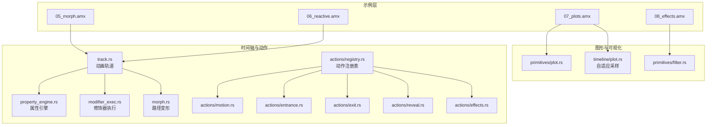
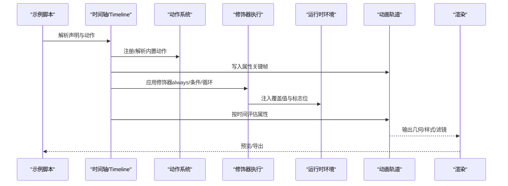
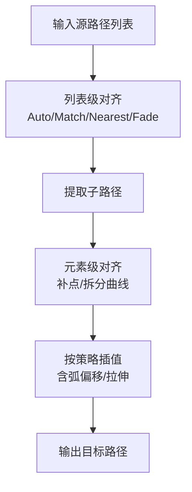
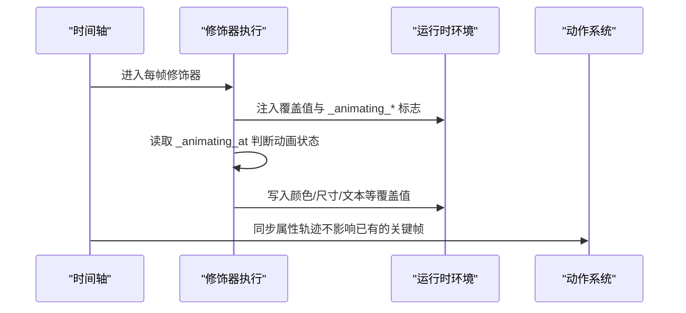
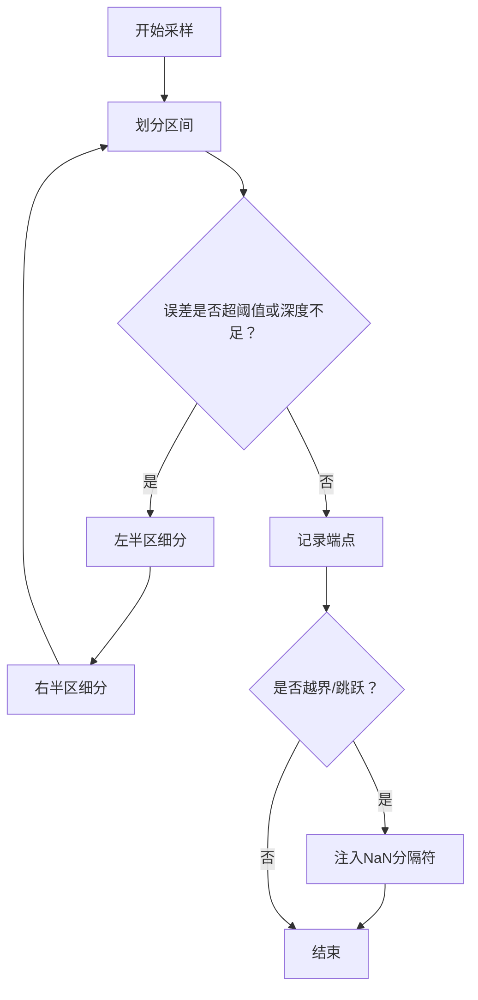
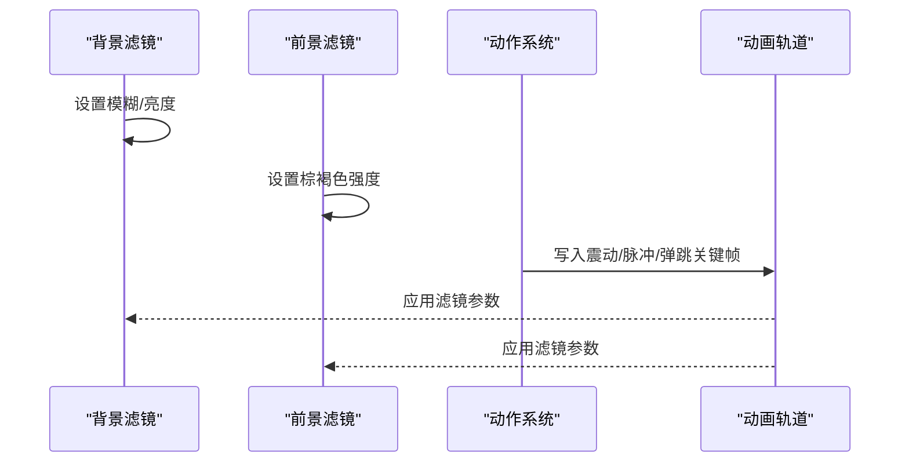
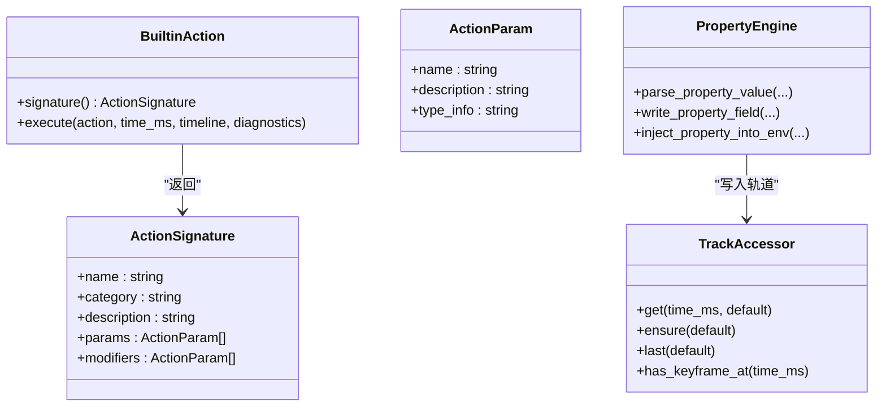
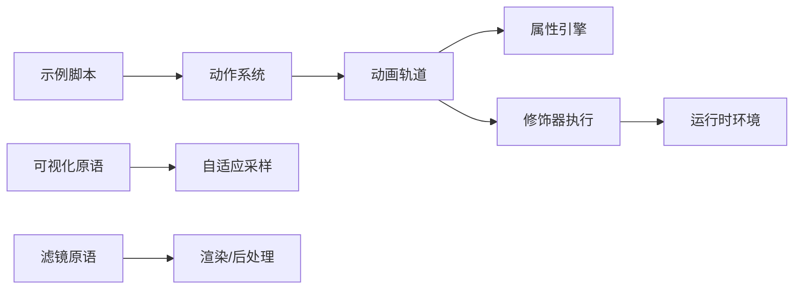

# 中级示例

<cite>
**本文引用的文件**
- [examples/05_morph.amx](file://examples/05_morph.amx)
- [examples/06_reactive.amx](file://examples/06_reactive.amx)
- [examples/07_plots.amx](file://examples/07_plots.amx)
- [examples/08_effects.amx](file://examples/08_effects.amx)
- [crates/animatix/src/timeline/morph.rs](file://crates/animatix/src/timeline/morph.rs)
- [crates/animatix/src/primitives/plot.rs](file://crates/animatix/src/primitives/plot.rs)
- [crates/animatix/src/timeline/plot.rs](file://crates/animatix/src/timeline/plot.rs)
- [crates/animatix/src/primitives/filter.rs](file://crates/animatix/src/primitives/filter.rs)
- [crates/animatix/src/timeline/actions/effects.rs](file://crates/animatix/src/timeline/actions/effects.rs)
- [crates/animatix/src/timeline/actions/motion.rs](file://crates/animatix/src/timeline/actions/motion.rs)
- [crates/animatix/src/timeline/actions/entrance.rs](file://crates/animatix/src/timeline/actions/entrance.rs)
- [crates/animatix/src/timeline/actions/exit.rs](file://crates/animatix/src/timeline/actions/exit.rs)
- [crates/animatix/src/timeline/actions/reveal.rs](file://crates/animatix/src/timeline/actions/reveal.rs)
- [crates/animatix/src/timeline/actions/reorder.rs](file://crates/animatix/src/timeline/actions/reorder.rs)
- [crates/animatix/src/timeline/modifier_exec.rs](file://crates/animatix/src/timeline/modifier_exec.rs)
- [crates/animatix/src/timeline/property_engine.rs](file://crates/animatix/src/timeline/property_engine.rs)
- [crates/animatix/src/timeline/track.rs](file://crates/animatix/src/timeline/track.rs)
- [crates/animatix/src/timeline/actions/registry.rs](file://crates/animatix/src/timeline/actions/registry.rs)
</cite>

## 目录
1. [简介](#简介)
2. [项目结构](#项目结构)
3. [核心组件](#核心组件)
4. [架构总览](#架构总览)
5. [详细组件分析](#详细组件分析)
6. [依赖关系分析](#依赖关系分析)
7. [性能考量](#性能考量)
8. [故障排查指南](#故障排查指南)
9. [结论](#结论)
10. [附录](#附录)

## 简介
本文件面向 Animatix 的中级用户，系统讲解以下高级主题与实践：路径变形（morph）、响应式动画（reactive）、数据可视化图表（plots）以及视觉效果（filters/effects）。文档以官方示例为线索，结合底层实现，帮助读者理解从声明到执行的完整链路，并提供扩展思路与最佳实践。

## 项目结构
Animatix 将“声明式场景脚本”编译为可执行的时间轴与渲染命令。中级示例主要涉及如下模块：
- 示例层：examples 下的 amx 脚本，定义了具体的动画与可视化场景
- 时间轴与动作系统：timeline 子模块，负责解析动作、构建属性轨迹、执行修饰器
- 图形与可视化原语：primitives 与 timeline.plot 提供图形、曲线、向量场、热力图等
- 渲染与后处理：renderer 与 filter 原语支持滤镜与特效

**图表来源**
- [examples/05_morph.amx:1-41](file://examples/05_morph.amx#L1-L41)
- [examples/06_reactive.amx:1-59](file://examples/06_reactive.amx#L1-L59)
- [examples/07_plots.amx:1-37](file://examples/07_plots.amx#L1-L37)
- [examples/08_effects.amx:1-63](file://examples/08_effects.amx#L1-L63)
- [crates/animatix/src/timeline/track.rs:544-718](file://crates/animatix/src/timeline/track.rs#L544-L718)
- [crates/animatix/src/timeline/property_engine.rs:1-120](file://crates/animatix/src/timeline/property_engine.rs#L1-L120)
- [crates/animatix/src/timeline/modifier_exec.rs:1-114](file://crates/animatix/src/timeline/modifier_exec.rs#L1-L114)
- [crates/animatix/src/timeline/actions/registry.rs:1-66](file://crates/animatix/src/timeline/actions/registry.rs#L1-L66)
- [crates/animatix/src/timeline/morph.rs:1-120](file://crates/animatix/src/timeline/morph.rs#L1-L120)
- [crates/animatix/src/primitives/plot.rs:1-148](file://crates/animatix/src/primitives/plot.rs#L1-L148)
- [crates/animatix/src/timeline/plot.rs:1-80](file://crates/animatix/src/timeline/plot.rs#L1-L80)
- [crates/animatix/src/primitives/filter.rs:1-52](file://crates/animatix/src/primitives/filter.rs#L1-L52)

**章节来源**
- [examples/05_morph.amx:1-41](file://examples/05_morph.amx#L1-L41)
- [examples/06_reactive.amx:1-59](file://examples/06_reactive.amx#L1-L59)
- [examples/07_plots.amx:1-37](file://examples/07_plots.amx#L1-L37)
- [examples/08_effects.amx:1-63](file://examples/08_effects.amx#L1-L63)

## 核心组件
- 动画轨道与属性引擎：统一管理位置、旋转、缩放、颜色、透明度、描边进度等属性的关键帧与插值
- 动作系统：内置动作（移动、旋转、缩放、淡入淡出、绘制入场/出场、震动/脉冲/弹跳等），通过时间参数与缓动控制
- 路径变形：基于贝塞尔路径的多层级对齐与插值，支持策略（自动、匹配、最近、Fade）
- 数据可视化：笛卡尔/极坐标/参数方程曲线、隐函数、向量场、热力图、坐标网格等，采用自适应采样算法
- 视觉效果：滤镜容器（模糊、亮度、对比度、饱和度、色相、棕褐色），以及抖动、脉冲、弹跳等动作

**章节来源**
- [crates/animatix/src/timeline/track.rs:544-718](file://crates/animatix/src/timeline/track.rs#L544-L718)
- [crates/animatix/src/timeline/property_engine.rs:113-262](file://crates/animatix/src/timeline/property_engine.rs#L113-L262)
- [crates/animatix/src/timeline/actions/registry.rs:32-43](file://crates/animatix/src/timeline/actions/registry.rs#L32-L43)

## 架构总览
下图展示了从示例脚本到最终渲染的关键流程：解析示例 → 构建时间轴与动作 → 注入运行时环境 → 执行修饰器（always/驱动）→ 插值求值 → 渲染输出。

**图表来源**
- [crates/animatix/src/timeline/modifier_exec.rs:19-88](file://crates/animatix/src/timeline/modifier_exec.rs#L19-L88)
- [crates/animatix/src/timeline/property_engine.rs:588-643](file://crates/animatix/src/timeline/property_engine.rs#L588-L643)
- [crates/animatix/src/timeline/track.rs:461-514](file://crates/animatix/src/timeline/track.rs#L461-L514)

## 详细组件分析

### 路径变形（Morph）：形状变换的实现原理
- 多层级对齐策略
  - 列表级对齐：按索引或按质心排序（Match），或最近邻（Nearest），或使用退化点补齐
  - 子路径级对齐：提取子路径，再进行元素级曲线对齐
  - 元素级对齐：确保 Move/Curve/Line 等元素数量一致，必要时插入零长度曲线
- 插值与弧偏移
  - 支持 path_arc 参数在元素间引入弧形偏移，使过渡更柔和
  - 可选 stretch 归一化，先归一到单位边界再插值回目标边界
- 示例要点
  - 自动策略（auto）：默认按索引配对
  - 匹配策略（match）：按质心排序后再配对
  - Fade 策略：交叉淡化
  - 弧偏移（path_arc）：控制过渡弧度
  - 拉伸（stretch）：按边界比例缩放

**图表来源**
- [crates/animatix/src/timeline/morph.rs:56-104](file://crates/animatix/src/timeline/morph.rs#L56-L104)
- [crates/animatix/src/timeline/morph.rs:153-209](file://crates/animatix/src/timeline/morph.rs#L153-L209)
- [crates/animatix/src/timeline/morph.rs:320-396](file://crates/animatix/src/timeline/morph.rs#L320-L396)

**章节来源**
- [examples/05_morph.amx:17-35](file://examples/05_morph.amx#L17-L35)
- [crates/animatix/src/timeline/morph.rs:3-35](file://crates/animatix/src/timeline/morph.rs#L3-L35)

### 响应式动画（Reactive）：触发机制与条件判断
- 触发机制
  - 使用 always 块持续根据当前帧环境计算表达式
  - 通过 _animating_* 标志位检测某个属性是否处于动画中（例如 _animating_at）
- 条件判断
  - 当前 at 属性无动画时，显示“空闲”状态；当存在动画时，切换为“跟踪”状态
  - 结合时间变量 t 实现随时间变化的色彩与尺寸波动
- 扩展建议
  - 在修饰器中读取多个 _animating_* 标志，组合成复杂状态机
  - 将条件判断封装为可复用的修饰器片段

**图表来源**
- [crates/animatix/src/timeline/modifier_exec.rs:19-88](file://crates/animatix/src/timeline/modifier_exec.rs#L19-L88)
- [crates/animatix/src/timeline/property_engine.rs:634-642](file://crates/animatix/src/timeline/property_engine.rs#L634-L642)

**章节来源**
- [examples/06_reactive.amx:26-49](file://examples/06_reactive.amx#L26-L49)
- [crates/animatix/src/timeline/property_engine.rs:634-642](file://crates/animatix/src/timeline/property_engine.rs#L634-L642)

### 数据可视化图表（Plots）：折线图、柱状图等
- 图表类型与原语
  - Graph：容器，承载多个 PlotCurve/VectorField/Heatmap/ContourSet/NumberPlane
  - PlotCurve：支持笛卡尔/极坐标/参数方程/隐函数四种采样模式
  - VectorField：向量场可视化
  - Heatmap：二维函数热力图
  - ContourSet：等高线集合
  - NumberPlane：坐标网格
- 自适应采样算法
  - 递归中点细分：在误差超过容差或深度不足时继续细分
  - 可视区域裁剪：超出可见范围的段落注入 NaN 分隔符
  - 断点处理：对跳跃/间断处注入 NaN，避免错误连接
  - 性能控制：最大深度与容差平衡精度与成本
- 示例要点
  - 折线图：笛卡尔坐标系，函数表达式与域范围
  - 向量场：密度与函数表达式
  - 热力图：分辨率与颜色映射
  - 极坐标/参数方程/隐函数：通过 kind 与函数体切换

**图表来源**
- [crates/animatix/src/timeline/plot.rs:65-177](file://crates/animatix/src/timeline/plot.rs#L65-L177)
- [crates/animatix/src/timeline/plot.rs:179-288](file://crates/animatix/src/timeline/plot.rs#L179-L288)
- [crates/animatix/src/timeline/plot.rs:290-400](file://crates/animatix/src/timeline/plot.rs#L290-L400)

**章节来源**
- [examples/07_plots.amx:7-20](file://examples/07_plots.amx#L7-L20)
- [crates/animatix/src/primitives/plot.rs:20-148](file://crates/animatix/src/primitives/plot.rs#L20-L148)
- [crates/animatix/src/timeline/plot.rs:592-609](file://crates/animatix/src/timeline/plot.rs#L592-L609)

### 视觉效果：滤镜与动作效果
- 滤镜容器（Filter）
  - 将子树渲染到离屏纹理，再叠加后处理效果（模糊、亮度、对比度、饱和度、色相、棕褐色）
  - 适合批量应用滤镜与合成
- 动作效果（shake/pulse/bounce）
  - shake：沿水平方向快速交替偏移，形成震动感
  - pulse：在短时间内放大再恢复，强调点击/聚焦
  - bounce：弹性下落与回弹，增强落地感
- 示例要点
  - 背景网格应用模糊与亮度调整
  - 前景卡片叠加棕褐色滤镜
  - 对目标元素依次施加抖动、脉冲、弹跳

**图表来源**
- [crates/animatix/src/primitives/filter.rs:17-51](file://crates/animatix/src/primitives/filter.rs#L17-L51)
- [crates/animatix/src/timeline/actions/effects.rs:27-128](file://crates/animatix/src/timeline/actions/effects.rs#L27-L128)
- [crates/animatix/src/timeline/actions/effects.rs:130-200](file://crates/animatix/src/timeline/actions/effects.rs#L130-L200)
- [crates/animatix/src/timeline/actions/effects.rs:202-291](file://crates/animatix/src/timeline/actions/effects.rs#L202-L291)

**章节来源**
- [examples/08_effects.amx:8-43](file://examples/08_effects.amx#L8-L43)
- [crates/animatix/src/primitives/filter.rs:17-51](file://crates/animatix/src/primitives/filter.rs#L17-L51)
- [crates/animatix/src/timeline/actions/effects.rs:27-291](file://crates/animatix/src/timeline/actions/effects.rs#L27-L291)

### 动作系统与属性写入
- 动作注册与签名
  - 每个内置动作提供元信息（名称、类别、描述、参数与修饰符）
  - 统一解析时间参数（延迟、持续时间、缓动）
- 属性写入与覆盖
  - 通过属性引擎将解析后的值写入对应轨道字段
  - 支持延迟瞬时值保留与关键帧快照
  - 运行时环境注入覆盖值与 _animating_* 标志位
- 常用动作族
  - Motion：move/shift/rotate/scale
  - Entrance：fade-in/wipe-in
  - Exit：fade-out
  - Reveal：draw-in/reveal-in/draw-out/reveal-out
  - Reorder：swap/reorder

**图表来源**
- [crates/animatix/src/timeline/actions/registry.rs:17-43](file://crates/animatix/src/timeline/actions/registry.rs#L17-L43)
- [crates/animatix/src/timeline/property_engine.rs:90-121](file://crates/animatix/src/timeline/property_engine.rs#L90-L121)
- [crates/animatix/src/timeline/track.rs:197-226](file://crates/animatix/src/timeline/track.rs#L197-L226)

**章节来源**
- [crates/animatix/src/timeline/actions/motion.rs:188-268](file://crates/animatix/src/timeline/actions/motion.rs#L188-L268)
- [crates/animatix/src/timeline/actions/entrance.rs:74-127](file://crates/animatix/src/timeline/actions/entrance.rs#L74-L127)
- [crates/animatix/src/timeline/actions/exit.rs:8-64](file://crates/animatix/src/timeline/actions/exit.rs#L8-L64)
- [crates/animatix/src/timeline/actions/reveal.rs:8-82](file://crates/animatix/src/timeline/actions/reveal.rs#L8-L82)
- [crates/animatix/src/timeline/actions/reorder.rs:6-172](file://crates/animatix/src/timeline/actions/reorder.rs#L6-L172)
- [crates/animatix/src/timeline/property_engine.rs:113-262](file://crates/animatix/src/timeline/property_engine.rs#L113-L262)

## 依赖关系分析
- 示例脚本依赖时间轴动作系统与属性引擎，动作解析后写入动画轨道
- 图形与可视化原语依赖自适应采样算法，生成矢量路径
- 滤镜原语依赖离屏渲染与后处理管线
- 修饰器执行依赖运行时环境注入，读取 _animating_* 标志位实现响应式行为

**图表来源**
- [crates/animatix/src/timeline/modifier_exec.rs:19-88](file://crates/animatix/src/timeline/modifier_exec.rs#L19-L88)
- [crates/animatix/src/timeline/property_engine.rs:588-643](file://crates/animatix/src/timeline/property_engine.rs#L588-L643)
- [crates/animatix/src/timeline/plot.rs:613-666](file://crates/animatix/src/timeline/plot.rs#L613-L666)
- [crates/animatix/src/primitives/filter.rs:17-51](file://crates/animatix/src/primitives/filter.rs#L17-L51)

**章节来源**
- [crates/animatix/src/timeline/track.rs:544-718](file://crates/animatix/src/timeline/track.rs#L544-L718)

## 性能考量
- 路径变形
  - 控制子路径与元素数量，避免过度细分导致关键帧爆炸
  - 合理设置 path_arc 与 stretch，减少插值开销
- 可视化采样
  - 调整容差与最大深度，平衡精度与性能
  - 利用可视区域裁剪与断点处理，避免无效采样
- 滤镜与动作
  - 滤镜叠加层数不宜过多，优先在必要节点使用
  - 动作强度与频率需适度，避免高频关键帧造成插值压力

## 故障排查指南
- 动作目标不支持
  - 某些动作仅适用于矢量目标，对文本/图像可能报错
  - 检查动作族与目标类型匹配关系
- 修饰器语法与类型
  - 修饰器参数类型不匹配会触发诊断警告
  - 确认修饰器键名与取值类型（如 to/by/angle/factor 等）
- 路径变形策略
  - 若出现异常过渡，尝试更换策略（Auto/Match/Nearest/Fade）
  - 调整 path_arc 与 stretch 参数
- 可视化采样异常
  - 函数间断或奇异点会导致 NaN 分隔，检查函数域与分辨率
  - 降低分辨率或提高容差以缓解性能问题

**章节来源**
- [crates/animatix/src/timeline/actions/reveal.rs:517-532](file://crates/animatix/src/timeline/actions/reveal.rs#L517-L532)
- [crates/animatix/src/timeline/actions/entrance.rs:292-310](file://crates/animatix/src/timeline/actions/entrance.rs#L292-L310)
- [crates/animatix/src/timeline/actions/reorder.rs:29-83](file://crates/animatix/src/timeline/actions/reorder.rs#L29-L83)
- [crates/animatix/src/timeline/modifier_exec.rs:32-42](file://crates/animatix/src/timeline/modifier_exec.rs#L32-L42)

## 结论
通过将示例脚本与底层实现相结合，本文件系统性地梳理了 Animatix 的中级能力：路径变形的多策略对齐与插值、响应式动画的触发与状态机、数据可视化的自适应采样与多种图表类型，以及滤镜与动作效果的组合应用。这些能力既可独立使用，也可协同构建复杂的动态可视化与交互体验。

## 附录
- 扩展建议
  - 将常用响应式模式封装为修饰器模板，提升复用性
  - 在可视化中加入动态参数（如 t），实现随时间演化的图表
  - 使用滤镜与动作组合打造品牌风格化视觉语言
- 参考路径
  - 路径变形策略与插值：[morph.rs:56-396](file://crates/animatix/src/timeline/morph.rs#L56-L396)
  - 可视化采样与图表原语：[plot.rs:613-800](file://crates/animatix/src/timeline/plot.rs#L613-L800), [primitives/plot.rs:20-396](file://crates/animatix/src/primitives/plot.rs#L20-L396)
  - 滤镜与动作效果：[filter.rs:17-51](file://crates/animatix/src/primitives/filter.rs#L17-L51), [effects.rs:27-291](file://crates/animatix/src/timeline/actions/effects.rs#L27-L291)
  - 属性写入与运行时注入：[property_engine.rs:588-643](file://crates/animatix/src/timeline/property_engine.rs#L588-L643), [track.rs:461-514](file://crates/animatix/src/timeline/track.rs#L461-L514)