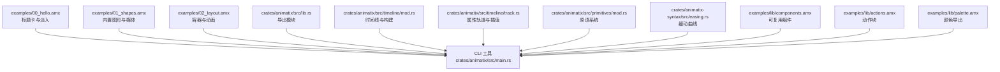
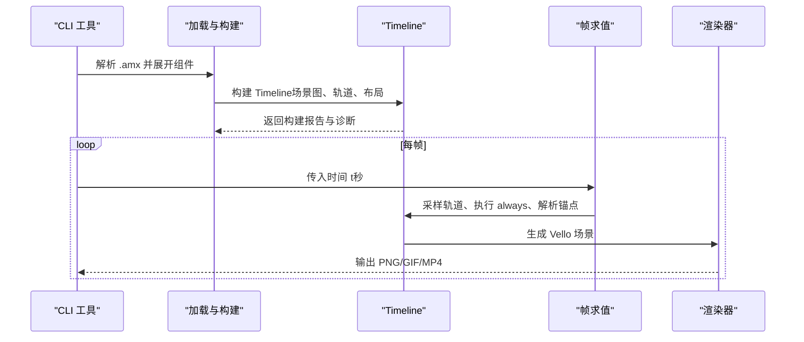
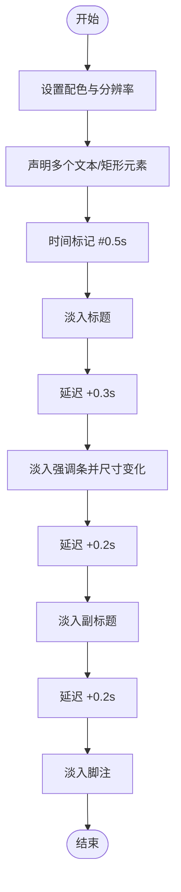
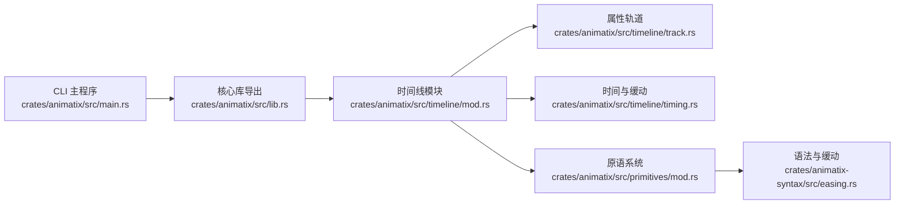

# 基础示例

<cite>
**本文引用的文件**
- [examples/00_hello.amx](file://examples/00_hello.amx)
- [examples/01_shapes.amx](file://examples/01_shapes.amx)
- [examples/02_layout.amx](file://examples/02_layout.amx)
- [examples/03_timing.amx](file://examples/03_timing.amx)
- [examples/04_motion.amx](file://examples/04_motion.amx)
- [examples/README.md](file://examples/README.md)
- [crates/animatix/src/lib.rs](file://crates/animatix/src/lib.rs)
- [crates/animatix/src/main.rs](file://crates/animatix/src/main.rs)
- [crates/animatix/src/timeline/mod.rs](file://crates/animatix/src/timeline/mod.rs)
- [crates/animatix/src/timeline/timing.rs](file://crates/animatix/src/timeline/timing.rs)
- [crates/animatix/src/timeline/track.rs](file://crates/animatix/src/timeline/track.rs)
- [crates/animatix/src/primitives/mod.rs](file://crates/animatix/src/primitives/mod.rs)
- [crates/animatix-syntax/src/easing.rs](file://crates/animatix-syntax/src/easing.rs)
- [examples/lib/components.amx](file://examples/lib/components.amx)
- [examples/lib/actions.amx](file://examples/lib/actions.amx)
- [examples/lib/palette.amx](file://examples/lib/palette.amx)
</cite>

## 目录
1. [引言](#引言)
2. [项目结构](#项目结构)
3. [核心组件](#核心组件)
4. [架构总览](#架构总览)
5. [详细组件分析](#详细组件分析)
6. [依赖关系分析](#依赖关系分析)
7. [性能考虑](#性能考虑)
8. [故障排查指南](#故障排查指南)
9. [结论](#结论)
10. [附录](#附录)

## 引言
本文件面向初学者，系统化讲解 Animatix 的基础示例：从“Hello World”标题卡到基础形状绘制、布局系统、时间控制与基础运动动画。我们将逐行解析示例文件中的语法与语义，解释声明式动画的原理（时间线、关键帧、缓动），并给出运行方式、效果预期与扩展建议，帮助你在现有示例基础上进行二次创作。

## 项目结构
Animatix 的示例位于仓库根目录的 examples 子目录中，每个示例以编号命名，逐步递进。CLI 工具位于 crates/animatix/src/main.rs，核心运行时与渲染引擎位于 crates/animatix/src 下；语法与缓动定义位于 crates/animatix-syntax 与 crates/animatix。

图表来源
- [crates/animatix/src/main.rs:1-799](file://crates/animatix/src/main.rs#L1-L799)
- [crates/animatix/src/lib.rs:1-24](file://crates/animatix/src/lib.rs#L1-L24)
- [crates/animatix/src/timeline/mod.rs:1-1093](file://crates/animatix/src/timeline/mod.rs#L1-L1093)
- [crates/animatix/src/timeline/track.rs:1-1559](file://crates/animatix/src/timeline/track.rs#L1-L1559)
- [crates/animatix/src/primitives/mod.rs:1-727](file://crates/animatix/src/primitives/mod.rs#L1-L727)
- [crates/animatix-syntax/src/easing.rs:1-174](file://crates/animatix-syntax/src/easing.rs#L1-L174)

章节来源
- [examples/README.md:1-77](file://examples/README.md#L1-L77)
- [crates/animatix/src/main.rs:1-799](file://crates/animatix/src/main.rs#L1-L799)

## 核心组件
- 时间线与构建：将 .amx 源码编译为 Timeline，包含场景图、属性轨道与求值环境，负责构建期与帧执行期的职责分离。
- 属性轨道与插值：PropertyTrack 以时间戳为键存储关键帧及其缓动，支持数值、向量、颜色、矩阵等类型的插值。
- 缓动系统：Easing 提供多种缓动曲线，支持自定义三次贝塞尔曲线。
- 原语系统：统一管理所有 Actor 类型（形状、文本、媒体、容器等），提供构建、渲染与评估接口。
- CLI 工具：提供图像、GIF、视频导出与诊断能力，支持 AST 查看与格式化。

章节来源
- [crates/animatix/src/timeline/mod.rs:1-1093](file://crates/animatix/src/timeline/mod.rs#L1-L1093)
- [crates/animatix/src/timeline/track.rs:1-1559](file://crates/animatix/src/timeline/track.rs#L1-L1559)
- [crates/animatix-syntax/src/easing.rs:1-174](file://crates/animatix-syntax/src/easing.rs#L1-L174)
- [crates/animatix/src/primitives/mod.rs:1-727](file://crates/animatix/src/primitives/mod.rs#L1-L727)
- [crates/animatix/src/main.rs:1-799](file://crates/animatix/src/main.rs#L1-L799)

## 架构总览
Animatix 的动画管线分为“构建期”和“帧执行期”。构建期将 AST 降级为 Timeline，建立场景图与属性轨道；帧执行期按时间采样轨道、执行 always 表达式、解析锚点与百分比位置、生成渲染场景。

图表来源
- [crates/animatix/src/main.rs:316-714](file://crates/animatix/src/main.rs#L316-L714)
- [crates/animatix/src/timeline/mod.rs:1-1093](file://crates/animatix/src/timeline/mod.rs#L1-L1093)

## 详细组件分析

### 示例一：Hello World 标题卡（00_hello.amx）
- 目标：最小场景，展示标题、副标题、强调条与脚注的分层淡入。
- 关键语法：
  - config 配置调色板与分辨率。
  - actor 声明与属性赋值（如 color、anchor、offset）。
  - 时间标记 #Xs 启动关键帧序列。
  - 动作块 fade-in 实现淡入。
  - [ease: 缓动名] 控制插值曲线。
- 运行方式：cargo run --bin animatix -- image examples/00_hello.amx
- 效果预期：画面中心出现标题与多层文本，依次淡入，强调条先放大再恢复。

图表来源
- [examples/00_hello.amx:1-22](file://examples/00_hello.amx#L1-L22)

章节来源
- [examples/00_hello.amx:1-22](file://examples/00_hello.amx#L1-L22)
- [crates/animatix/src/main.rs:472-509](file://crates/animatix/src/main.rs#L472-L509)

### 示例二：基础形状绘制（01_shapes.amx）
- 目标：展示内置原语（文本、数学公式、代码块、几何形状、线条、图像、矢量图、箭头）。
- 关键语法：
  - Grid 容器与 gap、padding、cols 等布局参数。
  - stagger 批量淡入，演示交错动画。
  - 多属性同时变色（color、stroke、stroke_color）。
- 运行方式：cargo run --bin animatix -- image examples/01_shapes.amx

章节来源
- [examples/01_shapes.amx:1-46](file://examples/01_shapes.amx#L1-L46)
- [crates/animatix/src/primitives/mod.rs:170-189](file://crates/animatix/src/primitives/mod.rs#L170-L189)

### 示例三：布局系统（02_layout.amx）
- 目标：Row、Col、Grid、Stack 容器的动画布局实践。
- 关键语法：
  - 容器内子项自动布局，支持 gap、align、padding 等。
  - opacity 在不同时间点切换，演示容器整体透明度动画。
  - bounce、ease-out 等缓动用于尺寸变化。
- 运行方式：cargo run --bin animatix -- image examples/02_layout.amx

章节来源
- [examples/02_layout.amx:1-55](file://examples/02_layout.amx#L1-L55)
- [crates/animatix/src/timeline/mod.rs:234-324](file://crates/animatix/src/timeline/mod.rs#L234-L324)

### 示例四：时间控制与缓动（03_timing.amx）
- 目标：sequence、stagger、easing 的组合使用。
- 关键语法：
  - stagger [间隔] { ... } 批量交错执行。
  - sequence { ... } 顺序执行一组动画。
  - 支持 linear、ease-in、ease-out、ease-in-out、bounce 等缓动。
- 运行方式：cargo run --bin animatix -- image examples/03_timing.amx

章节来源
- [examples/03_timing.amx:1-35](file://examples/03_timing.amx#L1-L35)
- [crates/animatix/src/timeline/timing.rs:181-281](file://crates/animatix/src/timeline/timing.rs#L181-L281)
- [crates/animatix-syntax/src/easing.rs:1-174](file://crates/animatix-syntax/src/easing.rs#L1-L174)

### 示例五：基础运动动画（04_motion.amx）
- 目标：shift（平移）、rotate（旋转）、scale（缩放）、color 变换与 always 响应式表达式。
- 关键语法：
  - shift actor [by: (dx, dy), dur, ease]。
  - rotate actor [by: 角度, dur, ease]。
  - scale actor [by: 因数, dur, ease]。
  - always { ... } 内部使用 t（时间变量）实现周期性运动与脉冲效果。
- 运行方式：cargo run --bin animatix -- image examples/04_motion.amx

章节来源
- [examples/04_motion.amx:1-44](file://examples/04_motion.amx#L1-L44)
- [crates/animatix/src/timeline/mod.rs:431-502](file://crates/animatix/src/timeline/mod.rs#L431-L502)

### 组件与动作库（可选）
- components.amx：Button、Badge、Panel、Tag、Divider、Spacer 等可复用组件，支持 action 定义。
- actions.amx：Pressable、Togglable、Fadable 等动作块，便于在实例上触发。
- palette.amx：颜色常量导出，便于模块化配色。

章节来源
- [examples/lib/components.amx:1-64](file://examples/lib/components.amx#L1-L64)
- [examples/lib/actions.amx:1-50](file://examples/lib/actions.amx#L1-L50)
- [examples/lib/palette.amx:1-9](file://examples/lib/palette.amx#L1-L9)

## 依赖关系分析
Animatix 的核心模块通过清晰的边界协作：CLI 负责命令行与导出；lib.rs 统一导出子模块；timeline 负责时间线构建与求值；primitives 提供原语注册与渲染；syntax 提供缓动与语法工具。

图表来源
- [crates/animatix/src/main.rs:1-799](file://crates/animatix/src/main.rs#L1-L799)
- [crates/animatix/src/lib.rs:1-24](file://crates/animatix/src/lib.rs#L1-L24)
- [crates/animatix/src/timeline/mod.rs:1-1093](file://crates/animatix/src/timeline/mod.rs#L1-L1093)
- [crates/animatix/src/timeline/track.rs:1-1559](file://crates/animatix/src/timeline/track.rs#L1-L1559)
- [crates/animatix/src/timeline/timing.rs:1-588](file://crates/animatix/src/timeline/timing.rs#L1-L588)
- [crates/animatix/src/primitives/mod.rs:1-727](file://crates/animatix/src/primitives/mod.rs#L1-L727)
- [crates/animatix-syntax/src/easing.rs:1-174](file://crates/animatix-syntax/src/easing.rs#L1-L174)

章节来源
- [crates/animatix/src/lib.rs:1-24](file://crates/animatix/src/lib.rs#L1-L24)
- [crates/animatix/src/timeline/mod.rs:1-1093](file://crates/animatix/src/timeline/mod.rs#L1-L1093)

## 性能考虑
- 构建质量等级：BuildQuality.Draft/Prewview/Production 影响绘图采样精度与速度，GUI 编辑使用 Draft，导出使用 Production。
- 帧缓存与静态子树缓存：避免重复计算，提升重播与预览性能。
- 插值与缓动：合理选择缓动与关键帧密度，减少不必要的高频率变化。
- 导出参数：视频/图片导出的分辨率、帧率与持续时间直接影响体积与耗时。

章节来源
- [crates/animatix/src/timeline/mod.rs:150-190](file://crates/animatix/src/timeline/mod.rs#L150-L190)
- [crates/animatix/src/timeline/mod.rs:467-551](file://crates/animatix/src/timeline/mod.rs#L467-L551)

## 故障排查指南
- 诊断输出：check 命令可打印构建与类型检查诊断；lint 命令可对 .amx 文件进行静态检查。
- 渲染烟雾测试：render_smoke 可在时间 t=0 渲染单帧以捕获渲染错误。
- 常见问题：
  - 目标路径未知：assign 时目标 actor 或嵌套标签未声明。
  - 不支持的 stagger 语句：stagger 仅支持动作与赋值。
  - 缓动名称不识别：请使用受支持的标识符或自定义三次贝塞尔。

章节来源
- [crates/animatix/src/main.rs:511-597](file://crates/animatix/src/main.rs#L511-L597)
- [crates/animatix/src/timeline/timing.rs:30-51](file://crates/animatix/src/timeline/timing.rs#L30-L51)
- [crates/animatix-syntax/src/easing.rs:147-166](file://crates/animatix-syntax/src/easing.rs#L147-L166)

## 结论
通过这五个基础示例，你已掌握 Animatix 的声明式动画范式：以时间线为核心，通过关键帧与缓动控制属性变化，结合容器布局与原语绘制，配合 always 表达式实现响应式运动。建议在完成示例后，尝试组合多个示例片段，探索组件化与模块化复用，逐步过渡到更复杂的动画与数据可视化场景。

## 附录
- 运行与导出示例（来自 examples/README.md）：
  - 渲染静态图：cargo run --bin animatix -- image examples/00_hello.amx
  - 导出 GIF：cargo run --bin animatix -- gif examples/20_feature_reel.amx -o reel.gif --fps 15
  - 查看 AST：cargo run --bin animatix -- ast examples/09_components.amx --compact
  - 打开 GUI：cargo run --bin animatix-gui

章节来源
- [examples/README.md:34-48](file://examples/README.md#L34-L48)