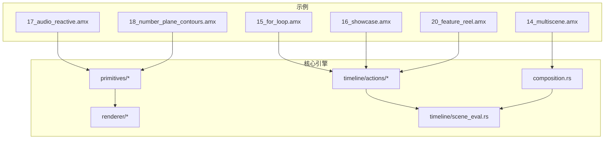
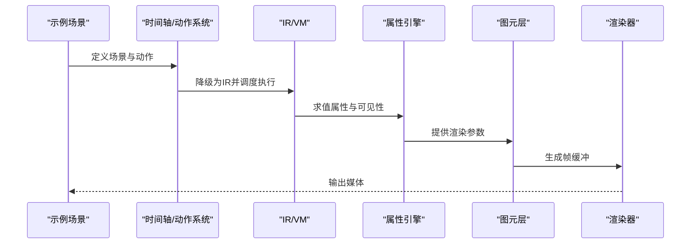
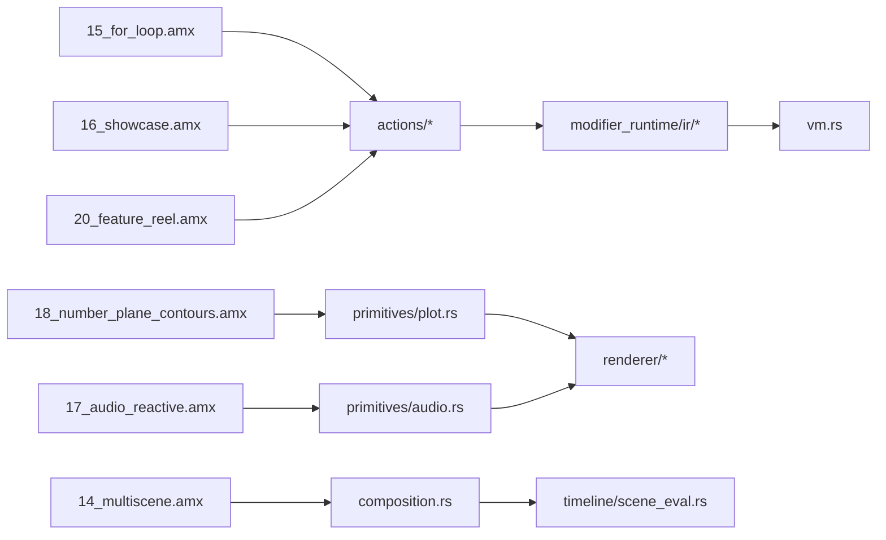

# 复杂场景示例

<cite>
**本文引用的文件**
- [examples/14_multiscene.amx](file://examples/14_multiscene.amx)
- [examples/15_for_loop.amx](file://examples/15_for_loop.amx)
- [examples/16_showcase.amx](file://examples/16_showcase.amx)
- [examples/17_audio_reactive.amx](file://examples/17_audio_reactive.amx)
- [examples/18_number_plane_contours.amx](file://examples/18_number_plane_contours.amx)
- [examples/20_feature_reel.amx](file://examples/20_feature_reel.amx)
- [crates/animatix/src/timeline/actions/effects.rs](file://crates/animatix/src/timeline/actions/effects.rs)
- [crates/animatix/src/timeline/actions/motion.rs](file://crates/animatix/src/timeline/actions/motion.rs)
- [crates/animatix/src/timeline/actions/entrance.rs](file://crates/animatix/src/timeline/actions/entrance.rs)
- [crates/animatix/src/timeline/actions/exit.rs](file://crates/animatix/src/timeline/actions/exit.rs)
- [crates/animatix/src/timeline/actions/reveal.rs](file://crates/animatix/src/timeline/actions/reveal.rs)
- [crates/animatix/src/timeline/actions/reorder.rs](file://crates/animatix/src/timeline/actions/reorder.rs)
- [crates/animatix/src/primitives/audio.rs](file://crates/animatix/src/primitives/audio.rs)
- [crates/animatix/src/primitives/plot.rs](file://crates/animatix/src/primitives/plot.rs)
- [crates/animatix/src/renderer/transition.rs](file://crates/animatix/src/renderer/transition.rs)
- [crates/animatix/src/composition.rs](file://crates/animatix/src/composition.rs)
- [crates/animatix/src/timeline/scene_eval.rs](file://crates/animatix/src/timeline/scene_eval.rs)
- [crates/animatix/src/timeline/modifier_runtime/vm.rs](file://crates/animatix/src/timeline/modifier_runtime/vm.rs)
- [crates/animatix/src/timeline/modifier_runtime/ir/lower.rs](file://crates/animatix/src/timeline/modifier_runtime/ir/lower.rs)
- [crates/animatix/src/timeline/modifier_runtime/ir/eval.rs](file://crates/animatix/src/timeline/modifier_runtime/ir/eval.rs)
- [crates/animatix/src/timeline/property_engine.rs](file://crates/animatix/src/timeline/property_engine.rs)
- [crates/animatix/src/timeline/timing.rs](file://crates/animatix/src/timeline/timing.rs)
- [crates/animatix/src/lib.rs](file://crates/animatix/src/lib.rs)
- [crates/animatix/src/main.rs](file://crates/animatix/src/main.rs)
- [crates/animatix-analyzer/src/lib.rs](file://crates/animatix-analyzer/src/lib.rs)
- [crates/animatix-gui/src/lib.rs](file://crates/animatix-gui/src/lib.rs)
- [crates/animatix-lsp/src/main.rs](file://crates/animatix-lsp/src/main.rs)
- [docs/architecture.md](file://docs/architecture.md)
- [docs/spec.md](file://docs/spec.md)
- [docs/properties.md](file://docs/properties.md)
- [docs/primitives.md](file://docs/primitives.md)
- [docs/design/runtime_plot_params.md](file://docs/design/runtime_plot_params.md)
- [docs/design/bar_chart_primitive.md](file://docs/design/bar_chart_primitive.md)
- [docs/design/curve_trace.md](file://docs/design/curve_trace.md)
- [docs/design/programmatic_actors.md](file://docs/design/programmatic_actors.md)
- [docs/design/programmatic_actors_v2.md](file://docs/design/programmatic_actors_v2.md)
- [docs/FFT_THOUGHT_EXPERIMENT.md](file://docs/FFT_THOUGHT_EXPERIMENT.md)
</cite>

## 目录
1. [引言](#引言)
2. [项目结构](#项目结构)
3. [核心组件](#核心组件)
4. [架构总览](#架构总览)
5. [详细组件分析](#详细组件分析)
6. [依赖关系分析](#依赖关系分析)
7. [性能考量](#性能考量)
8. [故障排查指南](#故障排查指南)
9. [结论](#结论)
10. [附录](#附录)

## 引言
本文件聚焦于 Animatix 的“复杂场景示例”，围绕多场景组合、循环动画、功能演示、音频响应与数学可视化等主题，系统梳理其设计思想、实现路径与工程实践。通过对官方示例与核心运行时模块的交叉验证，给出可复用的实现方案、技术难点解析与性能优化建议，帮助读者在不直接阅读源码的情况下也能高效掌握这些高级用法。

## 项目结构
Animatix 采用多 crate 组织：核心引擎、GUI 编辑器、语言服务与分析器。复杂场景示例主要位于 examples 目录中，涵盖从基础到高级的完整能力拼图；核心运行时位于 crates/animatix/src 下，包含时间轴、动作系统、渲染管线与图元层等。

**图表来源**
- [examples/14_multiscene.amx](file://examples/14_multiscene.amx)
- [examples/15_for_loop.amx](file://examples/15_for_loop.amx)
- [examples/16_showcase.amx](file://examples/16_showcase.amx)
- [examples/17_audio_reactive.amx](file://examples/17_audio_reactive.amx)
- [examples/18_number_plane_contours.amx](file://examples/18_number_plane_contours.amx)
- [examples/20_feature_reel.amx](file://examples/20_feature_reel.amx)
- [crates/animatix/src/composition.rs](file://crates/animatix/src/composition.rs)
- [crates/animatix/src/timeline/scene_eval.rs](file://crates/animatix/src/timeline/scene_eval.rs)
- [crates/animatix/src/timeline/actions/effects.rs](file://crates/animatix/src/timeline/actions/effects.rs)
- [crates/animatix/src/primitives/audio.rs](file://crates/animatix/src/primitives/audio.rs)
- [crates/animatix/src/primitives/plot.rs](file://crates/animatix/src/primitives/plot.rs)
- [crates/animatix/src/renderer/transition.rs](file://crates/animatix/src/renderer/transition.rs)

**章节来源**
- [examples/README.md](file://examples/README.md)
- [docs/architecture.md](file://docs/architecture.md)

## 核心组件
- 时间轴与动作系统：负责定义入场、出场、遮罩、重排、揭示等动作，以及效果（如滤镜、阴影）与运动轨迹控制。
- 图元层：提供文本、图像、几何形状、路径、条形图、数学绘图等原语，并支持音频与频谱可视化。
- 渲染与合成：处理离屏渲染、转场、编码输出（视频/GIF）、文本绘制与滤镜后端。
- 运行时求值：将声明式场景编译为中间表示并在虚拟机上执行，支撑属性插值、可见性剔除与关键帧求值。
- 组合与场景评估：将多个场景按顺序或条件组合，驱动整体播放流程。

**章节来源**
- [crates/animatix/src/timeline/actions/effects.rs](file://crates/animatix/src/timeline/actions/effects.rs)
- [crates/animatix/src/timeline/actions/motion.rs](file://crates/animatix/src/timeline/actions/motion.rs)
- [crates/animatix/src/timeline/actions/entrance.rs](file://crates/animatix/src/timeline/actions/entrance.rs)
- [crates/animatix/src/timeline/actions/exit.rs](file://crates/animatix/src/timeline/actions/exit.rs)
- [crates/animatix/src/timeline/actions/reveal.rs](file://crates/animatix/src/timeline/actions/reveal.rs)
- [crates/animatix/src/timeline/actions/reorder.rs](file://crates/animatix/src/timeline/actions/reorder.rs)
- [crates/animatix/src/primitives/audio.rs](file://crates/animatix/src/primitives/audio.rs)
- [crates/animatix/src/primitives/plot.rs](file://crates/animatix/src/primitives/plot.rs)
- [crates/animatix/src/renderer/transition.rs](file://crates/animatix/src/renderer/transition.rs)
- [crates/animatix/src/composition.rs](file://crates/animatix/src/composition.rs)
- [crates/animatix/src/timeline/scene_eval.rs](file://crates/animatix/src/timeline/scene_eval.rs)

## 架构总览
下图展示了复杂场景示例从“声明式场景”到“最终渲染”的关键路径：示例文件通过时间轴动作与图元定义，经由运行时求值与属性插值，最终由渲染器输出。

**图表来源**
- [crates/animatix/src/timeline/modifier_runtime/ir/lower.rs](file://crates/animatix/src/timeline/modifier_runtime/ir/lower.rs)
- [crates/animatix/src/timeline/modifier_runtime/ir/eval.rs](file://crates/animatix/src/timeline/modifier_runtime/ir/eval.rs)
- [crates/animatix/src/timeline/property_engine.rs](file://crates/animatix/src/timeline/property_engine.rs)
- [crates/animatix/src/primitives/plot.rs](file://crates/animatix/src/primitives/plot.rs)
- [crates/animatix/src/renderer/transition.rs](file://crates/animatix/src/renderer/transition.rs)

## 详细组件分析

### 多场景组合：跨场景过渡与协调
- 场景组织：通过组合模块将多个独立场景按顺序或条件串联，形成连贯叙事。
- 过渡机制：利用转场动作在场景间进行淡入淡出、滑动等视觉衔接，确保节奏稳定。
- 协调策略：共享资源（颜色方案、字体、滤镜）与统一的时间基准，避免跳变与不同步。

实现要点与参考
- 使用组合模块组织场景序列，确保每个子场景具备明确的起止时间与过渡边界。
- 在场景切换点设置对齐的关键帧，减少视觉撕裂感。
- 可结合全局计时与节拍器，使音乐与画面同步。

**章节来源**
- [examples/14_multiscene.amx](file://examples/14_multiscene.amx)
- [crates/animatix/src/composition.rs](file://crates/animatix/src/composition.rs)
- [crates/animatix/src/renderer/transition.rs](file://crates/animatix/src/renderer/transition.rs)

### for 循环动画：批量生成相似动画
- 批量模式：通过循环语法批量创建相似元素（如点阵、柱状图、重复图形），统一控制其属性分布。
- 属性映射：将循环索引映射到位置、大小、透明度、旋转等属性，形成渐变或规律变化。
- 性能优化：尽量使用向量化属性与共享变换，减少重复计算与状态开销。

实现要点与参考
- 将循环体内的动画参数化，避免硬编码差异。
- 利用属性插值与时间偏移，为每项生成微扰，增强自然感。
- 对大数量对象采用可见性剔除与批渲染策略。

**章节来源**
- [examples/15_for_loop.amx](file://examples/15_for_loop.amx)
- [crates/animatix/src/timeline/property_engine.rs](file://crates/animatix/src/timeline/property_engine.rs)
- [crates/animatix/src/timeline/timing.rs](file://crates/animatix/src/timeline/timing.rs)

### 功能演示类动画：产品介绍与演示
- 结构化叙事：以“引入—特性—对比—总结”为主线，分段落展示功能亮点。
- 视觉强调：通过揭示、高亮、缩放与路径跟随等动作突出关键信息。
- 一致性：统一风格、配色与字体，配合转场保持节奏连贯。

实现要点与参考
- 将演示拆分为若干小场景，便于独立调试与迭代。
- 使用入口/出口动作与遮罩配合，引导用户注意力。
- 配合全局时长与节拍，确保文案与画面节奏一致。

**章节来源**
- [examples/16_showcase.amx](file://examples/16_showcase.amx)
- [examples/20_feature_reel.amx](file://examples/20_feature_reel.amx)
- [crates/animatix/src/timeline/actions/reveal.rs](file://crates/animatix/src/timeline/actions/reveal.rs)
- [crates/animatix/src/timeline/actions/entrance.rs](file://crates/animatix/src/timeline/actions/entrance.rs)
- [crates/animatix/src/timeline/actions/exit.rs](file://crates/animatix/src/timeline/actions/exit.rs)

### 音频响应动画：频谱与波形可视化
- 数据接入：从音频原语读取采样数据与频域特征（如 FFT），作为动画驱动信号。
- 映射策略：将频谱幅度映射到尺寸、颜色、透明度或位移，建立听觉到视觉的对应关系。
- 实验与探索：可参考相关设计文档对频域处理进行实验性尝试。

实现要点与参考
- 将音频采样率与帧率对齐，保证实时响应。
- 使用低通/带通滤波与平滑算法，避免高频抖动。
- 可叠加多层可视化（波形+频谱+能量包络）提升表现力。

**章节来源**
- [examples/17_audio_reactive.amx](file://examples/17_audio_reactive.amx)
- [crates/animatix/src/primitives/audio.rs](file://crates/animatix/src/primitives/audio.rs)
- [docs/FFT_THOUGHT_EXPERIMENT.md](file://docs/FFT_THOUGHT_EXPERIMENT.md)

### 数学可视化：数字平面等值线动画
- 参数化函数：通过数学表达式定义二维标量场（如 f(x,y)），用于生成等值线与着色。
- 运行时参数：允许在运行时调整函数参数、采样密度与渲染范围，便于交互与探索。
- 渲染策略：采用等值线追踪与颜色映射，结合透明度与动画时间，呈现动态演进。

实现要点与参考
- 将函数表达式与采样网格解耦，支持增量更新与缓存。
- 使用插值与抗锯齿技术提升线条质量。
- 可叠加轨迹/轨迹尾迹，增强动态观感。

**章节来源**
- [examples/18_number_plane_contours.amx](file://examples/18_number_plane_contours.amx)
- [crates/animatix/src/primitives/plot.rs](file://crates/animatix/src/primitives/plot.rs)
- [docs/design/runtime_plot_params.md](file://docs/design/runtime_plot_params.md)
- [docs/design/curve_trace.md](file://docs/design/curve_trace.md)

### 跨文件场景与模块化复用
- 模块化组织：将通用组件与动作封装为模块，跨场景复用，降低维护成本。
- 文件间引用：通过模块导入机制在不同文件中共享场景片段与配置。

实现要点与参考
- 将公共颜色方案、字体与常用动作抽取为模块，集中管理。
- 使用场景别名与参数化，减少重复定义。

**章节来源**
- [examples/19_cross_file_scenes.amx](file://examples/19_cross_file_scenes.amx)
- [examples/lib/components.amx](file://examples/lib/components.amx)
- [examples/lib/actions.amx](file://examples/lib/actions.amx)

## 依赖关系分析
复杂场景示例与核心运行时之间的依赖关系如下：

**图表来源**
- [examples/14_multiscene.amx](file://examples/14_multiscene.amx)
- [examples/15_for_loop.amx](file://examples/15_for_loop.amx)
- [examples/16_showcase.amx](file://examples/16_showcase.amx)
- [examples/17_audio_reactive.amx](file://examples/17_audio_reactive.amx)
- [examples/18_number_plane_contours.amx](file://examples/18_number_plane_contours.amx)
- [examples/20_feature_reel.amx](file://examples/20_feature_reel.amx)
- [crates/animatix/src/composition.rs](file://crates/animatix/src/composition.rs)
- [crates/animatix/src/timeline/actions/effects.rs](file://crates/animatix/src/timeline/actions/effects.rs)
- [crates/animatix/src/timeline/actions/motion.rs](file://crates/animatix/src/timeline/actions/motion.rs)
- [crates/animatix/src/timeline/modifier_runtime/vm.rs](file://crates/animatix/src/timeline/modifier_runtime/vm.rs)
- [crates/animatix/src/timeline/modifier_runtime/ir/lower.rs](file://crates/animatix/src/timeline/modifier_runtime/ir/lower.rs)
- [crates/animatix/src/timeline/modifier_runtime/ir/eval.rs](file://crates/animatix/src/timeline/modifier_runtime/ir/eval.rs)
- [crates/animatix/src/primitives/audio.rs](file://crates/animatix/src/primitives/audio.rs)
- [crates/animatix/src/primitives/plot.rs](file://crates/animatix/src/primitives/plot.rs)
- [crates/animatix/src/renderer/transition.rs](file://crates/animatix/src/renderer/transition.rs)
- [crates/animatix/src/timeline/scene_eval.rs](file://crates/animatix/src/timeline/scene_eval.rs)

**章节来源**
- [crates/animatix/src/timeline/modifier_runtime/ir/lower.rs](file://crates/animatix/src/timeline/modifier_runtime/ir/lower.rs)
- [crates/animatix/src/timeline/modifier_runtime/ir/eval.rs](file://crates/animatix/src/timeline/modifier_runtime/ir/eval.rs)
- [crates/animatix/src/timeline/modifier_runtime/vm.rs](file://crates/animatix/src/timeline/modifier_runtime/vm.rs)

## 性能考量
- 属性插值与缓存：合理使用属性缓存与插值预计算，减少每帧重复计算。
- 可见性剔除：对超出视窗或透明度为零的对象提前剔除，降低渲染负担。
- 批渲染与共享资源：合并相似图元、共享纹理与着色器，减少状态切换。
- 大规模对象：对 for 循环生成的大对象群，优先采用实例化与向量化属性。
- 音频响应：对频域计算进行降采样与平滑，避免高频抖动带来的额外计算。
- 渲染分辨率：根据目标平台选择合适分辨率，平衡画质与性能。

[本节为通用指导，无需特定文件来源]

## 故障排查指南
- 场景跳变或不同步：检查场景边界与关键帧对齐，确认转场时长与节拍一致。
- 动作异常或闪烁：核查入口/出口/遮罩动作的时序与参数，避免重叠与冲突。
- 音频不同步：核对采样率与帧率匹配，检查音频原语的缓冲与延迟。
- 数学可视化卡顿：降低采样密度或启用增量更新，减少每帧计算量。
- 导出问题：检查编码器配置与目标格式，必要时降低分辨率或帧率。

**章节来源**
- [crates/animatix/src/timeline/actions/entrance.rs](file://crates/animatix/src/timeline/actions/entrance.rs)
- [crates/animatix/src/timeline/actions/exit.rs](file://crates/animatix/src/timeline/actions/exit.rs)
- [crates/animatix/src/timeline/actions/reveal.rs](file://crates/animatix/src/timeline/actions/reveal.rs)
- [crates/animatix/src/primitives/audio.rs](file://crates/animatix/src/primitives/audio.rs)
- [crates/animatix/src/primitives/plot.rs](file://crates/animatix/src/primitives/plot.rs)

## 结论
通过多场景组合、for 循环批量生成、功能演示叙事、音频响应与数学可视化等复杂场景示例，Animatix 提供了从创作到渲染的一体化能力。结合本文的实现方案、技术难点解析与性能建议，可在实际项目中快速搭建高质量的动画内容，并保持良好的可维护性与扩展性。

[本节为总结，无需特定文件来源]

## 附录
- 设计文档与规范：可进一步研读架构、规格与原语设计文档，深化对运行时与图元层的理解。
- 示例清单：从入门到进阶的示例集合，便于按需查阅与复用。

**章节来源**
- [docs/architecture.md](file://docs/architecture.md)
- [docs/spec.md](file://docs/spec.md)
- [docs/primitives.md](file://docs/primitives.md)
- [docs/properties.md](file://docs/properties.md)
- [docs/design/runtime_plot_params.md](file://docs/design/runtime_plot_params.md)
- [docs/design/bar_chart_primitive.md](file://docs/design/bar_chart_primitive.md)
- [docs/design/curve_trace.md](file://docs/design/curve_trace.md)
- [docs/design/programmatic_actors.md](file://docs/design/programmatic_actors.md)
- [docs/design/programmatic_actors_v2.md](file://docs/design/programmatic_actors_v2.md)
- [docs/FFT_THOUGHT_EXPERIMENT.md](file://docs/FFT_THOUGHT_EXPERIMENT.md)